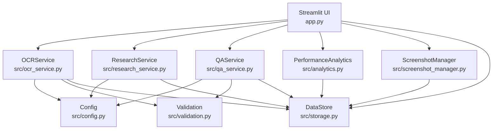
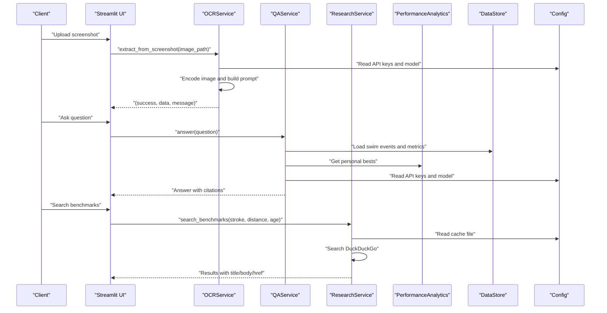
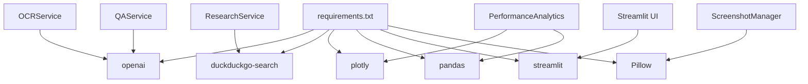

# API Reference

<cite>
**Referenced Files in This Document**
- [README.md](file://README.md)
- [app.py](file://app.py)
- [src/config.py](file://src/config.py)
- [src/models.py](file://src/models.py)
- [src/storage.py](file://src/storage.py)
- [src/screenshot_manager.py](file://src/screenshot_manager.py)
- [src/validation.py](file://src/validation.py)
- [src/ocr_service.py](file://src/ocr_service.py)
- [src/research_service.py](file://src/research_service.py)
- [src/qa_service.py](file://src/qa_service.py)
- [src/analytics.py](file://src/analytics.py)
- [requirements.txt](file://requirements.txt)
</cite>

## Table of Contents
1. [Introduction](#introduction)
2. [Project Structure](#project-structure)
3. [Core Components](#core-components)
4. [Architecture Overview](#architecture-overview)
5. [Detailed Component Analysis](#detailed-component-analysis)
6. [Dependency Analysis](#dependency-analysis)
7. [Performance Considerations](#performance-considerations)
8. [Troubleshooting Guide](#troubleshooting-guide)
9. [Conclusion](#conclusion)
10. [Appendices](#appendices)

## Introduction
This document provides a comprehensive API reference for the Swimming Data Analysis Platform. It covers the OCR service for extracting structured swimming data from screenshots, the research service for benchmark search and comparison, the Q&A service for natural language processing, and the analytics service for performance calculations and visualizations. It includes method signatures, parameter specifications, response formats, request/response examples, error handling patterns, rate limiting considerations, authentication requirements, API versioning, backward compatibility, and client implementation guidelines.

## Project Structure
The platform is a Streamlit application that orchestrates multiple services:
- OCR service: Vision-language model-based extraction from screenshots.
- Research service: DuckDuckGo search-backed benchmark discovery with caching.
- Q&A service: Natural language assistant powered by a text model.
- Analytics service: Data-driven visualizations and performance metrics.
- Storage and models: Local JSON persistence and data models.
- Screenshot management: Upload, deduplication, and thumbnail generation.

**Diagram sources**
- [app.py:1-447](file://app.py#L1-L447)
- [src/ocr_service.py:1-144](file://src/ocr_service.py#L1-L144)
- [src/research_service.py:1-94](file://src/research_service.py#L1-L94)
- [src/qa_service.py:1-174](file://src/qa_service.py#L1-L174)
- [src/analytics.py:1-184](file://src/analytics.py#L1-L184)
- [src/screenshot_manager.py:1-136](file://src/screenshot_manager.py#L1-L136)
- [src/config.py:1-29](file://src/config.py#L1-L29)
- [src/validation.py:1-103](file://src/validation.py#L1-L103)
- [src/storage.py:1-107](file://src/storage.py#L1-L107)

**Section sources**
- [README.md:1-63](file://README.md#L1-L63)
- [app.py:1-447](file://app.py#L1-L447)

## Core Components
- OCR Service: Vision-language extraction from screenshots to structured swim event data.
- Research Service: Benchmark search and comparison with cached results.
- Q&A Service: Natural language assistant with conversation history and data context.
- Analytics Service: Time progression charts, stroke comparison radar, personal bests, and summary statistics.
- Storage Layer: JSON-based persistence for swim events, body metrics, and screenshot index.
- Models: Typed data models for swim events and body metrics.
- Validation Utilities: Time format validation and conversions.
- Screenshot Manager: Upload, deduplication, and thumbnail generation.

**Section sources**
- [src/ocr_service.py:12-144](file://src/ocr_service.py#L12-L144)
- [src/research_service.py:10-94](file://src/research_service.py#L10-L94)
- [src/qa_service.py:12-174](file://src/qa_service.py#L12-L174)
- [src/analytics.py:13-184](file://src/analytics.py#L13-L184)
- [src/storage.py:10-107](file://src/storage.py#L10-L107)
- [src/models.py:7-55](file://src/models.py#L7-L55)
- [src/validation.py:7-103](file://src/validation.py#L7-L103)
- [src/screenshot_manager.py:14-136](file://src/screenshot_manager.py#L14-L136)

## Architecture Overview
The application integrates external AI services (Alibaba Cloud Model Studio) for OCR and Q&A, DuckDuckGo for research, and local storage for data persistence. The UI routes requests to services, which handle data validation, transformations, and responses.

**Diagram sources**
- [app.py:60-403](file://app.py#L60-L403)
- [src/ocr_service.py:49-120](file://src/ocr_service.py#L49-L120)
- [src/qa_service.py:76-134](file://src/qa_service.py#L76-L134)
- [src/research_service.py:32-53](file://src/research_service.py#L32-L53)
- [src/analytics.py:115-138](file://src/analytics.py#L115-L138)
- [src/storage.py:31-61](file://src/storage.py#L31-L61)
- [src/config.py:20-24](file://src/config.py#L20-L24)

## Detailed Component Analysis

### OCR Service API
Purpose: Extract structured swimming data from screenshots using Alibaba Cloud Model Studio’s Qwen vision-language model.

- Authentication
  - Environment variables: ALIBABA_CLOUD_API_KEY, ALIBABA_CLOUD_BASE_URL, QWEN_MODEL_NAME.
  - Behavior: If ALIBABA_CLOUD_API_KEY is not set, extraction returns an error message.

- Method: extract_from_screenshot(image_path)
  - Parameters
    - image_path: string, absolute or relative path to the screenshot.
  - Returns
    - Tuple of (success: bool, extracted_data: dict, message: string).
    - On success, extracted_data includes:
      - Structured swim event fields (date, meet_name, stroke, distance, time, splits, course, round, rank, age_group, heat_lane, swimmer_name).
      - Confidence metadata: _extraction_confidence (field-level confidence scores).
      - Validation errors: _extraction_errors (list of validation issues).
    - On failure, message describes the error; raw response may be included for debugging.

- Manual Entry Form Fields
  - Provides UI-friendly field definitions for manual fallback entry.

- Request/Response Examples
  - Successful extraction returns a validated swim event object with confidence and validation metadata.
  - Failure returns a tuple indicating error and a descriptive message.

- Error Handling
  - Missing API key: explicit error message.
  - JSON parsing failures: includes raw response for inspection.
  - General exceptions: caught and reported with a failure message.

- Rate Limiting
  - Not exposed by the service; depends on Alibaba Cloud quotas. Consider batching and retries in clients.

- Backward Compatibility
  - Output schema includes confidence and validation metadata fields prefixed with underscore to minimize breaking changes.

**Section sources**
- [src/ocr_service.py:12-144](file://src/ocr_service.py#L12-L144)
- [src/config.py:20-24](file://src/config.py#L20-L24)
- [src/validation.py:75-103](file://src/validation.py#L75-L103)

### Research Service API
Purpose: Search age-group swimming benchmarks and compare against personal bests.

- Endpoints and Methods
  - search_benchmarks(stroke: string, distance: int, age: int, gender: string = "female") -> List[Dict]
    - Parameters
      - stroke: one of freestyle, backstroke, breaststroke, butterfly, IM.
      - distance: integer meters (50, 100, 200, 400, 800, 1500).
      - age: integer age.
      - gender: optional, defaults to female.
    - Returns
      - List of search results with keys: title, body, href.
      - Results are cached under RESEARCH_CACHE_FILE keyed by stroke_distance_age_gender.
  - get_comparison(stroke: string, distance: int, age: int, gender: string = "female") -> Dict
    - Returns
      - Dictionary containing stroke, distance, personal_best, pb_date, age, gender, benchmarks, and note.
      - If no personal best is found, returns an error indicator.
  - add_manual_benchmark_url(url: string, description: string) -> None
    - Adds a manual URL to the cache under manual_urls.

- Request/Response Examples
  - search_benchmarks returns a list of results with title/body/href.
  - get_comparison returns a structured comparison including personal best and benchmark references.

- Error Handling
  - DuckDuckGo search errors are caught and returned as a single error result.
  - Cache load/save handles JSON decode and IO errors gracefully.

- Rate Limiting
  - Depends on DuckDuckGo search limits. Consider client-side throttling and caching.

- Backward Compatibility
  - Cache keys include gender to support future extensions without breaking existing keys.

**Section sources**
- [src/research_service.py:10-94](file://src/research_service.py#L10-L94)
- [src/config.py:14](file://src/config.py#L14)

### Q&A Service API
Purpose: Natural language assistant answering questions about swimming data using Alibaba Cloud Model Studio.

- Authentication
  - Environment variables: ALIBABA_CLOUD_API_KEY, ALIBABA_CLOUD_BASE_URL, QWEN_TEXT_MODEL_NAME.
  - Behavior: If ALIBABA_CLOUD_API_KEY is not set, returns an explicit error message.

- Methods
  - answer(question: string) -> string
    - Builds a data context from swim events, body metrics, and personal bests.
    - Classifies query type (personal_best, trend, comparison, advice, rank, general).
    - Sends a system prompt with data context and conversation history to the text model.
    - Returns the assistant’s answer and appends it to conversation history.
  - clear_history() -> None
    - Clears conversation history.
  - get_personal_best_answer(stroke: string, distance: int) -> string
    - Direct retrieval for personal best queries.
  - get_trend_answer(stroke: string) -> string
    - Direct retrieval for trend queries with improvement percentage.

- Request/Response Examples
  - answer returns a natural language answer with data citations.
  - get_personal_best_answer returns a concise statement with date and meet.
  - get_trend_answer returns a trend interpretation with improvement percentage.

- Error Handling
  - Out-of-scope questions are handled with a friendly message.
  - API errors are caught and returned as a user-friendly message.
  - Missing API key triggers a configuration warning.

- Rate Limiting
  - Depends on Alibaba Cloud quotas. Clients should implement retry/backoff.

- Backward Compatibility
  - Conversation history appended messages are stored as role/content pairs for extensibility.

**Section sources**
- [src/qa_service.py:12-174](file://src/qa_service.py#L12-L174)
- [src/config.py:20-24](file://src/config.py#L20-L24)
- [src/analytics.py:115-138](file://src/analytics.py#L115-L138)
- [src/storage.py:31-61](file://src/storage.py#L31-L61)

### Analytics Service API
Purpose: Generate performance visualizations and calculate metrics.

- Methods
  - get_events_df() -> pd.DataFrame
    - Loads swim events and adds derived columns: time_seconds, date as datetime.
  - get_time_progression(stroke: string?, distance: int?) -> pd.DataFrame
    - Filters events by stroke and/or distance and sorts by date.
  - create_time_progression_chart(stroke: string, distance: int) -> plotly.graph_objects.Figure
    - Creates a line chart of time progression with hover template showing formatted time.
  - get_stroke_comparison_data() -> pd.DataFrame
    - Aggregates best times per stroke and counts.
  - create_stroke_radar_chart() -> plotly.graph_objects.Figure
    - Creates a radar chart with normalized scores (higher is better).
  - get_personal_bests() -> pd.DataFrame
    - Returns personal bests for each stroke-distance-course combination.
  - get_age_adjusted_performance() -> pd.DataFrame
    - Calculates improvement rates across grouped events.
  - get_dashboard_summary() -> Dict
    - Returns summary stats: total_meets, total_events, personal_bests, strokes, latest_event.

- Request/Response Examples
  - Chart creation returns Plotly figures suitable for rendering in Streamlit.
  - DataFrames can be rendered directly in Streamlit dataframes.

- Error Handling
  - Empty datasets return empty structures (empty DataFrame or empty figure).

- Rate Limiting
  - No server-side rate limiting; depends on client rendering and data volume.

- Backward Compatibility
  - Methods return standardized structures; new metrics can be added without changing existing signatures.

**Section sources**
- [src/analytics.py:13-184](file://src/analytics.py#L13-L184)

### Storage and Models
- DataStore
  - load_swim_events(), save_swim_events(), add_swim_event(): swim events persistence.
  - load_body_metrics(), save_body_metrics(), add_body_metric(): body metrics persistence.
- ScreenshotIndex
  - load(), save(), add(), list_all(), get_by_path(), remove_by_path(): screenshot metadata index.
- Models
  - SwimEvent: structured swim event with conversion helpers.
  - BodyMetrics: body measurements with BMI property.

**Section sources**
- [src/storage.py:10-107](file://src/storage.py#L10-L107)
- [src/models.py:7-55](file://src/models.py#L7-L55)

### Screenshot Management
- save_uploaded_screenshot(uploaded_file, meet_name, event_date) -> Tuple[bool, str]
  - Saves screenshot to organized directory structure, computes checksum, detects duplicates, and updates index.
- list_screenshots() -> List[Dict]
  - Lists all screenshots with metadata.
- get_screenshot_thumbnail(screenshot_path, size) -> Optional[PIL.Image]
  - Generates a thumbnail for UI display.
- delete_screenshot(screenshot_path) -> Tuple[bool, str]
  - Removes file and metadata, cleans up empty directories.
- get_screenshot_count() -> int

**Section sources**
- [src/screenshot_manager.py:14-136](file://src/screenshot_manager.py#L14-L136)

## Dependency Analysis
External dependencies and integrations:
- Alibaba Cloud Model Studio (OpenAI-compatible client)
  - Used by OCRService and QAService for vision-language and text completions.
- DuckDuckGo Search
  - Used by ResearchService for benchmark discovery.
- Plotly and Pandas
  - Used by AnalyticsService for visualizations and data manipulation.
- Pillow
  - Used by ScreenshotManager for thumbnails.
- Streamlit
  - UI orchestration and rendering.

**Diagram sources**
- [requirements.txt:1-10](file://requirements.txt#L1-L10)
- [src/ocr_service.py:6](file://src/ocr_service.py#L6)
- [src/qa_service.py:4](file://src/qa_service.py#L4)
- [src/research_service.py:4](file://src/research_service.py#L4)
- [src/analytics.py:5](file://src/analytics.py#L5)
- [src/screenshot_manager.py:7](file://src/screenshot_manager.py#L7)
- [app.py:6](file://app.py#L6)

**Section sources**
- [requirements.txt:1-10](file://requirements.txt#L1-L10)

## Performance Considerations
- OCR and Q&A
  - Expect latency from external API calls; consider caching responses and batching requests.
  - Temperature and max_tokens are tuned for deterministic extraction and concise answers.
- Research
  - DuckDuckGo search may be rate-limited; implement client-side throttling and leverage cache.
- Analytics
  - Chart rendering performance scales with dataset size; pre-aggregate where possible.
- Storage
  - JSON reads/writes are synchronous; consider async alternatives for high throughput.

[No sources needed since this section provides general guidance]

## Troubleshooting Guide
- Authentication Issues
  - Ensure ALIBABA_CLOUD_API_KEY is set; otherwise OCR/QA will return configuration warnings.
- OCR Extraction Failures
  - Verify image encoding and that the model name/environment base URL are correct.
  - Inspect raw response in the returned data for debugging.
- Research Search Errors
  - DuckDuckGo errors are captured and returned as a single error result; retry later.
- Q&A Out-of-Scope Questions
  - The assistant returns a friendly message; refine prompts or data context to improve coverage.
- Storage Errors
  - JSON decode or IO errors are handled gracefully; check file permissions and disk space.

**Section sources**
- [src/ocr_service.py:55-119](file://src/ocr_service.py#L55-L119)
- [src/qa_service.py:87-134](file://src/qa_service.py#L87-L134)
- [src/research_service.py:52-53](file://src/research_service.py#L52-L53)
- [src/storage.py:14-27](file://src/storage.py#L14-L27)

## Conclusion
The Swimming Data Analysis Platform provides a cohesive suite of services for OCR-based data extraction, research benchmarking, natural language Q&A, and performance analytics. The APIs are designed for simplicity and extensibility, with clear error handling and local persistence. Clients should configure authentication, implement rate limiting, and leverage caching for optimal performance.

[No sources needed since this section summarizes without analyzing specific files]

## Appendices

### API Versioning and Backward Compatibility
- Versioning
  - No explicit API versioning is implemented in the codebase.
- Backward Compatibility
  - OCR output includes confidence and validation metadata fields prefixed with underscore to avoid breaking changes.
  - Research cache keys include gender to support future extensions.
  - Analytics methods return standardized structures; new metrics can be added without altering existing signatures.

**Section sources**
- [src/ocr_service.py:110-114](file://src/ocr_service.py#L110-L114)
- [src/research_service.py:38](file://src/research_service.py#L38)

### Client Implementation Guidelines
- Authentication
  - Set ALIBABA_CLOUD_API_KEY and optionally ALIBABA_CLOUD_BASE_URL and model names via environment variables.
- OCR
  - Prepare image bytes, encode to base64, and call extract_from_screenshot with the image path.
  - Handle returned confidence and validation metadata for quality checks.
- Research
  - Call search_benchmarks with stroke, distance, age, and optional gender.
  - Use get_comparison to compare personal bests against benchmarks.
- Q&A
  - Call answer with a natural language question; append follow-ups to the same service instance to maintain context.
  - Use get_personal_best_answer and get_trend_answer for direct data retrieval.
- Analytics
  - Use get_time_progression and create_time_progression_chart for time series visualizations.
  - Use get_stroke_comparison_data and create_stroke_radar_chart for comparative analysis.
- Storage
  - Use DataStore for CRUD operations on swim events and body metrics.
  - Use ScreenshotIndex for managing screenshot metadata.

**Section sources**
- [src/config.py:20-24](file://src/config.py#L20-L24)
- [src/ocr_service.py:49-120](file://src/ocr_service.py#L49-L120)
- [src/research_service.py:32-84](file://src/research_service.py#L32-L84)
- [src/qa_service.py:76-174](file://src/qa_service.py#L76-L174)
- [src/analytics.py:30-184](file://src/analytics.py#L30-L184)
- [src/storage.py:31-61](file://src/storage.py#L31-L61)

### Request/Response Examples (Paths)
- OCR
  - Successful extraction: [src/ocr_service.py:106-116](file://src/ocr_service.py#L106-L116)
  - Failure with JSON parsing error: [src/ocr_service.py:103-104](file://src/ocr_service.py#L103-L104)
- Research
  - Benchmark search: [src/research_service.py:44-53](file://src/research_service.py#L44-L53)
  - Comparison result: [src/research_service.py:75-84](file://src/research_service.py#L75-L84)
- Q&A
  - Answer with citations: [src/qa_service.py:117-131](file://src/qa_service.py#L117-L131)
  - Personal best answer: [src/qa_service.py:141-150](file://src/qa_service.py#L141-L150)
  - Trend answer: [src/qa_service.py:152-173](file://src/qa_service.py#L152-L173)
- Analytics
  - Time progression chart: [src/analytics.py:43-60](file://src/analytics.py#L43-L60)
  - Stroke radar chart: [src/analytics.py:91-112](file://src/analytics.py#L91-L112)
  - Personal bests: [src/analytics.py:115-138](file://src/analytics.py#L115-L138)

**Section sources**
- [src/ocr_service.py:49-120](file://src/ocr_service.py#L49-L120)
- [src/research_service.py:32-84](file://src/research_service.py#L32-L84)
- [src/qa_service.py:76-174](file://src/qa_service.py#L76-L174)
- [src/analytics.py:43-138](file://src/analytics.py#L43-L138)