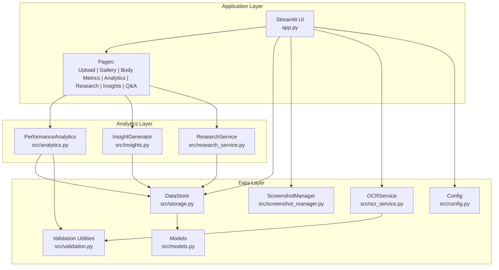
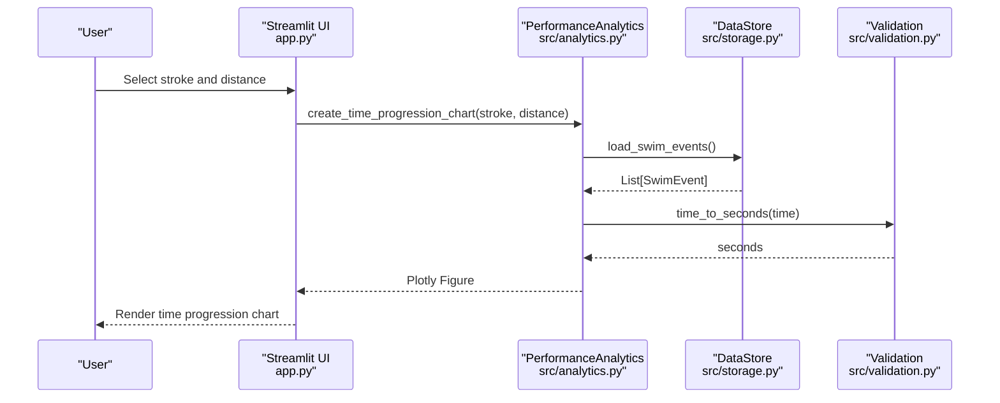
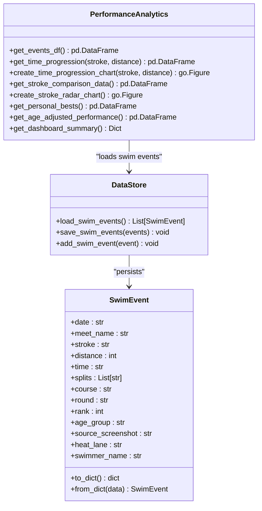
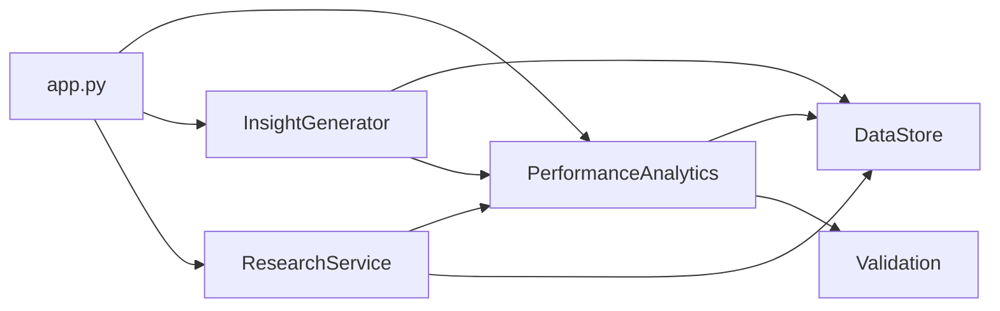

# Analytics Service API

<cite>
**Referenced Files in This Document**
- [analytics.py](file://src/analytics.py)
- [models.py](file://src/models.py)
- [storage.py](file://src/storage.py)
- [validation.py](file://src/validation.py)
- [config.py](file://src/config.py)
- [app.py](file://app.py)
- [insights.py](file://src/insights.py)
- [research_service.py](file://src/research_service.py)
- [screenshot_manager.py](file://src/screenshot_manager.py)
- [ocr_service.py](file://src/ocr_service.py)
- [README.md](file://README.md)
- [requirements.txt](file://requirements.txt)
</cite>

## Table of Contents
1. [Introduction](#introduction)
2. [Project Structure](#project-structure)
3. [Core Components](#core-components)
4. [Architecture Overview](#architecture-overview)
5. [Detailed Component Analysis](#detailed-component-analysis)
6. [Dependency Analysis](#dependency-analysis)
7. [Performance Considerations](#performance-considerations)
8. [Troubleshooting Guide](#troubleshooting-guide)
9. [Conclusion](#conclusion)
10. [Appendices](#appendices)

## Introduction
This document provides comprehensive API documentation for the Analytics Service within the Swimming Data Analysis Platform. It focuses on performance analytics capabilities including time progression analysis, stroke comparison algorithms, personal best tracking, and visualization generation. It also documents the analytics workflow from raw swim data to visual representations, method signatures for performance metrics calculation, trend analysis functions, comparative analysis tools, and integration patterns with the storage service and UI components.

## Project Structure
The Analytics Service is implemented as a cohesive module within the application, with clear separation of concerns:
- Data models define swim event structures and body metrics.
- Storage layer persists swim events and body metrics to JSON files.
- Validation utilities convert time formats and validate data integrity.
- Analytics module encapsulates performance calculations and visualization generation.
- UI integrates analytics outputs into Streamlit pages for user consumption.
- Supporting services handle OCR extraction, research benchmarking, and screenshot management.

**Diagram sources**
- [app.py:1-447](file://app.py#L1-L447)
- [analytics.py:13-184](file://src/analytics.py#L13-L184)
- [insights.py:11-150](file://src/insights.py#L11-L150)
- [research_service.py:10-94](file://src/research_service.py#L10-L94)
- [storage.py:10-107](file://src/storage.py#L10-L107)
- [screenshot_manager.py:14-136](file://src/screenshot_manager.py#L14-L136)
- [ocr_service.py:12-144](file://src/ocr_service.py#L12-L144)
- [validation.py:1-103](file://src/validation.py#L1-L103)
- [config.py:1-29](file://src/config.py#L1-L29)
- [models.py:7-55](file://src/models.py#L7-L55)

**Section sources**
- [README.md:1-63](file://README.md#L1-L63)
- [requirements.txt:1-10](file://requirements.txt#L1-L10)

## Core Components
This section outlines the primary analytics components and their responsibilities:
- PerformanceAnalytics: Loads swim events, computes time progression, stroke comparison, personal bests, age-adjusted performance, and dashboard summaries.
- InsightGenerator: Generates trend insights, identifies strengths/weaknesses, assesses potential, and suggests training drills.
- ResearchService: Searches benchmark resources and compares personal bests against benchmarks.
- DataStore: Provides JSON-backed persistence for swim events and body metrics.
- Validation utilities: Convert time formats and validate data integrity.
- Models: Define SwimEvent and BodyMetrics data structures.
- UI integration: Exposes analytics outputs through Streamlit pages.

Key responsibilities:
- Data ingestion and preprocessing: Load swim events, convert time strings to seconds, and normalize dates.
- Calculation methods: Time progression, stroke comparison averages, personal bests, and improvement rates.
- Visualization generation: Line charts for time progression, radar charts for stroke comparison, and summary metrics.
- Comparative analysis: Benchmark search and performance vs. benchmarks.
- Output formatting: Pandas DataFrames and Plotly figures for UI rendering.

**Section sources**
- [analytics.py:13-184](file://src/analytics.py#L13-L184)
- [insights.py:11-150](file://src/insights.py#L11-L150)
- [research_service.py:10-94](file://src/research_service.py#L10-L94)
- [storage.py:10-107](file://src/storage.py#L10-L107)
- [validation.py:1-103](file://src/validation.py#L1-L103)
- [models.py:7-55](file://src/models.py#L7-L55)

## Architecture Overview
The Analytics Service follows a layered architecture:
- UI layer renders analytics dashboards and collects user selections.
- Analytics layer performs calculations and generates visualizations.
- Data layer persists and retrieves swim events and body metrics.
- Supporting services handle OCR extraction and research benchmarking.

**Diagram sources**
- [app.py:226-280](file://app.py#L226-L280)
- [analytics.py:42-60](file://src/analytics.py#L42-L60)
- [storage.py:30-44](file://src/storage.py#L30-L44)
- [validation.py:26-43](file://src/validation.py#L26-L43)

## Detailed Component Analysis

### PerformanceAnalytics
Responsibilities:
- Load swim events into a DataFrame with computed time in seconds and parsed dates.
- Filter time progression data by stroke and distance.
- Generate time progression line charts with hover templates.
- Aggregate stroke comparison data and produce radar charts.
- Compute personal bests per stroke-distance-course combination.
- Calculate age-adjusted performance metrics including improvement percentages.
- Provide dashboard summary statistics.

Key methods and signatures:
- get_events_df() -> pd.DataFrame
- get_time_progression(stroke: str = None, distance: int = None) -> pd.DataFrame
- create_time_progression_chart(stroke: str, distance: int) -> go.Figure
- get_stroke_comparison_data() -> pd.DataFrame
- create_stroke_radar_chart() -> go.Figure
- get_personal_bests() -> pd.DataFrame
- get_age_adjusted_performance() -> pd.DataFrame
- get_dashboard_summary() -> Dict[str, Any]

Processing logic highlights:
- Time progression analysis: Filters events by stroke and distance, sorts by date, and prepares a line chart with seconds-to-time conversion for hover labels.
- Stroke comparison: Groups by stroke, calculates average times, normalizes scores so lower is better, and renders a radar chart.
- Personal best tracking: Iterates events to keep the fastest time per stroke-distance-course tuple, preserving associated metadata.
- Age-adjusted performance: Groups by stroke-distance-course combinations, computes improvement percentage between first and last times, and aggregates results.

Visualization generation:
- Uses Plotly Express for line charts and Plotly Graph Objects for radar charts.
- Custom hover templates and axis configurations for readability.

Data filtering and aggregation:
- Supports filtering by stroke and distance for time progression.
- Aggregates by stroke for radar charts and by stroke-distance-course for personal bests.
- Computes improvement rates per event key derived from stroke, distance, and course.

Output formatting:
- Returns DataFrames for tabular displays and Plotly figures for interactive charts.
- Dashboard summary includes counts and latest event date.

**Section sources**
- [analytics.py:13-184](file://src/analytics.py#L13-L184)

#### Class Diagram

**Diagram sources**
- [analytics.py:13-184](file://src/analytics.py#L13-L184)
- [storage.py:30-44](file://src/storage.py#L30-L44)
- [models.py:7-30](file://src/models.py#L7-L30)

### InsightGenerator
Responsibilities:
- Generate trend insights by comparing first and last times per stroke-distance-course.
- Identify strengths and weaknesses by computing average pace per stroke.
- Assess potential based on trend counts, consistency, and strengths.
- Provide training suggestions aligned with identified weaknesses.

Key methods and signatures:
- generate_trend_insights() -> List[Dict[str, Any]]
- identify_strengths_weaknesses() -> Dict[str, Any]
- assess_potential() -> Dict[str, Any]
- get_training_suggestions() -> List[Dict[str, Any]]

Processing logic highlights:
- Trend insights: Groups events by stroke-distance-course, orders by date, computes improvement percentage, and categorizes as positive, warning, or neutral.
- Strengths/weaknesses: Computes average time per meter per stroke and ranks strokes by pace.
- Potential assessment: Counts positive trends, determines consistency thresholds, and generates trajectory and recommendation.
- Training suggestions: Provides stroke-specific drills and general endurance training.

**Section sources**
- [insights.py:11-150](file://src/insights.py#L11-L150)

### ResearchService
Responsibilities:
- Search benchmark resources using DuckDuckGo search.
- Cache search results to reduce repeated network calls.
- Compare personal bests against benchmarks and provide percentile estimates note.

Key methods and signatures:
- search_benchmarks(stroke: str, distance: int, age: int, gender: str = "female") -> List[Dict[str, Any]]
- get_comparison(stroke: str, distance: int, age: int, gender: str = "female") -> Dict[str, Any]
- add_manual_benchmark_url(url: str, description: str) -> None

Processing logic highlights:
- Caches results keyed by stroke, distance, age, and gender.
- Uses DuckDuckGo search to retrieve benchmark references.
- Retrieves personal bests via PerformanceAnalytics and constructs comparison results.

**Section sources**
- [research_service.py:10-94](file://src/research_service.py#L10-L94)

### DataStore and Models
Responsibilities:
- Persist and load swim events and body metrics to/from JSON files.
- Provide data structures for swim events and body metrics.

Key methods and signatures:
- DataStore.load_swim_events() -> List[SwimEvent]
- DataStore.save_swim_events(events: List[SwimEvent]) -> None
- DataStore.add_swim_event(event: SwimEvent) -> None
- DataStore.load_body_metrics() -> List[BodyMetrics]
- DataStore.save_body_metrics(metrics: List[BodyMetrics]) -> None
- DataStore.add_body_metric(metric: BodyMetrics) -> None
- SwimEvent.to_dict() -> dict
- SwimEvent.from_dict(data: dict) -> SwimEvent
- BodyMetrics.to_dict() -> dict
- BodyMetrics.from_dict(data: dict) -> BodyMetrics
- BodyMetrics.bmi property -> float

**Section sources**
- [storage.py:10-107](file://src/storage.py#L10-L107)
- [models.py:7-55](file://src/models.py#L7-L55)

### Validation Utilities
Responsibilities:
- Validate time formats (MM:SS.ss or SS.ss).
- Convert time strings to seconds and vice versa.
- Validate required fields and swim event data.

Key methods and signatures:
- validate_time_format(time_str: str) -> Tuple[bool, str]
- time_to_seconds(time_str: str) -> float
- seconds_to_time(total_seconds: float) -> str
- validate_required_fields(data: dict, required: list) -> Tuple[bool, list]
- validate_swim_event_data(data: dict) -> Tuple[bool, list]

**Section sources**
- [validation.py:1-103](file://src/validation.py#L1-L103)

### UI Integration (app.py)
Responsibilities:
- Render analytics dashboards including time progression, stroke comparison, and personal bests.
- Collect user selections for stroke and distance.
- Display summary metrics and interactive charts.

Key integration points:
- Analytics page loads swim events, computes dashboard summary, and renders charts.
- Uses PerformanceAnalytics methods to generate figures and DataFrames.

**Section sources**
- [app.py:226-280](file://app.py#L226-L280)

## Dependency Analysis
The Analytics Service exhibits low coupling and high cohesion:
- PerformanceAnalytics depends on DataStore for data access and validation utilities for time conversions.
- InsightGenerator depends on DataStore and PerformanceAnalytics for trend insights.
- ResearchService depends on PerformanceAnalytics for personal bests and on external search APIs for benchmarks.
- UI integration orchestrates analytics outputs for visualization.

**Diagram sources**
- [analytics.py:13-184](file://src/analytics.py#L13-L184)
- [insights.py:11-150](file://src/insights.py#L11-L150)
- [research_service.py:10-94](file://src/research_service.py#L10-L94)
- [storage.py:10-107](file://src/storage.py#L10-L107)
- [validation.py:1-103](file://src/validation.py#L1-L103)
- [app.py:226-280](file://app.py#L226-L280)

**Section sources**
- [analytics.py:13-184](file://src/analytics.py#L13-L184)
- [insights.py:11-150](file://src/insights.py#L11-L150)
- [research_service.py:10-94](file://src/research_service.py#L10-L94)
- [storage.py:10-107](file://src/storage.py#L10-L107)
- [validation.py:1-103](file://src/validation.py#L1-L103)
- [app.py:226-280](file://app.py#L226-L280)

## Performance Considerations
- Data loading: DataFrame construction and time conversions occur on demand; caching swim events in memory could improve repeated chart generation.
- Chart generation: Plotly rendering is efficient for moderate-sized datasets; large datasets may benefit from server-side aggregation.
- Time conversions: Using vectorized operations (e.g., pandas apply) can optimize time-to-second conversions.
- Filtering: Pre-filtering by stroke and distance reduces downstream computation overhead.
- Improvement calculations: Groupby operations are efficient; ensure minimal copies of DataFrames during aggregation.

[No sources needed since this section provides general guidance]

## Troubleshooting Guide
Common issues and resolutions:
- Insufficient data:
  - Symptoms: Empty DataFrames or figures in analytics outputs.
  - Causes: No swim events loaded or filters exclude all data.
  - Resolutions: Verify DataStore.load_swim_events() returns entries; adjust stroke/distance filters; ensure OCR extraction succeeded.
- Invalid calculations:
  - Symptoms: NaN or zero values in metrics.
  - Causes: Missing time values or invalid time formats.
  - Resolutions: Validate time formats using validation utilities; ensure time_to_seconds handles edge cases.
- Visualization rendering issues:
  - Symptoms: Empty charts or missing hover data.
  - Causes: Empty DataFrames passed to Plotly or missing time conversions.
  - Resolutions: Confirm get_events_df() populates time_seconds and date columns; ensure create_time_progression_chart receives valid inputs.
- Benchmark search failures:
  - Symptoms: Error messages in benchmark search results.
  - Causes: Network issues or DuckDuckGo API limitations.
  - Resolutions: Retry search; verify internet connectivity; consider adding manual benchmark URLs.

**Section sources**
- [analytics.py:17-28](file://src/analytics.py#L17-L28)
- [analytics.py:42-60](file://src/analytics.py#L42-L60)
- [research_service.py:32-54](file://src/research_service.py#L32-L54)
- [validation.py:7-24](file://src/validation.py#L7-L24)

## Conclusion
The Analytics Service provides a robust foundation for swimming performance analysis, combining data ingestion, calculation, and visualization. Its modular design enables straightforward extension for advanced metrics, richer visualizations, and enhanced comparative analysis. Integrations with the storage service and UI components deliver a seamless user experience for tracking progress and deriving actionable insights.

[No sources needed since this section summarizes without analyzing specific files]

## Appendices

### API Method Signatures and Descriptions
- PerformanceAnalytics.get_events_df() -> pd.DataFrame
  - Loads swim events and adds computed time in seconds and parsed dates.
- PerformanceAnalytics.get_time_progression(stroke: str = None, distance: int = None) -> pd.DataFrame
  - Filters events by stroke and distance and sorts by date.
- PerformanceAnalytics.create_time_progression_chart(stroke: str, distance: int) -> go.Figure
  - Creates a line chart of time progression with hover templates.
- PerformanceAnalytics.get_stroke_comparison_data() -> pd.DataFrame
  - Aggregates average times per stroke for radar chart preparation.
- PerformanceAnalytics.create_stroke_radar_chart() -> go.Figure
  - Renders a normalized radar chart where lower is better.
- PerformanceAnalytics.get_personal_bests() -> pd.DataFrame
  - Returns personal best times per stroke-distance-course.
- PerformanceAnalytics.get_age_adjusted_performance() -> pd.DataFrame
  - Computes improvement percentages per event key.
- PerformanceAnalytics.get_dashboard_summary() -> Dict[str, Any]
  - Provides counts and latest event for quick overview.
- InsightGenerator.generate_trend_insights() -> List[Dict[str, Any]]
  - Compares first and last times per event group to detect trends.
- InsightGenerator.identify_strengths_weaknesses() -> Dict[str, Any]
  - Ranks strokes by average pace to identify strengths and weaknesses.
- InsightGenerator.assess_potential() -> Dict[str, Any]
  - Assesses trajectory and consistency based on trends and strengths.
- InsightGenerator.get_training_suggestions() -> List[Dict[str, Any]]
  - Provides stroke-specific and general training suggestions.
- ResearchService.search_benchmarks(stroke: str, distance: int, age: int, gender: str = "female") -> List[Dict[str, Any]]
  - Searches benchmark resources and caches results.
- ResearchService.get_comparison(stroke: str, distance: int, age: int, gender: str = "female") -> Dict[str, Any]
  - Compares personal bests against benchmarks.
- DataStore.load_swim_events() -> List[SwimEvent]
- DataStore.save_swim_events(events: List[SwimEvent]) -> None
- DataStore.add_swim_event(event: SwimEvent) -> None
- DataStore.load_body_metrics() -> List[BodyMetrics]
- DataStore.save_body_metrics(metrics: List[BodyMetrics]) -> None
- DataStore.add_body_metric(metric: BodyMetrics) -> None
- SwimEvent.to_dict() -> dict
- SwimEvent.from_dict(data: dict) -> SwimEvent
- BodyMetrics.to_dict() -> dict
- BodyMetrics.from_dict(data: dict) -> BodyMetrics
- BodyMetrics.bmi property -> float
- validate_time_format(time_str: str) -> Tuple[bool, str]
- time_to_seconds(time_str: str) -> float
- seconds_to_time(total_seconds: float) -> str
- validate_required_fields(data: dict, required: list) -> Tuple[bool, list]
- validate_swim_event_data(data: dict) -> Tuple[bool, list]

### Example Analytics Outputs
- Time improvement charts:
  - Line chart showing time progression over time for a selected stroke and distance.
- Stroke efficiency metrics:
  - Radar chart comparing normalized performance across strokes.
- Performance benchmarks:
  - Comparison of personal best against benchmark references with percentile note.

[No sources needed since this section provides general guidance]

### Data Filtering Options and Aggregation Levels
- Filtering:
  - By stroke and distance for time progression.
  - By stroke for stroke comparison.
  - By stroke-distance-course for personal bests.
- Aggregation:
  - Average times per stroke for radar charts.
  - First and last times per event key for improvement calculations.
  - Counts and latest event for dashboard summary.

[No sources needed since this section provides general guidance]

### Visualization Customization
- Time progression chart:
  - Custom hover template with formatted time strings.
  - Reversed y-axis to show faster times at the top.
- Stroke comparison radar:
  - Normalized scores for better interpretability.
  - Self-filled polygon for visual emphasis.

[No sources needed since this section provides general guidance]

### Integration Patterns
- Storage service:
  - DataStore.load_swim_events() supplies raw swim events to analytics.
  - DataStore.save_swim_events() persists processed or validated data.
- UI components:
  - Streamlit pages orchestrate analytics outputs and render charts.
  - User selections drive filtering and visualization updates.

**Section sources**
- [app.py:226-280](file://app.py#L226-L280)
- [storage.py:30-44](file://src/storage.py#L30-L44)