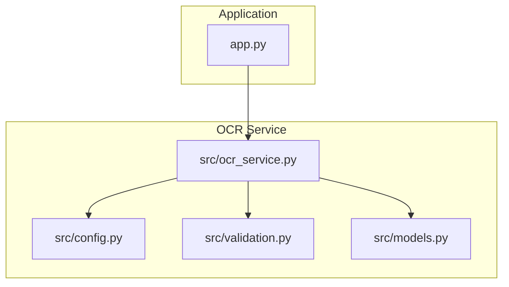
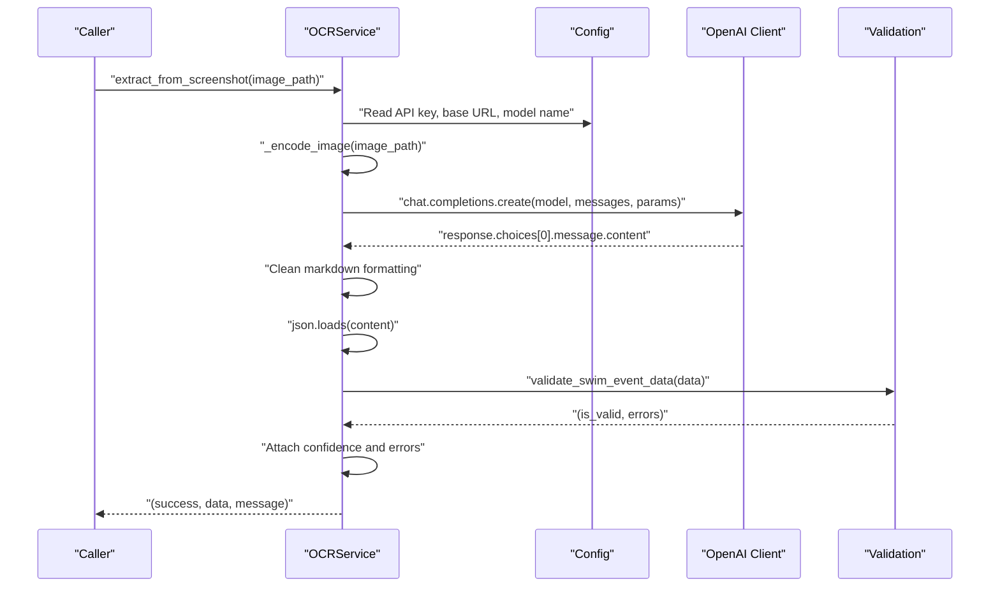
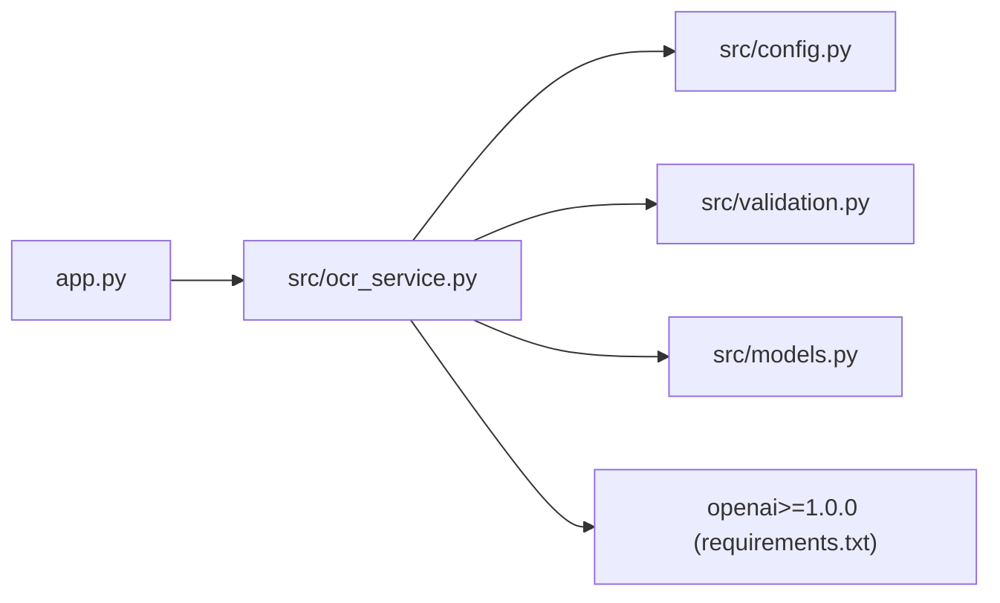

# OCR Service API

<cite>
**Referenced Files in This Document**
- [ocr_service.py](file://src/ocr_service.py)
- [config.py](file://src/config.py)
- [validation.py](file://src/validation.py)
- [models.py](file://src/models.py)
- [app.py](file://app.py)
- [README.md](file://README.md)
- [openspec/changes/sunny-swim-analysis-platform/specs/ocr-data-extraction/spec.md](file://openspec/changes/sunny-swim-analysis-platform/specs/ocr-data-extraction/spec.md)
</cite>

## Table of Contents
1. [Introduction](#introduction)
2. [Project Structure](#project-structure)
3. [Core Components](#core-components)
4. [Architecture Overview](#architecture-overview)
5. [Detailed Component Analysis](#detailed-component-analysis)
6. [Dependency Analysis](#dependency-analysis)
7. [Performance Considerations](#performance-considerations)
8. [Troubleshooting Guide](#troubleshooting-guide)
9. [Conclusion](#conclusion)
10. [Appendices](#appendices)

## Introduction
This document provides comprehensive API documentation for the OCR Service used to extract structured swimming data from meet screenshots. It covers the primary extraction method, Alibaba Cloud integration, system prompt and field extraction capabilities, base64 image encoding, JSON response parsing, validation error handling, and the manual entry form fields API with split time parsing.

## Project Structure
The OCR Service is part of a larger swimming analytics platform. The relevant components are organized as follows:
- OCR Service implementation and configuration
- Data validation utilities
- Data models for swim events
- Streamlit application integration
- Specification documents for OCR requirements

**Diagram sources**
- [app.py:14](file://app.py#L14)
- [ocr_service.py:8](file://src/ocr_service.py#L8)
- [config.py:21](file://src/config.py#L21)
- [validation.py:1](file://src/validation.py#L1)
- [models.py:7](file://src/models.py#L7)

**Section sources**
- [README.md:1](file://README.md#L1)
- [app.py:14](file://app.py#L14)

## Core Components
- OCRService: Provides the extract_from_screenshot method and related utilities for manual entry and split parsing.
- Configuration: Defines Alibaba Cloud API settings and environment variables.
- Validation: Implements time format validation and swim event data validation.
- Models: Defines the SwimEvent data model used to represent extracted data.

**Section sources**
- [ocr_service.py:12](file://src/ocr_service.py#L12)
- [config.py:20](file://src/config.py#L20)
- [validation.py:75](file://src/validation.py#L75)
- [models.py:7](file://src/models.py#L7)

## Architecture Overview
The OCR Service integrates with Alibaba Cloud’s Model Studio via the OpenAI-compatible client. The flow is:
- Load environment variables for API key and base URL
- Encode the image to base64
- Send a chat completion request with a system prompt and user content containing the image and text instruction
- Parse the returned JSON, validate the data, and attach confidence and error metadata
- Return a standardized tuple of success status, extracted data, and message

**Diagram sources**
- [ocr_service.py:49](file://src/ocr_service.py#L49)
- [ocr_service.py:55](file://src/ocr_service.py#L55)
- [ocr_service.py:61](file://src/ocr_service.py#L61)
- [ocr_service.py:107](file://src/ocr_service.py#L107)

## Detailed Component Analysis

### OCRService.extract_from_screenshot
Purpose:
- Extract structured swimming data from a screenshot using Alibaba Cloud Model Studio.

Parameters:
- image_path: Absolute or relative path to the screenshot image file. Must be a valid PNG/JPG/JPEG file accessible on disk.

Returns:
- A tuple of (success: bool, extracted_data: dict, message: str)
  - success: True if extraction and validation succeeded; False otherwise
  - extracted_data: Dictionary containing the extracted fields plus metadata
  - message: Human-readable status message, including validation error summaries when applicable

Behavior:
- Validates that the Alibaba Cloud API key is configured; returns failure if not set
- Encodes the image to base64
- Sends a request to the configured model with a system prompt and user content including the image and a text instruction
- Cleans potential markdown code block wrappers from the response
- Parses the resulting JSON; returns failure if parsing fails
- Validates the extracted data against swim event rules; attaches confidence scores and validation errors
- Returns success with the validated data and a message summarizing validation outcomes

Field Extraction Capabilities:
- date: Event date (YYYY-MM-DD)
- meet_name: Name of the swim meet
- stroke: Stroke type (freestyle, backstroke, breaststroke, butterfly, IM)
- distance: Distance in meters (50, 100, 200, 400, 800, 1500)
- time: Total race time in MM:SS.ss or SS.ss format
- splits: Array of split times at each lap/50m in MM:SS.ss or SS.ss format
- course: Pool type - "LC" for long course (50m) or "SC" for short course (25m)
- round: Round type - "heat", "semifinal", or "final"
- rank: Placement/ranking in the event (integer)
- age_group: Age group category (e.g., "8 & Under", "9-10", "11-12")
- heat_lane: Heat and lane information (e.g., "H3 L4")
- swimmer_name: Swimmer's name

Confidence and Error Metadata:
- _extraction_confidence: Dictionary mapping fields to confidence scores (placeholder)
- _extraction_errors: List of validation error messages

Base64 Image Encoding:
- The image is read in binary mode and encoded to base64 for inclusion in the request payload.

JSON Response Parsing:
- The response content is stripped and cleaned of markdown code blocks before JSON parsing.
- On JSON decode failure, the raw response content is included in the returned data under a dedicated key.

Validation:
- Required fields: date, meet_name, stroke, distance, time
- Time format validation: MM:SS.ss or SS.ss
- Split time validation: Applied when splits are present

Error Handling:
- API key not configured: Returns failure with a descriptive message
- General exceptions during extraction: Returns failure with exception details
- JSON parsing failures: Returns failure with the raw response content and error details
- Validation errors: Returns success with validation errors appended to the data

Example Request:
- image_path: "/absolute/path/to/meet_result.png"

Example Response Schema:
- success: true or false
- extracted_data:
  - date: "YYYY-MM-DD"
  - meet_name: "string"
  - stroke: "freestyle|backstroke|breaststroke|butterfly|IM"
  - distance: integer
  - time: "MM:SS.ss|SS.ss"
  - splits: ["MM:SS.ss|SS.ss", ...]
  - course: "LC|SC"
  - round: "heat|semifinal|final"
  - rank: integer
  - age_group: "string"
  - heat_lane: "string"
  - swimmer_name: "string"
  - _extraction_confidence: {field: score}
  - _extraction_errors: ["error1", "error2", ...]
- message: "Extraction complete" or "Extraction had issues: ..." with validation details

**Section sources**
- [ocr_service.py:49](file://src/ocr_service.py#L49)
- [ocr_service.py:55](file://src/ocr_service.py#L55)
- [ocr_service.py:58](file://src/ocr_service.py#L58)
- [ocr_service.py:90](file://src/ocr_service.py#L90)
- [ocr_service.py:101](file://src/ocr_service.py#L101)
- [ocr_service.py:107](file://src/ocr_service.py#L107)
- [ocr_service.py:110](file://src/ocr_service.py#L110)
- [ocr_service.py:116](file://src/ocr_service.py#L116)

### Alibaba Cloud Integration
Configuration:
- API Key: ALIBABA_CLOUD_API_KEY (required)
- Base URL: ALIBABA_CLOUD_BASE_URL (default: https://dashscope.aliyuncs.com/compatible-mode/v1)
- Model Selection: QWEN_MODEL_NAME (default: qwen-vl-max), QWEN_TEXT_MODEL_NAME (default: qwen-max)

Environment Variables:
- Set ALIBABA_CLOUD_API_KEY to enable OCR functionality
- Optionally set ALIBABA_CLOUD_BASE_URL and model names to customize integration

Client Initialization:
- The service initializes an OpenAI-compatible client with the configured API key and base URL
- Uses the configured model name for chat completions

**Section sources**
- [config.py:21](file://src/config.py#L21)
- [config.py:22](file://src/config.py#L22)
- [config.py:23](file://src/config.py#L23)
- [config.py:24](file://src/config.py#L24)
- [ocr_service.py:15](file://src/ocr_service.py#L15)

### System Prompt and Field Extraction
System Prompt:
- The prompt instructs the model to analyze a swimming meet screenshot and extract all available information into a structured JSON object
- Specifies the exact fields to extract, including date, meet_name, stroke, distance, time, splits, course, round, rank, age_group, heat_lane, and swimmer_name
- Requires returning only a valid JSON object with empty strings for missing text fields, 0 for missing numeric fields, and empty arrays for missing lists
- Requests removal of any markdown formatting or explanation text

Field Extraction Capabilities:
- All fields listed above are supported; missing fields are represented as empty values as per the prompt requirements

**Section sources**
- [ocr_service.py:29](file://src/ocr_service.py#L29)
- [ocr_service.py:31](file://src/ocr_service.py#L31)
- [ocr_service.py:33](file://src/ocr_service.py#L33)
- [ocr_service.py:47](file://src/ocr_service.py#L47)

### Manual Entry Form Fields API
Purpose:
- Provide field definitions for a manual data entry fallback form when OCR extraction is unavailable or incomplete.

Fields:
- date: Date input (required)
- meet_name: Text input (required)
- stroke: Select dropdown with options (required): freestyle, backstroke, breaststroke, butterfly, IM
- distance: Number input (required)
- time: Text input (required) with format MM:SS.ss or SS.ss
- splits: Text input (optional) with comma-separated values
- course: Select dropdown with options (optional): LC, SC
- round: Select dropdown with options (optional): heat, semifinal, final
- rank: Number input (optional)
- age_group: Text input (optional)
- heat_lane: Text input (optional)

**Section sources**
- [ocr_service.py:121](file://src/ocr_service.py#L121)
- [ocr_service.py:125](file://src/ocr_service.py#L125)
- [ocr_service.py:135](file://src/ocr_service.py#L135)

### Split Time Parsing
Purpose:
- Parse comma-separated split times into an array.

Behavior:
- Accepts a string of comma-separated split times
- Returns an array of trimmed split time strings, excluding empty entries
- Returns an empty array if input is empty or null

**Section sources**
- [ocr_service.py:138](file://src/ocr_service.py#L138)
- [ocr_service.py:140](file://src/ocr_service.py#L140)
- [ocr_service.py:142](file://src/ocr_service.py#L142)

### Data Validation
Validation Rules:
- Required fields: date, meet_name, stroke, distance, time
- Time format validation: MM:SS.ss or SS.ss
- Split time validation: Applied when splits are present; each split must match the time format

Validation Utilities:
- validate_time_format: Validates time string format
- time_to_seconds: Converts time string to total seconds
- seconds_to_time: Converts seconds to time string
- validate_required_fields: Checks presence of required fields
- validate_swim_event_data: Orchestrates validation and returns combined error messages

**Section sources**
- [validation.py:7](file://src/validation.py#L7)
- [validation.py:26](file://src/validation.py#L26)
- [validation.py:45](file://src/validation.py#L45)
- [validation.py:62](file://src/validation.py#L62)
- [validation.py:75](file://src/validation.py#L75)

### Data Model
SwimEvent:
- Represents a single swimming event result with fields aligned to the extracted data
- Includes conversion helpers to/from dictionaries

**Section sources**
- [models.py:7](file://src/models.py#L7)
- [models.py:24](file://src/models.py#L24)

## Dependency Analysis
The OCR Service depends on configuration, validation utilities, and the OpenAI client library. The application integrates the OCR Service into the Streamlit UI.

**Diagram sources**
- [app.py:14](file://app.py#L14)
- [ocr_service.py:8](file://src/ocr_service.py#L8)
- [config.py:21](file://src/config.py#L21)
- [validation.py:1](file://src/validation.py#L1)
- [models.py:1](file://src/models.py#L1)
- [requirements.txt:7](file://requirements.txt#L7)

**Section sources**
- [app.py:14](file://app.py#L14)
- [requirements.txt:7](file://requirements.txt#L7)

## Performance Considerations
- Network latency: The OCR process depends on external API connectivity; consider retry logic and timeouts for production deployments.
- Image size: Large images increase upload time and token usage; ensure images are reasonably sized.
- Token limits: The model has a maximum token limit; keep prompts concise and avoid excessively large images.
- Validation overhead: JSON parsing and validation add CPU overhead; batch processing can amortize costs.

## Troubleshooting Guide
Common Issues and Resolutions:
- API key not configured:
  - Symptom: Immediate failure with a message indicating the API key is missing
  - Resolution: Set ALIBABA_CLOUD_API_KEY environment variable
- JSON parsing failures:
  - Symptom: Failure with a message indicating JSON decode error and raw response content included in the returned data
  - Resolution: Verify the system prompt is correctly instructing the model to return pure JSON without markdown wrappers
- Validation errors:
  - Symptom: Success returned with validation errors attached to the data
  - Resolution: Correct the extracted data according to the error messages (e.g., time format, missing required fields)
- General extraction failures:
  - Symptom: Failure with exception details in the message
  - Resolution: Check network connectivity, API credentials, and image accessibility

Integration Notes:
- The application displays API status and warnings when the API key is not set
- The OCR Service cleans markdown code blocks from the response before parsing

**Section sources**
- [ocr_service.py:55](file://src/ocr_service.py#L55)
- [ocr_service.py:103](file://src/ocr_service.py#L103)
- [ocr_service.py:118](file://src/ocr_service.py#L118)
- [app.py:442](file://app.py#L442)
- [app.py:444](file://app.py#L444)

## Conclusion
The OCR Service provides a robust pipeline for extracting structured swimming data from meet screenshots using Alibaba Cloud Model Studio. It includes comprehensive field extraction, strict validation, confidence metadata, and a manual entry fallback. Proper configuration of environment variables and adherence to time format requirements are essential for reliable operation.

## Appendices

### API Reference: extract_from_screenshot
- Method: extract_from_screenshot(image_path: str) -> Tuple[bool, Dict[str, Any], str]
- Parameters:
  - image_path: Path to the screenshot image file
- Returns:
  - success: Boolean indicating extraction success
  - extracted_data: Dictionary containing extracted fields and metadata
  - message: Status message with validation details

**Section sources**
- [ocr_service.py:49](file://src/ocr_service.py#L49)

### Configuration Reference
- Environment Variables:
  - ALIBABA_CLOUD_API_KEY: Alibaba Cloud API key
  - ALIBABA_CLOUD_BASE_URL: Base URL for the OpenAI-compatible client
  - QWEN_MODEL_NAME: Vision-language model name
  - QWEN_TEXT_MODEL_NAME: Text model name
- Defaults:
  - ALIBABA_CLOUD_BASE_URL: https://dashscope.aliyuncs.com/compatible-mode/v1
  - QWEN_MODEL_NAME: qwen-vl-max
  - QWEN_TEXT_MODEL_NAME: qwen-max

**Section sources**
- [config.py:21](file://src/config.py#L21)
- [config.py:22](file://src/config.py#L22)
- [config.py:23](file://src/config.py#L23)
- [config.py:24](file://src/config.py#L24)

### Validation Reference
- validate_swim_event_data(data: dict) -> Tuple[bool, list]
  - Validates required fields and time formats
  - Returns (is_valid, errors)
- validate_time_format(time_str: str) -> Tuple[bool, str]
  - Validates MM:SS.ss or SS.ss format
- time_to_seconds(time_str: str) -> float
- seconds_to_time(total_seconds: float) -> str

**Section sources**
- [validation.py:75](file://src/validation.py#L75)
- [validation.py:7](file://src/validation.py#L7)
- [validation.py:26](file://src/validation.py#L26)
- [validation.py:45](file://src/validation.py#L45)

### Manual Entry Form Fields Reference
- manual_entry_form_fields() -> List[Dict[str, Any]]
  - Returns field definitions for manual data entry

**Section sources**
- [ocr_service.py:121](file://src/ocr_service.py#L121)

### Split Time Parsing Reference
- parse_splits(splits_text: str) -> List[str]
  - Parses comma-separated split times into an array

**Section sources**
- [ocr_service.py:138](file://src/ocr_service.py#L138)

### Specification Alignment
- The OCR Service aligns with the specification requirement to extract comprehensive structured swimming data and assign confidence scores to each field
- It handles unsupported screenshot formats by flagging for manual entry and notifying the user

**Section sources**
- [openspec/changes/sunny-swim-analysis-platform/specs/ocr-data-extraction/spec.md:3](file://openspec/changes/sunny-swim-analysis-platform/specs/ocr-data-extraction/spec.md#L3)
- [openspec/changes/sunny-swim-analysis-platform/specs/ocr-data-extraction/spec.md:18](file://openspec/changes/sunny-swim-analysis-platform/specs/ocr-data-extraction/spec.md#L18)
- [openspec/changes/sunny-swim-analysis-platform/specs/ocr-data-extraction/spec.md:25](file://openspec/changes/sunny-swim-analysis-platform/specs/ocr-data-extraction/spec.md#L25)