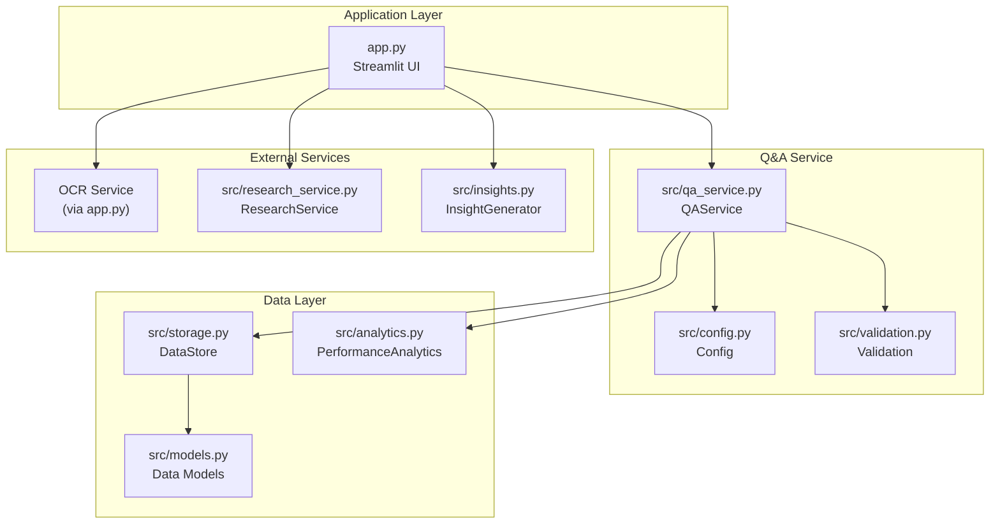
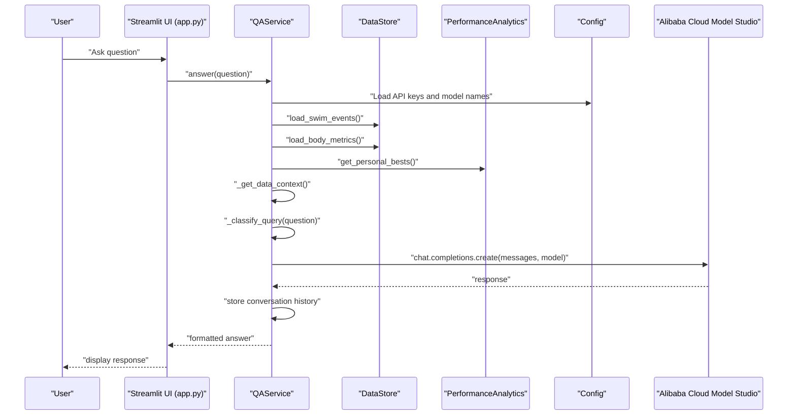
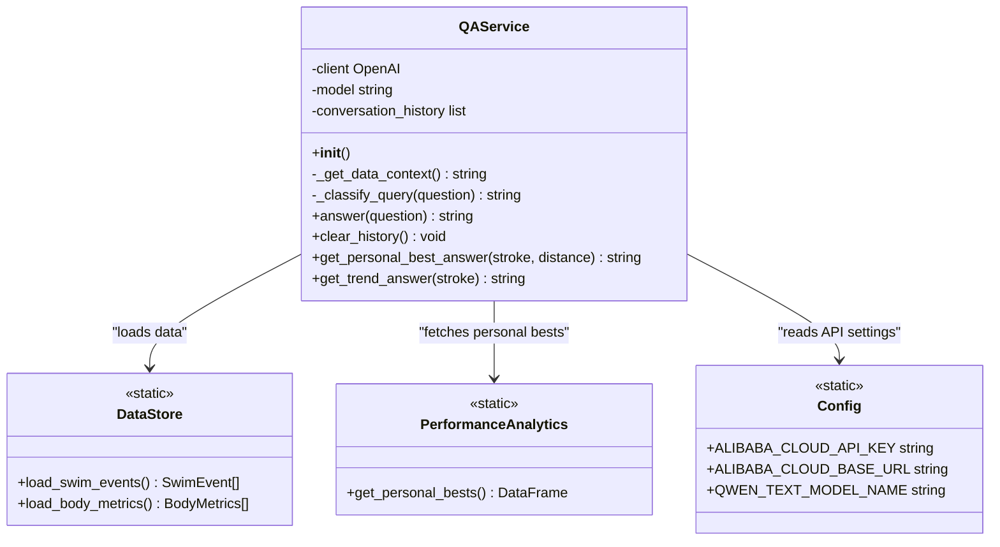
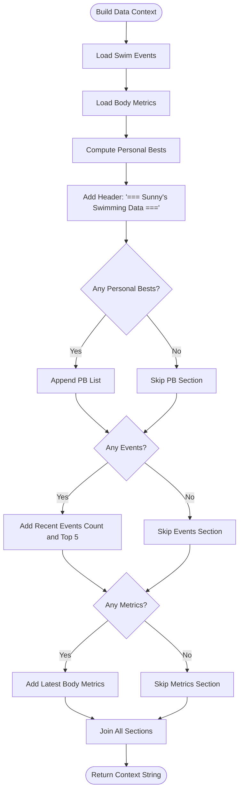
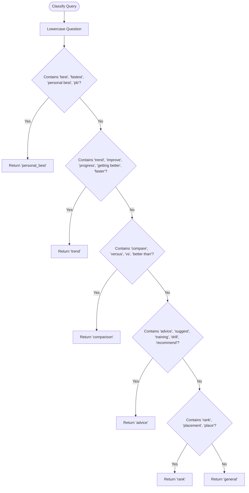
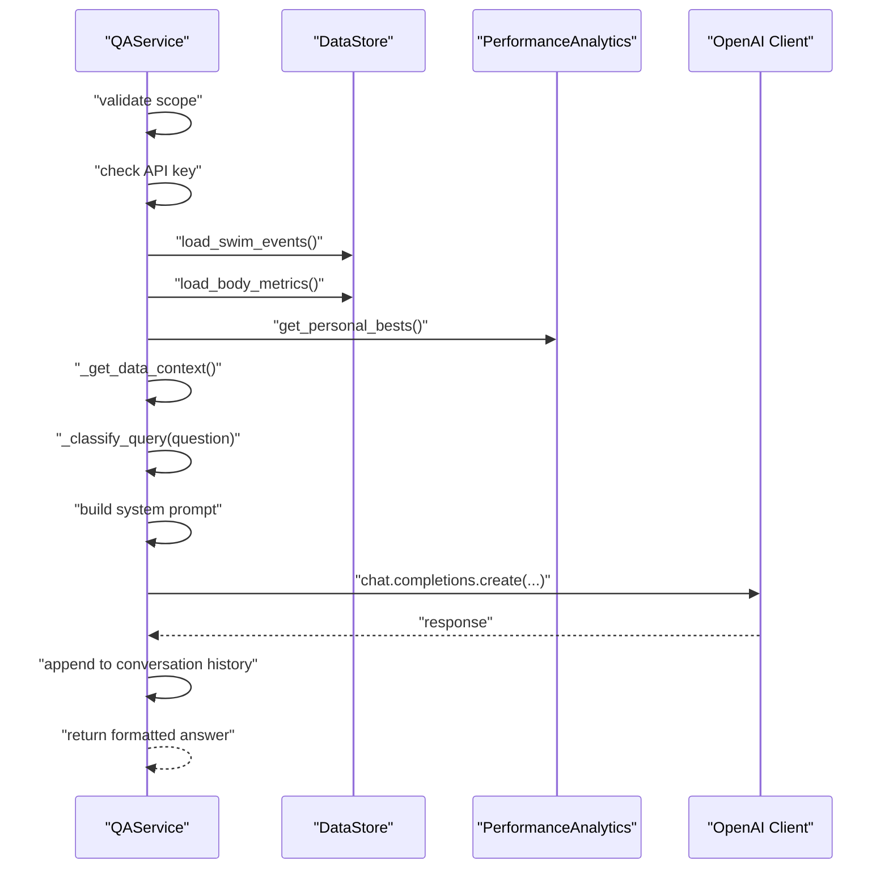
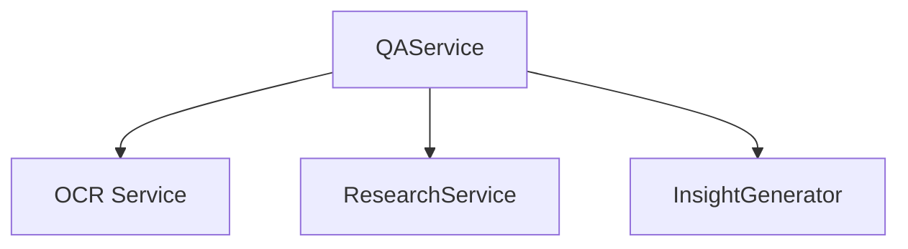
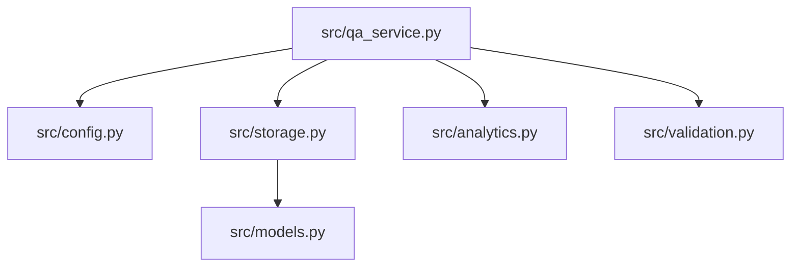

# Q&A Service API

<cite>
**Referenced Files in This Document**
- [app.py](file://app.py)
- [src/qa_service.py](file://src/qa_service.py)
- [src/config.py](file://src/config.py)
- [src/storage.py](file://src/storage.py)
- [src/analytics.py](file://src/analytics.py)
- [src/validation.py](file://src/validation.py)
- [src/models.py](file://src/models.py)
- [src/insights.py](file://src/insights.py)
- [src/research_service.py](file://src/research_service.py)
- [README.md](file://README.md)
- [requirements.txt](file://requirements.txt)
</cite>

## Table of Contents
1. [Introduction](#introduction)
2. [Project Structure](#project-structure)
3. [Core Components](#core-components)
4. [Architecture Overview](#architecture-overview)
5. [Detailed Component Analysis](#detailed-component-analysis)
6. [Dependency Analysis](#dependency-analysis)
7. [Performance Considerations](#performance-considerations)
8. [Troubleshooting Guide](#troubleshooting-guide)
9. [Conclusion](#conclusion)
10. [Appendices](#appendices)

## Introduction
This document provides comprehensive API documentation for the Q&A Service within the Sunny's Swimming Data Analysis Platform. The service enables natural language interaction with swimming performance data, leveraging Alibaba Cloud Model Studio for conversational AI. It integrates with data storage, analytics, and external research services to deliver contextual insights about swimmer performance, event history, and training recommendations.

Key capabilities include:
- Query classification for personal bests, trends, comparisons, advice, rankings, and general questions
- Context building from swim events, body metrics, and personal bests
- Response generation using a large language model with conversation history
- Direct data retrieval methods for specific queries
- Integration with OCR extraction, research comparison, and insight generation

## Project Structure
The Q&A Service is part of a larger Streamlit application that manages swimming data ingestion, storage, analytics, and presentation. The Q&A module resides under the src directory and interacts with configuration, storage, analytics, and validation utilities.

**Diagram sources**
- [app.py:36-39](file://app.py#L36-L39)
- [src/qa_service.py:12-22](file://src/qa_service.py#L12-L22)
- [src/config.py:20-25](file://src/config.py#L20-L25)
- [src/storage.py:10-62](file://src/storage.py#L10-L62)
- [src/analytics.py:13-184](file://src/analytics.py#L13-L184)
- [src/validation.py:1-103](file://src/validation.py#L1-L103)
- [src/models.py:7-55](file://src/models.py#L7-L55)
- [src/research_service.py:10-94](file://src/research_service.py#L10-L94)
- [src/insights.py:11-150](file://src/insights.py#L11-L150)

**Section sources**
- [app.py:1-447](file://app.py#L1-L447)
- [src/qa_service.py:1-174](file://src/qa_service.py#L1-L174)
- [src/config.py:1-29](file://src/config.py#L1-L29)
- [src/storage.py:1-107](file://src/storage.py#L1-L107)
- [src/analytics.py:1-184](file://src/analytics.py#L1-L184)
- [src/validation.py:1-103](file://src/validation.py#L1-L103)
- [src/models.py:1-55](file://src/models.py#L1-L55)
- [src/research_service.py:1-94](file://src/research_service.py#L1-L94)
- [src/insights.py:1-150](file://src/insights.py#L1-L150)

## Core Components
This section outlines the primary components involved in the Q&A Service and their roles.

- QAService: Orchestrates query classification, context building, conversation history, and response generation using Alibaba Cloud Model Studio.
- DataStore: Provides persistent storage for swim events and body metrics.
- PerformanceAnalytics: Computes personal bests, time progressions, and comparative analytics.
- Validation: Handles time format validation and conversions.
- Data Models: Defines SwimEvent and BodyMetrics structures.
- ResearchService: Searches benchmark data and caches results.
- InsightGenerator: Generates trend insights, strength/weakness analysis, and training suggestions.

**Section sources**
- [src/qa_service.py:12-174](file://src/qa_service.py#L12-L174)
- [src/storage.py:10-62](file://src/storage.py#L10-L62)
- [src/analytics.py:13-184](file://src/analytics.py#L13-L184)
- [src/validation.py:1-103](file://src/validation.py#L1-L103)
- [src/models.py:7-55](file://src/models.py#L7-L55)
- [src/research_service.py:10-94](file://src/research_service.py#L10-L94)
- [src/insights.py:11-150](file://src/insights.py#L11-L150)

## Architecture Overview
The Q&A Service architecture integrates natural language processing with structured data retrieval and external research services. The flow begins with user input, proceeds through classification and context assembly, and concludes with a model-generated response enriched by conversation history.

**Diagram sources**
- [app.py:371-403](file://app.py#L371-L403)
- [src/qa_service.py:76-135](file://src/qa_service.py#L76-L135)
- [src/config.py:20-25](file://src/config.py#L20-L25)
- [src/storage.py:30-61](file://src/storage.py#L30-L61)
- [src/analytics.py:114-138](file://src/analytics.py#L114-L138)

## Detailed Component Analysis

### QAService
The QAService encapsulates the natural language processing interface, including query classification, context building, and response generation. It maintains conversation history to support follow-up questions.

Key methods and responsibilities:
- Initialization: Configures OpenAI client with Alibaba Cloud base URL and model name, initializes conversation history.
- _get_data_context: Assembles structured context from swim events, body metrics, and personal bests.
- _classify_query: Classifies questions into categories (personal_best, trend, comparison, advice, rank, general).
- answer: Validates scope and credentials, builds system prompt with context and conversation history, invokes the model, and stores responses.
- clear_history: Resets conversation history.
- Static methods: get_personal_best_answer and get_trend_answer provide direct data retrieval for specific queries.

**Diagram sources**
- [src/qa_service.py:12-174](file://src/qa_service.py#L12-L174)
- [src/storage.py:10-62](file://src/storage.py#L10-L62)
- [src/analytics.py:114-138](file://src/analytics.py#L114-L138)
- [src/config.py:20-25](file://src/config.py#L20-L25)

**Section sources**
- [src/qa_service.py:12-174](file://src/qa_service.py#L12-L174)

### Data Context Building
The _get_data_context method aggregates relevant swimmer data into a structured context string for the model. It includes:
- Personal bests: Stroke-distance combinations with times, dates, and meets.
- Recent races: Up to five most recent events with key details.
- Latest body metrics: Height, weight, and BMI derived from the latest record.

**Diagram sources**
- [src/qa_service.py:23-57](file://src/qa_service.py#L23-L57)
- [src/analytics.py:114-138](file://src/analytics.py#L114-L138)
- [src/storage.py:30-61](file://src/storage.py#L30-L61)

**Section sources**
- [src/qa_service.py:23-57](file://src/qa_service.py#L23-L57)

### Query Classification
The _classify_query method categorizes incoming questions to guide response generation and direct retrieval paths. Categories include:
- personal_best: Queries focused on specific stroke-distance PBs.
- trend: Questions about performance improvements or declines.
- comparison: Requests to compare times or strokes.
- advice: Training or technique recommendations.
- rank: Placement or ranking-related queries.
- general: Other topics not explicitly categorized.

**Diagram sources**
- [src/qa_service.py:59-75](file://src/qa_service.py#L59-L75)

**Section sources**
- [src/qa_service.py:59-75](file://src/qa_service.py#L59-L75)

### Response Generation Workflow
The answer method orchestrates the end-to-end response process:
- Scope validation: Ensures the question relates to swimming data.
- Credential check: Verifies Alibaba Cloud API key presence.
- Context assembly: Builds structured context and classifies the query.
- Prompt construction: Creates a system prompt with data context and conversation history.
- Model invocation: Calls the OpenAI-compatible endpoint with configured parameters.
- History management: Stores user and assistant messages for continuity.
- Error handling: Catches exceptions and returns user-friendly messages.

**Diagram sources**
- [src/qa_service.py:76-135](file://src/qa_service.py#L76-L135)
- [src/storage.py:30-61](file://src/storage.py#L30-L61)
- [src/analytics.py:114-138](file://src/analytics.py#L114-L138)

**Section sources**
- [src/qa_service.py:76-135](file://src/qa_service.py#L76-L135)

### Direct Data Retrieval Methods
For specific query types, the service provides static methods that bypass the model for precise, data-backed answers:
- get_personal_best_answer: Retrieves PB for a given stroke and distance.
- get_trend_answer: Calculates improvement percentage across multiple races for a stroke.

These methods ensure deterministic responses for straightforward data queries.

**Section sources**
- [src/qa_service.py:140-174](file://src/qa_service.py#L140-L174)

### Integration Patterns with Other Services
The Q&A Service integrates with:
- OCR Service: Automatic extraction of race data from screenshots, enabling richer context.
- ResearchService: Benchmark comparisons to contextualize performance against standards.
- InsightGenerator: Trend analysis and training suggestions that complement conversational responses.

**Diagram sources**
- [app.py:83-118](file://app.py#L83-L118)
- [src/research_service.py:31-94](file://src/research_service.py#L31-L94)
- [src/insights.py:14-150](file://src/insights.py#L14-L150)

**Section sources**
- [app.py:83-118](file://app.py#L83-L118)
- [src/research_service.py:31-94](file://src/research_service.py#L31-L94)
- [src/insights.py:14-150](file://src/insights.py#L14-L150)

## Dependency Analysis
The Q&A Service depends on configuration, storage, analytics, and validation utilities. The following diagram illustrates these dependencies:

**Diagram sources**
- [src/qa_service.py:6-9](file://src/qa_service.py#L6-L9)
- [src/config.py:20-25](file://src/config.py#L20-L25)
- [src/storage.py:10-62](file://src/storage.py#L10-L62)
- [src/analytics.py:8-10](file://src/analytics.py#L8-L10)
- [src/validation.py:1-5](file://src/validation.py#L1-L5)
- [src/models.py:2-4](file://src/models.py#L2-L4)

**Section sources**
- [src/qa_service.py:6-9](file://src/qa_service.py#L6-L9)
- [src/config.py:20-25](file://src/config.py#L20-L25)
- [src/storage.py:10-62](file://src/storage.py#L10-L62)
- [src/analytics.py:8-10](file://src/analytics.py#L8-L10)
- [src/validation.py:1-5](file://src/validation.py#L1-L5)
- [src/models.py:2-4](file://src/models.py#L2-L4)

## Performance Considerations
- Conversation history length: The service retains up to six previous messages to maintain context, balancing coherence with token limits.
- Token limits and temperature: Responses are constrained with a maximum token count and low temperature to ensure concise and deterministic outputs.
- Data loading overhead: Context assembly loads swim events and body metrics; caching or pagination could reduce latency for large datasets.
- Model selection: Using a text model optimized for Q&A improves cost and speed compared to multimodal models when only textual prompts are used.

[No sources needed since this section provides general guidance]

## Troubleshooting Guide
Common issues and resolutions:
- Missing API key: The service checks for the Alibaba Cloud API key and returns a clear message if absent.
- Out-of-scope queries: Questions unrelated to swimming data are rejected with a guidance message.
- Model errors: Exceptions during model invocation are caught and reported to the user.
- Insufficient data: Direct retrieval methods return informative messages when personal bests or trend data are unavailable.

**Section sources**
- [src/qa_service.py:84-89](file://src/qa_service.py#L84-L89)
- [src/qa_service.py:87-89](file://src/qa_service.py#L87-L89)
- [src/qa_service.py:133-135](file://src/qa_service.py#L133-L135)
- [src/qa_service.py:146-150](file://src/qa_service.py#L146-L150)
- [src/qa_service.py:158-160](file://src/qa_service.py#L158-L160)

## Conclusion
The Q&A Service provides a robust, extensible interface for querying swimming performance data through natural language. By combining structured data retrieval, conversation history, and external research, it delivers contextual, actionable insights. The modular design allows seamless integration with OCR extraction, analytics, and insight generation, forming a cohesive platform for data-driven swimming development.

[No sources needed since this section summarizes without analyzing specific files]

## Appendices

### API Definitions

- Endpoint: answer(question)
  - Description: Processes a natural language question and returns a contextualized answer.
  - Parameters:
    - question (string): Natural language query about swimming data.
  - Returns:
    - string: Formatted answer or error message.
  - Example usage:
    - [app.py:391-395](file://app.py#L391-L395)

- Endpoint: clear_history()
  - Description: Clears conversation history to reset context.
  - Parameters: None
  - Returns: None
  - Example usage:
    - [app.py:399-402](file://app.py#L399-L402)

- Endpoint: get_personal_best_answer(stroke, distance)
  - Description: Retrieves the personal best time for a specific stroke and distance.
  - Parameters:
    - stroke (string): Stroke type (e.g., freestyle).
    - distance (int): Distance in meters.
  - Returns:
    - string: PB information or absence notice.
  - Example usage:
    - [src/qa_service.py:141-150](file://src/qa_service.py#L141-L150)

- Endpoint: get_trend_answer(stroke)
  - Description: Calculates performance trend for a stroke across multiple races.
  - Parameters:
    - stroke (string): Stroke type.
  - Returns:
    - string: Improvement analysis or insufficient data notice.
  - Example usage:
    - [src/qa_service.py:153-173](file://src/qa_service.py#L153-L173)

### Configuration Options
Environment variables and settings:
- ALIBABA_CLOUD_API_KEY: API key for Alibaba Cloud Model Studio.
- ALIBABA_CLOUD_BASE_URL: Base URL for OpenAI-compatible endpoint.
- QWEN_TEXT_MODEL_NAME: Text model identifier used for Q&A.
- TIME_FORMAT_MM_SS, TIME_FORMAT_SS: Regex patterns for validating time formats.

**Section sources**
- [src/config.py:20-29](file://src/config.py#L20-L29)
- [requirements.txt:1-10](file://requirements.txt#L1-L10)

### Data Models
- SwimEvent: Represents a single swimming event with attributes such as date, meet name, stroke, distance, time, splits, course, round, rank, age group, heat/lane, and swimmer name.
- BodyMetrics: Represents body measurements with height, weight, arm span, and computed BMI.

**Section sources**
- [src/models.py:7-55](file://src/models.py#L7-L55)

### Query Intent Classification Examples
- Performance analysis queries:
  - "What is my personal best in 100m freestyle?"
  - "How has my backstroke improved over time?"
- Training advice requests:
  - "What drills should I focus on for better technique?"
  - "How can I improve my breaststroke?"
- Data interpretation questions:
  - "Which stroke is my strongest?"
  - "Compare my 100m butterfly times across meets."

**Section sources**
- [src/qa_service.py:59-75](file://src/qa_service.py#L59-L75)

### Response Formatting and Confidence Scoring
- Response formatting: Answers include specific data citations (dates, times, meets) and concise explanations.
- Confidence scoring: Not implemented in the current service; responses reflect model-generated interpretations based on provided context.
- Error handling: Clear messages for missing API keys, out-of-scope queries, and model errors.

**Section sources**
- [src/qa_service.py:95-106](file://src/qa_service.py#L95-L106)
- [src/qa_service.py:133-135](file://src/qa_service.py#L133-L135)

### Integration with External Services
- OCR Service: Extracts structured race data from screenshots to enrich the Q&A context.
- ResearchService: Searches benchmark data and compares performance against standards.
- InsightGenerator: Provides trend insights, strengths/weaknesses, and training suggestions.

**Section sources**
- [app.py:83-118](file://app.py#L83-L118)
- [src/research_service.py:31-94](file://src/research_service.py#L31-L94)
- [src/insights.py:14-150](file://src/insights.py#L14-L150)