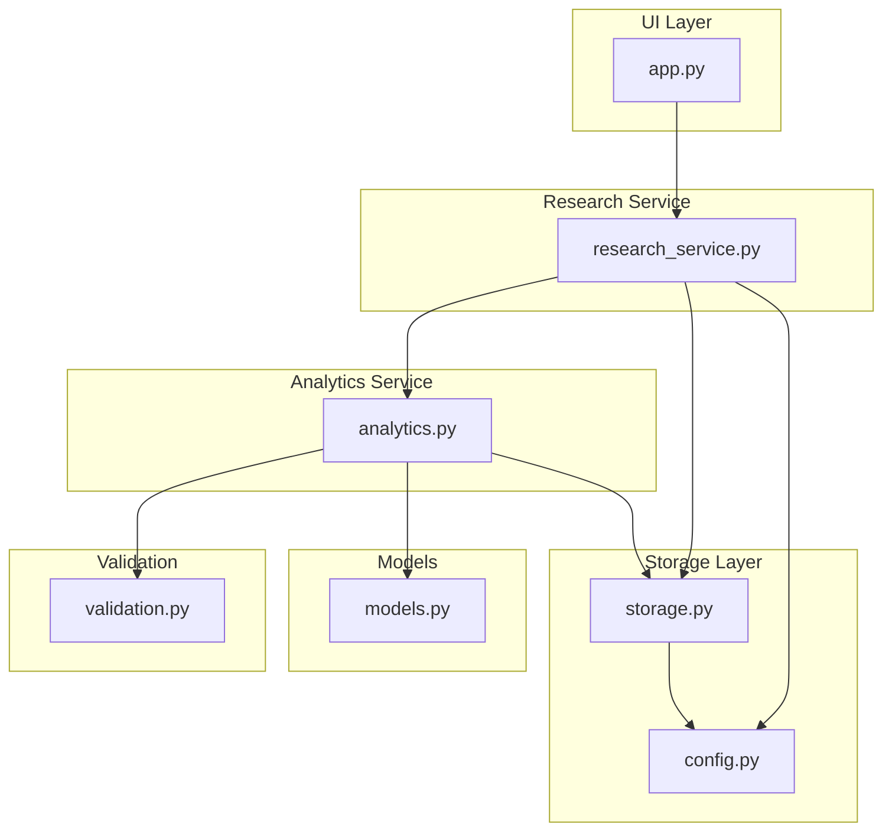
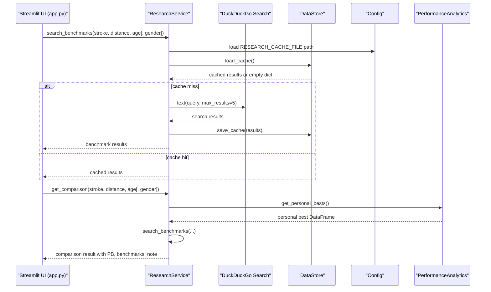
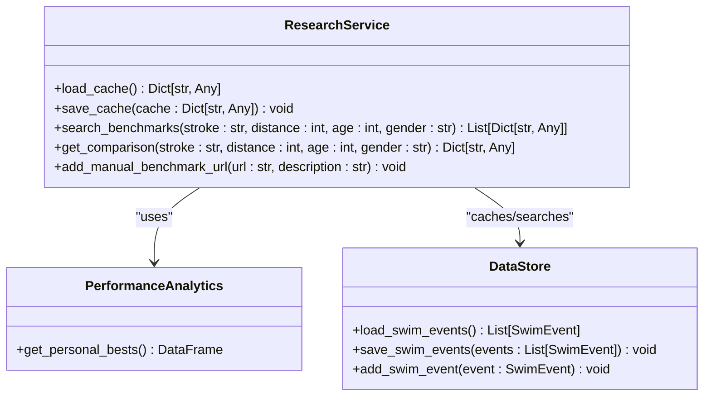
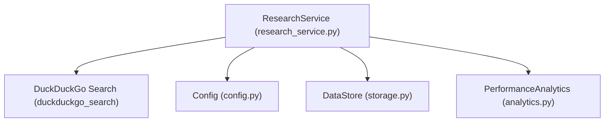

# Research Service API

<cite>
**Referenced Files in This Document**
- [app.py](file://app.py)
- [research_service.py](file://src/research_service.py)
- [analytics.py](file://src/analytics.py)
- [models.py](file://src/models.py)
- [storage.py](file://src/storage.py)
- [validation.py](file://src/validation.py)
- [config.py](file://src/config.py)
- [README.md](file://README.md)
- [requirements.txt](file://requirements.txt)
</cite>

## Table of Contents
1. [Introduction](#introduction)
2. [Project Structure](#project-structure)
3. [Core Components](#core-components)
4. [Architecture Overview](#architecture-overview)
5. [Detailed Component Analysis](#detailed-component-analysis)
6. [Dependency Analysis](#dependency-analysis)
7. [Performance Considerations](#performance-considerations)
8. [Troubleshooting Guide](#troubleshooting-guide)
9. [Conclusion](#conclusion)
10. [Appendices](#appendices)

## Introduction
This document provides comprehensive API documentation for the Research Service, focusing on benchmark search functionality and research comparison features. It covers query parameter specifications for age_group, distance, stroke, and gender filters, DuckDuckGo search integration, result parsing, caching mechanisms, research result structure, filtering options, cache management strategies, and integration patterns with the analytics service for comparative analysis.

The Research Service enables users to compare their personal best swimming times against published benchmarks by constructing targeted search queries, retrieving results from DuckDuckGo, caching them locally, and returning structured research outputs suitable for performance analysis.

## Project Structure
The Research Service is part of a larger swimming analytics platform built with Streamlit. The relevant modules include:
- Research Service: orchestrates benchmark searches and comparison logic
- Analytics Service: provides personal best data and performance metrics
- Storage Layer: persists swim events and caches research results
- Configuration: defines file paths and environment settings
- Validation Utilities: enforce time formats and data correctness
- Models: define swim event data structures

**Diagram sources**
- [app.py](file://app.py)
- [research_service.py](file://src/research_service.py)
- [analytics.py](file://src/analytics.py)
- [storage.py](file://src/storage.py)
- [config.py](file://src/config.py)
- [models.py](file://src/models.py)
- [validation.py](file://src/validation.py)

**Section sources**
- [README.md](file://README.md)
- [requirements.txt](file://requirements.txt)

## Core Components
- ResearchService: Provides benchmark search and comparison APIs, including DuckDuckGo integration, caching, and manual URL management.
- PerformanceAnalytics: Supplies personal best data used for comparison against benchmarks.
- DataStore: Persists swim events and manages research cache.
- Config: Defines file paths for research cache and other data artifacts.
- Models: Defines SwimEvent structure used by analytics and validation utilities.

Key responsibilities:
- Construct DuckDuckGo search queries from stroke, distance, age, and gender parameters
- Parse and return DuckDuckGo search results with title, body, and URL
- Cache results locally to reduce repeated network requests
- Retrieve personal best times for a given stroke and distance
- Combine personal bests with benchmark references for comparative analysis

**Section sources**
- [research_service.py](file://src/research_service.py)
- [analytics.py](file://src/analytics.py)
- [storage.py](file://src/storage.py)
- [config.py](file://src/config.py)
- [models.py](file://src/models.py)

## Architecture Overview
The Research Service integrates with the UI, analytics, and storage layers to deliver benchmark comparisons. The flow below illustrates the end-to-end process for performing a research comparison.

**Diagram sources**
- [app.py](file://app.py)
- [research_service.py](file://src/research_service.py)
- [analytics.py](file://src/analytics.py)
- [storage.py](file://src/storage.py)
- [config.py](file://src/config.py)

## Detailed Component Analysis

### ResearchService API
The ResearchService exposes two primary endpoints for benchmark search and comparison:
- search_benchmarks(stroke, distance, age[, gender]): Returns a list of DuckDuckGo search results for age-group benchmarks.
- get_comparison(stroke, distance, age[, gender]): Returns a structured comparison combining personal best data with benchmark references.

**Diagram sources**
- [research_service.py](file://src/research_service.py)
- [analytics.py](file://src/analytics.py)
- [storage.py](file://src/storage.py)

#### search_benchmarks
Behavior:
- Constructs a DuckDuckGo search query using stroke, distance, age, and gender
- Checks local cache for existing results keyed by stroke_distance_age_gender
- If cache miss, performs search via DuckDuckGo and saves results to cache
- On search failure, returns a structured error result

Parameters:
- stroke: swimming stroke (e.g., freestyle, backstroke, breaststroke, butterfly, IM)
- distance: event distance in meters (e.g., 50, 100, 200, 400, 800)
- age: swimmer’s age (integer)
- gender: swimmer’s gender (default female)

Response format:
- List of search result dictionaries with keys: title, body, href

Caching:
- Uses RESEARCH_CACHE_FILE for persistent caching
- Cache key format: "{stroke}_{distance}m_age{age}_{gender}"

Error handling:
- Catches exceptions during DuckDuckGo search and returns a structured error result

**Section sources**
- [research_service.py](file://src/research_service.py)
- [config.py](file://src/config.py)

#### get_comparison
Behavior:
- Retrieves personal best time for the given stroke and distance
- Calls search_benchmarks to obtain benchmark references
- Returns a structured comparison including personal best, benchmark references, and explanatory note

Parameters:
- stroke: swimming stroke
- distance: event distance in meters
- age: swimmer’s age
- gender: swimmer’s gender (default female)

Response format:
- Dictionary with keys: stroke, distance, personal_best, pb_date, age, gender, benchmarks, note

Error handling:
- Returns an error message if no personal best is found for the event

Integration with analytics:
- Uses PerformanceAnalytics.get_personal_bests() to fetch personal best data

**Section sources**
- [research_service.py](file://src/research_service.py)
- [analytics.py](file://src/analytics.py)

#### add_manual_benchmark_url
Behavior:
- Adds a manually provided benchmark URL to the cache under a manual_urls key
- Ensures cache persistence

Parameters:
- url: benchmark URL
- description: human-readable description

**Section sources**
- [research_service.py](file://src/research_service.py)

### DuckDuckGo Search Integration
The ResearchService integrates with DuckDuckGo Search to retrieve benchmark references. The search query is constructed from the provided parameters and limited to a small number of results to keep the UI responsive.

Query construction:
- Query string format: "{stroke} {distance}m swimming benchmark time age {age} {gender}"
- Example: "freestyle 100m swimming benchmark time age 10 female"

Result parsing:
- DuckDuckGo returns a list of search results
- Each result is a dictionary with title, body, and href fields
- These are cached and returned to the caller

Caching mechanism:
- Cache file: RESEARCH_CACHE_FILE
- Cache key: "{stroke}_{distance}m_age{age}_{gender}"
- Cache value: list of DuckDuckGo results
- Persistence uses JSON serialization

Failure handling:
- Exceptions during search are caught and a structured error result is returned

**Section sources**
- [research_service.py](file://src/research_service.py)
- [config.py](file://src/config.py)

### Research Result Structure
The research result structure combines personal best data with benchmark references for comparative analysis.

Comparison result fields:
- stroke: stroke discipline
- distance: event distance in meters
- personal_best: swimmer’s best time for the event
- pb_date: date of the personal best
- age: swimmer’s age
- gender: swimmer’s gender
- benchmarks: list of benchmark references (each with title, body, href)
- note: explanatory note indicating that percentile calculation requires specific benchmark tables

Benchmark references:
- Each reference is a DuckDuckGo result with title, body, and href
- Titles often include authoritative sources or benchmark lists
- Bodies contain summarized content from the search results
- Hrefs provide links to external benchmark resources

Filtering options:
- Age group filtering is implicit through the age parameter
- Gender filtering is explicit via the gender parameter
- Stroke and distance filters are explicit via stroke and distance parameters

**Section sources**
- [research_service.py](file://src/research_service.py)
- [analytics.py](file://src/analytics.py)

### Cache Management Strategies
The ResearchService implements a simple but effective caching strategy to minimize redundant DuckDuckGo searches and improve response times.

Cache file:
- RESEARCH_CACHE_FILE: JSON file storing cached results

Cache key strategy:
- Composite key: "{stroke}_{distance}m_age{age}_{gender}"
- Ensures cache isolation per parameter combination

Cache operations:
- Load: Reads cache file and returns empty dict if missing or unreadable
- Save: Serializes cache to disk with indentation and UTF-8 encoding
- Manual URLs: Stores additional URLs under a manual_urls key for future reference

Cache invalidation:
- No explicit TTL or invalidation logic
- Cache updates occur on subsequent searches with the same key

Persistence:
- Parent directories are created automatically if missing
- UTF-8 encoding ensures cross-platform compatibility

**Section sources**
- [research_service.py](file://src/research_service.py)
- [config.py](file://src/config.py)
- [storage.py](file://src/storage.py)

### Integration Patterns with Analytics Service
The ResearchService integrates with the analytics service to provide comparative analysis by leveraging personal best data.

Data flow:
- PerformanceAnalytics.get_personal_bests() returns a DataFrame of personal bests
- ResearchService.get_comparison() filters personal bests by stroke and distance
- ResearchService.search_benchmarks() retrieves benchmark references
- Combined results enable performance comparison and percentile estimation guidance

Performance analysis outputs:
- Personal best time and date
- Benchmark references with titles, bodies, and URLs
- Explanatory note indicating that precise percentile calculation requires specific benchmark tables

**Section sources**
- [research_service.py](file://src/research_service.py)
- [analytics.py](file://src/analytics.py)

## Dependency Analysis
The Research Service depends on several modules for data persistence, configuration, and analytics.

**Diagram sources**
- [research_service.py](file://src/research_service.py)
- [config.py](file://src/config.py)
- [storage.py](file://src/storage.py)
- [analytics.py](file://src/analytics.py)

External dependencies:
- duckduckgo-search: Provides DuckDuckGo search functionality
- pandas: Used by analytics for data manipulation
- plotly: Used by analytics for visualizations

Internal dependencies:
- Config: Provides RESEARCH_CACHE_FILE path
- DataStore: Handles cache persistence
- PerformanceAnalytics: Provides personal best data

**Section sources**
- [requirements.txt](file://requirements.txt)
- [research_service.py](file://src/research_service.py)
- [analytics.py](file://src/analytics.py)
- [storage.py](file://src/storage.py)
- [config.py](file://src/config.py)

## Performance Considerations
- DuckDuckGo search latency: Network-dependent; results are cached to mitigate repeated searches
- Cache size: JSON cache grows with unique parameter combinations; consider periodic cleanup for long-running sessions
- Result limits: DuckDuckGo search is limited to a small number of results to keep UI responsive
- Data serialization: JSON serialization is lightweight but may grow with extensive benchmark references
- Memory footprint: Personal bests are loaded into memory for filtering; consider pagination for large datasets

## Troubleshooting Guide
Common issues and resolutions:

Search failures:
- Symptoms: DuckDuckGo search throws an exception
- Resolution: The service catches exceptions and returns a structured error result with title "Search Error" and the exception message in the body

Invalid parameters:
- Symptoms: Unexpected results or empty benchmark lists
- Resolution: Ensure stroke is one of the supported values, distance is a positive integer, age is within reasonable bounds, and gender is a valid string

Cache corruption:
- Symptoms: JSON decode errors when loading cache
- Resolution: The service handles JSON decode errors by returning an empty cache; cache is rebuilt on next search

Network connectivity:
- Symptoms: Slow or failing searches
- Resolution: Verify internet connectivity; DuckDuckGo search requires network access

UI integration:
- Symptoms: Empty comparison results
- Resolution: Ensure personal bests exist for the selected stroke and distance; the service returns an error message if no personal best is found

**Section sources**
- [research_service.py](file://src/research_service.py)

## Conclusion
The Research Service provides a streamlined interface for comparing swimming performance against age-group benchmarks. By integrating DuckDuckGo search with a local caching mechanism and leveraging personal best data from the analytics service, it delivers actionable insights for performance analysis. The modular design allows for easy extension, such as adding more sophisticated percentile calculations or expanding search sources.

## Appendices

### API Reference

Endpoints:
- search_benchmarks(stroke, distance, age[, gender])
  - Description: Searches for age-group swimming benchmarks
  - Parameters:
    - stroke: string, required
    - distance: integer, required
    - age: integer, required
    - gender: string, optional, default "female"
  - Returns: list of dictionaries with keys title, body, href
  - Errors: returns a structured error result on DuckDuckGo search failure

- get_comparison(stroke, distance, age[, gender])
  - Description: Compares personal best against benchmarks
  - Parameters:
    - stroke: string, required
    - distance: integer, required
    - age: integer, required
    - gender: string, optional, default "female"
  - Returns: dictionary with keys stroke, distance, personal_best, pb_date, age, gender, benchmarks, note
  - Errors: returns an error message if no personal best is found

- add_manual_benchmark_url(url, description)
  - Description: Adds a manually provided benchmark URL to cache
  - Parameters:
    - url: string, required
    - description: string, required
  - Returns: None

### Request/Response Examples

Example 1: Age-group benchmarks for 100m freestyle at age 10
- Request: search_benchmarks("freestyle", 100, 10)
- Response: list of benchmark references with title, body, href

Example 2: Performance comparison for 200m backstroke at age 12
- Request: get_comparison("backstroke", 200, 12)
- Response: dictionary containing personal_best, pb_date, benchmarks, and explanatory note

Example 3: Adding a manual benchmark URL
- Request: add_manual_benchmark_url("https://example.com/benchmarks", "Official age-group standards")
- Response: None

### Search Parameter Specifications
- stroke: freestyle, backstroke, breaststroke, butterfly, IM
- distance: 50, 100, 200, 400, 800
- age: integer between 5 and 20
- gender: string (e.g., "female", "male")

### Filtering Options
- Age group filtering: controlled by the age parameter
- Gender filtering: controlled by the gender parameter
- Stroke filtering: controlled by the stroke parameter
- Distance filtering: controlled by the distance parameter

### Cache Management
- Cache file: RESEARCH_CACHE_FILE
- Cache key: "{stroke}_{distance}m_age{age}_{gender}"
- Cache operations: load, save, add manual URLs
- Persistence: JSON serialization with UTF-8 encoding