# Architecture Overview

<cite>
**Referenced Files in This Document**
- [app.py](file://app.py)
- [src/config.py](file://src/config.py)
- [src/models.py](file://src/models.py)
- [src/storage.py](file://src/storage.py)
- [src/screenshot_manager.py](file://src/screenshot_manager.py)
- [src/ocr_service.py](file://src/ocr_service.py)
- [src/validation.py](file://src/validation.py)
- [src/analytics.py](file://src/analytics.py)
- [src/research_service.py](file://src/research_service.py)
- [src/insights.py](file://src/insights.py)
- [src/qa_service.py](file://src/qa_service.py)
- [README.md](file://README.md)
- [requirements.txt](file://requirements.txt)
</cite>

## Table of Contents
1. [Introduction](#introduction)
2. [Project Structure](#project-structure)
3. [Core Components](#core-components)
4. [Architecture Overview](#architecture-overview)
5. [Detailed Component Analysis](#detailed-component-analysis)
6. [Dependency Analysis](#dependency-analysis)
7. [Performance Considerations](#performance-considerations)
8. [Troubleshooting Guide](#troubleshooting-guide)
9. [Conclusion](#conclusion)
10. [Appendices](#appendices)

## Introduction
This document describes the architecture of the Swimming Data Analysis Platform, a Streamlit-based web application that integrates UI orchestration with modular backend services. The platform follows a local-first approach with JSON-based persistence and a service-oriented design. It supports screenshot ingestion, AI-powered OCR extraction via Alibaba Cloud, analytics, research comparison, insights generation, and an interactive Q&A module. External integrations include Alibaba Cloud Model Studio and DuckDuckGo search.

## Project Structure
The repository is organized into:
- Root application entry point and UI routing logic
- Modular service modules under src/
- Local data storage under data/

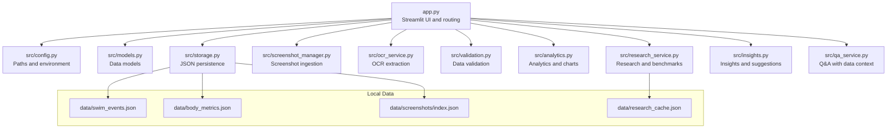

**Diagram sources**
- [app.py:1-447](file://app.py#L1-L447)
- [src/config.py:1-29](file://src/config.py#L1-L29)
- [src/storage.py:1-107](file://src/storage.py#L1-L107)
- [src/screenshot_manager.py:1-136](file://src/screenshot_manager.py#L1-L136)
- [src/ocr_service.py:1-144](file://src/ocr_service.py#L1-L144)
- [src/analytics.py:1-184](file://src/analytics.py#L1-L184)
- [src/research_service.py:1-94](file://src/research_service.py#L1-L94)
- [src/insights.py:1-150](file://src/insights.py#L1-L150)
- [src/qa_service.py:1-174](file://src/qa_service.py#L1-L174)

**Section sources**
- [README.md:1-63](file://README.md#L1-L63)
- [requirements.txt:1-10](file://requirements.txt#L1-L10)

## Core Components
- Streamlit application orchestrator: Handles UI pages, session state, and service orchestration.
- Configuration and paths: Centralized environment variables and file paths.
- Data models: Typed dataclasses for swim events and body metrics.
- Storage layer: JSON-backed persistence for events, metrics, screenshot index, and research cache.
- Services:
  - Screenshot ingestion and gallery
  - OCR extraction using Alibaba Cloud
  - Analytics and visualization
  - Research comparison with DuckDuckGo
  - Insight generation and training suggestions
  - Interactive Q&A with data context

**Section sources**
- [app.py:1-447](file://app.py#L1-L447)
- [src/config.py:1-29](file://src/config.py#L1-L29)
- [src/models.py:1-55](file://src/models.py#L1-L55)
- [src/storage.py:1-107](file://src/storage.py#L1-L107)

## Architecture Overview
The platform uses a modular, service-oriented architecture:
- UI layer built on Streamlit with page routing and session state.
- Service layer composed of independent modules for ingestion, OCR, analytics, research, insights, and Q&A.
- Persistence layer using JSON files for local-first operation.
- Configuration layer managing environment variables and paths.

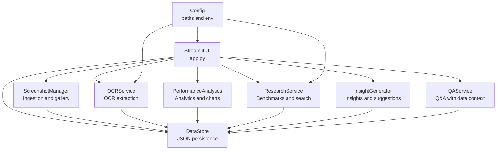

**Diagram sources**
- [app.py:1-447](file://app.py#L1-L447)
- [src/ocr_service.py:1-144](file://src/ocr_service.py#L1-L144)
- [src/screenshot_manager.py:1-136](file://src/screenshot_manager.py#L1-L136)
- [src/analytics.py:1-184](file://src/analytics.py#L1-L184)
- [src/research_service.py:1-94](file://src/research_service.py#L1-L94)
- [src/insights.py:1-150](file://src/insights.py#L1-L150)
- [src/qa_service.py:1-174](file://src/qa_service.py#L1-L174)
- [src/storage.py:1-107](file://src/storage.py#L1-L107)
- [src/config.py:1-29](file://src/config.py#L1-L29)

## Detailed Component Analysis

### Streamlit Orchestration and UI Pages
- Initializes session state for navigation, chat history, and last extraction.
- Provides sidebar navigation among Upload, Gallery, Body Metrics, Analytics, Research, Insights, and Q&A.
- Implements page-specific logic:
  - Upload: Saves screenshot, triggers OCR, validates and persists SwimEvent.
  - Gallery: Lists and thumbnails screenshots, supports deletion.
  - Body Metrics: Records and visualizes height, weight, BMI over time.
  - Analytics: Dashboard metrics, time progression, stroke comparison, personal bests.
  - Research: Benchmark search and comparison against personal bests.
  - Insights: Trend insights, strengths/weaknesses, potential assessment, training suggestions.
  - Q&A: Natural language questions with data context and conversation history.
- Exports and imports data as JSON for backup and restore.

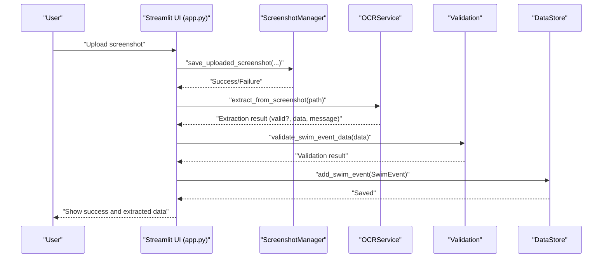

**Diagram sources**
- [app.py:60-127](file://app.py#L60-L127)
- [src/screenshot_manager.py:26-82](file://src/screenshot_manager.py#L26-L82)
- [src/ocr_service.py:49-120](file://src/ocr_service.py#L49-L120)
- [src/validation.py:75-103](file://src/validation.py#L75-L103)
- [src/storage.py:40-44](file://src/storage.py#L40-L44)

**Section sources**
- [app.py:40-403](file://app.py#L40-L403)

### OCR Service (Alibaba Cloud)
- Uses OpenAI-compatible client pointing to Alibaba Cloud base URL.
- Encodes images to base64 and sends multimodal prompts to Qwen model.
- Parses and validates JSON responses, attaches confidence and error metadata.
- Provides manual entry fallback form definitions.

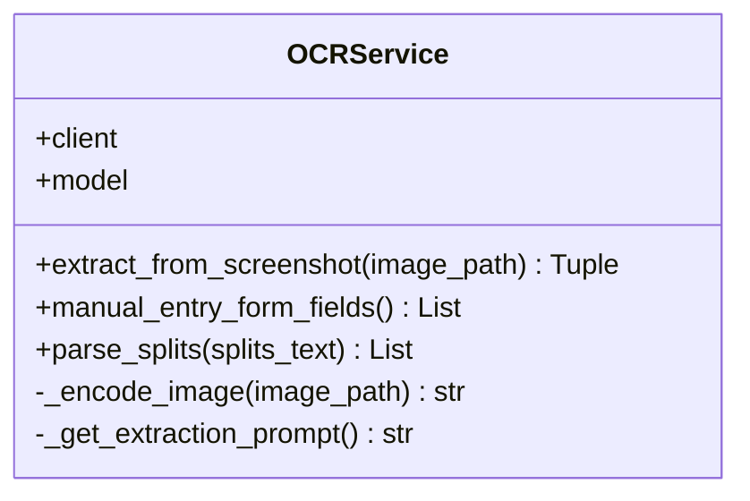

**Diagram sources**
- [src/ocr_service.py:12-144](file://src/ocr_service.py#L12-L144)

**Section sources**
- [src/ocr_service.py:12-144](file://src/ocr_service.py#L12-L144)

### Analytics Module
- Loads swim events into a DataFrame, converts time strings to seconds.
- Computes time progression charts, stroke comparison radar, personal bests, and age-adjusted performance.
- Provides dashboard summary metrics.

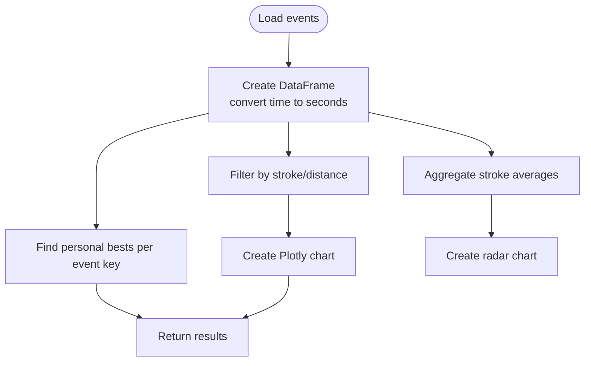

**Diagram sources**
- [src/analytics.py:13-184](file://src/analytics.py#L13-L184)

**Section sources**
- [src/analytics.py:13-184](file://src/analytics.py#L13-L184)

### Research Service (DuckDuckGo)
- Searches benchmark references using DuckDuckGo search.
- Caches results to JSON to reduce network calls.
- Compares personal best against retrieved benchmarks.

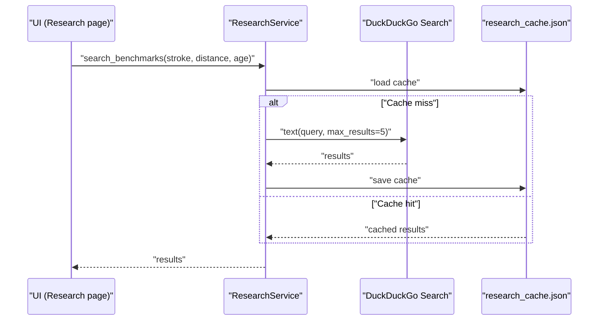

**Diagram sources**
- [src/research_service.py:31-54](file://src/research_service.py#L31-L54)
- [src/research_service.py:13-30](file://src/research_service.py#L13-L30)

**Section sources**
- [src/research_service.py:10-94](file://src/research_service.py#L10-L94)

### Insights Generator
- Generates trend insights across stroke-distance-course combinations.
- Identifies strengths and weaknesses by average pace.
- Produces potential assessment and training suggestions.

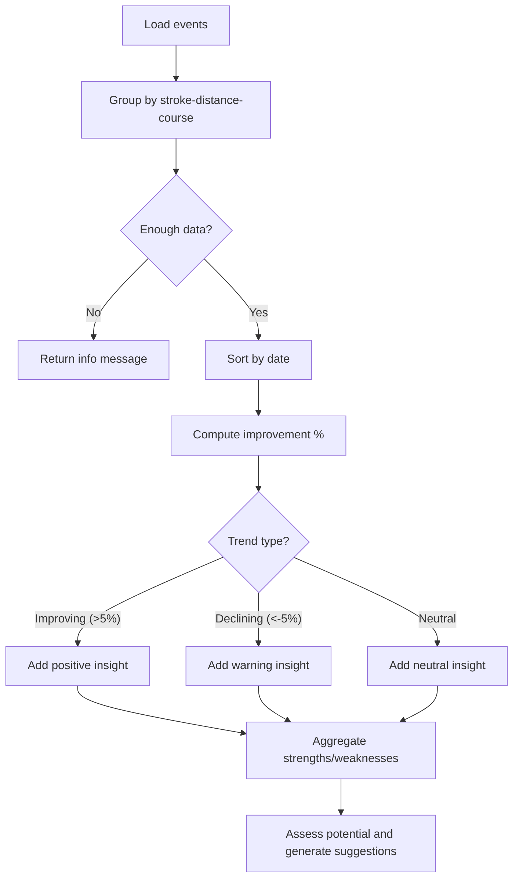

**Diagram sources**
- [src/insights.py:11-150](file://src/insights.py#L11-L150)

**Section sources**
- [src/insights.py:11-150](file://src/insights.py#L11-L150)

### Q&A Service
- Builds structured data context from swim events and body metrics.
- Classifies query types and answers using Alibaba Cloud text model.
- Maintains conversation history for contextual follow-ups.

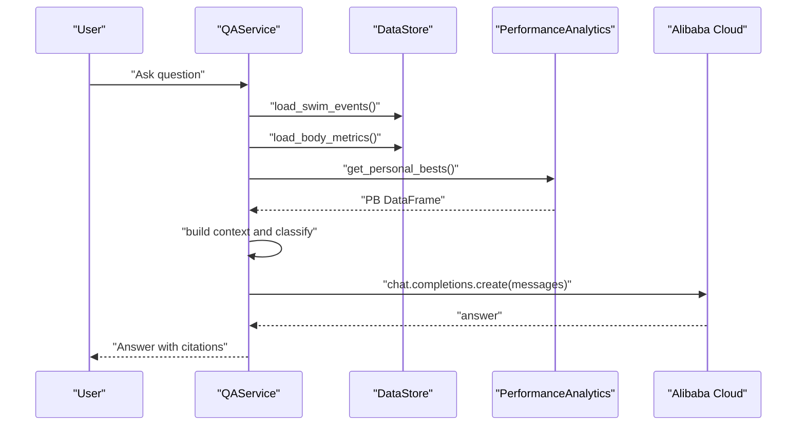

**Diagram sources**
- [src/qa_service.py:76-135](file://src/qa_service.py#L76-L135)
- [src/qa_service.py:23-57](file://src/qa_service.py#L23-L57)
- [src/analytics.py:114-139](file://src/analytics.py#L114-L139)
- [src/storage.py:30-62](file://src/storage.py#L30-L62)

**Section sources**
- [src/qa_service.py:12-174](file://src/qa_service.py#L12-L174)

### Data Models and Storage
- SwimEvent and BodyMetrics define typed data structures with serialization helpers.
- DataStore provides JSON persistence for events and metrics, plus a screenshot index manager.
- ScreenshotIndex maintains metadata for uploaded images, enabling deduplication and gallery operations.

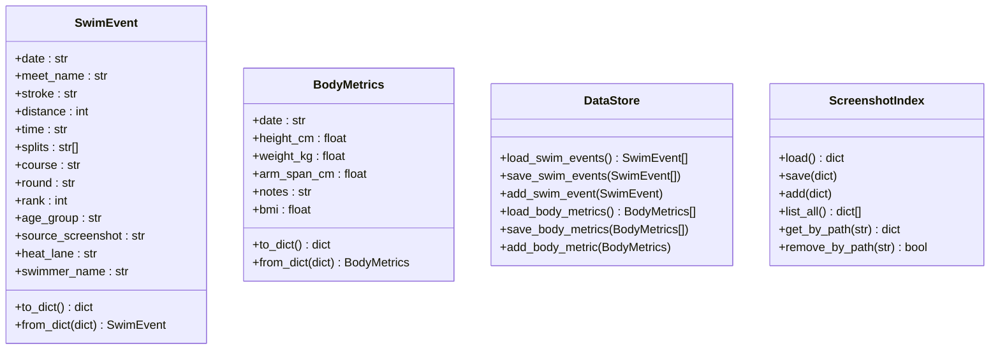

**Diagram sources**
- [src/models.py:7-55](file://src/models.py#L7-L55)
- [src/storage.py:10-107](file://src/storage.py#L10-L107)

**Section sources**
- [src/models.py:1-55](file://src/models.py#L1-L55)
- [src/storage.py:1-107](file://src/storage.py#L1-L107)

### Configuration and Environment
- Centralized configuration for file paths, environment variables, and time format regex.
- Alibaba Cloud settings support both vision-language and text models.
- DuckDuckGo search used for benchmark discovery.

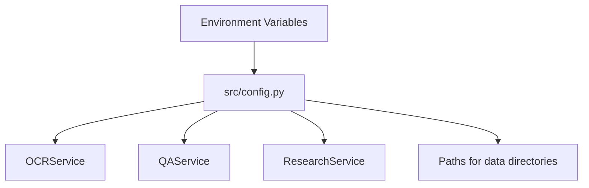

**Diagram sources**
- [src/config.py:1-29](file://src/config.py#L1-L29)

**Section sources**
- [src/config.py:1-29](file://src/config.py#L1-L29)

## Dependency Analysis
- UI depends on all service modules for page functionality.
- Services depend on configuration and storage modules.
- Analytics and insights depend on DataStore and validation utilities.
- Research service depends on DuckDuckGo search and DataStore.
- Q&A service depends on DataStore, analytics, and validation.

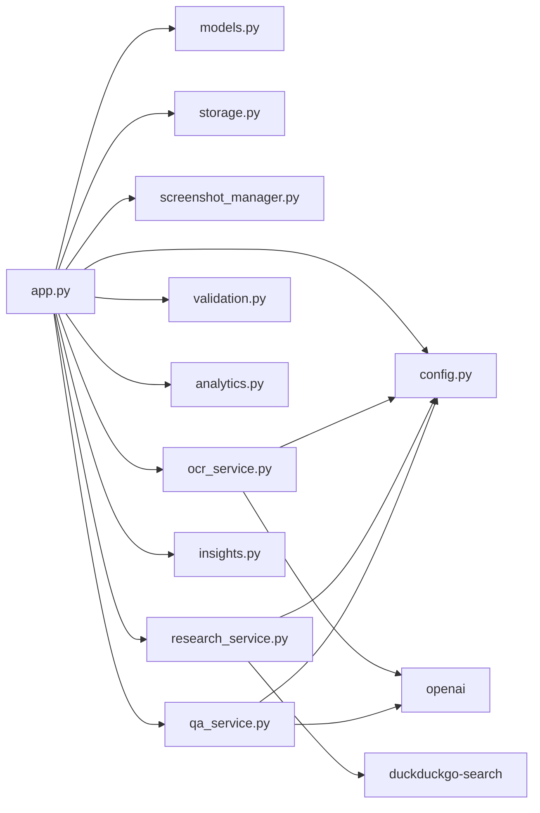

**Diagram sources**
- [app.py:10-19](file://app.py#L10-L19)
- [src/ocr_service.py:6-8](file://src/ocr_service.py#L6-L8)
- [src/qa_service.py:4-6](file://src/qa_service.py#L4-L6)
- [src/research_service.py:4](file://src/research_service.py#L4)
- [requirements.txt:1-10](file://requirements.txt#L1-L10)

**Section sources**
- [app.py:10-19](file://app.py#L10-L19)
- [requirements.txt:1-10](file://requirements.txt#L1-L10)

## Performance Considerations
- Local-first JSON persistence avoids network latency for CRUD operations but may incur I/O overhead for large datasets.
- OCR calls are synchronous and can block the UI; consider async patterns or background tasks for scalability.
- Analytics computations rely on pandas and Plotly; caching and precomputing summaries can improve responsiveness.
- Research cache reduces repeated DuckDuckGo calls; tune cache keys and TTL for accuracy and freshness.
- Q&A responses are generated synchronously; limit context length and conversation history to maintain speed.

[No sources needed since this section provides general guidance]

## Troubleshooting Guide
- Alibaba Cloud API key not configured:
  - Symptoms: OCR extraction and Q&A return configuration warnings.
  - Resolution: Set the required environment variables before launching the app.
- OCR parsing failures:
  - Symptoms: Extraction returns raw response and JSON decode errors.
  - Resolution: Verify image quality, ensure correct base URL and model names, and check network connectivity.
- Missing or invalid time formats:
  - Symptoms: Validation errors for time strings.
  - Resolution: Ensure times are in supported formats and splits are comma-separated.
- Empty analytics or insights:
  - Symptoms: No charts or insights generated.
  - Resolution: Upload sufficient swim events and body metrics; confirm JSON persistence files exist.

**Section sources**
- [app.py:442-447](file://app.py#L442-L447)
- [src/ocr_service.py:55-56](file://src/ocr_service.py#L55-L56)
- [src/qa_service.py:87-88](file://src/qa_service.py#L87-L88)
- [src/validation.py:7-23](file://src/validation.py#L7-L23)

## Conclusion
The Swimming Data Analysis Platform demonstrates a clean, modular architecture that separates UI concerns from service logic while maintaining a local-first, offline-friendly design. The Streamlit application orchestrates specialized services for OCR, analytics, research, insights, and Q&A, backed by JSON-based persistence. External integrations with Alibaba Cloud and DuckDuckGo enable powerful AI-driven features without sacrificing data locality. The architecture balances simplicity and extensibility, suitable for iterative enhancements and team collaboration.

[No sources needed since this section summarizes without analyzing specific files]

## Appendices

### Data Flow from Screenshot Upload to Analytics
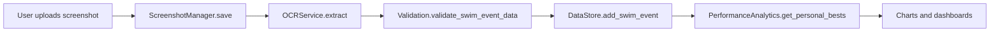

**Diagram sources**
- [app.py:73-118](file://app.py#L73-L118)
- [src/screenshot_manager.py:26-82](file://src/screenshot_manager.py#L26-L82)
- [src/ocr_service.py:49-120](file://src/ocr_service.py#L49-L120)
- [src/validation.py:75-103](file://src/validation.py#L75-L103)
- [src/storage.py:40-44](file://src/storage.py#L40-L44)
- [src/analytics.py:114-139](file://src/analytics.py#L114-L139)