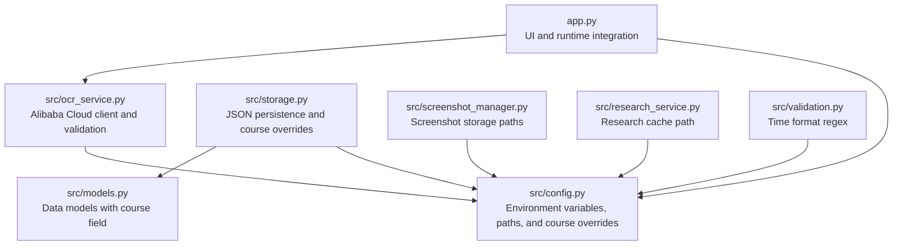
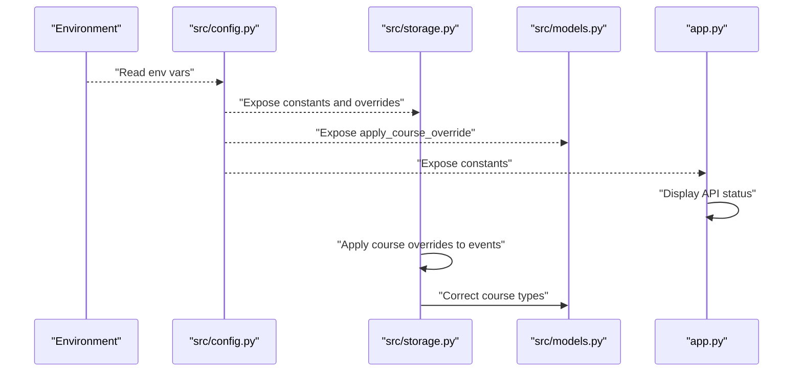
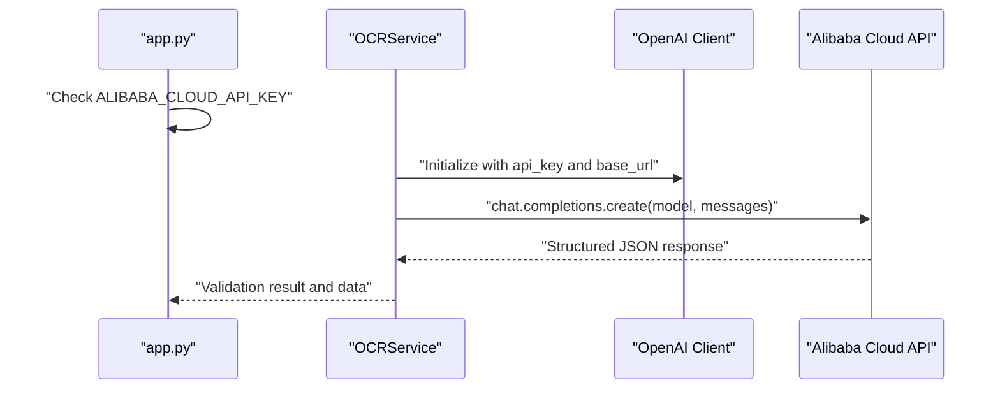
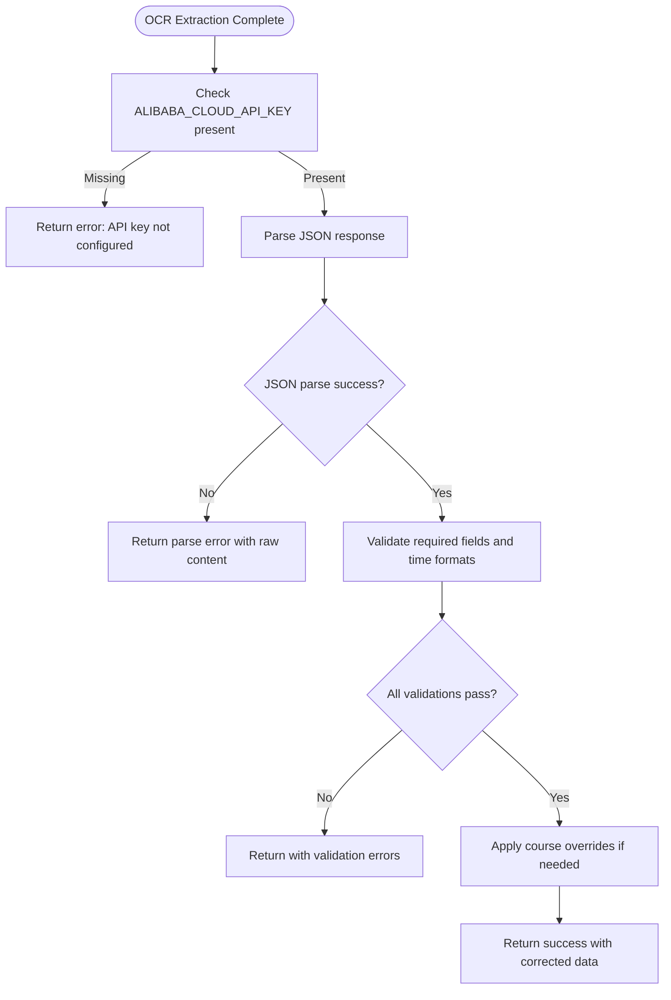
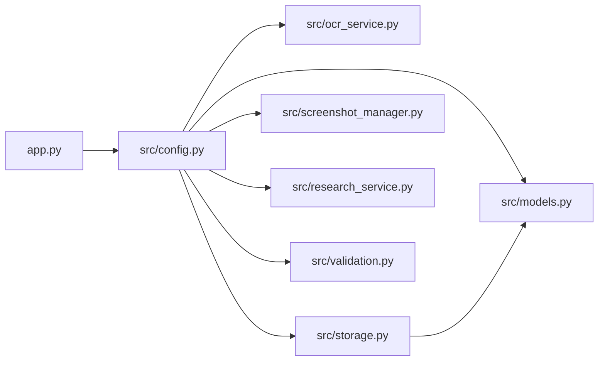

# Configuration Management

<cite>
**Referenced Files in This Document**
- [src/config.py](file://src/config.py)
- [app.py](file://app.py)
- [src/ocr_service.py](file://src/ocr_service.py)
- [src/storage.py](file://src/storage.py)
- [src/screenshot_manager.py](file://src/screenshot_manager.py)
- [src/validation.py](file://src/validation.py)
- [src/research_service.py](file://src/research_service.py)
- [src/models.py](file://src/models.py)
- [README.md](file://README.md)
- [requirements.txt](file://requirements.txt)
</cite>

## Update Summary
**Changes Made**
- Added documentation for MEET_COURSE_OVERRIDES configuration dictionary
- Documented the apply_course_override function for systematic course correction
- Updated core components section to include course override functionality
- Enhanced troubleshooting guide with course override scenarios
- Added new section covering course override configuration and usage

## Table of Contents
1. [Introduction](#introduction)
2. [Project Structure](#project-structure)
3. [Core Components](#core-components)
4. [Architecture Overview](#architecture-overview)
5. [Detailed Component Analysis](#detailed-component-analysis)
6. [Dependency Analysis](#dependency-analysis)
7. [Performance Considerations](#performance-considerations)
8. [Troubleshooting Guide](#troubleshooting-guide)
9. [Conclusion](#conclusion)
10. [Appendices](#appendices)

## Introduction
This document describes the configuration management system of the Swimming Data Analysis Platform. It explains how environment variables are loaded, validated, and consumed across the application, including Alibaba Cloud API configuration, path configuration for data directories, and integration with external services. It also covers security considerations for API key management, validation mechanisms, and practical guidance for environment-specific setups. The system now includes systematic course override functionality to handle OCR extraction errors for specific meets.

## Project Structure
The configuration system is centralized in a dedicated module and consumed by services responsible for OCR, storage, research, and screenshot management. The main application integrates configuration visibility for user feedback.

**Diagram sources**
- [src/config.py:1-66](file://src/config.py#L1-L66)
- [app.py:10-447](file://app.py#L10-L447)
- [src/ocr_service.py:1-144](file://src/ocr_service.py#L1-L144)
- [src/storage.py:1-166](file://src/storage.py#L1-L166)
- [src/screenshot_manager.py:1-136](file://src/screenshot_manager.py#L1-L136)
- [src/research_service.py:1-93](file://src/research_service.py#L1-L93)
- [src/validation.py:1-103](file://src/validation.py#L1-L103)
- [src/models.py:1-55](file://src/models.py#L1-L55)

**Section sources**
- [src/config.py:1-66](file://src/config.py#L1-L66)
- [app.py:10-447](file://app.py#L10-L447)

## Core Components
- Environment variables and defaults:
  - ALIBABA_CLOUD_API_KEY: API key for Alibaba Cloud Model Studio. Defaults to empty string if not set.
  - ALIBABA_CLOUD_BASE_URL: Base URL for Alibaba Cloud compatible API. Defaults to a known endpoint.
  - QWEN_MODEL_NAME: Vision-language model identifier for OCR. Defaults to a specific model name.
  - QWEN_TEXT_MODEL_NAME: Text model identifier for Q&A. Defaults to a specific model name.
- Path configuration:
  - PROJECT_ROOT: Root directory derived from the configuration module location.
  - DATA_DIR: Local data directory under project root.
  - SCREENSHOTS_DIR: Directory for raw screenshot images.
  - EXTRACTED_DIR: Directory for extracted artifacts.
  - BODY_METRICS_FILE: JSON file storing body metrics.
  - SWIM_EVENTS_FILE: JSON file storing swim events.
  - SCREENSHOT_INDEX_FILE: JSON index of screenshot metadata.
  - RESEARCH_CACHE_FILE: JSON cache for research results.
- Course override configuration:
  - MEET_COURSE_OVERRIDES: Dictionary mapping specific meet names to correct course types (LC/SC).
  - apply_course_override(): Function that applies systematic course corrections based on meet names.
- Time format regex:
  - TIME_FORMAT_MM_SS: Regex pattern for MM:SS.ss time format.
  - TIME_FORMAT_SS: Regex pattern for SS.ss time format.

These values are loaded via environment variables with sensible defaults and are used across OCR, storage, research, and UI layers. The course override system provides systematic correction for OCR extraction errors.

**Section sources**
- [src/config.py:1-66](file://src/config.py#L1-L66)

## Architecture Overview
The configuration system follows a central initialization pattern:
- Environment variables are read once during module import.
- Paths are computed relative to the project root.
- Course override mappings are initialized for systematic error correction.
- Services import configuration constants and apply defaults transparently.
- The UI surfaces configuration status to the user.

**Diagram sources**
- [src/config.py:1-66](file://src/config.py#L1-L66)
- [src/storage.py:48-89](file://src/storage.py#L48-L89)
- [src/models.py:7-29](file://src/models.py#L7-L29)
- [app.py:441-446](file://app.py#L441-L446)

## Detailed Component Analysis

### Environment Variables and Defaults
- ALIBABA_CLOUD_API_KEY
  - Purpose: Authenticates requests to Alibaba Cloud Model Studio for OCR and Q&A.
  - Default: Empty string.
  - Consumption: Used to initialize the OpenAI-compatible client in OCRService and validated before making requests.
- ALIBABA_CLOUD_BASE_URL
  - Purpose: Specifies the base URL for Alibaba Cloud compatible API.
  - Default: A known compatible endpoint.
  - Consumption: Passed to the OpenAI client initialization.
- QWEN_MODEL_NAME
  - Purpose: Selects the vision-language model for OCR.
  - Default: A specific model name.
  - Consumption: Used by OCRService to specify the model.
- QWEN_TEXT_MODEL_NAME
  - Purpose: Selects the text model for Q&A.
  - Default: A specific model name.
  - Consumption: Used by Q&A services (not shown here) to select the appropriate model.

Validation and error handling:
- If ALIBABA_CLOUD_API_KEY is empty, OCRService returns a clear error indicating the missing configuration.
- The UI checks ALIBABA_CLOUD_API_KEY and displays a status indicator.

**Section sources**
- [src/config.py:30-34](file://src/config.py#L30-L34)
- [src/ocr_service.py:15-21](file://src/ocr_service.py#L15-L21)
- [src/ocr_service.py:55-56](file://src/ocr_service.py#L55-L56)
- [app.py:441-446](file://app.py#L441-L446)

### Course Override Configuration
**Updated** Added systematic course override functionality to handle OCR extraction errors.

- MEET_COURSE_OVERRIDES
  - Purpose: Dictionary mapping specific meet names to correct course types (LC/SC).
  - Default: Contains predefined mappings for known problematic OCR extractions.
  - Current mappings: "CWSC+Millfield 2024 Int'l Open (Heats)" → "SC", "CWSC+Millfield 2024 Int'l Open (Finals)" → "SC".
  - Usage: Applied automatically when loading or adding swim events.
- apply_course_override(meet_name: str, course: str) -> str
  - Purpose: Systematically corrects course types based on meet name matching.
  - Behavior: Case-insensitive comparison with meet name overrides.
  - Logging: Logs when overrides are applied for debugging.
  - Return: Corrected course if match found, otherwise original course.

Integration points:
- Automatically applied when loading swim events from SWIM_EVENTS_FILE.
- Applied when adding new swim events to prevent duplicates.
- Used in storage operations to ensure consistent course data.

**Section sources**
- [src/config.py:50-66](file://src/config.py#L50-L66)
- [src/storage.py:48-89](file://src/storage.py#L48-L89)

### Path Configuration
- Computed paths:
  - PROJECT_ROOT: Derived from the configuration module's parent directory.
  - DATA_DIR: Under project root.
  - SCREENSHOTS_DIR: Under data directory for raw images.
  - EXTRACTED_DIR: Under data directory for extracted artifacts.
  - BODY_METRICS_FILE: JSON under data directory.
  - SWIM_EVENTS_FILE: JSON under data directory.
  - SCREENSHOT_INDEX_FILE: JSON index under screenshots directory.
  - RESEARCH_CACHE_FILE: JSON cache under data directory.
- Directory creation:
  - SCREENSHOTS_DIR and EXTRACTED_DIR are ensured to exist at import time.

Usage across modules:
- Storage layer reads/writes JSON files using the configured paths.
- Screenshot manager organizes images under SCREENSHOTS_DIR with meet/date subfolders.
- Research service caches results under RESEARCH_CACHE_FILE.
- Course override functionality operates on SWIM_EVENTS_FILE data.

**Section sources**
- [src/config.py:16-28](file://src/config.py#L16-L28)
- [src/storage.py:48-59](file://src/storage.py#L48-L59)
- [src/screenshot_manager.py:45-47](file://src/screenshot_manager.py#L45-L47)
- [src/research_service.py:14-29](file://src/research_service.py#L14-L29)

### API Endpoint Configuration for Alibaba Cloud
- The OCR service initializes an OpenAI-compatible client with:
  - api_key set to ALIBABA_CLOUD_API_KEY.
  - base_url set to ALIBABA_CLOUD_BASE_URL.
- The service uses QWEN_MODEL_NAME for vision-language OCR requests.
- The UI exposes a quick status indicator for API configuration.

**Diagram sources**
- [app.py:441-446](file://app.py#L441-L446)
- [src/ocr_service.py:15-86](file://src/ocr_service.py#L15-L86)
- [src/config.py:30-34](file://src/config.py#L30-L34)

**Section sources**
- [src/ocr_service.py:15-21](file://src/ocr_service.py#L15-L21)
- [src/ocr_service.py:59-86](file://src/ocr_service.py#L59-L86)
- [src/config.py:30-34](file://src/config.py#L30-L34)
- [app.py:441-446](file://app.py#L441-L446)

### Validation Mechanisms
- Time format validation:
  - TIME_FORMAT_MM_SS and TIME_FORMAT_SS are used to validate time strings in validation utilities.
  - The validator converts between time strings and seconds and enforces strict formats.
- OCR data validation:
  - After extracting JSON from OCR, the system validates required fields and time formats.
  - Errors are collected and returned alongside extracted data for transparency.
- Course override validation:
  - Course overrides are case-insensitive and only applied when meet names match exactly.
  - Logging provides visibility into when overrides are applied for debugging.

**Diagram sources**
- [src/ocr_service.py:55-116](file://src/ocr_service.py#L55-L116)
- [src/validation.py:75-103](file://src/validation.py#L75-L103)
- [src/config.py:50-66](file://src/config.py#L50-L66)

**Section sources**
- [src/validation.py:7-23](file://src/validation.py#L7-L23)
- [src/validation.py:75-103](file://src/validation.py#L75-L103)
- [src/ocr_service.py:106-116](file://src/ocr_service.py#L106-L116)
- [src/config.py:50-66](file://src/config.py#L50-L66)

### Security Considerations for API Key Management
- API keys are loaded from environment variables and should never be hardcoded.
- The UI warns if the key is not set, preventing accidental misuse.
- Recommendations:
  - Store ALIBABA_CLOUD_API_KEY in a secure environment variable provider or secrets manager.
  - Restrict access to deployment environments and CI/CD secrets.
  - Avoid committing secrets to version control; keep .env files out of the repository.
  - Rotate keys periodically and monitor usage.

**Section sources**
- [app.py:441-446](file://app.py#L441-L446)
- [README.md:22-25](file://README.md#L22-L25)

### Configuration Loading Patterns and Defaults
- Centralized import-time loading ensures consistent defaults across modules.
- Defaults are explicit and documented in the configuration module.
- Consumers import constants directly, avoiding duplication and ensuring uniform behavior.
- Course overrides are applied transparently during data operations.

**Section sources**
- [src/config.py:30-34](file://src/config.py#L30-L34)
- [src/config.py:50-66](file://src/config.py#L50-L66)

### Environment-Specific Setups and Examples
- Typical setup:
  - Set ALIBABA_CLOUD_API_KEY to your Alibaba Cloud credential.
  - Optionally override ALIBABA_CLOUD_BASE_URL if using a proxy or alternate endpoint.
  - Optionally override QWEN_MODEL_NAME or QWEN_TEXT_MODEL_NAME for different models.
- Course override customization:
  - Add meet name mappings to MEET_COURSE_OVERRIDES dictionary for systematic corrections.
  - Use case-insensitive matching for meet names in the override dictionary.
- Example commands (from project documentation):
  - Export the API key in your shell before running the application.
- Data directories:
  - All data is stored under the data/ directory, including screenshots, JSON datasets, and research cache.

**Section sources**
- [README.md:22-30](file://README.md#L22-L30)
- [src/config.py:16-28](file://src/config.py#L16-L28)
- [src/config.py:50-66](file://src/config.py#L50-L66)

## Dependency Analysis
Configuration dependencies across modules are straightforward and centralized, with course override functionality integrated into the storage layer.

**Diagram sources**
- [src/config.py:1-66](file://src/config.py#L1-L66)
- [src/ocr_service.py:8](file://src/ocr_service.py#L8)
- [src/storage.py:7](file://src/storage.py#L7)
- [src/screenshot_manager.py:10](file://src/screenshot_manager.py#L10)
- [src/research_service.py:6](file://src/research_service.py#L6)
- [src/validation.py:4](file://src/validation.py#L4)
- [src/models.py:1-55](file://src/models.py#L1-L55)
- [app.py:10](file://app.py#L10)

**Section sources**
- [src/config.py:1-66](file://src/config.py#L1-L66)

## Performance Considerations
- Environment variable lookup occurs at import time; this is negligible overhead.
- Path existence checks and JSON serialization are infrequent operations compared to OCR requests.
- Course override operations are O(n) where n is the number of meet overrides, typically small.
- Caching research results reduces network overhead for repeated queries.

## Troubleshooting Guide
Common configuration issues and resolutions:
- Missing Alibaba Cloud API key:
  - Symptom: OCR extraction fails with a configuration error; UI shows a warning.
  - Resolution: Set ALIBABA_CLOUD_API_KEY in your environment and restart the application.
- Incorrect base URL:
  - Symptom: Network errors when calling the OCR service.
  - Resolution: Verify ALIBABA_CLOUD_BASE_URL points to a valid compatible endpoint.
- Time format errors:
  - Symptom: Validation errors for extracted times.
  - Resolution: Ensure times conform to MM:SS.ss or SS.ss formats.
- Data directory permissions:
  - Symptom: Failures saving JSON or images.
  - Resolution: Ensure write permissions to the data/ directory and its subdirectories.
- Course override issues:
  - Symptom: Incorrect course types in swim events despite correct OCR extraction.
  - Resolution: Add meet name to MEET_COURSE_OVERRIDES dictionary with correct course type.
  - Debug: Check logs for "Course override applied" messages to verify corrections.
- Meet name mismatches:
  - Symptom: Course overrides not applied even with obvious OCR errors.
  - Resolution: Ensure meet name in OCR data exactly matches dictionary key (case-insensitive).
  - Debug: Verify exact meet name spelling and punctuation in OCR output.

Debugging techniques:
- Inspect ALIBABA_CLOUD_API_KEY availability in the UI status panel.
- Enable verbose logging in OCRService to capture request/response details.
- Validate time formats using the validation utilities.
- Confirm directory existence and permissions for data paths.
- Check course override logs for automatic corrections.
- Verify meet name exact matches in MEET_COURSE_OVERRIDES dictionary.

**Section sources**
- [src/ocr_service.py:55-56](file://src/ocr_service.py#L55-L56)
- [src/ocr_service.py:103-104](file://src/ocr_service.py#L103-L104)
- [app.py:441-446](file://app.py#L441-L446)
- [src/validation.py:1-103](file://src/validation.py#L1-L103)
- [src/config.py:50-66](file://src/config.py#L50-L66)
- [src/storage.py:48-89](file://src/storage.py#L48-L89)

## Conclusion
The configuration management system is intentionally minimal and robust. It centralizes environment variables and path definitions, applies sensible defaults, and exposes clear validation and error handling. The addition of systematic course override functionality enhances data quality by providing automated corrections for OCR extraction errors. By following the recommended security practices and environment-specific setup steps, teams can reliably operate the platform across diverse environments while maintaining data integrity through intelligent course correction mechanisms.

## Appendices

### Environment Variables Reference
- ALIBABA_CLOUD_API_KEY
  - Type: String
  - Required: Yes (for OCR/Q&A)
  - Default: Empty string
  - Notes: Set via environment variable
- ALIBABA_CLOUD_BASE_URL
  - Type: String
  - Required: No
  - Default: Compatible API endpoint
  - Notes: Override for proxies/endpoints
- QWEN_MODEL_NAME
  - Type: String
  - Required: No
  - Default: Vision-language model identifier
  - Notes: OCR model selection
- QWEN_TEXT_MODEL_NAME
  - Type: String
  - Required: No
  - Default: Text model identifier
  - Notes: Q&A model selection

**Section sources**
- [src/config.py:30-34](file://src/config.py#L30-L34)
- [README.md:22-25](file://README.md#L22-L25)

### Course Override Configuration Reference
- MEET_COURSE_OVERRIDES
  - Type: dict[str, str]
  - Required: No
  - Default: Contains predefined mappings for known OCR issues
  - Format: {meet_name: correct_course}
  - Example: {"CWSC+Millfield 2024 Int'l Open (Heats)": "SC"}
  - Usage: Automatic application during swim event processing
- apply_course_override(meet_name: str, course: str) -> str
  - Purpose: Apply systematic course corrections based on meet name
  - Parameters: meet_name (str), course (str)
  - Returns: Corrected course string if override exists, otherwise original course
  - Behavior: Case-insensitive meet name matching

**Section sources**
- [src/config.py:50-66](file://src/config.py#L50-L66)

### Data Directory Layout
- data/
  - body_metrics.json
  - swim_events.json
  - research_cache.json
  - screenshots/
    - index.json
    - Meet Name/
      - YYYY-MM-DD/
        - screenshot.png

**Section sources**
- [src/config.py:16-28](file://src/config.py#L16-L28)
- [src/config.py:22-25](file://src/config.py#L22-L25)
- [src/screenshot_manager.py:45-47](file://src/screenshot_manager.py#L45-L47)

### Swim Event Data Structure
- SwimEvent model fields:
  - date: str (ISO format: YYYY-MM-DD)
  - meet_name: str
  - stroke: str (freestyle, backstroke, breaststroke, butterfly, IM)
  - distance: int (meters: 50, 100, 200, 400, 800, 1500)
  - time: str (MM:SS.ss or SS.ss format)
  - splits: List[str] (split times)
  - course: str (LC or SC)
  - round: str (heat, semifinal, final)
  - rank: int
  - age_group: str
  - source_screenshot: str
  - heat_lane: str
  - swimmer_name: str

**Section sources**
- [src/models.py:7-29](file://src/models.py#L7-L29)