# Application Controller

<cite>
**Referenced Files in This Document**
- [app.py](file://app.py)
- [src/theme.py](file://src/theme.py)
- [src/config.py](file://src/config.py)
- [src/models.py](file://src/models.py)
- [src/storage.py](file://src/storage.py)
- [src/screenshot_manager.py](file://src/screenshot_manager.py)
- [src/ocr_service.py](file://src/ocr_service.py)
- [src/validation.py](file://src/validation.py)
- [src/analytics.py](file://src/analytics.py)
- [src/insights.py](file://src/insights.py)
- [src/qa_service.py](file://src/qa_service.py)
- [requirements.txt](file://requirements.txt)
- [README.md](file://README.md)
</cite>

## Update Summary
**Changes Made**
- **Comprehensive Theme System**: Implemented centralized theme management with src/theme.py module providing dark/light theme definitions
- **Theme Toggle Control**: Added dynamic theme switching functionality with st.toggle widget in sidebar navigation
- **Streamlit Theme Integration**: Integrated with Streamlit's native theme system using _st_config.set_option() for real-time theme switching
- **Enhanced Styling System**: Updated all UI components to use theme-aware styling with gradient KPI cards, bordered containers, and consistent color schemes
- **Plotly Chart Theming**: Extended theme system to include Plotly chart color palettes for consistent visual representation
- **Responsive Theme Switching**: Implemented automatic theme switching with st.rerun() to refresh all page components

## Table of Contents
1. [Introduction](#introduction)
2. [Project Structure](#project-structure)
3. [Core Components](#core-components)
4. [Architecture Overview](#architecture-overview)
5. [Detailed Component Analysis](#detailed-component-analysis)
6. [Centralized Theme Management](#centralized-theme-management)
7. [Dynamic Theme Switching System](#dynamic-theme-switching-system)
8. [Enhanced Navigation System](#enhanced-navigation-system)
9. [Modernized Page Layouts](#modernized-page-layouts)
10. [Container-Based UI Components](#container-based-ui-components)
11. [Page Routing and Content](#page-routing-and-content)
12. [Dependency Analysis](#dependency-analysis)
13. [Performance Considerations](#performance-considerations)
14. [Troubleshooting Guide](#troubleshooting-guide)
15. [Conclusion](#conclusion)

## Introduction
This document provides comprehensive documentation for the main application controller (app.py) of the Swimming Data Analysis Platform. The controller orchestrates a modern Streamlit-based UI with seven main pages: Upload, Gallery, Body Metrics, Analytics, Research, Insights, and Q&A. The application features a comprehensive dark/light theme system implemented with centralized theme management, dynamic theme switching, and extensive styling updates across all UI components.

**Updated** Enhanced with a sophisticated theme management system featuring centralized theme definitions, dynamic theme switching controls, and seamless integration with Streamlit's native theming capabilities. The theme system provides consistent color schemes across all UI components including gradient KPI cards, bordered containers, and Plotly charts.

## Project Structure
The application follows a modular architecture with a clear separation between UI orchestration (app.py) and domain services located under src/. The new theme management system adds a dedicated theme module for centralized color palette management. Key directories and files:
- app.py: Central Streamlit application controller and page router with comprehensive theme integration
- src/theme.py: Centralized theme definitions for dark and light modes with Plotly chart support
- src/: Domain services and utilities
  - config.py: Configuration constants and environment variables
  - models.py: Data models for SwimEvent and BodyMetrics
  - storage.py: File-based persistence layer
  - screenshot_manager.py: Screenshot ingestion and gallery management
  - ocr_service.py: Alibaba Cloud OCR integration
  - validation.py: Data validation utilities
  - analytics.py: Performance analytics and visualizations
  - insights.py: Trend analysis and training suggestions
  - qa_service.py: Natural language Q&A
- requirements.txt: Dependencies
- README.md: Project overview and usage

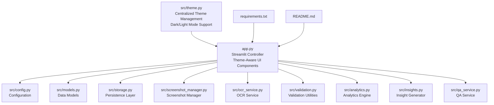

**Diagram sources**
- [app.py:1-1595](file://app.py#L1-L1595)
- [src/theme.py:1-45](file://src/theme.py#L1-L45)
- [src/config.py:1-29](file://src/config.py#L1-L29)
- [src/models.py:1-55](file://src/models.py#L1-L55)
- [src/storage.py:1-107](file://src/storage.py#L1-L107)
- [src/screenshot_manager.py:1-136](file://src/screenshot_manager.py#L1-L136)
- [src/ocr_service.py:1-144](file://src/ocr_service.py#L1-L144)
- [src/validation.py:1-103](file://src/validation.py#L1-L103)
- [src/analytics.py:1-315](file://src/analytics.py#L1-L315)
- [src/insights.py:1-150](file://src/insights.py#L1-L150)
- [src/qa_service.py:1-174](file://src/qa_service.py#L1-L174)

**Section sources**
- [app.py:1-1595](file://app.py#L1-L1595)
- [src/theme.py:1-45](file://src/theme.py#L1-L45)
- [README.md:1-66](file://README.md#L1-L66)

## Core Components
The application controller centers around several key components with comprehensive theme integration:

- **Centralized Theme Management**: Implements src/theme.py module providing DARK and LIGHT color palettes with 19 color definitions each
- **Dynamic Theme Switching**: Features theme toggle control in sidebar navigation with real-time switching using st.toggle widget
- **Streamlit Theme Integration**: Integrates with Streamlit's native theme system using _st_config.set_option() for immediate theme application
- **Enhanced UI Styling**: Extends theme system to cover all UI components including buttons, containers, tables, and charts
- **Plotly Chart Theming**: Provides Plotly-specific color palettes for consistent chart theming across performance analytics
- **Gradient KPI Cards**: Implements theme-aware gradient backgrounds with accent borders for dashboard metrics
- **Bordered Container System**: Maintains consistent bordered container layouts with theme-appropriate colors
- **Responsive Theme Application**: Automatically applies theme changes across all page components using st.rerun()

Key implementation patterns:
- Streamlit page routing using session state to control visibility
- Centralized theme definitions accessed via get_theme() function
- Dynamic theme switching with session state synchronization
- Theme-aware CSS styling for all UI components
- Streamlit theme configuration integration for native component theming
- Gradient-styled KPI cards with consistent design language across themes
- Spinner usage for async operations (OCR extraction, research search)
- Responsive layout using Streamlit columns and theme-appropriate containers
- Error handling with user-friendly feedback messages
- Inter-page data sharing via session state variables

**Section sources**
- [app.py:76-96](file://app.py#L76-L96)
- [app.py:295-302](file://app.py#L295-L302)
- [src/theme.py:1-45](file://src/theme.py#L1-L45)

## Architecture Overview
The application employs a layered architecture with clear separation of concerns and comprehensive theme integration:

```mermaid
graph TB
subgraph "Presentation Layer"
UI["Streamlit UI<br/>Pages: Upload, Gallery, Body Metrics,<br/>Analytics, Research, Insights,<br/>Q&A<br/>Theme-Aware Container System"]
THEME["Theme Management<br/>Centralized Color Palettes<br/>Dynamic Theme Switching"]
end
subgraph "Controller Layer"
CTRL["App Controller<br/>Session State<br/>Page Routing<br/>Theme Integration"]
end
subgraph "Domain Services"
OCR["OCR Service<br/>Alibaba Cloud API"]
QA["QA Service<br/>Alibaba Cloud API"]
ANA["Analytics Engine<br/>Performance Charts<br/>Theme-Aware Visualization"]
RES["Research Service<br/>Benchmark Search"]
INS["Insight Generator<br/>Trend Analysis"]
END
subgraph "Data Layer"
STORE["DataStore<br/>JSON Persistence"]
IDX["ScreenshotIndex<br/>Metadata Index"]
CFG["Config<br/>Environment Variables"]
END
subgraph "External Services"
ALI["Alibaba Cloud<br/>Model Studio"]
DDG["DuckDuckGo Search<br/>Benchmarks"]
END
UI --> THEME
UI --> CTRL
CTRL --> THEME
CTRL --> OCR
CTRL --> QA
CTRL --> ANA
CTRL --> RES
CTRL --> INS
OCR --> ALI
QA --> ALI
RES --> DDG
CTRL --> STORE
CTRL --> IDX
CTRL --> CFG
THEME --> STORE
THEME --> IDX
THEME --> CFG
STORE --> STORE
IDX --> STORE
```

**Diagram sources**
- [app.py:1-1595](file://app.py#L1-L1595)
- [src/theme.py:1-45](file://src/theme.py#L1-L45)
- [src/ocr_service.py:12-21](file://src/ocr_service.py#L12-L21)
- [src/qa_service.py:12-22](file://src/qa_service.py#L12-L22)
- [src/analytics.py:13-14](file://src/analytics.py#L13-L14)
- [src/insights.py:11-12](file://src/insights.py#L11-L12)
- [src/storage.py:10-62](file://src/storage.py#L10-L62)
- [src/screenshot_manager.py:14-15](file://src/screenshot_manager.py#L14-L15)
- [src/config.py:1-29](file://src/config.py#L1-29)

## Detailed Component Analysis

### Centralized Theme Management
The application features a comprehensive theme management system implemented in src/theme.py with centralized color palette definitions:

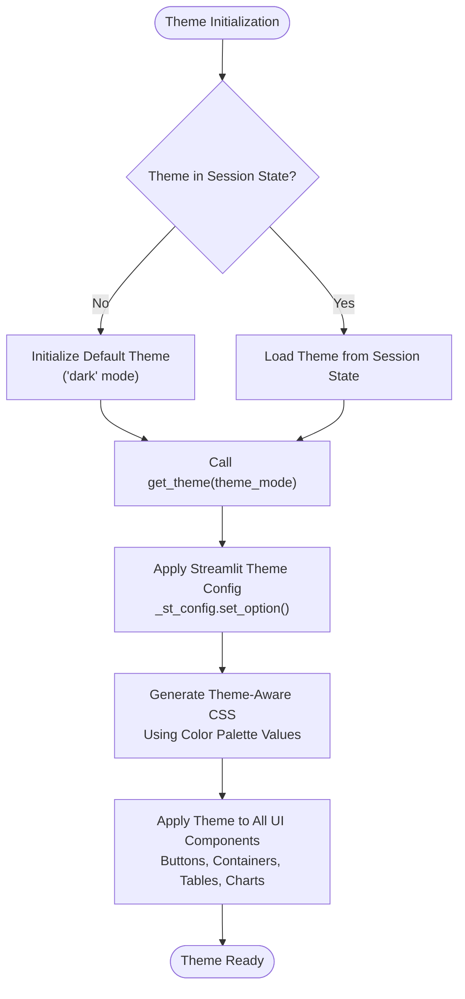

**Diagram sources**
- [app.py:76-96](file://app.py#L76-L96)
- [src/theme.py:1-45](file://src/theme.py#L1-L45)

Key theme features:
- **Dark Theme Palette**: Comprehensive color scheme with `#09090B` background, `#18181B` secondary background, `#3F3F46` borders, and `#06B6D4` accent color
- **Light Theme Palette**: Complementary light scheme with `#FFFFFF` background, `#F4F4F5` secondary background, `#D4D4D8` borders, and `#0891B2` accent color
- **Gradient Card Support**: Dedicated `bg_card_start` and `bg_card_end` colors for gradient KPI cards
- **Plotly Chart Integration**: Separate color definitions for chart backgrounds, paper backgrounds, grid lines, and font colors
- **Text Hierarchy Colors**: Distinct colors for primary text (`#FAFAFA`/`#18181B`), secondary text (`#A1A1AA`/`#52525B`), and muted text (`#71717A`)
- **Sidebar Hover Effects**: Theme-appropriate hover colors for navigation buttons

**Section sources**
- [src/theme.py:1-45](file://src/theme.py#L1-L45)

### Dynamic Theme Switching System
The application implements a sophisticated theme switching mechanism with real-time updates:

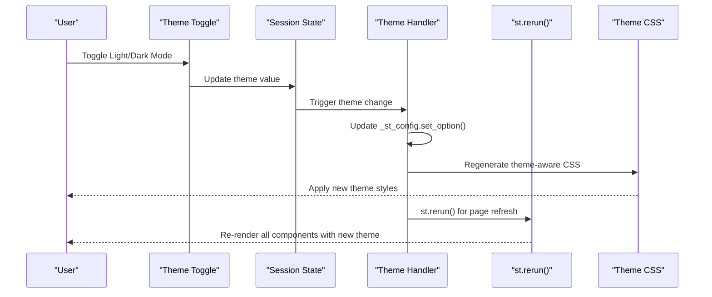

**Diagram sources**
- [app.py:295-302](file://app.py#L295-L302)
- [app.py:88-96](file://app.py#L88-L96)

Theme switching implementation:
- **Toggle Control**: `st.toggle("☀️ Light Mode", value=(st.session_state.theme == "light"))` provides intuitive theme switching
- **Session State Management**: Theme preference stored in `st.session_state.theme` with automatic persistence
- **Streamlit Integration**: `_st_config.set_option()` immediately applies theme changes to Streamlit's native components
- **Real-time Updates**: `st.rerun()` refreshes all page components to reflect theme changes instantly
- **Color Configuration**: Automatic updates to primary colors, backgrounds, and text colors across all components

**Section sources**
- [app.py:295-302](file://app.py#L295-L302)
- [app.py:88-96](file://app.py#L88-L96)

### Enhanced Navigation System
The sidebar implements a structured navigation interface with Analysis and Tools sections and theme-aware styling:

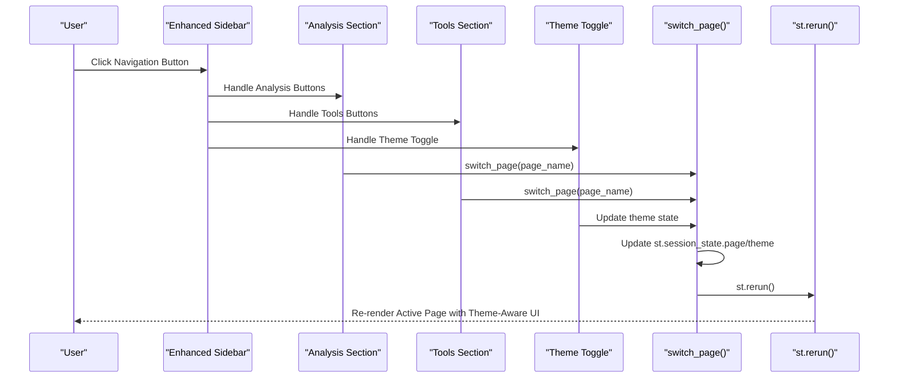

**Diagram sources**
- [app.py:291-327](file://app.py#L291-L327)
- [app.py:286-288](file://app.py#L286-L288)

Navigation structure with Analysis and Tools sections:
- **Analysis Section** (Primary Navigation):
  - Benchmarks (Chinese National Standards)
  - Performance (Analytics Dashboard)
  - Insights (Trend Analysis)
  - AI Coach (Q&A Interface)
- **Tools Section** (Secondary Navigation):
  - Upload (Screenshot Upload)
  - Gallery (All Swim Records)
  - Body Metrics (Physical Measurements)
- **Theme Toggle Control**: Integrated into sidebar navigation with theme-aware styling

**Section sources**
- [app.py:291-327](file://app.py#L291-L327)

### Modernized Page Layouts
The application implements modern container-based layouts with comprehensive theme integration:

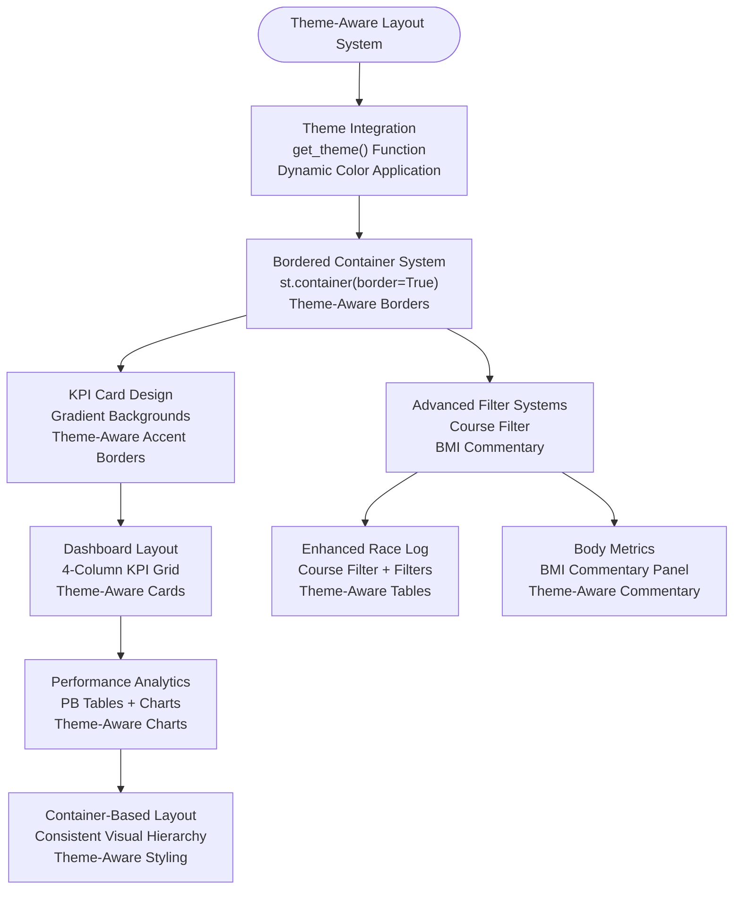

**Diagram sources**
- [app.py:344-348](file://app.py#L344-L348)
- [app.py:844-853](file://app.py#L844-L853)
- [app.py:992-997](file://app.py#L992-L997)
- [app.py:1539-1546](file://app.py#L1539-L1546)

Key modernization features:
- **Theme-Aware Container System**: Consistent use of `st.container(border=True)` with theme-appropriate colors
- **Gradient KPI Card Design**: Theme-aware gradient backgrounds with left-side accent borders
- **Advanced Filter Systems**: Course filter in Race Log and BMI commentary panel in Body Metrics with theme integration
- **Enhanced Table Interactions**: Bordered containers with theme-appropriate hover effects and styling
- **Container-Based Layout**: Organized sections with visual separation and consistent theme styling
- **Plotly Chart Theming**: Charts automatically adapt to current theme with consistent color schemes

**Section sources**
- [app.py:344-348](file://app.py#L344-L348)
- [app.py:844-853](file://app.py#L844-L853)
- [app.py:992-997](file://app.py#L992-L997)
- [app.py:1539-1546](file://app.py#L1539-L1546)

### Container-Based UI Components
The application extensively uses bordered container layouts with comprehensive theme integration:

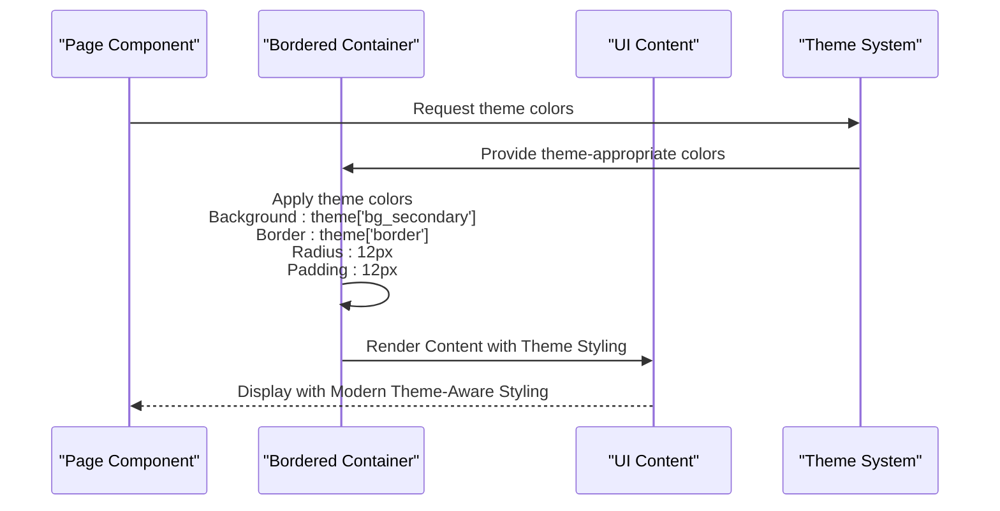

**Diagram sources**
- [app.py:171-176](file://app.py#L171-L176)

Container styling specifications with theme integration:
- **Background**: `theme['bg_secondary']` (dark: `#18181B`, light: `#F4F4F5`)
- **Border**: `theme['border']` (dark: `#3F3F46`, light: `#D4D4D8`)
- **Border Radius**: `12px` (rounded corners)
- **Padding**: `12px` (internal spacing)
- **Accent Color**: `theme['accent']` (dark: `#06B6D4`, light: `#0891B2`)

**Section sources**
- [app.py:171-176](file://app.py#L171-L176)

### Session State Management
The controller initializes essential session state variables with comprehensive theme awareness:

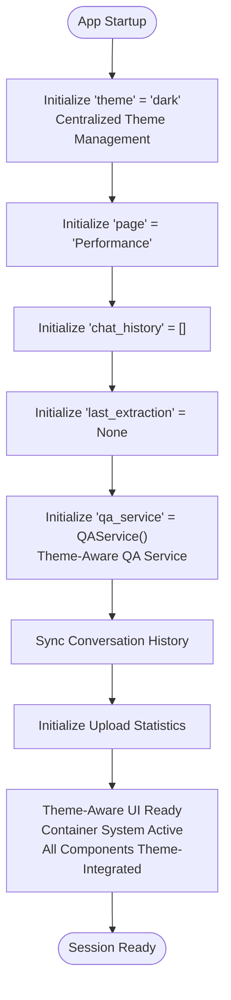

**Diagram sources**
- [app.py:264-284](file://app.py#L264-L284)

Key session state variables with theme integration:
- theme: Current theme mode ('dark' or 'light') with centralized management
- page: Current active page identifier (default: "Performance")
- chat_history: Conversation history for AI Coach with theme-aware styling
- last_extraction: Most recent OCR extraction result
- qa_service: Persistent QA service instance with conversation history sync and theme integration
- upload_success_count, upload_failed_count, upload_duplicate_count: Import statistics
- upload_new_count: New upload counter

**Section sources**
- [app.py:264-284](file://app.py#L264-L284)

### Page Routing and Content
The application routes to seven main pages with comprehensive theme integration and modernized content:

#### Upload Page
Handles screenshot ingestion, OCR extraction, and data validation with enhanced theme-aware UI:

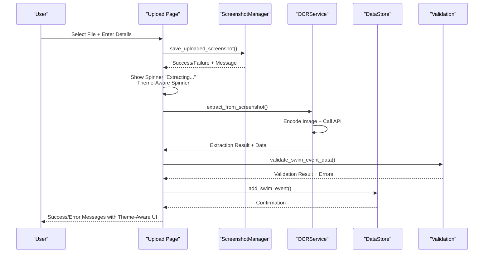

**Diagram sources**
- [app.py:331-776](file://app.py#L331-L776)
- [src/screenshot_manager.py:27-82](file://src/screenshot_manager.py#L27-L82)
- [src/ocr_service.py:49-119](file://src/ocr_service.py#L49-L119)
- [src/validation.py:75-103](file://src/validation.py#L75-L103)
- [src/storage.py:40-44](file://src/storage.py#L40-L44)

#### Gallery Page
Provides comprehensive swim records management with enhanced theme-aware table interactions and Course filter:

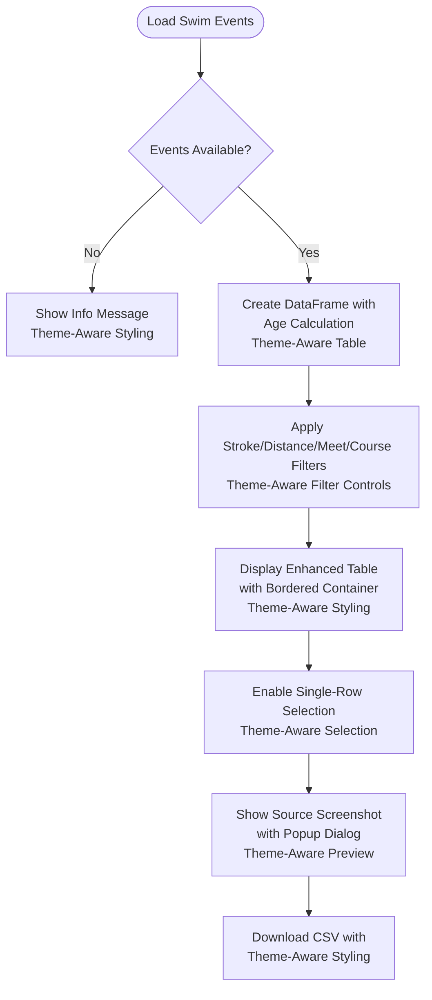

**Diagram sources**
- [app.py:779-883](file://app.py#L779-L883)

#### Analytics Page
Features comprehensive performance visualization with enhanced Personal Bests interaction, theme-aware KPI cards, and Plotly charts:

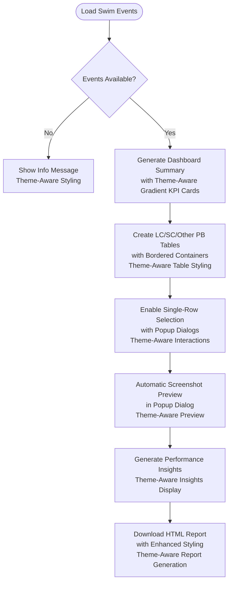

**Diagram sources**
- [app.py:975-1366](file://app.py#L975-L1366)
- [src/analytics.py:36-65](file://src/analytics.py#L36-L65)
- [src/analytics.py:43-60](file://src/analytics.py#L43-L60)
- [src/analytics.py:91-112](file://src/analytics.py#L91-L112)
- [src/analytics.py:115-138](file://src/analytics.py#L115-L138)

#### Research Page
Displays Chinese National Swimming Standards with OCR import capability and theme-aware bordered container styling:

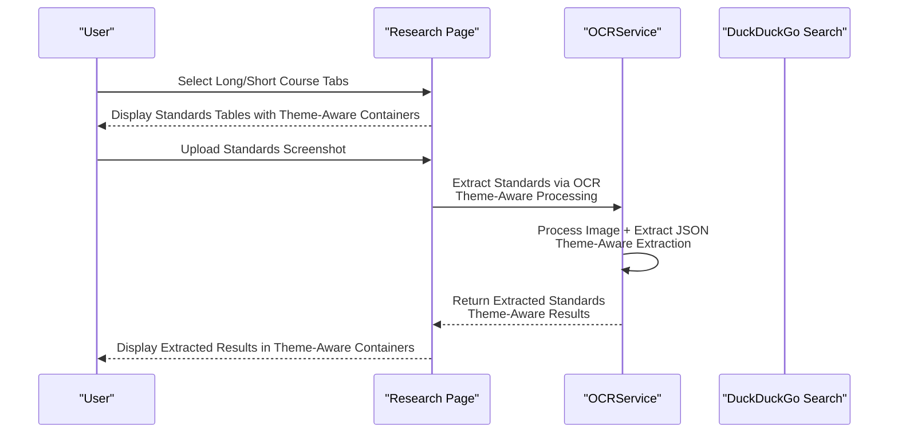

**Diagram sources**
- [app.py:1369-1470](file://app.py#L1369-L1470)

#### Insights Page
Generates trend analysis and training recommendations with enhanced presentation, theme-aware KPI cards, and comprehensive styling:

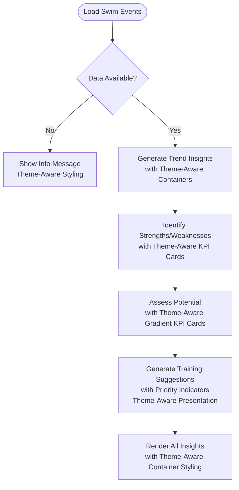

**Diagram sources**
- [app.py:1472-1559](file://app.py#L1472-L1559)
- [src/insights.py:14-63](file://src/insights.py#L14-L63)
- [src/insights.py:66-87](file://src/insights.py#L66-L87)
- [src/insights.py:90-111](file://src/insights.py#L90-L111)
- [src/insights.py:122-149](file://src/insights.py#L122-L149)

#### Q&A Page
Provides natural language interaction with swimming data using enhanced theme-aware chat interface:

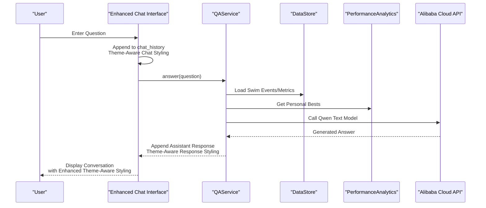

**Diagram sources**
- [app.py:1561-1593](file://app.py#L1561-L1593)
- [src/qa_service.py:76-134](file://src/qa_service.py#L76-L134)
- [src/qa_service.py:23-57](file://src/qa_service.py#L23-L57)

**Section sources**
- [app.py:331-1595](file://app.py#L331-L1595)

## Dependency Analysis
The application exhibits clear dependency relationships between modules with comprehensive theme integration:

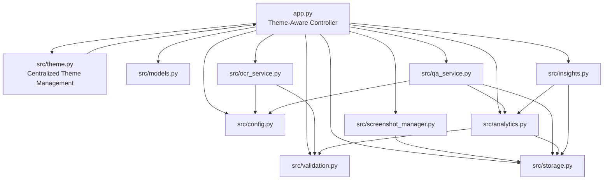

**Diagram sources**
- [app.py:66-67](file://app.py#L66-L67)
- [src/theme.py:41-44](file://src/theme.py#L41-L44)
- [src/screenshot_manager.py:10-11](file://src/screenshot_manager.py#L10-L11)
- [src/ocr_service.py:8-9](file://src/ocr_service.py#L8-L9)
- [src/qa_service.py:6-9](file://src/qa_service.py#L6-L9)
- [src/analytics.py:8-10](file://src/analytics.py#L8-L10)
- [src/insights.py:5-8](file://src/insights.py#L5-L8)

Key dependency patterns:
- **Centralized Theme Integration**: app.py imports get_theme() function from src/theme.py for theme management
- **Loose coupling through shared interfaces** (DataStore, ScreenshotIndex)
- **Clear separation of concerns** (UI orchestration vs. business logic)
- **External service integration** via configuration-driven approach
- **Circular dependencies avoided** through service composition
- **Enhanced styling integration** through theme-aware CSS and bordered container system
- **Streamlit theme integration** for native component theming

**Section sources**
- [app.py:66-67](file://app.py#L66-L67)
- [src/storage.py:10-107](file://src/storage.py#L10-L107)
- [src/screenshot_manager.py:14-15](file://src/screenshot_manager.py#L14-L15)

## Performance Considerations
The application implements several performance optimization strategies with comprehensive theme integration:

- **Asynchronous Operations**: Uses Streamlit spinners during OCR extraction and research searches to maintain UI responsiveness
- **Data Caching**: Research results cached to reduce API calls and improve response times
- **Efficient Data Loading**: Lazy loading of dataframes and selective rendering of charts with theme-aware styling
- **Memory Management**: Session state cleanup and persistent service instances minimize memory overhead
- **Responsive Layout**: Adaptive column widths and container-based rendering for optimal screen utilization
- **Optimized Table Rendering**: Single-row selection mode reduces unnecessary re-renders and improves table interaction performance
- **Theme Performance**: Centralized theme definitions minimize runtime styling overhead and ensure consistency
- **Container System Optimization**: Bordered container layouts designed for efficient rendering and minimal overhead
- **Dynamic Theme Switching**: Efficient theme switching with st.rerun() minimizes performance impact
- **Streamlit Theme Integration**: Native theme configuration reduces custom styling overhead
- **Enhanced Visual Feedback**: Smooth transitions and hover effects optimized for modern browsers with theme integration

Best practices implemented:
- Spinner usage for long-running operations with theme-aware styling
- Conditional rendering based on data availability
- Efficient chart generation with Plotly and theme-appropriate colors
- Minimal re-renders through targeted state updates
- Smart screenshot path resolution to minimize file system operations
- Centralized theme management for reduced styling overhead
- Container-based layout optimization for consistent performance across different screen sizes
- Real-time theme switching with efficient st.rerun() usage

## Troubleshooting Guide
Common issues and solutions with comprehensive theme integration:

**Theme System Issues:**
- Verify theme module is properly imported: `from src.theme import get_theme`
- Check theme initialization in session state: `st.session_state.theme = "dark"`
- Ensure theme colors are accessible: `theme = get_theme(st.session_state.theme)`
- Verify Streamlit theme integration: `_st_config.set_option()` calls are executed
- Check theme toggle functionality: `st.toggle("☀️ Light Mode", value=(st.session_state.theme == "light"))`

**Theme Switching Problems:**
- Confirm theme state synchronization: `st.session_state.theme` updates correctly
- Verify st.rerun() is called after theme changes: `st.rerun()` refreshes all components
- Check Streamlit theme configuration: `_st_config.set_option()` parameters are correct
- Ensure theme-aware CSS is regenerated: Theme colors applied to all UI components
- Verify theme integration across all pages: All page components use theme colors

**Modern UI Issues:**
- Verify bordered container styling is properly applied with theme colors
- Check container radius and padding settings for consistent visual appearance
- Ensure gradient KPI cards render correctly with theme-appropriate colors
- Verify container styling compatibility with Streamlit version
- Check theme-aware button styling and hover effects

**Navigation Problems:**
- Confirm Analysis and Tools section buttons are properly configured
- Verify page routing logic for new page names (Upload, Gallery, etc.)
- Check for circular dependencies in callback functions
- Ensure session state synchronization for all pages

**OCR Extraction Failures:**
- Verify ALIBABA_CLOUD_API_KEY environment variable is set
- Check network connectivity to Alibaba Cloud endpoints
- Review extraction logs in session state for detailed error messages

**Data Import/Export Issues:**
- Ensure JSON backup files contain valid swim_events and body_metrics arrays
- Verify file permissions for data directory access
- Check for corrupted JSON formatting in backup files

**Performance Analytics Errors:**
- Confirm sufficient data points for chart generation
- Validate time format compliance (MM:SS.ss or SS.ss)
- Check stroke/distance combinations have available data
- Verify Plotly chart theming with theme colors

**Research Service Problems:**
- Verify internet connectivity for DuckDuckGo search
- Check cache file permissions and disk space
- Monitor API rate limits and retry mechanisms

**Session State Issues:**
- Use st.session_state.clear() to reset problematic states
- Verify page routing logic for navigation failures
- Check for circular dependencies in callback functions

**Enhanced Table Interaction Issues:**
- Verify selection_mode="single-row" and on_select="rerun" parameters are correctly configured
- Check that screenshot paths are properly stored in source_screenshot field
- Ensure three path resolution strategies have appropriate fallback order
- Verify popup dialog functionality works with theme-aware styling

**Screenshot Preview Problems:**
- Verify screenshot files exist at the resolved path locations
- Check file permissions for screenshot directory access
- Ensure SCREENSHOTS_DIR configuration points to correct location

**Container System Issues:**
- Verify bordered container syntax: `st.container(border=True)`
- Check container styling CSS is properly loaded with theme colors
- Ensure container radius and padding settings are consistent
- Verify container styling compatibility with Streamlit version

**KPI Card Display Problems:**
- Check gradient background CSS syntax with theme colors
- Verify left accent border styling with theme-appropriate colors
- Ensure container padding is sufficient for card content
- Check color contrast for accessibility compliance with theme colors

**Plotly Chart Theming Issues:**
- Verify Plotly chart colors match theme definitions
- Check chart background and grid colors are theme-appropriate
- Ensure font colors provide sufficient contrast in both themes
- Verify chart updates when theme changes

**Section sources**
- [app.py:295-302](file://app.py#L295-L302)
- [app.py:88-96](file://app.py#L88-L96)
- [src/theme.py:41-44](file://src/theme.py#L41-L44)
- [src/ocr_service.py:55-56](file://src/ocr_service.py#L55-L56)
- [src/qa_service.py:87-88](file://src/qa_service.py#L87-L88)
- [src/research_service.py:52-53](file://src/research_service.py#L52-L53)

## Conclusion
The Swimming Data Analysis Platform demonstrates robust Streamlit application architecture with comprehensive theme integration and modern UI enhancements. The main application controller effectively orchestrates seven distinct functional areas organized into Analysis and Tools sections while maintaining responsive user experience through strategic use of session state, spinners, modular service design, and sophisticated theme management.

**Updated** The recent implementation of the centralized theme management system significantly enhances the user experience by providing seamless dark/light mode switching with comprehensive theme integration across all UI components. The src/theme.py module offers centralized color palette management with 19 color definitions per theme, while the dynamic theme switching system enables real-time theme updates through the sidebar toggle control.

The platform successfully bridges local data persistence with cloud-based AI services, providing a scalable foundation for swimming performance analysis and insights generation. The theme-aware container-based UI system ensures consistent visual presentation across different screen sizes and resolutions, while the modern styling with gradient KPI cards, bordered containers, and Plotly chart theming enhances readability and user engagement.

The dark/light theme system provides professional, data-driven interface options that support both casual users and serious swimmers seeking detailed performance analysis. The structured navigation with Analysis and Tools sections, enhanced with theme-aware styling, provides a logical workflow for users from data ingestion to performance analysis and AI-powered insights.

The centralized theme management system ensures consistency across all application components while providing flexibility for future theme customization. The integration with Streamlit's native theming capabilities ensures compatibility with upcoming Streamlit versions and provides optimal performance for theme switching operations.

Future enhancements could include additional theme customization options, expanded theme variants beyond dark/light modes, enhanced accessibility features for theme-aware UI components, and advanced theme animation effects for smoother theme transitions.