# Application Controller

<cite>
**Referenced Files in This Document**
- [app.py](file://app.py)
- [src/config.py](file://src/config.py)
- [src/models.py](file://src/models.py)
- [src/storage.py](file://src/storage.py)
- [src/screenshot_manager.py](file://src/screenshot_manager.py)
- [src/ocr_service.py](file://src/ocr_service.py)
- [src/validation.py](file://src/validation.py)
- [src/analytics.py](file://src/analytics.py)
- [src/insights.py](file://src/insights.py)
- [src/qa_service.py](file://src/qa_service.py)
- [requirements.txt](file://requirements.txt)
- [README.md](file://README.md)
</cite>

## Update Summary
**Changes Made**
- Enhanced Records page with clickable row selection functionality
- Added Personal Bests section with three separate tables (LC, SC, Other) with row selection
- Implemented automatic screenshot display below tables when users click on any table row
- Added three different path resolution strategies for screenshot file locations
- Implemented popup dialog with 400-pixel width constraint for screenshot previews
- Updated Analytics page to include screenshot preview functionality for Personal Bests

## Table of Contents
1. [Introduction](#introduction)
2. [Project Structure](#project-structure)
3. [Core Components](#core-components)
4. [Architecture Overview](#architecture-overview)
5. [Detailed Component Analysis](#detailed-component-analysis)
6. [Enhanced Records and Personal Bests Functionality](#enhanced-records-and-personal-best-functionality)
7. [Dependency Analysis](#dependency-analysis)
8. [Performance Considerations](#performance-considerations)
9. [Troubleshooting Guide](#troubleshooting-guide)
10. [Conclusion](#conclusion)

## Introduction
This document provides comprehensive documentation for the main application controller (app.py) of the Swimming Data Analysis Platform. The controller orchestrates a Streamlit-based UI with seven main pages: Upload, Gallery, Body Metrics, Analytics, Research, Insights, and Q&A. It manages session state across page navigations, coordinates UI interactions with backend services, and integrates external AI APIs for OCR and Q&A capabilities. The documentation covers initialization sequences, component instantiation, inter-page data sharing, error handling strategies, spinner usage for asynchronous operations, and responsive layout patterns.

**Updated** Enhanced with new clickable screenshot preview functionality for Records and Personal Bests sections, featuring row selection capabilities and automatic screenshot display with multiple path resolution strategies.

## Project Structure
The application follows a modular architecture with a clear separation between UI orchestration (app.py) and domain services located under src/. Key directories and files:
- app.py: Central Streamlit application controller and page router
- src/: Domain services and utilities
  - config.py: Configuration constants and environment variables
  - models.py: Data models for SwimEvent and BodyMetrics
  - storage.py: File-based persistence layer
  - screenshot_manager.py: Screenshot ingestion and gallery management
  - ocr_service.py: Alibaba Cloud OCR integration
  - validation.py: Data validation utilities
  - analytics.py: Performance analytics and visualizations
  - insights.py: Trend analysis and training suggestions
  - qa_service.py: Natural language Q&A
- requirements.txt: Dependencies
- README.md: Project overview and usage

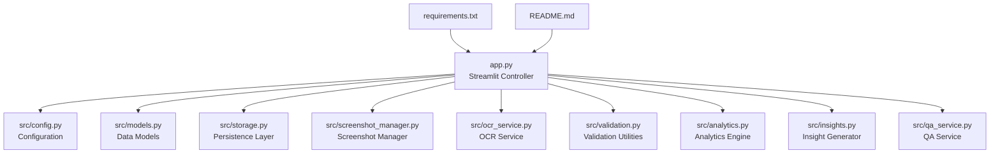

**Diagram sources**
- [app.py:1-1259](file://app.py#L1-L1259)
- [src/config.py:1-29](file://src/config.py#L1-L29)
- [src/models.py:1-55](file://src/models.py#L1-L55)
- [src/storage.py:1-107](file://src/storage.py#L1-L107)
- [src/screenshot_manager.py:1-136](file://src/screenshot_manager.py#L1-L136)
- [src/ocr_service.py:1-144](file://src/ocr_service.py#L1-L144)
- [src/validation.py:1-103](file://src/validation.py#L1-L103)
- [src/analytics.py:1-315](file://src/analytics.py#L1-L315)
- [src/insights.py:1-150](file://src/insights.py#L1-L150)
- [src/qa_service.py:1-174](file://src/qa_service.py#L1-L174)

**Section sources**
- [app.py:1-1259](file://app.py#L1-L1259)
- [README.md:1-63](file://README.md#L1-L63)

## Core Components
The application controller centers around several key components:

- Session State Management: Initializes and maintains application state across page navigations and user interactions.
- Sidebar Navigation: Provides primary and secondary button styling based on the active page.
- Page Routing System: Implements seven main pages with distinct functionality and UI layouts.
- Service Coordination: Integrates OCR, analytics, research, insights, and Q&A services.
- Data Persistence: Uses JSON-based storage for swim events, body metrics, and screenshot indices.
- External API Integration: Connects to Alibaba Cloud Model Studio for OCR and Q&A.
- **Enhanced Table Interaction**: Implements row selection capabilities with selection_mode='single-row' and on_select='rerun' parameters for interactive data exploration.

Key implementation patterns:
- Streamlit page routing using session state to control visibility
- Spinner usage for async operations (OCR extraction, research search)
- Responsive layout using Streamlit columns and tabs
- Error handling with user-friendly feedback messages
- Inter-page data sharing via session state variables
- **Interactive table selection with automatic screenshot preview**

**Section sources**
- [app.py:29-42](file://app.py#L29-L42)
- [app.py:45-58](file://app.py#L45-L58)
- [app.py:61-127](file://app.py#L61-L127)
- [app.py:129-166](file://app.py#L129-L166)
- [app.py:168-224](file://app.py#L168-L224)
- [app.py:226-280](file://app.py#L226-L280)
- [app.py:282-320](file://app.py#L282-L320)
- [app.py:321-370](file://app.py#L321-L370)
- [app.py:371-403](file://app.py#L371-L403)
- [app.py:405-447](file://app.py#L405-L447)

## Architecture Overview
The application employs a layered architecture with clear separation of concerns:

```mermaid
graph TB
subgraph "Presentation Layer"
UI["Streamlit UI<br/>Pages: Upload, Gallery,<br/>Body Metrics, Analytics,<br/>Research, Insights, Q&A"]
end
subgraph "Controller Layer"
CTRL["App Controller<br/>Session State<br/>Page Routing<br/>Enhanced Table Interaction"]
end
subgraph "Domain Services"
OCR["OCR Service<br/>Alibaba Cloud API"]
QA["QA Service<br/>Alibaba Cloud API"]
ANA["Analytics Engine<br/>Performance Charts<br/>Personal Bests Management"]
RES["Research Service<br/>Benchmark Search"]
INS["Insight Generator<br/>Trend Analysis"]
end
subgraph "Data Layer"
STORE["DataStore<br/>JSON Persistence"]
IDX["ScreenshotIndex<br/>Metadata Index"]
CFG["Config<br/>Environment Variables"]
END
subgraph "External Services"
ALI["Alibaba Cloud<br/>Model Studio"]
DDG["DuckDuckGo Search<br/>Benchmarks"]
end
UI --> CTRL
CTRL --> OCR
CTRL --> QA
CTRL --> ANA
CTRL --> RES
CTRL --> INS
OCR --> ALI
QA --> ALI
RES --> DDG
CTRL --> STORE
CTRL --> IDX
CTRL --> CFG
STORE --> STORE
IDX --> STORE
```

**Diagram sources**
- [app.py:1-1259](file://app.py#L1-L1259)
- [src/ocr_service.py:12-21](file://src/ocr_service.py#L12-L21)
- [src/qa_service.py:12-22](file://src/qa_service.py#L12-L22)
- [src/analytics.py:13-14](file://src/analytics.py#L13-L14)
- [src/insights.py:11-12](file://src/insights.py#L11-L12)
- [src/storage.py:10-62](file://src/storage.py#L10-L62)
- [src/screenshot_manager.py:14-15](file://src/screenshot_manager.py#L14-L15)
- [src/config.py:1-29](file://src/config.py#L1-L29)

## Detailed Component Analysis

### Session State Management
The controller initializes essential session state variables at startup and provides a page switching mechanism:

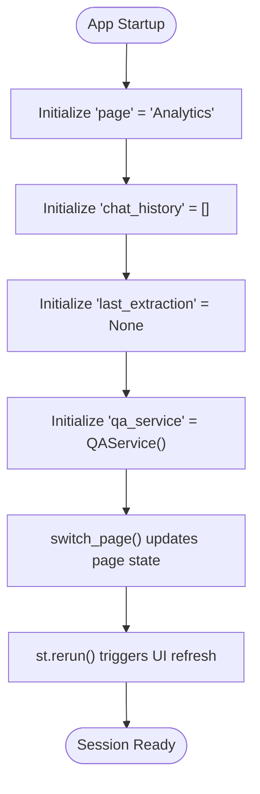

**Diagram sources**
- [app.py:84-104](file://app.py#L84-L104)

Key session state variables:
- page: Current active page identifier (default: "Analytics")
- chat_history: Conversation history for Q&A
- last_extraction: Most recent OCR extraction result
- qa_service: Persistent QA service instance
- upload_success_count, upload_failed_count, upload_duplicate_count: Import statistics
- upload_new_count: New upload counter

**Section sources**
- [app.py:84-104](file://app.py#L84-L104)

### Sidebar Navigation System
The sidebar implements a responsive navigation interface with dynamic button styling:

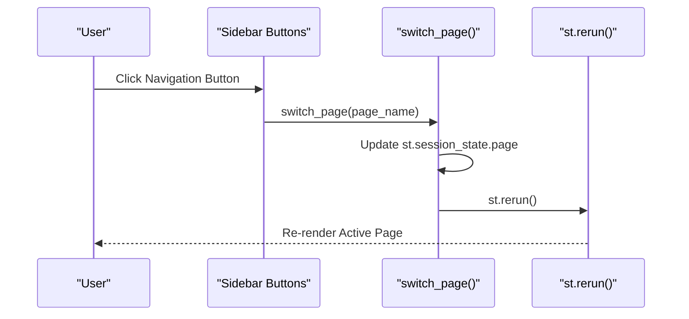

**Diagram sources**
- [app.py:111-138](file://app.py#L111-L138)
- [app.py:106-108](file://app.py#L106-L108)

Navigation buttons use container width and toggle between primary (active) and secondary (inactive) styles based on current page state.

**Section sources**
- [app.py:111-138](file://app.py#L111-L138)

### Upload Page Workflow
The Upload page handles screenshot ingestion, OCR extraction, and data validation:

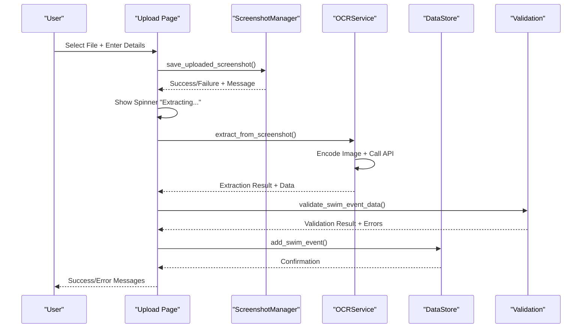

**Diagram sources**
- [app.py:141-571](file://app.py#L141-L571)
- [src/screenshot_manager.py:27-82](file://src/screenshot_manager.py#L27-L82)
- [src/ocr_service.py:49-119](file://src/ocr_service.py#L49-L119)
- [src/validation.py:75-103](file://src/validation.py#L75-L103)
- [src/storage.py:40-44](file://src/storage.py#L40-L44)

Key features:
- Duplicate detection via filename and checksum
- Automatic OCR extraction with spinner feedback
- Data validation with detailed error reporting
- Structured SwimEvent creation and persistence

**Section sources**
- [app.py:141-571](file://app.py#L141-L571)
- [src/screenshot_manager.py:17-82](file://src/screenshot_manager.py#L17-L82)
- [src/ocr_service.py:49-119](file://src/ocr_service.py#L49-L119)
- [src/validation.py:75-103](file://src/validation.py#L75-L103)
- [src/storage.py:29-44](file://src/storage.py#L29-L44)

### Enhanced Records and Personal Bests Functionality

**Updated** The Records and Analytics pages now feature enhanced interactive functionality with clickable row selection and automatic screenshot preview.

#### Records Page with Row Selection
The Records page now provides interactive table navigation with automatic screenshot preview:

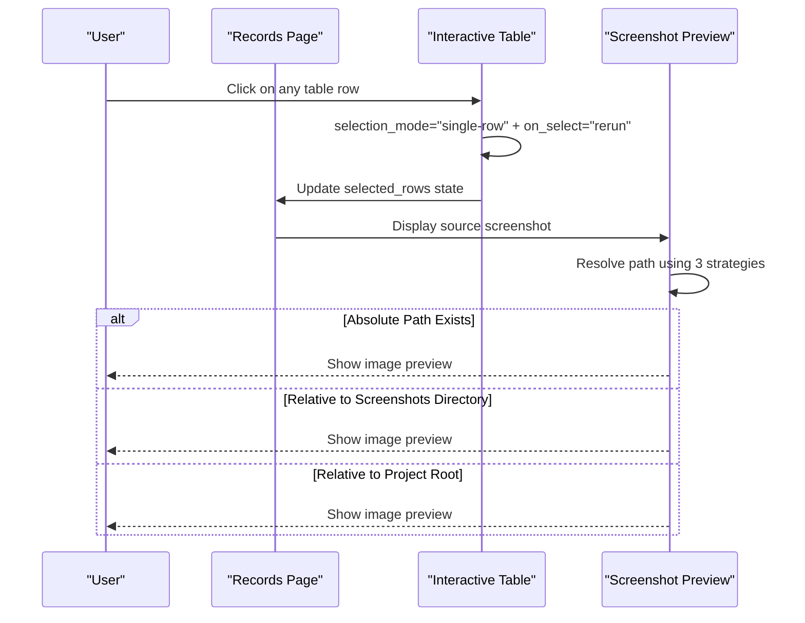

**Diagram sources**
- [app.py:573-671](file://app.py#L573-L671)
- [app.py:632-666](file://app.py#L632-L666)

#### Personal Bests with Popup Dialogs
The Analytics page features three separate Personal Bests tables with popup screenshot previews:

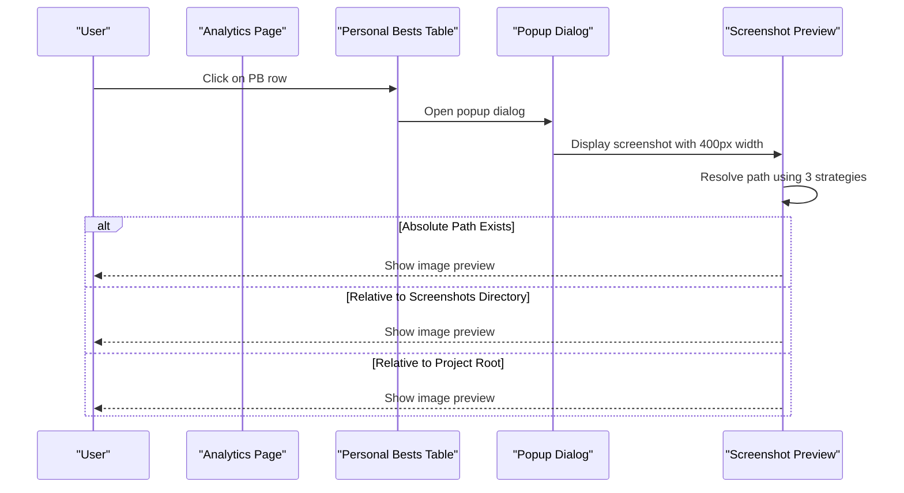

**Diagram sources**
- [app.py:722-832](file://app.py#L722-L832)
- [app.py:753-764](file://app.py#L753-L764)

#### Three Path Resolution Strategies
The system implements three different strategies for locating screenshot files:

1. **Absolute Path Strategy**: First attempts to use the stored absolute path
2. **Relative to Screenshots Directory**: Falls back to SCREENSHOTS_DIR + stored path
3. **Relative to Project Root**: Final fallback to Path(__file__).parent + stored path

**Section sources**
- [app.py:573-671](file://app.py#L573-L671)
- [app.py:722-832](file://app.py#L722-L832)
- [app.py:753-764](file://app.py#L753-L764)
- [app.py:653-664](file://app.py#L653-L664)

### Analytics Page
The Analytics page provides comprehensive performance visualization with enhanced Personal Bests interaction:

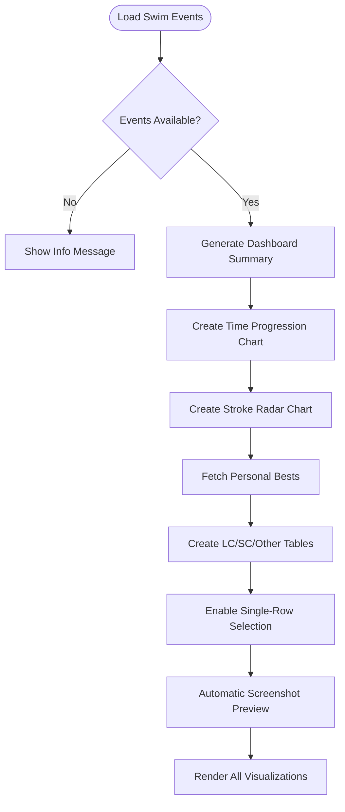

**Diagram sources**
- [app.py:722-832](file://app.py#L722-L832)
- [src/analytics.py:36-65](file://src/analytics.py#L36-L65)
- [src/analytics.py:43-60](file://src/analytics.py#L43-L60)
- [src/analytics.py:91-112](file://src/analytics.py#L91-L112)
- [src/analytics.py:115-138](file://src/analytics.py#L115-L138)

**Section sources**
- [app.py:722-832](file://app.py#L722-L832)
- [src/analytics.py:36-65](file://src/analytics.py#L36-L65)

### Research Page
The Research page enables benchmark comparison and performance analysis:

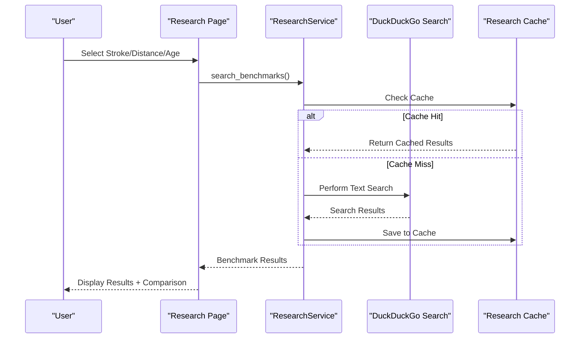

**Diagram sources**
- [app.py:282-320](file://app.py#L282-L320)
- [src/research_service.py:32-54](file://src/research_service.py#L32-L54)
- [src/research_service.py:56-84](file://src/research_service.py#L56-L84)

**Section sources**
- [app.py:282-320](file://app.py#L282-L320)
- [src/research_service.py:32-54](file://src/research_service.py#L32-L54)
- [src/research_service.py:56-84](file://src/research_service.py#L56-L84)

### Insights Page
The Insights page generates trend analysis and training recommendations:

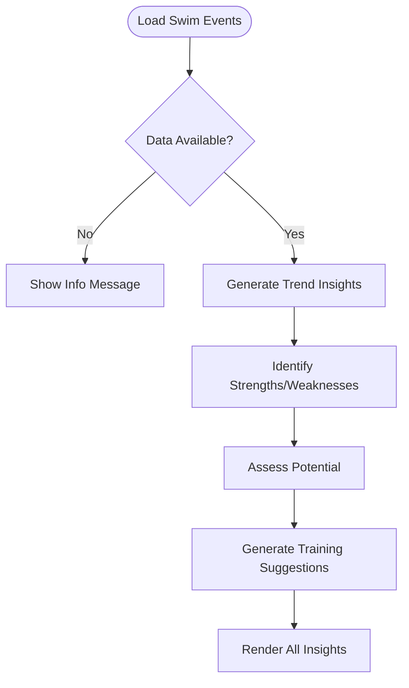

**Diagram sources**
- [app.py:321-370](file://app.py#L321-L370)
- [src/insights.py:14-63](file://src/insights.py#L14-L63)
- [src/insights.py:66-87](file://src/insights.py#L66-L87)
- [src/insights.py:90-111](file://src/insights.py#L90-L111)
- [src/insights.py:122-149](file://src/insights.py#L122-L149)

**Section sources**
- [app.py:321-370](file://app.py#L321-L370)
- [src/insights.py:14-63](file://src/insights.py#L14-L63)
- [src/insights.py:66-87](file://src/insights.py#L66-L87)
- [src/insights.py:90-111](file://src/insights.py#L90-L111)
- [src/insights.py:122-149](file://src/insights.py#L122-L149)

### Q&A Page
The Q&A page provides natural language interaction with swimming data:

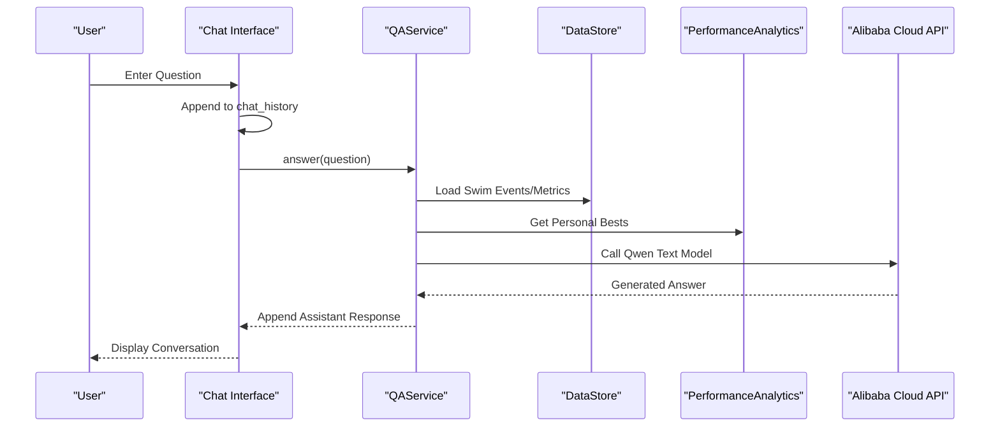

**Diagram sources**
- [app.py:371-403](file://app.py#L371-L403)
- [src/qa_service.py:76-134](file://src/qa_service.py#L76-L134)
- [src/qa_service.py:23-57](file://src/qa_service.py#L23-57)

**Section sources**
- [app.py:371-403](file://app.py#L371-L403)
- [src/qa_service.py:76-134](file://src/qa_service.py#L76-L134)

### Data Export and Management
The footer provides comprehensive data management capabilities:

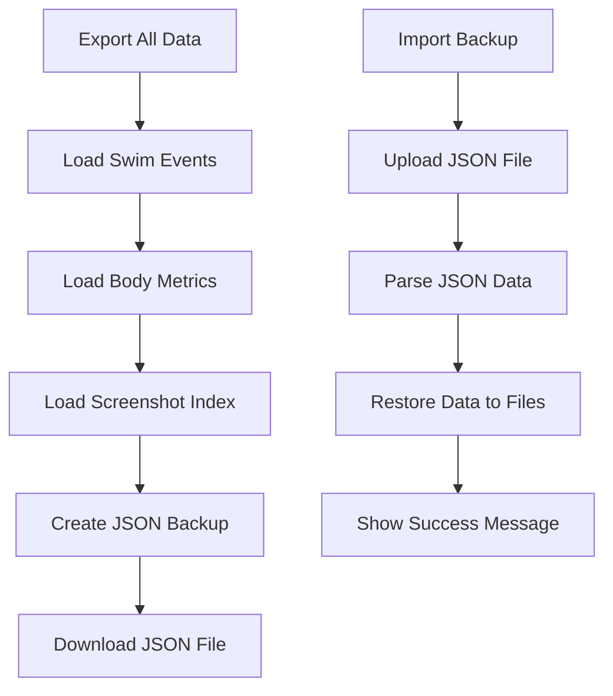

**Diagram sources**
- [app.py:405-447](file://app.py#L405-L447)

**Section sources**
- [app.py:405-447](file://app.py#L405-L447)

## Dependency Analysis
The application exhibits clear dependency relationships between modules:

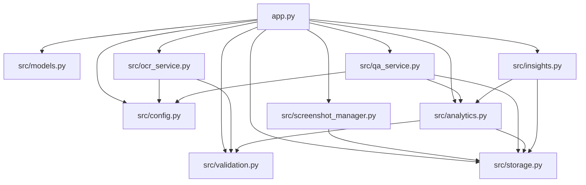

**Diagram sources**
- [app.py:10-19](file://app.py#L10-L19)
- [src/screenshot_manager.py:10-11](file://src/screenshot_manager.py#L10-L11)
- [src/ocr_service.py:8-9](file://src/ocr_service.py#L8-L9)
- [src/qa_service.py:6-9](file://src/qa_service.py#L6-L9)
- [src/analytics.py:8-10](file://src/analytics.py#L8-L10)
- [src/insights.py:5-8](file://src/insights.py#L5-L8)

Key dependency patterns:
- Loose coupling through shared interfaces (DataStore, ScreenshotIndex)
- Clear separation of concerns (UI orchestration vs. business logic)
- External service integration via configuration-driven approach
- Circular dependencies avoided through service composition

**Section sources**
- [app.py:10-19](file://app.py#L10-L19)
- [src/storage.py:10-107](file://src/storage.py#L10-L107)
- [src/screenshot_manager.py:14-15](file://src/screenshot_manager.py#L14-L15)

## Performance Considerations
The application implements several performance optimization strategies:

- Asynchronous Operations: Uses Streamlit spinners during OCR extraction and research searches to maintain UI responsiveness
- Data Caching: Research results cached to reduce API calls and improve response times
- Efficient Data Loading: Lazy loading of dataframes and selective rendering of charts
- Memory Management: Session state cleanup and persistent service instances minimize memory overhead
- Responsive Layout: Adaptive column widths and container-based rendering for optimal screen utilization
- **Optimized Table Rendering**: Single-row selection mode reduces unnecessary re-renders and improves table interaction performance

Best practices implemented:
- Spinner usage for long-running operations
- Conditional rendering based on data availability
- Efficient chart generation with Plotly
- Minimal re-renders through targeted state updates
- **Smart screenshot path resolution** to minimize file system operations

## Troubleshooting Guide
Common issues and solutions:

**OCR Extraction Failures:**
- Verify ALIBABA_CLOUD_API_KEY environment variable is set
- Check network connectivity to Alibaba Cloud endpoints
- Review extraction logs in session state for detailed error messages

**Data Import/Export Issues:**
- Ensure JSON backup files contain valid swim_events and body_metrics arrays
- Verify file permissions for data directory access
- Check for corrupted JSON formatting in backup files

**Performance Analytics Errors:**
- Confirm sufficient data points for chart generation
- Validate time format compliance (MM:SS.ss or SS.ss)
- Check stroke/distance combinations have available data

**Research Service Problems:**
- Verify internet connectivity for DuckDuckGo search
- Check cache file permissions and disk space
- Monitor API rate limits and retry mechanisms

**Session State Issues:**
- Use st.session_state.clear() to reset problematic states
- Verify page routing logic for navigation failures
- Check for circular dependencies in callback functions

**Enhanced Table Interaction Issues:**
- Verify selection_mode="single-row" and on_select="rerun" parameters are correctly configured
- Check that screenshot paths are properly stored in source_screenshot field
- Ensure three path resolution strategies have appropriate fallback order

**Screenshot Preview Problems:**
- Verify screenshot files exist at the resolved path locations
- Check file permissions for screenshot directory access
- Ensure SCREENSHOTS_DIR configuration points to correct location

**Section sources**
- [app.py:183-236](file://app.py#L183-L236)
- [src/ocr_service.py:55-56](file://src/ocr_service.py#L55-L56)
- [src/qa_service.py:87-88](file://src/qa_service.py#L87-L88)
- [src/research_service.py:52-53](file://src/research_service.py#L52-L53)

## Conclusion
The Swimming Data Analysis Platform demonstrates robust Streamlit application architecture with clear separation of concerns and comprehensive service integration. The main application controller effectively orchestrates seven distinct functional areas while maintaining responsive user experience through strategic use of session state, spinners, and modular service design.

**Updated** The recent enhancements to the Records and Personal Bests sections significantly improve user interaction by adding clickable row selection capabilities and automatic screenshot preview functionality. These features utilize three different path resolution strategies to ensure reliable screenshot display and implement popup dialogs with 400-pixel width constraints for optimal user experience.

The platform successfully bridges local data persistence with cloud-based AI services, providing a scalable foundation for swimming performance analysis and insights generation. The enhanced interactive features make it easier for users to explore their swimming records and understand their performance progression through visual screenshot previews.

Future enhancements could include advanced caching strategies for screenshot files, enhanced error recovery mechanisms for path resolution, and expanded visualization capabilities for performance trends and comparisons.