# Application Controller

<cite>
**Referenced Files in This Document**
- [app.py](file://app.py)
- [src/config.py](file://src/config.py)
- [src/models.py](file://src/models.py)
- [src/storage.py](file://src/storage.py)
- [src/screenshot_manager.py](file://src/screenshot_manager.py)
- [src/ocr_service.py](file://src/ocr_service.py)
- [src/validation.py](file://src/validation.py)
- [src/analytics.py](file://src/analytics.py)
- [src/insights.py](file://src/insights.py)
- [src/qa_service.py](file://src/qa_service.py)
- [requirements.txt](file://requirements.txt)
- [README.md](file://README.md)
</cite>

## Update Summary
**Changes Made**
- **Updated Navigation Labels**: Changed from Analytics/Import/Records/National Standard/Q&A to Performance/Data Import/Race Log/Benchmarks/AI Coach
- **Implemented Dark Theme**: Comprehensive dark theme styling with custom CSS including sidebar hover effects, button styling, and dataframe enhancements
- **Enhanced Navigation Structure**: Restructured navigation into Analysis and Tools sections with improved visual hierarchy
- **Modernized Visual Components**: Added gradient backgrounds, improved button styling, enhanced table interactions, and popup dialogs
- **Updated Page Routing**: Migrated from seven pages to six pages with new naming conventions and improved user experience

## Table of Contents
1. [Introduction](#introduction)
2. [Project Structure](#project-structure)
3. [Core Components](#core-components)
4. [Architecture Overview](#architecture-overview)
5. [Detailed Component Analysis](#detailed-component-analysis)
6. [Dark Theme Implementation](#dark-theme-implementation)
7. [Enhanced Navigation System](#enhanced-navigation-system)
8. [Page Routing and Content](#page-routing-and-content)
9. [Dependency Analysis](#dependency-analysis)
10. [Performance Considerations](#performance-considerations)
11. [Troubleshooting Guide](#troubleshooting-guide)
12. [Conclusion](#conclusion)

## Introduction
This document provides comprehensive documentation for the main application controller (app.py) of the Swimming Data Analysis Platform. The controller orchestrates a modern Streamlit-based UI with six main pages: Performance, Data Import, Race Log, Benchmarks, Insights, and AI Coach. The application features a comprehensive dark theme implementation with custom CSS styling, enhanced navigation structure, and improved visual components. It manages session state across page navigations, coordinates UI interactions with backend services, and integrates external AI APIs for OCR and Q&A capabilities.

**Updated** Enhanced with dark theme implementation, custom CSS styling, and modernized navigation structure featuring Analysis and Tools sections with improved user experience and visual hierarchy.

## Project Structure
The application follows a modular architecture with a clear separation between UI orchestration (app.py) and domain services located under src/. Key directories and files:
- app.py: Central Streamlit application controller and page router with dark theme implementation
- src/: Domain services and utilities
  - config.py: Configuration constants and environment variables
  - models.py: Data models for SwimEvent and BodyMetrics
  - storage.py: File-based persistence layer
  - screenshot_manager.py: Screenshot ingestion and gallery management
  - ocr_service.py: Alibaba Cloud OCR integration
  - validation.py: Data validation utilities
  - analytics.py: Performance analytics and visualizations
  - insights.py: Trend analysis and training suggestions
  - qa_service.py: Natural language Q&A
- requirements.txt: Dependencies
- README.md: Project overview and usage

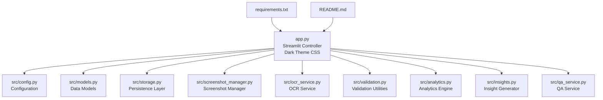

**Diagram sources**
- [app.py:1-1363](file://app.py#L1-L1363)
- [src/config.py:1-29](file://src/config.py#L1-L29)
- [src/models.py:1-55](file://src/models.py#L1-L55)
- [src/storage.py:1-107](file://src/storage.py#L1-L107)
- [src/screenshot_manager.py:1-136](file://src/screenshot_manager.py#L1-L136)
- [src/ocr_service.py:1-144](file://src/ocr_service.py#L1-L144)
- [src/validation.py:1-103](file://src/validation.py#L1-L103)
- [src/analytics.py:1-315](file://src/analytics.py#L1-L315)
- [src/insights.py:1-150](file://src/insights.py#L1-L150)
- [src/qa_service.py:1-174](file://src/qa_service.py#L1-L174)

**Section sources**
- [app.py:1-1363](file://app.py#L1-L1363)
- [README.md:1-66](file://README.md#L1-L66)

## Core Components
The application controller centers around several key components with modern UI enhancements:

- **Dark Theme Implementation**: Comprehensive custom CSS styling with sidebar hover effects, button styling, and dataframe enhancements
- **Enhanced Session State Management**: Initializes and maintains application state across page navigations and user interactions
- **Structured Navigation System**: Implements six main pages organized into Analysis and Tools sections with improved visual hierarchy
- **Modern Page Routing**: Uses session state to control visibility with updated page names and improved user experience
- **Service Coordination**: Integrates OCR, analytics, research, insights, and Q&A services with enhanced styling
- **Data Persistence**: Uses JSON-based storage for swim events, body metrics, and screenshot indices
- **External API Integration**: Connects to Alibaba Cloud Model Studio for OCR and Q&A
- **Enhanced Table Interactions**: Implements row selection capabilities with improved styling and popup dialogs

Key implementation patterns:
- Streamlit page routing using session state to control visibility
- Custom CSS styling for dark theme with hover effects and gradients
- Spinner usage for async operations (OCR extraction, research search)
- Responsive layout using Streamlit columns and tabs with enhanced styling
- Error handling with user-friendly feedback messages
- Inter-page data sharing via session state variables
- **Interactive table selection with automatic screenshot preview and popup dialogs**

**Section sources**
- [app.py:76-150](file://app.py#L76-L150)
- [app.py:152-176](file://app.py#L152-L176)
- [app.py:179-205](file://app.py#L179-L205)
- [app.py:208-1363](file://app.py#L208-L1363)

## Architecture Overview
The application employs a layered architecture with clear separation of concerns and modern UI styling:

```mermaid
graph TB
subgraph "Presentation Layer"
UI["Streamlit UI<br/>Pages: Performance, Data Import,<br/>Race Log, Benchmarks, Insights,<br/>AI Coach<br/>Dark Theme Styling"]
end
subgraph "Controller Layer"
CTRL["App Controller<br/>Session State<br/>Page Routing<br/>Dark Theme CSS"]
end
subgraph "Domain Services"
OCR["OCR Service<br/>Alibaba Cloud API"]
QA["QA Service<br/>Alibaba Cloud API"]
ANA["Analytics Engine<br/>Performance Charts<br/>Enhanced PB Management"]
RES["Research Service<br/>Benchmark Search"]
INS["Insight Generator<br/>Trend Analysis"]
end
subgraph "Data Layer"
STORE["DataStore<br/>JSON Persistence"]
IDX["ScreenshotIndex<br/>Metadata Index"]
CFG["Config<br/>Environment Variables"]
END
subgraph "External Services"
ALI["Alibaba Cloud<br/>Model Studio"]
DDG["DuckDuckGo Search<br/>Benchmarks"]
END
UI --> CTRL
CTRL --> OCR
CTRL --> QA
CTRL --> ANA
CTRL --> RES
CTRL --> INS
OCR --> ALI
QA --> ALI
RES --> DDG
CTRL --> STORE
CTRL --> IDX
CTRL --> CFG
STORE --> STORE
IDX --> STORE
```

**Diagram sources**
- [app.py:1-1363](file://app.py#L1-L1363)
- [src/ocr_service.py:12-21](file://src/ocr_service.py#L12-L21)
- [src/qa_service.py:12-22](file://src/qa_service.py#L12-L22)
- [src/analytics.py:13-14](file://src/analytics.py#L13-L14)
- [src/insights.py:11-12](file://src/insights.py#L11-L12)
- [src/storage.py:10-62](file://src/storage.py#L10-L62)
- [src/screenshot_manager.py:14-15](file://src/screenshot_manager.py#L14-L15)
- [src/config.py:1-29](file://src/config.py#L1-29)

## Detailed Component Analysis

### Dark Theme Implementation
The application features a comprehensive dark theme implementation with custom CSS styling:

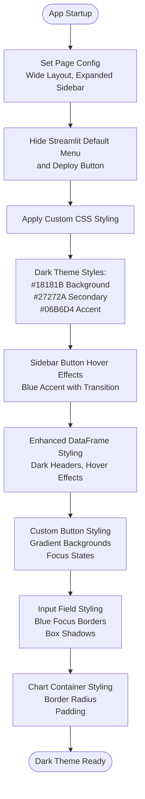

**Diagram sources**
- [app.py:68-74](file://app.py#L68-L74)
- [app.py:76-150](file://app.py#L76-L150)

Key dark theme features:
- **Sidebar Styling**: Custom hover effects with blue accent (#06B6D4) and smooth transitions
- **Button Styling**: Gradient backgrounds (#18181B to #27272A), rounded corners (8px), and focus states
- **DataFrame Enhancement**: Dark headers with uppercase styling, hover effects, and improved borders
- **Input Fields**: Blue focus borders with box shadows and enhanced visual feedback
- **Chart Containers**: Rounded borders with subtle padding for better visual presentation

**Section sources**
- [app.py:76-150](file://app.py#L76-L150)

### Enhanced Navigation System
The sidebar implements a structured navigation interface with Analysis and Tools sections:

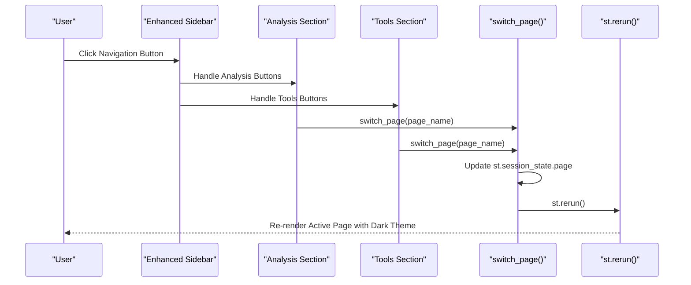

**Diagram sources**
- [app.py:179-205](file://app.py#L179-L205)
- [app.py:174-176](file://app.py#L174-L176)

Navigation structure with Analysis and Tools sections:
- **Analysis Section** (Primary Navigation):
  - Benchmarks (Chinese National Standards)
  - Performance (Analytics Dashboard)
  - Insights (Trend Analysis)
  - AI Coach (Q&A Interface)
- **Tools Section** (Secondary Navigation):
  - Data Import (Screenshot Upload)
  - Race Log (All Swim Records)
  - Body Metrics (Physical Measurements)

**Section sources**
- [app.py:179-205](file://app.py#L179-L205)

### Session State Management
The controller initializes essential session state variables with dark theme awareness:

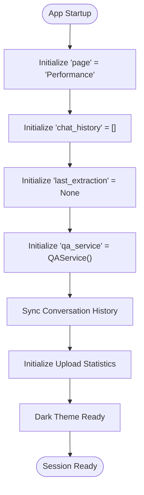

**Diagram sources**
- [app.py:152-171](file://app.py#L152-L171)

Key session state variables:
- page: Current active page identifier (default: "Performance")
- chat_history: Conversation history for AI Coach
- last_extraction: Most recent OCR extraction result
- qa_service: Persistent QA service instance with conversation history sync
- upload_success_count, upload_failed_count, upload_duplicate_count: Import statistics
- upload_new_count: New upload counter

**Section sources**
- [app.py:152-171](file://app.py#L152-L171)

### Page Routing and Content
The application routes to six main pages with enhanced content and styling:

#### Data Import Page
Handles screenshot ingestion, OCR extraction, and data validation with improved UI:

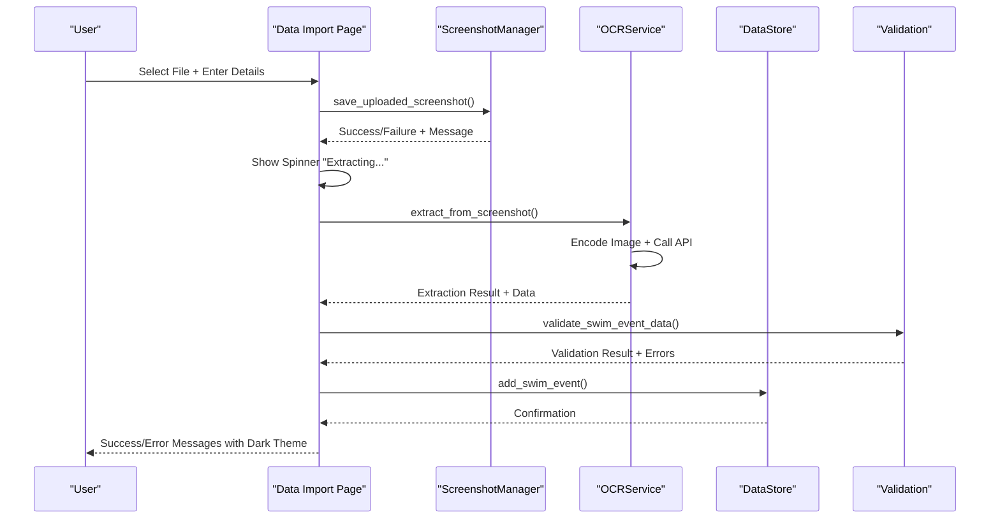

**Diagram sources**
- [app.py:208-638](file://app.py#L208-L638)
- [src/screenshot_manager.py:27-82](file://src/screenshot_manager.py#L27-L82)
- [src/ocr_service.py:49-119](file://src/ocr_service.py#L49-L119)
- [src/validation.py:75-103](file://src/validation.py#L75-L103)
- [src/storage.py:40-44](file://src/storage.py#L40-L44)

#### Race Log Page
Provides comprehensive swim records management with enhanced table interactions:

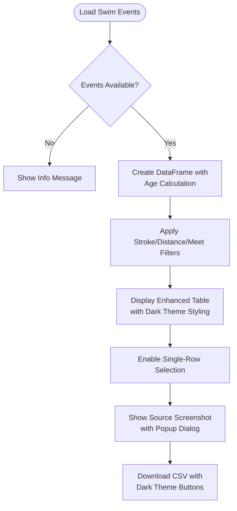

**Diagram sources**
- [app.py:640-740](file://app.py#L640-L740)

#### Performance Analytics Page
Features comprehensive performance visualization with enhanced Personal Bests interaction:

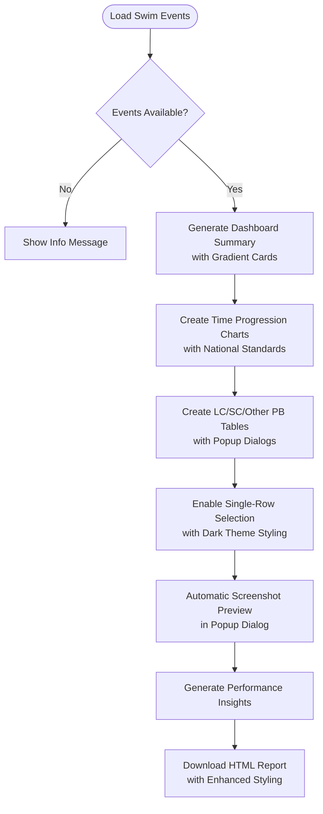

**Diagram sources**
- [app.py:789-1148](file://app.py#L789-L1148)
- [src/analytics.py:36-65](file://src/analytics.py#L36-L65)
- [src/analytics.py:43-60](file://src/analytics.py#L43-L60)
- [src/analytics.py:91-112](file://src/analytics.py#L91-L112)
- [src/analytics.py:115-138](file://src/analytics.py#L115-L138)

#### Benchmarks Page
Displays Chinese National Swimming Standards with OCR import capability:

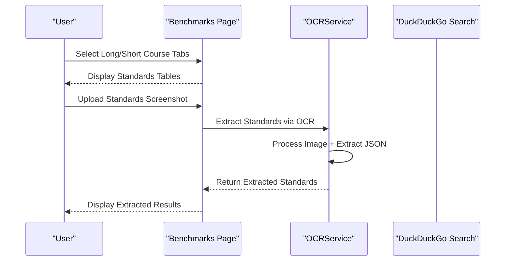

**Diagram sources**
- [app.py:1151-1250](file://app.py#L1151-L1250)

#### Insights Page
Generates trend analysis and training recommendations with enhanced presentation:

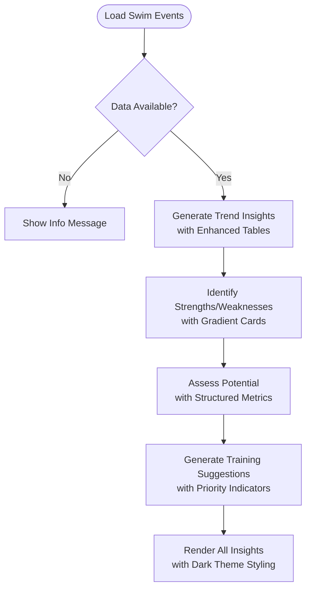

**Diagram sources**
- [app.py:1252-1327](file://app.py#L1252-L1327)
- [src/insights.py:14-63](file://src/insights.py#L14-L63)
- [src/insights.py:66-87](file://src/insights.py#L66-L87)
- [src/insights.py:90-111](file://src/insights.py#L90-L111)
- [src/insights.py:122-149](file://src/insights.py#L122-L149)

#### AI Coach Page
Provides natural language interaction with swimming data using enhanced chat interface:

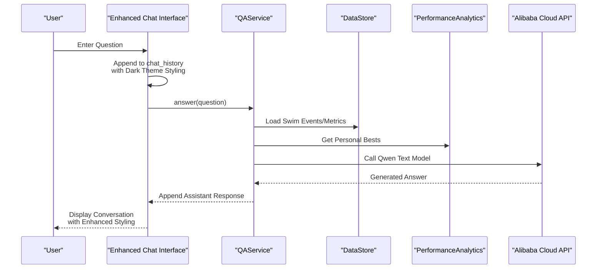

**Diagram sources**
- [app.py:1329-1360](file://app.py#L1329-L1360)
- [src/qa_service.py:76-134](file://src/qa_service.py#L76-L134)
- [src/qa_service.py:23-57](file://src/qa_service.py#L23-L57)

**Section sources**
- [app.py:208-1363](file://app.py#L208-L1363)

## Dependency Analysis
The application exhibits clear dependency relationships between modules with enhanced styling integration:

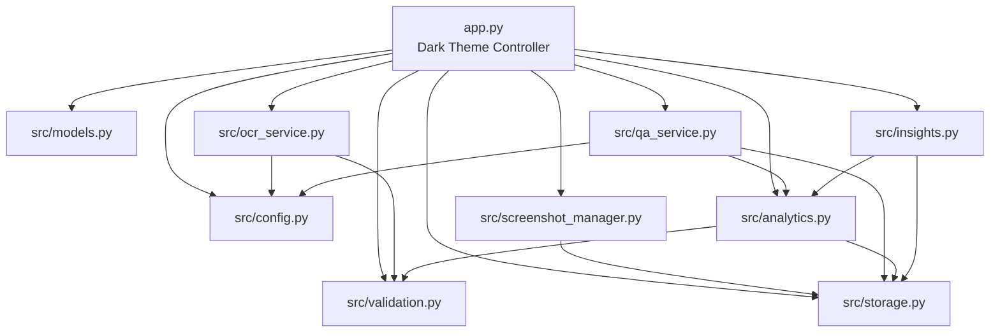

**Diagram sources**
- [app.py:10-19](file://app.py#L10-L19)
- [src/screenshot_manager.py:10-11](file://src/screenshot_manager.py#L10-L11)
- [src/ocr_service.py:8-9](file://src/ocr_service.py#L8-L9)
- [src/qa_service.py:6-9](file://src/qa_service.py#L6-L9)
- [src/analytics.py:8-10](file://src/analytics.py#L8-L10)
- [src/insights.py:5-8](file://src/insights.py#L5-L8)

Key dependency patterns:
- Loose coupling through shared interfaces (DataStore, ScreenshotIndex)
- Clear separation of concerns (UI orchestration vs. business logic)
- External service integration via configuration-driven approach
- Circular dependencies avoided through service composition
- **Enhanced styling integration** through custom CSS in main controller

**Section sources**
- [app.py:10-19](file://app.py#L10-L19)
- [src/storage.py:10-107](file://src/storage.py#L10-L107)
- [src/screenshot_manager.py:14-15](file://src/screenshot_manager.py#L14-L15)

## Performance Considerations
The application implements several performance optimization strategies with enhanced UI considerations:

- **Asynchronous Operations**: Uses Streamlit spinners during OCR extraction and research searches to maintain UI responsiveness
- **Data Caching**: Research results cached to reduce API calls and improve response times
- **Efficient Data Loading**: Lazy loading of dataframes and selective rendering of charts with dark theme optimizations
- **Memory Management**: Session state cleanup and persistent service instances minimize memory overhead
- **Responsive Layout**: Adaptive column widths and container-based rendering for optimal screen utilization
- **Optimized Table Rendering**: Single-row selection mode reduces unnecessary re-renders and improves table interaction performance
- **Dark Theme Performance**: Custom CSS applied once at startup, minimizing runtime styling overhead
- **Enhanced Visual Feedback**: Smooth transitions and hover effects optimized for modern browsers

Best practices implemented:
- Spinner usage for long-running operations
- Conditional rendering based on data availability
- Efficient chart generation with Plotly and enhanced styling
- Minimal re-renders through targeted state updates
- **Smart screenshot path resolution** to minimize file system operations
- **Custom CSS optimization** for reduced styling overhead

## Troubleshooting Guide
Common issues and solutions with dark theme considerations:

**Dark Theme Issues:**
- Verify custom CSS is properly loaded in st.markdown() block
- Check browser compatibility with CSS variables and gradients
- Ensure dark theme colors are accessible and readable
- Verify sidebar hover effects work across different screen sizes

**Navigation Problems:**
- Confirm Analysis and Tools section buttons are properly configured
- Verify page routing logic for new page names (Performance, Data Import, etc.)
- Check for circular dependencies in callback functions
- Ensure session state synchronization for all pages

**OCR Extraction Failures:**
- Verify ALIBABA_CLOUD_API_KEY environment variable is set
- Check network connectivity to Alibaba Cloud endpoints
- Review extraction logs in session state for detailed error messages

**Data Import/Export Issues:**
- Ensure JSON backup files contain valid swim_events and body_metrics arrays
- Verify file permissions for data directory access
- Check for corrupted JSON formatting in backup files

**Performance Analytics Errors:**
- Confirm sufficient data points for chart generation
- Validate time format compliance (MM:SS.ss or SS.ss)
- Check stroke/distance combinations have available data

**Research Service Problems:**
- Verify internet connectivity for DuckDuckGo search
- Check cache file permissions and disk space
- Monitor API rate limits and retry mechanisms

**Session State Issues:**
- Use st.session_state.clear() to reset problematic states
- Verify page routing logic for navigation failures
- Check for circular dependencies in callback functions

**Enhanced Table Interaction Issues:**
- Verify selection_mode="single-row" and on_select="rerun" parameters are correctly configured
- Check that screenshot paths are properly stored in source_screenshot field
- Ensure three path resolution strategies have appropriate fallback order
- Verify popup dialog functionality works with dark theme styling

**Screenshot Preview Problems:**
- Verify screenshot files exist at the resolved path locations
- Check file permissions for screenshot directory access
- Ensure SCREENSHOTS_DIR configuration points to correct location

**Section sources**
- [app.py:183-236](file://app.py#L183-L236)
- [src/ocr_service.py:55-56](file://src/ocr_service.py#L55-L56)
- [src/qa_service.py:87-88](file://src/qa_service.py#L87-L88)
- [src/research_service.py:52-53](file://src/research_service.py#L52-L53)

## Conclusion
The Swimming Data Analysis Platform demonstrates robust Streamlit application architecture with comprehensive dark theme implementation and modern UI enhancements. The main application controller effectively orchestrates six distinct functional areas organized into Analysis and Tools sections while maintaining responsive user experience through strategic use of session state, spinners, and modular service design.

**Updated** The recent enhancements significantly modernize the user interface with comprehensive dark theme implementation, custom CSS styling, and enhanced navigation structure. The migration from seven pages to six pages with updated naming conventions (Performance, Data Import, Race Log, Benchmarks, Insights, AI Coach) provides a cleaner user experience with improved visual hierarchy and modern styling.

The platform successfully bridges local data persistence with cloud-based AI services, providing a scalable foundation for swimming performance analysis and insights generation. The enhanced interactive features, including popup dialogs for screenshot previews, gradient-styled cards, and hover effects, make it easier for users to explore their swimming records and understand their performance progression through visual components.

The dark theme implementation provides improved visual comfort for extended use, with carefully chosen color schemes that maintain accessibility while enhancing the professional appearance of the application. The structured navigation with Analysis and Tools sections creates a logical workflow for users, from data ingestion to performance analysis and AI-powered insights.

Future enhancements could include advanced caching strategies for screenshot files, enhanced error recovery mechanisms for path resolution, expanded visualization capabilities for performance trends and comparisons, and additional customization options for the dark theme styling.