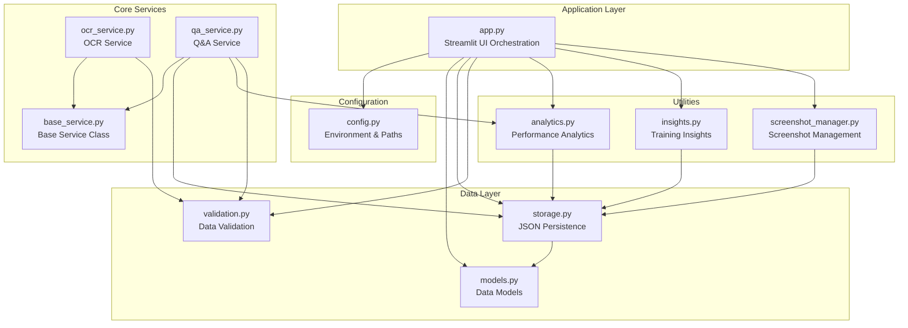
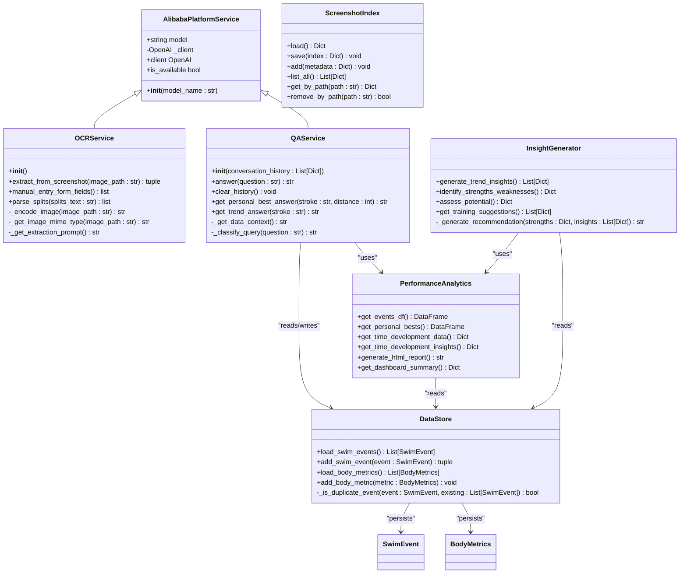
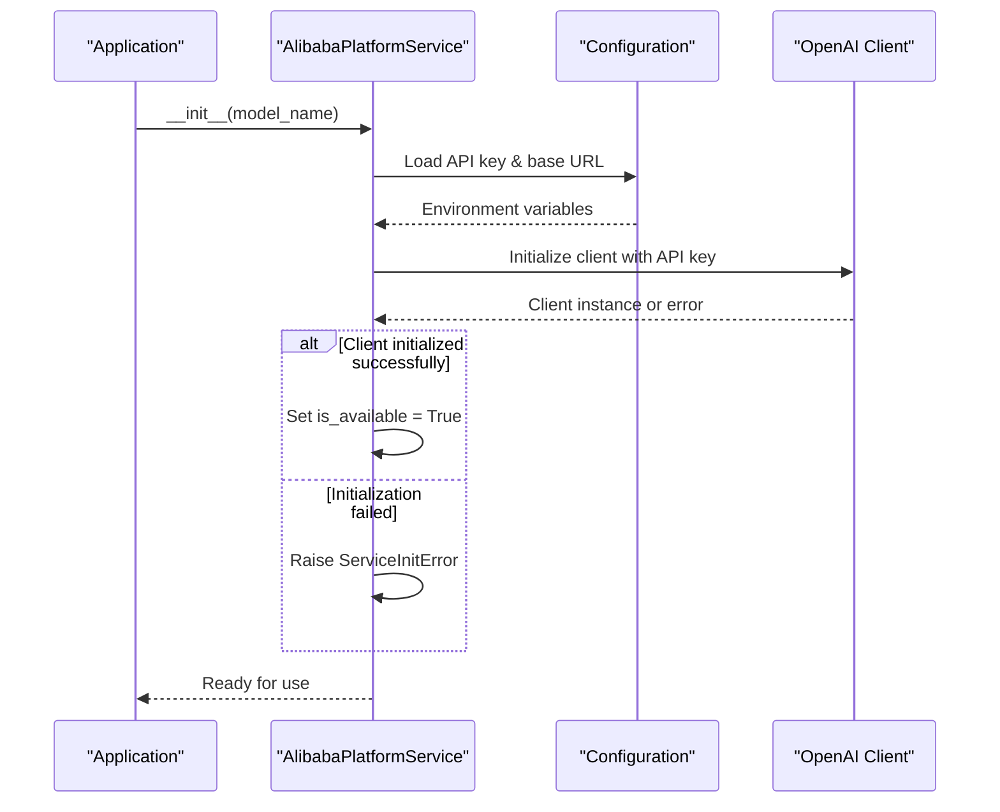
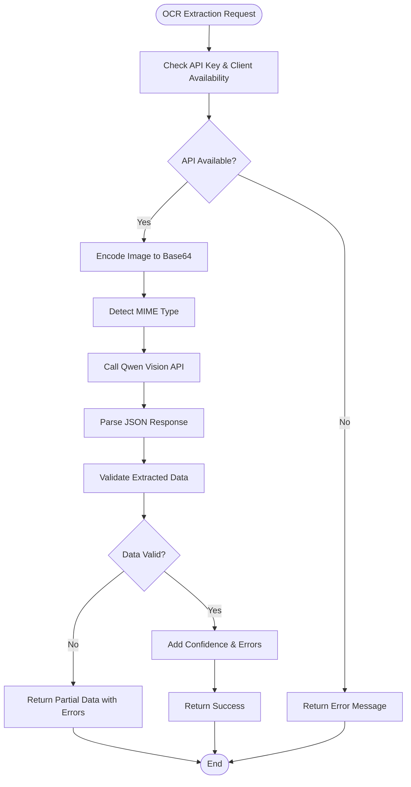
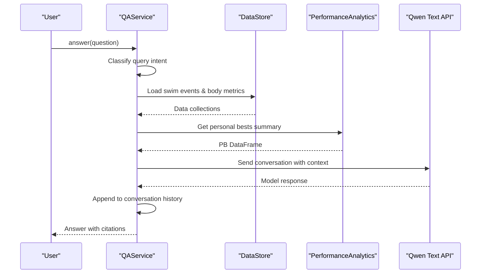
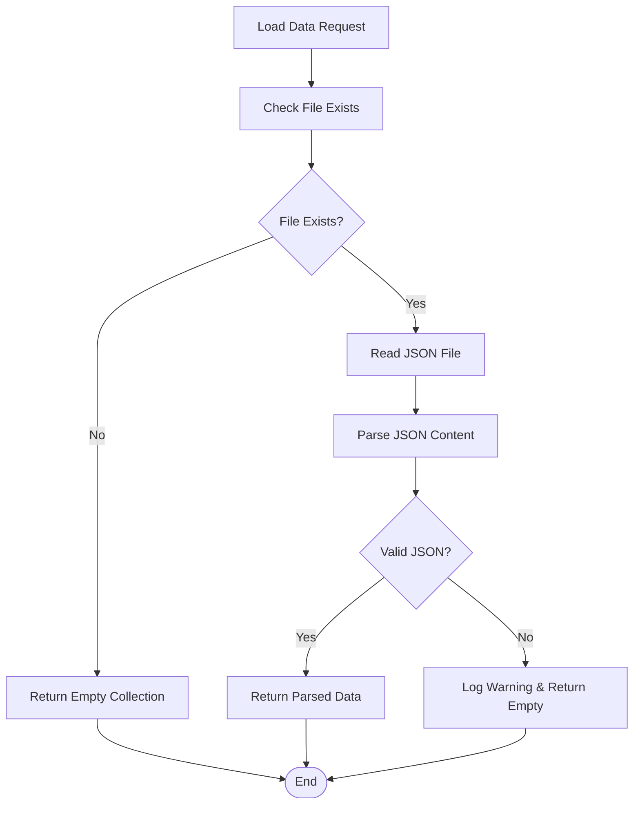
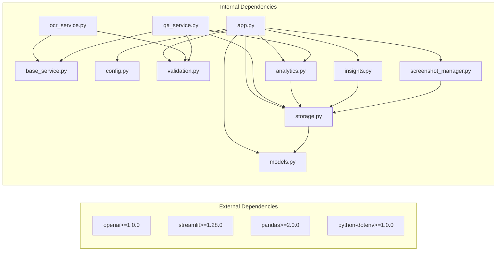

# Base Service Architecture

<cite>
**Referenced Files in This Document**
- [base_service.py](file://src/base_service.py)
- [app.py](file://app.py)
- [config.py](file://src/config.py)
- [models.py](file://src/models.py)
- [storage.py](file://src/storage.py)
- [ocr_service.py](file://src/ocr_service.py)
- [qa_service.py](file://src/qa_service.py)
- [validation.py](file://src/validation.py)
- [screenshot_manager.py](file://src/screenshot_manager.py)
- [analytics.py](file://src/analytics.py)
- [insights.py](file://src/insights.py)
- [README.md](file://README.md)
- [requirements.txt](file://requirements.txt)
</cite>

## Table of Contents
1. [Introduction](#introduction)
2. [Project Structure](#project-structure)
3. [Core Components](#core-components)
4. [Architecture Overview](#architecture-overview)
5. [Detailed Component Analysis](#detailed-component-analysis)
6. [Dependency Analysis](#dependency-analysis)
7. [Performance Considerations](#performance-considerations)
8. [Troubleshooting Guide](#troubleshooting-guide)
9. [Conclusion](#conclusion)

## Introduction
This document describes the Base Service Architecture of the Swimming Status platform, focusing on the foundational service layer that enables AI-powered features through Alibaba Cloud Model Studio. The architecture centers around a reusable base service class that handles OpenAI-compatible API client initialization, configuration, and availability checks, while specialized services (OCR and Q&A) inherit from this base to provide domain-specific functionality.

## Project Structure
The project follows a modular structure with clear separation of concerns:
- Application entry point and UI orchestration
- Configuration and environment management
- Data models and persistence layer
- AI service abstractions and implementations
- Utility modules for validation, analytics, and insights
- Supporting modules for screenshots and storage

**Diagram sources**
- [app.py:1-1213](file://app.py#L1-L1213)
- [config.py:1-49](file://src/config.py#L1-L49)
- [base_service.py:1-67](file://src/base_service.py#L1-L67)
- [ocr_service.py:1-259](file://src/ocr_service.py#L1-L259)
- [qa_service.py:1-226](file://src/qa_service.py#L1-L226)
- [models.py:1-55](file://src/models.py#L1-L55)
- [storage.py:1-162](file://src/storage.py#L1-L162)
- [validation.py:1-203](file://src/validation.py#L1-L203)
- [screenshot_manager.py:1-172](file://src/screenshot_manager.py#L1-L172)
- [analytics.py:1-314](file://src/analytics.py#L1-L314)
- [insights.py:1-200](file://src/insights.py#L1-L200)

**Section sources**
- [README.md:1-66](file://README.md#L1-L66)
- [requirements.txt:1-11](file://requirements.txt#L1-L11)

## Core Components
The Base Service Architecture consists of several key components:

### Base Service Class (`AlibabaPlatformService`)
- Provides OpenAI-compatible client initialization with Alibaba Cloud credentials
- Implements API key validation and availability checks
- Exposes client property with setter for backward compatibility
- Defines availability flag for runtime feature gating

### Specialized Services
- **OCR Service**: Vision-language model for extracting structured swimming data from screenshots
- **Q&A Service**: Text model for natural language queries about swimming performance

### Data Layer
- **Models**: Typed data structures for swim events and body metrics
- **Storage**: JSON-based persistence with automatic backups and duplicate detection
- **Validation**: Comprehensive data validation for time formats, field types, and business rules

### Supporting Modules
- **Screenshot Manager**: Organizes and deduplicates uploaded screenshots
- **Analytics**: Performance analysis and visualization utilities
- **Insights**: Training recommendations and trend analysis

**Section sources**
- [base_service.py:15-67](file://src/base_service.py#L15-L67)
- [ocr_service.py:16-28](file://src/ocr_service.py#L16-L28)
- [qa_service.py:16-32](file://src/qa_service.py#L16-L32)
- [models.py:7-55](file://src/models.py#L7-L55)
- [storage.py:14-162](file://src/storage.py#L14-L162)
- [validation.py:11-203](file://src/validation.py#L11-L203)
- [screenshot_manager.py:15-172](file://src/screenshot_manager.py#L15-L172)
- [analytics.py:14-314](file://src/analytics.py#L14-L314)
- [insights.py:14-200](file://src/insights.py#L14-L200)

## Architecture Overview
The architecture employs a layered approach with clear boundaries between presentation, service, data, and utility layers. The base service abstraction enables consistent AI service behavior across different Alibaba Cloud models while allowing specialization for domain-specific requirements.

**Diagram sources**
- [base_service.py:15-67](file://src/base_service.py#L15-L67)
- [ocr_service.py:16-259](file://src/ocr_service.py#L16-L259)
- [qa_service.py:16-226](file://src/qa_service.py#L16-L226)
- [storage.py:14-162](file://src/storage.py#L14-L162)
- [analytics.py:14-314](file://src/analytics.py#L14-L314)
- [insights.py:14-200](file://src/insights.py#L14-L200)

## Detailed Component Analysis

### Base Service Architecture
The foundation of the system is the `AlibabaPlatformService` class, which encapsulates common functionality for AI service clients.

**Diagram sources**
- [base_service.py:22-51](file://src/base_service.py#L22-L51)
- [config.py:30-34](file://src/config.py#L30-L34)

Key characteristics:
- Centralized API client initialization with error handling
- Environment-based configuration loading
- Availability checking mechanism for feature gating
- Extensible design for multiple AI service types

**Section sources**
- [base_service.py:15-67](file://src/base_service.py#L15-L67)
- [config.py:30-34](file://src/config.py#L30-L34)

### OCR Service Implementation
The OCR service specializes the base service for vision-language processing of swimming results.

**Diagram sources**
- [ocr_service.py:117-223](file://src/ocr_service.py#L117-L223)

Specialized features:
- Image encoding and MIME type detection
- Structured JSON extraction with confidence scoring
- Comprehensive data validation pipeline
- Error handling for various API scenarios

**Section sources**
- [ocr_service.py:16-259](file://src/ocr_service.py#L16-L259)
- [validation.py:102-129](file://src/validation.py#L102-L129)

### Q&A Service Implementation
The Q&A service provides conversational intelligence over swimming data.

**Diagram sources**
- [qa_service.py:99-170](file://src/qa_service.py#L99-L170)

Advanced capabilities:
- Dynamic query classification (personal best, trend, comparison, advice, rank, general)
- Context-aware conversation history management
- Structured data context building from multiple sources
- Intent-based routing for specialized analysis

**Section sources**
- [qa_service.py:16-226](file://src/qa_service.py#L16-L226)

### Data Persistence Layer
The storage layer provides robust JSON-based persistence with safety mechanisms.

**Diagram sources**
- [storage.py:18-27](file://src/storage.py#L18-L27)

Safety features:
- Automatic backup creation before writes
- Comprehensive error handling for IO operations
- Duplicate detection for swim events
- Structured metadata management for screenshots

**Section sources**
- [storage.py:14-162](file://src/storage.py#L14-L162)

## Dependency Analysis
The architecture demonstrates clean dependency management with minimal coupling between modules.

**Diagram sources**
- [requirements.txt:1-11](file://requirements.txt#L1-L11)
- [app.py:59-66](file://app.py#L59-L66)

Key dependency characteristics:
- Loose coupling through interface-like base classes
- Clear separation between AI services and data access
- Minimal cross-module dependencies
- External dependencies pinned for reproducibility

**Section sources**
- [requirements.txt:1-11](file://requirements.txt#L1-L11)
- [app.py:59-66](file://app.py#L59-L66)

## Performance Considerations
The architecture incorporates several performance optimization strategies:

### Caching and Availability Checking
- Client initialization occurs once per service instance
- Availability flag prevents unnecessary API calls
- Environment configuration loaded once at startup

### Data Processing Efficiency
- Batch operations for bulk screenshot processing
- Efficient duplicate detection using checksum comparison
- Lazy loading of data files with caching

### Memory Management
- Streaming file operations for large image processing
- Incremental data processing in analytics calculations
- Proper resource cleanup in error scenarios

## Troubleshooting Guide

### Common Issues and Solutions

**API Key Configuration Problems**
- Verify environment variables are set correctly
- Check network connectivity to Alibaba Cloud endpoints
- Review API quota limits and rate limiting

**OCR Extraction Failures**
- Validate image format support (PNG, JPG, JPEG, GIF, WEBP)
- Ensure sufficient image quality for text recognition
- Check for proper time format compliance (MM:SS.ss or SS.ss)

**Data Validation Errors**
- Review time format requirements and constraints
- Verify required fields are present and non-empty
- Check distance values are positive integers

**Storage and Persistence Issues**
- Monitor disk space for screenshot storage
- Review backup file management
- Check file permissions for data directories

**Section sources**
- [base_service.py:26-51](file://src/base_service.py#L26-L51)
- [ocr_service.py:211-222](file://src/ocr_service.py#L211-L222)
- [validation.py:11-27](file://src/validation.py#L11-L27)
- [storage.py:34-45](file://src/storage.py#L34-L45)

## Conclusion
The Base Service Architecture provides a robust foundation for AI-powered swimming analytics through Alibaba Cloud Model Studio. The design emphasizes modularity, extensibility, and reliability while maintaining clean separation of concerns. The architecture successfully balances simplicity for developers with powerful capabilities for data extraction, analysis, and insights generation.

The reusable base service pattern enables easy addition of new AI services while maintaining consistent behavior across the platform. The comprehensive validation and persistence layers ensure data integrity and reliability, while the modular design facilitates future enhancements and maintenance.