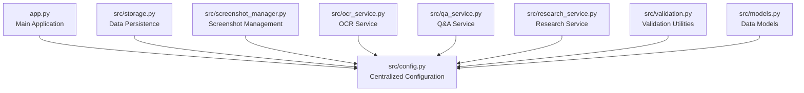
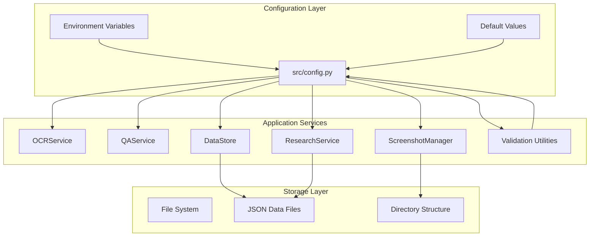
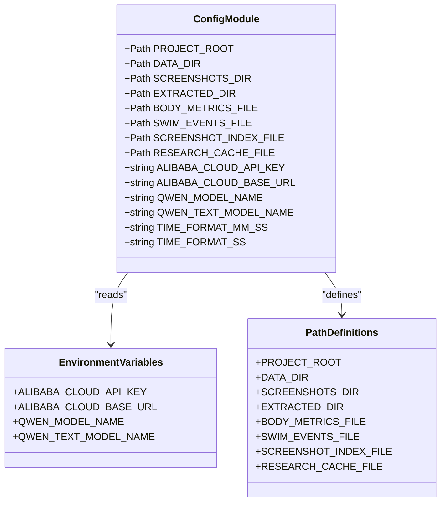
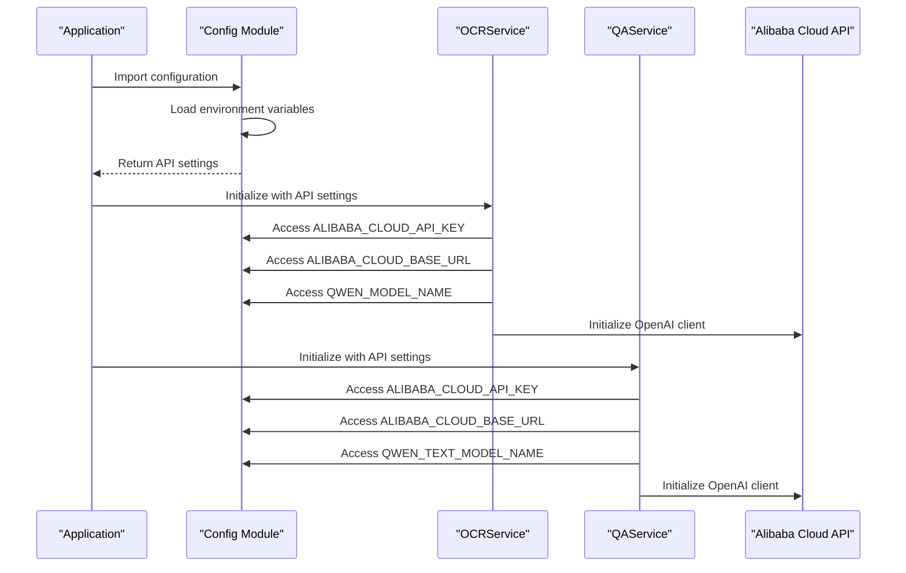
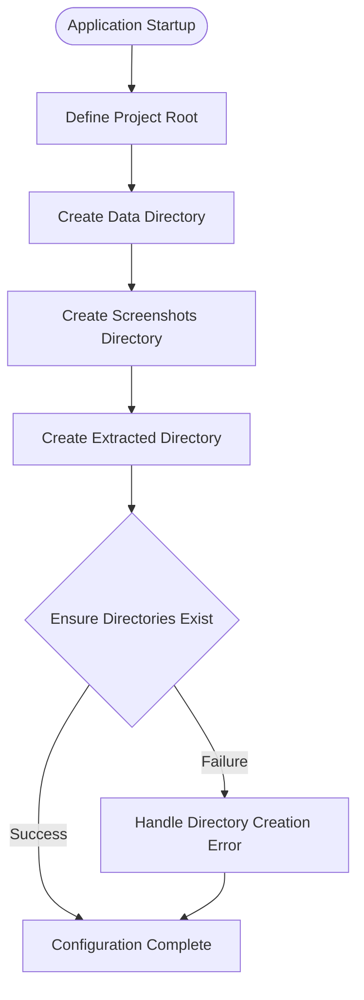
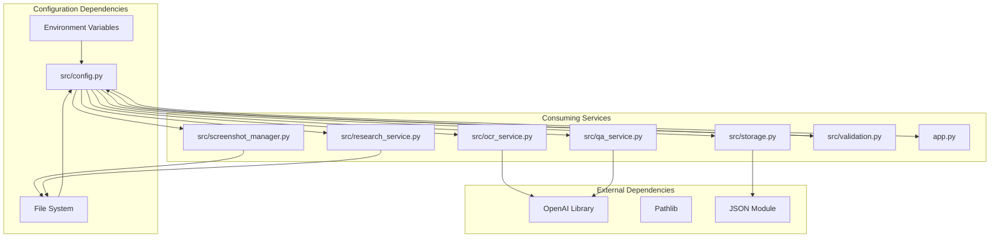

# Configuration Management

<cite>
**Referenced Files in This Document**
- [config.py](file://src/config.py)
- [app.py](file://app.py)
- [storage.py](file://src/storage.py)
- [screenshot_manager.py](file://src/screenshot_manager.py)
- [ocr_service.py](file://src/ocr_service.py)
- [qa_service.py](file://src/qa_service.py)
- [research_service.py](file://src/research_service.py)
- [validation.py](file://src/validation.py)
- [models.py](file://src/models.py)
- [README.md](file://README.md)
- [requirements.txt](file://requirements.txt)
</cite>

## Table of Contents
1. [Introduction](#introduction)
2. [Project Structure](#project-structure)
3. [Core Components](#core-components)
4. [Architecture Overview](#architecture-overview)
5. [Detailed Component Analysis](#detailed-component-analysis)
6. [Dependency Analysis](#dependency-analysis)
7. [Performance Considerations](#performance-considerations)
8. [Troubleshooting Guide](#troubleshooting-guide)
9. [Conclusion](#conclusion)

## Introduction
This document provides comprehensive documentation for the configuration management system that powers the Swimming Data Analysis Platform. The configuration module centralizes environment variables, API endpoint settings, and path configurations used throughout the application. It manages Alibaba Cloud API credentials, defines data storage locations, and establishes validation patterns for time formats. The system follows a centralized configuration approach where settings are imported and consumed by various services, ensuring consistent behavior across the platform.

## Project Structure
The configuration system is implemented in a single module that defines constants and environment-dependent settings. The module is designed to be imported by other components, enabling a clean separation between configuration and business logic.



**Diagram sources**
- [config.py:1-29](file://src/config.py#L1-L29)
- [app.py:10-20](file://app.py#L10-L20)

**Section sources**
- [config.py:1-29](file://src/config.py#L1-L29)
- [app.py:10-20](file://app.py#L10-L20)

## Core Components
The configuration system consists of several key categories:

### Path Configuration
The system defines a hierarchical directory structure for data storage:
- Project root directory using pathlib for cross-platform compatibility
- Data directory (`data/`) as the primary storage location
- Subdirectories for screenshots and extracted data
- JSON files for persistent data storage

### Environment Variables
The system reads configuration from environment variables with sensible defaults:
- Alibaba Cloud API key (required for OCR/Q&A functionality)
- Base URL for Alibaba Cloud Model Studio API
- Model names for vision-language and text processing
- Time format regex patterns for data validation

### Data File Definitions
Persistent storage locations for application data:
- Body metrics storage
- Swim events database
- Screenshot index
- Research cache

**Section sources**
- [config.py:5-18](file://src/config.py#L5-L18)
- [config.py:20-28](file://src/config.py#L20-L28)

## Architecture Overview
The configuration system follows a centralized pattern where a single module exports constants and environment-dependent settings. Services import these values rather than managing their own configuration, ensuring consistency and reducing duplication.



**Diagram sources**
- [config.py:1-29](file://src/config.py#L1-L29)
- [ocr_service.py:8](file://src/ocr_service.py#L8)
- [qa_service.py:6](file://src/qa_service.py#L6)
- [storage.py:7](file://src/storage.py#L7)
- [screenshot_manager.py:10](file://src/screenshot_manager.py#L10)
- [research_service.py:6](file://src/research_service.py#L6)
- [validation.py:4](file://src/validation.py#L4)

## Detailed Component Analysis

### Central Configuration Module
The configuration module serves as the single source of truth for all application settings. It establishes the project structure, defines storage locations, and manages external service integrations.



**Diagram sources**
- [config.py:5-28](file://src/config.py#L5-L28)

**Section sources**
- [config.py:1-29](file://src/config.py#L1-L29)

### Alibaba Cloud API Configuration
The system integrates with Alibaba Cloud Model Studio for OCR and Q&A capabilities. The configuration supports flexible API key management and model selection.



**Diagram sources**
- [config.py:20-24](file://src/config.py#L20-L24)
- [ocr_service.py:15-20](file://src/ocr_service.py#L15-L20)
- [qa_service.py:15-21](file://src/qa_service.py#L15-L21)

**Section sources**
- [config.py:20-24](file://src/config.py#L20-L24)
- [ocr_service.py:15-20](file://src/ocr_service.py#L15-L20)
- [qa_service.py:15-21](file://src/qa_service.py#L15-L21)

### Path Configuration Management
The system establishes a robust directory structure for data persistence and organization.



**Diagram sources**
- [config.py:5-18](file://src/config.py#L5-L18)

**Section sources**
- [config.py:5-18](file://src/config.py#L5-L18)

### Data Storage Configuration
The configuration module defines persistent storage locations for all application data types.

```mermaid
erDiagram
CONFIG {
PATH PROJECT_ROOT
PATH DATA_DIR
PATH SCREENSHOTS_DIR
PATH EXTRACTED_DIR
PATH BODY_METRICS_FILE
PATH SWIM_EVENTS_FILE
PATH SCREENSHOT_INDEX_FILE
PATH RESEARCH_CACHE_FILE
}
STORAGE_LOCATIONS {
FILE body_metrics.json
FILE swim_events.json
FILE index.json
FILE research_cache.json
}
CONFIG ||--|| STORAGE_LOCATIONS : "defines"
```

**Diagram sources**
- [config.py:6-14](file://src/config.py#L6-L14)

**Section sources**
- [config.py:6-14](file://src/config.py#L6-L14)

### Time Format Validation Configuration
The system includes predefined regex patterns for validating swimming time formats, ensuring data consistency across the platform.

**Section sources**
- [config.py:26-28](file://src/config.py#L26-L28)
- [validation.py:7-23](file://src/validation.py#L7-L23)

## Dependency Analysis
The configuration system creates dependencies across multiple application layers, establishing a clear contract between configuration and implementation.



**Diagram sources**
- [config.py:1-29](file://src/config.py#L1-L29)
- [ocr_service.py:6](file://src/ocr_service.py#L6)
- [qa_service.py:4](file://src/qa_service.py#L4)
- [storage.py:2](file://src/storage.py#L2)
- [screenshot_manager.py:5](file://src/screenshot_manager.py#L5)
- [research_service.py:4](file://src/research_service.py#L4)
- [validation.py:2](file://src/validation.py#L2)

**Section sources**
- [config.py:1-29](file://src/config.py#L1-L29)
- [requirements.txt:1-10](file://requirements.txt#L1-L10)

## Performance Considerations
The configuration system is designed for minimal overhead and efficient access patterns:

- **Lazy Loading**: Environment variables are read once during module import
- **Path Caching**: Path objects are computed once and reused
- **Minimal Dependencies**: Configuration module has no external dependencies
- **Efficient Storage**: Direct path references reduce string manipulation overhead

## Troubleshooting Guide

### Environment Variable Issues
Common problems and solutions for configuration management:

**API Key Not Found**
- Symptom: Alibaba Cloud API key warning in the application
- Solution: Set the `ALIBABA_CLOUD_API_KEY` environment variable
- Verification: Check the API status indicator in the application footer

**Incorrect Base URL**
- Symptom: API connection failures or timeout errors
- Solution: Verify the `ALIBABA_CLOUD_BASE_URL` environment variable
- Default: Uses Alibaba Cloud Model Studio compatible mode URL

**Missing Data Directories**
- Symptom: Permission errors when saving screenshots or data
- Solution: Ensure the `data/` directory exists and is writable
- Automatic creation: The system attempts to create directories on startup

**Section sources**
- [app.py:440-446](file://app.py#L440-L446)
- [README.md:22-25](file://README.md#L22-L25)

### Configuration Validation
The system includes built-in validation mechanisms:

**Runtime Configuration Checks**
- API key presence validation in services
- Directory existence verification
- File permission checks for data persistence

**Development vs Production Differences**
- Local development: Uses default model names and base URLs
- Production: Requires explicit environment variable configuration
- Security: API keys should never be committed to version control

**Section sources**
- [qa_service.py:87-88](file://src/qa_service.py#L87-L88)
- [README.md:15-30](file://README.md#L15-L30)

## Conclusion
The configuration management system provides a robust foundation for the Swimming Data Analysis Platform. By centralizing all configuration in a single module, the system ensures consistency, maintainability, and flexibility across all application components. The design supports both local development and production deployment scenarios while maintaining security best practices for API key management. The modular architecture enables easy extension and modification of configuration settings without affecting the broader application structure.

The system successfully balances simplicity with functionality, providing developers with a clear and predictable way to manage application settings while maintaining the flexibility needed for different deployment environments.