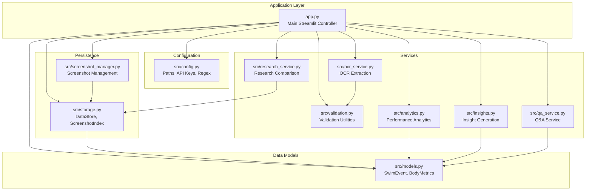
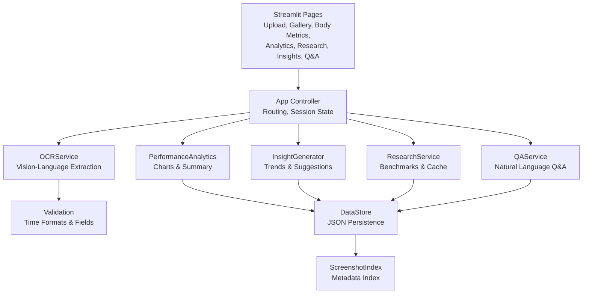
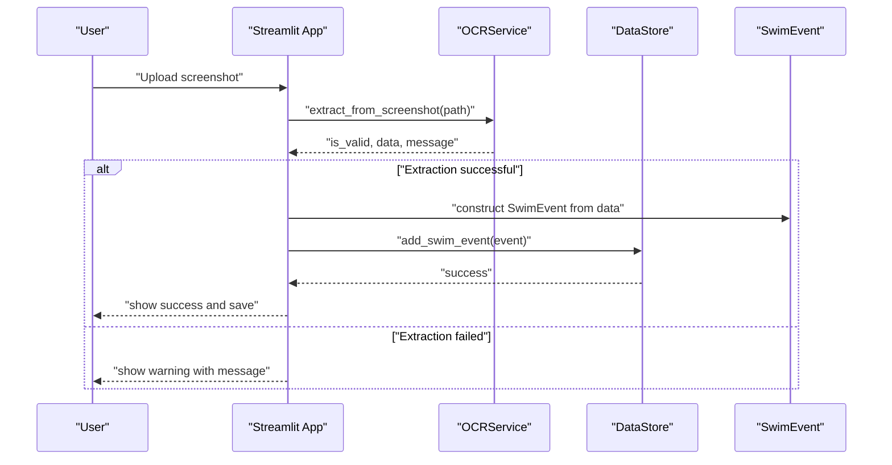
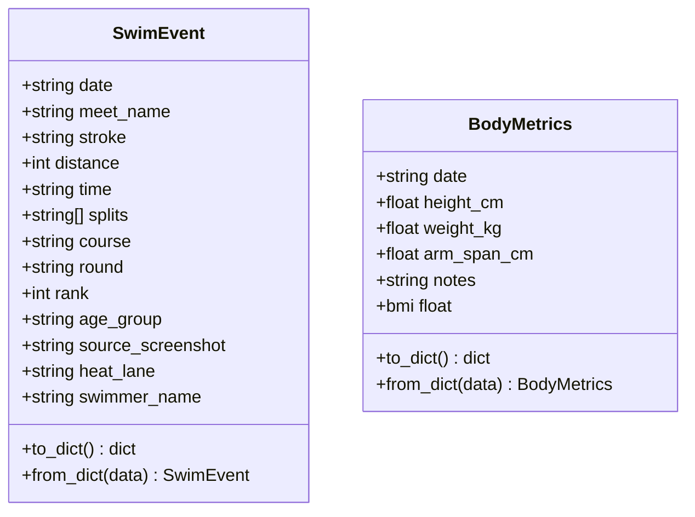
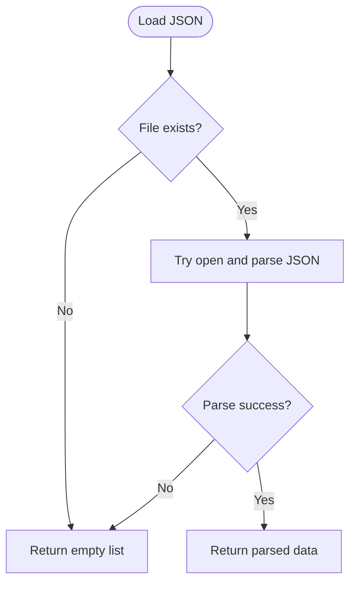
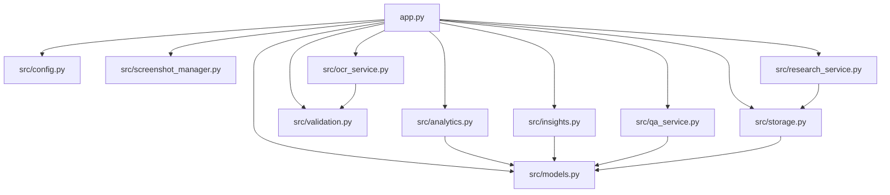

# Core Components

<cite>
**Referenced Files in This Document**
- [app.py](file://app.py)
- [src/models.py](file://src/models.py)
- [src/config.py](file://src/config.py)
- [src/storage.py](file://src/storage.py)
- [src/screenshot_manager.py](file://src/screenshot_manager.py)
- [src/validation.py](file://src/validation.py)
- [src/analytics.py](file://src/analytics.py)
- [src/insights.py](file://src/insights.py)
- [src/ocr_service.py](file://src/ocr_service.py)
- [src/research_service.py](file://src/research_service.py)
- [src/qa_service.py](file://src/qa_service.py)
- [README.md](file://README.md)
- [requirements.txt](file://requirements.txt)
</cite>

## Table of Contents
1. [Introduction](#introduction)
2. [Project Structure](#project-structure)
3. [Core Components](#core-components)
4. [Architecture Overview](#architecture-overview)
5. [Detailed Component Analysis](#detailed-component-analysis)
6. [Dependency Analysis](#dependency-analysis)
7. [Performance Considerations](#performance-considerations)
8. [Troubleshooting Guide](#troubleshooting-guide)
9. [Conclusion](#conclusion)

## Introduction
This document provides comprehensive documentation for the core components of the Swimming Data Analysis Platform. It focuses on the main application controller (app.py), data models (models.py), configuration management (config.py), and the data persistence layer (storage.py). It also covers supporting components such as OCR extraction, analytics, insights, research comparison, and Q&A services. The goal is to explain component interactions, initialization sequences, dependency relationships, error handling strategies, and lifecycle management in a way that is accessible to both technical and non-technical readers.

## Project Structure
The platform is organized as a Streamlit application with a modular backend. The main application controller orchestrates page routing, session state management, and UI coordination. Supporting modules handle configuration, data models, persistence, screenshot management, validation, analytics, insights, OCR extraction, research comparison, and Q&A.

**Diagram sources**
- [app.py:1-447](file://app.py#L1-L447)
- [src/config.py:1-29](file://src/config.py#L1-L29)
- [src/models.py:1-55](file://src/models.py#L1-L55)
- [src/storage.py:1-107](file://src/storage.py#L1-L107)
- [src/screenshot_manager.py:1-136](file://src/screenshot_manager.py#L1-L136)
- [src/validation.py:1-103](file://src/validation.py#L1-L103)
- [src/analytics.py:1-184](file://src/analytics.py#L1-L184)
- [src/insights.py:1-150](file://src/insights.py#L1-L150)
- [src/ocr_service.py:1-144](file://src/ocr_service.py#L1-L144)
- [src/research_service.py:1-94](file://src/research_service.py#L1-L94)
- [src/qa_service.py:1-174](file://src/qa_service.py#L1-L174)

**Section sources**
- [README.md:1-63](file://README.md#L1-L63)
- [requirements.txt:1-10](file://requirements.txt#L1-L10)

## Core Components
This section documents the primary building blocks of the platform and how they work together.

- Main Application Controller (app.py)
  - Initializes Streamlit page configuration and session state.
  - Implements page routing across Upload, Gallery, Body Metrics, Analytics, Research, Insights, and Q&A.
  - Manages session state for navigation, chat history, and last extraction result.
  - Integrates services for OCR extraction, analytics, insights, research, and Q&A.
  - Provides data export/import functionality and API status checks.

- Data Models (models.py)
  - SwimEvent: Represents a single swimming event result with fields for date, meet name, stroke, distance, time, splits, course, round, rank, age group, source screenshot path, heat/lane, and swimmer name.
  - BodyMetrics: Represents body measurements with date, height, weight, arm span, and notes, plus a computed BMI property.

- Configuration Management (config.py)
  - Defines project root, data directories, and file paths for JSON storage.
  - Ensures required directories exist.
  - Loads environment variables for Alibaba Cloud API configuration and model names.
  - Provides time format regex patterns for validation.

- Data Persistence Layer (storage.py)
  - DataStore: JSON-based persistence for SwimEvent and BodyMetrics with load/save/add methods.
  - ScreenshotIndex: Manages screenshot metadata index with add, list, get, and remove operations.

**Section sources**
- [app.py:22-447](file://app.py#L22-L447)
- [src/models.py:7-55](file://src/models.py#L7-L55)
- [src/config.py:5-29](file://src/config.py#L5-L29)
- [src/storage.py:10-107](file://src/storage.py#L10-L107)

## Architecture Overview
The platform follows a layered architecture:
- Presentation Layer: Streamlit app orchestrating UI pages and user interactions.
- Service Layer: Business logic services for OCR, analytics, insights, research, and Q&A.
- Persistence Layer: JSON-based storage for swim events, body metrics, and screenshot index.
- Configuration Layer: Centralized configuration and environment variable handling.

**Diagram sources**
- [app.py:60-403](file://app.py#L60-L403)
- [src/ocr_service.py:12-144](file://src/ocr_service.py#L12-L144)
- [src/analytics.py:13-184](file://src/analytics.py#L13-L184)
- [src/insights.py:11-150](file://src/insights.py#L11-L150)
- [src/research_service.py:10-94](file://src/research_service.py#L10-L94)
- [src/qa_service.py:12-174](file://src/qa_service.py#L12-L174)
- [src/validation.py:7-103](file://src/validation.py#L7-L103)
- [src/storage.py:10-107](file://src/storage.py#L10-L107)

## Detailed Component Analysis

### Main Application Controller (app.py)
Responsibilities:
- Sets Streamlit page configuration and layout.
- Initializes session state for page navigation, chat history, and last extraction result.
- Implements sidebar navigation with buttons for each page.
- Handles page rendering logic for Upload, Gallery, Body Metrics, Analytics, Research, Insights, and Q&A.
- Coordinates service integrations for OCR extraction, analytics, insights, research, and Q&A.
- Provides data export/import and API status indicators.

Key behaviors:
- Page routing via session state updates and reruns.
- Session state management for chat history and extraction results.
- Integration with ScreenshotManager, OCRService, DataStore, PerformanceAnalytics, InsightGenerator, ResearchService, and QAService.
- Data export/import using JSON serialization and download button.
- API status check for Alibaba Cloud configuration.

**Diagram sources**
- [app.py:73-118](file://app.py#L73-L118)
- [src/ocr_service.py:49-120](file://src/ocr_service.py#L49-L120)
- [src/storage.py:40-44](file://src/storage.py#L40-L44)
- [src/models.py:24-29](file://src/models.py#L24-L29)

**Section sources**
- [app.py:22-447](file://app.py#L22-L447)

### Data Models (models.py)
Responsibilities:
- Define SwimEvent and BodyMetrics data structures with typed fields.
- Provide serialization/deserialization helpers (to_dict/from_dict).
- Compute derived metrics (BMI) for BodyMetrics.

Field definitions and validation rules:
- SwimEvent fields include date, meet_name, stroke, distance, time, splits, course, round, rank, age_group, source_screenshot, heat_lane, swimmer_name.
- BodyMetrics fields include date, height_cm, weight_kg, arm_span_cm, notes; BMI computed from height and weight.

**Diagram sources**
- [src/models.py:7-55](file://src/models.py#L7-L55)

**Section sources**
- [src/models.py:7-55](file://src/models.py#L7-L55)

### Configuration Management (config.py)
Responsibilities:
- Define project root and data directories (data/, screenshots/, extracted/).
- Define file paths for JSON storage (body_metrics.json, swim_events.json, screenshot index, research cache).
- Ensure directories exist during import.
- Load environment variables for Alibaba Cloud API configuration (API key, base URL, model names).
- Provide regex patterns for time format validation.

Environment variables:
- ALIBABA_CLOUD_API_KEY: API key for Alibaba Cloud services.
- ALIBABA_CLOUD_BASE_URL: Base URL for the API.
- QWEN_MODEL_NAME: Vision-language model name.
- QWEN_TEXT_MODEL_NAME: Text model name.

**Section sources**
- [src/config.py:5-29](file://src/config.py#L5-L29)

### Data Persistence Layer (storage.py)
Responsibilities:
- DataStore: JSON-based persistence for SwimEvent and BodyMetrics.
  - Load/save/add methods for both entities.
  - Uses file paths defined in config.py.
- ScreenshotIndex: Manages screenshot metadata index.
  - Load/save/add/list/get/remove operations.
  - Maintains screenshot metadata including path, original filename, meet name, date, upload timestamp, checksum, and size.

Storage patterns:
- JSON serialization with UTF-8 encoding and indentation.
- Directory creation on demand.
- Robust error handling for JSON decode and IO errors.

**Diagram sources**
- [src/storage.py:14-27](file://src/storage.py#L14-L27)

**Section sources**
- [src/storage.py:10-107](file://src/storage.py#L10-L107)

### Supporting Services

#### OCR Service (ocr_service.py)
Responsibilities:
- Encodes images to base64 and sends requests to Alibaba Cloud Model Studio.
- Uses a vision-language model to extract structured swimming data from screenshots.
- Validates extracted data using validation utilities.
- Returns structured data with confidence placeholders and validation errors.

Integration points:
- Uses config for API key, base URL, and model name.
- Uses validation for time format and required fields.
- Produces SwimEvent-compatible dictionaries.

**Section sources**
- [src/ocr_service.py:12-144](file://src/ocr_service.py#L12-L144)

#### Analytics (analytics.py)
Responsibilities:
- Converts SwimEvent data to pandas DataFrame for analysis.
- Computes time progression charts, stroke comparison radar charts, and personal bests.
- Provides dashboard summary statistics.

Integration points:
- Uses DataStore for loading events.
- Uses validation utilities for time conversions.

**Section sources**
- [src/analytics.py:13-184](file://src/analytics.py#L13-L184)

#### Insights (insights.py)
Responsibilities:
- Generates trend insights, identifies strengths/weaknesses, assesses potential, and suggests training drills.
- Uses PerformanceAnalytics for personal bests and stroke pace calculations.

**Section sources**
- [src/insights.py:11-150](file://src/insights.py#L11-L150)

#### Research Service (research_service.py)
Responsibilities:
- Searches for age-group swimming benchmarks using DuckDuckGo search.
- Caches results to avoid repeated network calls.
- Compares personal bests against benchmarks.

**Section sources**
- [src/research_service.py:10-94](file://src/research_service.py#L10-L94)

#### QA Service (qa_service.py)
Responsibilities:
- Builds structured context from swim events and body metrics.
- Classifies question types and answers using a text model.
- Maintains conversation history for contextual follow-ups.

**Section sources**
- [src/qa_service.py:12-174](file://src/qa_service.py#L12-L174)

#### Validation (validation.py)
Responsibilities:
- Validates time formats (MM:SS.ss or SS.ss).
- Converts between time strings and seconds.
- Validates required fields and swim event data completeness.

**Section sources**
- [src/validation.py:7-103](file://src/validation.py#L7-L103)

#### Screenshot Manager (screenshot_manager.py)
Responsibilities:
- Saves uploaded screenshots to organized directories.
- Detects duplicates by filename and checksum.
- Maintains thumbnail generation and deletion with index cleanup.

**Section sources**
- [src/screenshot_manager.py:14-136](file://src/screenshot_manager.py#L14-L136)

## Dependency Analysis
This section maps the dependencies among core components and highlights coupling and cohesion.

**Diagram sources**
- [app.py:10-19](file://app.py#L10-L19)
- [src/ocr_service.py:8-9](file://src/ocr_service.py#L8-L9)
- [src/analytics.py:8-10](file://src/analytics.py#L8-L10)
- [src/insights.py:5-8](file://src/insights.py#L5-L8)
- [src/research_service.py:6-7](file://src/research_service.py#L6-L7)
- [src/qa_service.py:6-9](file://src/qa_service.py#L6-L9)
- [src/storage.py:6-7](file://src/storage.py#L6-L7)

Observations:
- app.py depends on all core modules, acting as the central coordinator.
- Services depend on models and storage for data operations.
- OCR depends on validation for data quality.
- Analytics and insights depend on models and storage for computations.
- Research and QA depend on storage and analytics for context.

**Section sources**
- [app.py:10-19](file://app.py#L10-L19)
- [src/ocr_service.py:8-9](file://src/ocr_service.py#L8-L9)
- [src/analytics.py:8-10](file://src/analytics.py#L8-L10)
- [src/insights.py:5-8](file://src/insights.py#L5-L8)
- [src/research_service.py:6-7](file://src/research_service.py#L6-L7)
- [src/qa_service.py:6-9](file://src/qa_service.py#L6-L9)
- [src/storage.py:6-7](file://src/storage.py#L6-L7)

## Performance Considerations
- JSON I/O: DataStore and ScreenshotIndex operations are O(n) for list and remove operations; consider indexing by path for frequent lookups.
- Image processing: Thumbnail generation and duplicate detection involve file I/O; batch operations can reduce overhead.
- API calls: OCR and Q&A rely on external APIs; implement retry logic and caching where appropriate.
- Data size: Large datasets can impact analytics computations; consider pagination or sampling for charts.
- Memory usage: Converting large event sets to DataFrames can be memory-intensive; process in chunks if needed.

## Troubleshooting Guide
Common issues and resolutions:
- Missing API key: Ensure ALIBABA_CLOUD_API_KEY is set; otherwise OCR and Q&A will fail.
- JSON decode errors: Verify file integrity; DataStore handles malformed JSON gracefully by returning empty lists.
- Duplicate screenshots: ScreenshotManager detects duplicates by filename and checksum; remove duplicates from index if necessary.
- Time format errors: Use MM:SS.ss or SS.ss formats; validation utilities provide clear error messages.
- No data for analytics: Ensure swim events are loaded; analytics functions return empty structures when no data is available.
- Research cache failures: DuckDuckGo search may fail; cached results are used when available.

**Section sources**
- [src/config.py:20-24](file://src/config.py#L20-L24)
- [src/storage.py:17-21](file://src/storage.py#L17-L21)
- [src/screenshot_manager.py:62-68](file://src/screenshot_manager.py#L62-L68)
- [src/validation.py:7-23](file://src/validation.py#L7-L23)
- [src/analytics.py:17-28](file://src/analytics.py#L17-L28)
- [src/research_service.py:46-53](file://src/research_service.py#L46-L53)

## Conclusion
The Swimming Data Analysis Platform is a cohesive, modular system built around a Streamlit controller that coordinates services for OCR extraction, analytics, insights, research comparison, and Q&A. The data models define clear structures for swim events and body metrics, while the configuration and persistence layers provide robust, file-based storage. By following the documented patterns and addressing the troubleshooting tips, developers can extend and maintain the platform effectively.