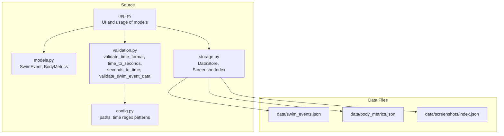
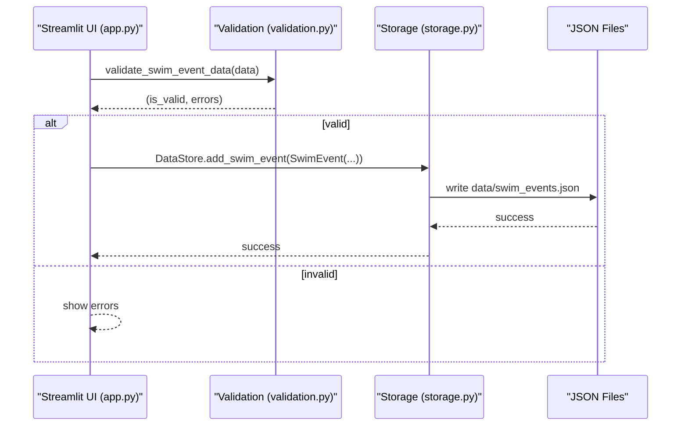
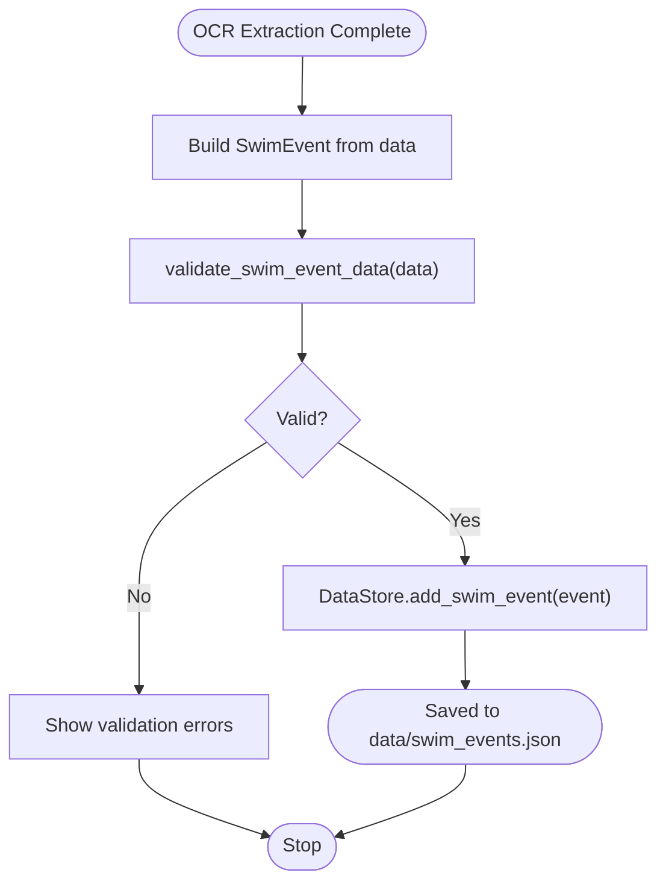
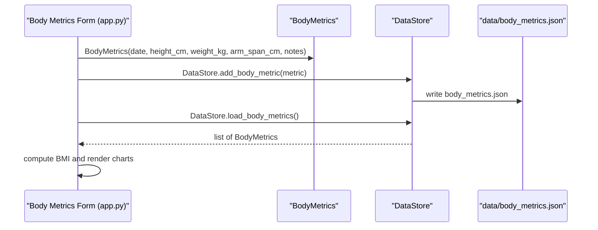
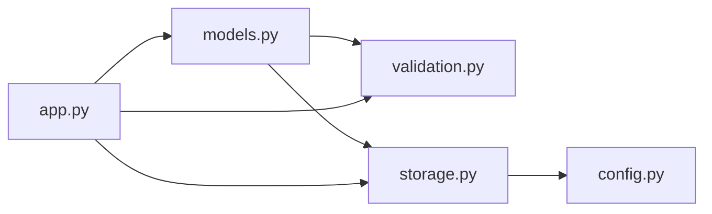

# Data Models

<cite>
**Referenced Files in This Document**
- [models.py](file://src/models.py)
- [validation.py](file://src/validation.py)
- [storage.py](file://src/storage.py)
- [config.py](file://src/config.py)
- [app.py](file://app.py)
- [README.md](file://README.md)
</cite>

## Table of Contents
1. [Introduction](#introduction)
2. [Project Structure](#project-structure)
3. [Core Components](#core-components)
4. [Architecture Overview](#architecture-overview)
5. [Detailed Component Analysis](#detailed-component-analysis)
6. [Dependency Analysis](#dependency-analysis)
7. [Performance Considerations](#performance-considerations)
8. [Troubleshooting Guide](#troubleshooting-guide)
9. [Conclusion](#conclusion)
10. [Appendices](#appendices)

## Introduction
This document describes the data models that define the core data structures used throughout the Swimming Data Analysis Platform. It focuses on the SwimEvent and BodyMetrics classes, detailing their fields, types, defaults, and constraints. It also explains validation rules, type conversions, serialization methods, and how models integrate with the data persistence layer. Finally, it covers model evolution strategies and backward compatibility considerations.

## Project Structure
The data models live in the source module alongside validation utilities and a JSON-based storage layer. The application orchestrates ingestion and analytics around these models.

**Diagram sources**
- [models.py:1-55](file://src/models.py#L1-L55)
- [validation.py:1-103](file://src/validation.py#L1-L103)
- [storage.py:1-107](file://src/storage.py#L1-L107)
- [config.py:1-29](file://src/config.py#L1-L29)
- [app.py:90-224](file://app.py#L90-L224)

**Section sources**
- [README.md:32-39](file://README.md#L32-L39)
- [config.py:10-14](file://src/config.py#L10-L14)

## Core Components
This section documents the two primary data models and their roles in the platform.

- SwimEvent: Represents a single swimming performance result extracted from screenshots.
- BodyMetrics: Represents body measurements taken at a point in time, including derived BMI.

Both models are defined as dataclasses with straightforward serialization helpers to_dict/from_dict for JSON persistence.

**Section sources**
- [models.py:7-30](file://src/models.py#L7-L30)
- [models.py:32-55](file://src/models.py#L32-L55)

## Architecture Overview
The models integrate with the validation utilities and the storage layer to support ingestion, persistence, and analytics.

**Diagram sources**
- [app.py:96-112](file://app.py#L96-L112)
- [validation.py:75-102](file://src/validation.py#L75-L102)
- [storage.py:30-44](file://src/storage.py#L30-L44)

## Detailed Component Analysis

### SwimEvent Model
SwimEvent encapsulates a single race result with the following fields and characteristics:

- date: str (ISO format: YYYY-MM-DD)
- meet_name: str
- stroke: str (allowed values include freestyle, backstroke, breaststroke, butterfly, IM)
- distance: int (in meters: 50, 100, 200, 400, 800, 1500)
- time: str (MM:SS.ss or SS.ss format)
- splits: List[str] (default: empty list)
- course: str (default: empty string; typical values: LC or SC)
- round: str (default: empty string; typical values: heat, semifinal, final)
- rank: int (default: 0)
- age_group: str (default: empty string; e.g., "8 & Under", "9-10", "11-12")
- source_screenshot: str (default: empty string; path to source screenshot)
- heat_lane: str (default: empty string; e.g., "H3 L4")
- swimmer_name: str (default: "Sunny")

Serialization methods:
- to_dict(): Returns a dictionary representation suitable for JSON serialization.
- from_dict(cls, data): Constructs a SwimEvent from a dictionary.

Integration with persistence:
- DataStore.load_swim_events() reads JSON and reconstructs SwimEvent instances.
- DataStore.save_swim_events() writes a list of SwimEvent instances to JSON.
- DataStore.add_swim_event() appends a single SwimEvent to the persisted list.

Usage examples:
- Instantiation from OCR extraction results and saving to storage.
- Loading and rendering analytics dashboards.

Validation and type conversion:
- Validation utilities enforce time format and presence of required fields.
- Conversions between time string and seconds are provided for downstream analytics.

**Section sources**
- [models.py:7-30](file://src/models.py#L7-L30)
- [storage.py:30-44](file://src/storage.py#L30-L44)
- [validation.py:75-102](file://src/validation.py#L75-L102)
- [app.py:96-112](file://app.py#L96-L112)

### BodyMetrics Model
BodyMetrics captures anthropometric measurements at a point in time:

- date: str (ISO format: YYYY-MM-DD)
- height_cm: float (default: 0.0)
- weight_kg: float (default: 0.0)
- arm_span_cm: float (default: 0.0)
- notes: str (default: empty string)

Derived property:
- bmi: Calculates BMI from height and weight when both are positive; otherwise returns 0.0.

Serialization methods:
- to_dict(): Returns a dictionary representation suitable for JSON serialization.
- from_dict(cls, data): Constructs a BodyMetrics from a dictionary.

Integration with persistence:
- DataStore.load_body_metrics() reads JSON and reconstructs BodyMetrics instances.
- DataStore.save_body_metrics() writes a list of BodyMetrics instances to JSON.
- DataStore.add_body_metric() appends a single BodyMetrics to the persisted list.

Usage examples:
- Recording measurements via the UI form.
- Rendering historical charts and computing BMI for visualization.

**Section sources**
- [models.py:32-55](file://src/models.py#L32-L55)
- [storage.py:47-61](file://src/storage.py#L47-L61)
- [app.py:184-194](file://app.py#L184-L194)

### Data Validation Rules and Type Conversions
Validation utilities enforce correctness and consistency:

- validate_time_format(time_str): Validates MM:SS.ss or SS.ss format using regex patterns configured in config.py.
- time_to_seconds(time_str): Converts time string to total seconds for numeric computations.
- seconds_to_time(total_seconds): Converts seconds back to a formatted string.
- validate_required_fields(data, required): Ensures required keys are present and non-empty.
- validate_swim_event_data(data): Aggregates validation for SwimEvent fields, including required fields and split times.

These utilities are used during ingestion and before persisting SwimEvent data.

**Section sources**
- [validation.py:7-102](file://src/validation.py#L7-L102)
- [config.py:26-28](file://src/config.py#L26-L28)

### Serialization and Persistence Integration
Models rely on simple dictionary-based serialization:

- to_dict(): Uses dataclass asdict to convert instances to dictionaries.
- from_dict(): Uses constructor unpacking to build instances from dictionaries.

Storage layer:
- DataStore persists SwimEvent and BodyMetrics lists to JSON files under the data directory.
- ScreenshotIndex manages screenshot metadata in a separate JSON file.

This approach enables straightforward evolution and backward compatibility strategies (see Evolution Strategies).

**Section sources**
- [models.py:24-29](file://src/models.py#L24-L29)
- [models.py:41-46](file://src/models.py#L41-L46)
- [storage.py:10-61](file://src/storage.py#L10-L61)

### Example Workflows

#### SwimEvent Creation and Validation
- The UI constructs a SwimEvent from OCR extraction results and optional user inputs.
- Validation ensures required fields and time formats are correct.
- On success, the event is appended to the swim events list and persisted.

**Diagram sources**
- [app.py:96-112](file://app.py#L96-L112)
- [validation.py:75-102](file://src/validation.py#L75-L102)
- [storage.py:40-44](file://src/storage.py#L40-L44)

#### BodyMetrics Recording and Visualization
- The UI collects date, height, weight, arm span, and notes.
- A BodyMetrics instance is created and persisted.
- Historical data is loaded, BMI computed, and plotted.

**Diagram sources**
- [app.py:184-194](file://app.py#L184-L194)
- [storage.py:57-61](file://src/storage.py#L57-L61)
- [models.py:48-54](file://src/models.py#L48-L54)

## Dependency Analysis
The models depend on:
- dataclasses for lightweight serialization helpers.
- typing for type hints.
- validation utilities for input correctness.
- storage layer for persistence.
- config for file paths and regex patterns.

**Diagram sources**
- [models.py:1-5](file://src/models.py#L1-L5)
- [validation.py:1-5](file://src/validation.py#L1-L5)
- [storage.py:1-8](file://src/storage.py#L1-L8)
- [config.py:1-14](file://src/config.py#L1-L14)
- [app.py:1-20](file://app.py#L1-L20)

**Section sources**
- [models.py:1-5](file://src/models.py#L1-L5)
- [validation.py:1-5](file://src/validation.py#L1-L5)
- [storage.py:1-8](file://src/storage.py#L1-L8)
- [config.py:1-14](file://src/config.py#L1-L14)
- [app.py:1-20](file://app.py#L1-L20)

## Performance Considerations
- JSON serialization is simple and fast for small-to-medium datasets typical in personal analytics.
- Avoid frequent disk I/O by batching operations when adding multiple entries.
- For large datasets, consider lazy loading and filtering in memory before plotting.
- Time conversions are O(1) operations; keep validations minimal and early to fail fast.

## Troubleshooting Guide
Common issues and resolutions:
- Invalid time format: Ensure times match MM:SS.ss or SS.ss. Validation will report the exact mismatch.
- Missing required fields: Provide date, meet_name, stroke, distance, and time.
- Split time validation failures: Each split must conform to the same time format.
- Persistence errors: Verify data directory permissions and free disk space.
- BMI calculation: BMI is zero when height or weight is non-positive.

Where to look:
- Validation messages and error lists from validate_swim_event_data.
- Storage exceptions from DataStore JSON read/write routines.
- UI feedback from Streamlit after form submissions.

**Section sources**
- [validation.py:75-102](file://src/validation.py#L75-L102)
- [storage.py:14-27](file://src/storage.py#L14-L27)
- [models.py:48-54](file://src/models.py#L48-L54)
- [app.py:96-112](file://app.py#L96-L112)

## Conclusion
The SwimEvent and BodyMetrics models provide a compact, serializable foundation for the Swimming Data Analysis Platform. They integrate cleanly with validation utilities and a JSON-backed storage layer, enabling robust ingestion, persistence, and analytics. Their design supports straightforward evolution and backward compatibility strategies.

## Appendices

### Field Reference and Constraints
- SwimEvent
  - date: str (ISO date)
  - meet_name: str
  - stroke: str (permitted values: freestyle, backstroke, breaststroke, butterfly, IM)
  - distance: int (meters)
  - time: str (MM:SS.ss or SS.ss)
  - splits: List[str] (optional)
  - course: str (LC/SC)
  - round: str (heat/semifinal/final)
  - rank: int
  - age_group: str
  - source_screenshot: str (path)
  - heat_lane: str
  - swimmer_name: str (default: "Sunny")

- BodyMetrics
  - date: str (ISO date)
  - height_cm: float
  - weight_kg: float
  - arm_span_cm: float
  - notes: str
  - bmi: property (computed)

**Section sources**
- [models.py:7-30](file://src/models.py#L7-L30)
- [models.py:32-55](file://src/models.py#L32-L55)

### Data Persistence Locations
- Swim events: data/swim_events.json
- Body metrics: data/body_metrics.json
- Screenshot index: data/screenshots/index.json

**Section sources**
- [README.md:32-39](file://README.md#L32-L39)
- [config.py:10-14](file://src/config.py#L10-L14)

### Model Evolution and Backward Compatibility
Recommended strategies:
- Add optional fields with sensible defaults to preserve backward compatibility.
- Maintain stable JSON schemas and avoid changing field names.
- Provide migration scripts to transform older JSON files when evolving schemas.
- Keep validation strict for new fields while tolerating missing values during migration.
- Version the data files or use a version field inside the JSON to guide migrations.

[No sources needed since this section provides general guidance]