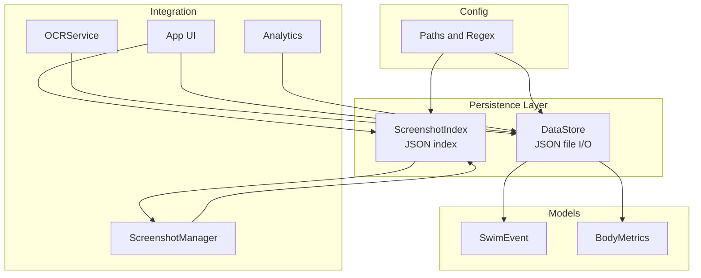
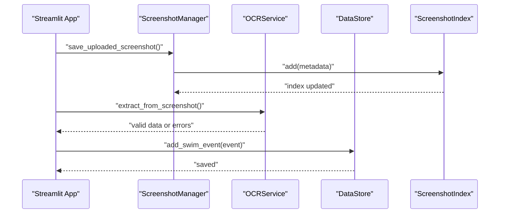
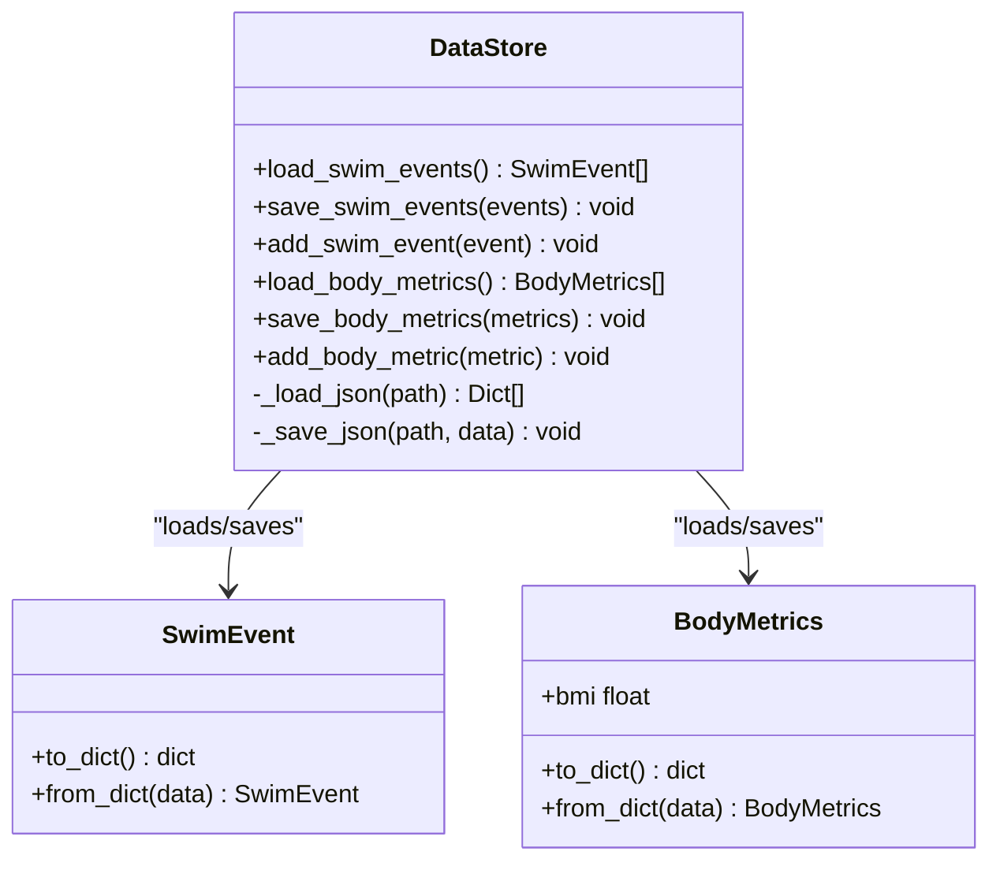
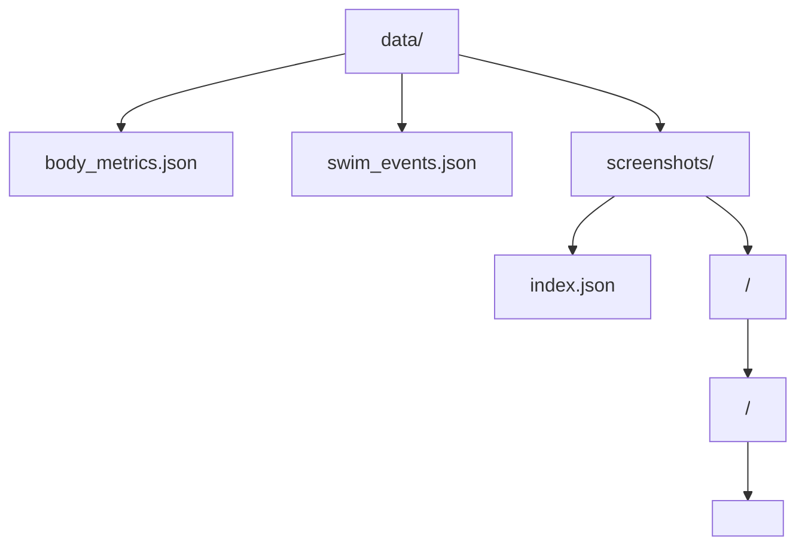
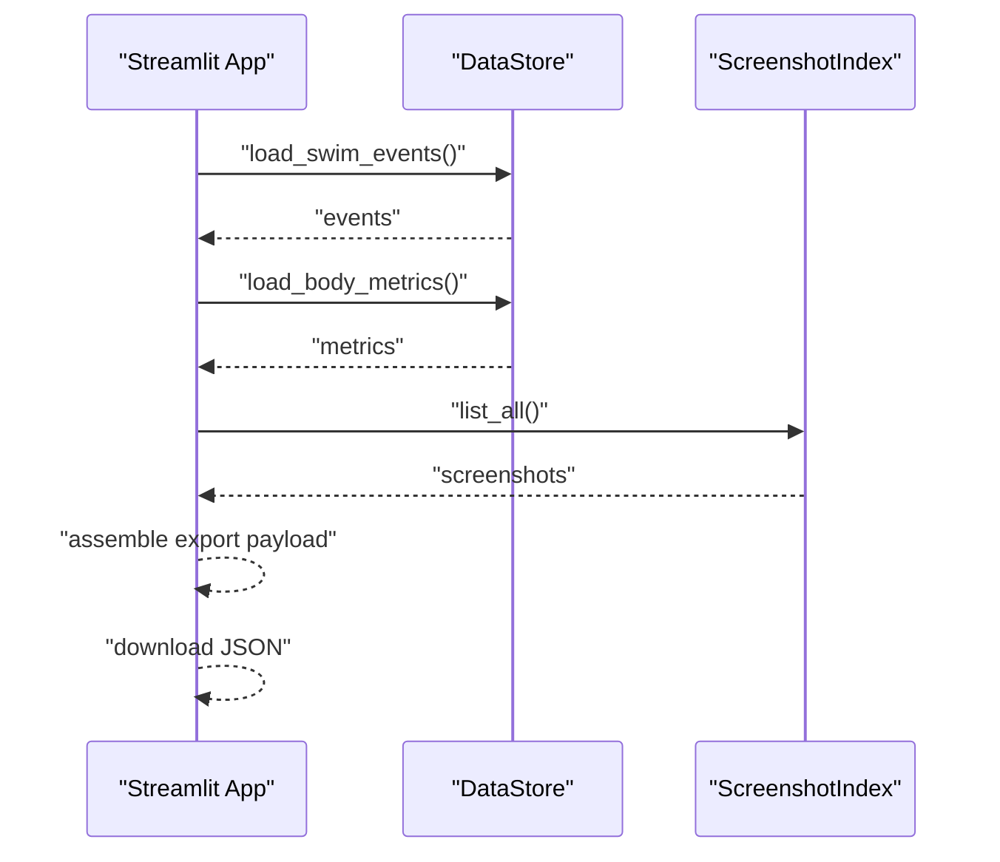
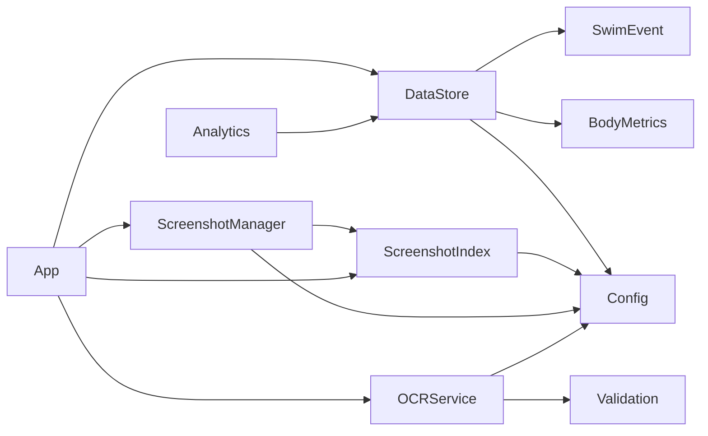

# Data Persistence Layer

<cite>
**Referenced Files in This Document**
- [storage.py](file://src/storage.py)
- [models.py](file://src/models.py)
- [validation.py](file://src/validation.py)
- [config.py](file://src/config.py)
- [screenshot_manager.py](file://src/screenshot_manager.py)
- [ocr_service.py](file://src/ocr_service.py)
- [analytics.py](file://src/analytics.py)
- [app.py](file://app.py)
</cite>

## Table of Contents
1. [Introduction](#introduction)
2. [Project Structure](#project-structure)
3. [Core Components](#core-components)
4. [Architecture Overview](#architecture-overview)
5. [Detailed Component Analysis](#detailed-component-analysis)
6. [Dependency Analysis](#dependency-analysis)
7. [Performance Considerations](#performance-considerations)
8. [Troubleshooting Guide](#troubleshooting-guide)
9. [Conclusion](#conclusion)
10. [Appendices](#appendices)

## Introduction
This document describes the data persistence layer for the Swimming Data Analysis Platform, focusing on JSON-based storage patterns implemented in the storage module. It covers the DataStore class for swim events and body metrics, the ScreenshotIndex class for screenshot metadata management, JSON serialization/deserialization, file naming conventions, directory structure, validation during persistence, error handling, CRUD operations, bulk management, backup/restore, data integrity, and concurrent access considerations.

## Project Structure
The persistence layer is implemented primarily in src/storage.py with supporting models in src/models.py and configuration in src/config.py. The screenshot ingestion pipeline integrates with src/screenshot_manager.py and src/ocr_service.py, while analytics and UI orchestrate data access and export/import.

**Diagram sources**
- [storage.py:10-107](file://src/storage.py#L10-L107)
- [models.py:7-55](file://src/models.py#L7-L55)
- [config.py:10-28](file://src/config.py#L10-L28)
- [screenshot_manager.py:14-136](file://src/screenshot_manager.py#L14-L136)
- [ocr_service.py:12-144](file://src/ocr_service.py#L12-L144)
- [analytics.py:13-184](file://src/analytics.py#L13-L184)
- [app.py:10-447](file://app.py#L10-L447)

**Section sources**
- [storage.py:1-107](file://src/storage.py#L1-L107)
- [config.py:1-29](file://src/config.py#L1-L29)

## Core Components
- DataStore: JSON-backed persistence for swim events and body metrics. Provides load/save/add operations and handles file I/O with robust error handling.
- ScreenshotIndex: Manages a JSON index of screenshot metadata, enabling listing, adding, retrieving by path, and removal by path.
- Models: SwimEvent and BodyMetrics define the data structures and conversion to/from dictionaries for JSON serialization.
- Validation: Utility functions validate time formats, required fields, and swim event data prior to persistence.
- Config: Defines file paths for JSON data files and screenshot index, and regex patterns for time formats.

Key responsibilities:
- DataStore: Load, save, and append swim events and body metrics; serialize/deserialize via to_dict/from_dict.
- ScreenshotIndex: Manage screenshot metadata index with deduplication by checksum and filename checks.
- Integration: App orchestrates upload, OCR extraction, and persistence; analytics consumes persisted data.

**Section sources**
- [storage.py:10-107](file://src/storage.py#L10-L107)
- [models.py:7-55](file://src/models.py#L7-L55)
- [validation.py:7-103](file://src/validation.py#L7-L103)
- [config.py:10-28](file://src/config.py#L10-L28)

## Architecture Overview
The persistence layer follows a simple file-based JSON architecture:
- Swim events and body metrics are stored as separate JSON files.
- Screenshot metadata is stored in a dedicated index file under the screenshots directory.
- Models encapsulate data and provide serialization hooks.
- Validation ensures data integrity before persistence.
- The UI and analytics modules depend on DataStore for data access.

**Diagram sources**
- [app.py:60-127](file://app.py#L60-L127)
- [screenshot_manager.py:26-82](file://src/screenshot_manager.py#L26-L82)
- [ocr_service.py:49-117](file://src/ocr_service.py#L49-L117)
- [storage.py:30-44](file://src/storage.py#L30-L44)
- [storage.py:64-107](file://src/storage.py#L64-L107)

## Detailed Component Analysis

### DataStore: JSON Persistence for Swim Events and Body Metrics
Responsibilities:
- Load swim events and body metrics from JSON files.
- Serialize/deserialize models to/from dictionaries.
- Append new records and persist entire datasets.
- Robust file I/O with graceful error handling.

Implementation highlights:
- Private helpers handle JSON load and save with encoding and indentation.
- Public methods for swim events and body metrics mirror each other:
  - load_* returns typed model instances.
  - save_* serializes models to dictionaries and writes JSON.
  - add_* loads existing list, appends new item, and saves.

**Diagram sources**
- [storage.py:10-62](file://src/storage.py#L10-L62)
- [models.py:7-55](file://src/models.py#L7-L55)

**Section sources**
- [storage.py:10-62](file://src/storage.py#L10-L62)
- [models.py:7-55](file://src/models.py#L7-L55)

### ScreenshotIndex: Metadata Index for Screenshots
Responsibilities:
- Maintain a JSON index of screenshot metadata.
- Add entries with computed checksums and filesystem paths.
- List all screenshots, retrieve by path, and remove by path.
- Provide robust load/save with error handling.

Key behaviors:
- load returns a dictionary with a screenshots list; defaults to empty list if file missing or invalid.
- save creates parent directories and writes JSON with indentation.
- add appends metadata to the index.
- list_all returns the screenshots list.
- get_by_path searches by path.
- remove_by_path filters out entries by path and persists the updated index.

**Diagram sources**
- [storage.py:64-107](file://src/storage.py#L64-L107)

**Section sources**
- [storage.py:64-107](file://src/storage.py#L64-L107)

### JSON Serialization and Deserialization Patterns
- Models expose to_dict and from_dict for seamless JSON conversion.
- DataStore uses list comprehensions to convert between model instances and dictionaries.
- ScreenshotIndex stores arbitrary metadata dictionaries for flexibility.

Validation integration:
- OCRService validates extracted data before saving events.
- Validation utilities enforce time formats and required fields.

**Section sources**
- [models.py:24-46](file://src/models.py#L24-L46)
- [storage.py:30-62](file://src/storage.py#L30-L62)
- [ocr_service.py:106-117](file://src/ocr_service.py#L106-L117)
- [validation.py:75-103](file://src/validation.py#L75-L103)

### File Naming Conventions and Directory Structure
- Data files:
  - body_metrics.json
  - swim_events.json
  - screenshots/index.json
- Paths are defined in config.py and ensure directories exist at startup.
- ScreenshotManager organizes images under screenshots/<meet>/<date>/<filename>, preventing duplicates by filename and checksum.

**Diagram sources**
- [config.py:10-18](file://src/config.py#L10-L18)
- [screenshot_manager.py:26-82](file://src/screenshot_manager.py#L26-L82)

**Section sources**
- [config.py:10-18](file://src/config.py#L10-L18)
- [screenshot_manager.py:26-82](file://src/screenshot_manager.py#L26-L82)

### Data Validation During Persistence Operations
- Time format validation enforces MM:SS.ss or SS.ss formats.
- Required fields validation ensures critical fields are present.
- Swim event validation checks time and split formats.
- OCRService augments extracted data with confidence and error metadata prior to persistence.

**Section sources**
- [validation.py:7-103](file://src/validation.py#L7-L103)
- [ocr_service.py:106-117](file://src/ocr_service.py#L106-L117)

### Error Handling Strategies
- DataStore:
  - _load_json returns an empty list on missing/invalid JSON.
  - _save_json creates parent directories and writes safely.
- ScreenshotIndex:
  - load returns default empty list on missing/invalid JSON.
  - save creates parent directories and writes safely.
- ScreenshotManager:
  - Duplicate detection by filename and checksum prevents redundant storage.
  - On checksum match, the newly saved file is removed and a failure message is returned.
- App-level error handling:
  - Export/restore operations wrap JSON parsing and persistence with try/catch.

**Section sources**
- [storage.py:14-27](file://src/storage.py#L14-L27)
- [storage.py:67-81](file://src/storage.py#L67-L81)
- [screenshot_manager.py:51-82](file://src/screenshot_manager.py#L51-L82)
- [app.py:428-439](file://app.py#L428-L439)

### CRUD Operations and Bulk Management
- Create:
  - DataStore.add_swim_event and add_body_metric append a single record.
  - ScreenshotManager.save_uploaded_screenshot adds a screenshot and metadata.
- Read:
  - DataStore.load_swim_events and load_body_metrics return lists of models.
  - ScreenshotIndex.list_all and get_by_path retrieve metadata.
- Update:
  - DataStore.save_swim_events and save_body_metrics replace entire datasets.
  - ScreenshotIndex.save persists updated metadata.
- Delete:
  - ScreenshotManager.delete_screenshot removes file and updates index.
  - ScreenshotIndex.remove_by_path filters out entries by path.

Bulk management:
- Export/restore via the UI exports swim events, body metrics, and screenshot index as a single JSON payload.
- Restore replaces existing datasets atomically by writing to the respective JSON files.

**Section sources**
- [storage.py:30-62](file://src/storage.py#L30-L62)
- [storage.py:64-107](file://src/storage.py#L64-L107)
- [screenshot_manager.py:84-119](file://src/screenshot_manager.py#L84-L119)
- [app.py:412-439](file://app.py#L412-L439)

### Backup and Restore Mechanisms
- Export:
  - The UI gathers swim events, body metrics, and screenshot index into a dictionary and offers download as JSON.
- Restore:
  - The UI reads uploaded JSON, validates presence of keys, and writes datasets to their respective files.

**Diagram sources**
- [app.py:412-424](file://app.py#L412-L424)
- [storage.py:30-62](file://src/storage.py#L30-L62)
- [storage.py:89-91](file://src/storage.py#L89-L91)

**Section sources**
- [app.py:412-439](file://app.py#L412-L439)

### Relationship Between Persistent Data and In-Memory Data Structures
- Models (SwimEvent, BodyMetrics) are the in-memory representation.
- DataStore converts between in-memory models and JSON dictionaries.
- Analytics and UI operate on in-memory models loaded from JSON files.
- ScreenshotIndex maintains metadata dictionaries for UI gallery and file management.

**Section sources**
- [models.py:7-55](file://src/models.py#L7-L55)
- [storage.py:30-62](file://src/storage.py#L30-L62)
- [analytics.py:17-28](file://src/analytics.py#L17-L28)

### Data Integrity Checks, Transaction-like Operations, and Concurrent Access
- Integrity checks:
  - Validation functions ensure data correctness before persistence.
  - ScreenshotManager detects duplicates by filename and checksum to prevent redundancy.
- Transaction-like semantics:
  - save_swim_events and save_body_metrics write entire datasets atomically in a single JSON dump.
  - remove_by_path filters and writes the updated index in one operation.
- Concurrent access:
  - No explicit locking is implemented; the system relies on atomic file writes and single-writer patterns in the UI.
  - Recommendations for concurrency:
    - Use file locks around critical sections.
    - Implement optimistic concurrency with ETags or version fields.
    - Batch operations to minimize interleaving.

**Section sources**
- [validation.py:75-103](file://src/validation.py#L75-L103)
- [screenshot_manager.py:62-69](file://src/screenshot_manager.py#L62-L69)
- [storage.py:24-27](file://src/storage.py#L24-L27)
- [storage.py:78-81](file://src/storage.py#L78-L81)

## Dependency Analysis
- DataStore depends on:
  - Models for serialization.
  - Config for file paths.
- ScreenshotIndex depends on:
  - Config for index file path.
- ScreenshotManager depends on:
  - ScreenshotIndex for metadata.
  - Config for directories.
- OCRService depends on:
  - Validation for data correctness.
  - Config for API settings.
- App orchestrates:
  - ScreenshotManager, OCRService, DataStore, and ScreenshotIndex.
- Analytics depends on:
  - DataStore for data access.

**Diagram sources**
- [storage.py:6-7](file://src/storage.py#L6-L7)
- [config.py:10-18](file://src/config.py#L10-L18)
- [screenshot_manager.py:10-11](file://src/screenshot_manager.py#L10-L11)
- [ocr_service.py:8-9](file://src/ocr_service.py#L8-L9)
- [analytics.py:8-10](file://src/analytics.py#L8-L10)
- [app.py:10-19](file://app.py#L10-L19)

**Section sources**
- [storage.py:6-7](file://src/storage.py#L6-L7)
- [config.py:10-18](file://src/config.py#L10-L18)
- [screenshot_manager.py:10-11](file://src/screenshot_manager.py#L10-L11)
- [ocr_service.py:8-9](file://src/ocr_service.py#L8-L9)
- [analytics.py:8-10](file://src/analytics.py#L8-L10)
- [app.py:10-19](file://app.py#L10-L19)

## Performance Considerations
- File I/O:
  - JSON load/save operations are O(n) in the number of records.
  - For large datasets, consider pagination or incremental updates.
- Serialization overhead:
  - Using to_dict/from_dict is efficient; avoid unnecessary conversions.
- Deduplication:
  - ScreenshotManager computes checksums; for very large volumes, consider indexing checksums in memory to reduce repeated disk scans.
- UI responsiveness:
  - Export/restore operations serialize large payloads; consider streaming or progress indicators.

[No sources needed since this section provides general guidance]

## Troubleshooting Guide
Common issues and resolutions:
- Missing or corrupted JSON files:
  - DataStore and ScreenshotIndex gracefully return defaults; verify file permissions and paths.
- Duplicate screenshot uploads:
  - Filename and checksum checks prevent duplicates; remove conflicting files and retry.
- Validation failures:
  - Ensure time formats match expected patterns and required fields are present.
- Export/restore errors:
  - Verify uploaded JSON contains expected keys and is well-formed.

**Section sources**
- [storage.py:14-21](file://src/storage.py#L14-L21)
- [storage.py:67-75](file://src/storage.py#L67-L75)
- [screenshot_manager.py:51-69](file://src/screenshot_manager.py#L51-L69)
- [validation.py:7-23](file://src/validation.py#L7-L23)
- [app.py:428-439](file://app.py#L428-L439)

## Conclusion
The data persistence layer uses straightforward JSON files to store swim events, body metrics, and screenshot metadata. It emphasizes simplicity, readability, and resilience through defensive file I/O and validation. While current operations are not transactional, they provide reliable CRUD and bulk management capabilities. For production-scale usage, consider adding concurrency controls, checksum indexing, and incremental updates to improve performance and reliability.

[No sources needed since this section summarizes without analyzing specific files]

## Appendices

### Example Workflows

- Add a swim event:
  - Create a SwimEvent instance.
  - Call DataStore.add_swim_event.
  - Verify persistence by loading events.

- Add body metrics:
  - Create a BodyMetrics instance.
  - Call DataStore.add_body_metric.
  - View history via UI or analytics.

- Upload and process a screenshot:
  - Use ScreenshotManager.save_uploaded_screenshot.
  - Optionally run OCR extraction.
  - Persist validated event via DataStore.

- Export and restore data:
  - Use the UI’s export button to download a JSON bundle.
  - Use the import button to restore datasets.

**Section sources**
- [storage.py:30-62](file://src/storage.py#L30-L62)
- [screenshot_manager.py:26-82](file://src/screenshot_manager.py#L26-L82)
- [app.py:60-127](file://app.py#L60-L127)
- [app.py:412-439](file://app.py#L412-L439)