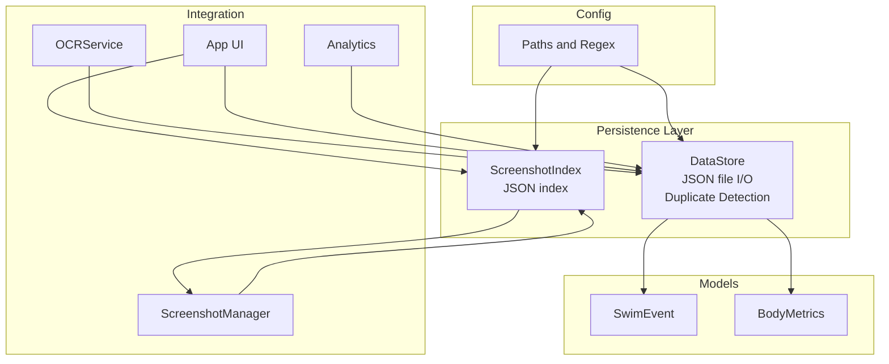
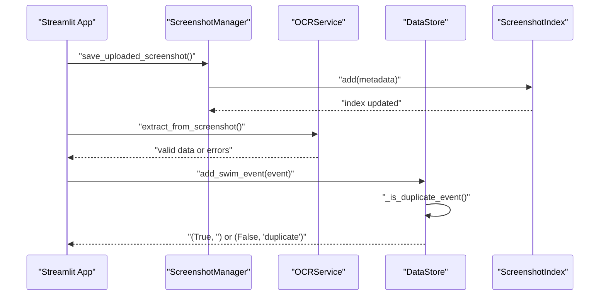
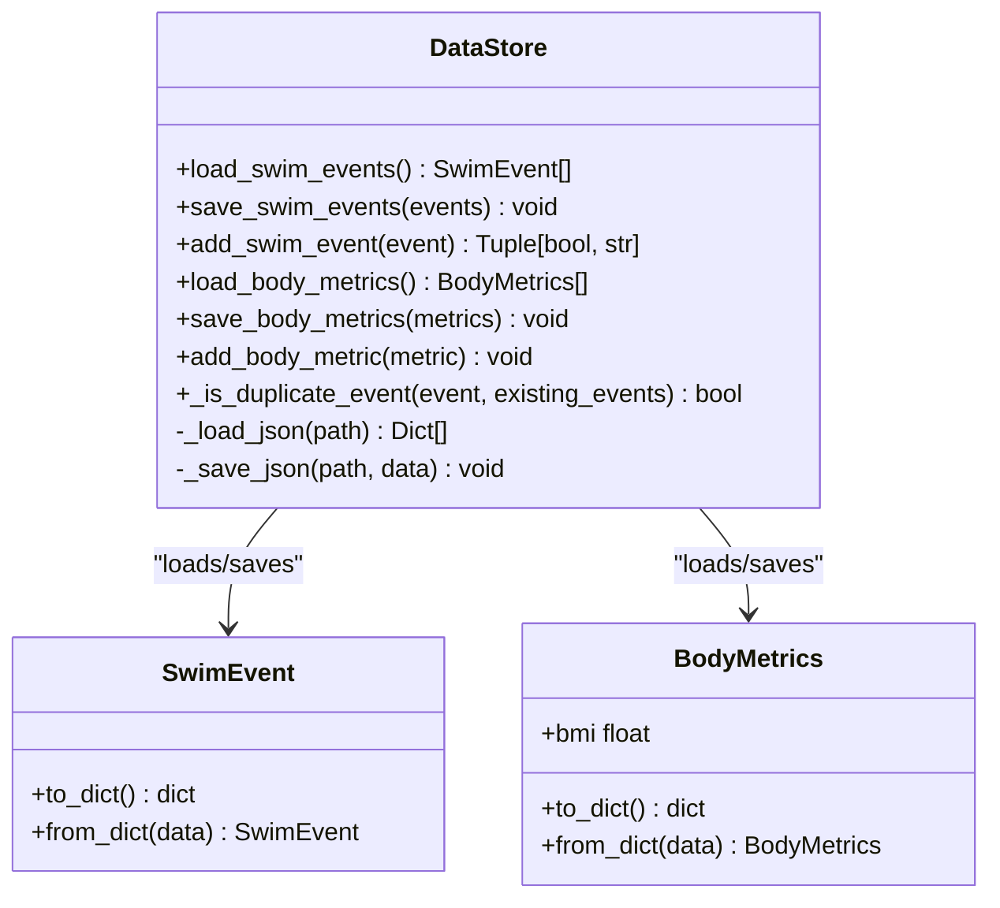
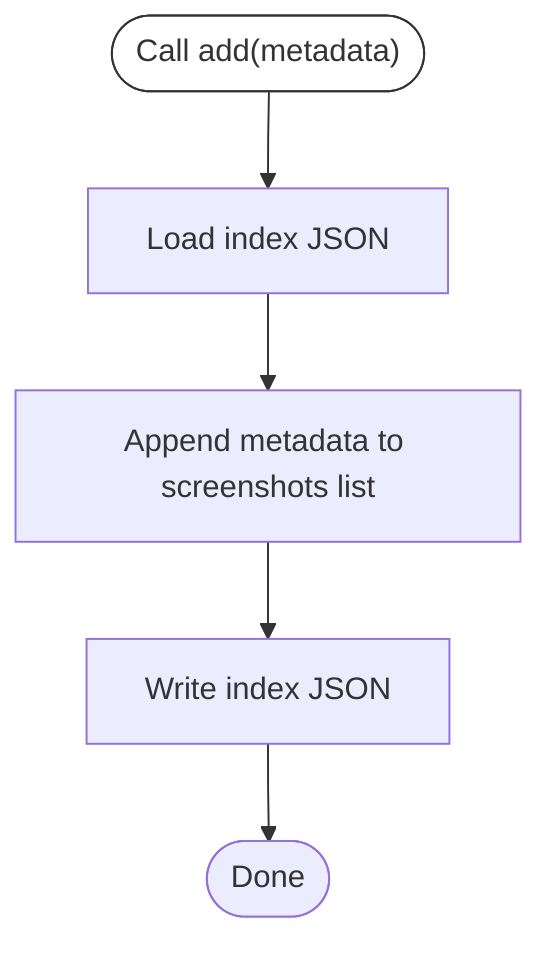
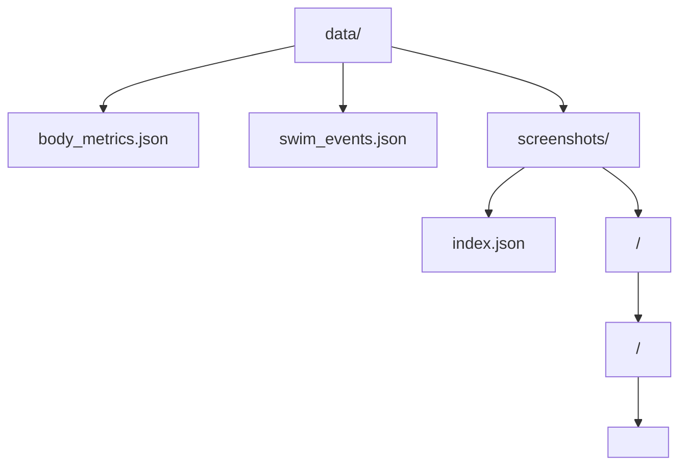
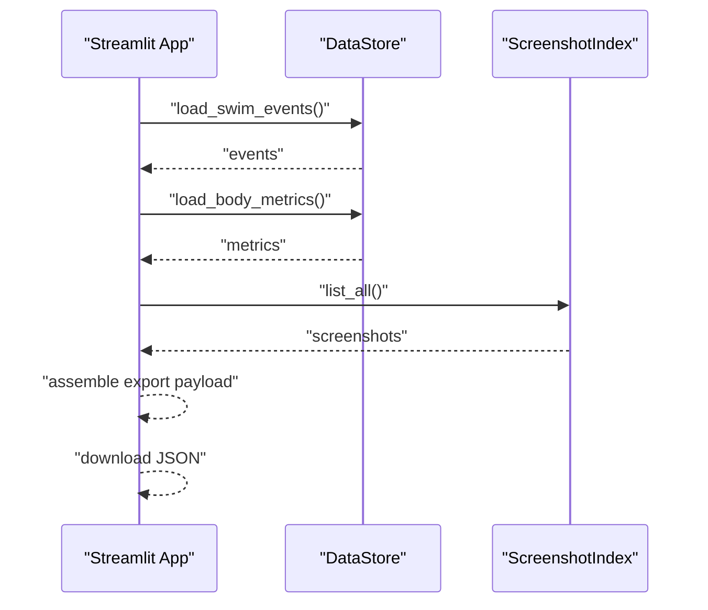
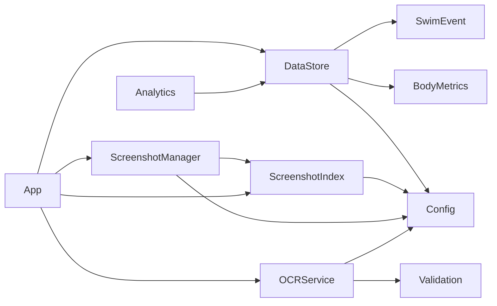

# Data Persistence Layer

<cite>
**Referenced Files in This Document**
- [storage.py](file://src/storage.py)
- [models.py](file://src/models.py)
- [validation.py](file://src/validation.py)
- [config.py](file://src/config.py)
- [screenshot_manager.py](file://src/screenshot_manager.py)
- [ocr_service.py](file://src/ocr_service.py)
- [analytics.py](file://src/analytics.py)
- [app.py](file://app.py)
</cite>

## Update Summary
**Changes Made**
- Updated DataStore.add_swim_event method documentation to reflect new duplicate detection functionality
- Added detailed explanation of _is_duplicate_event() method and its composite key validation logic
- Enhanced data integrity section to include record-level deduplication
- Updated troubleshooting guide to address duplicate record scenarios
- Added new section on duplicate detection criteria and validation rules

## Table of Contents
1. [Introduction](#introduction)
2. [Project Structure](#project-structure)
3. [Core Components](#core-components)
4. [Architecture Overview](#architecture-overview)
5. [Detailed Component Analysis](#detailed-component-analysis)
6. [Dependency Analysis](#dependency-analysis)
7. [Performance Considerations](#performance-considerations)
8. [Troubleshooting Guide](#troubleshooting-guide)
9. [Conclusion](#conclusion)
10. [Appendices](#appendices)

## Introduction
This document describes the data persistence layer for the Swimming Data Analysis Platform, focusing on JSON-based storage patterns implemented in the storage module. It covers the DataStore class for swim events and body metrics, the ScreenshotIndex class for screenshot metadata management, JSON serialization/deserialization, file naming conventions, directory structure, validation during persistence, error handling, CRUD operations, bulk management, backup/restore, data integrity, and concurrent access considerations.

**Updated** Added comprehensive record-level deduplication functionality for swim events with composite key validation across multiple fields.

## Project Structure
The persistence layer is implemented primarily in src/storage.py with supporting models in src/models.py and configuration in src/config.py. The screenshot ingestion pipeline integrates with src/screenshot_manager.py and src/ocr_service.py, while analytics and UI orchestrate data access and export/import.

**Diagram sources**
- [storage.py:14-162](file://src/storage.py#L14-L162)
- [models.py:7-55](file://src/models.py#L7-L55)
- [config.py:10-28](file://src/config.py#L10-L28)
- [screenshot_manager.py:14-136](file://src/screenshot_manager.py#L14-L136)
- [ocr_service.py:12-144](file://src/ocr_service.py#L12-L144)
- [analytics.py:13-184](file://src/analytics.py#L13-L184)
- [app.py:10-447](file://app.py#L10-L447)

**Section sources**
- [storage.py:1-162](file://src/storage.py#L1-L162)
- [config.py:1-29](file://src/config.py#L1-L29)

## Core Components
- DataStore: JSON-backed persistence for swim events and body metrics with record-level deduplication. Provides load/save/add operations with duplicate detection and handles file I/O with robust error handling.
- ScreenshotIndex: Manages a JSON index of screenshot metadata, enabling listing, adding, retrieving by path, and removal by path.
- Models: SwimEvent and BodyMetrics define the data structures and conversion to/from dictionaries for JSON serialization.
- Validation: Utility functions validate time formats, required fields, and swim event data prior to persistence.
- Config: Defines file paths for JSON data files and screenshot index, and regex patterns for time formats.

Key responsibilities:
- DataStore: Load, save, and append swim events and body metrics; serialize/deserialize via to_dict/from_dict; detect and prevent duplicate records.
- ScreenshotIndex: Manage screenshot metadata index with deduplication by checksum and filename checks.
- Integration: App orchestrates upload, OCR extraction, and persistence; analytics consumes persisted data.

**Updated** DataStore now includes intelligent duplicate detection to prevent redundant swim event entries.

**Section sources**
- [storage.py:14-162](file://src/storage.py#L14-L162)
- [models.py:7-55](file://src/models.py#L7-L55)
- [validation.py:7-103](file://src/validation.py#L7-L103)
- [config.py:10-28](file://src/config.py#L10-L28)

## Architecture Overview
The persistence layer follows a simple file-based JSON architecture:
- Swim events and body metrics are stored as separate JSON files.
- Screenshot metadata is stored in a dedicated index file under the screenshots directory.
- Models encapsulate data and provide serialization hooks.
- Validation ensures data integrity before persistence.
- The UI and analytics modules depend on DataStore for data access.
- **Updated** DataStore includes record-level deduplication to prevent duplicate swim event entries.

**Diagram sources**
- [app.py:226](file://app.py#L226)
- [storage.py:59-85](file://src/storage.py#L59-L85)
- [screenshot_manager.py:26-82](file://src/screenshot_manager.py#L26-L82)
- [ocr_service.py:49-117](file://src/ocr_service.py#L49-L117)
- [storage.py:30-44](file://src/storage.py#L30-L44)
- [storage.py:64-107](file://src/storage.py#L64-L107)

## Detailed Component Analysis

### DataStore: JSON Persistence for Swim Events and Body Metrics
Responsibilities:
- Load swim events and body metrics from JSON files.
- Serialize/deserialize models to/from dictionaries.
- Append new records and persist entire datasets.
- **Updated** Detect and prevent duplicate swim event entries using composite key validation.
- Robust file I/O with graceful error handling.

Implementation highlights:
- Private helpers handle JSON load and save with encoding and indentation.
- Public methods for swim events and body metrics mirror each other:
  - load_* returns typed model instances.
  - save_* serializes models to dictionaries and writes JSON.
  - add_* loads existing list, appends new item, and saves.
- **Updated** _is_duplicate_event method performs composite key validation across multiple fields.

**Diagram sources**
- [storage.py:14-162](file://src/storage.py#L14-L162)
- [models.py:7-55](file://src/models.py#L7-L55)

**Section sources**
- [storage.py:14-162](file://src/storage.py#L14-L162)
- [models.py:7-55](file://src/models.py#L7-L55)

### Duplicate Detection and Prevention
**New Section** The DataStore now includes sophisticated duplicate detection to prevent redundant swim event entries.

#### Composite Key Validation Logic
The `_is_duplicate_event()` method performs composite key validation across five critical fields:

1. **Date**: Exact string comparison (`existing.date == event.date`)
2. **Stroke**: Case-insensitive string comparison (`existing.stroke.lower() == event.stroke.lower()`)
3. **Distance**: Exact integer comparison (`int(existing.distance) == int(event.distance)`)
4. **Time**: Exact string comparison (`existing.time == event.time`)
5. **Course**: Case-insensitive string comparison (`existing.course.upper() == event.course.upper()`)

#### Return Values and Behavior
- Returns `(True, "")` when event is successfully added
- Returns `(False, "duplicate")` when duplicate is detected and event is skipped
- Logs detailed information about skipped duplicate events for debugging

#### Usage in UI
The Streamlit application displays different feedback based on the return values:
- Success: "Event saved successfully!"
- Duplicate: "⚠️ Duplicate record skipped — this event already exists."

**Section sources**
- [storage.py:59-85](file://src/storage.py#L59-L85)
- [app.py:226-232](file://app.py#L226-L232)

### ScreenshotIndex: Metadata Index for Screenshots
Responsibilities:
- Maintain a JSON index of screenshot metadata.
- Add entries with computed checksums and filesystem paths.
- List all screenshots, retrieve by path, and remove by path.
- Provide robust load/save with error handling.

Key behaviors:
- load returns a dictionary with a screenshots list; defaults to empty list if file missing or invalid.
- save creates parent directories and writes JSON with indentation.
- add appends metadata to the index.
- list_all returns the screenshots list.
- get_by_path searches by path.
- remove_by_path filters out entries by path and persists the updated index.

**Diagram sources**
- [storage.py:105-162](file://src/storage.py#L105-L162)

**Section sources**
- [storage.py:105-162](file://src/storage.py#L105-L162)

### JSON Serialization and Deserialization Patterns
- Models expose to_dict and from_dict for seamless JSON conversion.
- DataStore uses list comprehensions to convert between model instances and dictionaries.
- ScreenshotIndex stores arbitrary metadata dictionaries for flexibility.

Validation integration:
- OCRService validates extracted data before saving events.
- Validation utilities enforce time formats and required fields.

**Section sources**
- [models.py:24-46](file://src/models.py#L24-L46)
- [storage.py:28-56](file://src/storage.py#L28-L56)
- [ocr_service.py:106-117](file://src/ocr_service.py#L106-L117)
- [validation.py:75-103](file://src/validation.py#L75-L103)

### File Naming Conventions and Directory Structure
- Data files:
  - body_metrics.json
  - swim_events.json
  - screenshots/index.json
- Paths are defined in config.py and ensure directories exist at startup.
- ScreenshotManager organizes images under screenshots/<meet>/<date>/<filename>, preventing duplicates by filename and checksum.

**Diagram sources**
- [config.py:21-24](file://src/config.py#L21-L24)
- [screenshot_manager.py:26-82](file://src/screenshot_manager.py#L26-L82)

**Section sources**
- [config.py:21-24](file://src/config.py#L21-L24)
- [screenshot_manager.py:26-82](file://src/screenshot_manager.py#L26-L82)

### Data Validation During Persistence Operations
- Time format validation enforces MM:SS.ss or SS.ss formats.
- Required fields validation ensures critical fields are present.
- Swim event validation checks time and split formats.
- OCRService augments extracted data with confidence and error metadata prior to persistence.
- **Updated** Duplicate detection prevents redundant swim event entries before persistence.

**Section sources**
- [validation.py:7-103](file://src/validation.py#L7-L103)
- [ocr_service.py:106-117](file://src/ocr_service.py#L106-L117)
- [storage.py:59-85](file://src/storage.py#L59-L85)

### Error Handling Strategies
- DataStore:
  - _load_json returns an empty list on missing/invalid JSON.
  - _save_json creates parent directories and writes safely.
  - **Updated** add_swim_event returns tuple with success status and reason for UI feedback.
- ScreenshotIndex:
  - load returns default empty list on missing/invalid JSON.
  - save creates parent directories and writes safely.
- ScreenshotManager:
  - Duplicate detection by filename and checksum prevents redundant storage.
  - On checksum match, the newly saved file is removed and a failure message is returned.
- App-level error handling:
  - Export/restore operations wrap JSON parsing and persistence with try/catch.
  - **Updated** UI displays appropriate feedback for duplicate detection results.

**Section sources**
- [storage.py:18-45](file://src/storage.py#L18-L45)
- [storage.py:119-136](file://src/storage.py#L119-L136)
- [screenshot_manager.py:51-82](file://src/screenshot_manager.py#L51-L82)
- [app.py:226-232](file://app.py#L226-L232)

### CRUD Operations and Bulk Management
- Create:
  - DataStore.add_swim_event now returns tuple with success status and reason for duplicate detection.
  - DataStore.add_body_metric appends a single record.
  - ScreenshotManager.save_uploaded_screenshot adds a screenshot and metadata.
- Read:
  - DataStore.load_swim_events and load_body_metrics return lists of models.
  - ScreenshotIndex.list_all and get_by_path retrieve metadata.
- Update:
  - DataStore.save_swim_events and save_body_metrics replace entire datasets.
  - ScreenshotIndex.save persists updated metadata.
- Delete:
  - ScreenshotManager.delete_screenshot removes file and updates index.
  - ScreenshotIndex.remove_by_path filters out entries by path.

Bulk management:
- Export/restore via the UI exports swim events, body metrics, and screenshot index as a single JSON payload.
- Restore replaces existing datasets atomically by writing to the respective JSON files.

**Section sources**
- [storage.py:48-102](file://src/storage.py#L48-L102)
- [storage.py:105-162](file://src/storage.py#L105-L162)
- [screenshot_manager.py:84-119](file://src/screenshot_manager.py#L84-L119)
- [app.py:412-439](file://app.py#L412-L439)

### Backup and Restore Mechanisms
- Export:
  - The UI gathers swim events, body metrics, and screenshot index into a dictionary and offers download as JSON.
- Restore:
  - The UI reads uploaded JSON, validates presence of keys, and writes datasets to their respective files.

**Diagram sources**
- [app.py:412-424](file://app.py#L412-L424)
- [storage.py:48-102](file://src/storage.py#L48-L102)
- [storage.py:144-146](file://src/storage.py#L144-L146)

**Section sources**
- [app.py:412-439](file://app.py#L412-L439)

### Relationship Between Persistent Data and In-Memory Data Structures
- Models (SwimEvent, BodyMetrics) are the in-memory representation.
- DataStore converts between in-memory models and JSON dictionaries.
- Analytics and UI operate on in-memory models loaded from JSON files.
- ScreenshotIndex maintains metadata dictionaries for UI gallery and file management.

**Section sources**
- [models.py:7-55](file://src/models.py#L7-L55)
- [storage.py:48-102](file://src/storage.py#L48-L102)
- [analytics.py:17-28](file://src/analytics.py#L17-L28)

### Data Integrity Checks, Transaction-like Operations, and Concurrent Access
- Integrity checks:
  - Validation functions ensure data correctness before persistence.
  - **Updated** Composite key validation prevents duplicate swim event entries.
  - ScreenshotManager detects duplicates by filename and checksum to prevent redundancy.
- Transaction-like semantics:
  - save_swim_events and save_body_metrics write entire datasets atomically in a single JSON dump.
  - remove_by_path filters and writes the updated index in one operation.
- Concurrent access:
  - No explicit locking is implemented; the system relies on atomic file writes and single-writer patterns in the UI.
  - **Updated** Duplicate detection occurs in-memory before persistence to minimize race conditions.
  - Recommendations for concurrency:
    - Use file locks around critical sections.
    - Implement optimistic concurrency with ETags or version fields.
    - Batch operations to minimize interleaving.

**Section sources**
- [validation.py:75-103](file://src/validation.py#L75-L103)
- [screenshot_manager.py:62-69](file://src/screenshot_manager.py#L62-L69)
- [storage.py:59-85](file://src/storage.py#L59-L85)
- [storage.py:28-45](file://src/storage.py#L28-L45)
- [storage.py:139-141](file://src/storage.py#L139-L141)

## Dependency Analysis
- DataStore depends on:
  - Models for serialization.
  - Config for file paths.
  - **Updated** Models for duplicate detection validation.
- ScreenshotIndex depends on:
  - Config for index file path.
- ScreenshotManager depends on:
  - ScreenshotIndex for metadata.
  - Config for directories.
- OCRService depends on:
  - Validation for data correctness.
  - Config for API settings.
- App orchestrates:
  - ScreenshotManager, OCRService, DataStore, and ScreenshotIndex.
  - **Updated** Handles duplicate detection feedback from DataStore.
- Analytics depends on:
  - DataStore for data access.

**Diagram sources**
- [storage.py:8](file://src/storage.py#L8)
- [config.py:21-24](file://src/config.py#L21-L24)
- [screenshot_manager.py:10](file://src/screenshot_manager.py#L10)
- [ocr_service.py:8](file://src/ocr_service.py#L8)
- [analytics.py:8](file://src/analytics.py#L8)
- [app.py:10](file://app.py#L10)

**Section sources**
- [storage.py:8](file://src/storage.py#L8)
- [config.py:21-24](file://src/config.py#L21-L24)
- [screenshot_manager.py:10](file://src/screenshot_manager.py#L10)
- [ocr_service.py:8](file://src/ocr_service.py#L8)
- [analytics.py:8](file://src/analytics.py#L8)
- [app.py:10](file://app.py#L10)

## Performance Considerations
- File I/O:
  - JSON load/save operations are O(n) in the number of records.
  - For large datasets, consider pagination or incremental updates.
- Serialization overhead:
  - Using to_dict/from_dict is efficient; avoid unnecessary conversions.
- Deduplication:
  - **Updated** _is_duplicate_event performs O(n) comparison across existing events.
  - For very large datasets, consider indexing by composite keys in memory to reduce repeated comparisons.
  - ScreenshotManager computes checksums; for very large volumes, consider indexing checksums in memory to reduce repeated disk scans.
- UI responsiveness:
  - Export/restore operations serialize large payloads; consider streaming or progress indicators.
  - **Updated** Duplicate detection adds minimal overhead but prevents unnecessary file I/O.

## Troubleshooting Guide
Common issues and resolutions:
- Missing or corrupted JSON files:
  - DataStore and ScreenshotIndex gracefully return defaults; verify file permissions and paths.
- Duplicate screenshot uploads:
  - Filename and checksum checks prevent duplicates; remove conflicting files and retry.
- **Updated** Duplicate swim event detection:
  - Events are considered duplicates if all five composite keys match exactly.
  - Stroke and course fields are compared case-insensitively; distance is compared as integers.
  - Date and time fields are compared exactly; distance must be positive integer.
- Validation failures:
  - Ensure time formats match expected patterns and required fields are present.
- Export/restore errors:
  - Verify uploaded JSON contains expected keys and is well-formed.

**Section sources**
- [storage.py:18-26](file://src/storage.py#L18-L26)
- [storage.py:119-127](file://src/storage.py#L119-L127)
- [screenshot_manager.py:51-69](file://src/screenshot_manager.py#L51-L69)
- [storage.py:59-85](file://src/storage.py#L59-L85)
- [validation.py:7-23](file://src/validation.py#L7-L23)
- [app.py:428-439](file://app.py#L428-L439)

## Conclusion
The data persistence layer uses straightforward JSON files to store swim events, body metrics, and screenshot metadata. It emphasizes simplicity, readability, and resilience through defensive file I/O and validation. **Updated** The addition of record-level deduplication significantly improves data integrity by preventing duplicate swim event entries through composite key validation. While current operations are not transactional, they provide reliable CRUD and bulk management capabilities with intelligent duplicate prevention. For production-scale usage, consider adding concurrency controls, checksum indexing, and incremental updates to improve performance and reliability.

## Appendices

### Example Workflows

- Add a swim event:
  - Create a SwimEvent instance.
  - Call DataStore.add_swim_event.
  - **Updated** Handle return tuple: `(added, reason)` where `added` indicates success and `reason` indicates duplicate if applicable.
  - Verify persistence by loading events.

- Add body metrics:
  - Create a BodyMetrics instance.
  - Call DataStore.add_body_metric.
  - View history via UI or analytics.

- Upload and process a screenshot:
  - Use ScreenshotManager.save_uploaded_screenshot.
  - Optionally run OCR extraction.
  - Persist validated event via DataStore.

- Export and restore data:
  - Use the UI's export button to download a JSON bundle.
  - Use the import button to restore datasets.

- **Updated** Duplicate detection workflow:
  - User attempts to add swim event via OCR or manual form.
  - DataStore.checks for duplicates using composite key validation.
  - UI displays appropriate feedback based on duplicate detection result.
  - Success: Event saved; Failure: Duplicate skipped with warning message.

**Section sources**
- [storage.py:48-102](file://src/storage.py#L48-L102)
- [storage.py:59-85](file://src/storage.py#L59-L85)
- [screenshot_manager.py:26-82](file://src/screenshot_manager.py#L26-L82)
- [app.py:226-232](file://app.py#L226-L232)
- [app.py:412-439](file://app.py#L412-L439)