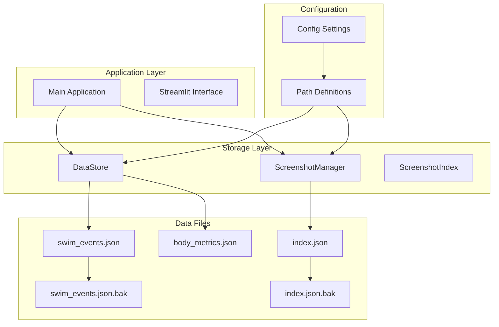
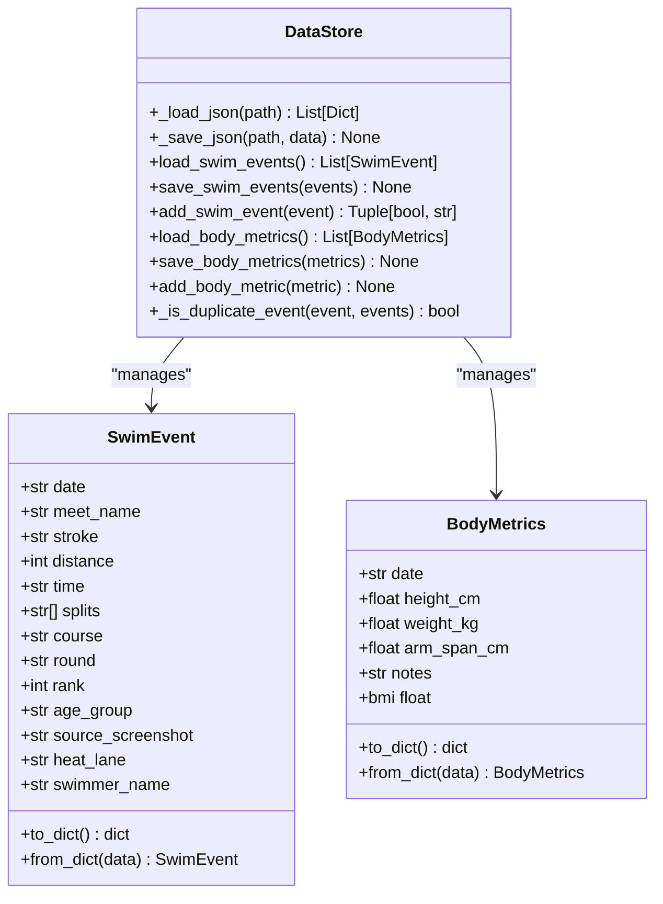
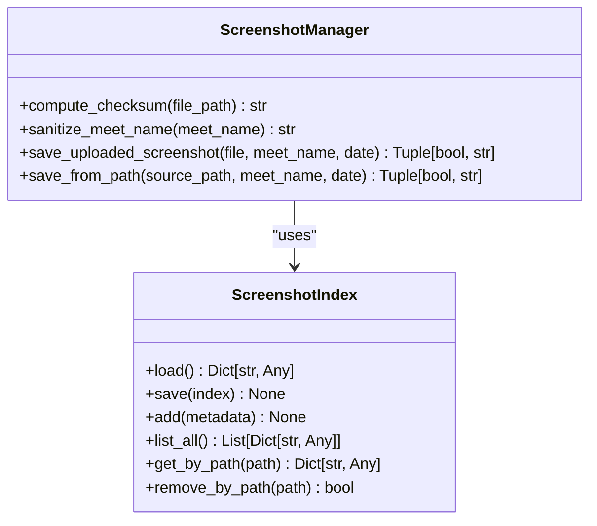
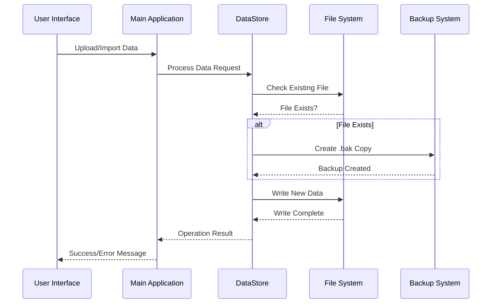
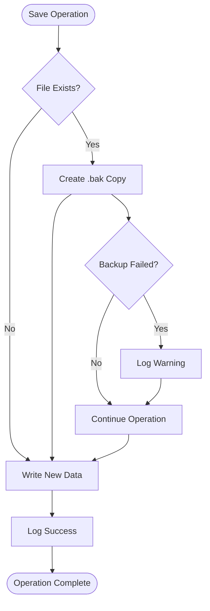
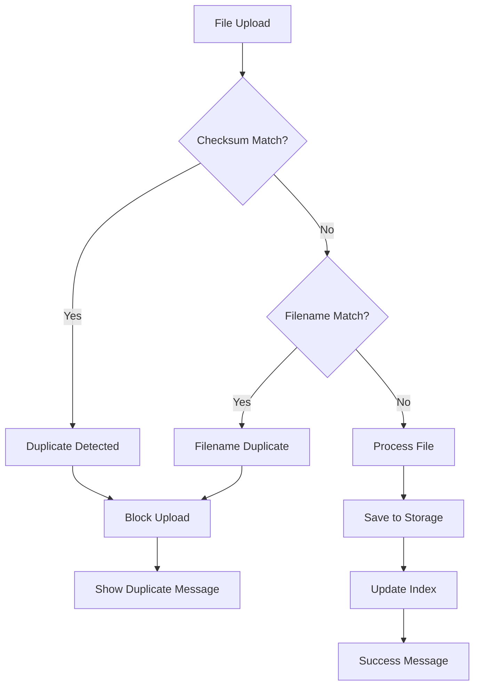

# Backup Dataset Management

<cite>
**Referenced Files in This Document**
- [app.py](file://app.py)
- [storage.py](file://src/storage.py)
- [screenshot_manager.py](file://src/screenshot_manager.py)
- [config.py](file://src/config.py)
- [models.py](file://src/models.py)
- [validation.py](file://src/validation.py)
- [swim_events.json](file://data/swim_events.json)
- [swim_events.json.bak](file://data/swim_events.json.bak)
- [body_metrics.json](file://data/body_metrics.json)
- [index.json.bak](file://data/screenshots/index.json.bak)
</cite>

## Table of Contents
1. [Introduction](#introduction)
2. [Project Structure](#project-structure)
3. [Core Components](#core-components)
4. [Architecture Overview](#architecture-overview)
5. [Backup System Implementation](#backup-system-implementation)
6. [Dataset Management](#dataset-management)
7. [Data Integrity and Validation](#data-integrity-and-validation)
8. [Troubleshooting Guide](#troubleshooting-guide)
9. [Best Practices](#best-practices)
10. [Conclusion](#conclusion)

## Introduction

The Backup Dataset Management system is a comprehensive data persistence solution designed for the Sunny's Swimming Analytics Platform. This system ensures reliable storage, retrieval, and protection of swimming performance data through automatic backup mechanisms, duplicate detection, and structured data management.

The platform handles three primary data types: swim event records, body metrics measurements, and screenshot metadata. Each dataset is protected with automatic backup creation, ensuring data safety and recovery capabilities. The system employs checksum-based duplicate detection, structured file organization, and robust error handling to maintain data integrity.

## Project Structure

The backup dataset management system is organized around three core data domains within the application architecture:

**Diagram sources**
- [app.py:140-570](file://app.py#L140-L570)
- [storage.py:14-162](file://src/storage.py#L14-L162)
- [screenshot_manager.py:15-172](file://src/screenshot_manager.py#L15-L172)

**Section sources**
- [app.py:1-1213](file://app.py#L1-L1213)
- [config.py:1-49](file://src/config.py#L1-L49)

## Core Components

### DataStore Class

The DataStore class serves as the central persistence layer, implementing automatic backup creation and data serialization for both swim events and body metrics.

**Diagram sources**
- [storage.py:14-103](file://src/storage.py#L14-L103)
- [models.py:7-55](file://src/models.py#L7-L55)

### Screenshot Management System

The screenshot management system provides organized storage with duplicate detection and metadata tracking:

**Diagram sources**
- [screenshot_manager.py:15-172](file://src/screenshot_manager.py#L15-L172)
- [storage.py:105-162](file://src/storage.py#L105-L162)

**Section sources**
- [storage.py:1-162](file://src/storage.py#L1-L162)
- [screenshot_manager.py:1-172](file://src/screenshot_manager.py#L1-L172)
- [models.py:1-55](file://src/models.py#L1-L55)

## Architecture Overview

The backup dataset management system follows a layered architecture with clear separation of concerns:

**Diagram sources**
- [storage.py:28-45](file://src/storage.py#L28-L45)
- [app.py:160-324](file://app.py#L160-L324)

The architecture ensures atomic operations with automatic backup creation before data modification, providing robust recovery capabilities.

## Backup System Implementation

### Automatic Backup Creation

The backup system implements automatic backup creation through the `_save_json` method, which creates `.bak` files before writing new data:

**Diagram sources**
- [storage.py:28-45](file://src/storage.py#L28-L45)

### Backup File Naming Convention

The system uses a consistent naming convention for backup files:
- Original: `swim_events.json`
- Backup: `swim_events.json.bak`
- Screenshot Index: `index.json` → `index.json.bak`

### Backup Verification and Recovery

Backup files serve as recovery points for data corruption or accidental modifications. The system maintains both data files and their corresponding backup files, enabling quick restoration when needed.

**Section sources**
- [storage.py:28-45](file://src/storage.py#L28-L45)
- [swim_events.json.bak:1-800](file://data/swim_events.json.bak#L1-L800)
- [index.json.bak:1-200](file://data/screenshots/index.json.bak#L1-L200)

## Dataset Management

### Swim Events Dataset

The swim events dataset manages competitive swimming performance records with comprehensive metadata:

| Field | Type | Description | Example |
|-------|------|-------------|---------|
| date | String | ISO date format (YYYY-MM-DD) | "2026-05-02" |
| meet_name | String | Competition name | "Speedo Invitational" |
| stroke | String | Swimming discipline | "freestyle" |
| distance | Integer | Distance in meters | 100 |
| time | String | Performance time | "1:01.04" |
| splits | Array | Split times | ["29.92", "31.12"] |
| course | String | Pool length (LC/SC) | "LC" |
| round | String | Competition stage | "final" |
| rank | Integer | Placement position | 1 |
| age_group | String | Competitor category | "10&O" |
| source_screenshot | String | File path reference | "data/screenshots/..." |
| heat_lane | String | Starting position | "H12 L8" |
| swimmer_name | String | Athlete name | "Meng Han Zhou" |

### Body Metrics Dataset

The body metrics dataset tracks physical measurements over time for performance analysis:

| Field | Type | Description | Range |
|-------|------|-------------|-------|
| date | String | Measurement date | YYYY-MM-DD |
| height_cm | Float | Physical height | 50-250 cm |
| weight_kg | Float | Body weight | 10-200 kg |
| arm_span_cm | Float | Arm measurement | 50-250 cm |
| notes | String | Additional observations | Free text |

### Screenshot Metadata Dataset

The screenshot metadata dataset maintains organized file references with duplicate detection:

| Field | Type | Description |
|-------|------|-------------|
| path | String | Relative file path |
| original_filename | String | Original file name |
| meet_name | String | Competition name |
| date | String | Event date |
| uploaded_at | String | Timestamp (ISO format) |
| checksum | String | MD5 hash for duplicate detection |
| size_bytes | Integer | File size in bytes |

**Section sources**
- [models.py:7-55](file://src/models.py#L7-L55)
- [swim_events.json:1-200](file://data/swim_events.json#L1-L200)
- [body_metrics.json:1-9](file://data/body_metrics.json#L1-L9)

## Data Integrity and Validation

### Duplicate Detection System

The system implements multiple layers of duplicate detection to prevent data redundancy:

**Diagram sources**
- [screenshot_manager.py:85-90](file://src/screenshot_manager.py#L85-L90)

### Data Validation Pipeline

The validation system ensures data quality through multiple validation stages:

1. **Format Validation**: Time format verification (MM:SS.ss or SS.ss)
2. **Type Validation**: Field type checking and constraints
3. **Content Validation**: Business rule validation (positive distances, valid dates)
4. **OCR Extraction Validation**: Partial data handling and manual correction support

### Error Handling and Logging

The system implements comprehensive error handling with detailed logging for debugging and monitoring:

- **Critical Errors**: JSON decode failures, file system errors
- **Warning Messages**: Backup creation failures, duplicate detections
- **Informational Logs**: Successful operations, data processing steps

**Section sources**
- [validation.py:1-203](file://src/validation.py#L1-L203)
- [screenshot_manager.py:85-90](file://src/screenshot_manager.py#L85-L90)

## Troubleshooting Guide

### Common Issues and Solutions

| Issue | Symptoms | Solution |
|-------|----------|----------|
| Backup Creation Failed | Missing .bak files | Check file permissions, disk space availability |
| Duplicate Detection Errors | Upload blocked unexpectedly | Verify checksum calculation, check existing index |
| Data Corruption | JSON parsing errors | Restore from .bak files, verify file integrity |
| Memory Issues | Large dataset loading failures | Implement pagination, optimize data structures |

### Recovery Procedures

1. **Automatic Recovery**: System automatically attempts to load from backup files
2. **Manual Restoration**: Replace corrupted files with .bak copies
3. **Data Migration**: Transfer data between backup versions when needed

### Performance Optimization

- **Batch Operations**: Process multiple files in batches to reduce I/O overhead
- **Memory Management**: Stream large files instead of loading entirely into memory
- **Index Optimization**: Maintain efficient lookup structures for metadata

**Section sources**
- [storage.py:18-26](file://src/storage.py#L18-L26)
- [screenshot_manager.py:18-25](file://src/screenshot_manager.py#L18-L25)

## Best Practices

### Data Organization

- **Consistent Naming**: Use standardized naming conventions for all files
- **Hierarchical Structure**: Organize screenshots by meet and date
- **Metadata Management**: Maintain comprehensive metadata for all datasets

### Backup Strategy

- **Regular Backups**: Automatic backup creation before data modification
- **Multiple Copies**: Maintain both current and backup files
- **Verification**: Regular verification of backup file integrity

### Security Considerations

- **File Permissions**: Restrict write access to data directories
- **Checksum Validation**: Use MD5 hashes for data integrity verification
- **Access Control**: Limit access to sensitive performance data

### Monitoring and Maintenance

- **Logging**: Comprehensive logging for all operations
- **Health Checks**: Regular validation of data file integrity
- **Performance Monitoring**: Track system performance and resource usage

## Conclusion

The Backup Dataset Management system provides a robust foundation for data persistence in the Sunny's Swimming Analytics Platform. Through automatic backup creation, comprehensive duplicate detection, and structured data management, the system ensures data integrity, reliability, and recoverability.

Key strengths of the system include:

- **Automated Protection**: Seamless backup creation prevents data loss
- **Integrity Assurance**: Multi-layered validation prevents data corruption
- **Scalable Architecture**: Modular design supports future expansion
- **User-Friendly Interface**: Streamlined data management through the web interface

The system successfully balances functionality with reliability, providing swimming coaches and athletes with confidence in their data management while maintaining the flexibility needed for evolving analytical requirements.