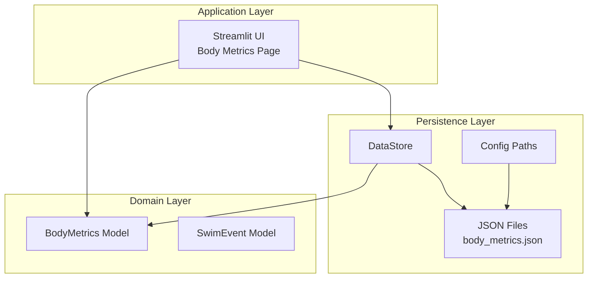
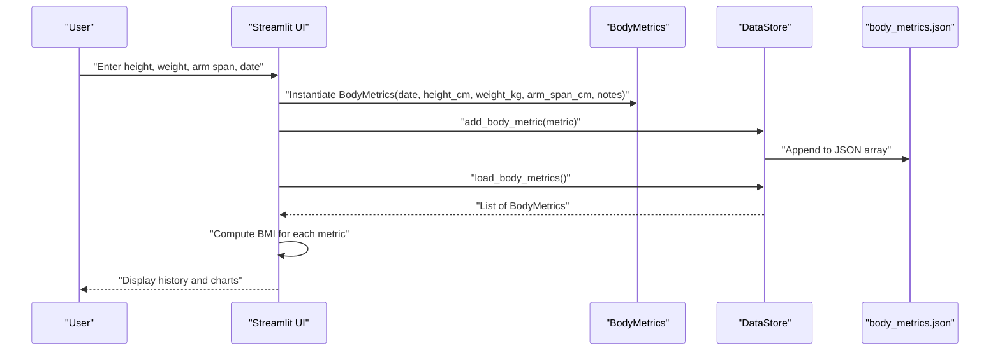
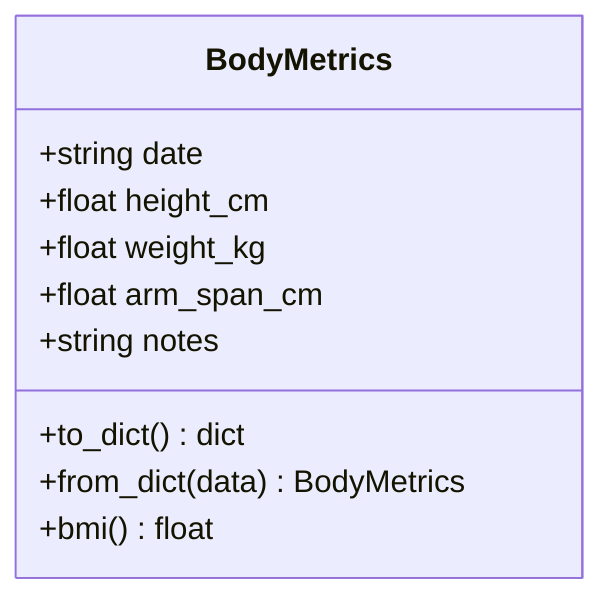
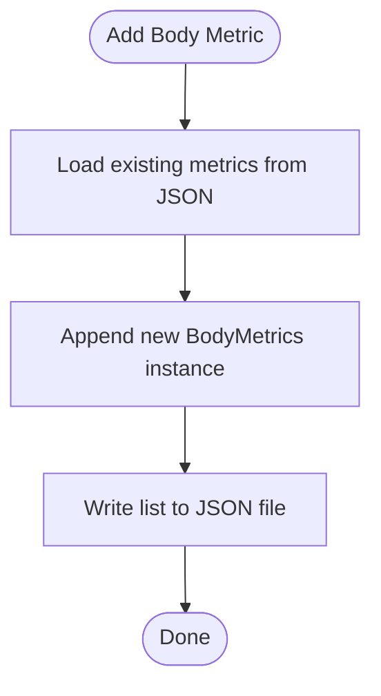
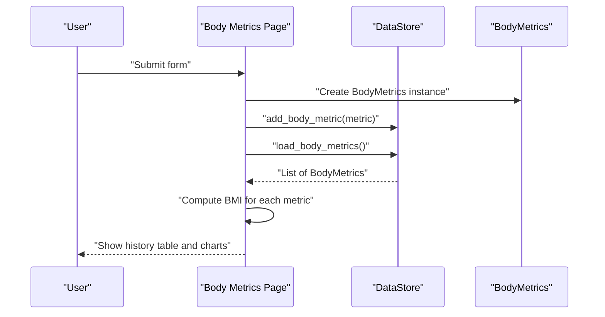
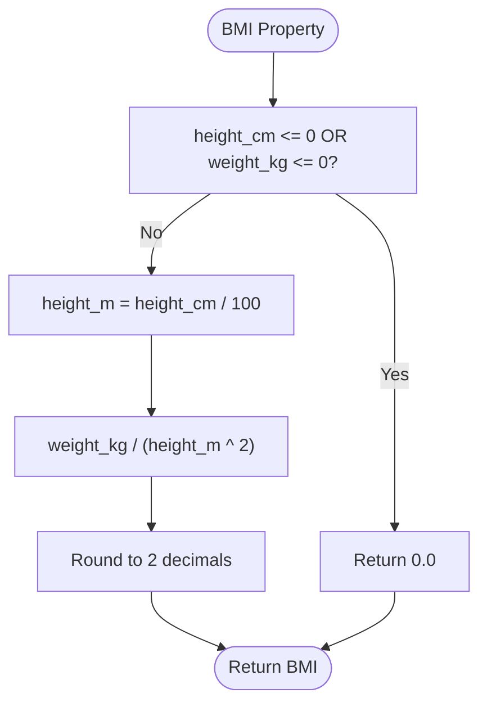
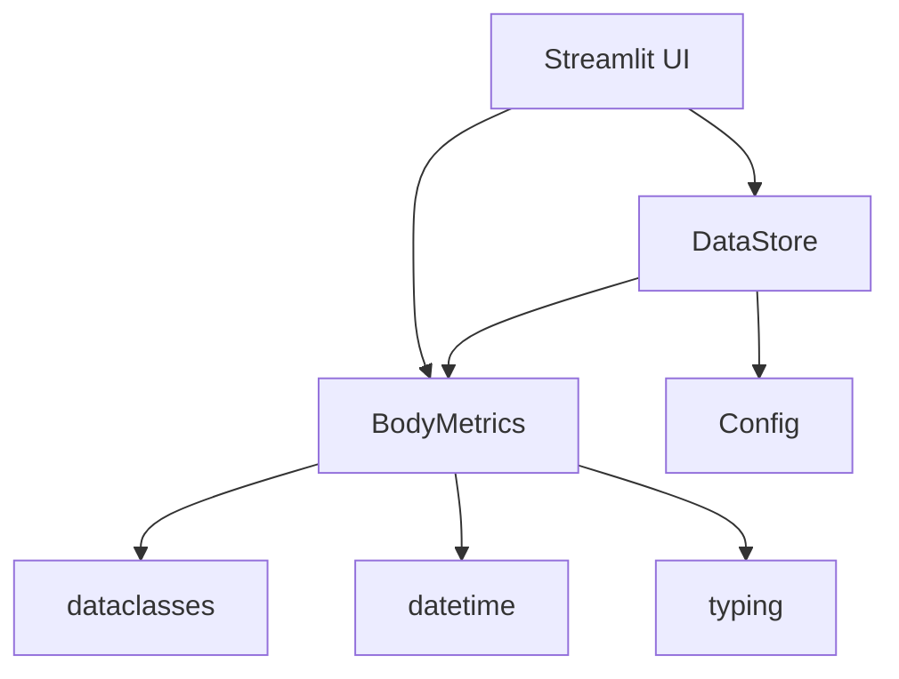

# BodyMetrics Model

<cite>
**Referenced Files in This Document**
- [models.py](file://src/models.py)
- [storage.py](file://src/storage.py)
- [config.py](file://src/config.py)
- [app.py](file://app.py)
- [spec.md](file://openspec/changes/sunny-swim-analysis-platform/specs/body-metrics-tracking/spec.md)
- [validation.py](file://src/validation.py)
</cite>

## Table of Contents
1. [Introduction](#introduction)
2. [Project Structure](#project-structure)
3. [Core Components](#core-components)
4. [Architecture Overview](#architecture-overview)
5. [Detailed Component Analysis](#detailed-component-analysis)
6. [Dependency Analysis](#dependency-analysis)
7. [Performance Considerations](#performance-considerations)
8. [Troubleshooting Guide](#troubleshooting-guide)
9. [Conclusion](#conclusion)
10. [Appendices](#appendices)

## Introduction
This document provides comprehensive documentation for the BodyMetrics data model used in the swimming analytics platform. It covers field definitions, BMI calculation logic, serialization patterns, temporal tracking for monitoring physical development, and practical usage examples. It also explains how anthropometric measurements relate to swimming performance analysis and how metrics change over time to inform training recommendations.

## Project Structure
The BodyMetrics model is part of the core data models and integrates with the storage layer and UI components to support manual input, persistence, and visualization of body metrics.

**Diagram sources**
- [app.py:168-223](file://app.py#L168-L223)
- [models.py:32-55](file://src/models.py#L32-L55)
- [storage.py:46-62](file://src/storage.py#L46-L62)
- [config.py:10-14](file://src/config.py#L10-L14)

**Section sources**
- [models.py:1-55](file://src/models.py#L1-L55)
- [storage.py:1-107](file://src/storage.py#L1-L107)
- [config.py:1-29](file://src/config.py#L1-L29)
- [app.py:168-223](file://app.py#L168-L223)

## Core Components
- BodyMetrics: Represents anthropometric measurements at a point in time with date, height, weight, arm span, and notes. Provides BMI calculation and serialization helpers.
- DataStore: Persists and loads BodyMetrics to/from JSON files.
- Config: Defines the path to the body metrics JSON file.
- Streamlit UI: Provides a form for manual input and visualization of metrics and BMI over time.

Key responsibilities:
- Data capture and validation (UI form)
- Persistence (JSON file)
- Calculation (BMI)
- Visualization (line charts for height, weight, BMI)

**Section sources**
- [models.py:32-55](file://src/models.py#L32-L55)
- [storage.py:46-62](file://src/storage.py#L46-L62)
- [config.py:10-14](file://src/config.py#L10-L14)
- [app.py:168-223](file://app.py#L168-L223)

## Architecture Overview
The BodyMetrics model participates in a straightforward pipeline:
- UI captures user input and constructs a BodyMetrics instance.
- DataStore persists the instance to a JSON file.
- UI loads persisted metrics and computes BMI for visualization.
- Analytics and Q&A services can reference the latest metrics for insights.

**Diagram sources**
- [app.py:174-194](file://app.py#L174-L194)
- [models.py:32-55](file://src/models.py#L32-L55)
- [storage.py:46-62](file://src/storage.py#L46-L62)
- [config.py:10-14](file://src/config.py#L10-L14)

## Detailed Component Analysis

### BodyMetrics Model
The BodyMetrics dataclass encapsulates anthropometric measurements and provides:
- Field definitions with types and defaults
- Serialization helpers (to_dict/from_dict)
- BMI calculation property with edge-case handling

Field definitions:
- date: string in ISO format (YYYY-MM-DD)
- height_cm: float (default 0.0)
- weight_kg: float (default 0.0)
- arm_span_cm: float (default 0.0)
- notes: string (default empty)

BMI calculation property:
- Formula: BMI = weight_kg / (height_m)^2, where height_m = height_cm / 100
- Edge case handling: Returns 0.0 when either height_cm <= 0 or weight_kg <= 0

Serialization patterns:
- to_dict: Converts the instance to a dictionary representation
- from_dict: Reconstructs an instance from a dictionary

Temporal tracking:
- date enables ordering metrics chronologically
- UI displays progression charts for height, weight, and BMI over time

**Diagram sources**
- [models.py:32-55](file://src/models.py#L32-L55)

**Section sources**
- [models.py:32-55](file://src/models.py#L32-L55)

### Data Persistence and Loading
DataStore manages JSON persistence for BodyMetrics:
- load_body_metrics: Reads JSON file and converts entries to BodyMetrics instances
- save_body_metrics: Serializes BodyMetrics instances to JSON
- add_body_metric: Appends a new metric to the existing list and saves

The JSON file path is defined in Config and defaults to data/body_metrics.json.

**Diagram sources**
- [storage.py:46-62](file://src/storage.py#L46-L62)
- [config.py:10-14](file://src/config.py#L10-L14)

**Section sources**
- [storage.py:46-62](file://src/storage.py#L46-L62)
- [config.py:10-14](file://src/config.py#L10-L14)

### UI Integration and Visualization
The Streamlit UI provides:
- A form to capture date, height, weight, arm span, and notes
- Instantiation of BodyMetrics and saving via DataStore
- Loading metrics, computing BMI, and rendering line charts for height, weight, and BMI over time

**Diagram sources**
- [app.py:168-223](file://app.py#L168-L223)
- [models.py:32-55](file://src/models.py#L32-L55)
- [storage.py:46-62](file://src/storage.py#L46-L62)

**Section sources**
- [app.py:168-223](file://app.py#L168-L223)

### BMI Calculation Logic
The BMI property implements:
- Input validation: returns 0.0 if height_cm <= 0 or weight_kg <= 0
- Unit conversion: height_cm to meters by dividing by 100
- Formula: weight_kg divided by square of height_m
- Rounding: result rounded to two decimal places

Edge cases handled:
- Zero or negative height_cm or weight_kg yield BMI = 0.0
- Non-positive values prevent division by zero and invalid results

**Diagram sources**
- [models.py:48-54](file://src/models.py#L48-L54)

**Section sources**
- [models.py:48-54](file://src/models.py#L48-L54)

### Serialization Patterns (to_dict/from_dict)
- to_dict: Uses dataclass asdict to serialize the instance to a dictionary
- from_dict: Reconstructs a BodyMetrics instance from a dictionary

These patterns enable:
- Seamless persistence to JSON
- Easy conversion for UI rendering and analytics

**Section sources**
- [models.py:41-46](file://src/models.py#L41-L46)
- [storage.py:46-62](file://src/storage.py#L46-L62)

### Temporal Tracking and Monitoring
- date field enables chronological ordering of metrics
- UI loads metrics, converts date strings to datetime, and sorts for display
- Line charts visualize trends for height, weight, and BMI over time
- This temporal tracking supports monitoring physical development and identifying changes that may influence training recommendations

**Section sources**
- [app.py:196-223](file://app.py#L196-L223)

### Examples of Model Instantiation and Usage
- Manual input form creates BodyMetrics with date in ISO format, height_cm, weight_kg, arm_span_cm, and notes
- DataStore.add_body_metric persists the instance
- DataStore.load_body_metrics retrieves all metrics for visualization
- UI computes BMI for each metric and renders charts

Practical scenarios:
- Recording baseline measurements before a training cycle
- Tracking changes during a periodized training phase
- Comparing metrics across different seasons or competitions

**Section sources**
- [app.py:174-194](file://app.py#L174-L194)
- [storage.py:46-62](file://src/storage.py#L46-L62)
- [app.py:196-223](file://app.py#L196-L223)

### Data Validation Workflows
While BodyMetrics itself does not include explicit validation, the UI enforces numeric ranges for height, weight, and arm span. The broader validation utilities in the project focus on swimming event data (time formats, required fields). For BodyMetrics, the primary validation is implicit through the UI constraints and the BMI property’s edge-case handling.

**Section sources**
- [app.py:176-181](file://app.py#L176-L181)
- [validation.py:62-102](file://src/validation.py#L62-L102)

### Relationship Between Anthropometric Measurements and Swimming Performance
Anthropometric characteristics can influence swimming biomechanics and efficiency:
- Height and arm span: May affect stroke length and reach
- Weight: Can influence buoyancy and mass distribution
- BMI: Provides a general indicator of leanness or mass relative to height

Training implications:
- Changes in BMI over time may reflect shifts in muscle mass versus fat mass
- Monitoring height and arm span helps assess growth-related changes in stroke mechanics
- Weight fluctuations can impact drag and propulsion balance

The platform surfaces BMI alongside historical metrics to facilitate trend analysis and inform training recommendations.

**Section sources**
- [app.py:201-223](file://app.py#L201-L223)
- [models.py:48-54](file://src/models.py#L48-L54)

## Dependency Analysis
The BodyMetrics model depends on:
- dataclasses for serialization helpers
- datetime for date handling
- typing for type hints

Integration points:
- UI form constructs BodyMetrics and persists via DataStore
- DataStore reads/writes JSON files located via Config
- UI computes BMI for visualization

**Diagram sources**
- [models.py:1-55](file://src/models.py#L1-L55)
- [storage.py:1-107](file://src/storage.py#L1-L107)
- [config.py:1-29](file://src/config.py#L1-L29)
- [app.py:168-223](file://app.py#L168-L223)

**Section sources**
- [models.py:1-55](file://src/models.py#L1-L55)
- [storage.py:1-107](file://src/storage.py#L1-L107)
- [config.py:1-29](file://src/config.py#L1-L29)
- [app.py:168-223](file://app.py#L168-L223)

## Performance Considerations
- BMI computation is O(n) for n metrics due to property evaluation per instance
- JSON I/O is efficient for small-to-medium datasets typical in personal tracking
- UI rendering uses pandas DataFrame operations; sorting and plotting are lightweight for typical usage

Recommendations:
- For large datasets, consider indexing by date and caching computed BMI values
- Batch operations for bulk uploads can reduce repeated file writes

[No sources needed since this section provides general guidance]

## Troubleshooting Guide
Common issues and resolutions:
- Missing or invalid date format: Ensure date is provided in ISO format (YYYY-MM-DD)
- Zero or negative values: BMI returns 0.0 for non-positive height or weight; enter valid positive values
- JSON read/write failures: Verify file permissions and path correctness; DataStore handles missing files gracefully by returning empty lists
- UI input constraints: Use the provided numeric inputs with sensible ranges

Validation and error handling:
- UI enforces numeric ranges for height, weight, and arm span
- BMI property guards against invalid inputs by returning 0.0
- DataStore catches JSON decode errors and IO errors, returning empty structures

**Section sources**
- [app.py:176-181](file://app.py#L176-L181)
- [models.py:48-54](file://src/models.py#L48-L54)
- [storage.py:14-27](file://src/storage.py#L14-L27)

## Conclusion
The BodyMetrics model provides a focused, robust foundation for capturing and analyzing anthropometric data. Its integration with the UI, persistence layer, and visualization pipeline enables effective temporal tracking of physical development. The BMI calculation property offers immediate insight while handling edge cases safely. Together with the broader analytics and Q&A services, BodyMetrics contributes valuable context for informed training decisions.

[No sources needed since this section summarizes without analyzing specific files]

## Appendices

### Field Reference
- date: ISO format string (YYYY-MM-DD)
- height_cm: float (centimeters)
- weight_kg: float (kilograms)
- arm_span_cm: float (centimeters)
- notes: string (free-form comments)

**Section sources**
- [models.py:35-39](file://src/models.py#L35-L39)

### BMI Calculation Formula
- BMI = weight_kg / (height_m)^2
- height_m = height_cm / 100
- Edge case: BMI = 0.0 if height_cm <= 0 or weight_kg <= 0

**Section sources**
- [models.py:48-54](file://src/models.py#L48-L54)

### Persistence and File Location
- JSON file path: data/body_metrics.json (defined in Config)
- Operations: load_body_metrics, save_body_metrics, add_body_metric

**Section sources**
- [config.py:10-14](file://src/config.py#L10-L14)
- [storage.py:46-62](file://src/storage.py#L46-L62)

### UI Form Fields and Behavior
- Inputs: date, height_cm, weight_kg, arm_span_cm, notes
- Submission: creates BodyMetrics and saves via DataStore
- Visualization: charts for height, weight, BMI over time

**Section sources**
- [app.py:174-194](file://app.py#L174-L194)
- [app.py:196-223](file://app.py#L196-L223)