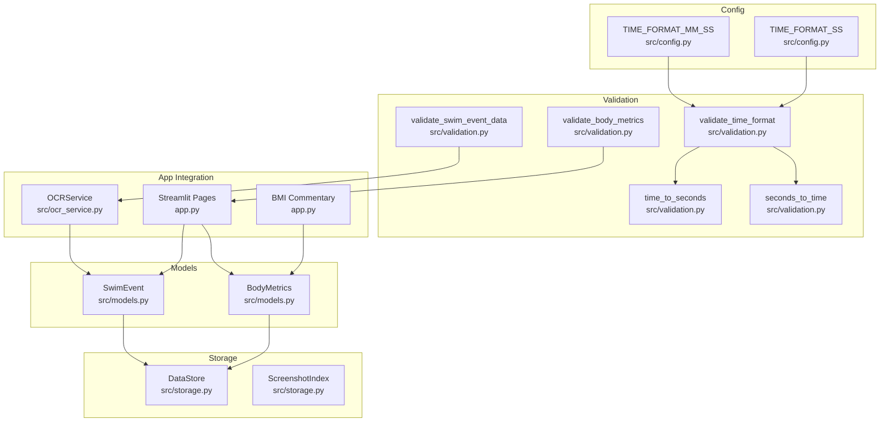
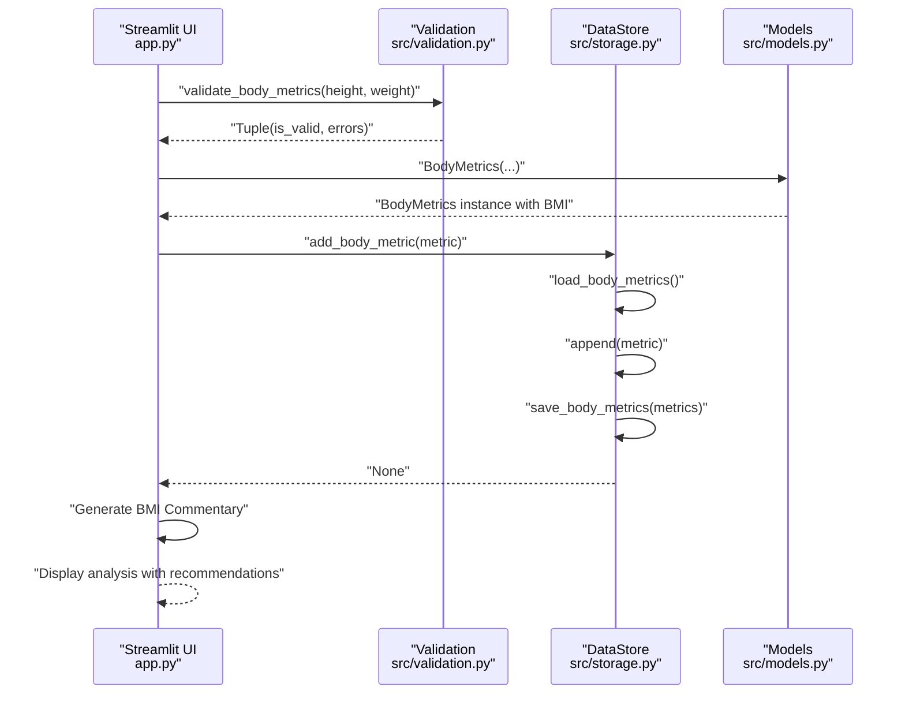
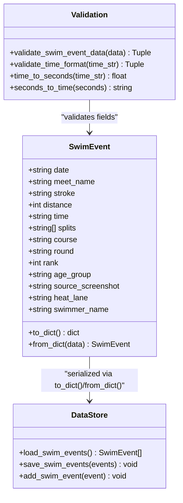
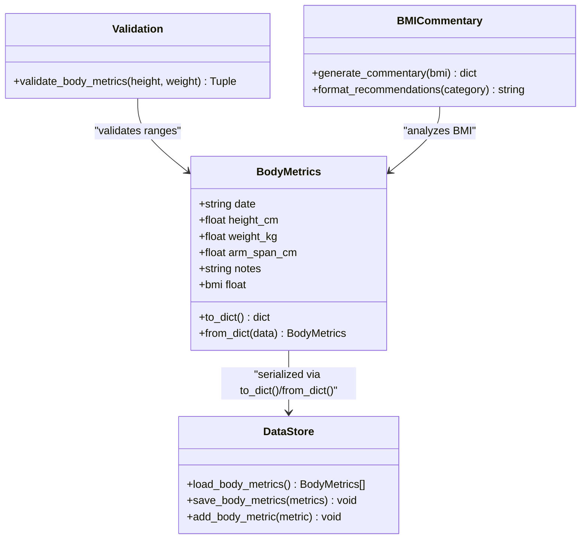
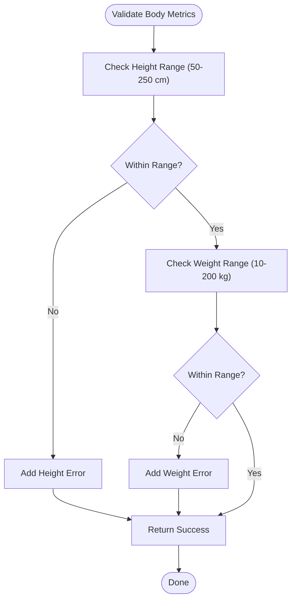
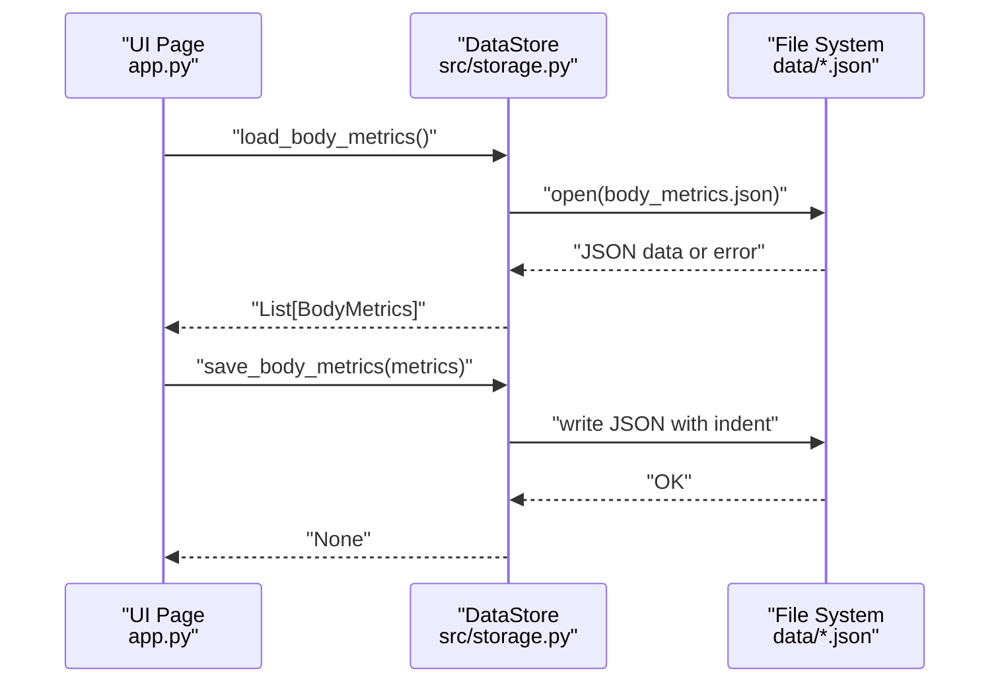
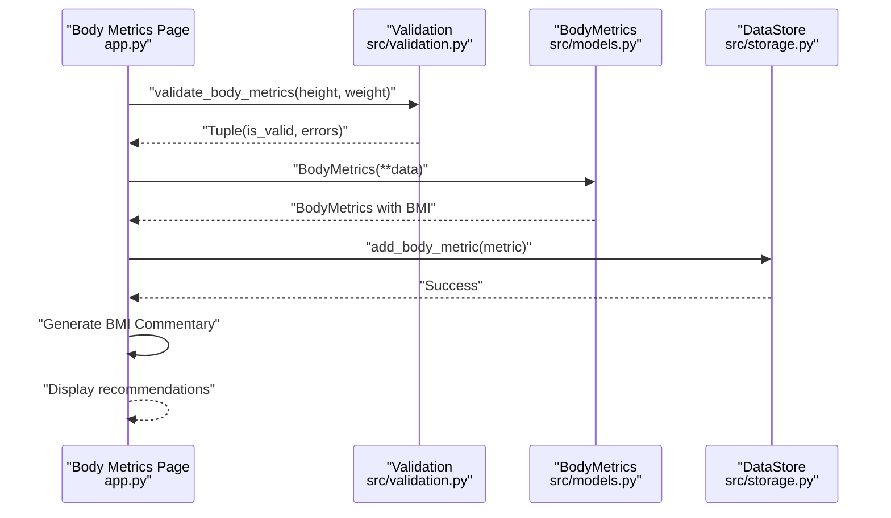
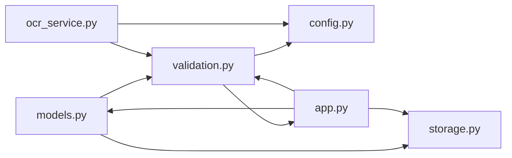

# Data Models

<cite>
**Referenced Files in This Document**
- [models.py](file://src/models.py)
- [validation.py](file://src/validation.py)
- [storage.py](file://src/storage.py)
- [config.py](file://src/config.py)
- [ocr_service.py](file://src/ocr_service.py)
- [app.py](file://app.py)
- [README.md](file://README.md)
</cite>

## Update Summary
**Changes Made**
- Enhanced BodyMetrics model with BMI commentary functionality in the application UI
- Added comprehensive body metrics validation with reasonable range checking
- Improved data validation for body metrics analysis with specific constraints
- Updated BMI calculation logic with enhanced commentary system

## Table of Contents
1. [Introduction](#introduction)
2. [Project Structure](#project-structure)
3. [Core Components](#core-components)
4. [Architecture Overview](#architecture-overview)
5. [Detailed Component Analysis](#detailed-component-analysis)
6. [Dependency Analysis](#dependency-analysis)
7. [Performance Considerations](#performance-considerations)
8. [Troubleshooting Guide](#troubleshooting-guide)
9. [Conclusion](#conclusion)
10. [Appendices](#appendices)

## Introduction
This document provides comprehensive data model documentation for the Swimming Data Analysis Platform. It focuses on two primary models:
- SwimEvent: captures race results, timing, splits, and related metadata
- BodyMetrics: captures anthropometric measurements and derived metrics with enhanced BMI commentary functionality

It explains field definitions, data types, constraints, business rules, validation utilities, type safety mechanisms, serialization patterns for JSON storage and retrieval, and practical examples of instantiation, validation workflows, and data transformation processes. It also outlines data integrity measures and error handling strategies for invalid inputs.

## Project Structure
The data models are implemented in a dedicated module and integrated with validation utilities, a JSON-based storage layer, and application pages that instantiate and persist these models with enhanced BMI analysis capabilities.

**Diagram sources**
- [models.py:1-55](file://src/models.py#L1-L55)
- [validation.py:1-203](file://src/validation.py#L1-L203)
- [storage.py:1-166](file://src/storage.py#L1-L166)
- [config.py:26-29](file://src/config.py#L26-L29)
- [ocr_service.py:12-144](file://src/ocr_service.py#L12-L144)
- [app.py:1-1468](file://app.py#L1-L1468)

**Section sources**
- [README.md:50-57](file://README.md#L50-L57)
- [models.py:1-55](file://src/models.py#L1-L55)
- [storage.py:10-62](file://src/storage.py#L10-L62)
- [validation.py:7-102](file://src/validation.py#L7-L203)
- [config.py:26-29](file://src/config.py#L26-L29)
- [ocr_service.py:49-116](file://src/ocr_service.py#L49-L116)
- [app.py:97-113](file://app.py#L97-L113)

## Core Components
This section documents the SwimEvent and BodyMetrics models, their fields, types, defaults, and business rules.

- SwimEvent
  - Purpose: Represents a single swimming event result with associated metadata.
  - Fields and Types:
    - date: str (ISO format: YYYY-MM-DD)
    - meet_name: str
    - stroke: str (allowed values: freestyle, backstroke, breaststroke, butterfly, IM)
    - distance: int (in meters: 50, 100, 200, 400, 800, 1500)
    - time: str (MM:SS.ss or SS.ss format)
    - splits: List[str] (default: empty list)
    - course: str (default: empty string; allowed values: LC, SC)
    - round: str (default: empty string; allowed values: heat, semifinal, final)
    - rank: int (default: 0)
    - age_group: str (default: empty string)
    - source_screenshot: str (default: empty string; path to source screenshot)
    - heat_lane: str (default: empty string; e.g., "H3 L4")
    - swimmer_name: str (default: "Sunny")
  - Business Rules:
    - Required fields for validation: date, meet_name, stroke, distance, time.
    - time and splits must conform to MM:SS.ss or SS.ss format.
    - course and round are free-text with typical values LC/SC and heat/semifinal/final respectively.
    - rank is numeric; non-positive values are treated as unknown.
    - splits are optional; when present, each must be a valid time string.
  - Serialization:
    - to_dict(): returns a dictionary representation suitable for JSON.
    - from_dict(): constructs a SwimEvent from a dictionary.

- BodyMetrics
  - Purpose: Represents body measurements at a point in time with derived BMI and enhanced analysis capabilities.
  - Fields and Types:
    - date: str (ISO format: YYYY-MM-DD)
    - height_cm: float (default: 0.0)
    - weight_kg: float (default: 0.0)
    - arm_span_cm: float (default: 0.0)
    - notes: str (default: empty string)
  - Computed Property:
    - bmi: float; calculated as weight (kg) / (height (m))^2, rounded to two decimals; returns 0.0 if either height or weight is non-positive.
  - Business Rules:
    - Non-negative numeric values are expected; negative values are treated as missing.
    - BMI is computed only when both height and weight are positive.
    - Enhanced validation ensures reasonable ranges: height 50-250 cm, weight 10-200 kg.
  - Serialization:
    - to_dict(): returns a dictionary representation suitable for JSON.
    - from_dict(): constructs a BodyMetrics from a dictionary.

**Section sources**
- [models.py:7-30](file://src/models.py#L7-L30)
- [models.py:32-55](file://src/models.py#L32-L55)
- [README.md:50-57](file://README.md#L50-L57)

## Architecture Overview
The data model layer integrates with validation utilities and a JSON-based storage layer. The application pages orchestrate model instantiation, persistence, and enhanced BMI analysis with commentary functionality.

**Diagram sources**
- [app.py:766-851](file://app.py#L766-L851)
- [validation.py:184-202](file://src/validation.py#L184-L202)
- [storage.py:92-106](file://src/storage.py#L92-L106)
- [models.py:32-55](file://src/models.py#L32-L55)

## Detailed Component Analysis

### SwimEvent Model
- Structure and Relationships
  - SwimEvent is a dataclass with explicit fields and defaults.
  - Provides to_dict() and from_dict() for JSON serialization and deserialization.
  - Used by DataStore for persistence and by UI pages for rendering and analytics.

- Field Definitions and Constraints
  - Required fields validated during ingestion: date, meet_name, stroke, distance, time.
  - Time and splits validated against regex patterns for MM:SS.ss or SS.ss.
  - Optional fields include course, round, rank, age_group, source_screenshot, heat_lane, swimmer_name.

- Type Safety Mechanisms
  - Type hints define expected types for each field.
  - Defaults ensure safe initialization for optional fields.
  - Validation utilities enforce format correctness before persistence.

- Serialization Patterns
  - JSON storage uses list of dictionaries; each SwimEvent is serialized via to_dict().
  - Deserialization uses from_dict() to reconstruct instances.

- Example Instantiation and Workflows
  - From OCR extraction: UI constructs SwimEvent from extracted data and persists via DataStore.
  - Manual entry: UI collects inputs and creates SwimEvent, then saves.

- Data Transformation
  - Time normalization: time_to_seconds() converts MM:SS.ss or SS.ss to seconds for analytics.
  - Reverse conversion: seconds_to_time() formats seconds back to displayable time strings.

**Diagram sources**
- [models.py:7-30](file://src/models.py#L7-L30)
- [storage.py:48-90](file://src/storage.py#L48-L90)
- [validation.py:102-129](file://src/validation.py#L102-L129)

**Section sources**
- [models.py:7-30](file://src/models.py#L7-L30)
- [validation.py:7-24](file://src/validation.py#L7-L24)
- [validation.py:26-60](file://src/validation.py#L26-L60)
- [validation.py:102-129](file://src/validation.py#L102-L129)
- [storage.py:48-90](file://src/storage.py#L48-L90)
- [app.py:97-113](file://app.py#L97-L113)

### BodyMetrics Model
- Structure and Relationships
  - BodyMetrics is a dataclass capturing anthropometric measurements.
  - Provides to_dict() and from_dict() for JSON serialization and deserialization.
  - Computed property bmi returns a derived metric based on height and weight.
  - Enhanced with BMI commentary functionality in the application UI.

- Field Definitions and Constraints
  - date: ISO date string.
  - height_cm, weight_kg, arm_span_cm: numeric values; defaults to zero.
  - notes: optional textual notes.
  - BMI computation requires positive height and weight; otherwise returns 0.0.
  - Enhanced validation ensures reasonable ranges: height 50-250 cm, weight 10-200 kg.

- Type Safety Mechanisms
  - Type hints ensure numeric types for height, weight, and arm span.
  - Defaults prevent uninitialized values.
  - BMI property guards against division by zero and invalid inputs.
  - Validation utilities enforce reasonable value ranges.

- Serialization Patterns
  - Stored as list of dictionaries; BodyMetrics serialized via to_dict().
  - Deserialized via from_dict().

- Enhanced BMI Commentary Functionality
  - Application generates contextual analysis based on BMI categories.
  - Provides sport-specific recommendations considering muscle composition.
  - Displays color-coded categories with actionable insights.

- Example Instantiation and Workflows
  - UI collects height, weight, arm span, and notes; constructs BodyMetrics and persists.
  - BMI commentary generated automatically from latest measurements.

- Data Transformation
  - BMI is computed on demand; no persistent derived field is stored.
  - Enhanced validation ensures data quality before analysis.

**Diagram sources**
- [models.py:32-55](file://src/models.py#L32-L55)
- [validation.py:184-202](file://src/validation.py#L184-L202)
- [storage.py:92-106](file://src/storage.py#L92-L106)
- [app.py:812-851](file://app.py#L812-L851)

**Section sources**
- [models.py:32-55](file://src/models.py#L32-L55)
- [validation.py:184-202](file://src/validation.py#L184-L202)
- [storage.py:92-106](file://src/storage.py#L92-L106)
- [app.py:766-851](file://app.py#L766-L851)

### Enhanced Validation Utilities
- Time Format Validation
  - validate_time_format(): checks MM:SS.ss or SS.ss using regex patterns defined in config.
  - Returns a tuple of (is_valid, error_message).

- Numeric and Structural Validation
  - validate_swim_event_data(): ensures required fields are present and non-empty, validates time and splits.
  - Returns a tuple of (is_valid, error_messages).

- Enhanced Body Metrics Validation
  - validate_body_metrics(): validates height and weight are within reasonable ranges (50-250 cm, 10-200 kg).
  - Returns a tuple of (is_valid, list_of_errors) for UI validation.

- Conversion Utilities
  - time_to_seconds(): converts time string to total seconds.
  - seconds_to_time(): converts seconds to time string in MM:SS.ss or SS.ss.

- Integration
  - UI pages use validate_body_metrics() for real-time validation.
  - OCRService uses validate_swim_event_data() to validate extracted data.
  - Both validation systems ensure data integrity before persistence.

**Diagram sources**
- [validation.py:184-202](file://src/validation.py#L184-L202)

**Section sources**
- [validation.py:7-24](file://src/validation.py#L7-L24)
- [validation.py:26-60](file://src/validation.py#L26-L60)
- [validation.py:62-73](file://src/validation.py#L62-L73)
- [validation.py:102-129](file://src/validation.py#L102-L129)
- [validation.py:184-202](file://src/validation.py#L184-L202)
- [config.py:26-29](file://src/config.py#L26-L29)
- [ocr_service.py:107](file://src/ocr_service.py#L107)

### Storage Layer
- DataStore
  - Loads and saves SwimEvent and BodyMetrics collections as JSON arrays.
  - Uses to_dict() for serialization and from_dict() for deserialization.
  - Handles file creation and encoding; gracefully returns empty lists on errors.

- ScreenshotIndex
  - Manages screenshot metadata index as JSON.
  - Supports loading, saving, adding entries, listing, and removal by path.

- Persistence Patterns
  - Files are stored under the data/ directory as defined in config.
  - Ensures parent directories exist before writing.

**Diagram sources**
- [storage.py:18-27](file://src/storage.py#L18-L27)
- [storage.py:92-106](file://src/storage.py#L92-L106)
- [storage.py:109-166](file://src/storage.py#L109-L166)

**Section sources**
- [storage.py:10-62](file://src/storage.py#L10-L62)
- [storage.py:64-107](file://src/storage.py#L64-L107)
- [config.py:10-14](file://src/config.py#L10-L14)

### Application Integration
- Enhanced BMI Analysis and Commentary
  - Body Metrics page generates contextual analysis based on BMI categories.
  - Provides sport-specific recommendations considering muscle composition and training demands.
  - Displays color-coded categories with actionable insights for swimmers.

- Validation and UI Integration
  - Real-time validation using validate_body_metrics() prevents invalid data entry.
  - BMI commentary appears automatically when valid measurements are available.
  - Enhanced user experience with immediate feedback and recommendations.

- OCR Extraction and Validation
  - OCRService extracts structured data from screenshots and validates it using validate_swim_event_data().
  - Adds extraction confidence and error metadata to the result.

- UI Pages
  - Upload page: constructs SwimEvent from OCR output and persists.
  - Body Metrics page: constructs BodyMetrics from user inputs, validates ranges, persists, and generates BMI commentary.
  - Analytics page: loads SwimEvent data for visualization and analysis.
  - Data export/import: serializes/deserializes models for backup/restore.

**Diagram sources**
- [app.py:766-851](file://app.py#L766-L851)
- [validation.py:184-202](file://src/validation.py#L184-L202)
- [models.py:32-55](file://src/models.py#L32-L55)
- [storage.py:92-106](file://src/storage.py#L92-L106)

**Section sources**
- [app.py:766-851](file://app.py#L766-L851)
- [ocr_service.py:49-116](file://src/ocr_service.py#L49-L116)
- [validation.py:102-129](file://src/validation.py#L102-L129)
- [storage.py:48-90](file://src/storage.py#L48-L90)
- [models.py:24-29](file://src/models.py#L24-L29)

## Dependency Analysis
- SwimEvent depends on:
  - dataclasses (asdict) for serialization
  - typing (Optional, List) for type hints
  - datetime.date for type annotation (not used at runtime)
- BodyMetrics depends on:
  - dataclasses (asdict) for serialization
  - typing (Optional) for type hints
- Enhanced Validation depends on:
  - re for regex patterns
  - datetime for date validation
  - config.TIME_FORMAT_MM_SS and TIME_FORMAT_SS
- Storage depends on:
  - json for serialization
  - pathlib.Path for file paths
  - models for type-aware serialization
  - config for file paths
- Enhanced App Integration depends on:
  - pandas for data analysis and visualization
  - streamlit for UI components and state management
  - validation for data validation
  - config for API settings

**Diagram sources**
- [models.py:1-55](file://src/models.py#L1-L55)
- [validation.py:1-203](file://src/validation.py#L1-L203)
- [storage.py:1-166](file://src/storage.py#L1-L166)
- [config.py:1-29](file://src/config.py#L1-L29)
- [ocr_service.py:1-144](file://src/ocr_service.py#L1-L144)
- [app.py:1-1468](file://app.py#L1-L1468)

**Section sources**
- [models.py:1-55](file://src/models.py#L1-L55)
- [validation.py:1-203](file://src/validation.py#L1-L203)
- [storage.py:1-166](file://src/storage.py#L1-L166)
- [config.py:1-29](file://src/config.py#L1-L29)
- [ocr_service.py:1-144](file://src/ocr_service.py#L1-L144)
- [app.py:1-1468](file://app.py#L1-L1468)

## Performance Considerations
- Model instantiation is lightweight due to dataclasses and minimal logic.
- JSON serialization/deserialization is efficient for moderate-sized datasets.
- Regex-based validation is fast; consider caching compiled patterns if validating large batches.
- Enhanced BMI commentary generation is lightweight and computed on-demand.
- Time conversions are constant-time operations.
- Storage operations are I/O bound; batch writes when adding many records.
- Real-time validation provides immediate feedback without blocking UI.

## Troubleshooting Guide
- Invalid time format
  - Symptom: Validation fails with time-related error messages.
  - Cause: time or splits not matching MM:SS.ss or SS.ss.
  - Resolution: Ensure inputs conform to expected formats; use seconds_to_time() for display.

- Missing required fields
  - Symptom: Validation reports missing required fields.
  - Cause: date, meet_name, stroke, distance, or time absent.
  - Resolution: Provide all required fields; ensure OCR extraction succeeded.

- Invalid body metrics ranges
  - Symptom: Validation reports height or weight out of range.
  - Cause: height < 50 cm or height > 250 cm, or weight < 10 kg or weight > 200 kg.
  - Resolution: Enter values within reasonable ranges for human anthropometric measurements.

- Non-positive height/weight
  - Symptom: BMI equals 0.0.
  - Cause: height_cm or weight_kg non-positive.
  - Resolution: Enter positive values for height and weight.

- JSON decode errors
  - Symptom: Storage load returns empty list or errors.
  - Cause: corrupted or malformed JSON.
  - Resolution: Verify file integrity; re-export/import data.

- API key issues
  - Symptom: OCR extraction fails due to missing API key.
  - Cause: ALIBABA_CLOUD_API_KEY not set.
  - Resolution: Set environment variable before running the app.

**Section sources**
- [validation.py:7-24](file://src/validation.py#L7-L24)
- [validation.py:62-73](file://src/validation.py#L62-L73)
- [validation.py:102-129](file://src/validation.py#L102-L129)
- [validation.py:184-202](file://src/validation.py#L184-L202)
- [models.py:48-55](file://src/models.py#L48-L55)
- [storage.py:18-27](file://src/storage.py#L18-L27)
- [ocr_service.py:55-119](file://src/ocr_service.py#L55-L119)
- [app.py:442-447](file://app.py#L442-L447)

## Conclusion
The data models for the Swimming Data Analysis Platform are designed around simplicity, type safety, and robust validation. SwimEvent captures race results and metadata with strong validation rules, while BodyMetrics tracks anthropometric data with computed BMI and enhanced analysis capabilities. The integration with validation utilities, JSON-based storage, and Streamlit UI ensures reliable ingestion, persistence, and analysis of swimming performance data. The enhanced BMI commentary functionality provides sport-specific insights and recommendations for swimmers, making the platform more valuable for athletic development and performance optimization.

## Appendices

### Field Reference Summary
- SwimEvent
  - date: str (ISO date)
  - meet_name: str
  - stroke: str (freestyle, backstroke, breaststroke, butterfly, IM)
  - distance: int (meters)
  - time: str (MM:SS.ss or SS.ss)
  - splits: List[str]
  - course: str (LC/SC)
  - round: str (heat/semifinal/final)
  - rank: int
  - age_group: str
  - source_screenshot: str
  - heat_lane: str
  - swimmer_name: str

- BodyMetrics
  - date: str (ISO date)
  - height_cm: float (50-250 cm)
  - weight_kg: float (10-200 kg)
  - arm_span_cm: float
  - notes: str
  - bmi: float (computed)

### Enhanced BMI Commentary Categories
- Underweight (< 18.5): "Consider increasing caloric intake to support training demands."
- Normal / Healthy (18.5-24.9): "Great range for a competitive swimmer!"
- Overweight (25.0-29.9): "BMI may not fully reflect swimmer's muscle composition."
- Obese (≥ 30.0): "Consider consulting a sports nutritionist."

**Section sources**
- [models.py:7-30](file://src/models.py#L7-L30)
- [models.py:32-55](file://src/models.py#L32-L55)
- [validation.py:184-202](file://src/validation.py#L184-L202)
- [app.py:812-851](file://app.py#L812-L851)