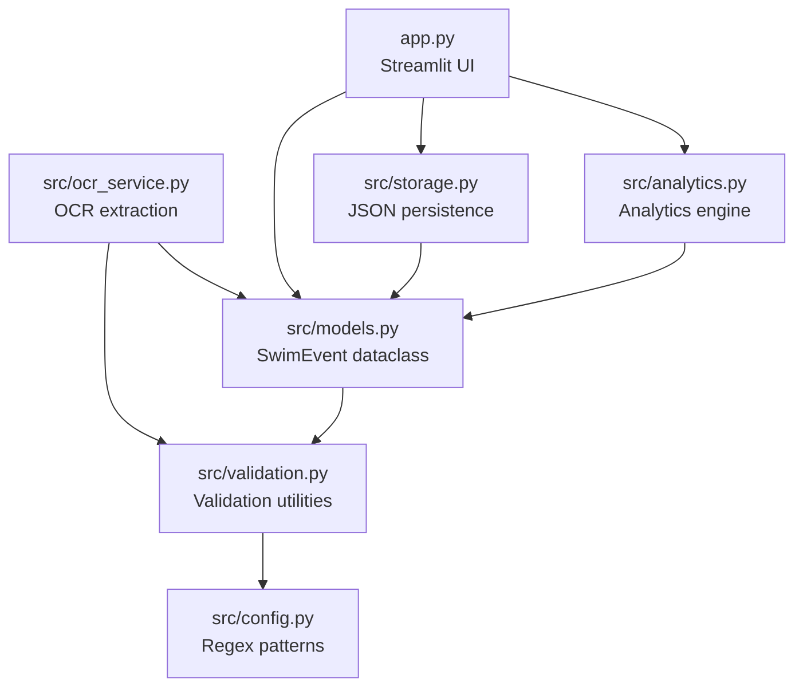
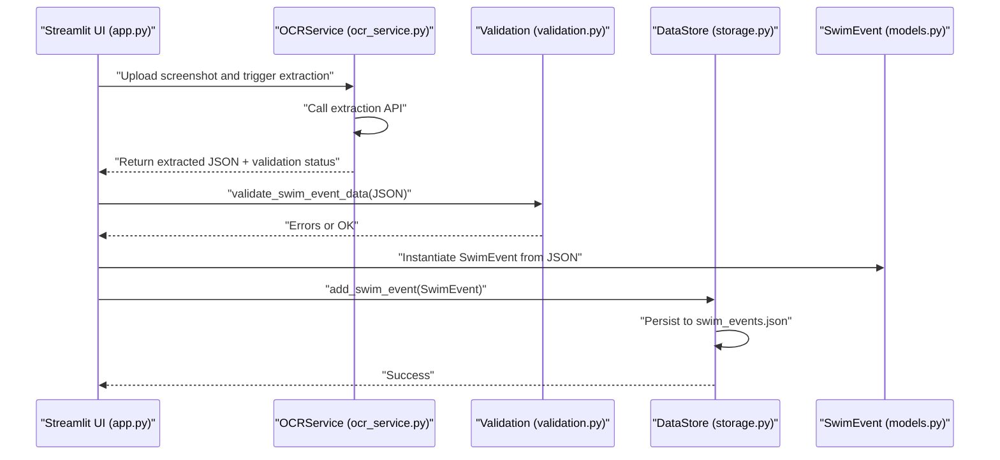
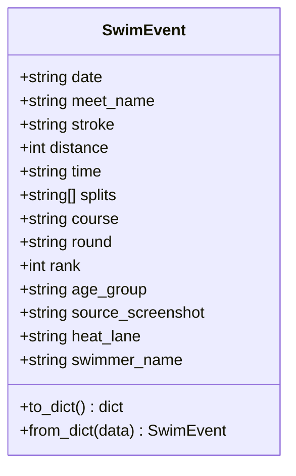
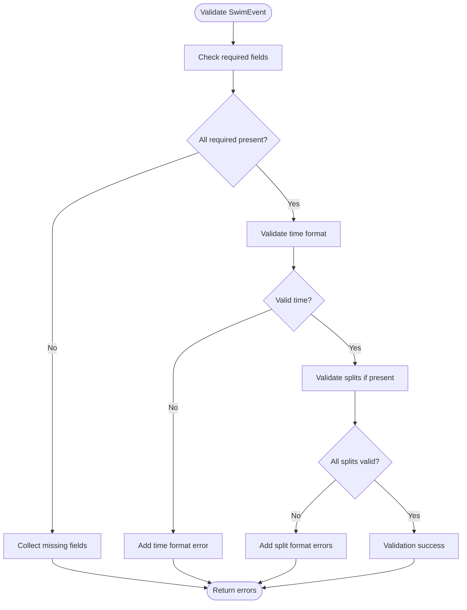
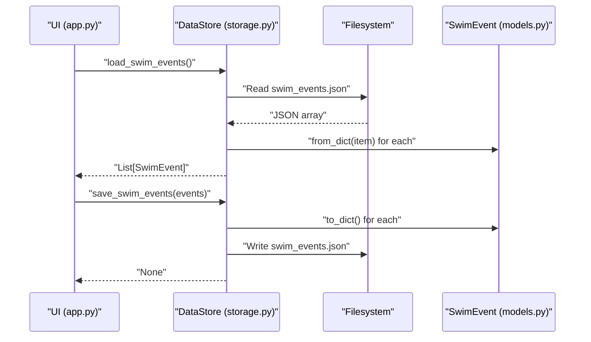
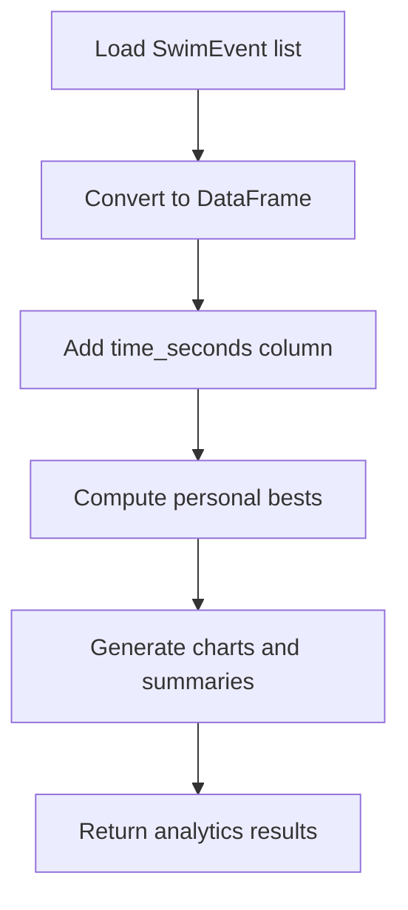
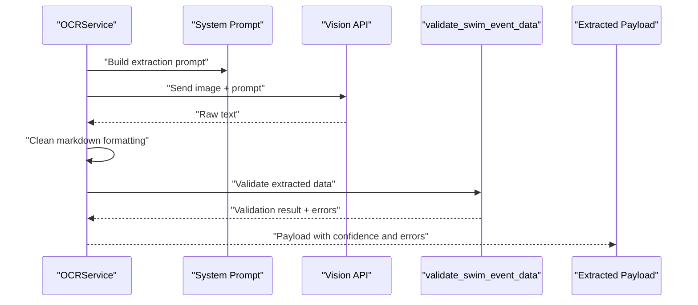
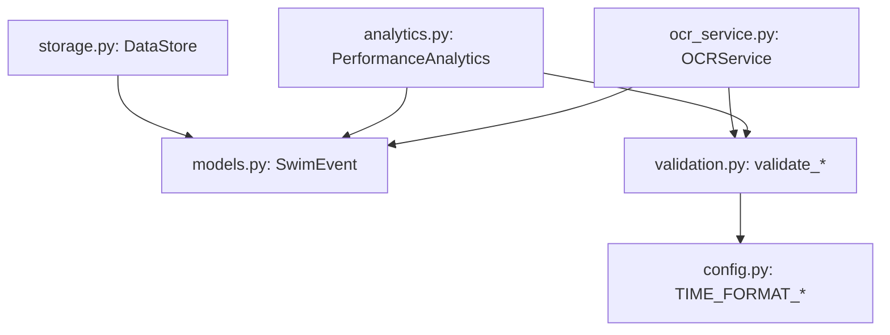

# SwimEvent Model

<cite>
**Referenced Files in This Document**
- [models.py](file://src/models.py)
- [validation.py](file://src/validation.py)
- [config.py](file://src/config.py)
- [ocr_service.py](file://src/ocr_service.py)
- [storage.py](file://src/storage.py)
- [analytics.py](file://src/analytics.py)
- [app.py](file://app.py)
- [README.md](file://README.md)
</cite>

## Table of Contents
1. [Introduction](#introduction)
2. [Project Structure](#project-structure)
3. [Core Components](#core-components)
4. [Architecture Overview](#architecture-overview)
5. [Detailed Component Analysis](#detailed-component-analysis)
6. [Dependency Analysis](#dependency-analysis)
7. [Performance Considerations](#performance-considerations)
8. [Troubleshooting Guide](#troubleshooting-guide)
9. [Conclusion](#conclusion)

## Introduction
This document provides comprehensive documentation for the SwimEvent data model used in the swimming data analysis platform. It covers field definitions, serialization methods, validation rules, business constraints, and practical usage patterns. The SwimEvent model encapsulates a single swimming performance record, including date, meet name, stroke, distance, time, splits, course type, round classification, rank, age group, source screenshot path, heat/lane assignment, and swimmer name. It also documents how the model integrates with validation utilities, storage, analytics, and the OCR pipeline.

## Project Structure
The SwimEvent model resides in the models module alongside other data models. It is consumed by the validation utilities, storage layer, analytics engine, and the main application flow. The OCR service produces SwimEvent-compatible data that is validated and persisted.

**Diagram sources**
- [models.py:1-30](file://src/models.py#L1-L30)
- [validation.py:1-103](file://src/validation.py#L1-L103)
- [config.py:26-29](file://src/config.py#L26-L29)
- [ocr_service.py:30-144](file://src/ocr_service.py#L30-L144)
- [storage.py:10-44](file://src/storage.py#L10-L44)
- [analytics.py:13-184](file://src/analytics.py#L13-L184)
- [app.py:10-20](file://app.py#L10-L20)

**Section sources**
- [models.py:1-30](file://src/models.py#L1-L30)
- [README.md:50-57](file://README.md#L50-L57)

## Core Components
- SwimEvent: The primary data model representing a single swimming performance record with typed fields, defaults, and serialization helpers.
- Validation utilities: Functions to validate time formats, convert between time formats, and validate SwimEvent payloads.
- Configuration: Regex patterns for time format validation.
- Storage: JSON-based persistence layer that serializes SwimEvent instances to dictionaries and persists them to disk.
- Analytics: Utilities that consume SwimEvent data, convert time strings to seconds, and compute performance metrics.
- OCR service: Produces SwimEvent-compatible JSON payloads and validates them before acceptance.

Key responsibilities:
- SwimEvent: Define the schema and provide to_dict/from_dict for serialization.
- Validation: Enforce time format correctness and basic required-field checks.
- Storage: Load/save SwimEvent lists to/from JSON files.
- Analytics: Convert time strings to seconds for plotting and calculations.
- OCR: Extract and validate SwimEvent data from screenshots.

**Section sources**
- [models.py:7-30](file://src/models.py#L7-L30)
- [validation.py:7-102](file://src/validation.py#L7-L102)
- [config.py:26-29](file://src/config.py#L26-L29)
- [storage.py:10-44](file://src/storage.py#L10-L44)
- [analytics.py:16-28](file://src/analytics.py#L16-L28)
- [ocr_service.py:30-116](file://src/ocr_service.py#L30-L116)

## Architecture Overview
The SwimEvent model sits at the center of the data flow. OCR extracts SwimEvent data, validation ensures correctness, storage persists it, and analytics consumes it for insights.

**Diagram sources**
- [app.py:73-118](file://app.py#L73-L118)
- [ocr_service.py:49-116](file://src/ocr_service.py#L49-L116)
- [validation.py:75-102](file://src/validation.py#L75-L102)
- [storage.py:40-44](file://src/storage.py#L40-L44)
- [models.py:24-29](file://src/models.py#L24-L29)

## Detailed Component Analysis

### SwimEvent Data Model
The SwimEvent dataclass defines the schema for a single swimming performance record. It includes:
- date: String in ISO format (YYYY-MM-DD)
- meet_name: String
- stroke: String constrained to freestyle, backstroke, breaststroke, butterfly, IM
- distance: Integer constrained to 50, 100, 200, 400, 800, 1500
- time: String in MM:SS.ss or SS.ss format
- splits: List of time strings (MM:SS.ss or SS.ss)
- course: String constrained to LC or SC
- round: String constrained to heat, semifinal, final
- rank: Integer
- age_group: String (e.g., "8 & Under", "9-10", "11-12")
- source_screenshot: String path to the source screenshot
- heat_lane: String (e.g., "H3 L4")
- swimmer_name: String with default "Sunny"

Serialization methods:
- to_dict(): Converts the SwimEvent instance to a dictionary using dataclass asdict.
- from_dict(): Creates a SwimEvent instance from a dictionary.

Business constraints:
- Required fields for validation include date, meet_name, stroke, distance, and time.
- Time and split times must match the expected regex patterns for MM:SS.ss or SS.ss.
- Course and round values are free-form strings; however, the OCR prompt and UI constrain them to LC/SC and heat/semifinal/final respectively.

**Diagram sources**
- [models.py:7-30](file://src/models.py#L7-L30)

**Section sources**
- [models.py:7-30](file://src/models.py#L7-L30)
- [README.md:50-57](file://README.md#L50-L57)

### Validation and Time Format Utilities
Validation utilities enforce:
- Required fields presence and non-empty values.
- Time format correctness using regex patterns defined in configuration.
- Split time validation when provided.

Time conversion utilities:
- time_to_seconds(): Converts MM:SS.ss or SS.ss to total seconds.
- seconds_to_time(): Converts total seconds back to MM:SS.ss or SS.ss.

**Diagram sources**
- [validation.py:75-102](file://src/validation.py#L75-L102)
- [config.py:26-29](file://src/config.py#L26-L29)

**Section sources**
- [validation.py:7-102](file://src/validation.py#L7-L102)
- [config.py:26-29](file://src/config.py#L26-L29)

### Serialization and Persistence
The storage layer handles JSON-based persistence:
- load_swim_events(): Loads SwimEvent records from swim_events.json and reconstructs SwimEvent instances.
- save_swim_events(): Serializes SwimEvent instances to dictionaries and writes to swim_events.json.
- add_swim_event(): Adds a single SwimEvent to the list and persists.

**Diagram sources**
- [storage.py:30-44](file://src/storage.py#L30-L44)
- [models.py:24-29](file://src/models.py#L24-L29)

**Section sources**
- [storage.py:10-44](file://src/storage.py#L10-L44)
- [models.py:24-29](file://src/models.py#L24-L29)

### Analytics Integration
Analytics consumes SwimEvent data to:
- Convert time strings to seconds for plotting and calculations.
- Compute personal bests grouped by stroke, distance, and course.
- Generate time progression charts and stroke comparison metrics.

**Diagram sources**
- [analytics.py:16-28](file://src/analytics.py#L16-L28)
- [analytics.py:114-138](file://src/analytics.py#L114-L138)

**Section sources**
- [analytics.py:16-28](file://src/analytics.py#L16-L28)
- [analytics.py:114-138](file://src/analytics.py#L114-L138)

### OCR Extraction and Business Constraints
The OCR service extracts SwimEvent data from screenshots and applies validation:
- System prompt enumerates expected fields and constraints.
- Validation is performed immediately after extraction.
- Confidence and error metadata are attached to the extracted payload.

Constraints enforced by the prompt and UI:
- stroke: freestyle, backstroke, breaststroke, butterfly, IM
- distance: 50, 100, 200, 400, 800, 1500
- course: LC or SC
- round: heat, semifinal, final
- time/split format: MM:SS.ss or SS.ss

**Diagram sources**
- [ocr_service.py:30-116](file://src/ocr_service.py#L30-L116)
- [validation.py:75-102](file://src/validation.py#L75-L102)

**Section sources**
- [ocr_service.py:30-116](file://src/ocr_service.py#L30-L116)
- [app.py:289-294](file://app.py#L289-L294)

## Dependency Analysis
- SwimEvent depends on dataclasses for serialization and typing for clarity.
- Validation utilities depend on configuration for regex patterns.
- Storage depends on SwimEvent serialization and filesystem I/O.
- Analytics depends on validation utilities for time conversion.
- OCR service depends on validation and configuration for prompt and patterns.

**Diagram sources**
- [models.py:7-30](file://src/models.py#L7-L30)
- [validation.py:7-102](file://src/validation.py#L7-L102)
- [config.py:26-29](file://src/config.py#L26-L29)
- [storage.py:10-44](file://src/storage.py#L10-L44)
- [analytics.py:13-184](file://src/analytics.py#L13-L184)
- [ocr_service.py:30-116](file://src/ocr_service.py#L30-L116)

**Section sources**
- [models.py:7-30](file://src/models.py#L7-L30)
- [validation.py:7-102](file://src/validation.py#L7-L102)
- [config.py:26-29](file://src/config.py#L26-L29)
- [storage.py:10-44](file://src/storage.py#L10-L44)
- [analytics.py:13-184](file://src/analytics.py#L13-L184)
- [ocr_service.py:30-116](file://src/ocr_service.py#L30-L116)

## Performance Considerations
- Time conversion: Converting between time strings and seconds is O(n) for n splits; keep split counts reasonable.
- Storage: JSON I/O is straightforward; for large datasets, consider batching loads/saves.
- Analytics: Aggregation functions operate on loaded lists; ensure efficient grouping and sorting.

[No sources needed since this section provides general guidance]

## Troubleshooting Guide
Common issues and resolutions:
- Invalid time format: Ensure time and split times match MM:SS.ss or SS.ss. Validation will report specific errors.
- Missing required fields: date, meet_name, stroke, distance, time are mandatory. Add them before validation.
- OCR extraction failures: Verify API key configuration and image quality. Review extraction errors and confidence metadata.
- Persistence problems: Confirm swim_events.json path and permissions; handle JSON decode errors gracefully.

**Section sources**
- [validation.py:75-102](file://src/validation.py#L75-L102)
- [ocr_service.py:55-56](file://src/ocr_service.py#L55-L56)
- [storage.py:14-27](file://src/storage.py#L14-L27)

## Conclusion
The SwimEvent model provides a robust, schema-aligned representation of swimming performance data. Its integration with validation, storage, analytics, and OCR ensures reliable ingestion, persistence, and analysis. By adhering to the documented constraints and validation rules, users can confidently capture and leverage swimming performance insights.