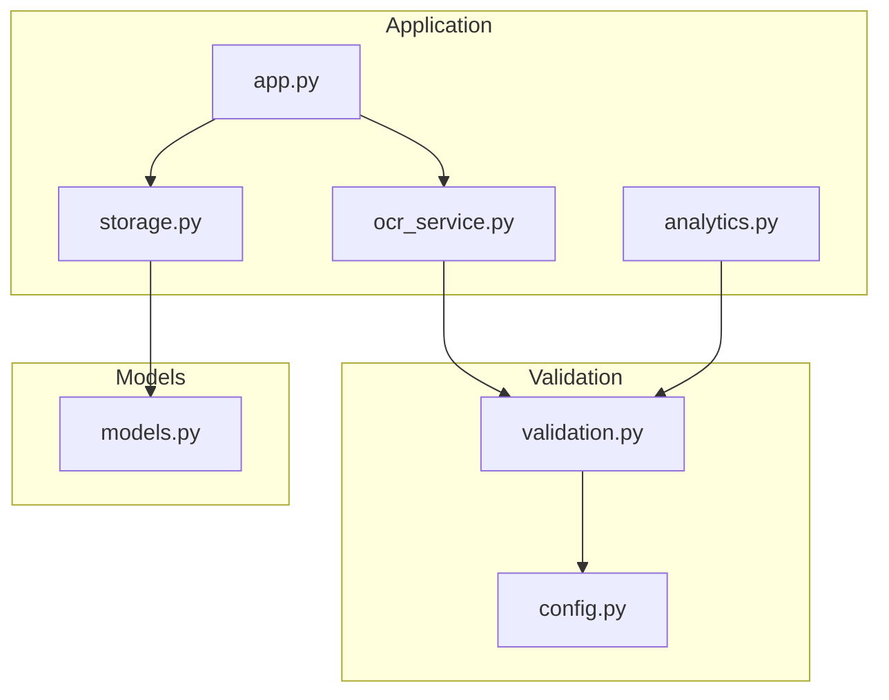
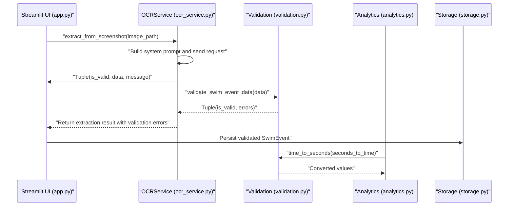
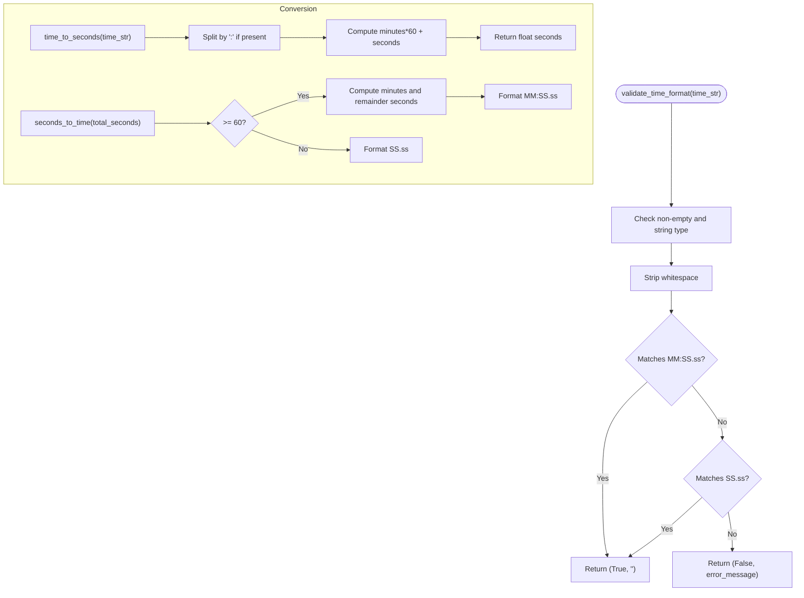
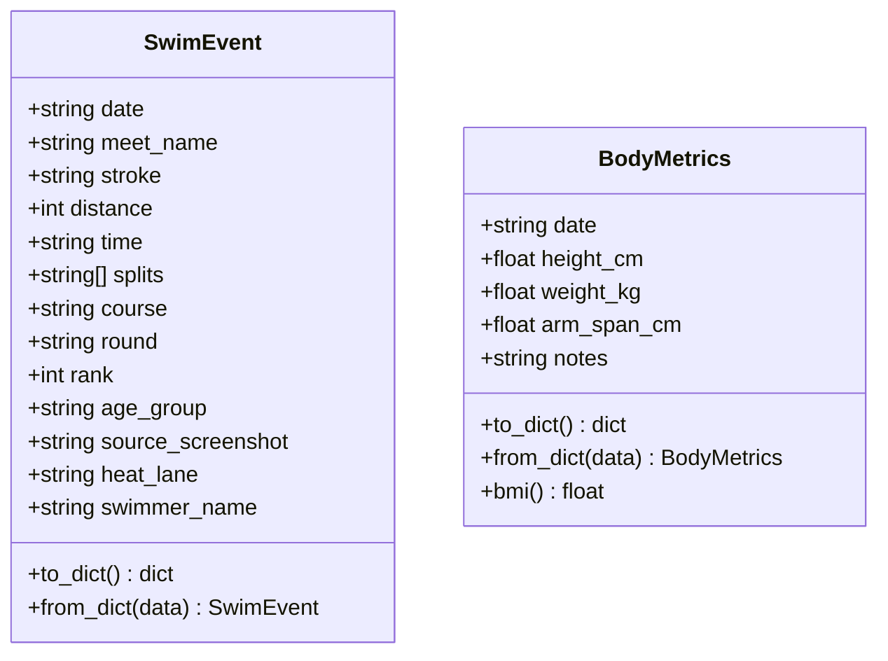
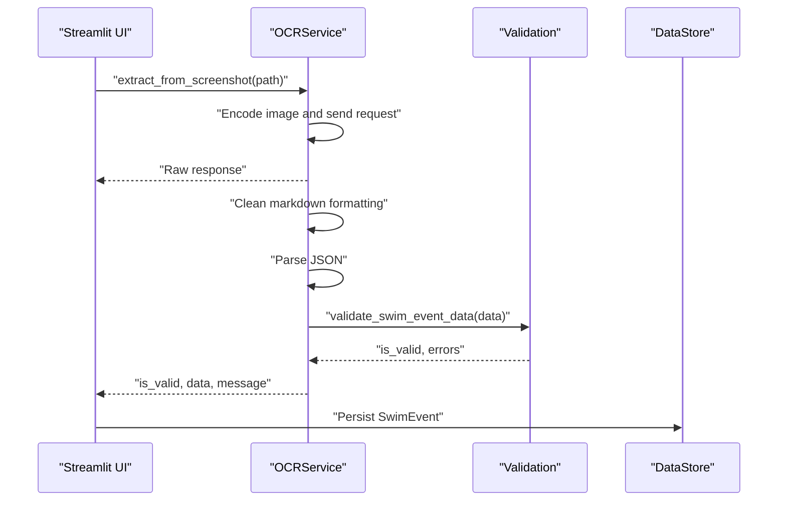
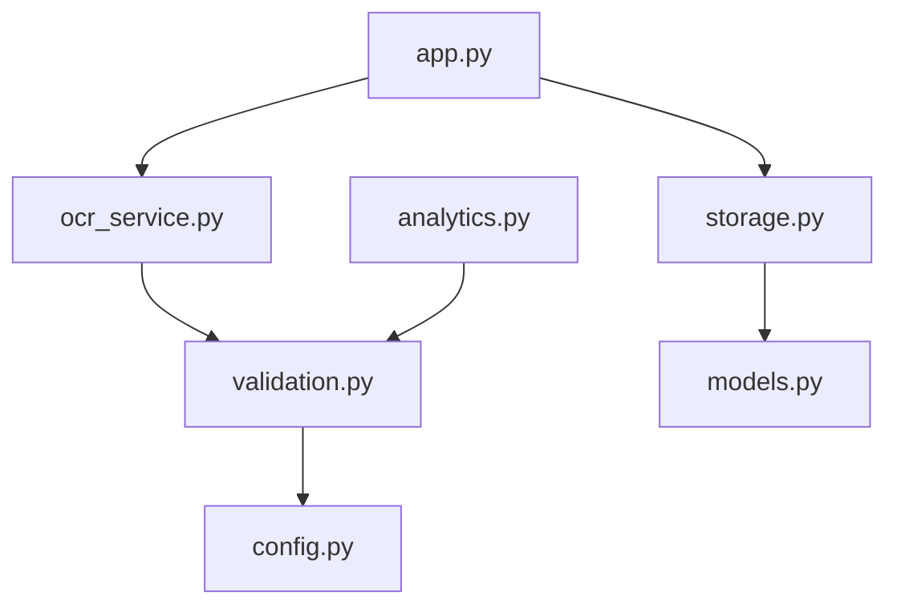

# Validation Utilities

<cite>
**Referenced Files in This Document**
- [validation.py](file://src/validation.py)
- [models.py](file://src/models.py)
- [config.py](file://src/config.py)
- [ocr_service.py](file://src/ocr_service.py)
- [analytics.py](file://src/analytics.py)
- [storage.py](file://src/storage.py)
- [app.py](file://app.py)
- [README.md](file://README.md)
</cite>

## Table of Contents
1. [Introduction](#introduction)
2. [Project Structure](#project-structure)
3. [Core Components](#core-components)
4. [Architecture Overview](#architecture-overview)
5. [Detailed Component Analysis](#detailed-component-analysis)
6. [Dependency Analysis](#dependency-analysis)
7. [Performance Considerations](#performance-considerations)
8. [Troubleshooting Guide](#troubleshooting-guide)
9. [Conclusion](#conclusion)

## Introduction
This document describes the validation utilities used across the swimming data analysis platform. It focuses on time format conversion, stroke type validation, distance validation, age group formatting, and numeric value validation. It also explains error handling, input sanitization, and data type conversion utilities, and demonstrates how these utilities integrate with data models to ensure data integrity throughout the application lifecycle. Common validation scenarios such as OCR data cleaning, user input validation, and data consistency checks are covered with examples of validation workflows, error messages, and exception handling patterns.

## Project Structure
The validation utilities reside primarily in a dedicated module and are integrated across the application:
- Validation utilities: src/validation.py
- Data models: src/models.py
- Configuration (time format regex): src/config.py
- OCR service: src/ocr_service.py
- Analytics: src/analytics.py
- Storage: src/storage.py
- Application entry point: app.py
- Project overview: README.md

**Diagram sources**
- [app.py:1-447](file://app.py#L1-L447)
- [ocr_service.py:1-144](file://src/ocr_service.py#L1-L144)
- [analytics.py:1-184](file://src/analytics.py#L1-L184)
- [storage.py:1-107](file://src/storage.py#L1-L107)
- [validation.py:1-103](file://src/validation.py#L1-L103)
- [config.py:1-29](file://src/config.py#L1-L29)
- [models.py:1-55](file://src/models.py#L1-L55)

**Section sources**
- [README.md:1-63](file://README.md#L1-L63)
- [app.py:1-447](file://app.py#L1-L447)

## Core Components
This section introduces the primary validation functions and their roles:
- Time format validation: Ensures time strings conform to MM:SS.ss or SS.ss.
- Time conversion utilities: Convert between time strings and seconds, and vice versa.
- Required fields validation: Ensures essential fields are present and non-empty.
- Swim event validation: Validates a complete swim event payload, including time and optional splits.

Key capabilities:
- Input sanitization: Strips whitespace and validates types.
- Error reporting: Returns structured tuples with validity and messages.
- Integration: Used by OCR extraction, analytics, and UI workflows.

**Section sources**
- [validation.py:7-102](file://src/validation.py#L7-L102)

## Architecture Overview
The validation utilities are invoked during OCR extraction and analytics processing. The flow ensures that extracted data adheres to expected formats before being persisted or visualized.

**Diagram sources**
- [app.py:60-120](file://app.py#L60-L120)
- [ocr_service.py:49-116](file://src/ocr_service.py#L49-L116)
- [validation.py:75-102](file://src/validation.py#L75-L102)
- [analytics.py:17-28](file://src/analytics.py#L17-L28)
- [storage.py:30-44](file://src/storage.py#L30-L44)

## Detailed Component Analysis

### Time Format Validation and Conversion
Purpose:
- Validate time strings against MM:SS.ss or SS.ss patterns.
- Convert between time strings and seconds for analytics and storage.

Implementation highlights:
- Uses regex patterns from configuration for strict format enforcement.
- Strips whitespace and handles both colon-separated and decimal-only formats.
- Provides bidirectional conversion helpers for consistent internal representation.

Common workflows:
- OCR extraction returns time strings; validation ensures correctness.
- Analytics converts time strings to seconds for plotting and comparisons.

**Diagram sources**
- [validation.py:7-23](file://src/validation.py#L7-L23)
- [validation.py:26-59](file://src/validation.py#L26-L59)
- [config.py:26-28](file://src/config.py#L26-L28)

**Section sources**
- [validation.py:7-59](file://src/validation.py#L7-L59)
- [config.py:26-28](file://src/config.py#L26-L28)

### Required Fields Validation
Purpose:
- Ensure essential swim event fields are present and non-empty.

Behavior:
- Iterates through required keys and collects missing ones.
- Returns a tuple indicating validity and the list of missing fields.

Integration:
- Used by swim event validation to enforce minimal completeness.

**Section sources**
- [validation.py:62-72](file://src/validation.py#L62-L72)

### Swim Event Validation
Purpose:
- Validate a complete swim event payload, including required fields, time format, and optional splits.

Workflow:
- Validates required fields.
- Validates total time format.
- Validates each split time format if present.
- Aggregates errors into a list.

Error handling:
- Returns a tuple of validity and error messages.
- Errors are surfaced to the caller for user feedback or logging.

**Section sources**
- [validation.py:75-102](file://src/validation.py#L75-L102)

### Data Model Integration
Purpose:
- Define the canonical structure for swim events and ensure consistent serialization/deserialization.

Key points:
- SwimEvent fields include date, meet_name, stroke, distance, time, splits, course, round, rank, age_group, source_screenshot, heat_lane, swimmer_name.
- Provides to_dict/from_dict for persistence and interchange.
- Analytics consumes SwimEvent instances and relies on validated time strings.

**Diagram sources**
- [models.py:7-29](file://src/models.py#L7-L29)
- [models.py:32-46](file://src/models.py#L32-L46)

**Section sources**
- [models.py:7-29](file://src/models.py#L7-L29)
- [models.py:32-46](file://src/models.py#L32-L46)

### OCR Data Cleaning and Validation
Purpose:
- Extract structured swimming data from screenshots and validate it before saving.

Workflow:
- Encodes image, sends request to OCR provider, parses JSON response.
- Cleans potential markdown formatting from response.
- Validates extracted data using swim event validation.
- Attaches confidence and error metadata to the result.

Error handling:
- Handles API key configuration, JSON parsing, and general exceptions.
- Returns structured results with validation errors for user review.

**Diagram sources**
- [ocr_service.py:49-116](file://src/ocr_service.py#L49-L116)
- [validation.py:75-102](file://src/validation.py#L75-L102)
- [storage.py:30-44](file://src/storage.py#L30-L44)

**Section sources**
- [ocr_service.py:49-116](file://src/ocr_service.py#L49-L116)

### Analytics Data Type Conversion
Purpose:
- Convert time strings to seconds for plotting and calculations, and back to human-readable strings for display.

Workflow:
- Analytics loads SwimEvent data and converts time to seconds for sorting and plotting.
- Uses seconds_to_time to format times for tooltips and displays.

**Section sources**
- [analytics.py:17-28](file://src/analytics.py#L17-L28)
- [analytics.py:115-138](file://src/analytics.py#L115-L138)

### User Input Validation and Data Consistency Checks
Purpose:
- Ensure user-entered data conforms to expected formats and types.

Scenarios:
- Manual entry form fields include stroke selection, distance numbers, time strings, optional splits, course, round, rank, age group, and heat/lane.
- The UI constructs SwimEvent instances and persists them via DataStore.

Consistency checks:
- Required fields validation ensures essential data is present.
- Time format validation prevents malformed times from entering analytics.
- Numeric conversions ensure downstream computations operate on valid numbers.

**Section sources**
- [ocr_service.py:121-136](file://src/ocr_service.py#L121-L136)
- [app.py:97-112](file://app.py#L97-L112)
- [storage.py:30-44](file://src/storage.py#L30-L44)

## Dependency Analysis
The validation utilities depend on configuration for time format patterns and are consumed by OCR, analytics, and UI layers.

**Diagram sources**
- [validation.py:4](file://src/validation.py#L4)
- [config.py:26-28](file://src/config.py#L26-L28)
- [ocr_service.py:9](file://src/ocr_service.py#L9)
- [analytics.py:9](file://src/analytics.py#L9)
- [app.py:15](file://app.py#L15)
- [storage.py:6](file://src/storage.py#L6)
- [models.py:2](file://src/models.py#L2)

**Section sources**
- [validation.py:4](file://src/validation.py#L4)
- [config.py:26-28](file://src/config.py#L26-L28)
- [ocr_service.py:9](file://src/ocr_service.py#L9)
- [analytics.py:9](file://src/analytics.py#L9)
- [app.py:15](file://app.py#L15)
- [storage.py:6](file://src/storage.py#L6)
- [models.py:2](file://src/models.py#L2)

## Performance Considerations
- Regex-based validation is efficient for time format checks.
- Conversion functions are lightweight and used primarily during data ingestion and visualization.
- Avoid repeated conversions by caching seconds values when building analytics datasets.
- Keep validation errors aggregated to minimize UI updates and improve responsiveness.

## Troubleshooting Guide
Common issues and resolutions:
- Empty or non-string time values: Ensure inputs are strings and not empty before validation.
- Invalid time format: Confirm the time string matches MM:SS.ss or SS.ss; use the provided validation function to catch mismatches early.
- Missing required fields: Verify that date, meet_name, stroke, distance, and time are present and non-empty.
- Split validation failures: Validate each split individually; ensure they follow the same time format rules.
- JSON parsing errors from OCR: The OCR service cleans markdown formatting and reports parsing errors; review the raw response and adjust extraction prompts if needed.
- Analytics display anomalies: Confirm time strings are valid before converting to seconds; invalid times can cause NaN values in plots.

Error handling patterns:
- Validation returns tuples of validity and messages; callers should inspect both and surface user-friendly messages.
- OCR service attaches validation errors to the extracted data for transparency.
- UI layers display warnings and successes based on validation outcomes.

**Section sources**
- [validation.py:7-23](file://src/validation.py#L7-L23)
- [validation.py:62-102](file://src/validation.py#L62-L102)
- [ocr_service.py:103-116](file://src/ocr_service.py#L103-L116)
- [app.py:88-118](file://app.py#L88-L118)

## Conclusion
The validation utilities provide robust, reusable mechanisms for ensuring data integrity across the swimming data analysis platform. They enforce time format correctness, validate required fields, and support bidirectional time conversions. Their integration with OCR extraction, analytics, and UI workflows guarantees consistent, reliable data handling from ingestion to visualization. By following the validation patterns and error handling approaches outlined here, developers can maintain high-quality data quality and user experience throughout the application lifecycle.