# Code Structure and Architecture

<cite>
**Referenced Files in This Document**
- [app.py](file://app.py)
- [src/__init__.py](file://src/__init__.py)
- [src/config.py](file://src/config.py)
- [src/models.py](file://src/models.py)
- [src/storage.py](file://src/storage.py)
- [src/screenshot_manager.py](file://src/screenshot_manager.py)
- [src/ocr_service.py](file://src/ocr_service.py)
- [src/validation.py](file://src/validation.py)
- [src/analytics.py](file://src/analytics.py)
- [src/research_service.py](file://src/research_service.py)
- [src/insights.py](file://src/insights.py)
- [src/qa_service.py](file://src/qa_service.py)
- [README.md](file://README.md)
- [requirements.txt](file://requirements.txt)
</cite>

## Table of Contents
1. [Introduction](#introduction)
2. [Project Structure](#project-structure)
3. [Core Components](#core-components)
4. [Architecture Overview](#architecture-overview)
5. [Detailed Component Analysis](#detailed-component-analysis)
6. [Dependency Analysis](#dependency-analysis)
7. [Performance Considerations](#performance-considerations)
8. [Troubleshooting Guide](#troubleshooting-guide)
9. [Conclusion](#conclusion)
10. [Appendices](#appendices)

## Introduction
This document explains the architecture and code structure of the Swimming Data Analysis Platform. It focuses on the modular organization separating UI controllers, service layers, and data models; the Streamlit application architecture including page routing and session state management; the service-oriented architecture orchestrated by app.py; the repository pattern via the DataStore abstraction; and the factory-like usage of validation utilities. It also outlines naming conventions, file organization principles, and dependency injection patterns, and provides guidance on integrating new features following established patterns.

## Project Structure
The project follows a clear module-based organization:
- app.py: Streamlit application entry point and page router
- src/: Python package containing domain services and infrastructure
  - config.py: Paths and environment-driven configuration
  - models.py: Data models (dataclasses) for swim events and body metrics
  - storage.py: JSON-backed repository abstractions (DataStore, ScreenshotIndex)
  - screenshot_manager.py: Screenshot ingestion and gallery utilities
  - ocr_service.py: Vision-language OCR service for extracting race data
  - validation.py: Data validation utilities and time conversion helpers
  - analytics.py: Performance analytics and visualization utilities
  - research_service.py: Benchmark search and comparison
  - insights.py: Trend analysis, potential assessment, and training suggestions
  - qa_service.py: Natural language Q&A over the data
- data/: Local storage for screenshots, extracted data, and caches
- requirements.txt: Dependencies
- README.md: Project overview and usage

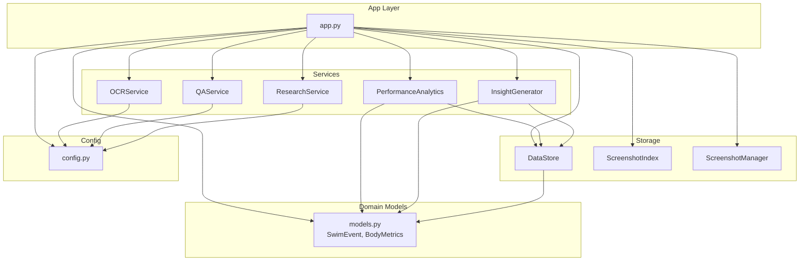

**Diagram sources**
- [app.py:1-447](file://app.py#L1-L447)
- [src/ocr_service.py:12-144](file://src/ocr_service.py#L12-L144)
- [src/analytics.py:13-184](file://src/analytics.py#L13-L184)
- [src/research_service.py:10-94](file://src/research_service.py#L10-L94)
- [src/insights.py:11-150](file://src/insights.py#L11-L150)
- [src/qa_service.py:12-174](file://src/qa_service.py#L12-L174)
- [src/models.py:7-55](file://src/models.py#L7-L55)
- [src/storage.py:10-107](file://src/storage.py#L10-L107)
- [src/screenshot_manager.py:14-136](file://src/screenshot_manager.py#L14-L136)
- [src/config.py:1-29](file://src/config.py#L1-L29)

**Section sources**
- [app.py:1-447](file://app.py#L1-L447)
- [src/config.py:1-29](file://src/config.py#L1-L29)
- [README.md:1-63](file://README.md#L1-L63)

## Core Components
- Streamlit UI controller (app.py): Orchestrates page routing, session state, and component composition. It initializes services in session state and renders page-specific layouts.
- Services:
  - OCRService: Vision-language extraction pipeline for race data from screenshots.
  - PerformanceAnalytics: Data loading, transformations, and visualization utilities.
  - ResearchService: DuckDuckGo-based benchmark search with caching.
  - InsightGenerator: Trend analysis, strengths/weaknesses, potential assessment, and training suggestions.
  - QAService: Natural language Q&A over structured data context.
- Domain models (models.py): SwimEvent and BodyMetrics dataclasses with serialization helpers.
- Storage (storage.py): JSON-backed repository abstractions for swim events, body metrics, and screenshot index.
- Infrastructure (screenshot_manager.py): Filesystem organization, duplicate detection, thumbnails, and deletion.
- Validation (validation.py): Time format validation, conversions, and swim event validation.
- Configuration (config.py): Paths, environment variables, and regex patterns.

**Section sources**
- [app.py:29-42](file://app.py#L29-L42)
- [src/ocr_service.py:12-144](file://src/ocr_service.py#L12-L144)
- [src/analytics.py:13-184](file://src/analytics.py#L13-L184)
- [src/research_service.py:10-94](file://src/research_service.py#L10-L94)
- [src/insights.py:11-150](file://src/insights.py#L11-L150)
- [src/qa_service.py:12-174](file://src/qa_service.py#L12-L174)
- [src/models.py:7-55](file://src/models.py#L7-L55)
- [src/storage.py:10-107](file://src/storage.py#L10-L107)
- [src/screenshot_manager.py:14-136](file://src/screenshot_manager.py#L14-L136)
- [src/validation.py:1-103](file://src/validation.py#L1-L103)
- [src/config.py:1-29](file://src/config.py#L1-L29)

## Architecture Overview
The platform implements a service-oriented architecture with a Streamlit UI controller. The UI delegates page rendering and interactions to specialized services. Data access is centralized via repository abstractions, and configuration is environment-driven. The architecture emphasizes:
- Separation of concerns: UI (app.py), services, models, storage, and configuration
- Dependency inversion: services depend on abstractions (DataStore, config) rather than concrete implementations
- Extensibility: new features integrate by adding services and updating the UI router

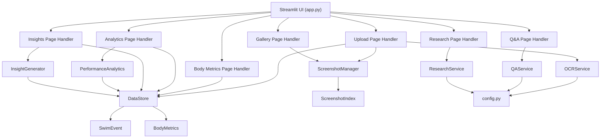

**Diagram sources**
- [app.py:60-403](file://app.py#L60-L403)
- [src/ocr_service.py:12-144](file://src/ocr_service.py#L12-L144)
- [src/analytics.py:13-184](file://src/analytics.py#L13-L184)
- [src/research_service.py:10-94](file://src/research_service.py#L10-L94)
- [src/insights.py:11-150](file://src/insights.py#L11-L150)
- [src/qa_service.py:12-174](file://src/qa_service.py#L12-L174)
- [src/storage.py:10-107](file://src/storage.py#L10-L107)
- [src/screenshot_manager.py:14-136](file://src/screenshot_manager.py#L14-L136)
- [src/config.py:1-29](file://src/config.py#L1-L29)

## Detailed Component Analysis

### Streamlit Application Controller (app.py)
- Page routing: Uses session state to switch among Upload, Gallery, Body Metrics, Analytics, Research, Insights, and Q&A pages.
- Session state management: Initializes page, chat history, last extraction, and QAService instance.
- Component relationships: Renders page-specific UI and delegates actions to services and repositories.
- Dependency injection: Services are instantiated per-use or stored in session state for reuse.

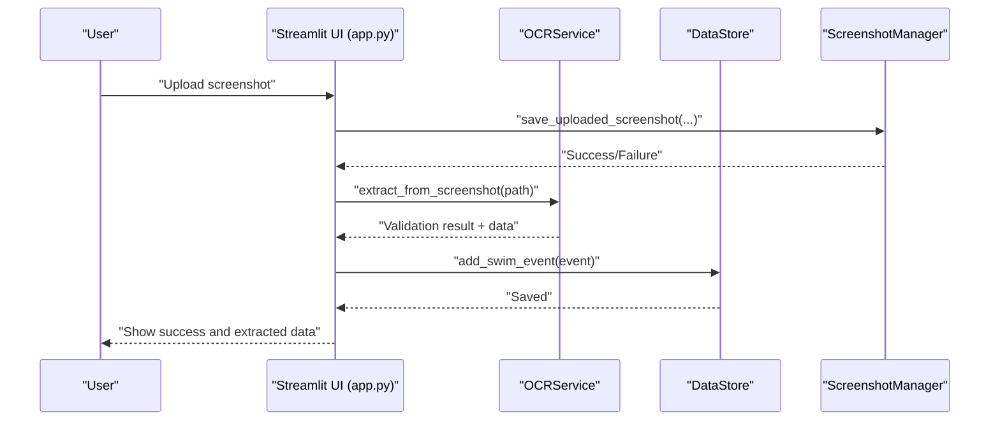

**Diagram sources**
- [app.py:73-118](file://app.py#L73-L118)
- [src/screenshot_manager.py:27-82](file://src/screenshot_manager.py#L27-L82)
- [src/ocr_service.py:49-119](file://src/ocr_service.py#L49-L119)
- [src/storage.py:40-44](file://src/storage.py#L40-L44)

**Section sources**
- [app.py:29-42](file://app.py#L29-L42)
- [app.py:60-127](file://app.py#L60-L127)
- [app.py:129-166](file://app.py#L129-L166)
- [app.py:168-224](file://app.py#L168-L224)
- [app.py:226-280](file://app.py#L226-L280)
- [app.py:282-319](file://app.py#L282-L319)
- [app.py:321-369](file://app.py#L321-L369)
- [app.py:371-403](file://app.py#L371-L403)
- [app.py:405-447](file://app.py#L405-L447)

### Data Models (models.py)
- SwimEvent: Immutable dataclass representing a race result with serialization helpers.
- BodyMetrics: Immutable dataclass for anthropometric measurements with BMI property.

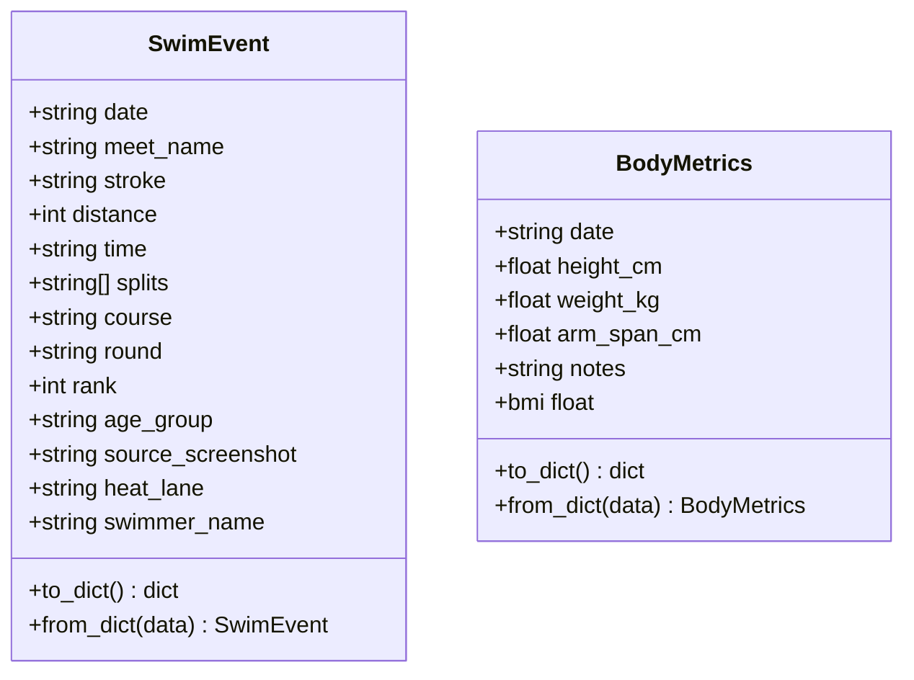

**Diagram sources**
- [src/models.py:7-55](file://src/models.py#L7-L55)

**Section sources**
- [src/models.py:7-55](file://src/models.py#L7-L55)

### Repository Pattern (storage.py)
- DataStore: Encapsulates JSON persistence for SwimEvent and BodyMetrics with load/save/add helpers.
- ScreenshotIndex: Manages screenshot metadata index with add/list/remove operations.

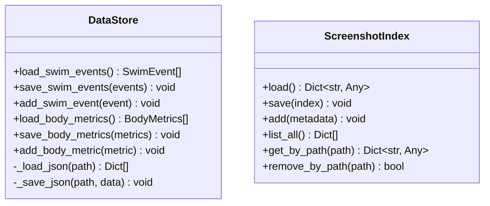

**Diagram sources**
- [src/storage.py:10-107](file://src/storage.py#L10-L107)

**Section sources**
- [src/storage.py:10-107](file://src/storage.py#L10-L107)

### Screenshot Management (screenshot_manager.py)
- Duplicate detection by filename and checksum
- Thumbnail generation
- Directory cleanup after deletions

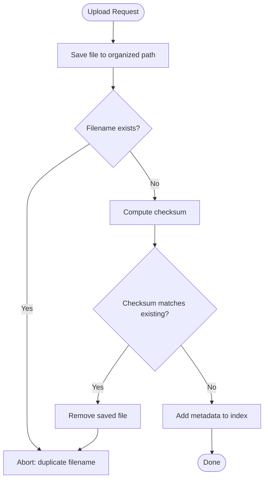

**Diagram sources**
- [src/screenshot_manager.py:27-82](file://src/screenshot_manager.py#L27-L82)

**Section sources**
- [src/screenshot_manager.py:14-136](file://src/screenshot_manager.py#L14-L136)

### OCR Service (ocr_service.py)
- Vision-language extraction using Alibaba Cloud Model Studio
- Structured JSON extraction with validation and confidence/error metadata
- Manual entry fallback form definition

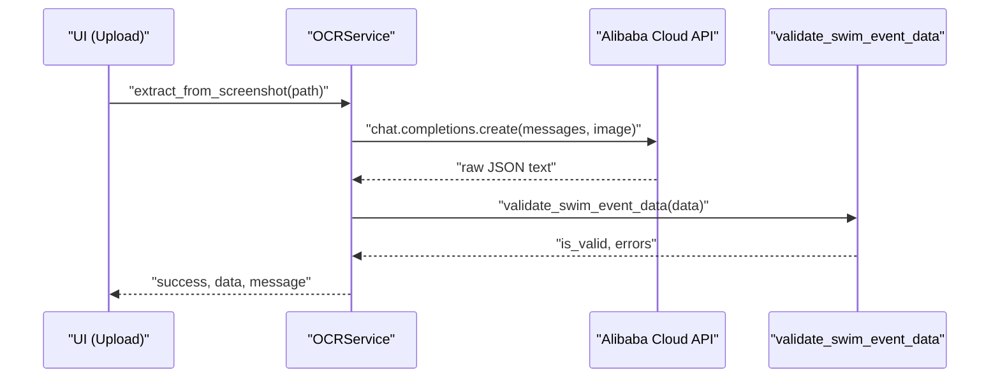

**Diagram sources**
- [src/ocr_service.py:49-119](file://src/ocr_service.py#L49-L119)
- [src/validation.py:75-103](file://src/validation.py#L75-L103)

**Section sources**
- [src/ocr_service.py:12-144](file://src/ocr_service.py#L12-L144)

### Validation Utilities (validation.py)
- Time format validation and conversions
- Required field checks
- Swim event validation combining multiple checks

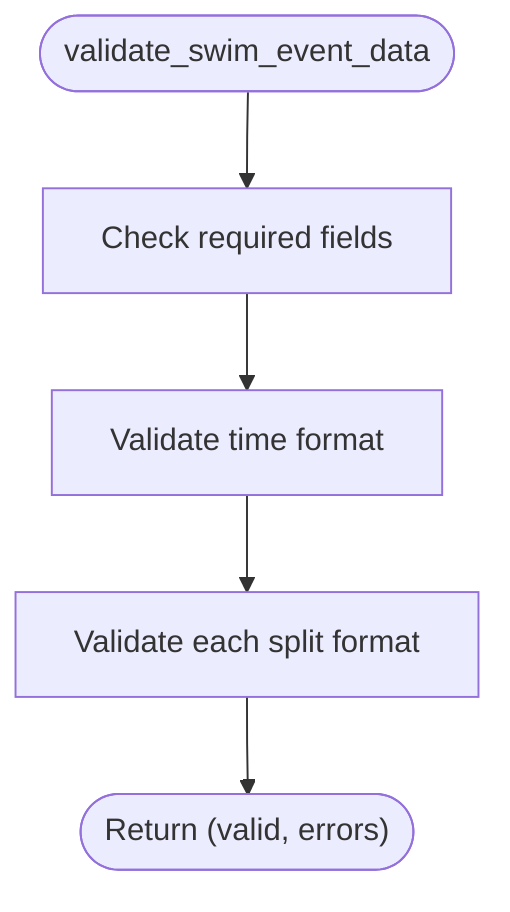

**Diagram sources**
- [src/validation.py:75-103](file://src/validation.py#L75-L103)

**Section sources**
- [src/validation.py:1-103](file://src/validation.py#L1-L103)

### Performance Analytics (analytics.py)
- Loads events into DataFrame, computes derived fields
- Creates time progression charts and stroke comparison radar
- Computes personal bests and dashboard summaries

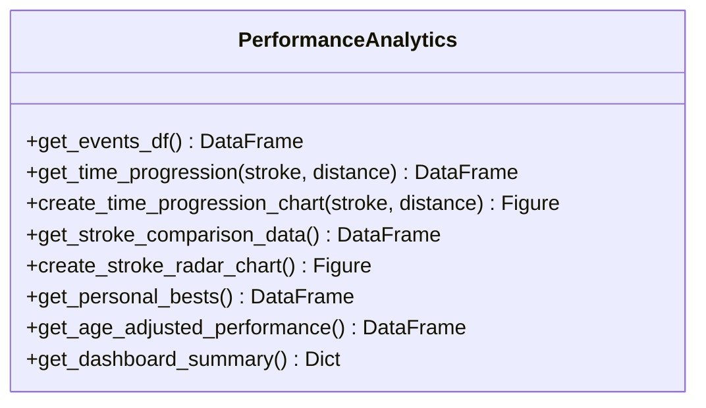

**Diagram sources**
- [src/analytics.py:13-184](file://src/analytics.py#L13-L184)

**Section sources**
- [src/analytics.py:13-184](file://src/analytics.py#L13-L184)

### Research Service (research_service.py)
- DuckDuckGo search for benchmarks with caching
- Comparison of personal bests against benchmarks

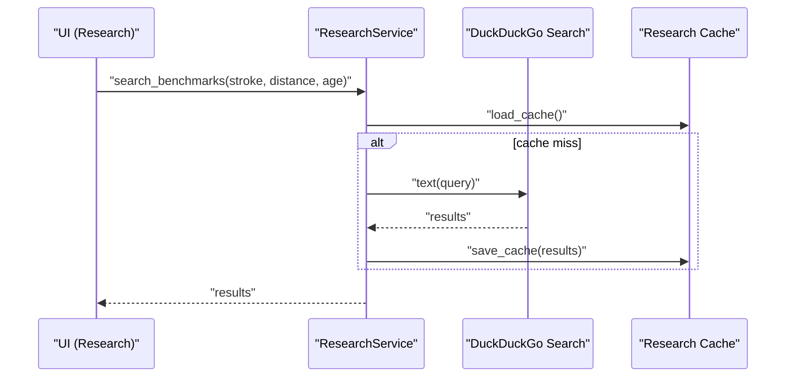

**Diagram sources**
- [src/research_service.py:32-53](file://src/research_service.py#L32-L53)

**Section sources**
- [src/research_service.py:10-94](file://src/research_service.py#L10-L94)

### Insight Generator (insights.py)
- Trend insights across stroke-distance-course combinations
- Strengths/weaknesses identification and training suggestions
- Potential assessment and recommendation generation

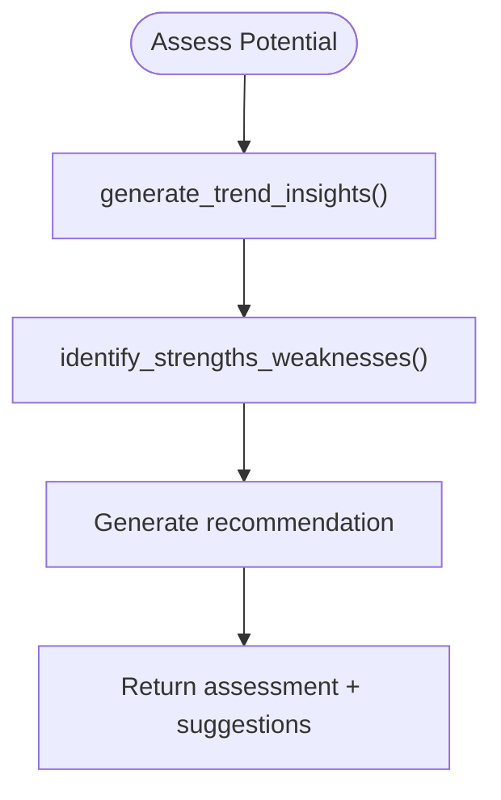

**Diagram sources**
- [src/insights.py:89-111](file://src/insights.py#L89-L111)

**Section sources**
- [src/insights.py:11-150](file://src/insights.py#L11-L150)

### QA Service (qa_service.py)
- Builds structured context from swim events and body metrics
- Classifies query types and answers using a text model
- Maintains conversation history

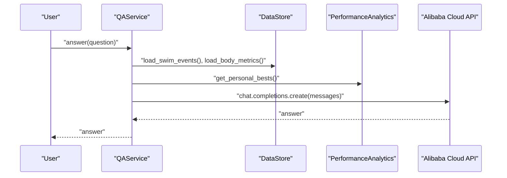

**Diagram sources**
- [src/qa_service.py:76-134](file://src/qa_service.py#L76-L134)

**Section sources**
- [src/qa_service.py:12-174](file://src/qa_service.py#L12-L174)

## Dependency Analysis
- UI depends on services and repositories for rendering and persistence.
- Services depend on models and repositories for data access and on config for external integrations.
- Storage depends on models for serialization and on config for file paths.
- Validation utilities are used across services for data quality.
- No circular dependencies observed among major modules.

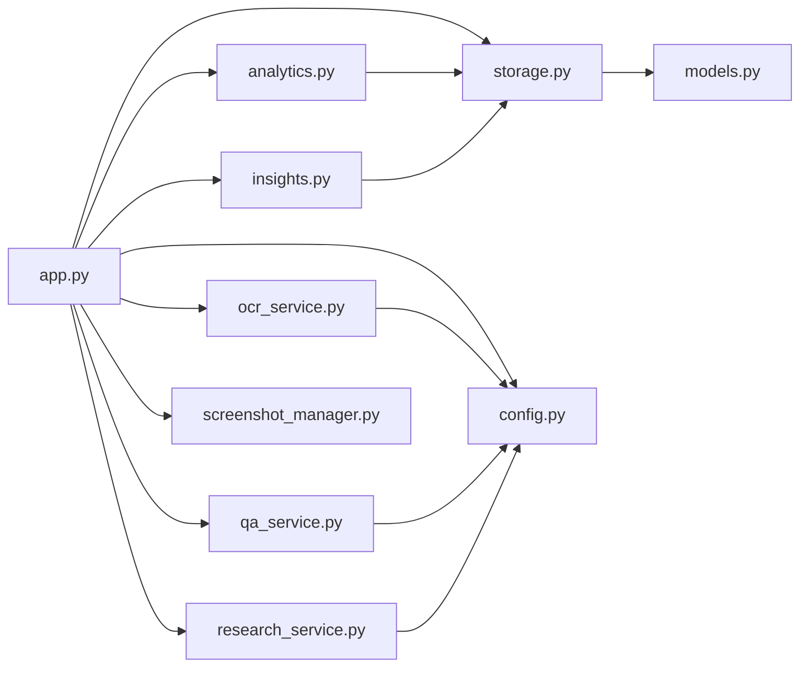

**Diagram sources**
- [app.py:10-19](file://app.py#L10-L19)
- [src/ocr_service.py:8-9](file://src/ocr_service.py#L8-L9)
- [src/qa_service.py:6-9](file://src/qa_service.py#L6-L9)
- [src/research_service.py:6-7](file://src/research_service.py#L6-L7)
- [src/analytics.py:8-10](file://src/analytics.py#L8-L10)
- [src/insights.py:5-8](file://src/insights.py#L5-L8)
- [src/storage.py:6-7](file://src/storage.py#L6-L7)
- [src/models.py:2-4](file://src/models.py#L2-L4)

**Section sources**
- [app.py:10-19](file://app.py#L10-L19)
- [src/ocr_service.py:8-9](file://src/ocr_service.py#L8-L9)
- [src/qa_service.py:6-9](file://src/qa_service.py#L6-L9)
- [src/research_service.py:6-7](file://src/research_service.py#L6-L7)
- [src/analytics.py:8-10](file://src/analytics.py#L8-L10)
- [src/insights.py:5-8](file://src/insights.py#L5-L8)
- [src/storage.py:6-7](file://src/storage.py#L6-L7)
- [src/models.py:2-4](file://src/models.py#L2-L4)

## Performance Considerations
- Data loading: DataStore loads entire datasets; consider pagination or filtering for large datasets.
- Visualization: Plotly figures are generated on-demand; defer heavy computations until selections are made.
- OCR latency: External API calls introduce network latency; cache results where appropriate.
- Caching: ResearchService maintains a cache to reduce repeated searches.
- Thumbnails: Lazy thumbnail generation avoids unnecessary image processing.

## Troubleshooting Guide
- API configuration: Ensure environment variables for Alibaba Cloud are set; otherwise OCR/QA will report configuration warnings.
- Data export/import: Verify JSON structure and handle exceptions during restore.
- Duplicate screenshots: Filename and checksum checks prevent duplicates; review logs for duplicate detection messages.
- Validation errors: OCR validation errors are surfaced with detailed messages; correct OCR extractions accordingly.

**Section sources**
- [app.py:442-446](file://app.py#L442-L446)
- [app.py:429-438](file://app.py#L429-L438)
- [src/screenshot_manager.py:52-68](file://src/screenshot_manager.py#L52-L68)
- [src/ocr_service.py:107-116](file://src/ocr_service.py#L107-L116)

## Conclusion
The platform demonstrates a clean service-oriented architecture with a Streamlit UI controller, well-defined services, robust data models, and a repository pattern for persistence. The modular design enables straightforward extension and maintenance. Following the established patterns—repository abstractions, service encapsulation, environment-driven configuration, and explicit validation—will ensure new features integrate smoothly.

## Appendices

### Naming Conventions and File Organization Principles
- Modules: Lowercase with underscores (e.g., storage.py, analytics.py)
- Classes: PascalCase (e.g., DataStore, PerformanceAnalytics)
- Functions: snake_case (e.g., validate_swim_event_data)
- Constants: UPPERCASE (e.g., TIME_FORMAT_MM_SS)
- Files: One primary class per module (e.g., DataStore in storage.py)
- Services: Single responsibility per service class

### Dependency Injection Patterns
- Environment configuration injected via config.py
- Services instantiated per-use or in session state for stateful services (e.g., QAService)
- Repositories accessed statically through classmethods for stateless operations

### Integration Guidelines for New Features
- Define a new service class under src/ with a focused responsibility
- Add any required models to models.py or reuse existing ones
- Implement repository interactions via DataStore or ScreenshotIndex
- Expose functionality in app.py by adding a new page handler and navigation button
- Add configuration constants to config.py if needed
- Validate data using existing validators in validation.py
- Example integration steps:
  - Create src/new_feature_service.py with a NewFeatureService class
  - Add new page handler in app.py under the switch_page routing
  - Instantiate and use the service within the handler
  - Persist or retrieve data via DataStore methods
  - Add any new constants to config.py

**Section sources**
- [src/config.py:1-29](file://src/config.py#L1-L29)
- [app.py:40-54](file://app.py#L40-L54)
- [src/validation.py:1-103](file://src/validation.py#L1-L103)
- [src/storage.py:10-107](file://src/storage.py#L10-L107)