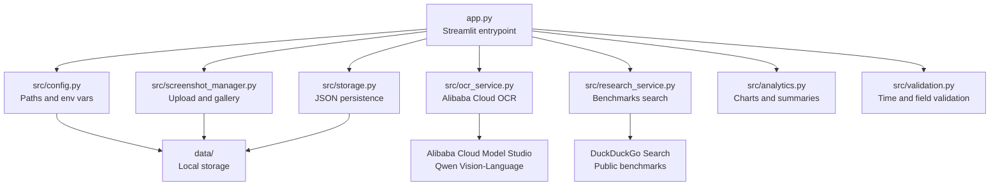
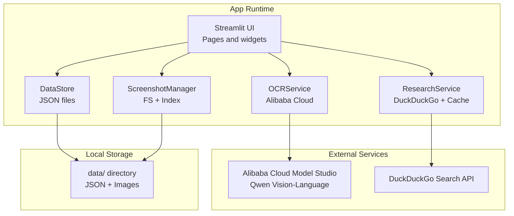
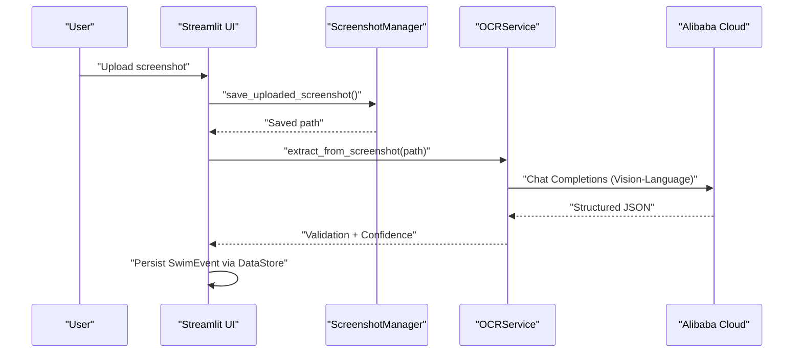
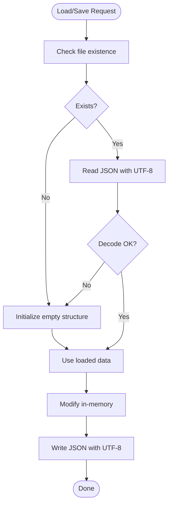
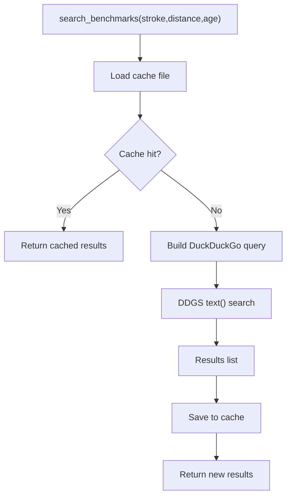

# Deployment Guide

<cite>
**Referenced Files in This Document**
- [app.py](file://app.py)
- [requirements.txt](file://requirements.txt)
- [src/config.py](file://src/config.py)
- [src/storage.py](file://src/storage.py)
- [src/screenshot_manager.py](file://src/screenshot_manager.py)
- [src/ocr_service.py](file://src/ocr_service.py)
- [src/research_service.py](file://src/research_service.py)
- [src/validation.py](file://src/validation.py)
- [README.md](file://README.md)
</cite>

## Table of Contents
1. [Introduction](#introduction)
2. [Project Structure](#project-structure)
3. [Core Components](#core-components)
4. [Architecture Overview](#architecture-overview)
5. [Detailed Component Analysis](#detailed-component-analysis)
6. [Environment Configuration](#environment-configuration)
7. [Deployment Options](#deployment-options)
8. [Production Considerations](#production-considerations)
9. [Troubleshooting Guide](#troubleshooting-guide)
10. [Performance Considerations](#performance-considerations)
11. [Conclusion](#conclusion)

## Introduction
This guide provides comprehensive deployment instructions for the Swimming Data Analysis Platform. It covers local development, cloud deployment via Streamlit Cloud, and containerization approaches. It also documents environment configuration for API keys, file system permissions, and data directory setup; production considerations for security, backups, and monitoring; and troubleshooting steps for common issues such as missing dependencies, permission errors, and API connectivity problems.

## Project Structure
The application is a Streamlit-based web app with modular Python packages under src/. Data is persisted locally under the data/ directory. The main entry point is app.py, which orchestrates UI pages and integrates OCR, analytics, research, and storage services.

**Diagram sources**
- [app.py:1-447](file://app.py#L1-L447)
- [src/config.py:1-29](file://src/config.py#L1-L29)
- [src/storage.py:1-107](file://src/storage.py#L1-L107)
- [src/screenshot_manager.py:1-136](file://src/screenshot_manager.py#L1-L136)
- [src/ocr_service.py:1-144](file://src/ocr_service.py#L1-L144)
- [src/research_service.py:1-94](file://src/research_service.py#L1-L94)
- [src/analytics.py:1-184](file://src/analytics.py#L1-L184)
- [src/validation.py:1-103](file://src/validation.py#L1-L103)

**Section sources**
- [app.py:1-447](file://app.py#L1-L447)
- [README.md:1-63](file://README.md#L1-L63)

## Core Components
- Streamlit UI and routing: app.py defines pages and integrates services.
- Configuration and paths: src/config.py centralizes paths and environment variables.
- Data persistence: src/storage.py manages JSON-backed datasets for swim events and body metrics, plus screenshot index.
- Screenshot management: src/screenshot_manager.py handles uploads, deduplication, thumbnails, and deletion.
- OCR extraction: src/ocr_service.py uses Alibaba Cloud Model Studio via OpenAI-compatible client.
- Research and benchmarks: src/research_service.py caches DuckDuckGo search results.
- Analytics: src/analytics.py computes dashboards, charts, and summaries.
- Validation: src/validation.py validates time formats and required fields.

**Section sources**
- [app.py:1-447](file://app.py#L1-L447)
- [src/config.py:1-29](file://src/config.py#L1-L29)
- [src/storage.py:1-107](file://src/storage.py#L1-L107)
- [src/screenshot_manager.py:1-136](file://src/screenshot_manager.py#L1-L136)
- [src/ocr_service.py:1-144](file://src/ocr_service.py#L1-L144)
- [src/research_service.py:1-94](file://src/research_service.py#L1-L94)
- [src/analytics.py:1-184](file://src/analytics.py#L1-L184)
- [src/validation.py:1-103](file://src/validation.py#L1-L103)

## Architecture Overview
The platform is a single-process Streamlit app with local file-based persistence. OCR relies on Alibaba Cloud Model Studio, and research comparison leverages DuckDuckGo search with local caching.

**Diagram sources**
- [app.py:1-447](file://app.py#L1-L447)
- [src/ocr_service.py:1-144](file://src/ocr_service.py#L1-L144)
- [src/research_service.py:1-94](file://src/research_service.py#L1-L94)
- [src/storage.py:1-107](file://src/storage.py#L1-L107)
- [src/screenshot_manager.py:1-136](file://src/screenshot_manager.py#L1-L136)
- [src/config.py:1-29](file://src/config.py#L1-L29)

## Detailed Component Analysis

### OCR Extraction Workflow
End-to-end flow for extracting structured swimming data from screenshots using Alibaba Cloud.

**Diagram sources**
- [app.py:60-120](file://app.py#L60-L120)
- [src/screenshot_manager.py:26-82](file://src/screenshot_manager.py#L26-L82)
- [src/ocr_service.py:49-119](file://src/ocr_service.py#L49-L119)

**Section sources**
- [app.py:60-120](file://app.py#L60-L120)
- [src/screenshot_manager.py:26-82](file://src/screenshot_manager.py#L26-L82)
- [src/ocr_service.py:49-119](file://src/ocr_service.py#L49-L119)

### Data Persistence Flow
JSON-based persistence for swim events, body metrics, and screenshot index.

**Diagram sources**
- [src/storage.py:14-27](file://src/storage.py#L14-L27)
- [src/storage.py:67-81](file://src/storage.py#L67-L81)

**Section sources**
- [src/storage.py:10-107](file://src/storage.py#L10-L107)

### Research Benchmark Search
Search and cache mechanism for public benchmarks.

**Diagram sources**
- [src/research_service.py:32-53](file://src/research_service.py#L32-L53)

**Section sources**
- [src/research_service.py:10-94](file://src/research_service.py#L10-L94)

## Environment Configuration
- Python runtime and dependencies: Install per requirements.txt.
- Alibaba Cloud API key: Required for OCR. Set the environment variable before launching.
- Base URL and model names: Optional overrides for Alibaba Cloud endpoint and model selection.
- Data directories: Automatically created on first run; ensure write permissions for the app process.

Key environment variables and defaults:
- ALIBABA_CLOUD_API_KEY: Empty by default; must be set for OCR.
- ALIBABA_CLOUD_BASE_URL: Defaults to Alibaba Cloud compatible endpoint.
- QWEN_MODEL_NAME: Defaults to a vision-language model suitable for screenshots.
- QWEN_TEXT_MODEL_NAME: Defaults to a text model for non-image prompts.

Directory layout:
- data/: Root for all persisted data.
- data/screenshots/: Organized by meet and date; thumbnails derived from images.
- data/swim_events.json: Structured race results.
- data/body_metrics.json: Body measurements with computed BMI.
- data/research_cache.json: Cached DuckDuckGo search results.

Permissions:
- The app creates directories and writes JSON and images. Ensure the user running the app has read/write permissions to the data/ directory.

**Section sources**
- [requirements.txt:1-10](file://requirements.txt#L1-L10)
- [src/config.py:16-28](file://src/config.py#L16-L28)
- [README.md:15-39](file://README.md#L15-L39)

## Deployment Options

### Local Server Setup
- Install dependencies: pip install -r requirements.txt
- Set environment variables:
  - ALIBABA_CLOUD_API_KEY: Your Alibaba Cloud API key
  - Optionally override base URL and model names
- Launch the app: streamlit run app.py
- Access the UI at the local Streamlit address shown in the terminal.

Operational notes:
- The app initializes directories and persists data under data/.
- For development, you can import/export data via the UI’s Data Management panel.

**Section sources**
- [README.md:15-31](file://README.md#L15-L31)
- [requirements.txt:1-10](file://requirements.txt#L1-L10)
- [src/config.py:16-28](file://src/config.py#L16-L28)

### Streamlit Cloud Deployment
- Prepare a repository with app.py, requirements.txt, and src/ directory.
- Configure secrets:
  - Add ALIBABA_CLOUD_API_KEY in the app’s secret settings.
  - Optionally configure ALIBABA_CLOUD_BASE_URL and model names if using a custom endpoint.
- Push to your Git host and connect to Streamlit Cloud.
- Streamlit Cloud will install dependencies from requirements.txt and run the app via streamlit run app.py.

External API considerations:
- Alibaba Cloud Model Studio is accessed via HTTPS; ensure outbound HTTPS egress is permitted in your deployment environment.
- The app performs OCR requests and DuckDuckGo searches; network connectivity is required.

**Section sources**
- [README.md:15-31](file://README.md#L15-L31)
- [src/ocr_service.py:15-20](file://src/ocr_service.py#L15-L20)
- [src/research_service.py:44-53](file://src/research_service.py#L44-L53)

### Containerization Approach
- Base image: Use a Python slim image appropriate for your platform.
- Copy repository contents into the container.
- Install dependencies: pip install -r requirements.txt
- Set environment variables:
  - ALIBABA_CLOUD_API_KEY
  - Optional: ALIBABA_CLOUD_BASE_URL, QWEN_MODEL_NAME, QWEN_TEXT_MODEL_NAME
- Expose port 8501 (default Streamlit port) and run streamlit run app.py --server.port 8501.
- Mount a persistent volume to /app/data to persist JSON and images across restarts.
- Health checks: Probe the Streamlit server endpoint.

Networking:
- Outbound HTTPS access is required for Alibaba Cloud and DuckDuckGo.
- If behind a proxy, configure the environment accordingly.

Security:
- Store secrets externally (e.g., container secrets or orchestration secret stores).
- Limit exposed ports and consider TLS termination at an ingress controller.

**Section sources**
- [requirements.txt:1-10](file://requirements.txt#L1-L10)
- [src/config.py:21-24](file://src/config.py#L21-L24)
- [src/ocr_service.py:15-20](file://src/ocr_service.py#L15-L20)
- [src/research_service.py:44-53](file://src/research_service.py#L44-L53)

## Production Considerations

### Security Configurations
- Secrets management:
  - Store ALIBABA_CLOUD_API_KEY and any other sensitive values in secure secret stores or platform-specific secret managers.
  - Avoid committing secrets to version control.
- Least privilege:
  - Run the app with minimal required filesystem permissions.
  - Restrict network egress to necessary endpoints only.
- Input validation:
  - The app validates time formats and required fields; ensure this remains intact in production deployments.

### Backup Strategies
- Data export/import:
  - Use the built-in export/import functionality to back up and restore data as JSON archives.
- Filesystem snapshots:
  - Back up the data/ directory regularly, including images and JSON files.
- Offsite storage:
  - Store backups offsite or in a separate region for disaster recovery.

### Monitoring Approaches
- Logs:
  - Capture Streamlit logs and application logs for errors and warnings.
- Health checks:
  - Monitor the Streamlit server availability and basic OCR/search health.
- Metrics:
  - Track data growth (images and JSON sizes) and API latency for OCR and search.

**Section sources**
- [app.py:405-447](file://app.py#L405-L447)
- [src/storage.py:24-27](file://src/storage.py#L24-L27)
- [src/screenshot_manager.py:90-100](file://src/screenshot_manager.py#L90-L100)

## Troubleshooting Guide

Common issues and resolutions:
- Missing Alibaba Cloud API key:
  - Symptom: OCR fails with a configuration warning.
  - Resolution: Set ALIBABA_CLOUD_API_KEY and redeploy.
- Permission errors on data directory:
  - Symptom: Failures to create directories or write JSON/images.
  - Resolution: Ensure the app process has read/write permissions to the data/ directory.
- Network connectivity problems:
  - Symptom: OCR or DuckDuckGo search timeouts or failures.
  - Resolution: Verify outbound HTTPS access; retry after confirming network health.
- JSON decode errors:
  - Symptom: Errors loading swim_events.json or body_metrics.json.
  - Resolution: Restore from a recent backup or fix corruption; confirm UTF-8 encoding.
- Duplicate screenshot handling:
  - Symptom: Upload rejected due to duplicate.
  - Resolution: Check checksum or filename; remove duplicates from the index if necessary.

Validation and diagnostics:
- Time format validation: Ensure times conform to MM:SS.ss or SS.ss.
- Required fields: Missing date, meet_name, stroke, distance, or time will cause validation errors.
- API status indicator: The UI displays whether the Alibaba Cloud key is configured.

**Section sources**
- [app.py:441-447](file://app.py#L441-L447)
- [src/ocr_service.py:55-56](file://src/ocr_service.py#L55-L56)
- [src/validation.py:7-23](file://src/validation.py#L7-L23)
- [src/validation.py:62-72](file://src/validation.py#L62-L72)
- [src/storage.py:18-21](file://src/storage.py#L18-L21)

## Performance Considerations
- Reduce OCR latency:
  - Keep images appropriately sized; very large images increase processing time.
  - Batch uploads and avoid excessive concurrent OCR calls.
- Caching:
  - Research results are cached locally; leverage cache to minimize repeated searches.
- Data locality:
  - Persist data on fast local disks or mounted volumes for frequent reads/writes.
- Concurrency:
  - Streamlit runs a single-threaded server by default; scale horizontally with multiple replicas behind a load balancer if needed.
- Model selection:
  - Choose appropriate Alibaba Cloud models for accuracy and speed trade-offs.

[No sources needed since this section provides general guidance]

## Conclusion
This guide outlined how to deploy the Swimming Data Analysis Platform across local, cloud, and containerized environments. It emphasized environment configuration for API keys and data directories, highlighted production concerns around security, backups, and monitoring, and provided targeted troubleshooting steps. By following these practices, you can reliably operate the platform in development and production settings.