# Development Guide

<cite>
**Referenced Files in This Document**
- [README.md](file://README.md)
- [app.py](file://app.py)
- [requirements.txt](file://requirements.txt)
- [src/__init__.py](file://src/__init__.py)
- [src/config.py](file://src/config.py)
- [src/models.py](file://src/models.py)
- [src/storage.py](file://src/storage.py)
- [src/screenshot_manager.py](file://src/screenshot_manager.py)
- [src/ocr_service.py](file://src/ocr_service.py)
- [src/validation.py](file://src/validation.py)
- [src/analytics.py](file://src/analytics.py)
- [src/insights.py](file://src/insights.py)
- [src/research_service.py](file://src/research_service.py)
- [src/qa_service.py](file://src/qa_service.py)
</cite>

## Table of Contents
1. [Introduction](#introduction)
2. [Project Structure](#project-structure)
3. [Core Components](#core-components)
4. [Architecture Overview](#architecture-overview)
5. [Detailed Component Analysis](#detailed-component-analysis)
6. [Dependency Analysis](#dependency-analysis)
7. [Performance Considerations](#performance-considerations)
8. [Testing Strategy](#testing-strategy)
9. [Development Workflow](#development-workflow)
10. [Deployment Instructions](#deployment-instructions)
11. [Code Quality and Contribution Guidelines](#code-quality-and-contribution-guidelines)
12. [Troubleshooting Guide](#troubleshooting-guide)
13. [Conclusion](#conclusion)
14. [Appendices](#appendices)

## Introduction
This guide documents how to contribute to the Swimming Data Analysis Platform. It explains the codebase structure, architectural patterns, testing strategy, development workflow, deployment steps, and quality standards. The platform is a local Streamlit application that ingests swimming meet screenshots, extracts structured race data via AI, tracks body metrics, performs analytics, compares against benchmarks, generates insights, and supports Q&A.

## Project Structure
The repository follows a feature-layered organization:
- src/: Core application modules (services, models, storage, analytics)
- data/: Local JSON storage for swim events, body metrics, screenshot index, and research cache
- assets/, openspec/: Supporting assets and specification artifacts
- app.py: Streamlit entrypoint implementing UI pages and orchestration
- requirements.txt: Dependencies

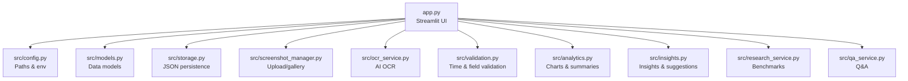

**Diagram sources**
- [app.py:1-447](file://app.py#L1-L447)
- [src/config.py:1-29](file://src/config.py#L1-L29)
- [src/models.py:1-55](file://src/models.py#L1-L55)
- [src/storage.py:1-107](file://src/storage.py#L1-L107)
- [src/screenshot_manager.py:1-136](file://src/screenshot_manager.py#L1-L136)
- [src/ocr_service.py:1-144](file://src/ocr_service.py#L1-L144)
- [src/validation.py:1-103](file://src/validation.py#L1-L103)
- [src/analytics.py:1-184](file://src/analytics.py#L1-L184)
- [src/insights.py:1-150](file://src/insights.py#L1-L150)
- [src/research_service.py:1-94](file://src/research_service.py#L1-L94)
- [src/qa_service.py:1-174](file://src/qa_service.py#L1-L174)

**Section sources**
- [README.md:1-63](file://README.md#L1-L63)
- [app.py:1-447](file://app.py#L1-L447)
- [src/config.py:1-29](file://src/config.py#L1-L29)

## Core Components
- Data models: SwimEvent and BodyMetrics define the persisted entities with serialization helpers.
- Storage: DataStore persists SwimEvent and BodyMetrics as JSON; ScreenshotIndex manages screenshot metadata.
- Services:
  - OCRService: Vision-language extraction from screenshots using Alibaba Cloud.
  - QAService: Natural language Q&A using structured data context.
  - ResearchService: DuckDuckGo search for benchmarks with caching.
  - Analytics: Time progression, stroke comparison, personal bests, and dashboard summary.
  - Insights: Trend analysis, strengths/weaknesses, potential assessment, training suggestions.
  - ScreenshotManager: Upload, deduplication, thumbnails, and gallery operations.
- Validation: Time parsing/format validation and required-field checks.
- UI Orchestration: app.py coordinates pages, session state, and service integrations.

**Section sources**
- [src/models.py:1-55](file://src/models.py#L1-L55)
- [src/storage.py:1-107](file://src/storage.py#L1-L107)
- [src/ocr_service.py:1-144](file://src/ocr_service.py#L1-L144)
- [src/qa_service.py:1-174](file://src/qa_service.py#L1-L174)
- [src/research_service.py:1-94](file://src/research_service.py#L1-L94)
- [src/analytics.py:1-184](file://src/analytics.py#L1-L184)
- [src/insights.py:1-150](file://src/insights.py#L1-L150)
- [src/screenshot_manager.py:1-136](file://src/screenshot_manager.py#L1-L136)
- [src/validation.py:1-103](file://src/validation.py#L1-L103)
- [app.py:1-447](file://app.py#L1-L447)

## Architecture Overview
The system is a Streamlit desktop app with a modular service layer:
- UI layer: app.py renders pages and orchestrates service calls.
- Service layer: specialized services encapsulate domain logic.
- Persistence layer: JSON files under data/.
- External integrations: Alibaba Cloud APIs for OCR/Q&A, DuckDuckGo for benchmarks.

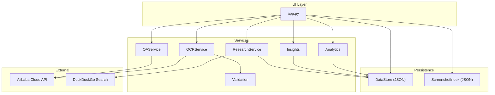

**Diagram sources**
- [app.py:1-447](file://app.py#L1-L447)
- [src/ocr_service.py:1-144](file://src/ocr_service.py#L1-L144)
- [src/qa_service.py:1-174](file://src/qa_service.py#L1-L174)
- [src/research_service.py:1-94](file://src/research_service.py#L1-L94)
- [src/analytics.py:1-184](file://src/analytics.py#L1-L184)
- [src/insights.py:1-150](file://src/insights.py#L1-L150)
- [src/storage.py:1-107](file://src/storage.py#L1-L107)
- [src/validation.py:1-103](file://src/validation.py#L1-L103)

## Detailed Component Analysis

### Data Models
SwimEvent and BodyMetrics are dataclasses with to_dict/from_dict helpers and a BMI property for BodyMetrics.

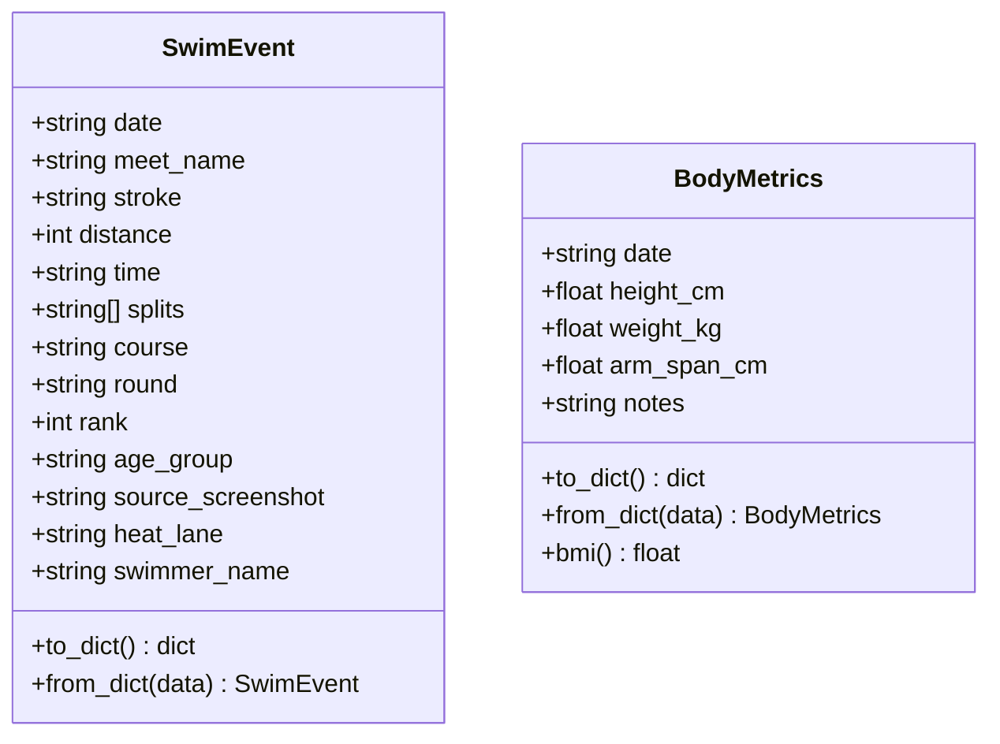

**Diagram sources**
- [src/models.py:7-55](file://src/models.py#L7-L55)

**Section sources**
- [src/models.py:1-55](file://src/models.py#L1-L55)

### Storage Layer
DataStore persists SwimEvent and BodyMetrics as JSON arrays. ScreenshotIndex maintains a JSON index of screenshots with metadata and checksums.

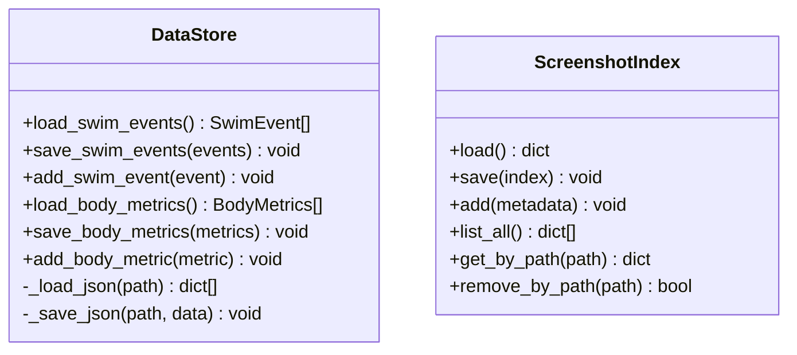

**Diagram sources**
- [src/storage.py:10-107](file://src/storage.py#L10-L107)

**Section sources**
- [src/storage.py:1-107](file://src/storage.py#L1-L107)

### Screenshot Manager
Handles upload, deduplication by filename and checksum, thumbnail generation, and gallery operations.

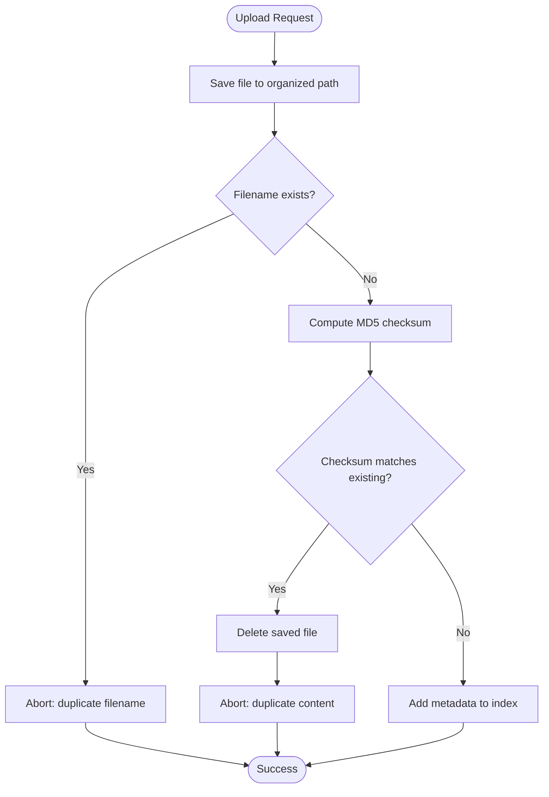

**Diagram sources**
- [src/screenshot_manager.py:26-82](file://src/screenshot_manager.py#L26-L82)

**Section sources**
- [src/screenshot_manager.py:1-136](file://src/screenshot_manager.py#L1-L136)

### OCR Service
Encodes images and sends them to Alibaba Cloud’s vision-language model to extract structured race data. Validates output and attaches confidence/error metadata.

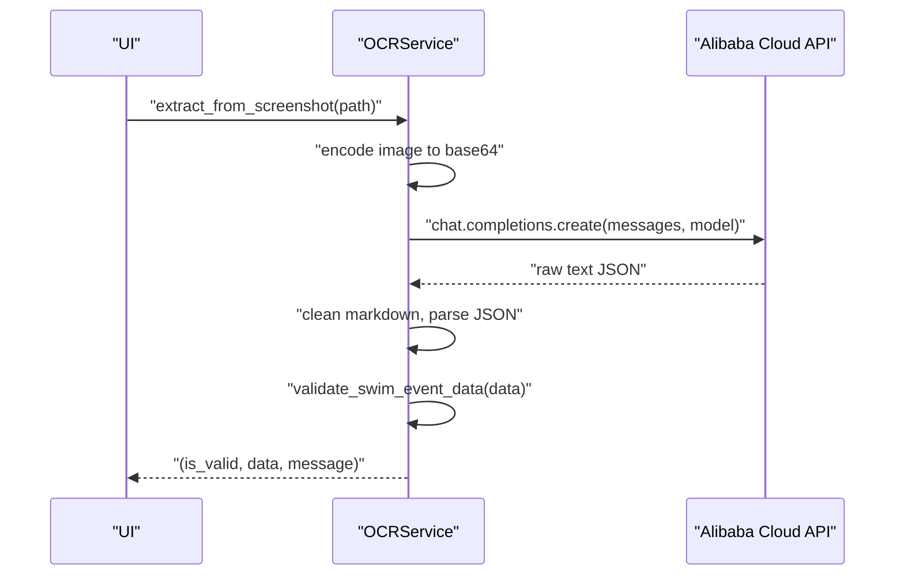

**Diagram sources**
- [src/ocr_service.py:49-119](file://src/ocr_service.py#L49-L119)

**Section sources**
- [src/ocr_service.py:1-144](file://src/ocr_service.py#L1-L144)

### QA Service
Builds a structured context from stored data and conversation history, classifies queries, and responds using the text model.

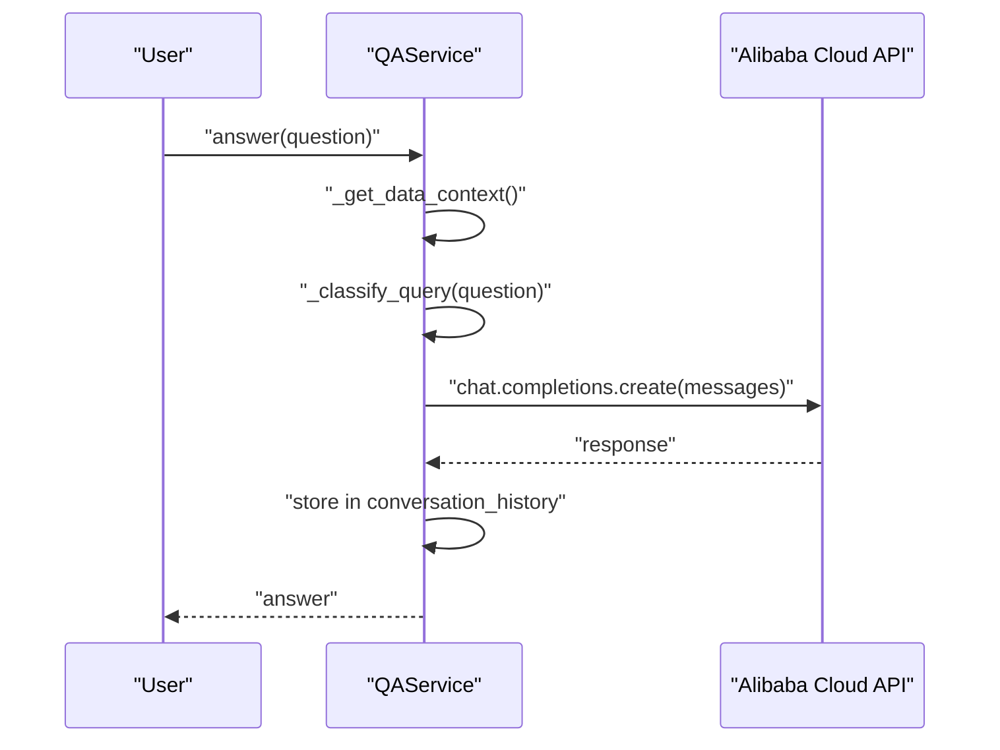

**Diagram sources**
- [src/qa_service.py:76-134](file://src/qa_service.py#L76-L134)

**Section sources**
- [src/qa_service.py:1-174](file://src/qa_service.py#L1-L174)

### Research Service
Searches benchmarks via DuckDuckGo, caches results, and compares personal bests.

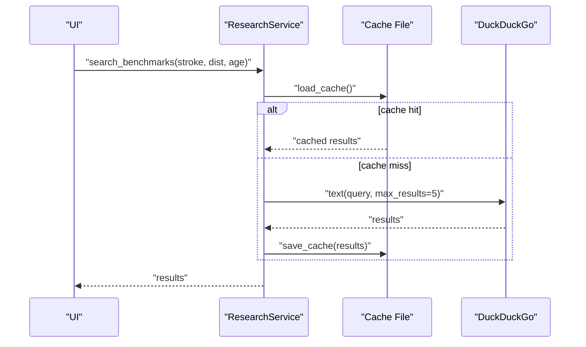

**Diagram sources**
- [src/research_service.py:31-54](file://src/research_service.py#L31-L54)

**Section sources**
- [src/research_service.py:1-94](file://src/research_service.py#L1-L94)

### Analytics
Provides dashboards, time progression charts, stroke comparison radar, personal bests, and summary statistics.

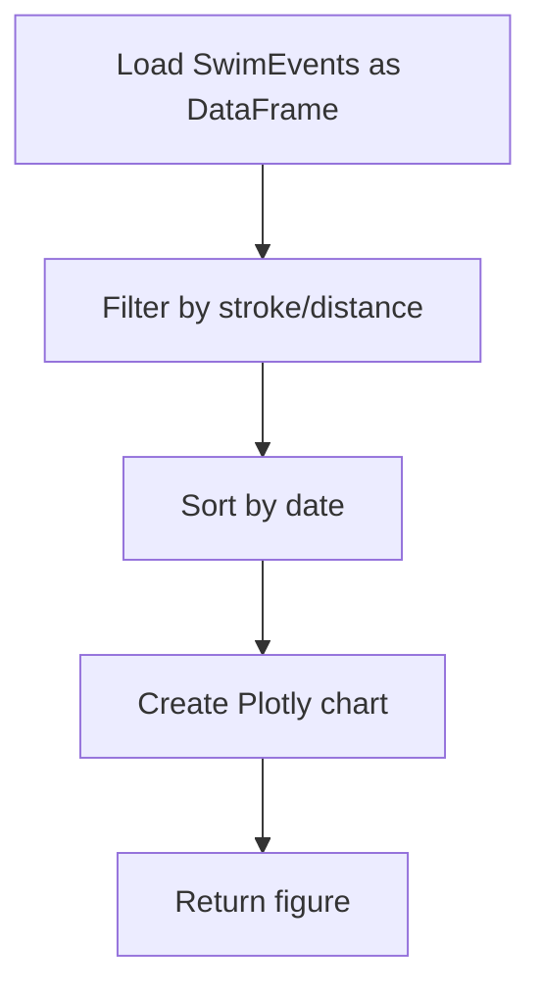

**Diagram sources**
- [src/analytics.py:30-60](file://src/analytics.py#L30-L60)

**Section sources**
- [src/analytics.py:1-184](file://src/analytics.py#L1-L184)

### Insights
Generates trend insights, identifies strengths/weaknesses, assesses potential, and suggests drills.

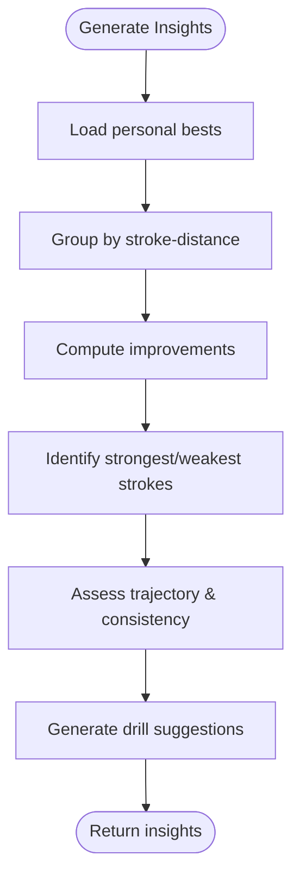

**Diagram sources**
- [src/insights.py:14-120](file://src/insights.py#L14-L120)

**Section sources**
- [src/insights.py:1-150](file://src/insights.py#L1-L150)

### Validation Utilities
Ensures time formats and required fields are valid.

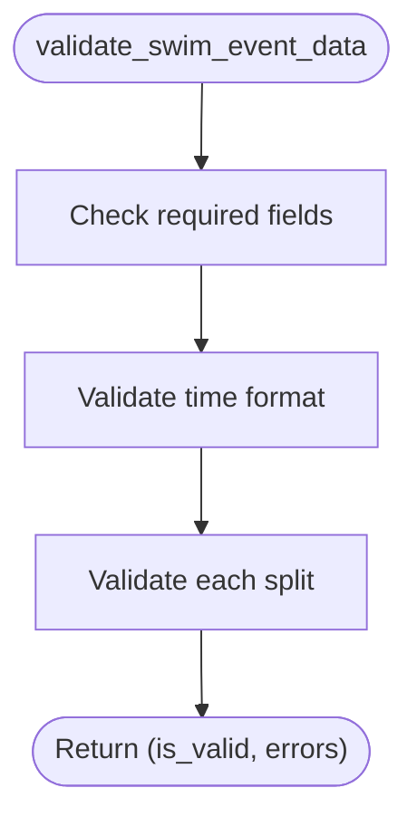

**Diagram sources**
- [src/validation.py:75-103](file://src/validation.py#L75-L103)

**Section sources**
- [src/validation.py:1-103](file://src/validation.py#L1-L103)

## Dependency Analysis
Key internal dependencies:
- app.py depends on all services and storage.
- Services depend on models, storage, and validation.
- Analytics and Insights depend on DataStore and validation.
- ResearchService depends on DataStore and external DuckDuckGo.
- OCRService and QAService depend on external Alibaba Cloud.

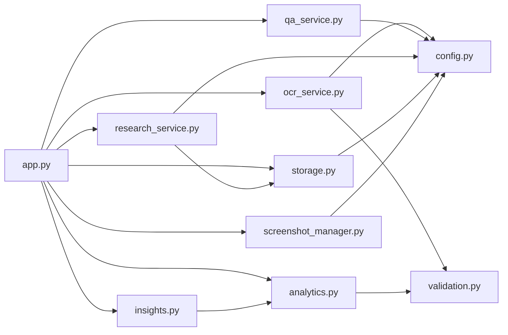

**Diagram sources**
- [app.py:1-447](file://app.py#L1-L447)
- [src/storage.py:1-107](file://src/storage.py#L1-L107)
- [src/screenshot_manager.py:1-136](file://src/screenshot_manager.py#L1-L136)
- [src/ocr_service.py:1-144](file://src/ocr_service.py#L1-L144)
- [src/analytics.py:1-184](file://src/analytics.py#L1-L184)
- [src/insights.py:1-150](file://src/insights.py#L1-L150)
- [src/research_service.py:1-94](file://src/research_service.py#L1-L94)
- [src/qa_service.py:1-174](file://src/qa_service.py#L1-L174)
- [src/validation.py:1-103](file://src/validation.py#L1-L103)
- [src/config.py:1-29](file://src/config.py#L1-L29)

**Section sources**
- [app.py:1-447](file://app.py#L1-L447)
- [src/config.py:1-29](file://src/config.py#L1-L29)

## Performance Considerations
- JSON I/O: DataStore writes entire arrays on each write; consider batching writes for bulk operations.
- Image processing: Thumbnail generation uses Pillow; avoid repeated resampling by caching images.
- API calls: OCR and Q&A calls are network-bound; add retry/backoff and consider local caching for repeated prompts.
- Analytics: Convert to DataFrame once per report; reuse computed series to avoid recomputation.
- UI reruns: Minimize unnecessary st.rerun() calls and keep heavy computations outside render path.

## Testing Strategy
Current state: No dedicated tests directory was found in the repository snapshot. Recommended approach:
- Unit tests: Use pytest to test services (OCRService, QAService, ResearchService, Analytics, Insights) with mocked external APIs and file system.
- Integration tests: Verify end-to-end flows (upload → OCR → validation → persistence → analytics).
- Mocking: Replace Alibaba Cloud client and DuckDuckGo with fakes; stub file system for storage tests.
- Coverage: Aim for >80% coverage on services and utilities.
- CI: Add a GitHub Actions workflow to run tests on push and pull requests.

## Development Workflow
Local setup
- Install dependencies: pip install -r requirements.txt
- Set environment: export ALIBABA_CLOUD_API_KEY="your-api-key"
- Run: streamlit run app.py

Debugging tips
- Enable Streamlit’s developer mode and logs.
- Use st.exception() around service calls to surface exceptions.
- Log API responses and errors for OCR/QA.
- Validate time formats early in the pipeline to fail fast.

Code review checklist
- Clear separation of concerns (UI vs services vs storage).
- Proper error handling and user-friendly messages.
- Minimal duplication; reuse validation and analytics utilities.
- Environment variables for secrets; no hardcoded credentials.

**Section sources**
- [README.md:15-31](file://README.md#L15-L31)
- [requirements.txt:1-10](file://requirements.txt#L1-10)
- [app.py:36-402](file://app.py#L36-L402)

## Deployment Instructions
Local/desktop
- Package as a Streamlit app; ensure data/ directory is included.
- Distribute with Python 3.9+ and installed requirements.

Production considerations
- Secrets management: Store API keys in environment variables or a secrets manager.
- Data backup: Automate JSON exports and offsite backups.
- Rate limits: Respect Alibaba Cloud and DuckDuckGo quotas; implement retries with backoff.
- Monitoring: Add basic logging and health checks for API connectivity.

[No sources needed since this section provides general guidance]

## Code Quality and Contribution Guidelines
Standards
- Naming: Use snake_case for modules and functions; PascalCase for classes.
- Modules: One responsibility per module; keep services cohesive.
- Comments: Docstrings for public functions/classes; inline comments for complex logic.
- Imports: Group standard library, third-party, and local imports.

Documentation
- Update README.md for new features and breaking changes.
- Add module docstrings and function-level docs for public APIs.

Branching and PRs
- Feature branches; small, focused commits.
- Include tests and update docs.
- Request reviews from maintainers.

**Section sources**
- [src/__init__.py:1-2](file://src/__init__.py#L1-L2)

## Troubleshooting Guide
Common issues
- Missing API key: UI shows a warning; set ALIBABA_CLOUD_API_KEY and restart.
- OCR failures: Check image encoding and response parsing; validate time formats.
- Empty analytics: Ensure sufficient data; verify time formats and dates.
- Benchmark search errors: DuckDuckGo may rate limit; cache results and retry.

Where to look
- API status indicator in footer.
- Error messages returned by OCRService and QAService.
- Validation errors attached to extracted data.

**Section sources**
- [app.py:441-447](file://app.py#L441-L447)
- [src/ocr_service.py:49-119](file://src/ocr_service.py#L49-L119)
- [src/qa_service.py:76-134](file://src/qa_service.py#L76-L134)
- [src/validation.py:75-103](file://src/validation.py#L75-L103)

## Conclusion
This guide outlined the platform’s architecture, component responsibilities, and development practices. By following the structure and guidelines here, contributors can reliably add features, maintain quality, and deploy confidently.

## Appendices

### Adding a New Feature: Step-by-Step Example
- Define data model changes in models.py if needed.
- Extend storage in storage.py if persisting new entities.
- Implement service logic in a new module under src/.
- Integrate UI in app.py with appropriate page/tab.
- Add validation in validation.py if applicable.
- Write unit tests and integration tests.
- Update README.md with usage notes.

[No sources needed since this section provides general guidance]