# Development Workflow

<cite>
**Referenced Files in This Document**
- [README.md](file://README.md)
- [requirements.txt](file://requirements.txt)
- [.gitignore](file://.gitignore)
- [app.py](file://app.py)
- [src/config.py](file://src/config.py)
- [src/models.py](file://src/models.py)
- [src/storage.py](file://src/storage.py)
- [src/screenshot_manager.py](file://src/screenshot_manager.py)
- [src/validation.py](file://src/validation.py)
- [src/analytics.py](file://src/analytics.py)
- [src/ocr_service.py](file://src/ocr_service.py)
- [src/qa_service.py](file://src/qa_service.py)
- [src/research_service.py](file://src/research_service.py)
- [src/insights.py](file://src/insights.py)
</cite>

## Table of Contents
1. [Introduction](#introduction)
2. [Project Structure](#project-structure)
3. [Core Components](#core-components)
4. [Architecture Overview](#architecture-overview)
5. [Detailed Component Analysis](#detailed-component-analysis)
6. [Dependency Analysis](#dependency-analysis)
7. [Performance Considerations](#performance-considerations)
8. [Troubleshooting Guide](#troubleshooting-guide)
9. [Conclusion](#conclusion)
10. [Appendices](#appendices)

## Introduction
This document describes the complete development workflow for contributing to the Swimming Data Analysis Platform. It covers local setup, environment configuration, dependency installation, API key management, Git workflow, debugging techniques for Streamlit applications, code review and quality practices, and troubleshooting common development issues. The platform is a Streamlit-based application that ingests swimming meet screenshots, extracts structured race data via AI, tracks body metrics, performs analytics, compares against benchmarks, generates insights, and supports interactive Q&A.

## Project Structure
The repository follows a clear feature-based layout:
- Root-level application entry point and documentation
- Source modules under src/ implementing services, models, storage, and analytics
- Data directory for local persistence
- Assets and specification documents for design and planning

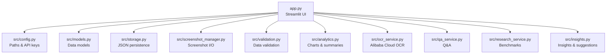

**Diagram sources**
- [app.py:1-447](file://app.py#L1-L447)
- [src/config.py:1-29](file://src/config.py#L1-L29)
- [src/models.py:1-55](file://src/models.py#L1-L55)
- [src/storage.py:1-107](file://src/storage.py#L1-L107)
- [src/screenshot_manager.py:1-136](file://src/screenshot_manager.py#L1-L136)
- [src/validation.py:1-103](file://src/validation.py#L1-L103)
- [src/analytics.py:1-184](file://src/analytics.py#L1-L184)
- [src/ocr_service.py:1-144](file://src/ocr_service.py#L1-L144)
- [src/qa_service.py:1-174](file://src/qa_service.py#L1-L174)
- [src/research_service.py:1-94](file://src/research_service.py#L1-L94)
- [src/insights.py:1-150](file://src/insights.py#L1-L150)

**Section sources**
- [README.md:1-63](file://README.md#L1-L63)
- [app.py:1-447](file://app.py#L1-L447)

## Core Components
- Streamlit application entry point orchestrating UI pages and session state
- Configuration module defining paths, environment variables, and time format patterns
- Data models for swim events and body metrics
- Storage layer managing JSON persistence for events, metrics, and screenshot index
- Screenshot manager handling upload, deduplication, thumbnails, and deletion
- Validation utilities for time formats and swim event data
- Analytics module generating charts, summaries, and performance metrics
- OCR service integrating Alibaba Cloud Model Studio for screenshot data extraction
- QA service enabling natural language questions about swimming data
- Research service searching benchmarks and caching results
- Insights generator producing trend analysis, strengths/weaknesses, and training suggestions

**Section sources**
- [app.py:1-447](file://app.py#L1-L447)
- [src/config.py:1-29](file://src/config.py#L1-L29)
- [src/models.py:1-55](file://src/models.py#L1-L55)
- [src/storage.py:1-107](file://src/storage.py#L1-L107)
- [src/screenshot_manager.py:1-136](file://src/screenshot_manager.py#L1-L136)
- [src/validation.py:1-103](file://src/validation.py#L1-L103)
- [src/analytics.py:1-184](file://src/analytics.py#L1-L184)
- [src/ocr_service.py:1-144](file://src/ocr_service.py#L1-L144)
- [src/qa_service.py:1-174](file://src/qa_service.py#L1-L174)
- [src/research_service.py:1-94](file://src/research_service.py#L1-L94)
- [src/insights.py:1-150](file://src/insights.py#L1-L150)

## Architecture Overview
The application is a Streamlit front-end backed by modular services:
- UI pages are rendered conditionally based on session state
- Services encapsulate domain logic and integrate with external APIs
- Local persistence is file-based JSON with explicit directories
- Environment variables configure third-party integrations

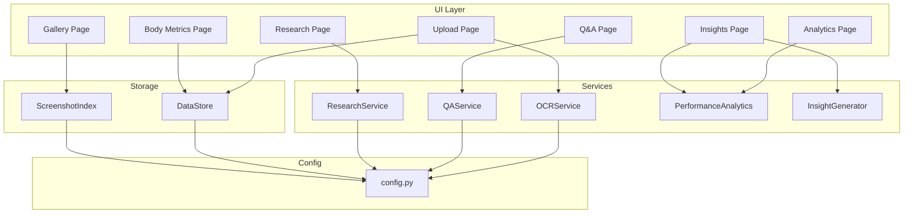

**Diagram sources**
- [app.py:60-403](file://app.py#L60-L403)
- [src/ocr_service.py:12-120](file://src/ocr_service.py#L12-L120)
- [src/qa_service.py:12-139](file://src/qa_service.py#L12-L139)
- [src/research_service.py:10-84](file://src/research_service.py#L10-L84)
- [src/analytics.py:13-183](file://src/analytics.py#L13-L183)
- [src/insights.py:11-149](file://src/insights.py#L11-L149)
- [src/storage.py:10-106](file://src/storage.py#L10-L106)
- [src/config.py:1-29](file://src/config.py#L1-L29)

## Detailed Component Analysis

### Streamlit Application and Session State
- Initializes page configuration and session state for navigation and chat history
- Implements a sidebar-driven navigation switching mechanism
- Pages include upload, gallery, body metrics, analytics, research, insights, and Q&A
- Integrates services for OCR extraction, analytics, research, insights, and Q&A
- Provides data export/import and API status indicators

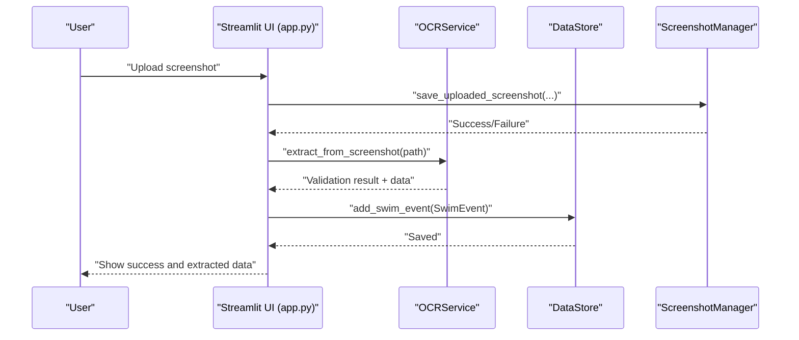

**Diagram sources**
- [app.py:60-127](file://app.py#L60-L127)
- [src/screenshot_manager.py:27-82](file://src/screenshot_manager.py#L27-L82)
- [src/ocr_service.py:49-116](file://src/ocr_service.py#L49-L116)
- [src/storage.py:40-44](file://src/storage.py#L40-L44)

**Section sources**
- [app.py:29-403](file://app.py#L29-L403)

### Configuration and Environment Variables
- Defines project paths and ensures directories exist
- Loads Alibaba Cloud API key and base URL from environment variables
- Exposes model names for vision and text models
- Provides time format regex patterns for validation

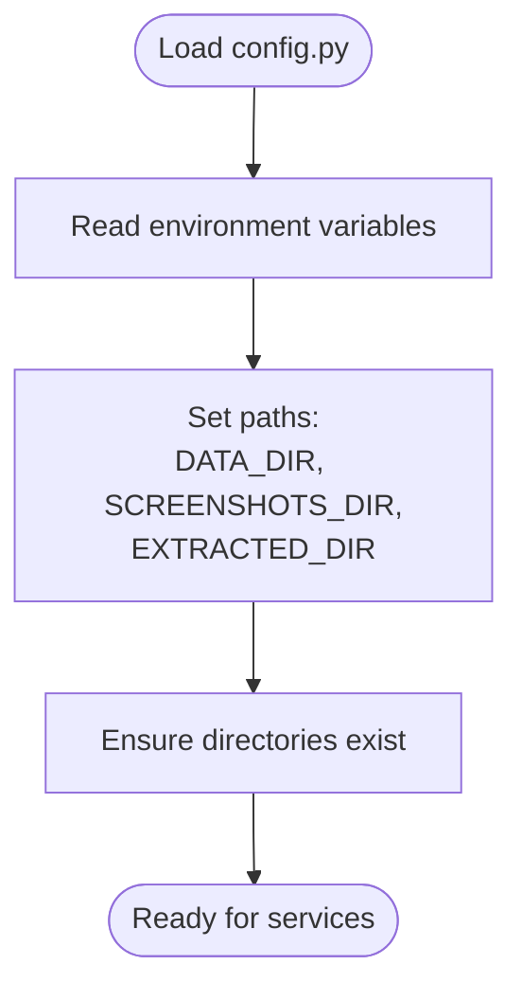

**Diagram sources**
- [src/config.py:1-29](file://src/config.py#L1-L29)

**Section sources**
- [src/config.py:1-29](file://src/config.py#L1-L29)

### Data Models
- SwimEvent captures race metadata and source reference
- BodyMetrics captures anthropometric data and computes BMI
- Both support serialization to/from dictionaries for persistence

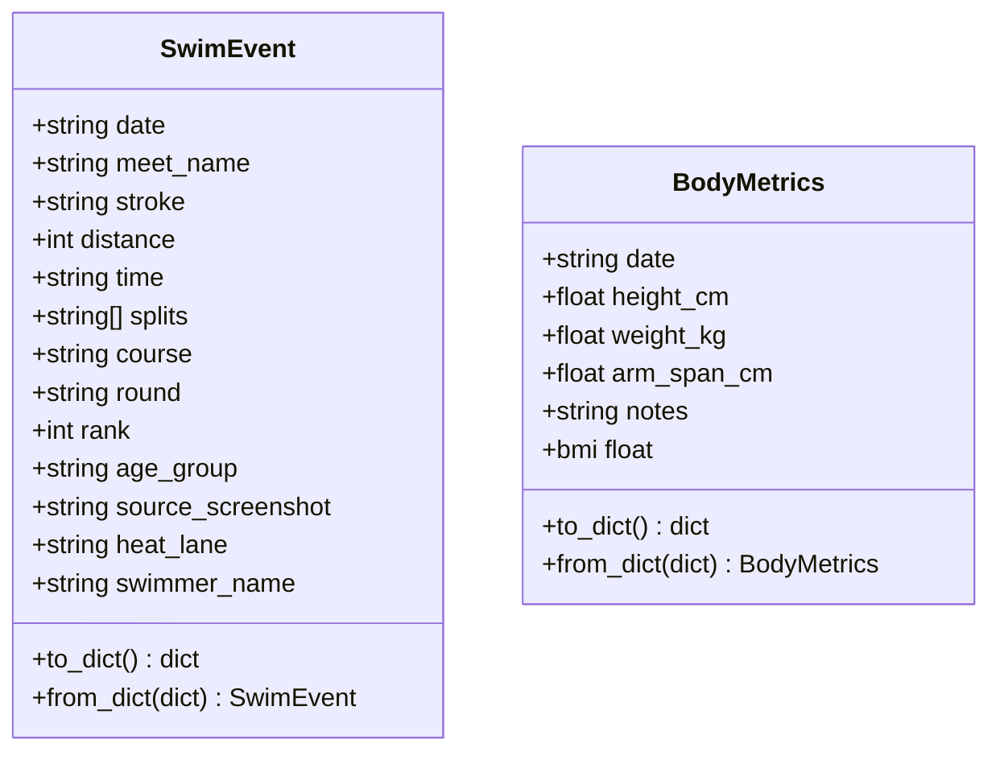

**Diagram sources**
- [src/models.py:7-55](file://src/models.py#L7-L55)

**Section sources**
- [src/models.py:1-55](file://src/models.py#L1-L55)

### Storage Layer
- DataStore persists SwimEvent and BodyMetrics as JSON
- ScreenshotIndex maintains metadata for screenshots and handles deduplication
- Robust error handling for missing or corrupted JSON files

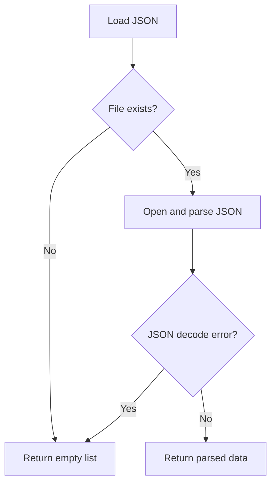

**Diagram sources**
- [src/storage.py:14-27](file://src/storage.py#L14-L27)

**Section sources**
- [src/storage.py:1-107](file://src/storage.py#L1-L107)

### Screenshot Manager
- Saves uploads into organized directories by meet and date
- Detects duplicates by filename and checksum
- Generates thumbnails and cleans up empty directories after deletions

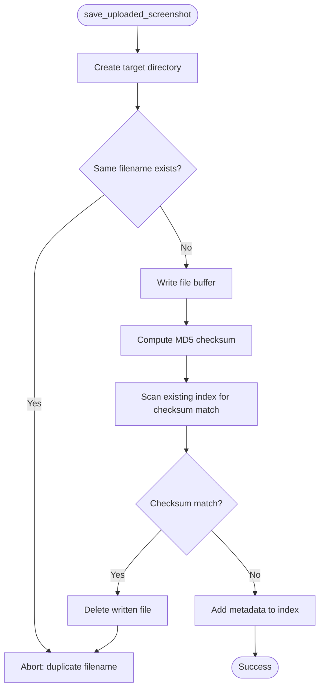

**Diagram sources**
- [src/screenshot_manager.py:27-82](file://src/screenshot_manager.py#L27-L82)

**Section sources**
- [src/screenshot_manager.py:1-136](file://src/screenshot_manager.py#L1-L136)

### Validation Utilities
- Validates time formats (MM:SS.ss or SS.ss)
- Converts between time strings and seconds
- Validates swim event data completeness and correctness

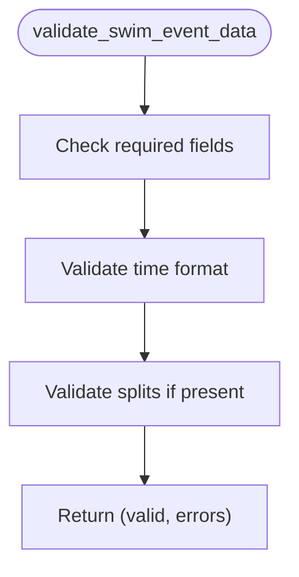

**Diagram sources**
- [src/validation.py:75-102](file://src/validation.py#L75-L102)

**Section sources**
- [src/validation.py:1-103](file://src/validation.py#L1-L103)

### Analytics Module
- Builds DataFrames from persisted events
- Computes time progression, stroke comparison, personal bests, and dashboard summaries
- Produces Plotly visualizations for charts

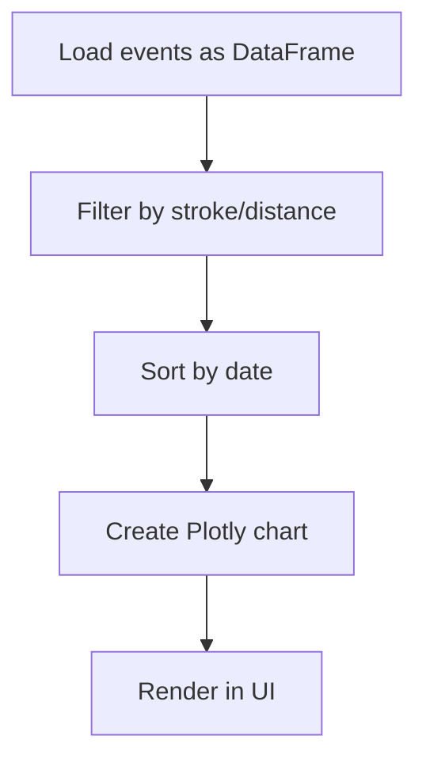

**Diagram sources**
- [src/analytics.py:17-60](file://src/analytics.py#L17-L60)

**Section sources**
- [src/analytics.py:1-184](file://src/analytics.py#L1-L184)

### OCR Service
- Encodes images and sends multimodal requests to Alibaba Cloud
- Parses and validates returned JSON
- Adds confidence and error metadata for downstream UI

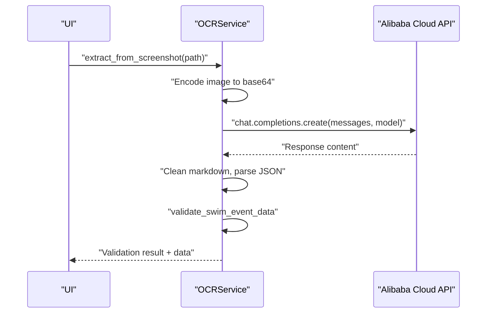

**Diagram sources**
- [src/ocr_service.py:49-116](file://src/ocr_service.py#L49-L116)

**Section sources**
- [src/ocr_service.py:1-144](file://src/ocr_service.py#L1-L144)

### QA Service
- Builds contextual data from events and metrics
- Classifies query types and answers using Alibaba Cloud
- Maintains conversation history for follow-ups

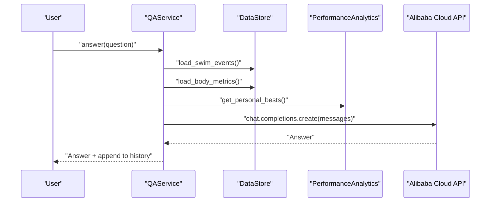

**Diagram sources**
- [src/qa_service.py:76-134](file://src/qa_service.py#L76-L134)

**Section sources**
- [src/qa_service.py:1-174](file://src/qa_service.py#L1-L174)

### Research Service
- Searches benchmarks using DuckDuckGo and caches results
- Compares personal bests against benchmark references

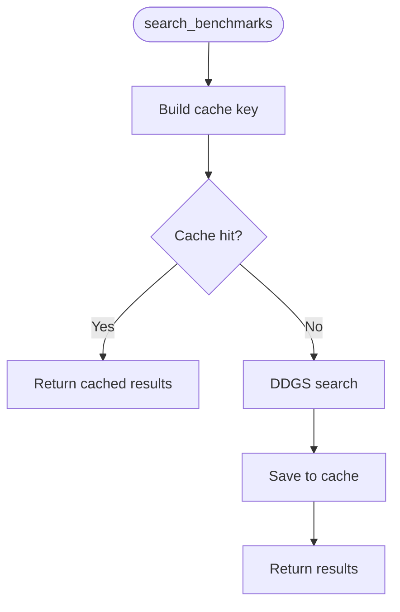

**Diagram sources**
- [src/research_service.py:32-53](file://src/research_service.py#L32-L53)

**Section sources**
- [src/research_service.py:1-94](file://src/research_service.py#L1-L94)

### Insights Generator
- Generates trend insights, identifies strengths/weaknesses, and produces training suggestions
- Aggregates performance metrics and recommends drills per stroke

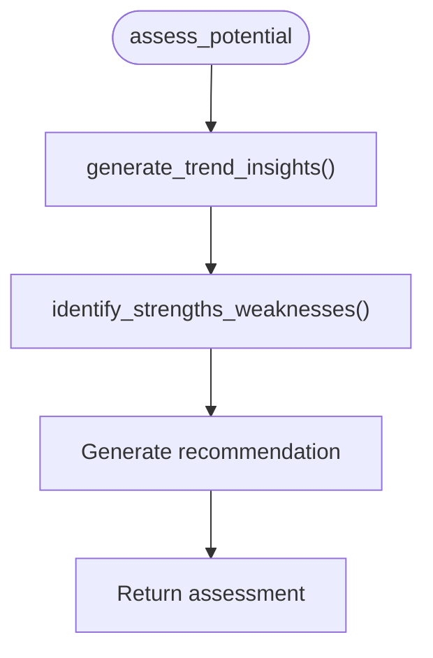

**Diagram sources**
- [src/insights.py:89-111](file://src/insights.py#L89-L111)

**Section sources**
- [src/insights.py:1-150](file://src/insights.py#L1-L150)

## Dependency Analysis
External dependencies are declared in requirements.txt and used across services:
- Streamlit for UI and session state
- Pandas and Plotly for analytics and visualization
- Pillow for image thumbnailing
- DuckDuckGo Search for benchmark discovery
- OpenAI client for Alibaba Cloud integration
- python-dotenv for environment loading

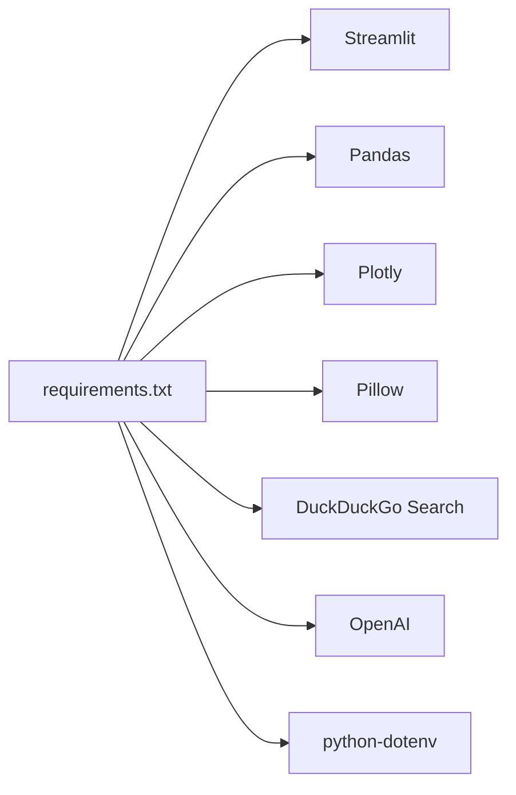

**Diagram sources**
- [requirements.txt:1-10](file://requirements.txt#L1-L10)

**Section sources**
- [requirements.txt:1-10](file://requirements.txt#L1-L10)

## Performance Considerations
- Prefer batch operations for analytics to minimize repeated loads
- Cache benchmark search results to avoid repeated network calls
- Use thumbnails for gallery rendering to reduce bandwidth and memory
- Validate and normalize time formats early to prevent expensive reprocessing
- Keep session state minimal; persist heavy state to disk

## Troubleshooting Guide
- API connectivity issues
  - Verify environment variables for Alibaba Cloud are set and correct
  - Check base URL and model names in configuration
  - Inspect error messages returned by OCR/QA services
- Data persistence errors
  - Confirm JSON files exist and are readable; handle decode errors gracefully
  - Ensure write permissions for data directories
- UI rendering issues
  - Validate DataFrame creation and column presence before plotting
  - Confirm session state keys exist before accessing
- Duplicate screenshots
  - Review checksum-based duplicate detection and cleanup logic
- Time format validation failures
  - Ensure inputs conform to supported formats before saving events

**Section sources**
- [src/config.py:20-24](file://src/config.py#L20-L24)
- [src/ocr_service.py:55-56](file://src/ocr_service.py#L55-L56)
- [src/qa_service.py:87-88](file://src/qa_service.py#L87-L88)
- [src/storage.py:14-27](file://src/storage.py#L14-L27)
- [src/screenshot_manager.py:62-68](file://src/screenshot_manager.py#L62-L68)
- [src/validation.py:7-23](file://src/validation.py#L7-L23)

## Conclusion
This development workflow integrates a Streamlit UI with modular services, robust local persistence, and external AI APIs. Contributors should follow the setup steps, manage environment variables carefully, adhere to the Git workflow, and leverage the debugging techniques outlined here to maintain a reliable and extensible platform.

## Appendices

### Local Development Setup
- Install dependencies
  - Use the provided requirements file to install packages
- Configure environment
  - Set the Alibaba Cloud API key and optional base URL/model names
- Run the application
  - Launch the Streamlit app from the repository root

**Section sources**
- [README.md:15-30](file://README.md#L15-L30)
- [requirements.txt:1-10](file://requirements.txt#L1-L10)
- [src/config.py:20-24](file://src/config.py#L20-L24)

### Git Workflow
- Branching strategy
  - Use feature branches prefixed with descriptive names
- Commit conventions
  - Keep commits focused; include a concise subject line and a brief description
- Pull requests
  - Open PRs for code review; ensure tests pass and documentation is updated

**Section sources**
- [.gitignore:1-33](file://.gitignore#L1-L33)

### Debugging Streamlit Applications
- Session state debugging
  - Print or log session state keys before rendering sensitive UI sections
  - Use rerun strategically to refresh views after state changes
- Service layer testing
  - Mock external API calls during unit tests
  - Validate JSON parsing and error handling paths
- Data validation
  - Validate inputs before invoking services to fail fast

**Section sources**
- [app.py:29-42](file://app.py#L29-L42)
- [src/ocr_service.py:118-119](file://src/ocr_service.py#L118-L119)
- [src/qa_service.py:133-134](file://src/qa_service.py#L133-L134)

### Code Review and Quality Assurance
- Review checklist
  - Correctness of data models and validation
  - Robustness of error handling and edge cases
  - Clarity of service boundaries and responsibilities
  - Adequacy of comments and docstrings
- Testing
  - Unit tests for validation and analytics helpers
  - Integration tests for service interactions
- Documentation
  - Update README for new features or environment changes

[No sources needed since this section provides general guidance]