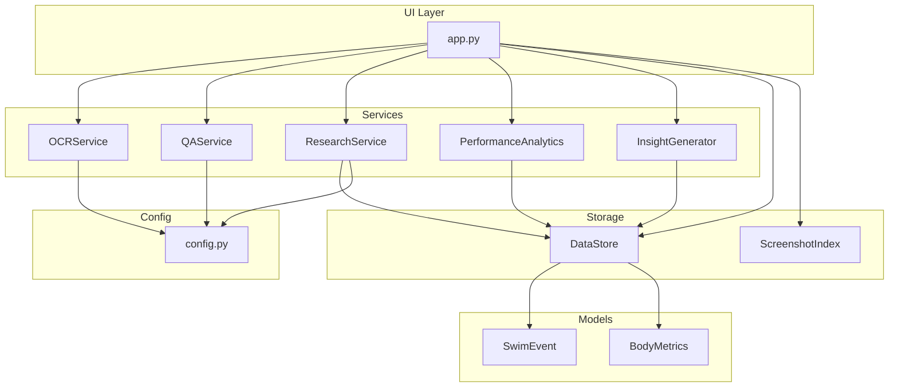
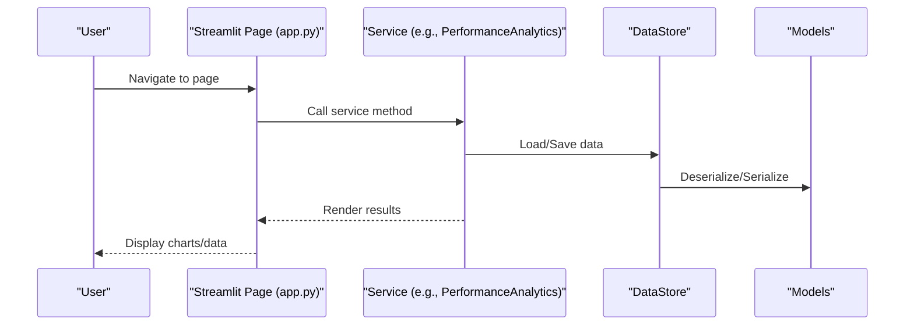
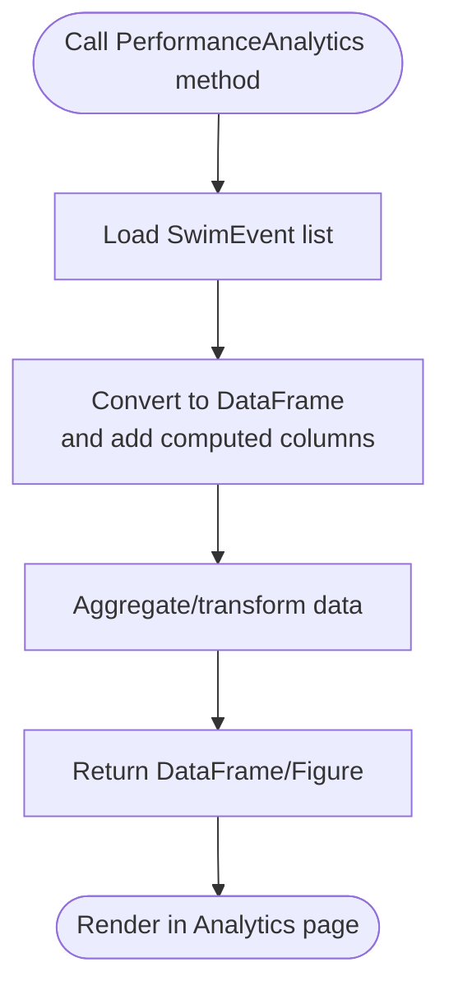
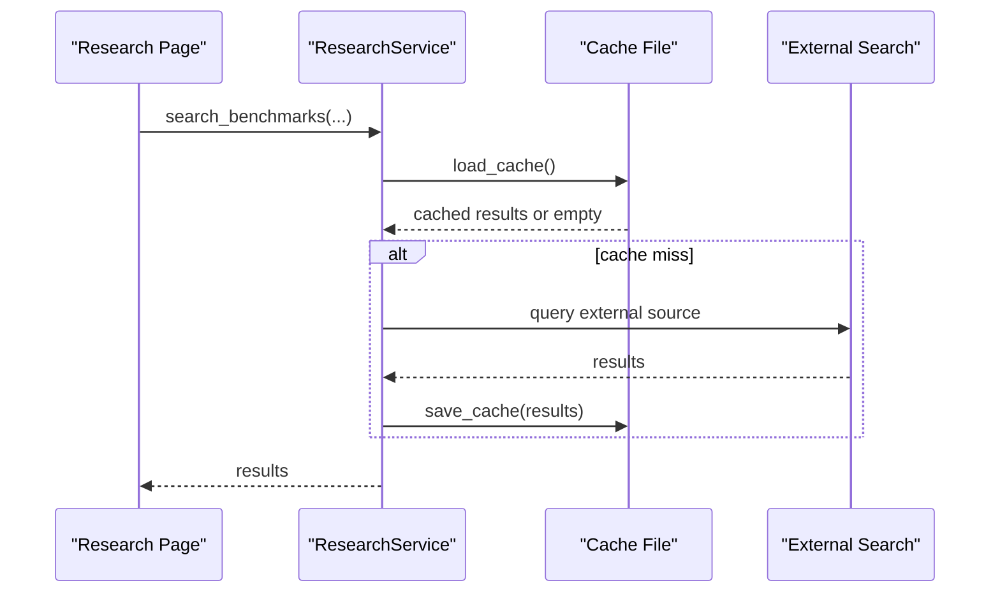
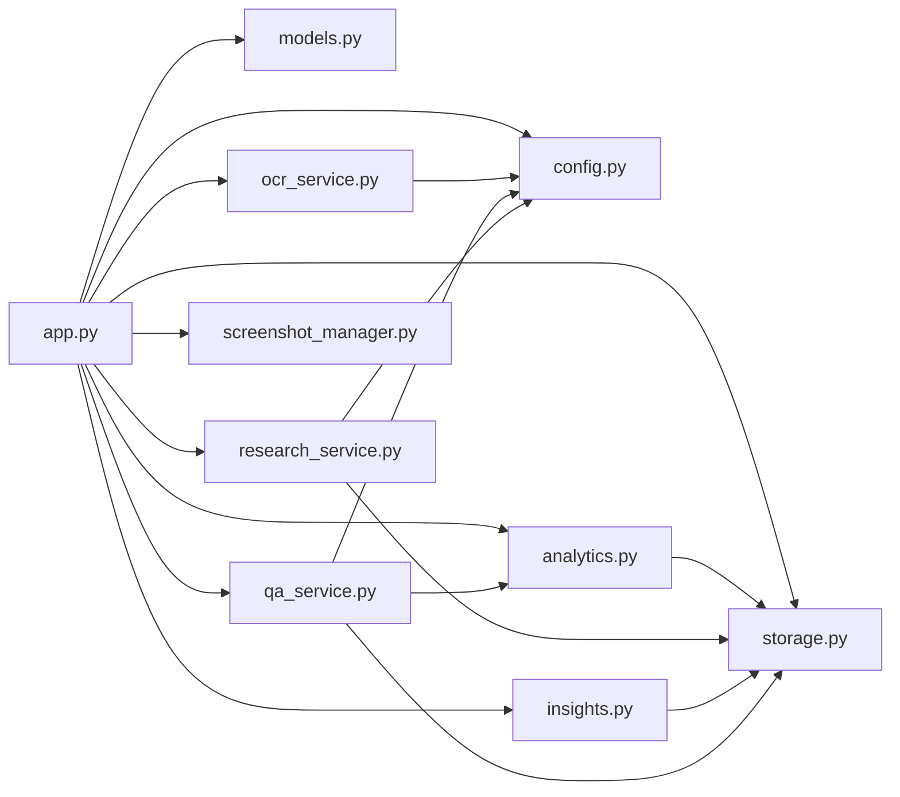

# Feature Development Guide

<cite>
**Referenced Files in This Document**
- [app.py](file://app.py)
- [models.py](file://src/models.py)
- [storage.py](file://src/storage.py)
- [config.py](file://src/config.py)
- [validation.py](file://src/validation.py)
- [analytics.py](file://src/analytics.py)
- [research_service.py](file://src/research_service.py)
- [insights.py](file://src/insights.py)
- [qa_service.py](file://src/qa_service.py)
- [ocr_service.py](file://src/ocr_service.py)
- [screenshot_manager.py](file://src/screenshot_manager.py)
- [README.md](file://README.md)
- [proposal.md](file://openspec/changes/sunny-swim-analysis-platform/proposal.md)
- [design.md](file://openspec/changes/sunny-swim-analysis-platform/design.md)
- [requirements.txt](file://requirements.txt)
</cite>

## Table of Contents
1. [Introduction](#introduction)
2. [Project Structure](#project-structure)
3. [Core Components](#core-components)
4. [Architecture Overview](#architecture-overview)
5. [Detailed Component Analysis](#detailed-component-analysis)
6. [Dependency Analysis](#dependency-analysis)
7. [Performance Considerations](#performance-considerations)
8. [Troubleshooting Guide](#troubleshooting-guide)
9. [Conclusion](#conclusion)
10. [Appendices](#appendices)

## Introduction
This guide provides step-by-step instructions for developing new features in the Swimming Data Analysis Platform. It covers:
- Adding new service modules with interface requirements, integration points, and configuration needs
- Extending existing services (new analysis algorithms in PerformanceAnalytics, new research sources in ResearchService)
- Implementing new UI pages following the established pattern in app.py
- Extending data models using SwimEvent and BodyMetrics as examples
- Integrating new AI/ML services and adding new visualization types
- Extending the Q&A system with new query types
- Backward compatibility and migration strategies

## Project Structure
The platform is a Streamlit application with a modular Python package under src/. Key areas:
- app.py: Main UI router and page handlers
- src/: Core services and utilities
  - models.py: Data models (SwimEvent, BodyMetrics)
  - storage.py: File-based persistence layer
  - config.py: Paths, environment variables, and constants
  - validation.py: Data validation helpers
  - analytics.py: Performance analytics and visualizations
  - research_service.py: Benchmark search and comparison
  - insights.py: Trend analysis and training suggestions
  - qa_service.py: Natural language Q&A
  - ocr_service.py: Vision-language extraction from screenshots
  - screenshot_manager.py: Screenshot ingestion and gallery
- openspec/: Feature proposals and design rationale
- requirements.txt: Dependencies

**Diagram sources**
- [app.py](file://app.py)
- [ocr_service.py](file://src/ocr_service.py)
- [qa_service.py](file://src/qa_service.py)
- [research_service.py](file://src/research_service.py)
- [analytics.py](file://src/analytics.py)
- [insights.py](file://src/insights.py)
- [storage.py](file://src/storage.py)
- [models.py](file://src/models.py)
- [config.py](file://src/config.py)

**Section sources**
- [app.py](file://app.py)
- [README.md](file://README.md)
- [design.md](file://openspec/changes/sunny-swim-analysis-platform/design.md)

## Core Components
- Data models: SwimEvent and BodyMetrics define the core entities with serialization helpers and computed properties.
- Storage: DataStore persists SwimEvent and BodyMetrics to JSON; ScreenshotIndex tracks screenshot metadata.
- Analytics: PerformanceAnalytics builds dashboards, computes personal bests, and creates visualizations.
- Research: ResearchService searches benchmarks and caches results.
- Insights: InsightGenerator produces trend insights, strength/weakness analysis, and training suggestions.
- Q&A: QAService answers questions grounded in data context.
- OCR: OCRService extracts structured data from screenshots using a vision-language model.
- Screenshot Manager: Handles upload, deduplication, thumbnails, and gallery operations.
- Validation: Utilities for time formats, conversions, and required fields.
- Config: Centralized paths and environment variables.

**Section sources**
- [models.py](file://src/models.py)
- [storage.py](file://src/storage.py)
- [analytics.py](file://src/analytics.py)
- [research_service.py](file://src/research_service.py)
- [insights.py](file://src/insights.py)
- [qa_service.py](file://src/qa_service.py)
- [ocr_service.py](file://src/ocr_service.py)
- [screenshot_manager.py](file://src/screenshot_manager.py)
- [validation.py](file://src/validation.py)
- [config.py](file://src/config.py)

## Architecture Overview
The application follows a service-oriented pattern:
- UI pages in app.py route to services
- Services depend on models and storage
- Analytics and insights build on top of storage
- External integrations (OCR, research search) are isolated behind service classes
- Configuration is centralized in config.py

**Diagram sources**
- [app.py](file://app.py)
- [analytics.py](file://src/analytics.py)
- [storage.py](file://src/storage.py)
- [models.py](file://src/models.py)

## Detailed Component Analysis

### Adding a New Service Module
Steps:
1. Define the service class in src/ with a clear responsibility (e.g., TrainingPlanService).
2. Add any required configuration in config.py (paths, API keys).
3. Implement methods that operate on data via DataStore or other services.
4. Expose functionality in app.py by adding a new page handler and navigation button.
5. Wire UI controls (inputs, buttons) to call your service and render results.
6. Ensure error handling and graceful fallbacks when data is missing.
7. Add unit tests in tests/ if applicable.

Integration points:
- Import your service in app.py and initialize it in session state if needed.
- Use DataStore for persistence and models for serialization.
- Use config.py for environment variables and paths.

Configuration needs:
- Environment variables: ALIBABA_CLOUD_API_KEY, ALIBABA_CLOUD_BASE_URL, QWEN_MODEL_NAME, QWEN_TEXT_MODEL_NAME.
- Local file paths: SWIM_EVENTS_FILE, BODY_METRICS_FILE, SCREENSHOT_INDEX_FILE, RESEARCH_CACHE_FILE.

Backward compatibility:
- Keep method signatures stable; introduce optional parameters with defaults.
- Preserve JSON schema for persisted data; add new fields with default values.

**Section sources**
- [app.py](file://app.py)
- [config.py](file://src/config.py)
- [storage.py](file://src/storage.py)
- [models.py](file://src/models.py)

### Extending PerformanceAnalytics (New Analysis Algorithms)
Guidelines:
- Add static or class methods to PerformanceAnalytics that compute derived metrics.
- Use DataStore.load_swim_events() and convert to DataFrame for efficient operations.
- Reuse time_to_seconds/seconds_to_time helpers for consistency.
- Return dataframes or figures suitable for rendering in app.py.

Example extension steps:
1. Define a new method in PerformanceAnalytics (e.g., get_efficiency_metrics).
2. Load events and compute metrics (e.g., pace per distance, split consistency).
3. Return a DataFrame or Plotly figure.
4. Add a UI section in the Analytics page to render results.

**Diagram sources**
- [analytics.py](file://src/analytics.py)
- [storage.py](file://src/storage.py)
- [validation.py](file://src/validation.py)

**Section sources**
- [analytics.py](file://src/analytics.py)
- [validation.py](file://src/validation.py)

### Extending ResearchService (New Research Sources)
Guidelines:
- ResearchService currently uses DuckDuckGo search and caches results.
- To add a new research source:
  - Implement a new search method returning a standardized result structure.
  - Maintain cache consistency by using cache keys that include parameters.
  - Optionally integrate a manual URL submission method similar to add_manual_benchmark_url.

Integration steps:
1. Add a new method in ResearchService (e.g., search_from_source_a).
2. Return a list of dicts with title, body, href.
3. Use the same caching pattern (load_cache/save_cache).
4. Expose the new source in the Research page UI.

**Diagram sources**
- [research_service.py](file://src/research_service.py)
- [config.py](file://src/config.py)

**Section sources**
- [research_service.py](file://src/research_service.py)
- [config.py](file://src/config.py)

### Implementing a New UI Page (Following app.py Pattern)
Steps:
1. Add a new page name to the sidebar pages list.
2. Add an elif branch in app.py mirroring the Upload/Gallery/Body Metrics/Analytics/Research/Insights/Q&A patterns.
3. Use st.title and st.subheader to structure content.
4. Use st.columns, st.tabs, and st.form for layout and interactivity.
5. Call services to fetch data and render charts (Plotly) or tables (DataFrame).
6. Use session state for ephemeral UI state (e.g., form submissions).
7. Add a footer expander for data export/import if needed.

Example pattern references:
- Navigation and session state initialization
- Page branches for Upload, Gallery, Body Metrics, Analytics, Research, Insights, Q&A
- Footer data export/import

**Section sources**
- [app.py](file://app.py)

### Extending Data Models (SwimEvent and BodyMetrics)
Steps:
1. Add new fields to the dataclass with sensible defaults.
2. Ensure to_dict/from_dict preserve backward compatibility (new fields optional).
3. Update validation.py if new fields require validation.
4. Update storage.py methods to serialize/deserialize new fields.
5. Update analytics/insights/qa services to handle new fields gracefully.
6. If needed, add computed properties or helper methods.

Examples:
- SwimEvent: Adding new fields like “pool_depth”, “water_temperature”
- BodyMetrics: Adding “body_fat_percent”, “muscle_mass”

Backward compatibility:
- Default values prevent deserialization errors.
- Services should check for presence before use.

**Section sources**
- [models.py](file://src/models.py)
- [storage.py](file://src/storage.py)
- [validation.py](file://src/validation.py)

### Integrating New AI/ML Services
Approach:
- Wrap the external API in a dedicated service class (e.g., AIModelService).
- Configure credentials via environment variables in config.py.
- Implement retry logic and error handling.
- Cache results when appropriate to reduce cost and latency.
- Ground LLM responses in actual data (as done in QAService) to avoid hallucinations.

Reference implementations:
- OCRService: Uses Alibaba Cloud OpenAI-compatible client
- QAService: Builds structured context and classifies query types

**Section sources**
- [ocr_service.py](file://src/ocr_service.py)
- [qa_service.py](file://src/qa_service.py)
- [config.py](file://src/config.py)

### Adding New Visualization Types
Approach:
- Use Plotly (already imported) to create figures in analytics.py or a new visualization service.
- Convert data to DataFrame and leverage px/go for charts.
- Return figures from service methods and render in app.py.

Reference patterns:
- Line chart for time progression
- Radar chart for stroke comparison
- Tabs for multiple views

**Section sources**
- [analytics.py](file://src/analytics.py)
- [app.py](file://app.py)

### Extending the Q&A System (New Query Types)
Steps:
1. Extend the classification logic in QAService._classify_query to detect new intent categories.
2. Add new answer methods or refine existing ones (e.g., get_personal_best_answer, get_trend_answer).
3. Enhance _get_data_context to include relevant derived metrics.
4. Add UI prompts/examples in the Q&A page to guide users.

Reference patterns:
- Classification by keyword matching
- Direct data retrieval for specific queries
- Conversation history integration

**Section sources**
- [qa_service.py](file://src/qa_service.py)
- [app.py](file://app.py)

## Dependency Analysis
Key dependencies and coupling:
- app.py depends on all services and models; keep imports minimal and lazy where possible.
- Services depend on models and storage; avoid circular imports.
- Analytics and insights depend on storage; they are cohesive and stable.
- External services (OCR, research) are isolated behind service classes.
- Config centralizes environment variables and paths.

**Diagram sources**
- [app.py](file://app.py)
- [config.py](file://src/config.py)
- [storage.py](file://src/storage.py)
- [models.py](file://src/models.py)
- [analytics.py](file://src/analytics.py)
- [research_service.py](file://src/research_service.py)
- [insights.py](file://src/insights.py)
- [qa_service.py](file://src/qa_service.py)
- [ocr_service.py](file://src/ocr_service.py)
- [screenshot_manager.py](file://src/screenshot_manager.py)

**Section sources**
- [requirements.txt](file://requirements.txt)
- [app.py](file://app.py)

## Performance Considerations
- Prefer DataFrame operations in analytics for large datasets.
- Cache expensive operations (e.g., research results) to avoid repeated network calls.
- Use thumbnails for galleries to reduce memory usage.
- Minimize UI reruns by batching updates and using session state judiciously.
- Keep model conversions lightweight; defer heavy computations to background threads if needed.

## Troubleshooting Guide
Common issues and resolutions:
- Missing API key: Ensure ALIBABA_CLOUD_API_KEY is set; the app warns in the footer.
- Empty data: Many pages show informational messages when no data is available.
- Validation errors: OCR validation returns structured errors; review extraction confidence and fix inputs.
- Cache corruption: Research cache is JSON; recreate if malformed.
- Duplicate screenshots: ScreenshotManager detects duplicates by filename and checksum.

**Section sources**
- [app.py](file://app.py)
- [ocr_service.py](file://src/ocr_service.py)
- [research_service.py](file://src/research_service.py)
- [screenshot_manager.py](file://src/screenshot_manager.py)
- [validation.py](file://src/validation.py)

## Conclusion
This guide outlined how to incrementally extend the Swimming Data Analysis Platform safely and consistently. By following the established patterns—service isolation, centralized configuration, robust storage, and UI-driven orchestration—you can add new capabilities while preserving backward compatibility and performance.

## Appendices

### Step-by-Step Example: Adding a New UI Page
1. Add a new page name to the pages list in the sidebar.
2. Add an elif branch in app.py for the new page.
3. Import required services and models.
4. Fetch data via DataStore and services.
5. Render charts/tabs/forms as needed.
6. Add footer export/import if applicable.

**Section sources**
- [app.py](file://app.py)

### Migration Strategies
- Schema migrations: When adding fields to SwimEvent/BodyMetrics, default values ensure older JSON remains readable.
- Service evolution: Keep public method signatures stable; mark deprecated methods and add warnings.
- Data export/import: Use the existing JSON export/import mechanism to move between versions.

**Section sources**
- [storage.py](file://src/storage.py)
- [models.py](file://src/models.py)
- [app.py](file://app.py)