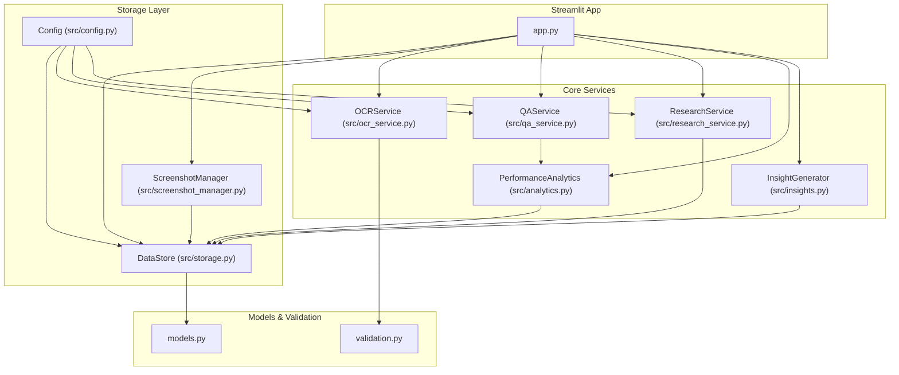
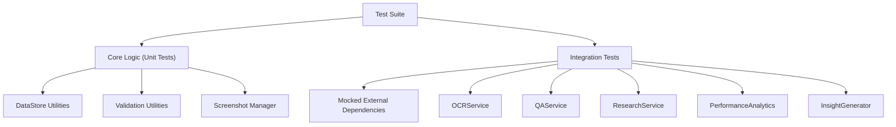
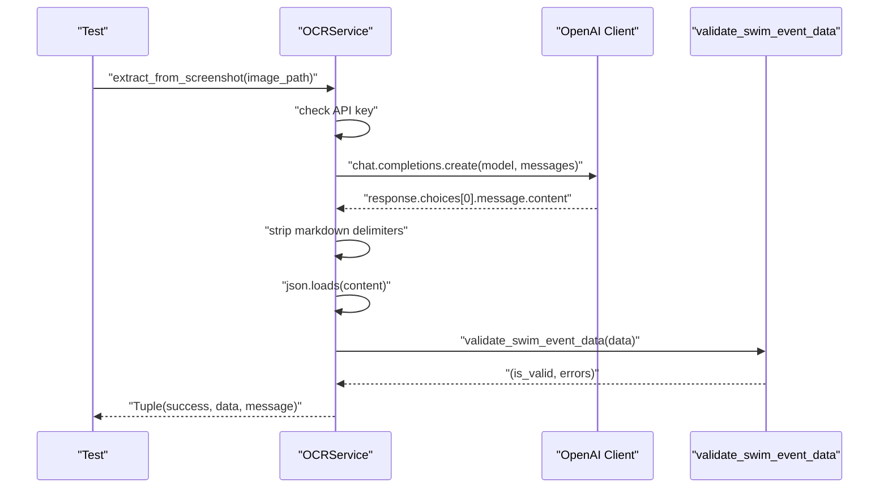
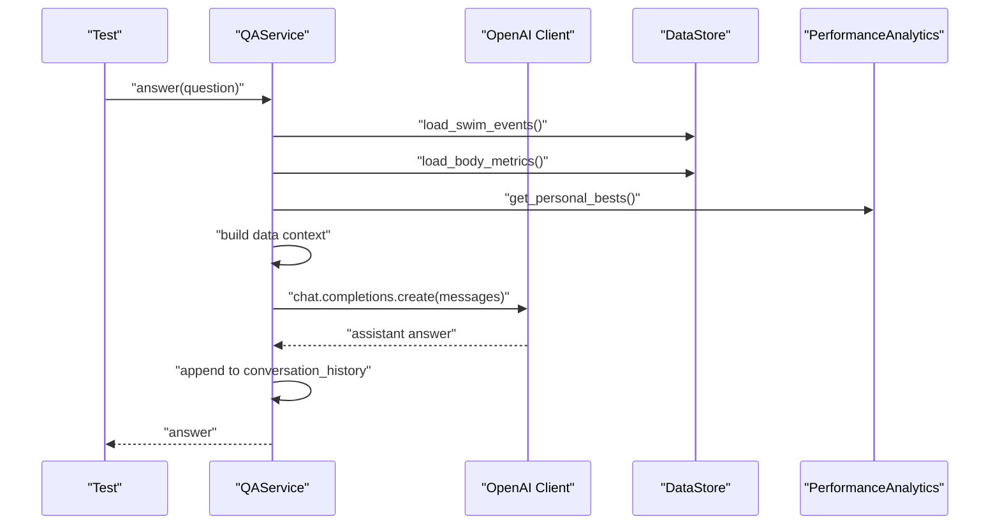
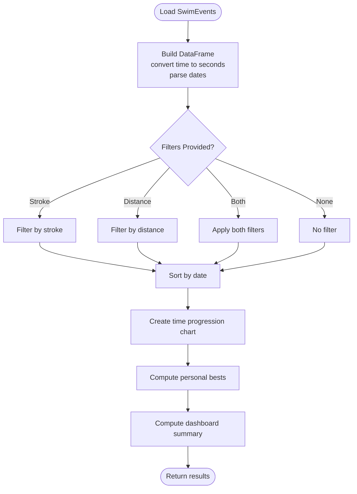
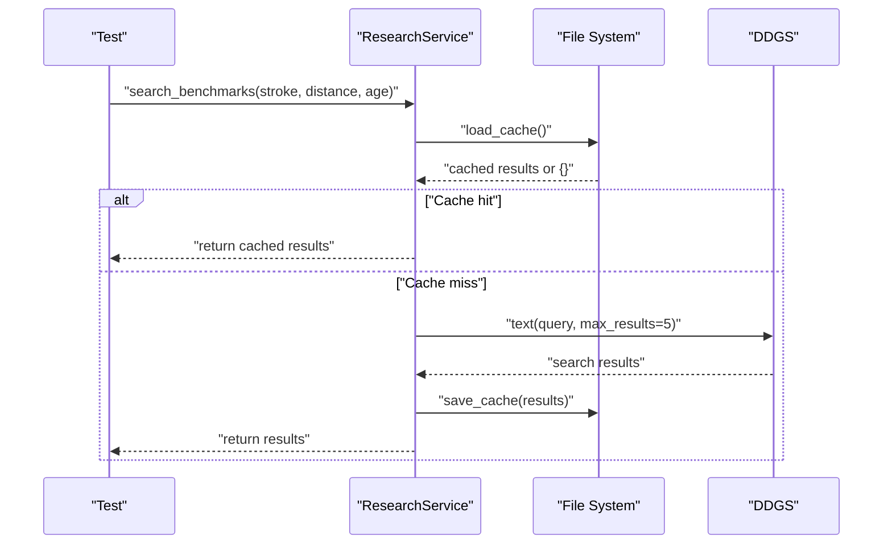
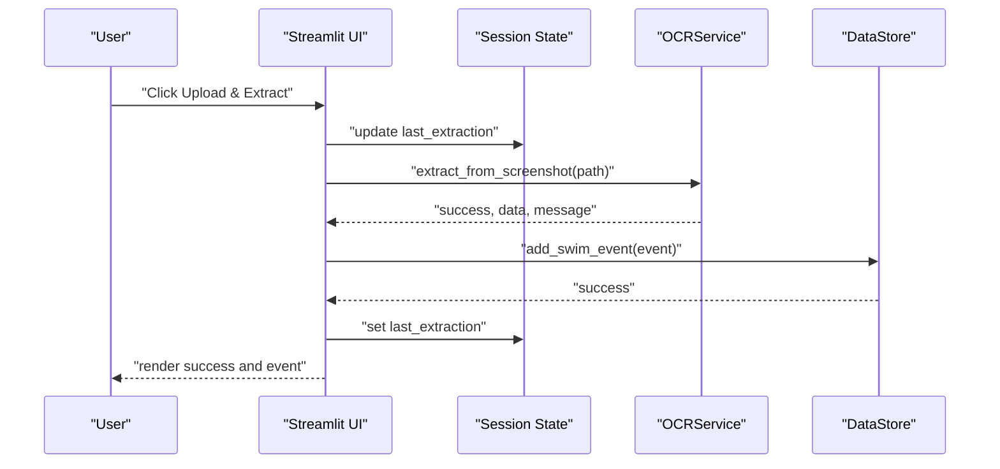
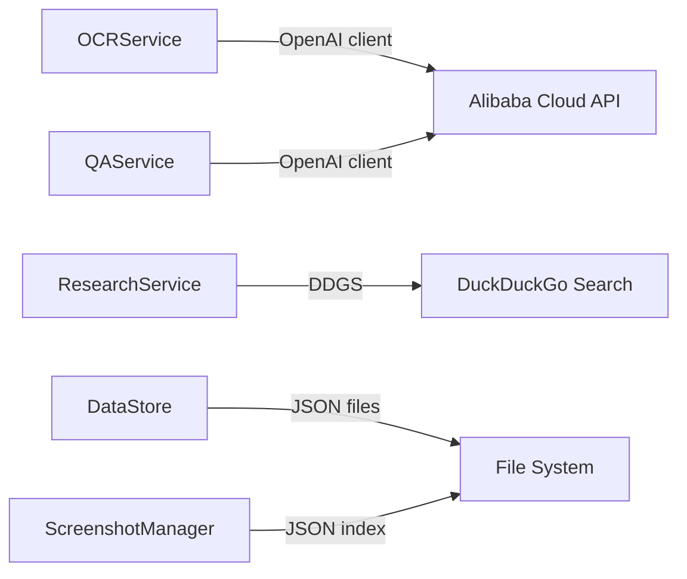

# Testing Strategy

<cite>
**Referenced Files in This Document**
- [README.md](file://README.md)
- [app.py](file://app.py)
- [src/config.py](file://src/config.py)
- [src/models.py](file://src/models.py)
- [src/validation.py](file://src/validation.py)
- [src/storage.py](file://src/storage.py)
- [src/screenshot_manager.py](file://src/screenshot_manager.py)
- [src/ocr_service.py](file://src/ocr_service.py)
- [src/analytics.py](file://src/analytics.py)
- [src/research_service.py](file://src/research_service.py)
- [src/insights.py](file://src/insights.py)
- [src/qa_service.py](file://src/qa_service.py)
</cite>

## Table of Contents
1. [Introduction](#introduction)
2. [Project Structure](#project-structure)
3. [Core Components](#core-components)
4. [Architecture Overview](#architecture-overview)
5. [Detailed Component Analysis](#detailed-component-analysis)
6. [Dependency Analysis](#dependency-analysis)
7. [Performance Considerations](#performance-considerations)
8. [Troubleshooting Guide](#troubleshooting-guide)
9. [Conclusion](#conclusion)
10. [Appendices](#appendices)

## Introduction
This document defines a comprehensive testing strategy for the Swimming Data Analysis Platform. It covers the current testing infrastructure, guidelines for writing unit tests for individual components, and practical testing approaches for services such as OCRService, PerformanceAnalytics, and DataStore operations. It also includes strategies for validating data, handling file operations, integrating with external APIs, mocking third-party services, and testing Streamlit components and session state interactions. Edge cases in data processing workflows and error handling scenarios are addressed with concrete examples and diagrams.

## Project Structure
The platform is organized into a small set of focused modules under src/, with a Streamlit application orchestrating UI and workflows. Key areas for testing include:
- Data models and validation utilities
- Data persistence and indexing
- File ingestion and screenshot management
- OCR extraction and Q&A services
- Analytics and insights generation
- Research comparison and DuckDuckGo integration
- Streamlit app session state and page routing

**Diagram sources**
- [app.py](file://app.py)
- [src/ocr_service.py](file://src/ocr_service.py)
- [src/qa_service.py](file://src/qa_service.py)
- [src/research_service.py](file://src/research_service.py)
- [src/analytics.py](file://src/analytics.py)
- [src/insights.py](file://src/insights.py)
- [src/storage.py](file://src/storage.py)
- [src/screenshot_manager.py](file://src/screenshot_manager.py)
- [src/config.py](file://src/config.py)
- [src/models.py](file://src/models.py)
- [src/validation.py](file://src/validation.py)

**Section sources**
- [README.md](file://README.md)
- [app.py](file://app.py)
- [src/config.py](file://src/config.py)

## Core Components
This section outlines the primary components to test and their roles in the testing strategy.

- Data models and validation
  - SwimEvent and BodyMetrics define the domain data structures and include conversion helpers for persistence and derived values.
  - validation.py provides time parsing/format validation and required-field checks used by OCR extraction and downstream analytics.

- Data persistence and indexing
  - DataStore manages JSON-backed persistence for swim events and body metrics, with robust error handling for file IO and JSON decoding.
  - ScreenshotIndex maintains metadata for screenshots and supports add/list/remove operations.

- File ingestion and screenshot management
  - ScreenshotManager handles upload, deduplication via checksum, thumbnail generation, and deletion with cleanup of empty directories.

- OCR and Q&A services
  - OCRService integrates with Alibaba Cloud Model Studio via OpenAI-compatible client to extract structured data from screenshots, returning validation results and confidence placeholders.
  - QAService builds contextual prompts from persisted data and interacts with the text model to answer questions, maintaining conversation history.

- Analytics and insights
  - PerformanceAnalytics loads events, converts time formats, computes personal bests, and creates visualizations.
  - InsightGenerator derives trends, strengths/weaknesses, potential assessments, and training suggestions.

- Research comparison
  - ResearchService searches DuckDuckGo for benchmarks, caches results, and compares personal bests against cached or live results.

- Streamlit application
  - Orchestrates navigation, page rendering, session state updates, and integrates all services for end-to-end testing.

**Section sources**
- [src/models.py](file://src/models.py)
- [src/validation.py](file://src/validation.py)
- [src/storage.py](file://src/storage.py)
- [src/screenshot_manager.py](file://src/screenshot_manager.py)
- [src/ocr_service.py](file://src/ocr_service.py)
- [src/qa_service.py](file://src/qa_service.py)
- [src/analytics.py](file://src/analytics.py)
- [src/insights.py](file://src/insights.py)
- [src/research_service.py](file://src/research_service.py)
- [app.py](file://app.py)

## Architecture Overview
The testing architecture emphasizes isolation of external dependencies and deterministic behavior for core logic. Mocks replace network calls (Alibaba Cloud, DuckDuckGo), while fixtures provide controlled datasets for analytics and insights.

[No sources needed since this diagram shows conceptual workflow, not actual code structure]

## Detailed Component Analysis

### Data Models and Validation
- Unit testing approach
  - Test SwimEvent and BodyMetrics conversions to/from dictionaries and derived properties (e.g., BMI).
  - Validate time parsing and format validation functions with representative inputs and edge cases (empty, malformed, boundary formats).
  - Verify required-field validation for missing keys and empty values.

- Example test scenarios
  - Convert a SwimEvent to dict and back; assert equality.
  - Parse "MM:SS.ss" and "SS.ss" to seconds and back to strings.
  - Validate missing required fields and invalid time formats.

**Section sources**
- [src/models.py](file://src/models.py)
- [src/validation.py](file://src/validation.py)

### Data Persistence (DataStore)
- Unit testing approach
  - Use temporary directories and files to avoid polluting the real data directory.
  - Mock JSON decode failures and IO errors to verify graceful fallbacks.
  - Test add/save/load operations for swim events and body metrics.

- Integration testing approach
  - End-to-end tests that write/read actual files and assert on persisted content and structure.

- Example test scenarios
  - Load non-existent file returns empty list; save and reload yields identical data.
  - JSON decode error during load returns empty list; subsequent save persists data correctly.

**Section sources**
- [src/storage.py](file://src/storage.py)
- [src/config.py](file://src/config.py)

### Screenshot Management
- Unit testing approach
  - Test checksum computation deterministically with known inputs.
  - Simulate duplicate detection by checksum and filename to ensure early exit and cleanup.
  - Validate thumbnail generation and deletion with missing files handled gracefully.

- Integration testing approach
  - Write temporary files and metadata, then exercise save/list/delete flows.

- Example test scenarios
  - Two identical uploads produce the same checksum; second upload is rejected.
  - Deleting a non-indexed screenshot logs appropriate feedback without crashing.

**Section sources**
- [src/screenshot_manager.py](file://src/screenshot_manager.py)
- [src/storage.py](file://src/storage.py)

### OCRService
- Unit testing approach
  - Mock OpenAI client to simulate successful and failed responses, JSON parsing errors, and environment configuration issues.
  - Validate prompt construction and extraction confidence/error metadata injection.
  - Test manual entry form field definitions and splits parsing.

- Integration testing approach
  - Provide a synthetic image path and mocked API response; assert validation outcomes and returned confidence/errors.

- Example test scenarios
  - API key not configured returns failure with message.
  - Malformed JSON response triggers parsing error handling and returns raw response placeholder.
  - Valid structured JSON passes validation and includes confidence and error metadata.

**Diagram sources**
- [src/ocr_service.py](file://src/ocr_service.py)
- [src/validation.py](file://src/validation.py)

**Section sources**
- [src/ocr_service.py](file://src/ocr_service.py)
- [src/validation.py](file://src/validation.py)

### QAService
- Unit testing approach
  - Mock OpenAI client to simulate answer generation and error conditions.
  - Build data context from in-memory datasets and verify prompt composition.
  - Classify query types and test direct data retrieval helpers for personal bests and trends.

- Integration testing approach
  - Persist synthetic swim events and body metrics; verify QA answers cite specific data points.

- Example test scenarios
  - Out-of-scope question returns guidance message.
  - API key not configured returns configuration warning.
  - Conversation history appended and reused for follow-ups.

**Diagram sources**
- [src/qa_service.py](file://src/qa_service.py)
- [src/storage.py](file://src/storage.py)
- [src/analytics.py](file://src/analytics.py)

**Section sources**
- [src/qa_service.py](file://src/qa_service.py)

### PerformanceAnalytics
- Unit testing approach
  - Provide synthetic SwimEvent datasets and assert DataFrame creation, sorting, and aggregation.
  - Validate time progression charts and stroke comparison radar charts render with expected data shapes.
  - Test personal bests computation and dashboard summary metrics.

- Integration testing approach
  - Load persisted events and verify chart creation and summary computations.

- Example test scenarios
  - Empty dataset returns empty DataFrame and neutral figures.
  - Stroke/distance filters produce filtered time progression data.
  - Personal bests computed per stroke-distance combinations.

**Diagram sources**
- [src/analytics.py](file://src/analytics.py)
- [src/storage.py](file://src/storage.py)
- [src/validation.py](file://src/validation.py)

**Section sources**
- [src/analytics.py](file://src/analytics.py)

### InsightGenerator
- Unit testing approach
  - Generate trend insights from grouped events and assert positive, warning, and neutral classifications.
  - Identify strengths/weaknesses by stroke averages and validate pace calculations.
  - Assess potential and generate training suggestions with prioritized focus strokes.

- Integration testing approach
  - Combine analytics outputs and storage data to validate end-to-end insight generation.

- Example test scenarios
  - Insufficient data returns informational guidance.
  - Clear improvement/decline thresholds trigger appropriate insight types.
  - Training suggestions prioritize the identified weakest stroke.

**Section sources**
- [src/insights.py](file://src/insights.py)

### ResearchService
- Unit testing approach
  - Mock DuckDuckGo search to simulate cached and uncached results.
  - Validate cache load/save behavior and error handling for search failures.
  - Compare personal bests against benchmark results and return structured comparison data.

- Integration testing approach
  - Persist synthetic personal bests and verify benchmark search and comparison logic.

- Example test scenarios
  - Cache hit returns pre-stored results immediately.
  - Cache miss triggers search, stores results, and returns them.
  - Search error returns structured error result with message.

**Diagram sources**
- [src/research_service.py](file://src/research_service.py)

**Section sources**
- [src/research_service.py](file://src/research_service.py)

### Streamlit Components and Session State
- Unit testing approach
  - Use pytest with a Streamlit test harness to simulate page navigation and session state transitions.
  - Mock service calls (OCR, QA, Research, Analytics) to isolate UI logic and state updates.
  - Test button clicks, form submissions, and rerenders without launching the full app.

- Integration testing approach
  - Full app tests with mocked external services to validate end-to-end flows (upload → OCR → save → analytics).

- Example test scenarios
  - Switching pages updates session state and triggers rerender.
  - Uploading a screenshot triggers save and OCR extraction; success/warning/error branches update UI accordingly.
  - Q&A chat appends user and assistant messages; clearing history resets conversation.

**Diagram sources**
- [app.py](file://app.py)
- [src/ocr_service.py](file://src/ocr_service.py)
- [src/storage.py](file://src/storage.py)

**Section sources**
- [app.py](file://app.py)

## Dependency Analysis
External dependencies and their testing implications:
- Alibaba Cloud OpenAI-compatible client
  - Mock the client to simulate success, timeouts, and API key errors.
  - Verify fallbacks and error messages propagate to UI and logs.

- DuckDuckGo search
  - Mock DDGS to return predefined results or raise exceptions.
  - Validate caching behavior and error handling.

- File system and JSON
  - Use temporary directories for DataStore and ScreenshotIndex to avoid side effects.
  - Simulate JSON decode and IO errors to verify resilience.

**Diagram sources**
- [src/ocr_service.py](file://src/ocr_service.py)
- [src/qa_service.py](file://src/qa_service.py)
- [src/research_service.py](file://src/research_service.py)
- [src/storage.py](file://src/storage.py)
- [src/screenshot_manager.py](file://src/screenshot_manager.py)

**Section sources**
- [src/ocr_service.py](file://src/ocr_service.py)
- [src/qa_service.py](file://src/qa_service.py)
- [src/research_service.py](file://src/research_service.py)
- [src/storage.py](file://src/storage.py)
- [src/screenshot_manager.py](file://src/screenshot_manager.py)

## Performance Considerations
- Prefer in-memory datasets for analytics and insights to avoid disk I/O overhead in unit tests.
- Use lightweight mocks for external APIs to keep tests fast and deterministic.
- Minimize file writes in tests; when necessary, use temporary directories and clean up after each test.
- Cache benchmark searches in tests to reduce network calls and stabilize runs.

[No sources needed since this section provides general guidance]

## Troubleshooting Guide
Common issues and how to test for them:
- Missing API key
  - Verify that OCRService and QAService return explicit configuration warnings when the API key is absent.

- JSON decode or IO errors
  - Simulate corrupted or unreadable JSON files; confirm DataStore returns defaults and does not crash.

- Malformed time formats
  - Provide invalid time strings to validation functions and assert appropriate error messages.

- Duplicate screenshots
  - Exercise checksum and filename duplicate detection; ensure rejection and cleanup behavior.

- Empty analytics datasets
  - Assert that analytics functions return empty structures and informative messages when no data is present.

**Section sources**
- [src/ocr_service.py](file://src/ocr_service.py)
- [src/qa_service.py](file://src/qa_service.py)
- [src/storage.py](file://src/storage.py)
- [src/validation.py](file://src/validation.py)
- [src/screenshot_manager.py](file://src/screenshot_manager.py)
- [src/analytics.py](file://src/analytics.py)

## Conclusion
This testing strategy emphasizes isolating external dependencies, validating core logic with targeted unit tests, and ensuring robust error handling and edge-case coverage. By combining deterministic mocks with controlled fixtures, the platform’s components can be validated independently and integrated safely. Streamlit-specific tests focus on session state and UI flows, while integration tests verify end-to-end workflows across services.

[No sources needed since this section summarizes without analyzing specific files]

## Appendices

### Mock Implementation Examples
- Alibaba Cloud services
  - Replace the OpenAI client with a unittest.mock.MagicMock or a dedicated test client that returns controlled responses. Configure environment variables to simulate missing keys for error paths.

- DuckDuckGo search
  - Patch the DDGS context manager to yield predefined results or raise exceptions. Validate cache reads/writes and error handling.

- Data persistence
  - Use pytest tmp_path to create isolated data directories and files. Simulate JSON decode and IO errors to verify resilience.

- Streamlit components
  - Use pytest with a Streamlit test harness to simulate session state updates and rerenders. Mock service methods to control behavior and assert UI reactions.

[No sources needed since this section provides general guidance]