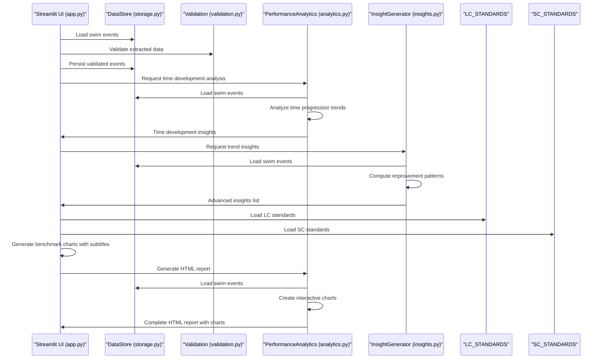
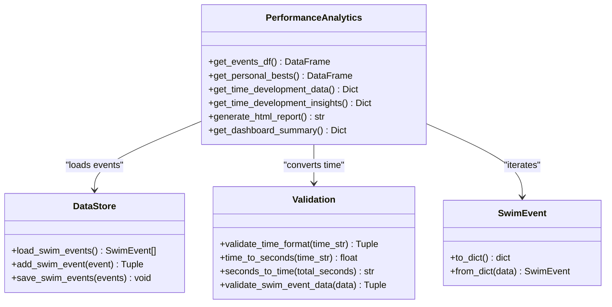
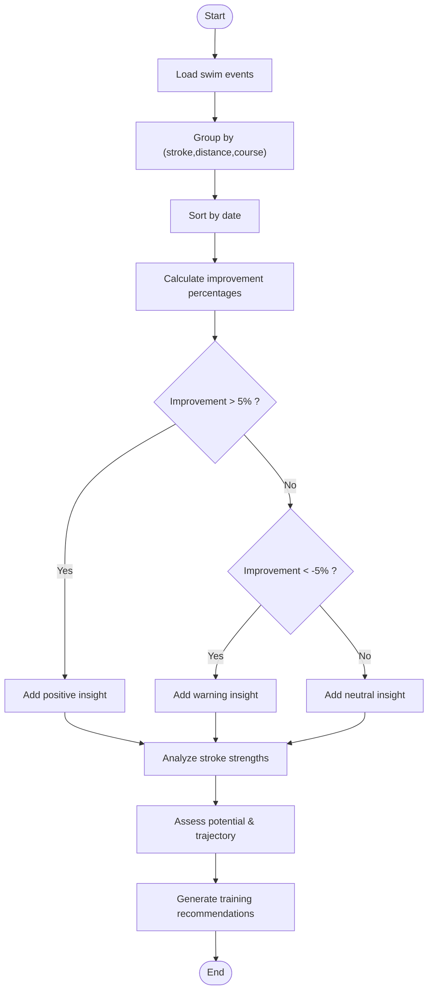
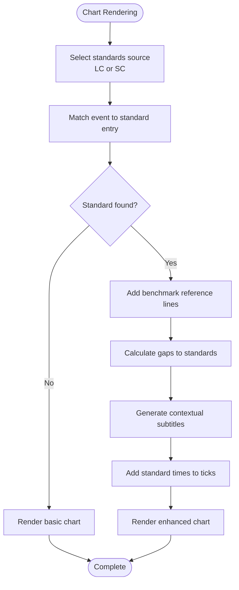

# Analytics Engine

<cite>
**Referenced Files in This Document**
- [app.py](file://app.py)
- [analytics.py](file://src/analytics.py)
- [insights.py](file://src/insights.py)
- [models.py](file://src/models.py)
- [storage.py](file://src/storage.py)
- [validation.py](file://src/validation.py)
- [config.py](file://src/config.py)
- [README.md](file://README.md)
</cite>

## Update Summary
**Changes Made**
- Enhanced chart visualization capabilities with benchmark subtitles for Time Development charts
- Added contextual information about national/international master standards and gap calculations
- Integrated Chinese National Swimming Standards for LC and SC courses
- Implemented dynamic benchmark reference lines with color-coded annotations
- Added gap-to-standard calculations and nearest target identification

## Table of Contents
1. [Introduction](#introduction)
2. [Project Structure](#project-structure)
3. [Core Components](#core-components)
4. [Architecture Overview](#architecture-overview)
5. [Detailed Component Analysis](#detailed-component-analysis)
6. [Advanced Analytics Features](#advanced-analytics-features)
7. [Benchmark Visualization System](#benchmark-visualization-system)
8. [HTML Report Generation](#html-report-generation)
9. [Performance Optimization](#performance-optimization)
10. [Troubleshooting Guide](#troubleshooting-guide)
11. [Conclusion](#conclusion)
11. [Appendices](#appendices)

## Introduction
This document describes the enhanced analytics engine module responsible for comprehensive swimming performance analysis. The system now provides advanced time progression analysis, stroke comparison methodologies, personal best tracking, time development analysis, HTML report generation with interactive Plotly charts, benchmark visualization with national/international master standards, and comprehensive dashboard summaries. It covers performance calculation algorithms, visualization creation processes, analytics pipeline from raw data input to visual output, integration with the storage system, and validation layer for data quality assurance.

## Project Structure
The analytics engine is implemented as part of a Streamlit application that ingests swimming meet screenshots, extracts structured race data, stores it locally, and provides interactive analytics, insights, benchmark visualization, and comprehensive reporting capabilities.

```mermaid
graph TB
subgraph "Application Layer"
APP["app.py<br/>Streamlit UI<br/>Benchmark Visualization"]
END
subgraph "Enhanced Analytics Layer"
PA["analytics.py<br/>PerformanceAnalytics<br/>Enhanced Analytics"]
IG["insights.py<br/>InsightGenerator<br/>Trend Analysis"]
END
subgraph "Data Layer"
ST["storage.py<br/>DataStore, ScreenshotIndex<br/>JSON Persistence"]
VL["validation.py<br/>Validation Utilities<br/>Time Format & Field Validation"]
MD["models.py<br/>SwimEvent, BodyMetrics<br/>Typed Data Structures"]
CFG["config.py<br/>Paths & Config<br/>Time Formats & Paths"]
END
subgraph "Standards Layer"
LC["LC_STANDARDS<br/>Chinese National Standards<br/>LC Course"]
SC["SC_STANDARDS<br/>Chinese National Standards<br/>SC Course"]
END
APP --> PA
APP --> IG
PA --> ST
IG --> ST
PA --> VL
PA --> MD
IG --> MD
ST --> CFG
APP --> LC
APP --> SC
```

**Diagram sources**
- [app.py:18-58](file://app.py#L18-L58)
- [analytics.py:14-314](file://src/analytics.py#L14-L314)
- [insights.py:14-200](file://src/insights.py#L14-L200)
- [storage.py:14-162](file://src/storage.py#L14-L162)
- [validation.py:1-203](file://src/validation.py#L1-L203)
- [models.py:7-55](file://src/models.py#L7-L55)
- [config.py:1-49](file://src/config.py#L1-L49)

**Section sources**
- [README.md:1-66](file://README.md#L1-L66)

## Core Components
- **PerformanceAnalytics**: Enhanced central analytics class providing time progression analysis, stroke comparison, personal bests, time development tracking, HTML report generation, and comprehensive dashboard summaries.
- **InsightGenerator**: Advanced trend analysis generator that identifies performance improvements, weaknesses, and provides training recommendations.
- **DataStore and ScreenshotIndex**: Local JSON-based persistence for swim events, body metrics, and screenshot metadata with robust error handling.
- **Validation utilities**: Comprehensive time format validation, conversions, and required-field checks with detailed error reporting.
- **SwimEvent and BodyMetrics models**: Typed data structures with serialization helpers for analytics and visualization.
- **Chinese National Swimming Standards**: Integrated LC and SC course standards for benchmark visualization and gap analysis.

**Section sources**
- [analytics.py:14-314](file://src/analytics.py#L14-L314)
- [insights.py:14-200](file://src/insights.py#L14-L200)
- [storage.py:14-162](file://src/storage.py#L14-L162)
- [validation.py:1-203](file://src/validation.py#L1-L203)
- [models.py:7-55](file://src/models.py#L7-L55)
- [app.py:18-58](file://app.py#L18-L58)

## Architecture Overview
The enhanced analytics pipeline begins with screenshot ingestion and OCR extraction, followed by comprehensive validation and persistence. The analytics engine now provides advanced time development analysis, generates interactive HTML reports with Plotly charts, delivers comprehensive insights through trend analysis and performance tracking, and integrates Chinese National Swimming Standards for benchmark visualization and gap analysis.



**Diagram sources**
- [app.py:729-991](file://app.py#L729-L991)
- [app.py:995-1105](file://app.py#L995-L1105)
- [storage.py:48-86](file://src/storage.py#L48-L86)
- [validation.py:102-129](file://src/validation.py#L102-L129)
- [analytics.py:66-162](file://src/analytics.py#L66-L162)
- [insights.py:18-90](file://src/insights.py#L18-L90)

## Detailed Component Analysis

### Enhanced PerformanceAnalytics
The PerformanceAnalytics class has been significantly expanded to provide comprehensive swimming performance analysis with advanced features:

**Core Responsibilities:**
- Convert swim events to a DataFrame with normalized time and date
- Filter time progression data by stroke and distance
- Create interactive line charts for time progression with spline interpolation
- Aggregate stroke comparison data and produce radar charts
- Compute personal bests per stroke-distance-course combination
- Analyze time development trends and generate insights
- Generate comprehensive HTML reports with interactive charts
- Provide dashboard summary statistics

**Advanced Algorithms and Logic:**
- **Time development analysis**: Groups events by stroke-distance combinations and calculates improvement trends over time
- **Performance insights**: Identifies most improved and most consistent stroke-distance combinations using variance analysis
- **HTML report generation**: Creates self-contained HTML documents with embedded Plotly charts and CSS styling
- **Dashboard summarization**: Provides comprehensive statistics including total meets, events, personal bests, and latest activity

**Visualization Creation:**
- **Interactive time development charts**: Uses Plotly Graph Objects with spline interpolation for smooth curves
- **Course-specific personal best tables**: Separate tables for SC (short course) and LC (long course) records
- **Responsive HTML layout**: Modern CSS styling with container-based responsive design



**Diagram sources**
- [analytics.py:14-314](file://src/analytics.py#L14-L314)
- [storage.py:48-86](file://src/storage.py#L48-L86)
- [validation.py:30-87](file://src/validation.py#L30-L87)
- [models.py:24-29](file://src/models.py#L24-L29)

**Section sources**
- [analytics.py:14-314](file://src/analytics.py#L14-L314)

### Advanced InsightGenerator
The InsightGenerator has been enhanced to provide more sophisticated trend analysis and performance assessment:

**Enhanced Responsibilities:**
- Generate comprehensive trend insights across all stroke-distance-course combinations
- Identify performance strengths and weaknesses through average pace analysis
- Assess swimming potential based on progression trends and stroke development
- Generate prioritized training drill suggestions with stroke-specific recommendations

**Advanced Processing Logic:**
- **Multi-dimensional trend analysis**: Groups events by stroke-distance-course for comprehensive analysis
- **Performance strength assessment**: Calculates average pace per stroke to identify strengths and weaknesses
- **Potential assessment**: Evaluates training trajectory and consistency to provide future development guidance
- **Personalized training recommendations**: Generates stroke-specific drill recommendations based on performance analysis



**Diagram sources**
- [insights.py:18-148](file://src/insights.py#L18-L148)

**Section sources**
- [insights.py:14-200](file://src/insights.py#L14-L200)

### Data Models and Storage
The data persistence layer provides robust JSON-based storage with comprehensive error handling and validation:

**Enhanced Data Models:**
- **SwimEvent**: Comprehensive dataclass with serialization helpers and validation support
- **BodyMetrics**: Enhanced with BMI calculation property and comprehensive validation

**Robust Storage Implementation:**
- **JSON-based persistence**: Reliable file-based storage with automatic backup creation
- **Duplicate detection**: Intelligent duplicate event detection using composite key fields
- **Error handling**: Comprehensive exception handling with logging and graceful degradation
- **Atomic operations**: Backup creation before file modifications to prevent data loss


**Diagram sources**
- [models.py:7-55](file://src/models.py#L7-L55)
- [storage.py:14-162](file://src/storage.py#L14-L162)

**Section sources**
- [models.py:7-55](file://src/models.py#L7-L55)
- [storage.py:14-162](file://src/storage.py#L14-L162)

### Validation Layer
The validation system provides comprehensive data quality assurance with detailed error reporting:

**Enhanced Validation Capabilities:**
- **Time format validation**: Supports MM:SS.ss and SS.ss formats with comprehensive regex patterns
- **Field type validation**: Validates data types and constraints for all swim event fields
- **Required field checking**: Ensures all mandatory fields are present and non-empty
- **Split time validation**: Validates individual split times within race data

**Robust Processing Logic:**
- **Multi-format time parsing**: Handles both MM:SS.ss and SS.ss time formats
- **Error accumulation**: Collects multiple validation errors for comprehensive feedback
- **Graceful degradation**: Returns sensible defaults for invalid inputs with detailed logging


**Diagram sources**
- [validation.py:11-182](file://src/validation.py#L11-L182)
- [config.py:46-49](file://src/config.py#L46-L49)

**Section sources**
- [validation.py:1-203](file://src/validation.py#L1-L203)
- [config.py:46-49](file://src/config.py#L46-L49)

## Advanced Analytics Features

### Time Development Analysis
The enhanced analytics engine now provides comprehensive time development analysis:

**Key Features:**
- **Grouped analysis**: Groups events by stroke-distance combinations for meaningful trend analysis
- **Statistical insights**: Calculates most improved and most consistent performance patterns
- **Variance analysis**: Uses statistical variance to identify consistent performers
- **Trend categorization**: Classifies trends as improving, declining, or stable based on performance changes

**Processing Algorithm:**
1. Load all swim events from storage
2. Group events by (stroke, distance) combinations
3. Filter groups with more than 2 records for meaningful analysis
4. Calculate improvement from first to last recorded time
5. Compute variance for consistency analysis
6. Categorize trends based on improvement thresholds

**Section sources**
- [analytics.py:66-162](file://src/analytics.py#L66-L162)

### HTML Report Generation
The system now generates comprehensive HTML reports with interactive charts:

**Report Features:**
- **Self-contained documents**: HTML files with embedded CSS and Plotly JavaScript
- **Interactive charts**: Plotly charts with hover interactions and responsive design
- **Course-specific sections**: Separate personal best tables for SC and LC course records
- **Modern styling**: Responsive design with container-based layout and hover effects

**Report Structure:**
1. **Header section**: Report title and generation timestamp
2. **Personal best tables**: Separate tables for SC and LC course records
3. **Interactive charts**: Time development charts for each stroke-distance combination
4. **Responsive layout**: Mobile-friendly design with proper spacing and typography

**Section sources**
- [analytics.py:165-294](file://src/analytics.py#L165-L294)

### Dashboard Summary Statistics
Enhanced dashboard provides comprehensive performance overview:

**Summary Metrics:**
- **Total meets**: Number of unique swimming meets attended
- **Total events**: Total number of recorded swimming events
- **Personal bests**: Count of personal best performances achieved
- **Available strokes**: List of all strokes in the dataset
- **Latest event**: Most recent event date for tracking recency

**Section sources**
- [analytics.py:297-314](file://src/analytics.py#L297-L314)

## Benchmark Visualization System

### Enhanced Chart Visualization Capabilities
The analytics engine now provides sophisticated benchmark visualization with contextual information about national/international master standards:

**Key Features:**
- **Dynamic benchmark reference lines**: Automatic addition of National Master, International Master, and Level 1 standards
- **Gap calculations**: Real-time gap analysis showing improvement needed to reach next standard
- **Color-coded annotations**: Distinct visual indicators for different standard levels
- **Contextual subtitles**: Informative benchmark information displayed beneath chart titles
- **Course-specific standards**: LC and SC standards integrated for accurate benchmarking

**Benchmark Integration Process:**
1. **Standard selection**: Automatically selects appropriate standards based on course (LC/SC)
2. **Event matching**: Matches swim events to corresponding standard entries
3. **Reference line placement**: Adds horizontal lines at standard times with annotations
4. **Gap computation**: Calculates gaps to nearest unachieved standard
5. **Subtitle generation**: Creates contextual benchmark information with gap details

**Visual Enhancement Details:**
- **National Master standards**: Green dashed lines with "运动健将" annotation
- **International Master standards**: Gold dashed lines with "国际级健将" annotation  
- **Level 1 standards**: Cyan dashed lines with "一级" annotation
- **Gap display**: Blue-colored subtitle showing gap to nearest standard
- **Tick mark enhancement**: Standard times added to Y-axis tick labels



**Diagram sources**
- [app.py:995-1105](file://app.py#L995-L1105)

**Section sources**
- [app.py:995-1105](file://app.py#L995-L1105)
- [app.py:18-58](file://app.py#L18-L58)

### Chinese National Swimming Standards Integration
The system integrates comprehensive Chinese National Swimming Standards for accurate benchmarking:

**Standards Coverage:**
- **LC Course Standards**: Long course (25m pool) standards for all major events
- **SC Course Standards**: Short course (23m pool) standards for all major events
- **Multi-level standards**: International Master, National Master, Level 1, and Level 2 benchmarks
- **Event coverage**: Complete coverage of freestyle, backstroke, breaststroke, butterfly, and individual medley events

**Standard Categories:**
- **International Master**: Highest competitive standard (国际级健将)
- **National Master**: National-level standard (运动健将)
- **Level 1**: First-class athlete standard (一级)
- **Level 2**: Second-class athlete standard (二级)

**Section sources**
- [app.py:18-58](file://app.py#L18-L58)

## HTML Report Generation

### Report Architecture
The HTML report generation creates comprehensive, self-contained documents with interactive visualizations:

**Technical Implementation:**
- **Plotly integration**: Uses `fig.to_html(include_plotlyjs="cdn")` for interactive chart embedding
- **CSS styling**: Embedded CSS for modern, responsive design
- **Chart customization**: Custom hover templates with formatted time displays
- **Layout optimization**: Responsive container design with proper spacing

**Report Components:**
1. **Header section**: Title and generation timestamp
2. **Personal best tables**: Structured tables for SC and LC course records
3. **Interactive charts**: Time development plots with spline interpolation
4. **Responsive design**: Mobile-friendly layout with proper typography

**Section sources**
- [analytics.py:165-294](file://src/analytics.py#L165-L294)

## Performance Optimization

### Data Processing Optimizations
The enhanced analytics engine implements several performance optimizations:

**Efficient Data Handling:**
- **Vectorized operations**: Pandas operations for fast data processing
- **Memory optimization**: Efficient DataFrame construction and filtering
- **Caching strategies**: Personal best data caching to avoid recomputation
- **Lazy loading**: On-demand data loading for large datasets

**Visualization Performance:**
- **Minimal data duplication**: Direct customdata passing to traces
- **Optimized chart rendering**: Efficient Plotly chart creation
- **Responsive sizing**: Appropriate chart dimensions for different screen sizes

**Large Dataset Management:**
- **Filtering optimization**: Early filtering by stroke and distance combinations
- **Pagination support**: UI-level pagination for large event datasets
- **Incremental processing**: Batch processing for large data imports

## Troubleshooting Guide

### Common Issues and Resolutions
**Enhanced Troubleshooting:**
- **Empty analytics output**: Verify swim events persistence and DataStore.load_swim_events returns data
- **HTML report generation failures**: Check Plotly installation and internet connectivity for CDN resources
- **Time development analysis errors**: Ensure sufficient data points (minimum 3) for meaningful trend analysis
- **Performance degradation**: Use categorical filtering and consider data caching strategies
- **Report styling issues**: Verify CSS embedding and responsive design compatibility
- **Benchmark visualization errors**: Check standard data availability and event matching logic
- **Gap calculation issues**: Verify time format conversion and standard value parsing

**Advanced Diagnostics:**
- **Data validation errors**: Use comprehensive validation functions to identify field issues
- **Storage corruption**: Check backup files and JSON format integrity
- **Chart rendering problems**: Verify Plotly version compatibility and browser support
- **Standard integration issues**: Validate standard data structure and event name matching

**Section sources**
- [validation.py:1-203](file://src/validation.py#L1-L203)
- [storage.py:18-45](file://src/storage.py#L18-L45)
- [analytics.py:165-294](file://src/analytics.py#L165-L294)

## Conclusion
The enhanced analytics engine provides a comprehensive foundation for swimming performance analysis, combining advanced time development analysis, interactive HTML reporting, sophisticated trend insights, benchmark visualization with Chinese National Swimming Standards, and robust data quality assurance. The system now supports comprehensive performance tracking, automated reporting, contextual benchmark analysis, and actionable insights for swimmers and coaches. By leveraging typed models, comprehensive validation utilities, JSON-based persistence with backup capabilities, and integrated benchmark standards, it supports scalable growth and reliable data quality while delivering modern, interactive visualizations through Plotly integration with enhanced benchmark capabilities.

## Appendices

### Advanced Analytical Queries and Outputs

**Enhanced Time Development Analysis:**
- **Query**: Group events by stroke-distance-course combinations with minimum 3 data points
- **Output**: Statistical insights including most improved, most consistent, and trend classifications
- **Visualizations**: Interactive charts with spline interpolation and hover templates

**Benchmark-Enhanced Visualization:**
- **Query**: Generate charts with National Master, International Master, and Level 1 reference lines
- **Output**: Enhanced charts with contextual subtitles showing gap calculations to nearest standards
- **Features**: Color-coded benchmark lines, gap-to-standard calculations, course-specific standards integration

**Comprehensive HTML Reporting:**
- **Query**: Generate self-contained HTML report with all personal bests and benchmark-enhanced charts
- **Output**: Complete HTML document with embedded CSS, Plotly JavaScript, interactive charts, and benchmark information
- **Features**: Responsive design, course-specific tables, modern styling, contextual benchmark subtitles

**Advanced Dashboard Summaries:**
- **Query**: Calculate comprehensive performance statistics across all swim events
- **Output**: Summary metrics including total meets, events, personal bests, available strokes, and latest activity
- **Usage**: Real-time performance overview for quick insights

**Enhanced Trend Analysis:**
- **Query**: Analyze performance improvements across all stroke-distance-course combinations
- **Output**: Multi-dimensional insights with improvement percentages, trend classifications, and statistical analysis
- **Applications**: Training program evaluation and performance monitoring

**Section sources**
- [analytics.py:66-314](file://src/analytics.py#L66-L314)
- [insights.py:18-200](file://src/insights.py#L18-L200)
- [app.py:995-1105](file://app.py#L995-L1105)