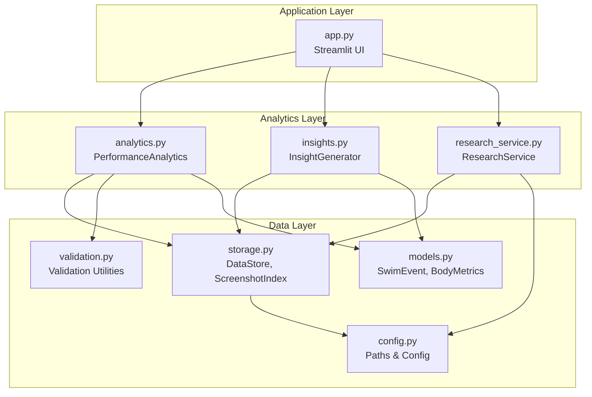
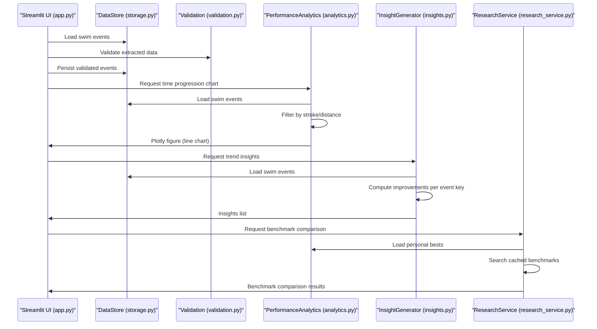
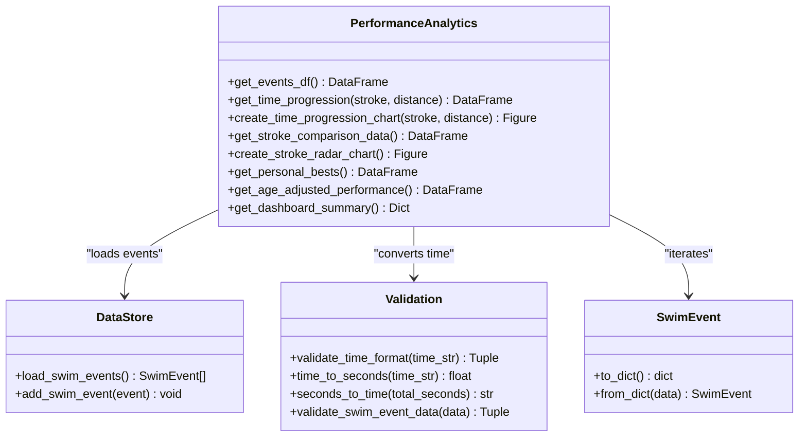
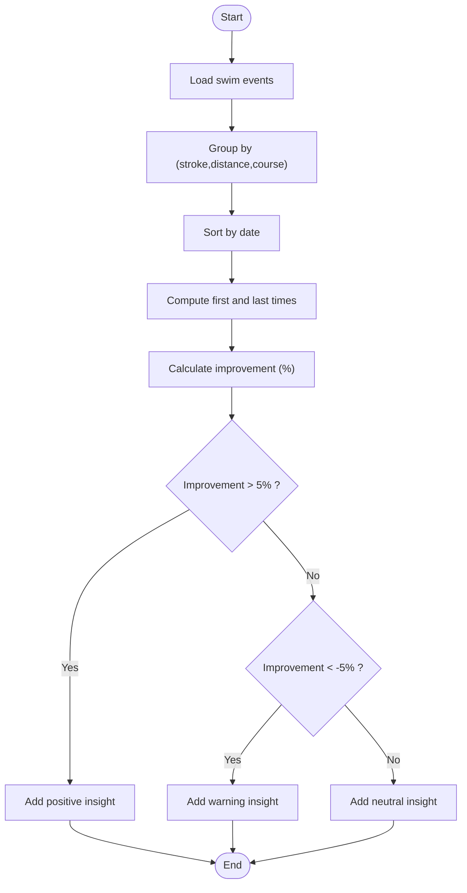
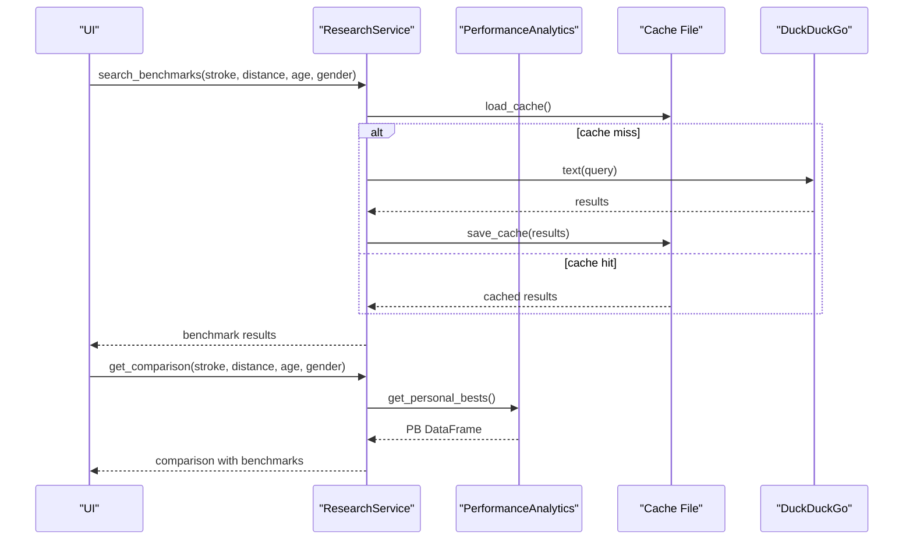
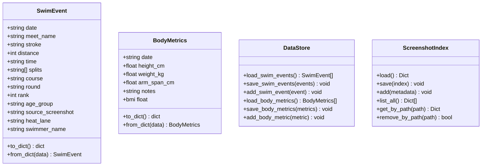
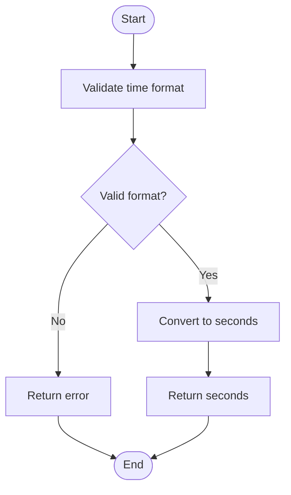
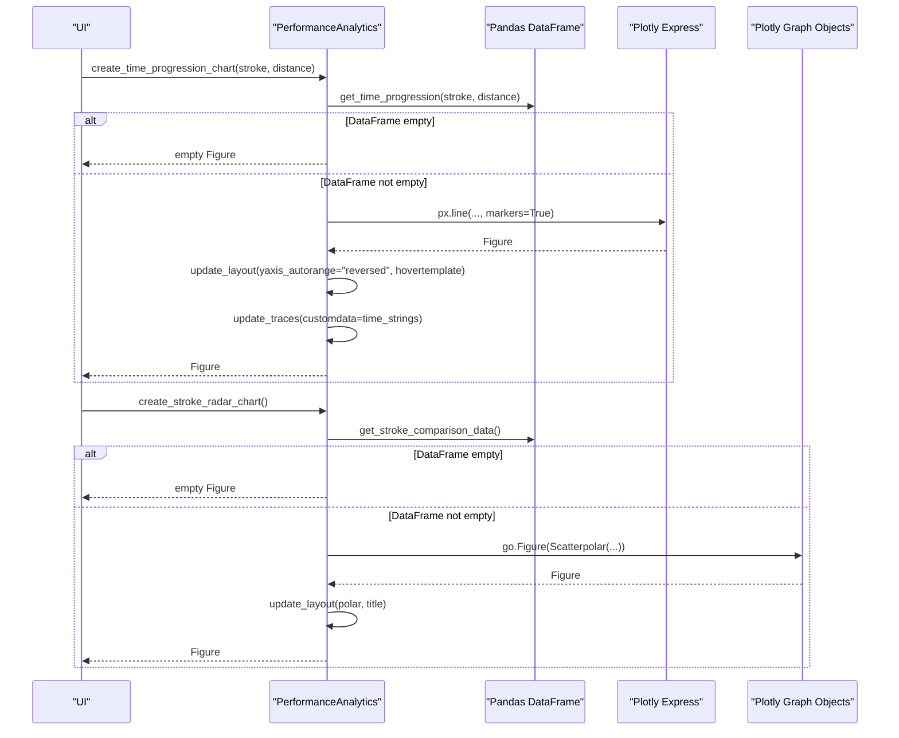
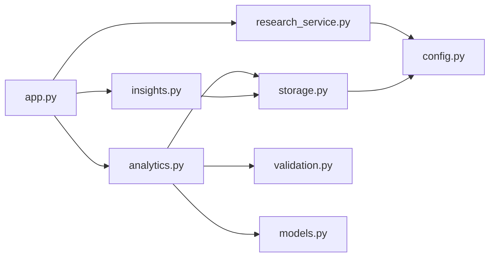

# Analytics Engine

<cite>
**Referenced Files in This Document**
- [app.py](file://app.py)
- [analytics.py](file://src/analytics.py)
- [models.py](file://src/models.py)
- [storage.py](file://src/storage.py)
- [validation.py](file://src/validation.py)
- [config.py](file://src/config.py)
- [insights.py](file://src/insights.py)
- [research_service.py](file://src/research_service.py)
- [README.md](file://README.md)
- [requirements.txt](file://requirements.txt)
</cite>

## Table of Contents
1. [Introduction](#introduction)
2. [Project Structure](#project-structure)
3. [Core Components](#core-components)
4. [Architecture Overview](#architecture-overview)
5. [Detailed Component Analysis](#detailed-component-analysis)
6. [Dependency Analysis](#dependency-analysis)
7. [Performance Considerations](#performance-considerations)
8. [Troubleshooting Guide](#troubleshooting-guide)
9. [Conclusion](#conclusion)
10. [Appendices](#appendices)

## Introduction
This document describes the analytics engine module responsible for swimming performance analysis. It covers performance calculation algorithms (time progression analysis, stroke comparison methodologies, and personal best tracking), visualization creation with Plotly (chart types, interactive features, and data formatting), the analytics pipeline from raw data input to visual output (filtering, statistical calculations, and trend identification), integration with the storage system for data retrieval, and the validation layer for data quality assurance. It also includes examples of common analytical queries, visualization outputs, performance metrics, and performance optimization strategies for large datasets and caching.

## Project Structure
The analytics engine is implemented as part of a Streamlit application that ingests swimming meet screenshots, extracts structured race data, stores it locally, and provides interactive analytics and insights.

**Diagram sources**
- [app.py:1-447](file://app.py#L1-L447)
- [analytics.py:13-184](file://src/analytics.py#L13-L184)
- [insights.py:11-150](file://src/insights.py#L11-L150)
- [research_service.py:10-94](file://src/research_service.py#L10-L94)
- [storage.py:10-107](file://src/storage.py#L10-L107)
- [validation.py:1-103](file://src/validation.py#L1-L103)
- [models.py:7-55](file://src/models.py#L7-L55)
- [config.py:1-29](file://src/config.py#L1-L29)

**Section sources**
- [README.md:1-63](file://README.md#L1-L63)
- [requirements.txt:1-10](file://requirements.txt#L1-L10)

## Core Components
- PerformanceAnalytics: Central analytics class providing time progression, stroke comparison, personal bests, age-adjusted performance, and dashboard summaries.
- InsightGenerator: Generates trend insights, identifies strengths/weaknesses, and produces training suggestions.
- ResearchService: Searches benchmark resources and caches results for comparison.
- DataStore and ScreenshotIndex: Local JSON-based persistence for swim events, body metrics, and screenshot metadata.
- Validation utilities: Time format validation and conversions, plus required-field checks.
- SwimEvent and BodyMetrics models: Typed data structures for analytics and visualization.

**Section sources**
- [analytics.py:13-184](file://src/analytics.py#L13-L184)
- [insights.py:11-150](file://src/insights.py#L11-L150)
- [research_service.py:10-94](file://src/research_service.py#L10-L94)
- [storage.py:10-107](file://src/storage.py#L10-L107)
- [validation.py:1-103](file://src/validation.py#L1-L103)
- [models.py:7-55](file://src/models.py#L7-L55)

## Architecture Overview
The analytics pipeline begins with screenshot ingestion and OCR extraction, followed by validation and persistence. The analytics engine loads data, performs calculations, and renders visualizations via Plotly. Insights and research comparison augment the analytics with contextual trends and benchmarks.

**Diagram sources**
- [app.py:60-280](file://app.py#L60-L280)
- [storage.py:30-62](file://src/storage.py#L30-L62)
- [validation.py:75-103](file://src/validation.py#L75-L103)
- [analytics.py:30-184](file://src/analytics.py#L30-L184)
- [insights.py:14-120](file://src/insights.py#L14-L120)
- [research_service.py:31-84](file://src/research_service.py#L31-L84)

## Detailed Component Analysis

### PerformanceAnalytics
Responsibilities:
- Convert swim events to a DataFrame with normalized time and date.
- Filter time progression data by stroke and distance.
- Create interactive line charts for time progression.
- Aggregate stroke comparison data and produce radar charts.
- Compute personal bests per stroke-distance-course combination.
- Calculate age-adjusted performance metrics by computing improvement rates across grouped event keys.
- Provide dashboard summary statistics.

Key algorithms and logic:
- Time progression filtering: Applies stroke and distance filters and sorts by date.
- Stroke comparison normalization: Uses inverse ratio of average time to compute scores, enabling “higher is better” interpretation.
- Personal best tracking: Iterates events and keeps the minimal time per (stroke, distance, course) tuple, preserving associated metadata.
- Age-adjusted performance: Groups by event_key constructed from stroke, distance, and course; computes improvement percentage between first and last times.

Visualization creation:
- Line chart: Uses Plotly Express line chart with markers and reversed y-axis to show faster times at the top. Hover template displays formatted time strings.
- Radar chart: Uses Plotly Graph Objects Scatterpolar with cyclic theta and fill toself for a radar-like visualization.

**Diagram sources**
- [analytics.py:13-184](file://src/analytics.py#L13-L184)
- [storage.py:30-44](file://src/storage.py#L30-L44)
- [validation.py:26-103](file://src/validation.py#L26-L103)
- [models.py:24-29](file://src/models.py#L24-L29)

**Section sources**
- [analytics.py:16-184](file://src/analytics.py#L16-L184)

### InsightGenerator
Responsibilities:
- Generate trend insights by grouping events by stroke-distance-course and computing improvement percentages between first and last times.
- Identify strengths and weaknesses by computing average pace per stroke (time per meter).
- Assess potential based on trend counts, consistency, and strengths.
- Provide training suggestions tailored to the weakest stroke and general drills.

Processing logic:
- Trend insights: Threshold-based classification (>5% improvement, <-5% decline, neutral).
- Strengths/weaknesses: Average pace per stroke computed from total time divided by distance; lower pace indicates stronger performance.
- Potential assessment: Aggregates counts and generates trajectory and recommendation.
- Training suggestions: Provides drills per stroke and general recommendations.

**Diagram sources**
- [insights.py:14-63](file://src/insights.py#L14-L63)

**Section sources**
- [insights.py:14-150](file://src/insights.py#L14-L150)

### ResearchService
Responsibilities:
- Search benchmark resources using DuckDuckGo search.
- Cache results to reduce repeated network requests.
- Compare personal best against benchmark results.

Processing logic:
- Search: Constructs a query string and executes DuckDuckGo search; caches results keyed by stroke, distance, age, and gender.
- Comparison: Retrieves personal best from PerformanceAnalytics and pairs it with benchmark results.

**Diagram sources**
- [research_service.py:31-84](file://src/research_service.py#L31-L84)
- [analytics.py:114-139](file://src/analytics.py#L114-L139)

**Section sources**
- [research_service.py:10-94](file://src/research_service.py#L10-L94)

### Data Models and Storage
- SwimEvent: Typed dataclass representing a single race result with date, meet name, stroke, distance, time, splits, course, round, rank, age group, source screenshot, heat/lane, and swimmer name. Includes serialization helpers.
- BodyMetrics: Typed dataclass for body measurements with BMI computation property.
- DataStore: JSON-based persistence for swim events and body metrics; provides load/save/add operations and ensures directories exist.
- ScreenshotIndex: Manages screenshot metadata index with add, list, get, and remove operations.

**Diagram sources**
- [models.py:7-55](file://src/models.py#L7-L55)
- [storage.py:10-107](file://src/storage.py#L10-L107)

**Section sources**
- [models.py:7-55](file://src/models.py#L7-L55)
- [storage.py:10-107](file://src/storage.py#L10-L107)

### Validation Layer
Responsibilities:
- Validate time format (MM:SS.ss or SS.ss) and required fields.
- Convert between time string and seconds and vice versa.

Processing logic:
- Time format validation uses regex patterns defined in configuration.
- Conversions handle colon-separated minutes:seconds and decimal seconds.

**Diagram sources**
- [validation.py:7-60](file://src/validation.py#L7-L60)
- [config.py:26-29](file://src/config.py#L26-L29)

**Section sources**
- [validation.py:1-103](file://src/validation.py#L1-L103)
- [config.py:26-29](file://src/config.py#L26-L29)

### Visualization Creation with Plotly
Chart types and features:
- Time progression line chart:
  - Chart type: Plotly Express line with markers.
  - Interactive features: Hover template shows date and formatted time; y-axis reversed to place faster times at the top.
  - Data formatting: Uses seconds for axis and original time strings for hover.
- Stroke comparison radar chart:
  - Chart type: Plotly Graph Objects Scatterpolar with cyclic theta and fill toself.
  - Normalization: Scores computed as inverse ratio of average time scaled to 0–100; higher is better.
  - Layout: Radial axis range 0–100, no legend, centered title.

**Diagram sources**
- [analytics.py:30-112](file://src/analytics.py#L30-L112)

**Section sources**
- [analytics.py:30-112](file://src/analytics.py#L30-L112)

## Dependency Analysis
External dependencies:
- Streamlit: UI framework for the application.
- Pandas: Data manipulation and aggregation.
- Plotly: Interactive charting library.
- Pillow: Image handling for thumbnails.
- DuckDuckGo Search: Web search for benchmarks.
- OpenAI: Used by other services (not covered here).
- python-dotenv: Environment configuration.

Internal dependencies:
- app.py depends on analytics, insights, research_service, storage, validation, and models.
- analytics.py depends on models, validation, and storage.
- insights.py depends on models, validation, and storage.
- research_service.py depends on config and storage.
- storage.py depends on config and models.

**Diagram sources**
- [app.py:10-20](file://app.py#L10-L20)
- [analytics.py:8-10](file://src/analytics.py#L8-L10)
- [insights.py:5-8](file://src/insights.py#L5-L8)
- [research_service.py:6-7](file://src/research_service.py#L6-L7)
- [storage.py:6-7](file://src/storage.py#L6-L7)
- [config.py:1-29](file://src/config.py#L1-L29)

**Section sources**
- [requirements.txt:1-10](file://requirements.txt#L1-L10)
- [app.py:10-20](file://app.py#L10-L20)

## Performance Considerations
- Data loading and filtering:
  - Use DataFrame filtering and sorting efficiently; avoid repeated conversions by precomputing time_seconds and date during DataFrame construction.
  - Cache frequently accessed datasets (e.g., personal bests) to reduce repeated computations.
- Visualization rendering:
  - Minimize data duplication in hover templates; pass customdata arrays directly to traces.
  - Prefer vectorized operations for normalization and scoring.
- Large dataset optimization:
  - Paginate or limit visible data in UI components.
  - Use categorical filtering (stroke, distance) to reduce dataset size before plotting.
- Caching strategies:
  - ResearchService caches benchmark search results keyed by query parameters.
  - Consider adding a lightweight in-memory cache for analytics results (e.g., personal bests, stroke comparison data) to avoid recomputation on rapid UI updates.
- I/O optimization:
  - Batch writes to JSON files; avoid frequent disk writes during bulk operations.
  - Ensure directories exist before writing to prevent exceptions.

[No sources needed since this section provides general guidance]

## Troubleshooting Guide
Common issues and resolutions:
- Empty analytics output:
  - Ensure swim events are persisted and not empty; verify DataStore.load_swim_events returns data.
  - Check that time strings conform to expected formats; use validate_time_format to diagnose.
- No data for selection:
  - Verify that the selected stroke and distance combinations exist in the dataset; filter by available values.
- Benchmark search failures:
  - Confirm internet connectivity and DuckDuckGo availability; inspect cache file permissions.
- Time format errors:
  - Validate time strings using validate_time_format and convert with time_to_seconds; ensure seconds_to_time formatting is consistent.
- Performance degradation:
  - Reduce dataset size by applying filters; consider caching results; avoid unnecessary reruns in Streamlit.

**Section sources**
- [validation.py:7-103](file://src/validation.py#L7-L103)
- [storage.py:14-28](file://src/storage.py#L14-L28)
- [research_service.py:14-53](file://src/research_service.py#L14-L53)

## Conclusion
The analytics engine provides a robust foundation for swimming performance analysis, combining efficient data processing, insightful visualizations, and actionable insights. By leveraging typed models, validation utilities, and JSON-based persistence, it supports scalable growth and reliable data quality. Integrations with research services and trend analysis enhance the platform’s ability to guide training decisions and benchmark progress.

[No sources needed since this section summarizes without analyzing specific files]

## Appendices

### Common Analytical Queries and Outputs
- Time progression:
  - Query: Select a stroke and distance; engine filters events and sorts by date.
  - Output: Line chart with markers; hover shows date and formatted time; faster times appear higher.
- Stroke comparison:
  - Query: Aggregate best times per stroke; normalize scores.
  - Output: Radar chart with cyclic theta and filled area; higher scores indicate better relative performance.
- Personal bests:
  - Query: Minimal time per (stroke, distance, course).
  - Output: Tabular view of best times with associated dates and meets.
- Age-adjusted performance:
  - Query: Group by event_key; compute improvement percentage between first and last times.
  - Output: Summary table with improvement percent, number of races, and event identifiers.
- Trend insights:
  - Query: Group by stroke-distance-course; compute improvement percentiles.
  - Output: Categorized insights (positive, warning, neutral) with messages and data points.
- Research comparison:
  - Query: Retrieve personal best and search benchmarks.
  - Output: Comparison card with personal best, benchmark references, and note about percentile estimation.

**Section sources**
- [analytics.py:30-184](file://src/analytics.py#L30-L184)
- [insights.py:14-150](file://src/insights.py#L14-L150)
- [research_service.py:31-84](file://src/research_service.py#L31-L84)