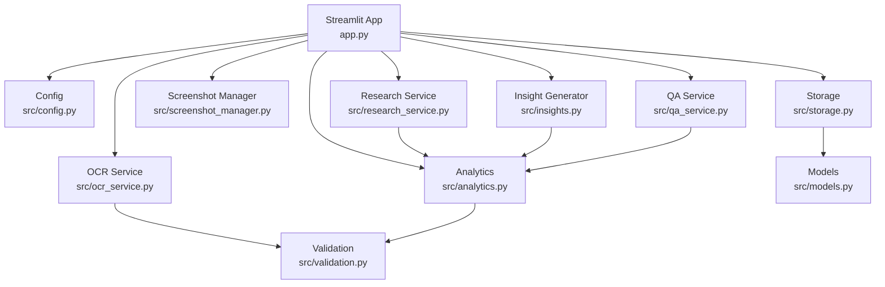
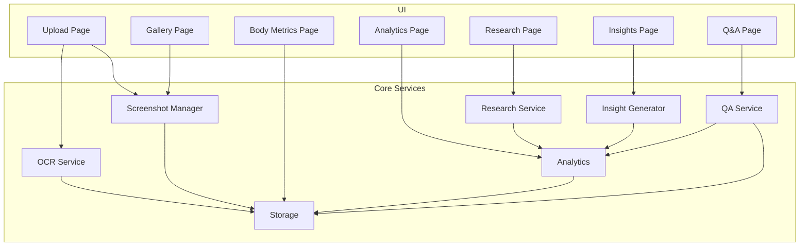
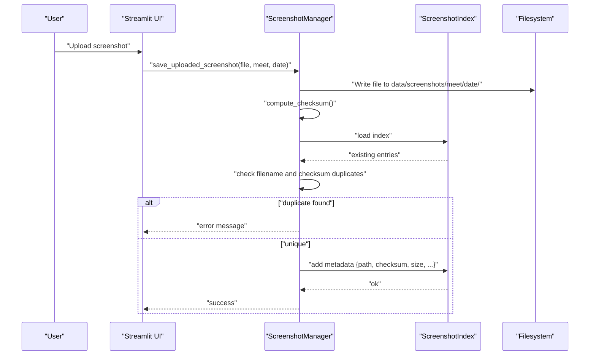
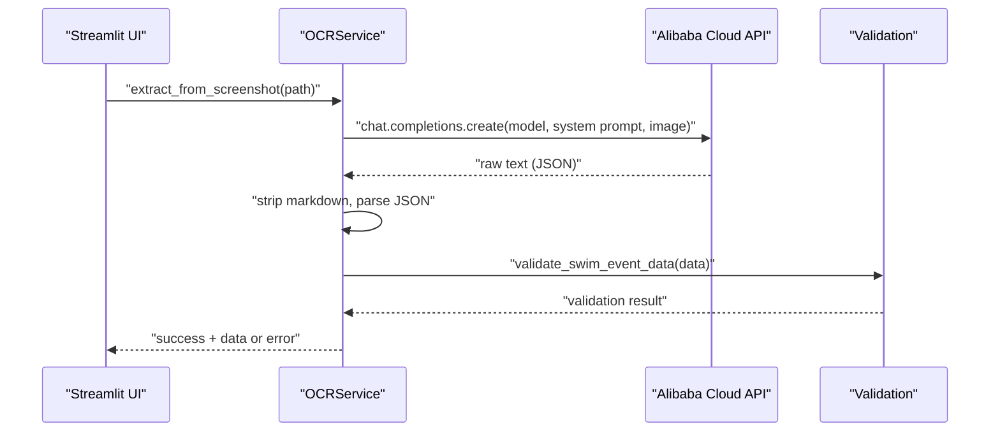
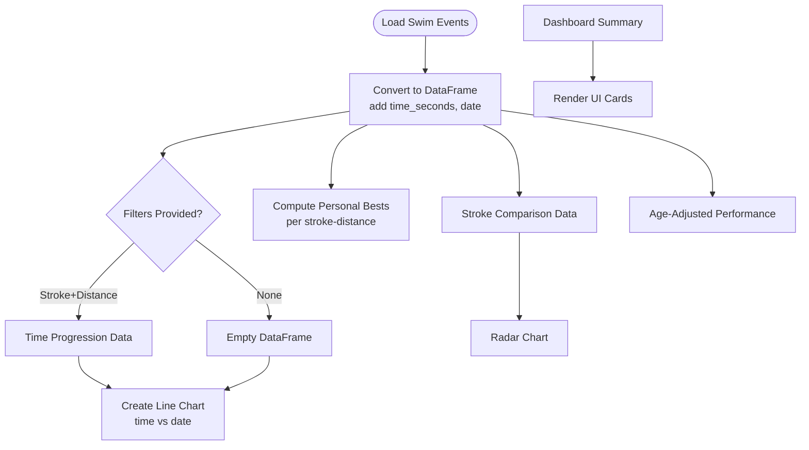
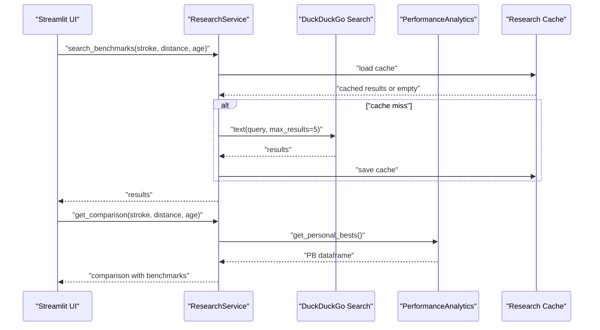
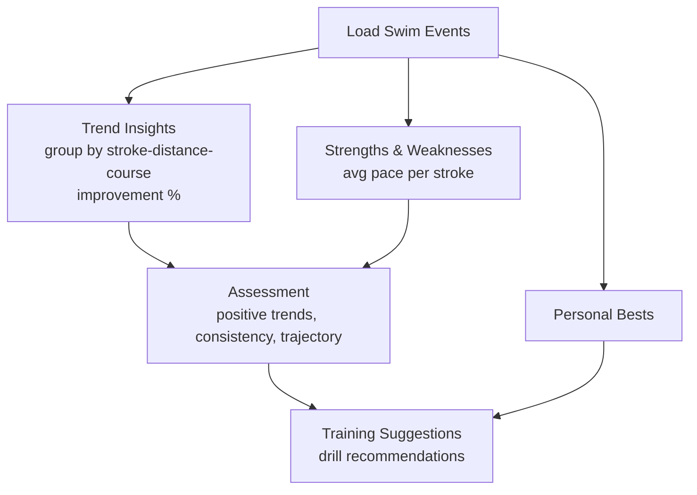
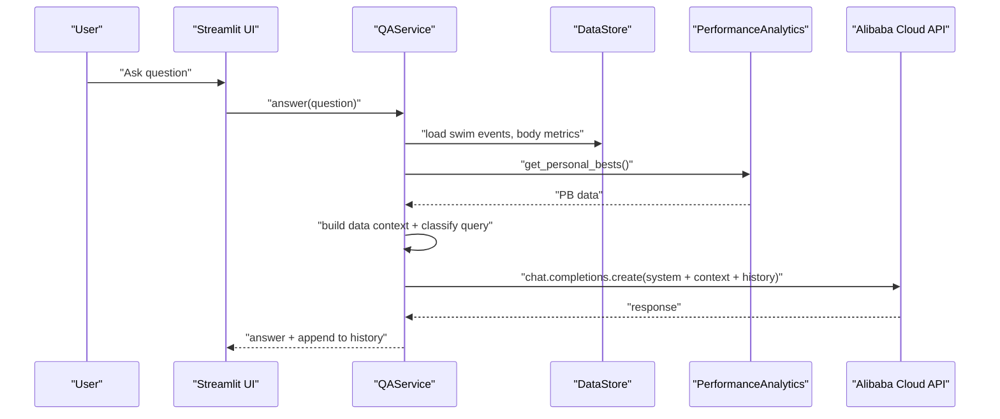
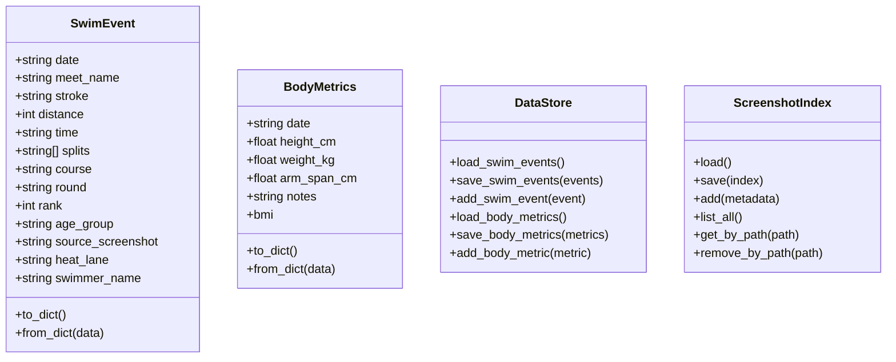
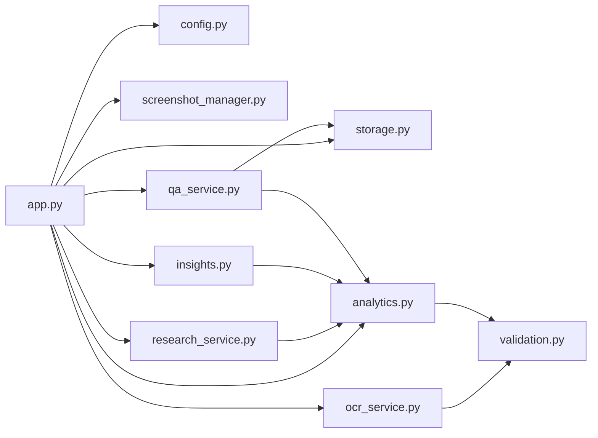

# Feature Modules

<cite>
**Referenced Files in This Document**
- [app.py](file://app.py)
- [src/config.py](file://src/config.py)
- [src/models.py](file://src/models.py)
- [src/storage.py](file://src/storage.py)
- [src/screenshot_manager.py](file://src/screenshot_manager.py)
- [src/ocr_service.py](file://src/ocr_service.py)
- [src/validation.py](file://src/validation.py)
- [src/analytics.py](file://src/analytics.py)
- [src/research_service.py](file://src/research_service.py)
- [src/insights.py](file://src/insights.py)
- [src/qa_service.py](file://src/qa_service.py)
- [README.md](file://README.md)
- [openspec/changes/sunny-swim-analysis-platform/specs/screenshot-data-ingestion/spec.md](file://openspec/changes/sunny-swim-analysis-platform/specs/screenshot-data-ingestion/spec.md)
- [openspec/changes/sunny-swim-analysis-platform/specs/ocr-data-extraction/spec.md](file://openspec/changes/sunny-swim-analysis-platform/specs/ocr-data-extraction/spec.md)
- [openspec/changes/sunny-swim-analysis-platform/specs/performance-analytics/spec.md](file://openspec/changes/sunny-swim-analysis-platform/specs/performance-analytics/spec.md)
- [openspec/changes/sunny-swim-analysis-platform/specs/research-comparison/spec.md](file://openspec/changes/sunny-swim-analysis-platform/specs/research-comparison/spec.md)
</cite>

## Table of Contents
1. [Introduction](#introduction)
2. [Project Structure](#project-structure)
3. [Core Components](#core-components)
4. [Architecture Overview](#architecture-overview)
5. [Detailed Component Analysis](#detailed-component-analysis)
6. [Dependency Analysis](#dependency-analysis)
7. [Performance Considerations](#performance-considerations)
8. [Troubleshooting Guide](#troubleshooting-guide)
9. [Conclusion](#conclusion)
10. [Appendices](#appendices)

## Introduction
This document describes the feature modules that power the Swimming Data Analysis Platform. It covers the screenshot processing pipeline (upload management, duplicate detection, thumbnail generation, and file operations), OCR integration with Alibaba Cloud Vision-Language models for structured data extraction, the analytics engine (performance calculations, visualizations, time progression charts, and personal best tracking), the research comparison system (benchmark search and age-group comparison), insight generation algorithms (trend analysis and training recommendations), and the Q&A system (natural language processing and response generation). It also documents module interfaces, data flow patterns, and integration points between features.

## Project Structure
The platform is a Streamlit application with a modular Python backend. Key modules include:
- Configuration and paths
- Data models
- Storage layer (JSON-backed persistence)
- Screenshot ingestion and gallery
- OCR extraction via Alibaba Cloud
- Data validation utilities
- Analytics and visualization
- Research comparison and caching
- Insight generation
- Q&A with conversation history

**Diagram sources**
- [app.py:1-447](file://app.py#L1-L447)
- [src/config.py:1-29](file://src/config.py#L1-L29)
- [src/storage.py:1-107](file://src/storage.py#L1-L107)
- [src/screenshot_manager.py:1-136](file://src/screenshot_manager.py#L1-L136)
- [src/ocr_service.py:1-144](file://src/ocr_service.py#L1-L144)
- [src/validation.py:1-103](file://src/validation.py#L1-L103)
- [src/analytics.py:1-184](file://src/analytics.py#L1-L184)
- [src/research_service.py:1-94](file://src/research_service.py#L1-L94)
- [src/insights.py:1-150](file://src/insights.py#L1-L150)
- [src/qa_service.py:1-174](file://src/qa_service.py#L1-L174)

**Section sources**
- [README.md:1-63](file://README.md#L1-L63)
- [app.py:1-447](file://app.py#L1-L447)

## Core Components
- Configuration and Paths: Centralizes environment variables, file paths, and time format patterns.
- Data Models: Defines SwimEvent and BodyMetrics dataclasses with serialization helpers.
- Storage Layer: Provides JSON-backed persistence for swim events, body metrics, and screenshot index.
- Screenshot Manager: Handles upload, duplicate detection (by filename and checksum), thumbnail generation, and deletion.
- OCR Service: Integrates with Alibaba Cloud Model Studio to extract structured swimming data from screenshots.
- Validation Utilities: Validates time formats, converts between time formats, and validates extracted data.
- Analytics Engine: Computes summaries, time progression charts, stroke radar comparisons, personal bests, and age-adjusted performance.
- Research Service: Searches benchmarks, caches results, and compares personal bests against benchmarks.
- Insight Generator: Generates trend insights, identifies strengths/weaknesses, assesses potential, and suggests training drills.
- QA Service: Natural language Q&A over stored data with conversation history and query classification.

**Section sources**
- [src/config.py:1-29](file://src/config.py#L1-L29)
- [src/models.py:1-55](file://src/models.py#L1-L55)
- [src/storage.py:1-107](file://src/storage.py#L1-L107)
- [src/screenshot_manager.py:1-136](file://src/screenshot_manager.py#L1-L136)
- [src/ocr_service.py:1-144](file://src/ocr_service.py#L1-L144)
- [src/validation.py:1-103](file://src/validation.py#L1-L103)
- [src/analytics.py:1-184](file://src/analytics.py#L1-L184)
- [src/research_service.py:1-94](file://src/research_service.py#L1-L94)
- [src/insights.py:1-150](file://src/insights.py#L1-L150)
- [src/qa_service.py:1-174](file://src/qa_service.py#L1-L174)

## Architecture Overview
The application is a Streamlit frontend orchestrating feature modules. Data flows from user uploads and manual entries into storage, then into analytics, research, insights, and Q&A services. The OCR module integrates with Alibaba Cloud to transform screenshots into structured data.

**Diagram sources**
- [app.py:60-403](file://app.py#L60-L403)
- [src/screenshot_manager.py:27-82](file://src/screenshot_manager.py#L27-L82)
- [src/ocr_service.py:49-116](file://src/ocr_service.py#L49-L116)
- [src/analytics.py:17-183](file://src/analytics.py#L17-L183)
- [src/research_service.py:32-84](file://src/research_service.py#L32-L84)
- [src/insights.py:15-149](file://src/insights.py#L15-L149)
- [src/qa_service.py:76-134](file://src/qa_service.py#L76-L134)

## Detailed Component Analysis

### Screenshot Processing Pipeline
The pipeline manages upload, duplicate detection, indexing, and gallery operations.

**Diagram sources**
- [app.py:73-118](file://app.py#L73-L118)
- [src/screenshot_manager.py:27-82](file://src/screenshot_manager.py#L27-L82)
- [src/storage.py:64-107](file://src/storage.py#L64-L107)

Key behaviors:
- Organized storage by meet and date folders.
- Duplicate detection by filename and MD5 checksum.
- Metadata indexing with upload timestamp, checksum, and size.
- Thumbnail generation for gallery display.
- Deletion with cleanup of empty directories.

**Section sources**
- [src/screenshot_manager.py:14-136](file://src/screenshot_manager.py#L14-L136)
- [src/storage.py:64-107](file://src/storage.py#L64-L107)
- [openspec/changes/sunny-swim-analysis-platform/specs/screenshot-data-ingestion/spec.md:1-23](file://openspec/changes/sunny-swim-analysis-platform/specs/screenshot-data-ingestion/spec.md#L1-L23)

### OCR Integration with Alibaba Cloud Vision-Language Models
OCR extracts structured swimming data from screenshots using Alibaba Cloud Model Studio.

**Diagram sources**
- [app.py:82-116](file://app.py#L82-L116)
- [src/ocr_service.py:49-116](file://src/ocr_service.py#L49-L116)
- [src/validation.py:75-103](file://src/validation.py#L75-L103)

Highlights:
- Uses Qwen vision-language model for image+text prompts.
- Applies strict JSON parsing and validation.
- Adds placeholder confidence and error metadata.
- Supports manual entry fallback via form fields.

**Section sources**
- [src/ocr_service.py:12-144](file://src/ocr_service.py#L12-L144)
- [openspec/changes/sunny-swim-analysis-platform/specs/ocr-data-extraction/spec.md:1-31](file://openspec/changes/sunny-swim-analysis-platform/specs/ocr-data-extraction/spec.md#L1-L31)

### Analytics Engine
Analytics computes summaries, visualizations, and performance metrics.

**Diagram sources**
- [src/analytics.py:17-183](file://src/analytics.py#L17-L183)

Capabilities:
- Time progression charts with Plotly.
- Stroke radar comparison normalized for performance.
- Personal best tracking across stroke-distance-course combinations.
- Age-adjusted performance metrics by grouping events.

**Section sources**
- [src/analytics.py:13-184](file://src/analytics.py#L13-L184)
- [openspec/changes/sunny-swim-analysis-platform/specs/performance-analytics/spec.md:1-30](file://openspec/changes/sunny-swim-analysis-platform/specs/performance-analytics/spec.md#L1-L30)

### Research Comparison System
ResearchService searches benchmarks and compares personal bests.

**Diagram sources**
- [app.py:294-319](file://app.py#L294-L319)
- [src/research_service.py:32-84](file://src/research_service.py#L32-L84)

Features:
- DuckDuckGo search for benchmarks.
- Caching to avoid repeated searches.
- Comparison of personal bests against benchmark references.

**Section sources**
- [src/research_service.py:10-94](file://src/research_service.py#L10-L94)
- [openspec/changes/sunny-swim-analysis-platform/specs/research-comparison/spec.md:1-23](file://openspec/changes/sunny-swim-analysis-platform/specs/research-comparison/spec.md#L1-L23)

### Insight Generation Algorithms
InsightGenerator produces trend insights, strength/weakness analysis, potential assessment, and training suggestions.

**Diagram sources**
- [src/insights.py:15-149](file://src/insights.py#L15-L149)

Outputs:
- Trend insights with improvement/decline/consistent classifications.
- Strengths and weaknesses by stroke pace.
- Potential assessment with recommendation synthesis.
- Drill-focused training suggestions.

**Section sources**
- [src/insights.py:11-150](file://src/insights.py#L11-L150)

### Q&A System
QAService answers natural language questions using stored data and conversation history.

**Diagram sources**
- [app.py:386-397](file://app.py#L386-L397)
- [src/qa_service.py:76-134](file://src/qa_service.py#L76-L134)

Capabilities:
- Query classification (personal best, trend, comparison, advice, rank, general).
- Conversation history integration for follow-ups.
- Out-of-scope filtering and API availability checks.

**Section sources**
- [src/qa_service.py:12-174](file://src/qa_service.py#L12-L174)

### Data Models and Storage
Data models define SwimEvent and BodyMetrics with serialization. Storage persists to JSON files and maintains a screenshot index.

**Diagram sources**
- [src/models.py:7-55](file://src/models.py#L7-L55)
- [src/storage.py:10-107](file://src/storage.py#L10-L107)

**Section sources**
- [src/models.py:1-55](file://src/models.py#L1-L55)
- [src/storage.py:1-107](file://src/storage.py#L1-L107)

## Dependency Analysis
Module-level dependencies and coupling:
- app.py orchestrates all modules and depends on configuration, models, storage, and feature services.
- OCRService depends on validation utilities and configuration for API keys.
- Analytics depends on models, validation, and storage.
- ResearchService depends on analytics for personal bests and uses external search.
- InsightGenerator depends on analytics and storage.
- QAService depends on analytics and storage, with conversation history.

**Diagram sources**
- [app.py:10-19](file://app.py#L10-L19)
- [src/ocr_service.py:8-9](file://src/ocr_service.py#L8-L9)
- [src/analytics.py:8-10](file://src/analytics.py#L8-L10)
- [src/research_service.py:6-7](file://src/research_service.py#L6-L7)
- [src/insights.py:5-8](file://src/insights.py#L5-L8)
- [src/qa_service.py:6-9](file://src/qa_service.py#L6-L9)

**Section sources**
- [app.py:10-19](file://app.py#L10-L19)

## Performance Considerations
- OCR latency: API calls can be slow; spinner feedback improves UX.
- Image processing: Thumbnail generation uses PIL; consider caching thumbnails.
- Data size: Large event datasets can impact analytics rendering; pre-aggregate where possible.
- Search caching: ResearchService caches results to reduce network overhead.
- JSON I/O: Frequent reads/writes to JSON files; batch operations where feasible.

## Troubleshooting Guide
Common issues and resolutions:
- Missing Alibaba Cloud API key:
  - Symptom: OCR/QA failures with configuration warnings.
  - Action: Set environment variables as per configuration and restart.
- Duplicate screenshot upload:
  - Symptom: Error indicating duplicate by filename or checksum.
  - Action: Rename file or adjust meet/date; checksum prevents overwrites.
- Invalid time format:
  - Symptom: Validation errors for time or split formats.
  - Action: Ensure MM:SS.ss or SS.ss format; use validation utilities for conversion.
- No data for analytics:
  - Symptom: Empty charts or info messages.
  - Action: Upload screenshots and enable OCR extraction; ensure events are saved.
- Research search failures:
  - Symptom: Error results from DuckDuckGo search.
  - Action: Retry later; check cache file permissions.

**Section sources**
- [src/ocr_service.py:55-56](file://src/ocr_service.py#L55-L56)
- [src/qa_service.py:87-88](file://src/qa_service.py#L87-L88)
- [src/screenshot_manager.py:52-68](file://src/screenshot_manager.py#L52-L68)
- [src/validation.py:7-23](file://src/validation.py#L7-L23)
- [app.py:442-446](file://app.py#L442-L446)

## Conclusion
The Swimming Data Analysis Platform integrates screenshot ingestion, AI-powered OCR, robust analytics, research comparison, insights, and Q&A into a cohesive workflow. The modular design enables clear separation of concerns, while shared models and storage provide a unified data backbone. The UI orchestrates these modules to deliver actionable insights and a smooth user experience.

## Appendices

### Module Interfaces Summary
- ScreenshotManager
  - save_uploaded_screenshot, list_screenshots, get_screenshot_thumbnail, delete_screenshot, get_screenshot_count
- OCRService
  - extract_from_screenshot, manual_entry_form_fields, parse_splits
- DataStore
  - load/save/add for swim events and body metrics
- ScreenshotIndex
  - load/save/add/list/remove_by_path
- PerformanceAnalytics
  - get_events_df, get_time_progression, create_time_progression_chart, create_stroke_radar_chart, get_personal_bests, get_age_adjusted_performance, get_dashboard_summary
- ResearchService
  - search_benchmarks, get_comparison, add_manual_benchmark_url
- InsightGenerator
  - generate_trend_insights, identify_strengths_weaknesses, assess_potential, get_training_suggestions
- QAService
  - answer, clear_history, get_personal_best_answer, get_trend_answer

**Section sources**
- [src/screenshot_manager.py:27-136](file://src/screenshot_manager.py#L27-L136)
- [src/ocr_service.py:49-144](file://src/ocr_service.py#L49-L144)
- [src/storage.py:30-107](file://src/storage.py#L30-L107)
- [src/analytics.py:16-184](file://src/analytics.py#L16-L184)
- [src/research_service.py:32-94](file://src/research_service.py#L32-L94)
- [src/insights.py:15-150](file://src/insights.py#L15-L150)
- [src/qa_service.py:76-174](file://src/qa_service.py#L76-L174)