# Insight Generation

<cite>
**Referenced Files in This Document**
- [insights.py](file://src/insights.py)
- [analytics.py](file://src/analytics.py)
- [models.py](file://src/models.py)
- [storage.py](file://src/storage.py)
- [validation.py](file://src/validation.py)
- [config.py](file://src/config.py)
- [app.py](file://app.py)
- [spec.md](file://openspec/changes/sunny-swim-analysis-platform/specs/insight-generation/spec.md)
- [README.md](file://README.md)
- [requirements.txt](file://requirements.txt)
</cite>

## Update Summary
**Changes Made**
- Updated Insights tab layout section to reflect the new sequential layout with sorted trends
- Enhanced UI integration documentation to include structured table presentations
- Added documentation for the new trend sorting mechanism by improvement percentage
- Updated workflow diagrams to show the improved sequential presentation format

## Table of Contents
1. [Introduction](#introduction)
2. [Project Structure](#project-structure)
3. [Core Components](#core-components)
4. [Architecture Overview](#architecture-overview)
5. [Detailed Component Analysis](#detailed-component-analysis)
6. [UI Layout and Presentation](#ui-layout-and-presentation)
7. [Dependency Analysis](#dependency-analysis)
8. [Performance Considerations](#performance-considerations)
9. [Troubleshooting Guide](#troubleshooting-guide)
10. [Conclusion](#conclusion)
11. [Appendices](#appendices)

## Introduction
This document explains the insight generation module that powers automated trend analysis and training recommendations for swimming performance. It covers the InsightGenerator class algorithms for trend identification, performance pattern recognition, and recommendation logic; the integration with the analytics module for data-driven insights; and the storage system for historical data analysis. It also documents the insight categorization system (performance trends, training suggestions, and potential assessment indicators), recommendation algorithms for workout modifications and pacing strategies, and practical workflows for generating insights from real-world data.

**Updated** The Insights tab now features a complete layout overhaul with sequential presentation format and sorted trends for improved readability and user comprehension.

## Project Structure
The insight generation module is part of a larger swimming analytics platform. The relevant components are organized as follows:
- Data models define the SwimEvent entity used across the system.
- Storage provides JSON-based persistence for swim events and body metrics.
- Validation utilities normalize and validate time formats and required fields.
- Analytics offers dataframes and visualizations derived from stored events.
- InsightGenerator orchestrates trend analysis, strength/weakness detection, potential assessment, and training suggestions.
- The Streamlit app integrates InsightGenerator into the UI and exposes insights to users with enhanced sequential layouts.

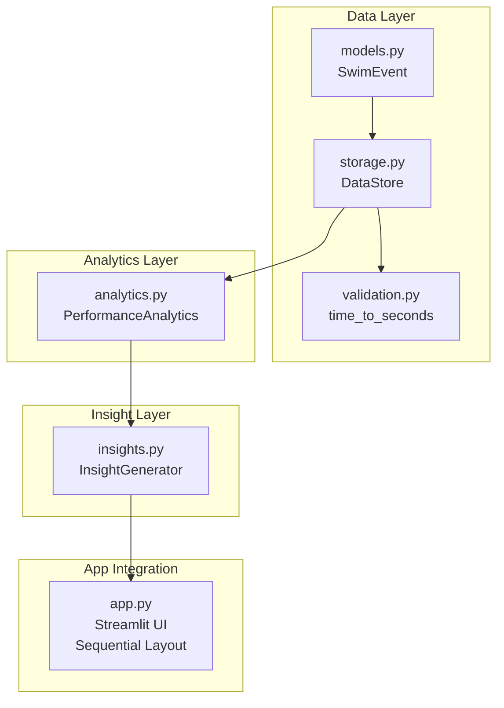

**Diagram sources**
- [models.py:7-30](file://src/models.py#L7-L30)
- [storage.py:10-62](file://src/storage.py#L10-L62)
- [validation.py:26-60](file://src/validation.py#L26-L60)
- [analytics.py:13-184](file://src/analytics.py#L13-L184)
- [insights.py:11-150](file://src/insights.py#L11-L150)
- [app.py:321-370](file://app.py#L321-L370)

**Section sources**
- [README.md:1-66](file://README.md#L1-L66)
- [requirements.txt:1-10](file://requirements.txt#L1-L10)

## Core Components
- InsightGenerator: Central class that computes trend insights, identifies strengths/weaknesses, assesses potential, and generates training suggestions.
- PerformanceAnalytics: Provides dataframes and visualizations for time progression, stroke comparison, personal bests, and dashboard summaries.
- DataStore: JSON-backed persistence for swim events and body metrics.
- SwimEvent: Typed dataclass representing a single race result with date, stroke, distance, time, splits, course, and related metadata.
- Validation utilities: Convert time strings to seconds and vice versa, validate formats, and enforce required fields.

Key responsibilities:
- Trend identification: Compares earliest and latest times within stroke-distance-course groups to compute percentage improvements.
- Strengths/weaknesses: Computes average pace per stroke (distance-normalized) to rank strokes.
- Potential assessment: Aggregates trend counts, stroke rankings, and consistency to produce a trajectory and recommendation.
- Training suggestions: Recommends drills aligned with the identified weakest stroke and general endurance sets.

**Section sources**
- [insights.py:11-150](file://src/insights.py#L11-L150)
- [analytics.py:13-184](file://src/analytics.py#L13-L184)
- [storage.py:10-62](file://src/storage.py#L10-L62)
- [models.py:7-30](file://src/models.py#L7-L30)
- [validation.py:26-60](file://src/validation.py#L26-L60)

## Architecture Overview
The insight generation pipeline connects UI, storage, analytics, and insight computation:

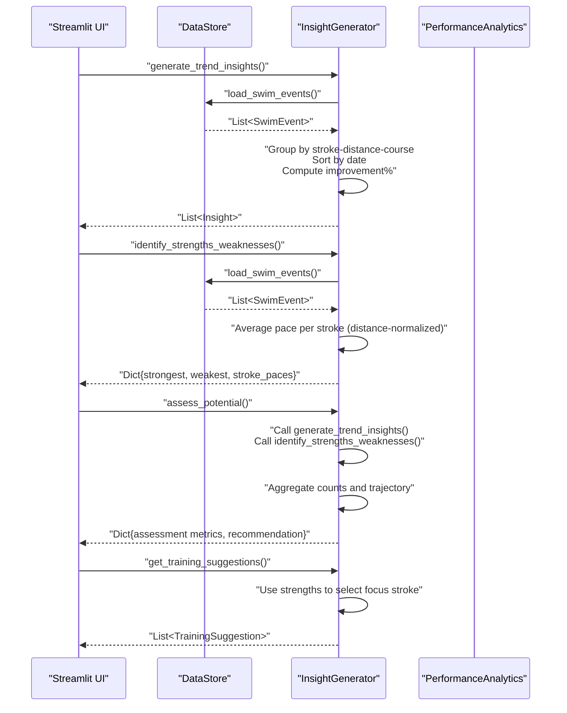

**Diagram sources**
- [app.py:321-370](file://app.py#L321-L370)
- [insights.py:14-149](file://src/insights.py#L14-L149)
- [storage.py:30-44](file://src/storage.py#L30-L44)

## Detailed Component Analysis

### InsightGenerator Class
The InsightGenerator class encapsulates the insight generation logic. It operates on SwimEvent records loaded from DataStore and produces:
- Trend insights: Improvement/decline/consistent performance across stroke-distance-course combinations.
- Strengths/weaknesses: Stroke ranking by average pace (lower is better).
- Potential assessment: Trajectory and recommendation based on trends and stroke distribution.
- Training suggestions: Drill recommendations focused on the weakest stroke and general sets.

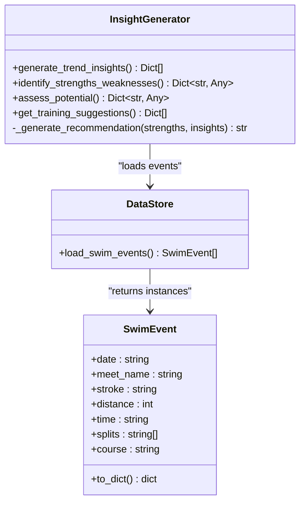

**Diagram sources**
- [insights.py:11-150](file://src/insights.py#L11-L150)
- [storage.py:30-44](file://src/storage.py#L30-L44)
- [models.py:7-30](file://src/models.py#L7-L30)

#### Trend Identification Algorithm
- Groups events by (stroke, distance, course).
- Filters groups with fewer than two entries.
- Sorts by date and compares first and last times.
- Computes improvement percentage and classifies as positive (>5%), warning (<-5%), or neutral (within 5%).

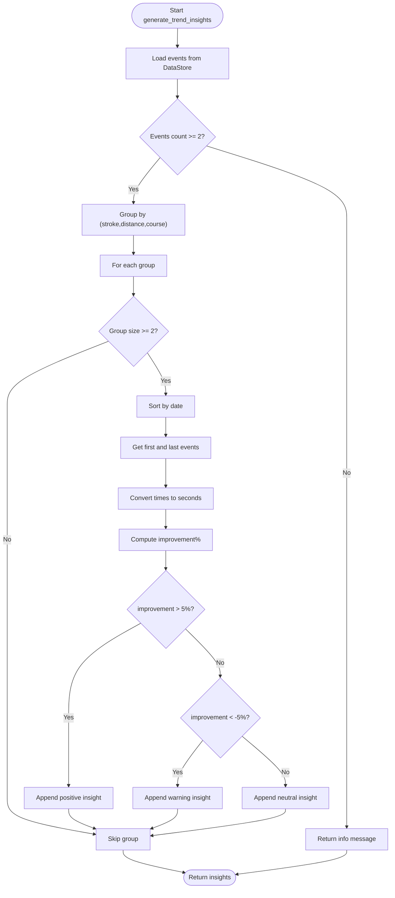

**Diagram sources**
- [insights.py:14-63](file://src/insights.py#L14-L63)
- [validation.py:26-42](file://src/validation.py#L26-L42)

**Section sources**
- [insights.py:14-63](file://src/insights.py#L14-L63)
- [validation.py:26-42](file://src/validation.py#L26-L42)

#### Strengths and Weaknesses Detection
- Aggregates all recorded times per stroke.
- Normalizes by distance to compute average pace per meter.
- Ranks strokes by average pace (ascending order indicates stronger strokes).

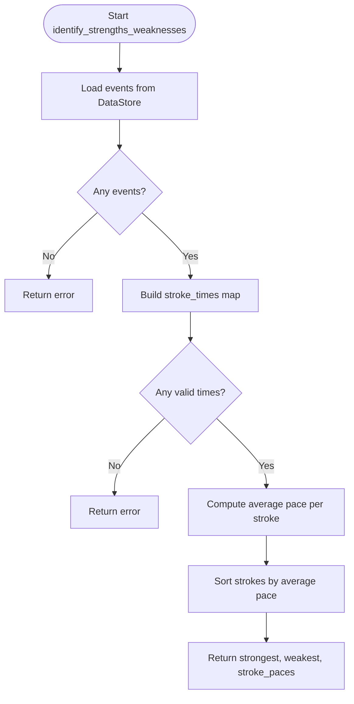

**Diagram sources**
- [insights.py:66-87](file://src/insights.py#L66-L87)

**Section sources**
- [insights.py:66-87](file://src/insights.py#L66-L87)

#### Potential Assessment Logic
- Counts positive trends from trend insights.
- Uses strengths/weaknesses to identify trajectory and consistency.
- Generates a recommendation based on the weakest stroke.

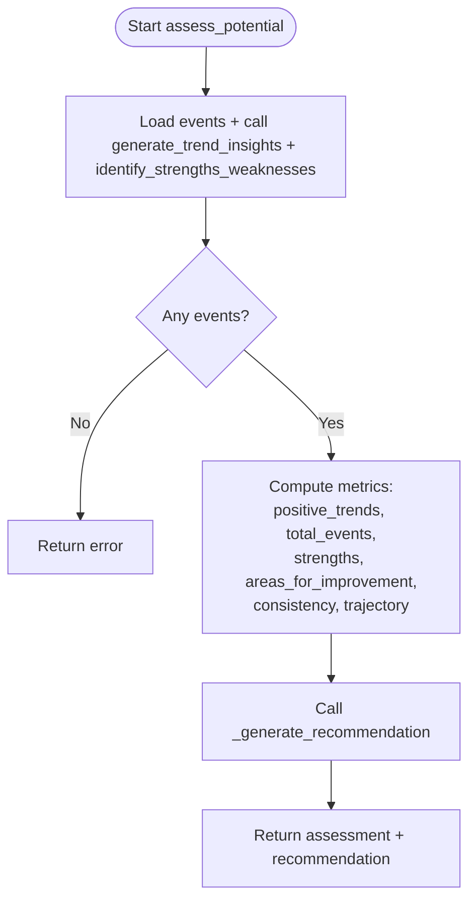

**Diagram sources**
- [insights.py:89-119](file://src/insights.py#L89-L119)

**Section sources**
- [insights.py:89-119](file://src/insights.py#L89-L119)

#### Training Suggestions Engine
- Identifies the weakest stroke and maps to specific drills.
- Adds general suggestions for endurance and race pace training.
- Assigns priority levels to guide focus.

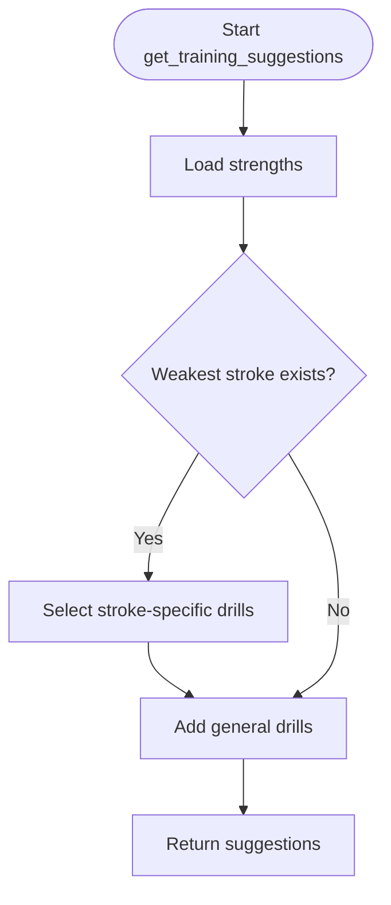

**Diagram sources**
- [insights.py:121-149](file://src/insights.py#L121-L149)

**Section sources**
- [insights.py:121-149](file://src/insights.py#L121-L149)

### Integration with Analytics Module
The analytics module provides dataframes and visualizations that complement InsightGenerator:
- DataFrames: Efficient aggregation for time progression, stroke comparison, personal bests, and age-adjusted metrics.
- Visualizations: Line charts for time progression and radar charts for stroke comparison.
- Dashboard summary: Quick stats for UI presentation.

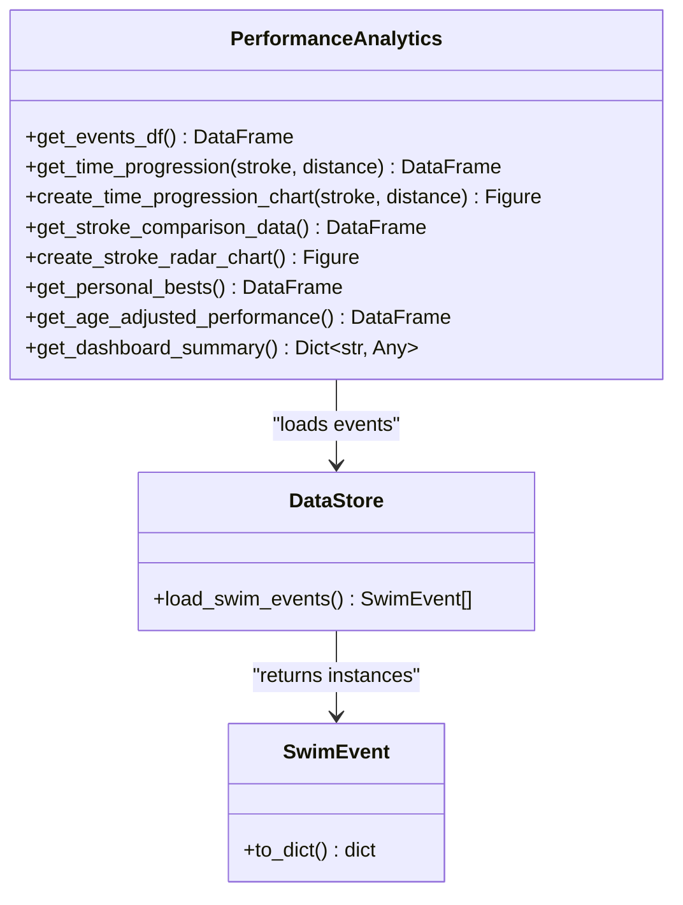

**Diagram sources**
- [analytics.py:13-184](file://src/analytics.py#L13-L184)
- [storage.py:30-44](file://src/storage.py#L30-L44)
- [models.py:24-29](file://src/models.py#L24-L29)

**Section sources**
- [analytics.py:13-184](file://src/analytics.py#L13-L184)

### Storage System for Historical Data
DataStore persists SwimEvent and BodyMetrics records in JSON files under the data directory. It handles loading, saving, and appending new entries, and provides a screenshot index manager.

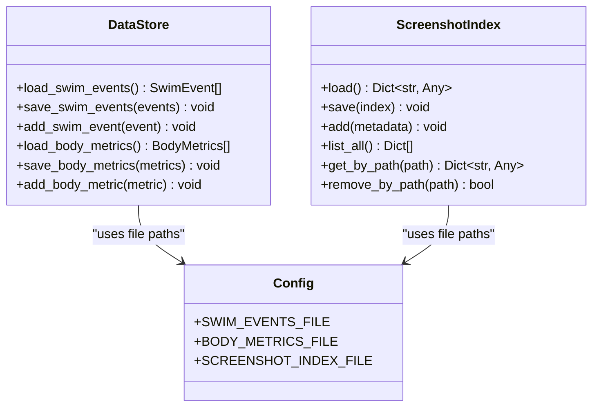

**Diagram sources**
- [storage.py:10-107](file://src/storage.py#L10-L107)
- [config.py:10-14](file://src/config.py#L10-L14)

**Section sources**
- [storage.py:10-107](file://src/storage.py#L10-L107)
- [config.py:10-14](file://src/config.py#L10-L14)

## UI Layout and Presentation

**Updated** The Insights tab now features a complete layout overhaul with sequential presentation format designed for improved readability and user comprehension.

### Sequential Layout Structure
The Insights tab implements a structured sequential layout that guides users through performance analysis in a logical flow:

1. **Trend Insights Section** - Presents performance improvements in a sorted table format
2. **Strengths & Weaknesses Section** - Shows stroke analysis with pace comparisons
3. **Potential Assessment Section** - Displays overall trajectory and recommendations
4. **Training Suggestions Section** - Provides actionable drill recommendations

### Trend Insights Presentation
The trend insights are now presented with enhanced sorting and structured formatting:

- **Sorted by Improvement Percentage**: Trends are automatically sorted in descending order by improvement percentage
- **Structured Table Format**: Uses pandas DataFrame for clear, tabular presentation
- **Key Metrics Display**: Shows event name, improvement percentage, and time comparison
- **Fallback Message Handling**: Gracefully handles insufficient data scenarios

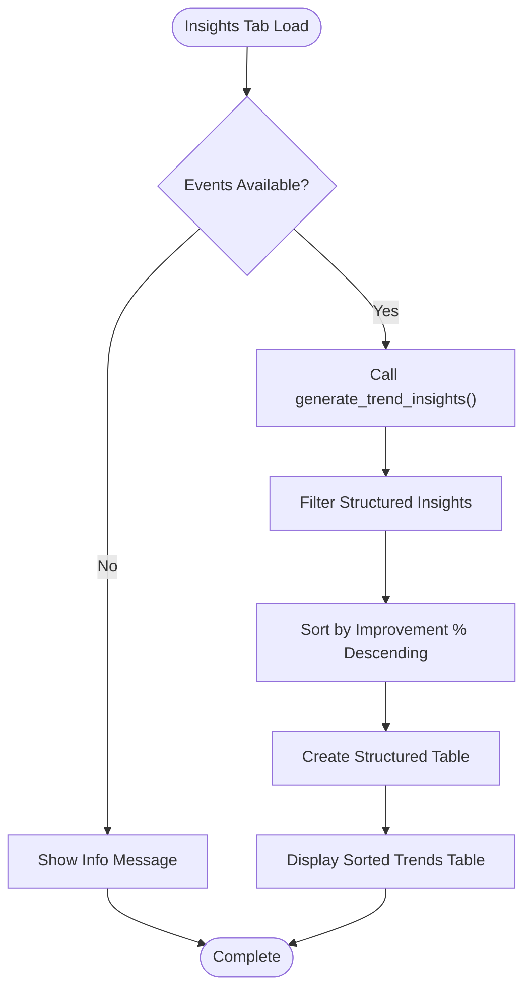

**Diagram sources**
- [app.py:1156-1179](file://app.py#L1156-L1179)
- [insights.py:18-90](file://src/insights.py#L18-L90)

### Strengths and Weaknesses Presentation
The stroke analysis is presented through structured tables:

- **Summary Table**: Shows strongest stroke and focus area in a compact format
- **Pace Analysis Table**: Displays average pace per stroke with clear formatting
- **Consistent Formatting**: Uses standardized table layouts across sections

### Enhanced User Experience
The new layout provides several improvements:
- **Improved Readability**: Structured tables make data easier to scan and understand
- **Logical Flow**: Sequential presentation guides users through the analysis process
- **Better Data Visualization**: Tables highlight key metrics and trends effectively
- **Enhanced Comprehension**: Sorted trends help users quickly identify significant improvements

**Section sources**
- [app.py:1148-1223](file://app.py#L1148-L1223)

### UI Integration and Workflows
The Streamlit app integrates InsightGenerator into the "Insights" page with the new sequential layout, displaying:
- Trend insights with categorized messages and structured data points
- Strengths and weaknesses with pace breakdowns in table format
- Potential assessment metrics and recommendations
- Training suggestions with drill lists and priorities

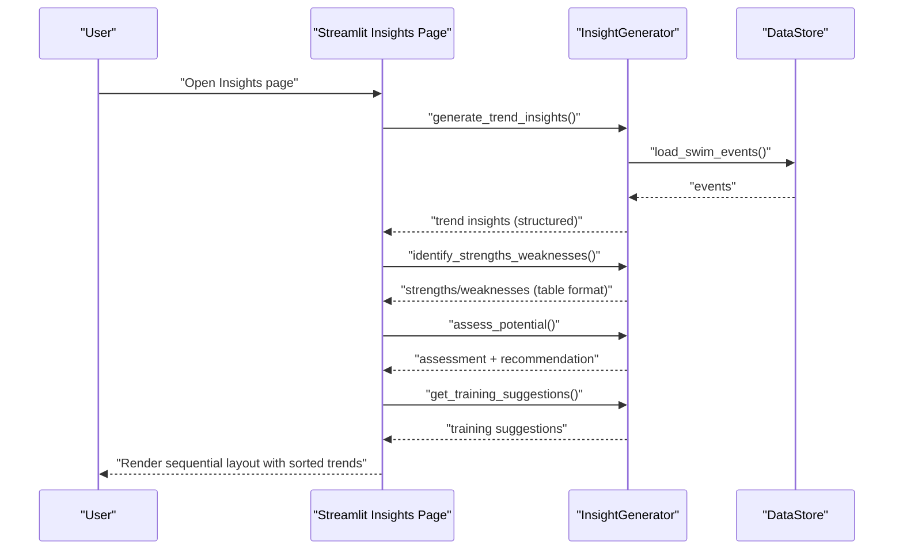

**Diagram sources**
- [app.py:321-370](file://app.py#L321-L370)
- [insights.py:14-149](file://src/insights.py#L14-L149)
- [storage.py:30-44](file://src/storage.py#L30-L44)

**Section sources**
- [app.py:321-370](file://app.py#L321-L370)

## Dependency Analysis
- InsightGenerator depends on DataStore for event retrieval and on validation utilities for time conversion.
- Analytics depends on DataStore and validation utilities to build dataframes and figures.
- The UI depends on InsightGenerator and Analytics for rendering insights and visualizations.
- Storage relies on configuration constants for file paths.

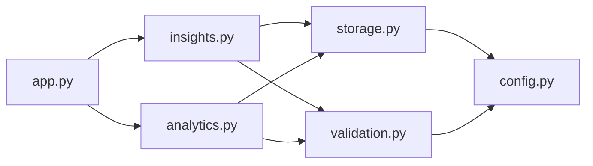

**Diagram sources**
- [app.py:16-19](file://app.py#L16-L19)
- [insights.py:5-8](file://src/insights.py#L5-L8)
- [analytics.py:8-10](file://src/analytics.py#L8-L10)
- [storage.py:6-7](file://src/storage.py#L6-L7)
- [validation.py:4](file://src/validation.py#L4)
- [config.py:10-14](file://src/config.py#L10-L14)

**Section sources**
- [app.py:16-19](file://app.py#L16-L19)
- [insights.py:5-8](file://src/insights.py#L5-L8)
- [analytics.py:8-10](file://src/analytics.py#L8-L10)
- [storage.py:6-7](file://src/storage.py#L6-L7)
- [validation.py:4](file://src/validation.py#L4)
- [config.py:10-14](file://src/config.py#L10-L14)

## Performance Considerations
- Time complexity:
  - Trend insights: O(N log N) due to sorting within groups; grouping and iteration are linear in N.
  - Strengths/weaknesses: O(N) to aggregate and compute averages.
  - Potential assessment: O(N) plus constant-time classification.
  - Training suggestions: O(S) for stroke mapping where S is number of strokes.
- Memory usage: Dataframes and lists scale with the number of events; consider pagination or filtering for very large datasets.
- I/O: JSON reads/writes are fast for typical datasets; ensure file paths exist via configuration.
- **Updated** Sequential layout optimization: The new table-based presentation maintains efficient memory usage while improving user experience.

[No sources needed since this section provides general guidance]

## Troubleshooting Guide
Common issues and resolutions:
- No data available:
  - Symptom: Info messages indicating insufficient data for trend insights.
  - Cause: Fewer than two events or no events at all.
  - Resolution: Add more race screenshots and ensure valid time formats.
- Invalid time format:
  - Symptom: Validation errors when adding events.
  - Cause: Time strings not matching expected formats.
  - Resolution: Use MM:SS.ss or SS.ss formats; verify splits if present.
- Missing required fields:
  - Symptom: Validation errors for missing fields.
  - Resolution: Ensure date, meet_name, stroke, distance, and time are provided.
- Empty analytics:
  - Symptom: Missing charts or empty dashboards.
  - Cause: No events loaded.
  - Resolution: Confirm DataStore is initialized and events are persisted.
- **Updated** Layout issues:
  - Symptom: Trends not appearing in sorted order or table format.
  - Cause: Insufficient structured insights data.
  - Resolution: Ensure enough events exist for trend analysis; check that events contain valid time data.

**Section sources**
- [insights.py:20-21](file://src/insights.py#L20-L21)
- [validation.py:75-102](file://src/validation.py#L75-L102)
- [storage.py:14-27](file://src/storage.py#L14-L27)

## Conclusion
The insight generation module provides a robust, data-driven approach to analyzing swimming performance trends, identifying strengths and weaknesses, assessing potential, and offering actionable training suggestions. By leveraging grouped time series analysis, normalized stroke paces, and simple heuristics, it delivers clear, grounded insights suitable for both beginners and advanced swimmers. The recent layout overhaul enhances user experience through sequential presentation and sorted trend visualization, making performance patterns more accessible and comprehensible. The modular design ensures easy extension with additional metrics, machine learning models, or richer visualizations.

[No sources needed since this section summarizes without analyzing specific files]

## Appendices

### Insight Categorization System
- Performance trends:
  - Positive: Improvement > 5%
  - Warning: Decline < -5%
  - Neutral: Within 5%
  - Info: Insufficient data for meaningful trends
- Training suggestions:
  - High priority: Focus on the weakest stroke with targeted drills
  - Medium priority: General endurance and race pace training
- Potential assessment indicators:
  - Total races, positive trends, strengths, areas for improvement, consistency, trajectory, recommendation

**Section sources**
- [insights.py:14-63](file://src/insights.py#L14-L63)
- [insights.py:121-149](file://src/insights.py#L121-L149)
- [insights.py:89-119](file://src/insights.py#L89-L119)

### Recommendation Algorithms
- Workout modifications:
  - Target the weakest stroke identified by average pace.
  - Increase volume or intensity of specific drills aligned with the focus stroke.
- Pacing strategies:
  - Use time progression insights to calibrate race pace expectations.
  - Compare recent times to personal bests to set realistic goals.
- Improvement targets:
  - Set incremental goals based on trend percentages.
  - Balance training across strokes while emphasizing weaknesses.

**Section sources**
- [insights.py:114-119](file://src/insights.py#L114-L119)
- [insights.py:121-149](file://src/insights.py#L121-L149)

### Machine Learning Approach and Fallback Strategies
- Current approach:
  - Rule-based trend classification and stroke ranking.
  - Heuristic thresholds for improvement classification.
- Potential ML enhancements:
  - Train regression models to predict future times given historical trends.
  - Use clustering to group similar performances and identify outliers.
  - Apply anomaly detection to flag unusual declines or plateaus.
- Fallback strategies for limited data:
  - Default to neutral classification when fewer than two events per group.
  - Use stroke averages across all distances if per-distance data is sparse.
  - Provide general recommendations when no clear weakness is detected.

[No sources needed since this section provides general guidance]

### Specification Alignment
The insight generation module aligns with the specification requirements:
- Automated insight generation from data: Implemented via trend insights and strengths/weaknesses.
- Potential assessment: Implemented via trajectory and recommendation.
- Training suggestions: Implemented via drill recommendations.
- Insight grounding in data: Implemented via cited data points and classifications.

**Section sources**
- [spec.md:1-30](file://openspec/changes/sunny-swim-analysis-platform/specs/insight-generation/spec.md#L1-L30)

### Layout Enhancement Details
**Updated** The Insights tab layout enhancement includes:

- **Sequential Layout Design**: Users now follow a logical progression through trend analysis, stroke evaluation, assessment, and recommendations
- **Sorted Trend Presentation**: Trends are automatically sorted by improvement percentage, making significant improvements immediately visible
- **Structured Table Format**: All insights are presented in consistent table formats for better readability and comparison
- **Enhanced User Experience**: The new layout improves comprehension of swimming performance patterns through clear visual hierarchy

**Section sources**
- [app.py:1148-1223](file://app.py#L1148-L1223)
- [insights.py:18-90](file://src/insights.py#L18-L90)