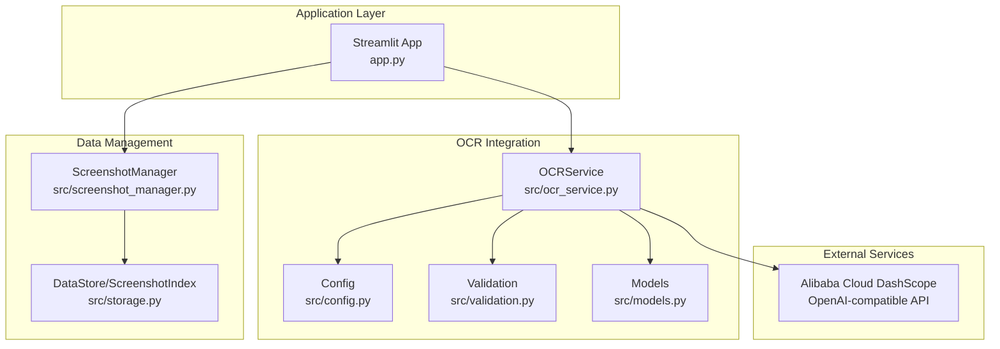
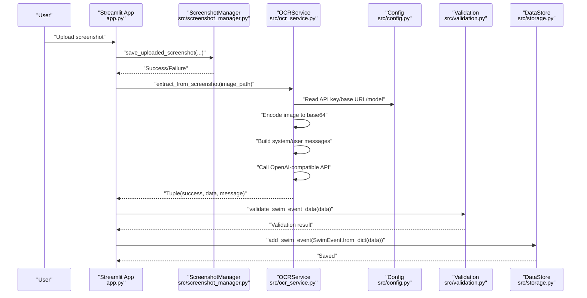
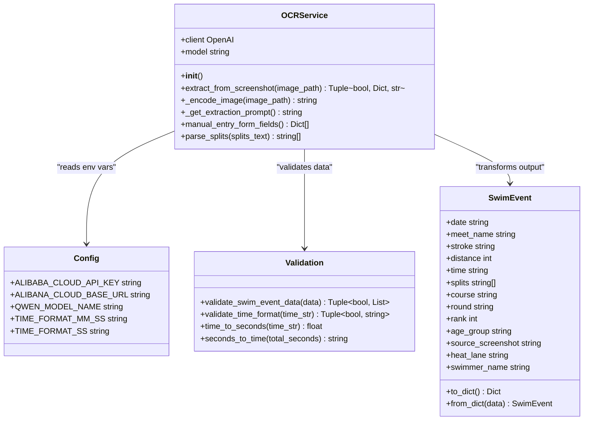
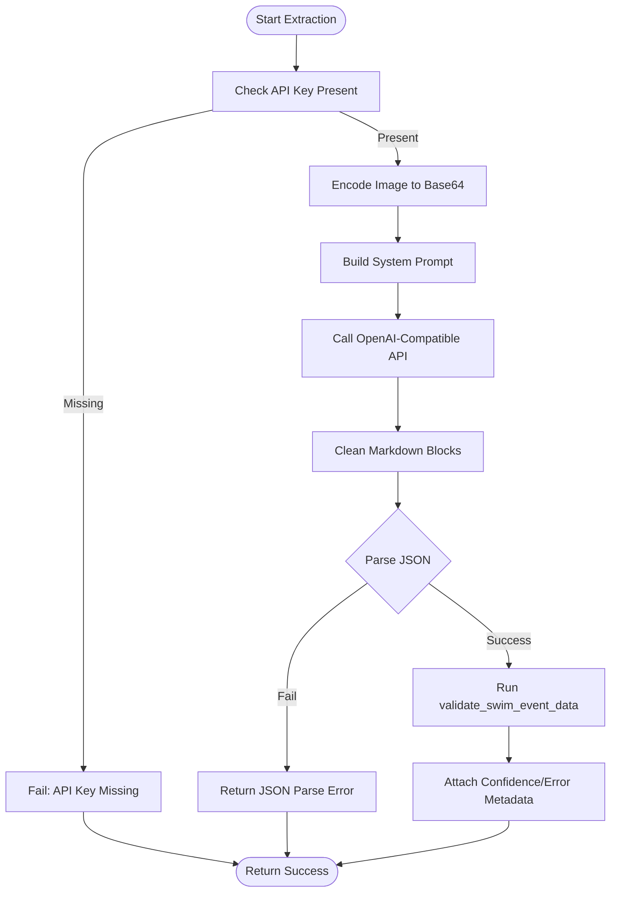
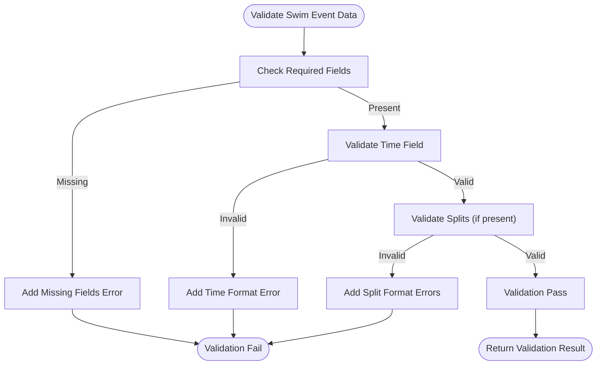
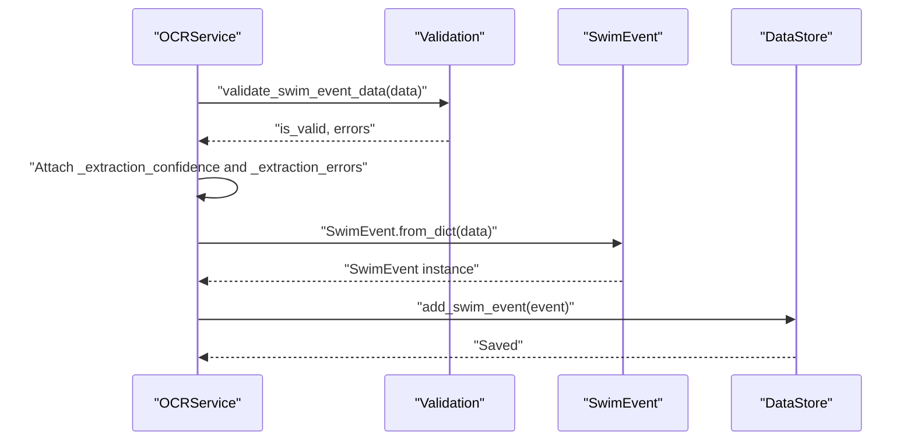
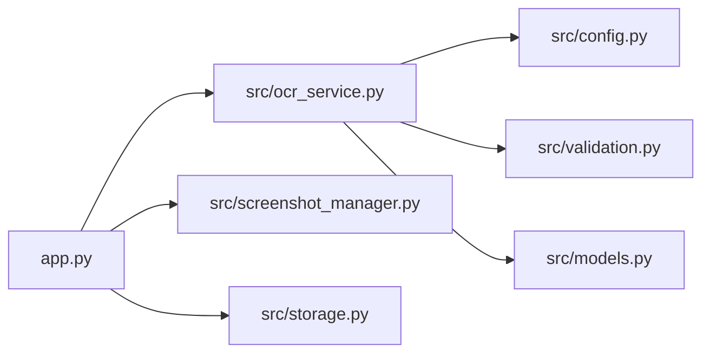

# OCR Integration

<cite>
**Referenced Files in This Document**
- [app.py](file://app.py)
- [src/ocr_service.py](file://src/ocr_service.py)
- [src/config.py](file://src/config.py)
- [src/validation.py](file://src/validation.py)
- [src/models.py](file://src/models.py)
- [src/screenshot_manager.py](file://src/screenshot_manager.py)
- [src/storage.py](file://src/storage.py)
- [README.md](file://README.md)
- [requirements.txt](file://requirements.txt)
</cite>

## Table of Contents
1. [Introduction](#introduction)
2. [Project Structure](#project-structure)
3. [Core Components](#core-components)
4. [Architecture Overview](#architecture-overview)
5. [Detailed Component Analysis](#detailed-component-analysis)
6. [Dependency Analysis](#dependency-analysis)
7. [Performance Considerations](#performance-considerations)
8. [Troubleshooting Guide](#troubleshooting-guide)
9. [Conclusion](#conclusion)
10. [Appendices](#appendices)

## Introduction
This document describes the OCR integration module that extracts structured swimming data from meet screenshots using Alibaba Cloud’s Vision-Language models. It covers the OCRService class architecture, configuration of API keys and model selection, the end-to-end extraction workflow, validation pipeline for swim data, error handling strategies, and integration with validation utilities and data transformation processes.

## Project Structure
The OCR integration lives within the src package and integrates with the Streamlit application for UI orchestration. Key modules include:
- OCR service: orchestrates image encoding, API calls, response parsing, and validation
- Configuration: environment variables for API credentials and model names
- Validation: time format validation and conversion utilities
- Data models: typed representation of swim events
- Screenshot management: file ingestion and deduplication
- Storage: JSON-backed persistence for events and screenshots

**Diagram sources**
- [app.py:60-120](file://app.py#L60-L120)
- [src/ocr_service.py:12-21](file://src/ocr_service.py#L12-L21)
- [src/config.py:20-29](file://src/config.py#L20-L29)
- [src/validation.py:75-103](file://src/validation.py#L75-L103)
- [src/models.py:7-30](file://src/models.py#L7-L30)
- [src/screenshot_manager.py:27-82](file://src/screenshot_manager.py#L27-L82)
- [src/storage.py:10-62](file://src/storage.py#L10-L62)

**Section sources**
- [app.py:60-120](file://app.py#L60-L120)
- [src/ocr_service.py:12-21](file://src/ocr_service.py#L12-L21)
- [src/config.py:20-29](file://src/config.py#L20-L29)
- [src/validation.py:75-103](file://src/validation.py#L75-L103)
- [src/models.py:7-30](file://src/models.py#L7-L30)
- [src/screenshot_manager.py:27-82](file://src/screenshot_manager.py#L27-L82)
- [src/storage.py:10-62](file://src/storage.py#L10-L62)

## Core Components
- OCRService: encapsulates Alibaba Cloud API client initialization, image encoding, prompt construction, API invocation, JSON parsing, and validation integration.
- Config: defines environment variables for API key, base URL, and model names; also defines time format regex patterns.
- Validation: validates required fields, time formats, and provides conversions between time strings and seconds.
- Models: typed SwimEvent dataclass for normalized event representation.
- ScreenshotManager: handles upload, deduplication, indexing, and thumbnail generation.
- DataStore/ScreenshotIndex: JSON-backed persistence for swim events and screenshot metadata.

**Section sources**
- [src/ocr_service.py:12-21](file://src/ocr_service.py#L12-L21)
- [src/config.py:20-29](file://src/config.py#L20-L29)
- [src/validation.py:75-103](file://src/validation.py#L75-L103)
- [src/models.py:7-30](file://src/models.py#L7-L30)
- [src/screenshot_manager.py:27-82](file://src/screenshot_manager.py#L27-L82)
- [src/storage.py:10-62](file://src/storage.py#L10-L62)

## Architecture Overview
The OCR integration follows a clear pipeline:
- UI triggers OCR extraction after saving a screenshot
- ScreenshotManager persists the image and updates the index
- OCRService encodes the image, sends a vision-language request, parses JSON, and runs validation
- Validation adds confidence and error metadata to the extracted data
- The validated event is transformed into a SwimEvent and persisted

**Diagram sources**
- [app.py:73-118](file://app.py#L73-L118)
- [src/screenshot_manager.py:27-82](file://src/screenshot_manager.py#L27-L82)
- [src/ocr_service.py:49-120](file://src/ocr_service.py#L49-L120)
- [src/config.py:20-29](file://src/config.py#L20-L29)
- [src/validation.py:75-103](file://src/validation.py#L75-L103)
- [src/storage.py:40-44](file://src/storage.py#L40-L44)

## Detailed Component Analysis

### OCRService Class
OCRService encapsulates the Alibaba Cloud Vision-Language model integration:
- Initialization sets up the OpenAI-compatible client with API key and base URL, and selects the model name
- Image encoding converts the input image to base64 for inclusion in the API payload
- Prompt engineering instructs the model to extract a predefined set of swimming-related fields into structured JSON
- API call uses a system prompt plus a user message containing the image and a text instruction
- Response cleaning strips markdown code blocks and attempts JSON parsing
- Validation integrates with validate_swim_event_data to produce confidence and error metadata
- Utility methods support manual entry form fields and split parsing

**Diagram sources**
- [src/ocr_service.py:12-144](file://src/ocr_service.py#L12-L144)
- [src/config.py:20-29](file://src/config.py#L20-L29)
- [src/validation.py:75-103](file://src/validation.py#L75-L103)
- [src/models.py:7-30](file://src/models.py#L7-L30)

**Section sources**
- [src/ocr_service.py:12-21](file://src/ocr_service.py#L12-L21)
- [src/ocr_service.py:22-26](file://src/ocr_service.py#L22-L26)
- [src/ocr_service.py:28-47](file://src/ocr_service.py#L28-L47)
- [src/ocr_service.py:49-120](file://src/ocr_service.py#L49-L120)
- [src/ocr_service.py:121-144](file://src/ocr_service.py#L121-L144)

### Configuration and Model Selection
- Environment variables define the Alibaba Cloud API key, base URL, and model names for both vision-language and text models
- Time format regex patterns are defined for validation
- The OCRService reads these values during initialization

Key configuration points:
- API key and base URL for OpenAI-compatible endpoint
- Vision-language model name for image+text prompts
- Text model name for text-only prompts
- Time format patterns for validation

**Section sources**
- [src/config.py:20-29](file://src/config.py#L20-L29)
- [src/ocr_service.py:15-20](file://src/ocr_service.py#L15-L20)

### Structured Data Extraction Workflow
The extraction process proceeds as follows:
- Validate API key presence; fail early if not configured
- Encode the image to base64
- Construct a system prompt instructing the model to extract specific swimming fields into JSON
- Send a chat completion request with the encoded image and a text prompt
- Clean the response by removing markdown code blocks
- Parse JSON; capture raw response on failure
- Validate the parsed data; attach confidence and error metadata
- Return success flag, data, and message

**Diagram sources**
- [src/ocr_service.py:55-120](file://src/ocr_service.py#L55-L120)
- [src/validation.py:75-103](file://src/validation.py#L75-L103)

**Section sources**
- [src/ocr_service.py:49-120](file://src/ocr_service.py#L49-L120)

### Validation Pipeline for Extracted Swim Data
The validation pipeline ensures extracted data conforms to expected formats:
- Required fields check: date, meet_name, stroke, distance, time
- Time format validation: supports MM:SS.ss and SS.ss formats
- Split validation: applies time format validation to each split
- Conversion utilities: convert between time strings and seconds for downstream analytics

**Diagram sources**
- [src/validation.py:75-103](file://src/validation.py#L75-L103)
- [src/validation.py:7-23](file://src/validation.py#L7-L23)
- [src/validation.py:26-60](file://src/validation.py#L26-L60)

**Section sources**
- [src/validation.py:75-103](file://src/validation.py#L75-L103)
- [src/validation.py:7-23](file://src/validation.py#L7-L23)
- [src/validation.py:26-60](file://src/validation.py#L26-L60)

### Integration with Validation Utilities and Data Transformation
- Confidence metadata: placeholder confidence scores are attached for each field based on presence
- Error metadata: validation errors are collected and attached to the extracted data
- Data transformation: extracted data is transformed into a SwimEvent for persistence

**Diagram sources**
- [src/ocr_service.py:106-116](file://src/ocr_service.py#L106-L116)
- [src/validation.py:75-103](file://src/validation.py#L75-L103)
- [src/models.py:27-29](file://src/models.py#L27-L29)
- [src/storage.py:40-44](file://src/storage.py#L40-L44)

**Section sources**
- [src/ocr_service.py:106-116](file://src/ocr_service.py#L106-L116)
- [src/models.py:27-29](file://src/models.py#L27-L29)
- [src/storage.py:40-44](file://src/storage.py#L40-L44)

## Dependency Analysis
- OCRService depends on:
  - Config for API credentials and model names
  - Validation for data correctness checks
  - Models for normalized event representation
  - OpenAI client for API communication
- App orchestrates OCRService and transforms extracted data into SwimEvent
- ScreenshotManager and DataStore integrate with OCRService indirectly via the app flow

**Diagram sources**
- [app.py:60-120](file://app.py#L60-L120)
- [src/ocr_service.py:8-9](file://src/ocr_service.py#L8-L9)
- [src/config.py:20-29](file://src/config.py#L20-L29)
- [src/validation.py:75-103](file://src/validation.py#L75-L103)
- [src/models.py:7-30](file://src/models.py#L7-L30)
- [src/screenshot_manager.py:27-82](file://src/screenshot_manager.py#L27-L82)
- [src/storage.py:10-62](file://src/storage.py#L10-L62)

**Section sources**
- [app.py:60-120](file://app.py#L60-L120)
- [src/ocr_service.py:8-9](file://src/ocr_service.py#L8-L9)
- [src/config.py:20-29](file://src/config.py#L20-L29)
- [src/validation.py:75-103](file://src/validation.py#L75-L103)
- [src/models.py:7-30](file://src/models.py#L7-L30)
- [src/screenshot_manager.py:27-82](file://src/screenshot_manager.py#L27-L82)
- [src/storage.py:10-62](file://src/storage.py#L10-L62)

## Performance Considerations
- Network latency: API calls depend on external service availability; consider retry/backoff strategies for production deployments
- Token limits: the prompt and response sizes are bounded; ensure images are appropriately sized to reduce payload
- Parsing robustness: the response cleaning removes markdown blocks; ensure prompts consistently return JSON
- Validation overhead: time conversions and regex checks are lightweight but should be considered in batch processing scenarios

[No sources needed since this section provides general guidance]

## Troubleshooting Guide
Common issues and resolutions:
- API key not configured
  - Symptom: extraction fails immediately with a configuration message
  - Resolution: set the ALIBABA_CLOUD_API_KEY environment variable and restart the app
- Unsupported image formats
  - Symptom: encoding or API errors when sending image payload
  - Resolution: ensure the uploaded image is PNG/JPG/JPEG; the app restricts uploads to these types
- JSON parsing failures
  - Symptom: extraction returns a message indicating JSON parse failure and includes the raw response
  - Resolution: review the raw response for formatting issues; adjust prompt or image quality
- Validation errors
  - Symptom: extraction succeeds but validation reports missing required fields or invalid time formats
  - Resolution: correct the OCR output fields or use manual entry form fields provided by OCRService
- Network connectivity issues
  - Symptom: API call exceptions or timeouts
  - Resolution: verify internet connectivity and API endpoint accessibility; check firewall/proxy settings

**Section sources**
- [src/ocr_service.py:55-56](file://src/ocr_service.py#L55-L56)
- [src/ocr_service.py:103-104](file://src/ocr_service.py#L103-L104)
- [app.py:71](file://app.py#L71)
- [app.py:442-446](file://app.py#L442-L446)

## Conclusion
The OCR integration module provides a robust pipeline for extracting structured swimming data from meet screenshots using Alibaba Cloud Vision-Language models. It includes strong configuration management, prompt engineering, response parsing, and validation. The integration with validation utilities and data transformation ensures extracted data is reliable and ready for downstream analytics and storage.

[No sources needed since this section summarizes without analyzing specific files]

## Appendices

### Successful OCR Processing Workflow Example
- Upload a meet screenshot via the Upload page
- The app saves the screenshot and triggers OCR extraction
- OCRService encodes the image, sends a request, parses JSON, validates data, and attaches metadata
- The validated event is transformed into a SwimEvent and saved to persistent storage

**Section sources**
- [app.py:73-118](file://app.py#L73-L118)
- [src/ocr_service.py:49-120](file://src/ocr_service.py#L49-L120)
- [src/validation.py:75-103](file://src/validation.py#L75-L103)
- [src/models.py:27-29](file://src/models.py#L27-L29)
- [src/storage.py:40-44](file://src/storage.py#L40-L44)

### Common Extraction Patterns
- Required fields: date, meet_name, stroke, distance, time
- Optional fields: splits, course, round, rank, age_group, heat_lane, swimmer_name
- Time formats: MM:SS.ss and SS.ss are supported
- Split parsing: comma-separated values are supported

**Section sources**
- [src/ocr_service.py:28-47](file://src/ocr_service.py#L28-L47)
- [src/validation.py:7-23](file://src/validation.py#L7-L23)
- [src/ocr_service.py:138-144](file://src/ocr_service.py#L138-L144)

### Manual Entry Fallback Form Fields
- Provides a structured form for manual data entry when OCR fails
- Includes date, meet name, stroke, distance, time, splits, course, round, rank, age group, and heat/lane

**Section sources**
- [src/ocr_service.py:121-136](file://src/ocr_service.py#L121-L136)

### Setup and Requirements
- Install dependencies and configure the Alibaba Cloud API key
- Run the Streamlit application

**Section sources**
- [README.md:15-31](file://README.md#L15-L31)
- [requirements.txt:1-10](file://requirements.txt#L1-L10)