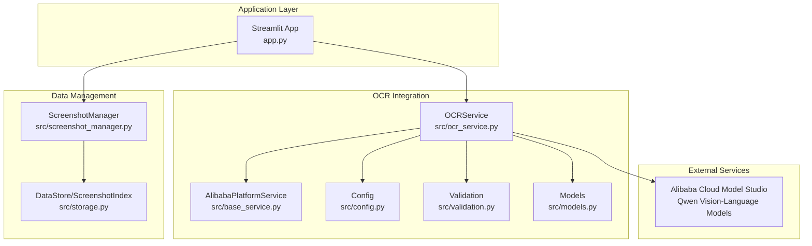
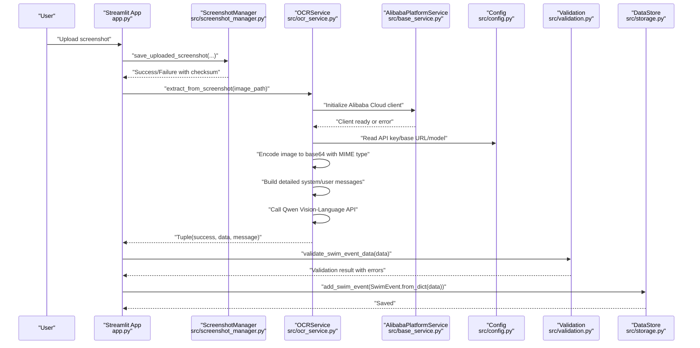
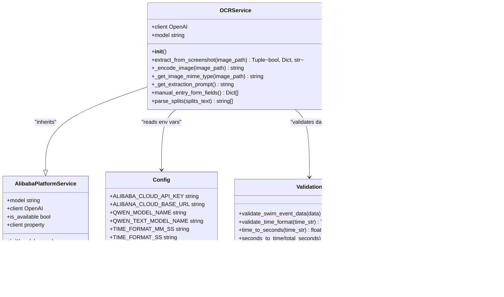
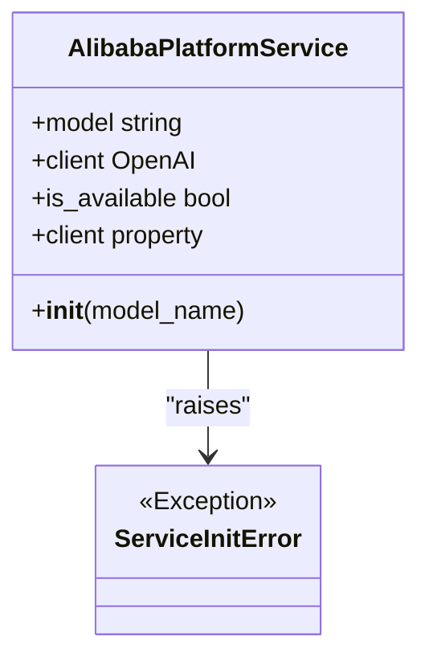
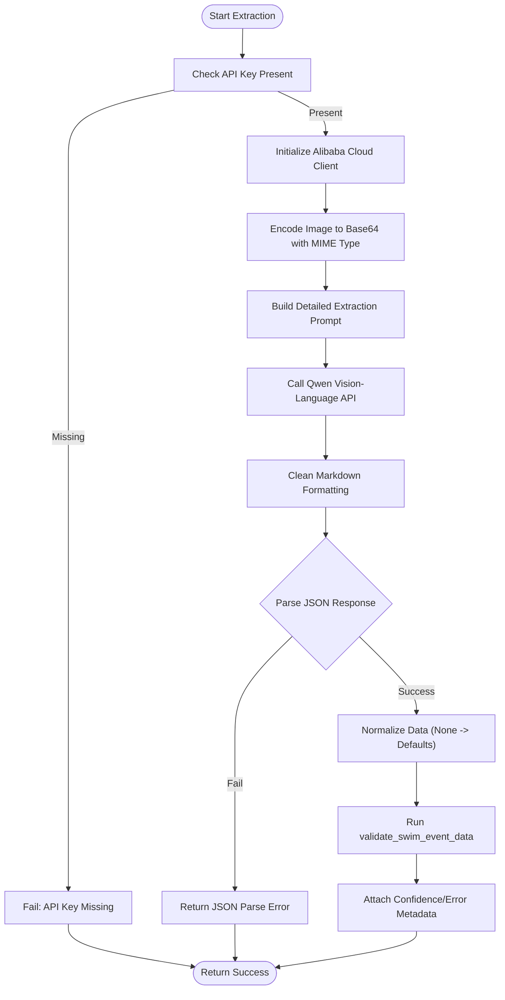
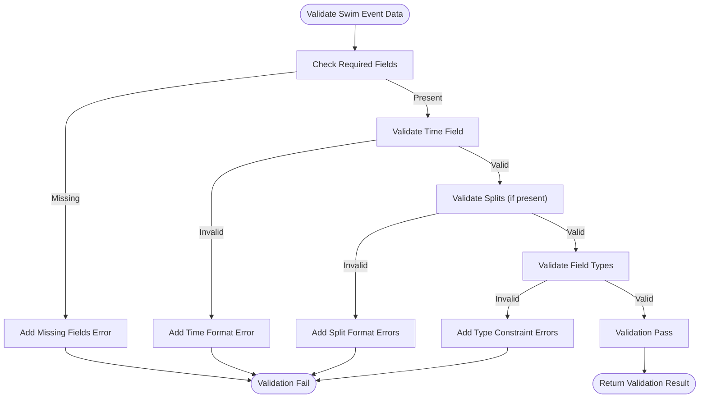
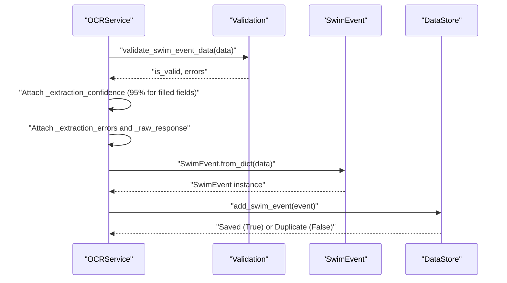
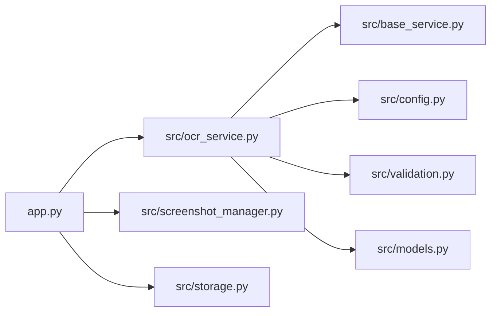

# OCR Integration

<cite>
**Referenced Files in This Document**
- [app.py](file://app.py)
- [src/ocr_service.py](file://src/ocr_service.py)
- [src/base_service.py](file://src/base_service.py)
- [src/config.py](file://src/config.py)
- [src/validation.py](file://src/validation.py)
- [src/models.py](file://src/models.py)
- [src/screenshot_manager.py](file://src/screenshot_manager.py)
- [src/storage.py](file://src/storage.py)
- [README.md](file://README.md)
- [requirements.txt](file://requirements.txt)
</cite>

## Update Summary
**Changes Made**
- Enhanced OCR service with Alibaba Cloud Qwen vision-language model integration
- Improved screenshot analysis capabilities with comprehensive extraction prompt system
- Added base service architecture for Alibaba Cloud Model Studio API clients
- Enhanced error handling and logging for API connectivity issues
- Improved image preprocessing with MIME type detection and base64 encoding
- Added comprehensive validation pipeline for swimming performance data

## Table of Contents
1. [Introduction](#introduction)
2. [Project Structure](#project-structure)
3. [Core Components](#core-components)
4. [Architecture Overview](#architecture-overview)
5. [Detailed Component Analysis](#detailed-component-analysis)
6. [Dependency Analysis](#dependency-analysis)
7. [Performance Considerations](#performance-considerations)
8. [Troubleshooting Guide](#troubleshooting-guide)
9. [Conclusion](#conclusion)
10. [Appendices](#appendices)

## Introduction
This document describes the OCR integration module that extracts structured swimming data from meet screenshots using Alibaba Cloud's Qwen vision-language models. The enhanced OCRService class architecture now features comprehensive Alibaba Cloud Model Studio integration, advanced image preprocessing capabilities, and sophisticated prompt engineering for swimming performance data extraction. It covers the OCRService class architecture, API key configuration, model selection process, structured data extraction workflow, validation pipeline for swim data, error handling strategies, and integration with validation utilities and data transformation processes.

## Project Structure
The OCR integration lives within the src package and integrates with the Streamlit application for UI orchestration. Key modules include:
- OCR service: orchestrates image encoding, API calls, response parsing, and validation using Alibaba Cloud Qwen models
- Base service: provides foundation for Alibaba Cloud Model Studio API clients with proper initialization and error handling
- Configuration: environment variables for API credentials and model names
- Validation: time format validation and conversion utilities
- Data models: typed representation of swim events
- Screenshot management: file ingestion and deduplication
- Storage: JSON-backed persistence for events and screenshots

**Diagram sources**
- [app.py:60-120](file://app.py#L60-L120)
- [src/ocr_service.py:16-28](file://src/ocr_service.py#L16-L28)
- [src/base_service.py:15-67](file://src/base_service.py#L15-L67)
- [src/config.py:20-29](file://src/config.py#L20-L29)
- [src/validation.py:75-103](file://src/validation.py#L75-L103)
- [src/models.py:7-30](file://src/models.py#L7-L30)
- [src/screenshot_manager.py:27-82](file://src/screenshot_manager.py#L27-L82)
- [src/storage.py:10-62](file://src/storage.py#L10-L62)

**Section sources**
- [app.py:60-120](file://app.py#L60-L120)
- [src/ocr_service.py:16-28](file://src/ocr_service.py#L16-L28)
- [src/base_service.py:15-67](file://src/base_service.py#L15-L67)
- [src/config.py:20-29](file://src/config.py#L20-L29)
- [src/validation.py:75-103](file://src/validation.py#L75-L103)
- [src/models.py:7-30](file://src/models.py#L7-L30)
- [src/screenshot_manager.py:27-82](file://src/screenshot_manager.py#L27-L82)
- [src/storage.py:10-62](file://src/storage.py#L10-L62)

## Core Components
- **OCRService**: Enhanced Alibaba Cloud Vision-Language model integration with comprehensive image preprocessing, advanced prompt engineering, and robust error handling
- **AlibabaPlatformService**: Base class providing foundation for Alibaba Cloud Model Studio API clients with proper initialization, API key validation, and availability checks
- **Config**: Defines environment variables for API key, base URL, and model names; includes both vision-language and text model configurations
- **Validation**: Validates required fields, time formats, and provides conversions between time strings and seconds
- **Models**: Typed SwimEvent dataclass for normalized event representation
- **ScreenshotManager**: Handles upload, deduplication, indexing, and thumbnail generation with checksum validation
- **DataStore/ScreenshotIndex**: JSON-backed persistence for swim events and screenshot metadata

**Section sources**
- [src/ocr_service.py:16-28](file://src/ocr_service.py#L16-L28)
- [src/base_service.py:15-67](file://src/base_service.py#L15-L67)
- [src/config.py:20-29](file://src/config.py#L20-L29)
- [src/validation.py:75-103](file://src/validation.py#L75-L103)
- [src/models.py:7-30](file://src/models.py#L7-L30)
- [src/screenshot_manager.py:27-82](file://src/screenshot_manager.py#L27-L82)
- [src/storage.py:10-62](file://src/storage.py#L10-L62)

## Architecture Overview
The OCR integration follows a comprehensive pipeline leveraging Alibaba Cloud Qwen vision-language models:
- UI triggers OCR extraction after saving a screenshot
- ScreenshotManager persists the image and updates the index with checksum validation
- OCRService initializes Alibaba Cloud client, encodes the image with MIME type detection, sends vision-language request with detailed prompts
- Response cleaning strips markdown formatting and attempts JSON parsing
- Validation integrates with validate_swim_event_data to produce confidence and error metadata
- The validated event is transformed into a SwimEvent and persisted

**Diagram sources**
- [app.py:73-118](file://app.py#L73-L118)
- [src/screenshot_manager.py:27-82](file://src/screenshot_manager.py#L27-L82)
- [src/ocr_service.py:117-223](file://src/ocr_service.py#L117-L223)
- [src/base_service.py:22-51](file://src/base_service.py#L22-L51)
- [src/config.py:20-29](file://src/config.py#L20-L29)
- [src/validation.py:75-103](file://src/validation.py#L75-L103)
- [src/storage.py:40-44](file://src/storage.py#L40-L44)

## Detailed Component Analysis

### Enhanced OCRService Class
The OCRService class now features comprehensive Alibaba Cloud Qwen vision-language model integration:
- **Enhanced Initialization**: Inherits from AlibabaPlatformService for proper Alibaba Cloud client initialization with API key and base URL
- **Advanced Image Preprocessing**: Encodes images to base64 with automatic MIME type detection for optimal API compatibility
- **Comprehensive Prompt Engineering**: Detailed step-by-step instructions for document type identification, field extraction, and critical validation rules
- **Robust API Integration**: Uses OpenAI-compatible API with Qwen vision-language models for superior OCR capabilities
- **Enhanced Response Processing**: Strips markdown formatting and attempts JSON parsing with comprehensive error handling
- **Improved Validation Pipeline**: Integrates with validate_swim_event_data to produce confidence scores and error metadata
- **Extended Error Handling**: Comprehensive exception handling for API connection errors, authentication failures, and rate limiting

**Diagram sources**
- [src/ocr_service.py:16-259](file://src/ocr_service.py#L16-L259)
- [src/base_service.py:15-67](file://src/base_service.py#L15-L67)
- [src/config.py:20-29](file://src/config.py#L20-L29)
- [src/validation.py:75-103](file://src/validation.py#L75-L103)
- [src/models.py:7-30](file://src/models.py#L7-L30)

**Section sources**
- [src/ocr_service.py:16-28](file://src/ocr_service.py#L16-L28)
- [src/ocr_service.py:29-41](file://src/ocr_service.py#L29-L41)
- [src/ocr_service.py:42-61](file://src/ocr_service.py#L42-L61)
- [src/ocr_service.py:62-116](file://src/ocr_service.py#L62-L116)
- [src/ocr_service.py:117-223](file://src/ocr_service.py#L117-L223)
- [src/ocr_service.py:224-259](file://src/ocr_service.py#L224-L259)

### Alibaba Cloud Base Service Architecture
The AlibabaPlatformService provides foundational infrastructure for Alibaba Cloud Model Studio API clients:
- **Centralized Client Management**: Handles OpenAI-compatible client initialization with API key and base URL validation
- **Error Handling Framework**: Comprehensive exception handling for initialization failures and API connectivity issues
- **Availability Monitoring**: Provides is_available property for runtime client status checking
- **Model Name Management**: Supports dynamic model selection for different service types (vision-language vs text)

**Diagram sources**
- [src/base_service.py:15-67](file://src/base_service.py#L15-L67)

**Section sources**
- [src/base_service.py:15-67](file://src/base_service.py#L15-L67)

### Enhanced Configuration and Model Selection
Configuration now supports both vision-language and text model variants:
- **Alibaba Cloud Settings**: API key, base URL, and model names for both Qwen vision-language and text models
- **Startup Validation**: Warns when API key is not configured, preventing feature unavailability
- **Time Format Patterns**: Regex patterns for MM:SS.ss and SS.ss time validation
- **Environment Variable Loading**: Uses python-dotenv for flexible configuration management

Key configuration points:
- API key and base URL for Alibaba Cloud Model Studio
- Vision-language model name (qwen-vl-max) for image+text prompts
- Text model name (qwen-max) for text-only prompts
- Time format patterns for validation
- Directory structure for data persistence

**Section sources**
- [src/config.py:20-29](file://src/config.py#L20-L29)
- [src/config.py:30-49](file://src/config.py#L30-L49)

### Comprehensive Structured Data Extraction Workflow
The extraction process now features enhanced capabilities:
- **API Key Validation**: Early validation with comprehensive error messaging
- **Advanced Image Encoding**: Base64 encoding with automatic MIME type detection
- **Detailed Prompt Engineering**: Step-by-step instructions for document analysis and field extraction
- **Robust API Communication**: OpenAI-compatible API calls with temperature control and token limits
- **Response Processing**: Markdown stripping and JSON parsing with raw response preservation
- **Data Normalization**: Converts None values to appropriate defaults for robust processing
- **Enhanced Validation**: Comprehensive validation with confidence scoring and error metadata

**Diagram sources**
- [src/ocr_service.py:128-223](file://src/ocr_service.py#L128-L223)
- [src/validation.py:75-103](file://src/validation.py#L75-L103)

**Section sources**
- [src/ocr_service.py:117-223](file://src/ocr_service.py#L117-L223)

### Enhanced Validation Pipeline for Extracted Swim Data
The validation pipeline now includes comprehensive field validation:
- **Required Fields Check**: Validates essential fields (date, meet_name, stroke, distance, time)
- **Time Format Validation**: Supports both MM:SS.ss and SS.ss formats with regex patterns
- **Split Validation**: Applies time format validation to each split with detailed error reporting
- **Field Type Validation**: Ensures proper data types and constraints for all fields
- **Date Validation**: Verifies ISO date format compliance
- **Stroke Validation**: Confirms stroke type belongs to accepted swimming strokes

**Diagram sources**
- [src/validation.py:102-129](file://src/validation.py#L102-L129)
- [src/validation.py:132-181](file://src/validation.py#L132-L181)
- [src/validation.py:7-23](file://src/validation.py#L7-L23)
- [src/validation.py:26-60](file://src/validation.py#L26-L60)

**Section sources**
- [src/validation.py:102-129](file://src/validation.py#L102-L129)
- [src/validation.py:132-181](file://src/validation.py#L132-L181)
- [src/validation.py:7-23](file://src/validation.py#L7-L23)
- [src/validation.py:26-60](file://src/validation.py#L26-L60)

### Integration with Validation Utilities and Data Transformation
The enhanced integration provides comprehensive metadata and transformation capabilities:
- **Confidence Scoring**: Placeholder confidence scores (95% for filled fields, 0% for empty fields)
- **Error Metadata**: Comprehensive validation errors collection and attachment
- **Raw Response Preservation**: Full model response retention for debugging and analysis
- **Data Transformation**: Extracted data transformation into SwimEvent for persistence
- **Duplicate Detection**: Integration with DataStore for duplicate event prevention

**Diagram sources**
- [src/ocr_service.py:197-223](file://src/ocr_service.py#L197-L223)
- [src/validation.py:75-103](file://src/validation.py#L75-L103)
- [src/models.py:27-29](file://src/models.py#L27-L29)
- [src/storage.py:71-85](file://src/storage.py#L71-L85)

**Section sources**
- [src/ocr_service.py:197-223](file://src/ocr_service.py#L197-L223)
- [src/models.py:27-29](file://src/models.py#L27-L29)
- [src/storage.py:71-85](file://src/storage.py#L71-L85)

## Dependency Analysis
The enhanced OCR integration maintains clear separation of concerns:
- **OCRService** depends on:
  - AlibabaPlatformService for Alibaba Cloud client management
  - Config for API credentials and model names
  - Validation for data correctness checks
  - Models for normalized event representation
  - OpenAI client for API communication
- **App orchestrates** OCRService and transforms extracted data into SwimEvent
- **ScreenshotManager** and **DataStore** integrate with OCRService via the app flow with checksum validation

**Diagram sources**
- [app.py:60-120](file://app.py#L60-L120)
- [src/ocr_service.py:8-9](file://src/ocr_service.py#L8-L9)
- [src/base_service.py:15-67](file://src/base_service.py#L15-L67)
- [src/config.py:20-29](file://src/config.py#L20-L29)
- [src/validation.py:75-103](file://src/validation.py#L75-L103)
- [src/models.py:7-30](file://src/models.py#L7-L30)
- [src/screenshot_manager.py:27-82](file://src/screenshot_manager.py#L27-L82)
- [src/storage.py:10-62](file://src/storage.py#L10-L62)

**Section sources**
- [app.py:60-120](file://app.py#L60-L120)
- [src/ocr_service.py:8-9](file://src/ocr_service.py#L8-L9)
- [src/base_service.py:15-67](file://src/base_service.py#L15-L67)
- [src/config.py:20-29](file://src/config.py#L20-L29)
- [src/validation.py:75-103](file://src/validation.py#L75-L103)
- [src/models.py:7-30](file://src/models.py#L7-L30)
- [src/screenshot_manager.py:27-82](file://src/screenshot_manager.py#L27-L82)
- [src/storage.py:10-62](file://src/storage.py#L10-L62)

## Performance Considerations
Enhanced performance considerations for the Alibaba Cloud integration:
- **Network Latency**: API calls depend on Alibaba Cloud Model Studio availability; consider retry/backoff strategies for production deployments
- **Token Limits**: Qwen vision-language models have token limits; ensure images are appropriately sized to reduce payload costs
- **Image Optimization**: MIME type detection and base64 encoding optimize payload delivery to the API
- **Parsing Robustness**: Response cleaning removes markdown formatting; ensure prompts consistently return JSON
- **Client Initialization**: AlibabaPlatformService provides centralized client management reducing initialization overhead
- **Validation Overhead**: Enhanced validation with confidence scoring and error metadata is lightweight but should be considered in batch processing scenarios

## Troubleshooting Guide
Enhanced troubleshooting for Alibaba Cloud OCR integration:
- **API Key Not Configured**
  - Symptom: Extraction fails immediately with API key missing message
  - Resolution: Set ALIBABA_CLOUD_API_KEY environment variable and restart the app
  - Prevention: Check startup logs for API key warnings
- **Unsupported Image Formats**
  - Symptom: Encoding or API errors when sending image payload
  - Resolution: Ensure uploaded images are PNG/JPG/JPEG; the app restricts uploads to these types
  - Enhancement: Automatic MIME type detection handles various image formats
- **JSON Parsing Failures**
  - Symptom: Extraction returns JSON parse error with raw response included
  - Resolution: Review raw response for formatting issues; adjust prompt or image quality
  - Debugging: Check _raw_response field for detailed API output
- **Validation Errors**
  - Symptom: Extraction succeeds but validation reports missing required fields or invalid time formats
  - Resolution: Correct OCR output fields or use manual entry form fields provided by OCRService
  - Enhanced: Comprehensive error metadata provides detailed field-specific issues
- **Network Connectivity Issues**
  - Symptom: API connection errors or timeouts
  - Resolution: Verify internet connectivity and Alibaba Cloud Model Studio accessibility
  - Enhanced: Comprehensive exception handling for different error types
- **Alibaba Cloud Client Initialization Failure**
  - Symptom: ServiceInitError during OCRService initialization
  - Resolution: Check API key validity and base URL configuration
  - Prevention: Use AlibabaPlatformService.is_available property for runtime checks

**Section sources**
- [src/ocr_service.py:128-131](file://src/ocr_service.py#L128-L131)
- [src/ocr_service.py:211-222](file://src/ocr_service.py#L211-L222)
- [src/base_service.py:26-51](file://src/base_service.py#L26-L51)
- [app.py:71](file://app.py#L71)
- [app.py:442-446](file://app.py#L442-L446)

## Conclusion
The enhanced OCR integration module provides a robust pipeline for extracting structured swimming data from meet screenshots using Alibaba Cloud Qwen vision-language models. The integration features comprehensive Alibaba Cloud Model Studio integration, advanced image preprocessing, sophisticated prompt engineering, enhanced response processing, and comprehensive validation. The integration with validation utilities and data transformation ensures extracted data is reliable, complete, and ready for downstream analytics and storage. The modular architecture with AlibabaPlatformService foundation provides extensibility for future enhancements and additional Alibaba Cloud model integrations.

## Appendices

### Successful OCR Processing Workflow Example
Enhanced workflow with comprehensive error handling:
- Upload a meet screenshot via the Upload page with checksum validation
- The app saves the screenshot and triggers OCR extraction with Alibaba Cloud client initialization
- OCRService encodes the image with MIME type detection, sends Qwen vision-language request, parses JSON, validates data, and attaches comprehensive metadata
- The validated event is transformed into a SwimEvent and saved to persistent storage with duplicate detection

**Section sources**
- [app.py:73-118](file://app.py#L73-L118)
- [src/ocr_service.py:117-223](file://src/ocr_service.py#L117-L223)
- [src/validation.py:75-103](file://src/validation.py#L75-L103)
- [src/models.py:27-29](file://src/models.py#L27-L29)
- [src/storage.py:71-85](file://src/storage.py#L71-L85)

### Enhanced Common Extraction Patterns
Comprehensive field extraction patterns:
- **Required Fields**: date (YYYY-MM-DD), meet_name, stroke (freestyle, backstroke, breaststroke, butterfly, IM), distance (50, 100, 200, 400, 800, 1500), time (MM:SS.ss or SS.ss)
- **Optional Fields**: splits (array of time strings), course (LC/SC), round (heat, semifinal, final), rank (1, 2, 3+), age_group (e.g., "8 & Under", "9-10"), heat_lane (e.g., "H3 L4"), swimmer_name
- **Enhanced Validation**: Comprehensive field validation with type checking and constraint enforcement
- **Split Parsing**: Enhanced comma-separated value parsing with whitespace trimming

**Section sources**
- [src/ocr_service.py:62-116](file://src/ocr_service.py#L62-L116)
- [src/validation.py:102-129](file://src/validation.py#L102-L129)
- [src/ocr_service.py:246-259](file://src/ocr_service.py#L246-L259)

### Enhanced Manual Entry Fallback Form Fields
Comprehensive manual data entry with validation:
- **Structured Form Fields**: Provides comprehensive form for manual data entry when OCR fails
- **Field Definitions**: Includes date, meet name, stroke, distance, time, splits, course, round, rank, age group, and heat/lane
- **Validation Integration**: Form validation aligns with backend validation rules
- **Enhanced Error Handling**: Comprehensive error messages for manual corrections

**Section sources**
- [src/ocr_service.py:224-245](file://src/ocr_service.py#L224-L245)

### Enhanced Setup and Requirements
Comprehensive setup with Alibaba Cloud integration:
- **Install Dependencies**: Install all requirements including Alibaba Cloud SDK and OpenAI client
- **Configure Alibaba Cloud**: Set ALIBABA_CLOUD_API_KEY environment variable
- **Model Configuration**: Configure QWEN_MODEL_NAME and QWEN_TEXT_MODEL_NAME environment variables
- **Run Application**: Start Streamlit application with Alibaba Cloud integration enabled

**Section sources**
- [README.md:15-31](file://README.md#L15-L31)
- [requirements.txt:1-10](file://requirements.txt#L1-L10)
- [src/config.py:30-34](file://src/config.py#L30-L34)