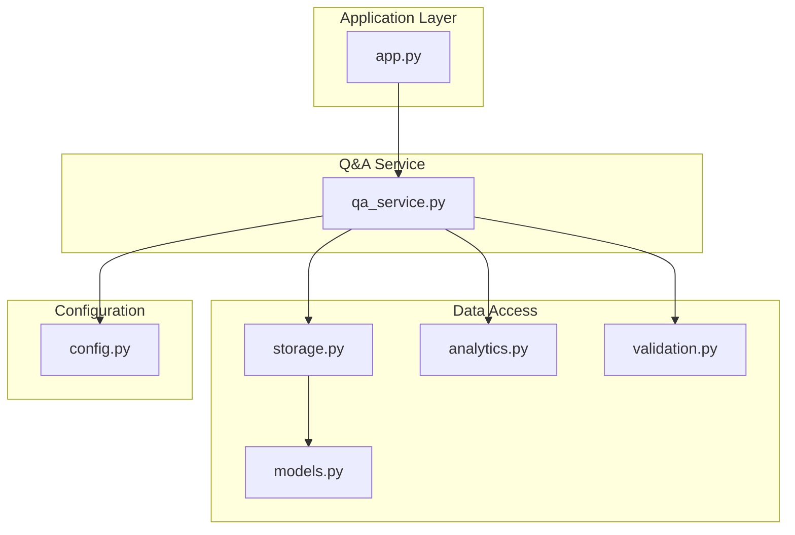
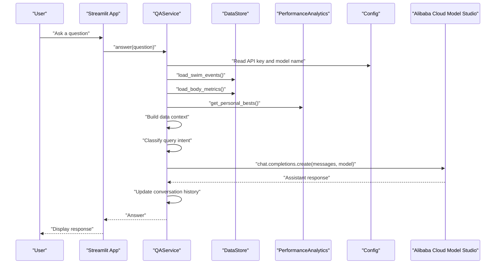
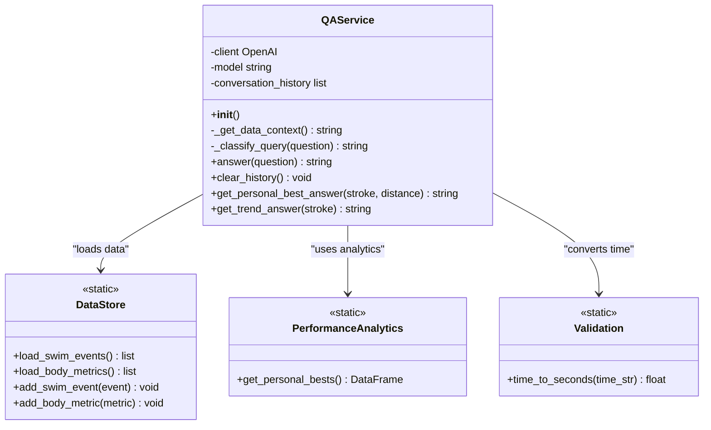
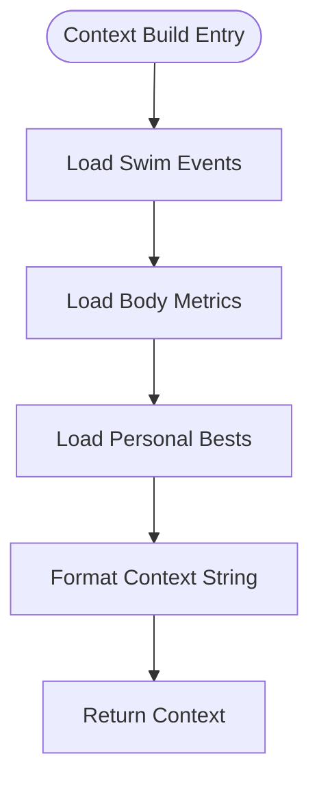
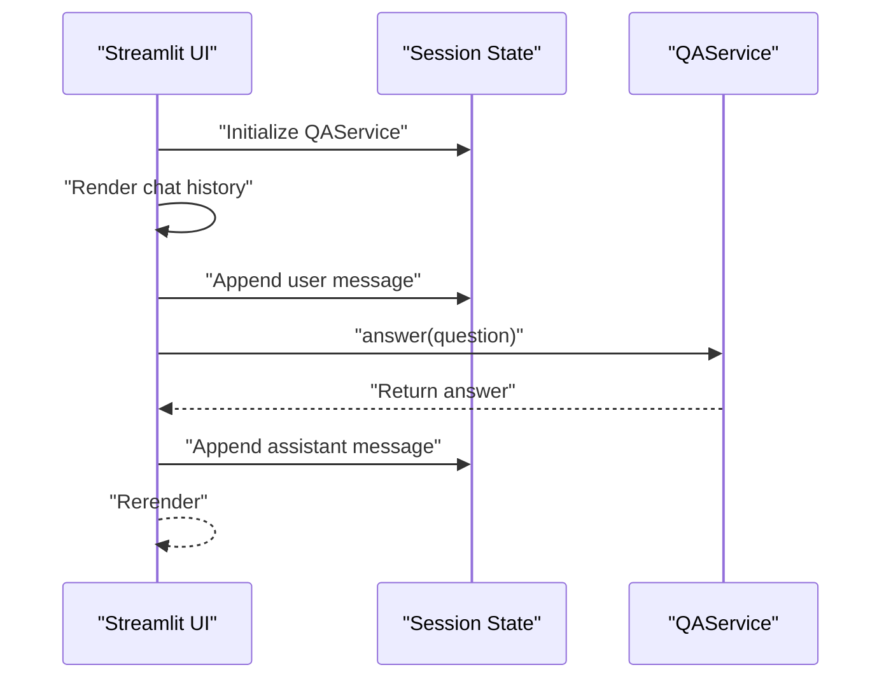
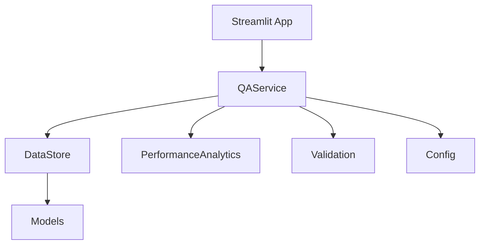

# Q&A System

<cite>
**Referenced Files in This Document**
- [qa_service.py](file://src/qa_service.py)
- [storage.py](file://src/storage.py)
- [models.py](file://src/models.py)
- [config.py](file://src/config.py)
- [analytics.py](file://src/analytics.py)
- [validation.py](file://src/validation.py)
- [app.py](file://app.py)
- [spec.md](file://openspec/changes/sunny-swim-analysis-platform/specs/interactive-qa/spec.md)
- [README.md](file://README.md)
</cite>

## Table of Contents
1. [Introduction](#introduction)
2. [Project Structure](#project-structure)
3. [Core Components](#core-components)
4. [Architecture Overview](#architecture-overview)
5. [Detailed Component Analysis](#detailed-component-analysis)
6. [Dependency Analysis](#dependency-analysis)
7. [Performance Considerations](#performance-considerations)
8. [Troubleshooting Guide](#troubleshooting-guide)
9. [Security Considerations](#security-considerations)
10. [Conclusion](#conclusion)
11. [Appendices](#appendices)

## Introduction
This document provides comprehensive documentation for the Q&A system module that enables natural language interaction with swimming data. The system integrates Alibaba Cloud Model Studio to process user questions, classify intent, build contextual responses using structured data, and maintain conversational context for follow-up questions. It covers query classification, context building, response generation, conversation history management, and multi-turn dialogue capabilities. The module is part of a larger platform that tracks and analyzes swimming performance data, including race results and body metrics.

## Project Structure
The Q&A system is implemented as a standalone service with clear boundaries to the storage layer, analytics utilities, and configuration. The Streamlit application orchestrates user interaction and delegates Q&A to the QAService.

**Diagram sources**
- [app.py:371-403](file://app.py#L371-L403)
- [qa_service.py:12-174](file://src/qa_service.py#L12-L174)
- [storage.py:10-107](file://src/storage.py#L10-L107)
- [analytics.py:13-184](file://src/analytics.py#L13-L184)
- [validation.py:1-103](file://src/validation.py#L1-L103)
- [config.py:1-29](file://src/config.py#L1-L29)

**Section sources**
- [app.py:371-403](file://app.py#L371-L403)
- [qa_service.py:12-174](file://src/qa_service.py#L12-L174)
- [storage.py:10-107](file://src/storage.py#L10-L107)
- [analytics.py:13-184](file://src/analytics.py#L13-L184)
- [validation.py:1-103](file://src/validation.py#L1-L103)
- [config.py:1-29](file://src/config.py#L1-L29)

## Core Components
- QAService: Central component responsible for natural language processing, intent classification, context building, and response generation using Alibaba Cloud Model Studio. It maintains conversation history and provides specialized methods for direct data retrieval.
- DataStore: JSON-based persistence layer for swim events and body metrics, providing loading and saving operations.
- PerformanceAnalytics: Provides analytical functions such as personal bests, time progression, and dashboard summaries used to construct context.
- Validation Utilities: Time conversion helpers used for trend analysis and data consistency checks.
- Configuration: Environment variables and file paths for Alibaba Cloud integration and data locations.
- Streamlit Application: Orchestrates user interface and delegates Q&A to QAService.

Key responsibilities:
- Intent classification: Determines whether a query is about personal bests, trends, comparisons, advice, rankings, or general topics.
- Context building: Aggregates personal bests, recent races, and latest body metrics into a structured context string.
- Response generation: Sends a constructed prompt to the Alibaba Cloud model and returns the assistant’s answer.
- Conversation history: Stores up to six recent exchanges to enable follow-up questions.
- Direct retrieval: Provides static methods for quick answers to specific queries (e.g., personal bests, trends).

**Section sources**
- [qa_service.py:12-174](file://src/qa_service.py#L12-L174)
- [storage.py:10-107](file://src/storage.py#L10-L107)
- [analytics.py:114-139](file://src/analytics.py#L114-L139)
- [validation.py:26-43](file://src/validation.py#L26-L43)
- [config.py:20-29](file://src/config.py#L20-L29)
- [app.py:371-403](file://app.py#L371-L403)

## Architecture Overview
The Q&A system follows a layered architecture:
- Presentation Layer: Streamlit UI handles user input and displays chat history.
- Service Layer: QAService encapsulates intent classification, context building, and model interaction.
- Data Access Layer: DataStore provides access to swim events and body metrics.
- Analytics Layer: PerformanceAnalytics supplies derived data (e.g., personal bests) used in context.
- Configuration Layer: Environment variables and file paths configure Alibaba Cloud integration.

**Diagram sources**
- [app.py:386-396](file://app.py#L386-L396)
- [qa_service.py:76-135](file://src/qa_service.py#L76-L135)
- [storage.py:30-61](file://src/storage.py#L30-L61)
- [analytics.py:114-139](file://src/analytics.py#L114-L139)
- [config.py:20-29](file://src/config.py#L20-L29)

## Detailed Component Analysis

### QAService Class
The QAService class is the core of the Q&A system. It initializes an OpenAI client configured to use Alibaba Cloud Model Studio, manages conversation history, and provides methods for answering questions and retrieving direct data.

**Diagram sources**
- [qa_service.py:12-174](file://src/qa_service.py#L12-L174)
- [storage.py:10-61](file://src/storage.py#L10-L61)
- [analytics.py:114-139](file://src/analytics.py#L114-L139)
- [validation.py:26-43](file://src/validation.py#L26-L43)

Key methods and behaviors:
- Initialization: Creates an OpenAI client with Alibaba Cloud base URL and API key, sets the model name, and initializes an empty conversation history.
- Data context builder: Loads swim events, body metrics, and personal bests, then formats them into a structured context string suitable for inclusion in prompts.
- Intent classifier: Uses keyword matching to categorize queries into personal best, trend, comparison, advice, rank, or general categories.
- Answer generator: Validates scope and credentials, constructs a system prompt with data context and conversation history, sends a chat completion request, and stores the exchange in history.
- Direct retrieval: Provides static methods to quickly answer specific queries (e.g., personal bests, trend analysis) without invoking the model.

Conversation history management:
- Maintains up to six recent messages (user and assistant) to support follow-up questions.
- Clears history on demand.

Error handling:
- Declines out-of-scope questions with a friendly message.
- Checks for API key configuration and returns a descriptive message if missing.
- Catches exceptions during model requests and returns a user-friendly error message.

**Section sources**
- [qa_service.py:12-174](file://src/qa_service.py#L12-L174)

### Data Context Building
The context builder aggregates:
- Personal bests: Uses PerformanceAnalytics to retrieve PB records and formats them with stroke, distance, course, time, and date.
- Recent races: Counts total races and meets, selects the five most recent events, and formats them with date, stroke, distance, time, and meet name.
- Latest body metrics: Retrieves the most recent body metrics record and formats height, weight, and BMI.

The resulting context string is included in the system prompt to guide the model’s responses.

**Section sources**
- [qa_service.py:23-57](file://src/qa_service.py#L23-L57)
- [analytics.py:114-139](file://src/analytics.py#L114-L139)
- [storage.py:30-61](file://src/storage.py#L30-L61)

### Intent Classification System
Intent classification uses keyword-based matching:
- Personal best: Keywords include “best,” “fastest,” “personal best,” “pb.”
- Trend: Keywords include “trend,” “improve,” “progress,” “getting better,” “faster.”
- Comparison: Keywords include “compare,” “versus,” “vs,” “better than.”
- Advice: Keywords include “advice,” “suggest,” “training,” “drill,” “recommend.”
- Rank: Keywords include “rank,” “placement,” “place.”
- General: Default category if none of the above match.

The classified intent is included in the prompt to guide the model’s response style and depth.

**Section sources**
- [qa_service.py:59-75](file://src/qa_service.py#L59-L75)

### Response Generation Pipeline
Response generation follows these steps:
- Scope validation: Ensures the question relates to swimming data; otherwise, returns a scope message.
- Credential check: Verifies the presence of the Alibaba Cloud API key; returns a configuration message if missing.
- Context assembly: Builds the data context and classifies the query.
- Prompt construction: Creates a system prompt that instructs the model to answer only from the provided context, cite specific data, and use conversation history for follow-ups.
- Message composition: Adds the user’s question and up to six recent messages from conversation history.
- Model invocation: Calls the chat completions endpoint with the constructed messages and returns the assistant’s content.
- History update: Appends the user’s question and the assistant’s answer to conversation history.

**Section sources**
- [qa_service.py:76-135](file://src/qa_service.py#L76-L135)

### Conversation History Management
- Storage: Maintains a list of message dictionaries with roles and content.
- Limit: Stores up to six recent exchanges to keep prompts concise and contextually relevant.
- Clearing: Provides a method to reset history.

This mechanism enables multi-turn conversations and follow-up questions by providing recent context to the model.

**Section sources**
- [qa_service.py:21](file://src/qa_service.py#L21)
- [qa_service.py:113-129](file://src/qa_service.py#L113-L129)
- [qa_service.py:136-139](file://src/qa_service.py#L136-L139)

### Direct Retrieval Methods
Static methods provide quick answers for specific queries:
- Personal best answer: Filters personal bests by stroke and distance and returns a formatted response with date and meet.
- Trend answer: Computes improvement percentage across at least two races for a given stroke and returns a narrative with specific times and dates.

These methods bypass model calls for straightforward, data-backed answers.

**Section sources**
- [qa_service.py:140-174](file://src/qa_service.py#L140-L174)

### Integration with Storage and Analytics
- DataStore: Loads swim events and body metrics for context building.
- PerformanceAnalytics: Supplies personal bests and time progression data used to enrich context.
- Validation: Converts time strings to seconds for trend calculations.

**Diagram sources**
- [qa_service.py:23-57](file://src/qa_service.py#L23-L57)
- [storage.py:30-61](file://src/storage.py#L30-L61)
- [analytics.py:114-139](file://src/analytics.py#L114-L139)

**Section sources**
- [storage.py:30-61](file://src/storage.py#L30-L61)
- [analytics.py:114-139](file://src/analytics.py#L114-L139)
- [validation.py:26-43](file://src/validation.py#L26-L43)

### Streamlit Integration
The Streamlit application:
- Initializes a QAService instance in session state.
- Displays chat history and accepts user input via a chat input widget.
- Invokes QAService.answer(question) and appends both user and assistant messages to session state.
- Provides a button to clear chat history and reset the service’s conversation history.

**Diagram sources**
- [app.py:371-403](file://app.py#L371-L403)
- [qa_service.py:76-135](file://src/qa_service.py#L76-L135)

**Section sources**
- [app.py:371-403](file://app.py#L371-L403)

## Dependency Analysis
The Q&A system exhibits low coupling and high cohesion:
- QAService depends on DataStore for data access, PerformanceAnalytics for derived data, Validation for time conversions, and Config for environment variables.
- DataStore depends on models and configuration for persistence.
- Streamlit application depends on QAService for Q&A functionality.

**Diagram sources**
- [qa_service.py:6-9](file://src/qa_service.py#L6-L9)
- [storage.py:6-7](file://src/storage.py#L6-L7)
- [analytics.py:8-10](file://src/analytics.py#L8-L10)
- [validation.py:3](file://src/validation.py#L3)
- [config.py:6](file://src/config.py#L6)
- [app.py:19](file://app.py#L19)

**Section sources**
- [qa_service.py:6-9](file://src/qa_service.py#L6-L9)
- [storage.py:6-7](file://src/storage.py#L6-L7)
- [analytics.py:8-10](file://src/analytics.py#L8-L10)
- [validation.py:3](file://src/validation.py#L3)
- [config.py:6](file://src/config.py#L6)
- [app.py:19](file://app.py#L19)

## Performance Considerations
- Token limits: The model invocation uses a moderate token limit; ensure prompts remain concise to avoid truncation.
- Context size: The data context includes recent races and personal bests; consider limiting the number of recent entries if performance degrades.
- Conversation history: Keeping up to six messages balances context quality with token usage.
- Model latency: Network latency affects response time; consider caching frequent answers or precomputing summaries.
- Data access: JSON file I/O is lightweight; ensure files are not excessively large to prevent slow loads.

## Troubleshooting Guide
Common issues and resolutions:
- Out-of-scope questions: The system declines unrelated queries with a scope message. Encourage users to ask about swimming data.
- Missing API key: If the Alibaba Cloud API key is not configured, the system returns a configuration message. Set the environment variable and restart the application.
- Model response failures: Exceptions during model requests are caught and returned as user-friendly error messages. Verify network connectivity and API key validity.
- Ambiguous queries: The intent classifier relies on keywords; refine queries to include stroke, distance, or time-related terms for better results.
- Data unavailability: If personal bests or recent races are unavailable, the context builder will reflect empty or partial data. Ensure data is loaded via the upload and extraction workflow.

**Section sources**
- [qa_service.py:78-89](file://src/qa_service.py#L78-L89)
- [qa_service.py:133-135](file://src/qa_service.py#L133-L135)

## Security Considerations
- Data privacy: The system stores data locally in JSON files under the data directory. Ensure secure file permissions and avoid exposing sensitive directories.
- API keys: Store Alibaba Cloud API keys securely in environment variables. Do not hardcode keys in source files.
- Conversational context: Conversation history is stored in memory and session state. Avoid including sensitive information in questions or answers.
- Output sanitization: Responses are generated by the model; review outputs for sensitive content before sharing.
- Access control: The Streamlit application runs locally; restrict access to trusted users.

**Section sources**
- [config.py:20-24](file://src/config.py#L20-L24)
- [README.md:32-39](file://README.md#L32-L39)

## Conclusion
The Q&A system provides a robust foundation for natural language interaction with swimming data. By combining structured data access, intent classification, and conversational context, it delivers accurate, data-backed answers while supporting follow-up questions. The modular design allows for easy extension and maintenance, and the integration with Alibaba Cloud Model Studio enables powerful language understanding capabilities.

## Appendices

### Common Q&A Scenarios
- Personal best: “What is Sunny’s fastest 100m freestyle time?”
- Trend analysis: “How has her backstroke improved this year?”
- Comparison: “Which stroke is stronger, freestyle or breaststroke?”
- Advice: “What drills should she focus on for butterfly?”
- Ranking: “What was her placement in the 200m backstroke final?”
- Follow-up: “What about breaststroke?”

These scenarios align with the intent classification system and are supported by the context-building pipeline.

**Section sources**
- [spec.md:6-26](file://openspec/changes/sunny-swim-analysis-platform/specs/interactive-qa/spec.md#L6-L26)

### Query Types Handled
- Personal best: Queries seeking specific PB records.
- Trend: Queries analyzing performance improvements over time.
- Comparison: Queries comparing different strokes or distances.
- Advice: Queries requesting training or drill recommendations.
- Rank: Queries about placements or rankings.
- General: Broad questions requiring contextual summarization.

**Section sources**
- [qa_service.py:59-75](file://src/qa_service.py#L59-L75)

### Response Formatting Guidelines
- Include specific data citations (dates, times, meets).
- Keep answers concise but informative.
- Use conversation history for context on follow-up questions.
- Decline out-of-scope questions politely.

**Section sources**
- [qa_service.py:95-106](file://src/qa_service.py#L95-L106)