# Research Comparison

<cite>
**Referenced Files in This Document**
- [research_service.py](file://src/research_service.py)
- [storage.py](file://src/storage.py)
- [models.py](file://src/models.py)
- [validation.py](file://src/validation.py)
- [analytics.py](file://src/analytics.py)
- [config.py](file://src/config.py)
- [app.py](file://app.py)
- [spec.md](file://openspec/changes/sunny-swim-analysis-platform/specs/research-comparison/spec.md)
- [tasks.md](file://openspec/changes/sunny-swim-analysis-platform/tasks.md)
- [requirements.txt](file://requirements.txt)
</cite>

## Table of Contents
1. [Introduction](#introduction)
2. [Project Structure](#project-structure)
3. [Core Components](#core-components)
4. [Architecture Overview](#architecture-overview)
5. [Detailed Component Analysis](#detailed-component-analysis)
6. [Dependency Analysis](#dependency-analysis)
7. [Performance Considerations](#performance-considerations)
8. [Troubleshooting Guide](#troubleshooting-guide)
9. [Conclusion](#conclusion)
10. [Appendices](#appendices)

## Introduction
This document describes the research comparison module that enables benchmark analysis against age-group standards. It covers the ResearchService class implementation, DuckDuckGo search integration, benchmark data retrieval, and comparison workflows. It also documents the age-group standard lookup system, distance-based comparisons, performance percentile calculations, research caching, integration with the storage system for persistent research data and user preferences, and error handling for search failures and invalid inputs.

## Project Structure
The research comparison feature is implemented primarily in the research service and integrates with analytics, storage, and configuration modules. The Streamlit application exposes a dedicated Research page to drive user interactions.

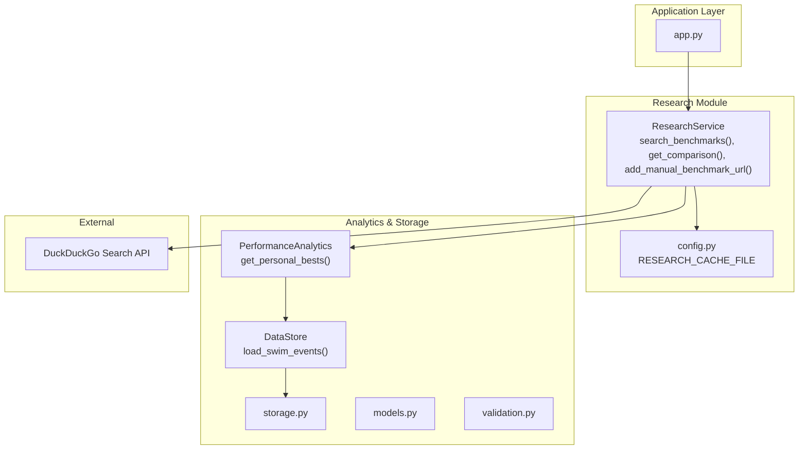

**Diagram sources**
- [app.py:282-318](file://app.py#L282-L318)
- [research_service.py:10-94](file://src/research_service.py#L10-L94)
- [config.py:14](file://src/config.py#L14)
- [analytics.py:115-138](file://src/analytics.py#L115-L138)
- [storage.py:30-44](file://src/storage.py#L30-L44)
- [models.py:7-29](file://src/models.py#L7-L29)

**Section sources**
- [app.py:282-318](file://app.py#L282-L318)
- [research_service.py:10-94](file://src/research_service.py#L10-L94)
- [config.py:14](file://src/config.py#L14)
- [analytics.py:115-138](file://src/analytics.py#L115-L138)
- [storage.py:30-44](file://src/storage.py#L30-L44)
- [models.py:7-29](file://src/models.py#L7-L29)

## Core Components
- ResearchService: Orchestrates DuckDuckGo search, caches results, and builds comparison payloads using personal bests.
- PerformanceAnalytics: Provides personal bests for stroke-distance-course combinations.
- DataStore: Loads swim events persisted in JSON for analytics.
- Config: Defines cache file path and time format constants.
- Streamlit UI: Exposes controls to select stroke, distance, and age and triggers research actions.

Key responsibilities:
- Search: Generate DuckDuckGo query from stroke, distance, age, and gender; cache results keyed by query signature.
- Comparison: Retrieve personal best for the selected event; combine with benchmark references.
- Caching: Persist cache to a JSON file to avoid repeated external searches.
- Integration: Use analytics to fetch personal bests and storage to persist swim events.

**Section sources**
- [research_service.py:31-84](file://src/research_service.py#L31-L84)
- [analytics.py:115-138](file://src/analytics.py#L115-L138)
- [storage.py:30-44](file://src/storage.py#L30-L44)
- [config.py:14](file://src/config.py#L14)
- [app.py:282-318](file://app.py#L282-L318)

## Architecture Overview
The research comparison workflow connects user input to DuckDuckGo search, caches results, and enriches the response with personal best data.

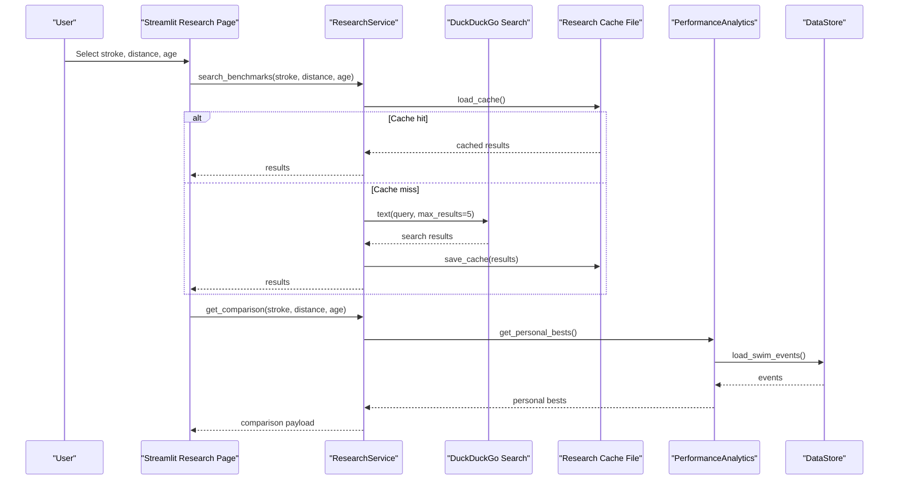

**Diagram sources**
- [app.py:282-318](file://app.py#L282-L318)
- [research_service.py:31-84](file://src/research_service.py#L31-L84)
- [analytics.py:115-138](file://src/analytics.py#L115-L138)
- [storage.py:30-44](file://src/storage.py#L30-L44)
- [config.py:14](file://src/config.py#L14)

## Detailed Component Analysis

### ResearchService
Responsibilities:
- Load and save research cache from/to a JSON file.
- Search DuckDuckGo for benchmarks using a generated query.
- Compare personal best against benchmark references.
- Support manual benchmark URL addition.

Implementation highlights:
- Cache key: constructed from stroke, distance, age, and gender.
- DuckDuckGo query: combines stroke, distance, age, and gender into a natural-language query.
- Error handling: On DuckDuckGo failure, returns a structured error result.
- Comparison payload: includes personal best, benchmark references, and a note indicating that percentile calculation requires specific benchmark tables.

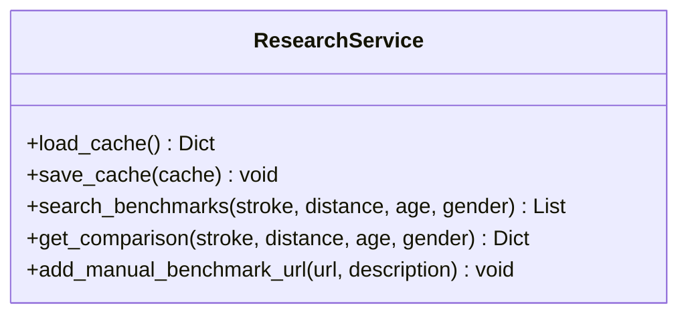

**Diagram sources**
- [research_service.py:10-94](file://src/research_service.py#L10-L94)

**Section sources**
- [research_service.py:14-53](file://src/research_service.py#L14-L53)
- [research_service.py:31-84](file://src/research_service.py#L31-L84)

### DuckDuckGo Search Integration
- Query construction: Uses stroke, distance, age, and gender to form a search query.
- Search execution: Uses the DuckDuckGo SDK to fetch up to five results.
- Result caching: Stores results under a cache key derived from the query signature.

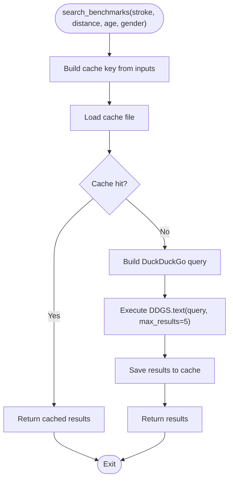

**Diagram sources**
- [research_service.py:31-53](file://src/research_service.py#L31-L53)

**Section sources**
- [research_service.py:31-53](file://src/research_service.py#L31-L53)
- [requirements.txt:6](file://requirements.txt#L6)

### Benchmark Data Retrieval and Comparison
- Personal best retrieval: Uses PerformanceAnalytics to fetch the best time for the selected stroke-distance-course combination.
- Comparison payload: Includes stroke, distance, personal best, benchmark references, and a note indicating that percentile calculation requires specific benchmark tables.

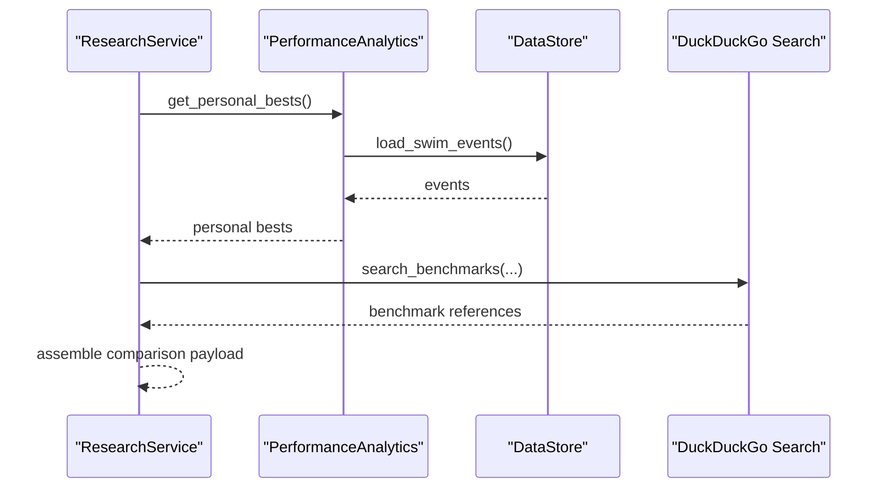

**Diagram sources**
- [research_service.py:55-84](file://src/research_service.py#L55-L84)
- [analytics.py:115-138](file://src/analytics.py#L115-L138)
- [storage.py:30-44](file://src/storage.py#L30-L44)

**Section sources**
- [research_service.py:55-84](file://src/research_service.py#L55-L84)
- [analytics.py:115-138](file://src/analytics.py#L115-L138)
- [storage.py:30-44](file://src/storage.py#L30-L44)

### Age-Group Standard Lookup and Distance-Based Comparisons
- Inputs: stroke, distance, age, and gender.
- Age-group standard lookup: Implemented via DuckDuckGo search with queries tailored to age-group benchmarks.
- Distance-based comparisons: The system selects the personal best for the exact stroke-distance-course combination and compares it against benchmark references.

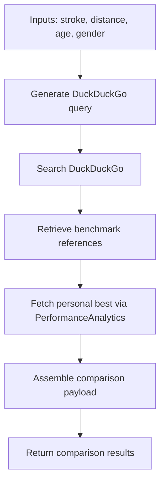

**Diagram sources**
- [research_service.py:31-84](file://src/research_service.py#L31-L84)
- [analytics.py:115-138](file://src/analytics.py#L115-L138)

**Section sources**
- [research_service.py:31-84](file://src/research_service.py#L31-L84)
- [analytics.py:115-138](file://src/analytics.py#L115-L138)

### Performance Percentile Calculations
- Current state: The comparison payload includes a note indicating that percentile calculation requires specific benchmark tables.
- Future enhancement: Implement percentile estimation by parsing benchmark tables and computing percentiles relative to age-group distributions.

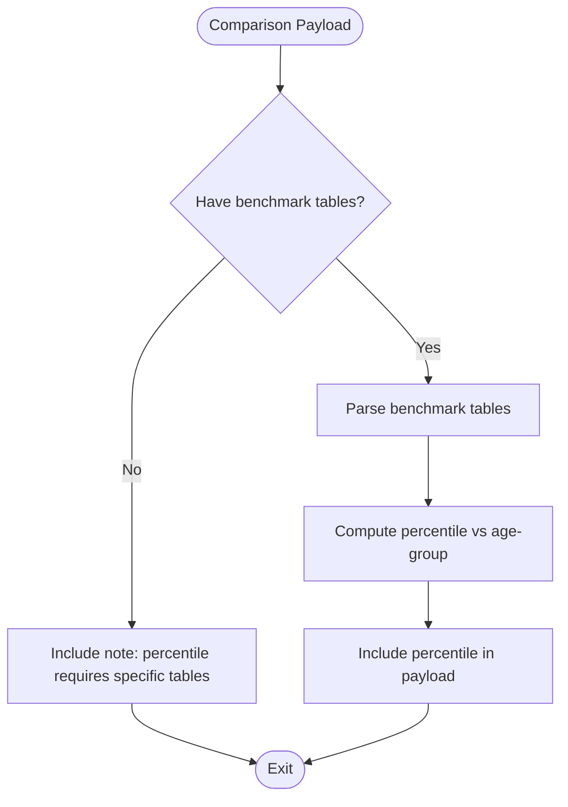

**Diagram sources**
- [research_service.py:82-84](file://src/research_service.py#L82-L84)

**Section sources**
- [research_service.py:82-84](file://src/research_service.py#L82-L84)

### Research Caching Mechanism
- Cache file: Defined in configuration as a JSON file under the data directory.
- Cache key: Constructed from stroke, distance, age, and gender.
- Persistence: On cache miss, results are saved to the cache file; on subsequent requests, cached results are returned immediately.

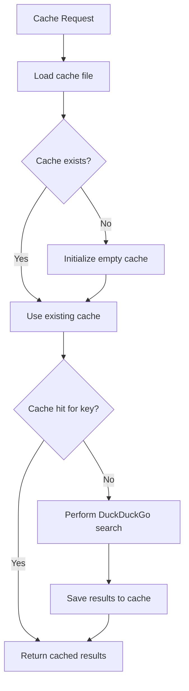

**Diagram sources**
- [research_service.py:14-29](file://src/research_service.py#L14-L29)
- [config.py:14](file://src/config.py#L14)

**Section sources**
- [research_service.py:14-29](file://src/research_service.py#L14-L29)
- [config.py:14](file://src/config.py#L14)

### Integration with Storage System
- Swim events: Loaded via DataStore to support personal best computation.
- Data models: SwimEvent and BodyMetrics define the persisted structures.
- Validation: Utilities validate time formats and required fields to ensure data quality.

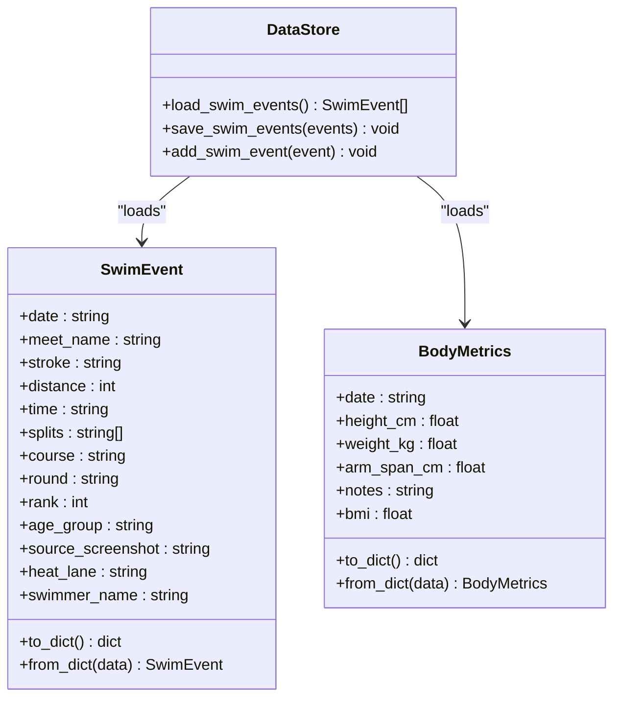

**Diagram sources**
- [storage.py:30-61](file://src/storage.py#L30-L61)
- [models.py:7-29](file://src/models.py#L7-L29)
- [models.py:32-46](file://src/models.py#L32-L46)

**Section sources**
- [storage.py:30-61](file://src/storage.py#L30-L61)
- [models.py:7-29](file://src/models.py#L7-L29)
- [models.py:32-46](file://src/models.py#L32-L46)

### Streamlit UI Integration
- Controls: Stroke selection, distance selection, and age input.
- Actions: Search benchmarks and display results; show performance vs benchmarks.
- Behavior: Triggers ResearchService methods and renders results in expandable sections.

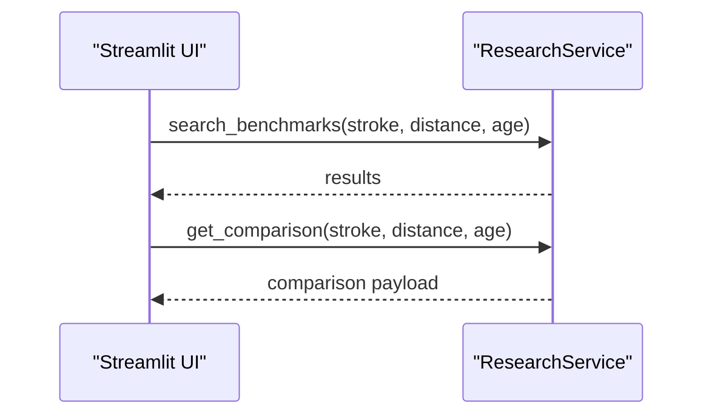

**Diagram sources**
- [app.py:282-318](file://app.py#L282-L318)
- [research_service.py:31-84](file://src/research_service.py#L31-L84)

**Section sources**
- [app.py:282-318](file://app.py#L282-L318)

## Dependency Analysis
- DuckDuckGo SDK: Used for search functionality.
- Pandas and Plotly: Used by analytics for data manipulation and visualization.
- Streamlit: Drives the UI and page routing.

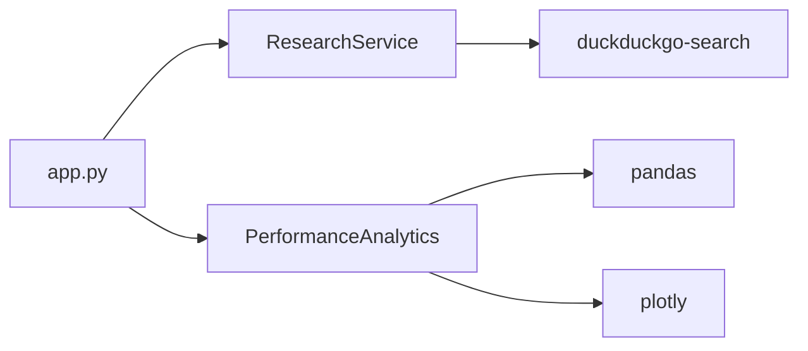

**Diagram sources**
- [requirements.txt:6](file://requirements.txt#L6)
- [analytics.py:1-11](file://src/analytics.py#L1-L11)
- [app.py:16-19](file://app.py#L16-L19)

**Section sources**
- [requirements.txt:1-10](file://requirements.txt#L1-L10)
- [analytics.py:1-11](file://src/analytics.py#L1-L11)
- [app.py:16-19](file://app.py#L16-L19)

## Performance Considerations
- Caching reduces repeated external API calls and improves responsiveness.
- DuckDuckGo search is limited to a small number of results; results are cached to minimize latency.
- Personal best retrieval depends on stored events; ensure data is persisted to avoid repeated computations.

[No sources needed since this section provides general guidance]

## Troubleshooting Guide
Common issues and resolutions:
- DuckDuckGo search failures: The service returns a structured error result when search fails. Verify network connectivity and DuckDuckGo availability.
- Invalid inputs: Ensure stroke, distance, and age are valid. The UI enforces numeric age bounds.
- No personal best found: If no swim events match the selected stroke-distance-course combination, the comparison returns an error message.
- Cache corruption: If the cache file is malformed, the service falls back to an empty cache and continues operation.

**Section sources**
- [research_service.py:52-53](file://src/research_service.py#L52-L53)
- [research_service.py:67-68](file://src/research_service.py#L67-L68)
- [research_service.py:21-22](file://src/research_service.py#L21-L22)

## Conclusion
The research comparison module integrates DuckDuckGo search with personal best data to deliver benchmark-aware insights. It leverages caching to optimize repeated searches, persists swim events for analytics, and provides a clear UI for exploring performance versus standards. Future enhancements can include explicit percentile calculation by parsing benchmark tables.

[No sources needed since this section summarizes without analyzing specific files]

## Appendices

### Examples of Research Queries
- Freestyle 100m for a 10-year-old female: “freestyle 100m swimming benchmark time age 10 female”
- Backstroke 200m for a 12-year-old male: “backstroke 200m swimming benchmark time age 12 male”

**Section sources**
- [research_service.py:44](file://src/research_service.py#L44)

### Benchmark Comparison Results
- Personal best: Retrieved from personal bests dataset.
- Benchmark references: Up to five DuckDuckGo search results.
- Note: Percentile calculation requires specific benchmark tables.

**Section sources**
- [research_service.py:70-84](file://src/research_service.py#L70-L84)

### Performance Assessment Workflows
- Step 1: Select stroke, distance, and age.
- Step 2: Trigger search to retrieve benchmark references.
- Step 3: Retrieve personal best for the selected event.
- Step 4: Assemble comparison payload and render results.

**Section sources**
- [app.py:282-318](file://app.py#L282-L318)
- [research_service.py:31-84](file://src/research_service.py#L31-L84)

### Research Data Validation and Standardization
- Time format validation: Supports MM:SS.ss and SS.ss formats.
- Required fields: Validates presence of date, meet_name, stroke, distance, and time.
- Split validation: Ensures split times conform to the same format rules.

**Section sources**
- [validation.py:7-23](file://src/validation.py#L7-L23)
- [validation.py:62-102](file://src/validation.py#L62-L102)

### Specification Alignment
- Requirement: Search latest swimming research and benchmarks.
- Requirement: Compare against benchmarks and calculate percentile rankings.
- Requirement: Research caching to avoid repeated searches.

**Section sources**
- [spec.md:3-22](file://openspec/changes/sunny-swim-analysis-platform/specs/research-comparison/spec.md#L3-L22)
- [tasks.md:53-60](file://openspec/changes/sunny-swim-analysis-platform/tasks.md#L53-L60)