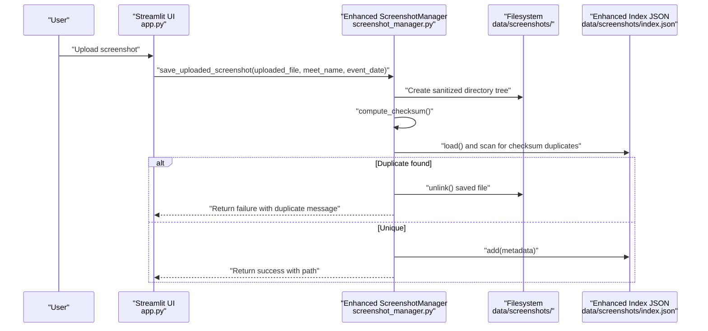
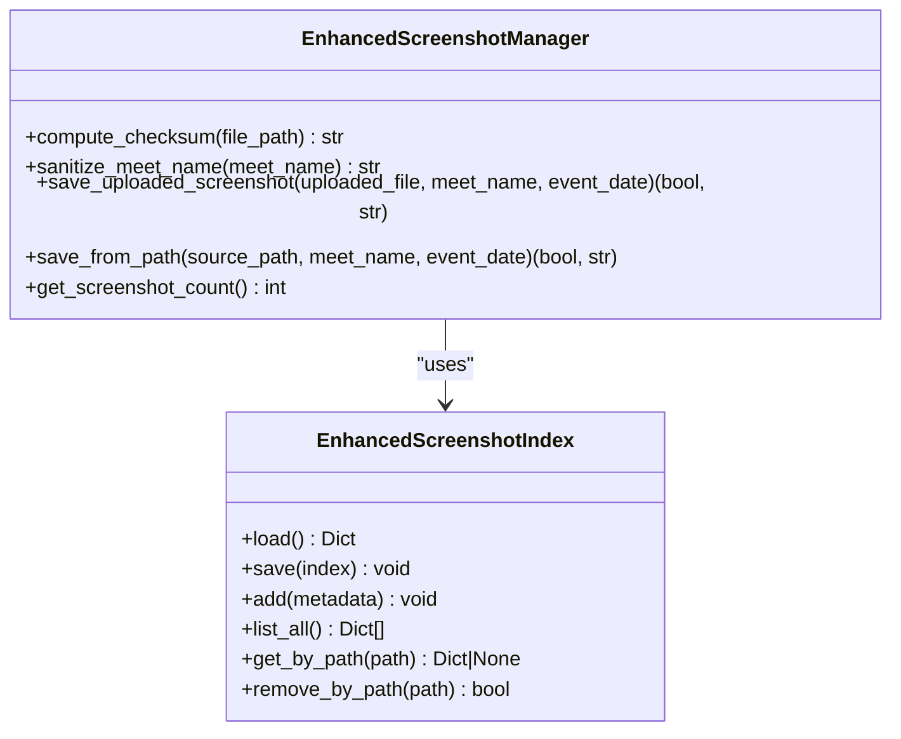
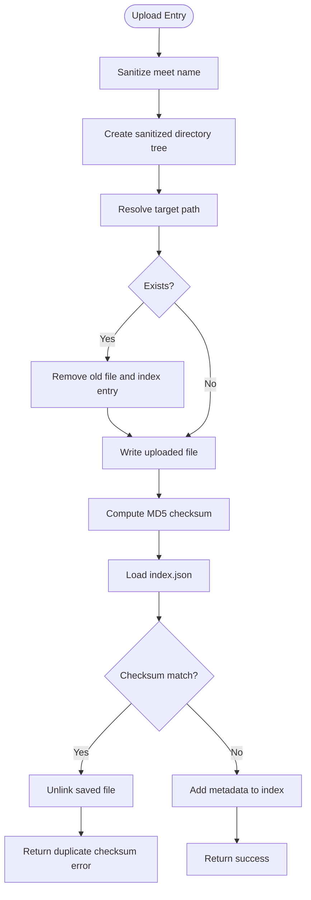
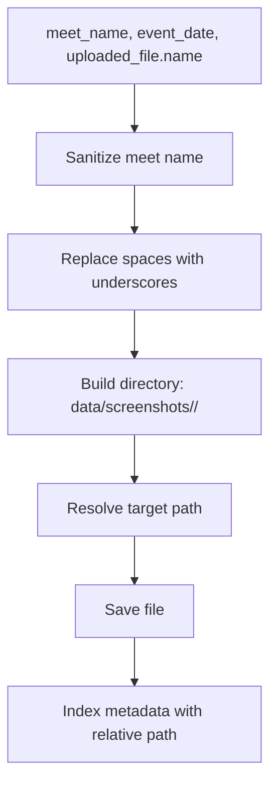
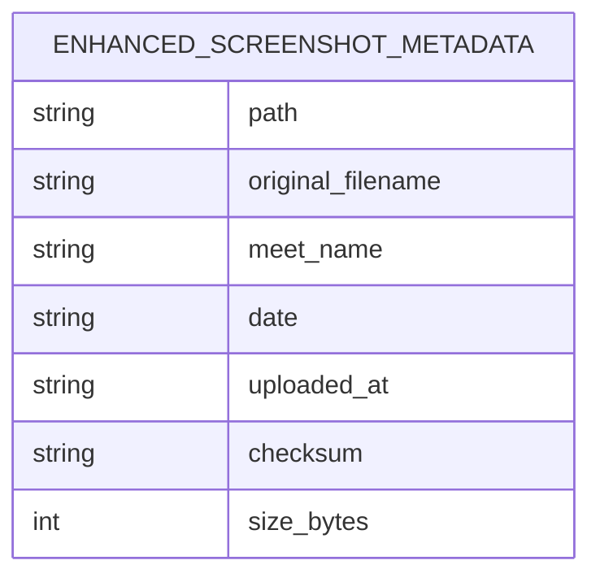
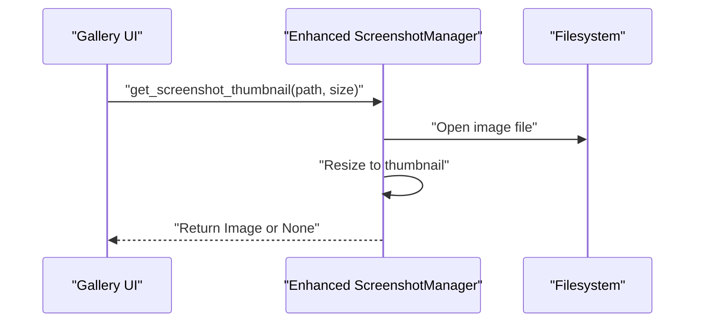
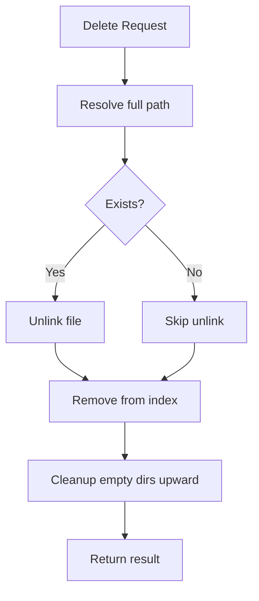
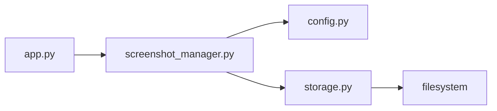

# Screenshot Processing

<cite>
**Referenced Files in This Document**
- [screenshot_manager.py](file://src/screenshot_manager.py)
- [storage.py](file://src/storage.py)
- [config.py](file://src/config.py)
- [app.py](file://app.py)
- [models.py](file://src/models.py)
- [spec.md](file://openspec/changes/sunny-swim-analysis-platform/specs/screenshot-data-ingestion/spec.md)
</cite>

## Update Summary
**Changes Made**
- Enhanced ScreenshotManager with intelligent file organization and hierarchical directory structures
- Implemented MD5 checksum-based duplicate detection mechanism
- Added automated metadata indexing with comprehensive metadata tracking
- Introduced dual upload methods: save_uploaded_screenshot and save_from_path
- Enhanced thumbnail generation capabilities with PIL integration
- Improved error handling and logging throughout the system

## Table of Contents
1. [Introduction](#introduction)
2. [Project Structure](#project-structure)
3. [Core Components](#core-components)
4. [Architecture Overview](#architecture-overview)
5. [Detailed Component Analysis](#detailed-component-analysis)
6. [Dependency Analysis](#dependency-analysis)
7. [Performance Considerations](#performance-considerations)
8. [Troubleshooting Guide](#troubleshooting-guide)
9. [Conclusion](#conclusion)
10. [Appendices](#appendices)

## Introduction
This document provides comprehensive documentation for the screenshot processing module, focusing on the enhanced ScreenshotManager class and its integration with the storage system. The module now features intelligent file organization, MD5 checksum-based duplicate detection, automated metadata indexing, and hierarchical directory structures. It covers upload handling, file organization, duplicate detection mechanisms, thumbnail generation, metadata management, deletion workflow, and performance considerations. Practical examples and error handling scenarios are included to guide both developers and users.

## Project Structure
The screenshot processing module resides within the src package and integrates with the broader application through Streamlit UI and the storage layer. The module organizes screenshots under a structured directory hierarchy and maintains a JSON index for metadata.

```mermaid
graph TB
subgraph "Application Layer"
UI["Streamlit UI<br/>app.py"]
end
subgraph "Screenshot Processing"
SM["Enhanced ScreenshotManager<br/>screenshot_manager.py"]
CFG["Config Paths<br/>config.py"]
ST["Enhanced Storage Index<br/>storage.py"]
end
subgraph "Data Layer"
FS["Filesystem<br/>data/screenshots/"]
IDX["Enhanced Index JSON<br/>data/screenshots/index.json"]
END
UI --> SM
SM --> CFG
SM --> ST
ST --> IDX
SM --> FS
```

**Diagram sources**
- [app.py:60-120](file://app.py#L60-L120)
- [screenshot_manager.py:14-172](file://src/screenshot_manager.py#L14-L172)
- [storage.py:64-162](file://src/storage.py#L64-L162)
- [config.py:5-18](file://src/config.py#L5-L18)

**Section sources**
- [app.py:1-200](file://app.py#L1-L200)
- [screenshot_manager.py:14-172](file://src/screenshot_manager.py#L14-L172)
- [storage.py:64-162](file://src/storage.py#L64-L162)
- [config.py:5-18](file://src/config.py#L5-L18)

## Core Components
- **Enhanced ScreenshotManager**: Central orchestrator for upload, duplicate detection, thumbnail generation, and deletion with intelligent file organization.
- **ScreenshotIndex**: JSON-backed metadata index for screenshots with comprehensive tracking.
- **Config**: Defines filesystem paths and ensures directories exist.
- **Streamlit UI**: Provides upload and gallery interfaces that delegate to ScreenshotManager.

Key responsibilities:
- **Upload handling**: Sanitization, directory creation, saving raw files, and metadata indexing.
- **Intelligent duplicate detection**: Filename-first check, then MD5 checksum-based comparison against the index.
- **Hierarchical organization**: Structured directory tree organization by meet and date.
- **Thumbnail generation**: PIL-based resizing with safe error handling.
- **Deletion workflow**: File removal, index cleanup, and empty directory pruning.

**Section sources**
- [screenshot_manager.py:14-172](file://src/screenshot_manager.py#L14-L172)
- [storage.py:105-162](file://src/storage.py#L105-L162)
- [config.py:5-18](file://src/config.py#L5-L18)
- [app.py:60-165](file://app.py#L60-L165)

## Architecture Overview
The screenshot pipeline integrates UI actions with filesystem operations and metadata management through an enhanced architecture.



**Diagram sources**
- [app.py:73-118](file://app.py#L73-L118)
- [screenshot_manager.py:27-103](file://src/screenshot_manager.py#L27-L103)
- [storage.py:109-142](file://src/storage.py#L109-L142)

## Detailed Component Analysis

### Enhanced ScreenshotManager
The ScreenshotManager class encapsulates all screenshot lifecycle operations with intelligent file organization and comprehensive duplicate detection.

- **compute_checksum**: Streams file content in 4KB chunks to compute MD5, enabling robust duplicate detection.
- **sanitize_meet_name**: Creates safe directory names by replacing special characters and spaces.
- **save_uploaded_screenshot**: Orchestrates upload with sanitization, directory creation, filename uniqueness check, file write, checksum computation, and index update.
- **save_from_path**: Handles local file uploads with the same comprehensive workflow.
- **Enhanced metadata tracking**: Stores path, original_filename, meet_name, date, uploaded_at, checksum, and size_bytes.



**Diagram sources**
- [screenshot_manager.py:14-172](file://src/screenshot_manager.py#L14-L172)
- [storage.py:105-162](file://src/storage.py#L105-L162)

**Section sources**
- [screenshot_manager.py:14-172](file://src/screenshot_manager.py#L14-L172)
- [storage.py:105-162](file://src/storage.py#L105-L162)

### Intelligent File Organization and Duplicate Detection
The system employs a sophisticated two-tier duplicate detection strategy with intelligent file organization:

- **Hierarchical directory structure**: data/screenshots/<meet-name>/<YYYY-MM-DD>/
- **Filename uniqueness**: Prevents overwriting within the same meet/date combination.
- **MD5 checksum-based detection**: Scans the index for identical content across all stored screenshots.
- **Safe meet name sanitization**: Alphanumeric, hyphen, underscore, and space are preserved; spaces are replaced with underscores.



**Diagram sources**
- [screenshot_manager.py:44-103](file://src/screenshot_manager.py#L44-L103)
- [storage.py:109-142](file://src/storage.py#L109-L142)

**Section sources**
- [screenshot_manager.py:44-103](file://src/screenshot_manager.py#L44-L103)
- [storage.py:109-142](file://src/storage.py#L109-L142)

### Enhanced File Naming Conventions and Directory Organization
- **Directory structure**: data/screenshots/<sanitized-meet-name>/<YYYY-MM-DD>/
- **Meet name sanitization**: Alphanumeric, hyphen, underscore, and space are preserved; spaces are replaced with underscores; other characters are replaced with underscores.
- **Filename preservation**: Original filenames are retained as-is under the meet/date directory.
- **Relative path indexing**: Metadata stores a path relative to the screenshots root for portability.
- **Dual upload support**: Both Streamlit file uploads and local file paths are supported.



**Diagram sources**
- [screenshot_manager.py:28-41](file://src/screenshot_manager.py#L28-L41)
- [screenshot_manager.py:67-70](file://src/screenshot_manager.py#L67-L70)
- [config.py:7](file://src/config.py#L7)

**Section sources**
- [screenshot_manager.py:28-41](file://src/screenshot_manager.py#L28-L41)
- [screenshot_manager.py:67-70](file://src/screenshot_manager.py#L67-L70)
- [config.py:7](file://src/config.py#L7)

### Comprehensive Metadata Management
Enhanced metadata includes:
- **path**: Relative path from screenshots root
- **original_filename**: Original uploaded filename
- **meet_name**: Meet identifier
- **date**: Event date
- **uploaded_at**: ISO timestamp
- **checksum**: MD5 hash for duplicate detection
- **size_bytes**: File size in bytes

The ScreenshotIndex class manages loading, saving, adding, listing, retrieving by path, and removing by path with comprehensive error handling and backup functionality.



**Diagram sources**
- [screenshot_manager.py:92-100](file://src/screenshot_manager.py#L92-L100)
- [storage.py:109-161](file://src/storage.py#L109-L161)

**Section sources**
- [screenshot_manager.py:92-100](file://src/screenshot_manager.py#L92-L100)
- [storage.py:109-161](file://src/storage.py#L109-L161)

### Enhanced Thumbnail Generation
Thumbnail generation uses PIL's ImageOps.fit or thumbnail operation to resize images to a specified size while preserving aspect ratio. The system includes comprehensive error handling and graceful degradation.



**Diagram sources**
- [screenshot_manager.py:89-100](file://src/screenshot_manager.py#L89-L100)
- [app.py:153](file://app.py#L153)

**Section sources**
- [screenshot_manager.py:89-100](file://src/screenshot_manager.py#L89-L100)
- [app.py:153](file://app.py#L153)

### Enhanced Deletion Workflow and Cleanup
Deletion removes the file from disk, removes the corresponding metadata entry, and cleans up empty directories upward toward the screenshots root.



**Diagram sources**
- [screenshot_manager.py:102-130](file://src/screenshot_manager.py#L102-L130)
- [storage.py:155-161](file://src/storage.py#L155-L161)

**Section sources**
- [screenshot_manager.py:102-130](file://src/screenshot_manager.py#L102-L130)
- [storage.py:155-161](file://src/storage.py#L155-L161)

### Integration with Enhanced Storage System
- **Enhanced ScreenshotManager** relies on ScreenshotIndex for metadata persistence.
- **Config** defines the screenshots root and index file locations.
- **UI** delegates upload and gallery operations to ScreenshotManager.
- **Dual upload support**: Both Streamlit file uploads and local file paths are supported.

**Section sources**
- [screenshot_manager.py:10-11](file://src/screenshot_manager.py#L10-L11)
- [storage.py:105-162](file://src/storage.py#L105-L162)
- [config.py:7-13](file://src/config.py#L7-L13)
- [app.py:60-165](file://app.py#L60-L165)

## Dependency Analysis
The screenshot processing module exhibits low coupling and clear separation of concerns with enhanced functionality:
- **Enhanced ScreenshotManager** depends on Config for paths and on ScreenshotIndex for metadata.
- **Enhanced ScreenshotIndex** depends on the filesystem for JSON persistence with backup functionality.
- **UI** depends on ScreenshotManager for all screenshot operations.



**Diagram sources**
- [app.py:10-13](file://app.py#L10-L13)
- [screenshot_manager.py:10-11](file://src/screenshot_manager.py#L10-L11)
- [storage.py:105-162](file://src/storage.py#L105-L162)
- [config.py:7-13](file://src/config.py#L7-L13)

**Section sources**
- [app.py:10-13](file://app.py#L10-L13)
- [screenshot_manager.py:10-11](file://src/screenshot_manager.py#L10-L11)
- [storage.py:105-162](file://src/storage.py#L105-L162)
- [config.py:7-13](file://src/config.py#L7-L13)

## Performance Considerations
- **Checksum computation**: Streaming in 4KB chunks minimizes memory overhead for large files.
- **Enhanced thumbnail generation**: PIL's thumbnail operation resizes efficiently; ensure appropriate size parameters to balance quality and memory usage.
- **Index scanning**: Linear scan over the index is acceptable for moderate numbers of screenshots; consider indexing by checksum for large datasets.
- **File I/O**: Batch operations and avoiding unnecessary re-reads improve throughput.
- **Memory management**: Close images promptly and avoid holding references to large PIL images beyond display.
- **Backup functionality**: Automatic backup creation prevents data loss during index updates.

## Troubleshooting Guide
Common issues and resolutions:
- **Duplicate filename error**: Occurs when uploading a file with the same name under the same meet/date. Rename the file or select a different date/meet.
- **Duplicate checksum error**: Indicates an identical image already exists. No file was overwritten; verify the existing entry.
- **Thumbnail generation fails**: May occur with corrupted images or unsupported formats; the system returns None gracefully.
- **Deletion not reflected**: Ensure the path exists in the index; otherwise, the file may be orphaned. Re-index if necessary.
- **File organization issues**: Verify that meet names are properly sanitized and directory permissions are correct.
- **Index corruption**: Automatic backup creation helps recover from corrupted index files.

**Section sources**
- [screenshot_manager.py:51-68](file://src/screenshot_manager.py#L51-L68)
- [screenshot_manager.py:95-100](file://src/screenshot_manager.py#L95-L100)
- [screenshot_manager.py:117-119](file://src/screenshot_manager.py#L117-L119)

## Conclusion
The enhanced screenshot processing module provides a robust, organized, and efficient pipeline for managing swimming meet screenshots. Its intelligent file organization, MD5 checksum-based duplicate detection, structured directory organization, and comprehensive JSON-backed metadata index ensure reliability and scalability. The integration with the UI enables seamless upload, browsing, and deletion workflows, while the enhanced thumbnail generation supports quick visual inspection. The dual upload methods and comprehensive error handling make the system user-friendly and reliable for production use.

## Appendices

### Practical Upload Scenarios
- **Single upload**: Enter meet name and event date, select a PNG/JPG file, click upload. The system saves the file under data/screenshots/<sanitized-meet>/<date>/ and adds metadata to index.json.
- **Local file upload**: Provide an absolute path to an image file; the system processes it identically to uploaded files.
- **Duplicate filename**: Attempting to upload a file with the same name under the same meet/date triggers a filename duplicate error.
- **Duplicate checksum**: Uploading an identical image triggers a checksum duplicate error; the temporary file is removed.
- **Batch processing**: Select a folder containing multiple screenshots; the system processes them all with intelligent meet and date inference.

**Section sources**
- [app.py:73-118](file://app.py#L73-L118)
- [screenshot_manager.py:51-68](file://src/screenshot_manager.py#L51-L68)
- [app.py:325-488](file://app.py#L325-L488)

### Requirements Alignment
- **Organized storage by meet and date**: Implemented via enhanced directory structure and sanitized meet names.
- **Intelligent duplicate detection by filename and checksum**: Implemented in save_uploaded_screenshot and save_from_path.
- **Comprehensive metadata tracking**: Implemented via ScreenshotIndex and enhanced metadata fields.
- **Hierarchical directory organization**: Implemented through sanitize_meet_name and directory creation logic.
- **Dual upload support**: Implemented through save_uploaded_screenshot and save_from_path methods.

**Section sources**
- [spec.md:3-23](file://openspec/changes/sunny-swim-analysis-platform/specs/screenshot-data-ingestion/spec.md#L3-L23)
- [screenshot_manager.py:28-103](file://src/screenshot_manager.py#L28-L103)
- [storage.py:109-142](file://src/storage.py#L109-L142)