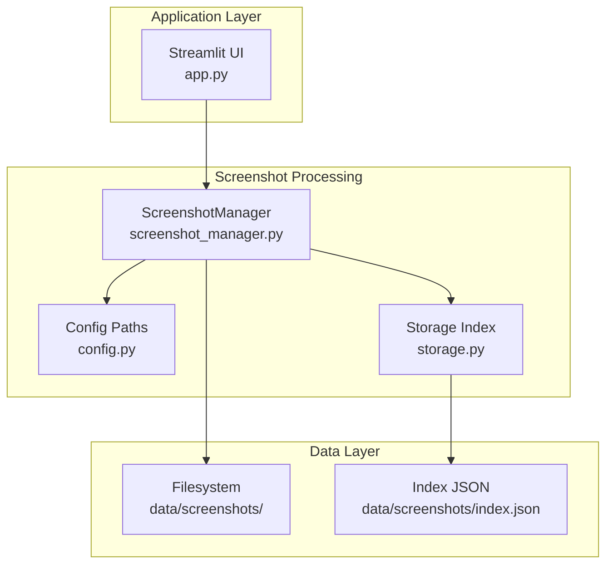
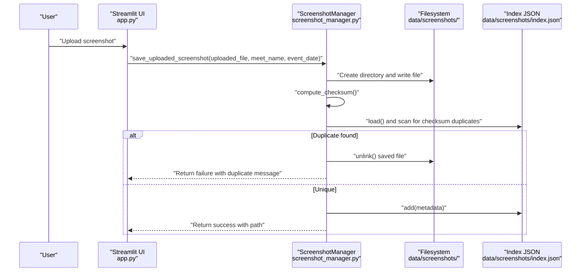
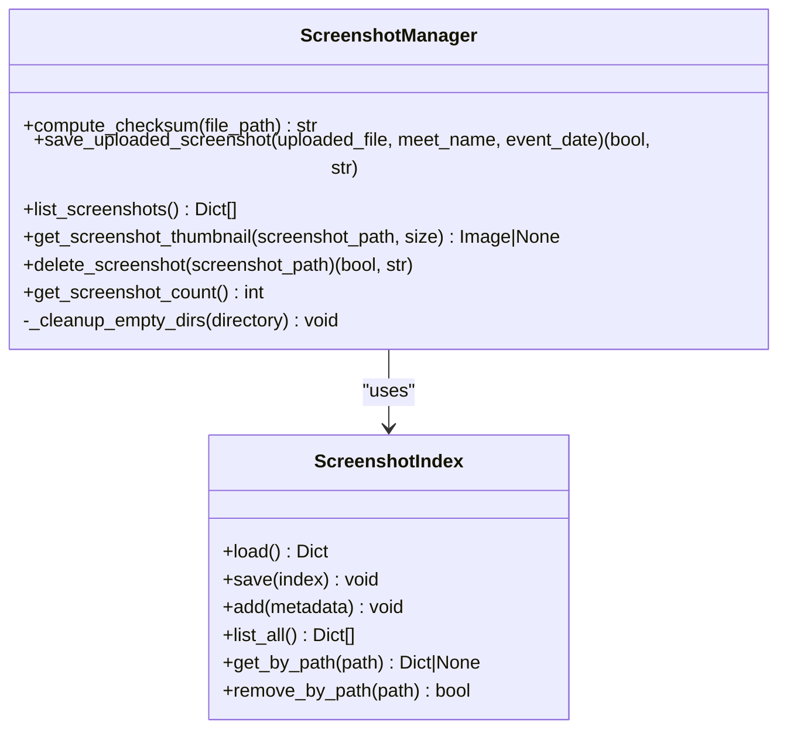
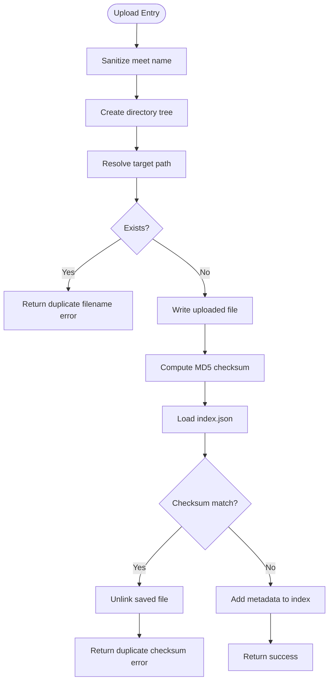
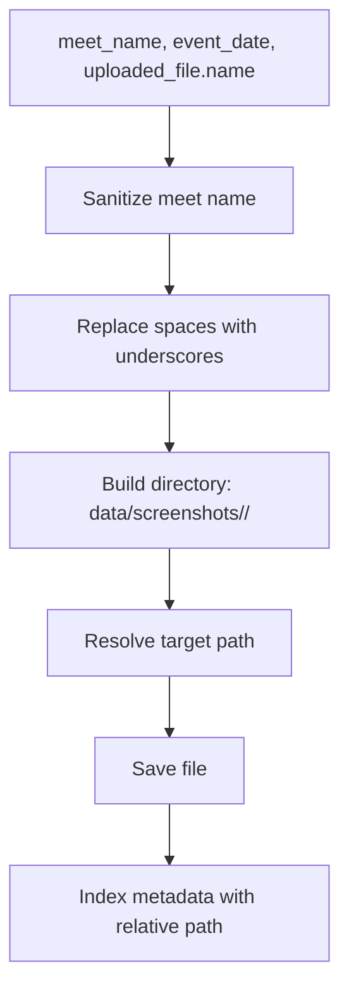
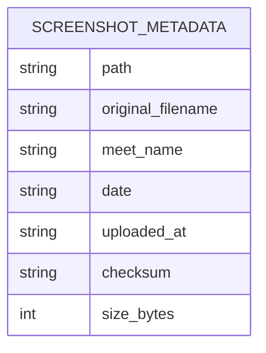
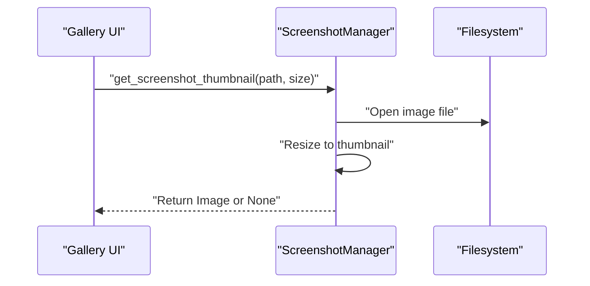
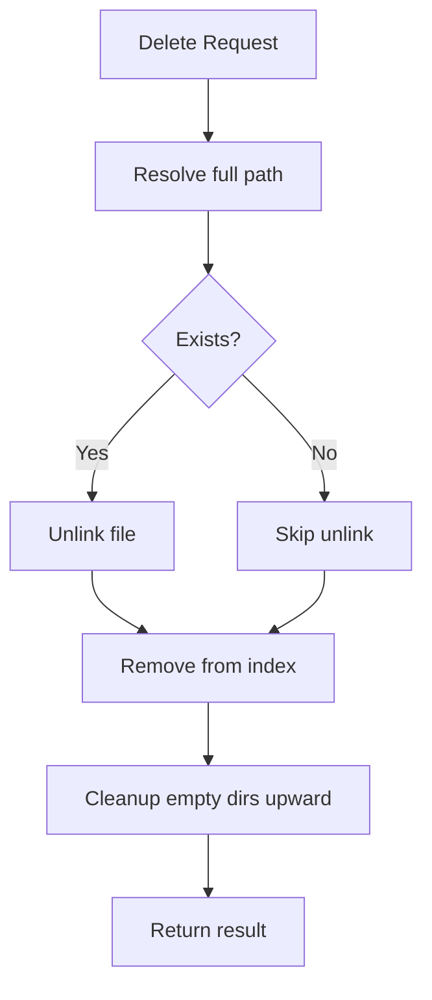
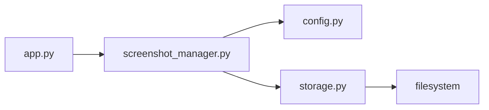

# Screenshot Processing

<cite>
**Referenced Files in This Document**
- [screenshot_manager.py](file://src/screenshot_manager.py)
- [storage.py](file://src/storage.py)
- [config.py](file://src/config.py)
- [app.py](file://app.py)
- [models.py](file://src/models.py)
- [spec.md](file://openspec/changes/sunny-swim-analysis-platform/specs/screenshot-data-ingestion/spec.md)
</cite>

## Table of Contents
1. [Introduction](#introduction)
2. [Project Structure](#project-structure)
3. [Core Components](#core-components)
4. [Architecture Overview](#architecture-overview)
5. [Detailed Component Analysis](#detailed-component-analysis)
6. [Dependency Analysis](#dependency-analysis)
7. [Performance Considerations](#performance-considerations)
8. [Troubleshooting Guide](#troubleshooting-guide)
9. [Conclusion](#conclusion)
10. [Appendices](#appendices)

## Introduction
This document provides comprehensive documentation for the screenshot processing module, focusing on the ScreenshotManager class and its integration with the storage system. It covers upload handling, file organization, duplicate detection mechanisms (including checksum-based detection), thumbnail generation, metadata management, deletion workflow, and performance considerations. Practical examples and error handling scenarios are included to guide both developers and users.

## Project Structure
The screenshot processing module resides within the src package and integrates with the broader application through Streamlit UI and the storage layer. The module organizes screenshots under a structured directory hierarchy and maintains a JSON index for metadata.

**Diagram sources**
- [app.py:60-120](file://app.py#L60-L120)
- [screenshot_manager.py:14-136](file://src/screenshot_manager.py#L14-L136)
- [storage.py:64-107](file://src/storage.py#L64-L107)
- [config.py:5-18](file://src/config.py#L5-L18)

**Section sources**
- [app.py:1-200](file://app.py#L1-L200)
- [screenshot_manager.py:14-136](file://src/screenshot_manager.py#L14-L136)
- [storage.py:64-107](file://src/storage.py#L64-L107)
- [config.py:5-18](file://src/config.py#L5-L18)

## Core Components
- ScreenshotManager: Central orchestrator for upload, duplicate detection, thumbnail generation, and deletion.
- ScreenshotIndex: JSON-backed metadata index for screenshots.
- Config: Defines filesystem paths and ensures directories exist.
- Streamlit UI: Provides upload and gallery interfaces that delegate to ScreenshotManager.

Key responsibilities:
- Upload handling: Sanitization, directory creation, saving raw files, and metadata indexing.
- Duplicate detection: Filename-first check, then checksum-based comparison against the index.
- Thumbnail generation: PIL-based resizing with safe error handling.
- Deletion workflow: File removal, index cleanup, and empty directory pruning.

**Section sources**
- [screenshot_manager.py:14-136](file://src/screenshot_manager.py#L14-L136)
- [storage.py:64-107](file://src/storage.py#L64-L107)
- [config.py:5-18](file://src/config.py#L5-L18)
- [app.py:60-165](file://app.py#L60-L165)

## Architecture Overview
The screenshot pipeline integrates UI actions with filesystem operations and metadata management.

**Diagram sources**
- [app.py:73-118](file://app.py#L73-L118)
- [screenshot_manager.py:27-82](file://src/screenshot_manager.py#L27-L82)
- [storage.py:67-87](file://src/storage.py#L67-L87)

## Detailed Component Analysis

### ScreenshotManager
The ScreenshotManager class encapsulates all screenshot lifecycle operations.

- compute_checksum: Streams file content in chunks to compute MD5, enabling robust duplicate detection.
- save_uploaded_screenshot: Orchestrates upload with sanitization, directory creation, filename uniqueness check, file write, checksum computation, and index update.
- list_screenshots: Retrieves all indexed screenshots.
- get_screenshot_thumbnail: Generates thumbnails safely with PIL, returning None on errors.
- delete_screenshot: Removes files and updates the index, then prunes empty directories upward.
- _cleanup_empty_dirs: Recursively removes empty directories up to the screenshots root.

**Diagram sources**
- [screenshot_manager.py:14-136](file://src/screenshot_manager.py#L14-L136)
- [storage.py:64-107](file://src/storage.py#L64-L107)

**Section sources**
- [screenshot_manager.py:14-136](file://src/screenshot_manager.py#L14-L136)
- [storage.py:64-107](file://src/storage.py#L64-L107)

### Duplicate Detection Mechanism
The system employs a two-tier duplicate detection strategy:
- Filename uniqueness: Prevents overwriting within the same meet/date combination.
- Checksum-based detection: Scans the index for identical content across all stored screenshots.

**Diagram sources**
- [screenshot_manager.py:27-82](file://src/screenshot_manager.py#L27-L82)
- [storage.py:67-87](file://src/storage.py#L67-L87)

**Section sources**
- [screenshot_manager.py:27-82](file://src/screenshot_manager.py#L27-L82)
- [storage.py:67-87](file://src/storage.py#L67-L87)

### File Naming Conventions and Directory Organization
- Directory structure: data/screenshots/<meet-name>/<YYYY-MM-DD>/
- Meet name sanitization: Alphanumeric, hyphen, underscore, and space are preserved; spaces are replaced with underscores; other characters are replaced with underscores.
- Filename preservation: Original filenames are retained as-is under the meet/date directory.
- Relative path indexing: Metadata stores a path relative to the screenshots root for portability.

**Diagram sources**
- [screenshot_manager.py:41-57](file://src/screenshot_manager.py#L41-L57)
- [screenshot_manager.py:71-79](file://src/screenshot_manager.py#L71-L79)
- [config.py:7](file://src/config.py#L7)

**Section sources**
- [screenshot_manager.py:41-57](file://src/screenshot_manager.py#L41-L57)
- [screenshot_manager.py:71-79](file://src/screenshot_manager.py#L71-L79)
- [config.py:7](file://src/config.py#L7)

### Metadata Management
Metadata includes:
- path: Relative path from screenshots root
- original_filename: Original uploaded filename
- meet_name: Meet identifier
- date: Event date
- uploaded_at: ISO timestamp
- checksum: MD5 hash
- size_bytes: File size

The ScreenshotIndex class manages loading, saving, adding, listing, retrieving by path, and removing by path.

**Diagram sources**
- [screenshot_manager.py:71-79](file://src/screenshot_manager.py#L71-L79)
- [storage.py:67-106](file://src/storage.py#L67-L106)

**Section sources**
- [screenshot_manager.py:71-79](file://src/screenshot_manager.py#L71-L79)
- [storage.py:67-106](file://src/storage.py#L67-L106)

### Thumbnail Generation
Thumbnail generation uses PIL’s ImageOps.fit or thumbnail operation to resize images to a specified size while preserving aspect ratio. Errors are caught and None is returned to prevent crashes.

**Diagram sources**
- [screenshot_manager.py:89-100](file://src/screenshot_manager.py#L89-L100)
- [app.py:153](file://app.py#L153)

**Section sources**
- [screenshot_manager.py:89-100](file://src/screenshot_manager.py#L89-L100)
- [app.py:153](file://app.py#L153)

### Deletion Workflow and Cleanup
Deletion removes the file from disk, removes the corresponding metadata entry, and cleans up empty directories upward toward the screenshots root.

**Diagram sources**
- [screenshot_manager.py:102-130](file://src/screenshot_manager.py#L102-L130)
- [storage.py:100-106](file://src/storage.py#L100-L106)

**Section sources**
- [screenshot_manager.py:102-130](file://src/screenshot_manager.py#L102-L130)
- [storage.py:100-106](file://src/storage.py#L100-L106)

### Integration with Storage System
- ScreenshotManager relies on ScreenshotIndex for metadata persistence.
- Config defines the screenshots root and index file locations.
- The UI delegates upload and gallery operations to ScreenshotManager.

**Section sources**
- [screenshot_manager.py:10-11](file://src/screenshot_manager.py#L10-L11)
- [storage.py:64-107](file://src/storage.py#L64-L107)
- [config.py:7-13](file://src/config.py#L7-L13)
- [app.py:60-165](file://app.py#L60-L165)

## Dependency Analysis
The screenshot processing module exhibits low coupling and clear separation of concerns:
- ScreenshotManager depends on Config for paths and on ScreenshotIndex for metadata.
- ScreenshotIndex depends on the filesystem for JSON persistence.
- UI depends on ScreenshotManager for all screenshot operations.

**Diagram sources**
- [app.py:10-13](file://app.py#L10-L13)
- [screenshot_manager.py:10-11](file://src/screenshot_manager.py#L10-L11)
- [storage.py:64-107](file://src/storage.py#L64-L107)
- [config.py:7-13](file://src/config.py#L7-L13)

**Section sources**
- [app.py:10-13](file://app.py#L10-L13)
- [screenshot_manager.py:10-11](file://src/screenshot_manager.py#L10-L11)
- [storage.py:64-107](file://src/storage.py#L64-L107)
- [config.py:7-13](file://src/config.py#L7-L13)

## Performance Considerations
- Checksum computation: Streaming in 4KB chunks minimizes memory overhead for large files.
- Thumbnail generation: PIL’s thumbnail operation resizes efficiently; ensure appropriate size parameters to balance quality and memory usage.
- Index scanning: Linear scan over the index is acceptable for moderate numbers of screenshots; consider indexing by checksum for large datasets.
- File I/O: Batch operations and avoiding unnecessary re-reads improve throughput.
- Memory management: Close images promptly and avoid holding references to large PIL images beyond display.

[No sources needed since this section provides general guidance]

## Troubleshooting Guide
Common issues and resolutions:
- Duplicate filename error: Occurs when uploading a file with the same name under the same meet/date. Rename the file or select a different date/meet.
- Duplicate checksum error: Indicates an identical image already exists. No file was overwritten; verify the existing entry.
- Thumbnail generation fails: May occur with corrupted images or unsupported formats; the system returns None gracefully.
- Deletion not reflected: Ensure the path exists in the index; otherwise, the file may be orphaned. Re-index if necessary.

**Section sources**
- [screenshot_manager.py:51-68](file://src/screenshot_manager.py#L51-L68)
- [screenshot_manager.py:95-100](file://src/screenshot_manager.py#L95-L100)
- [screenshot_manager.py:117-119](file://src/screenshot_manager.py#L117-L119)

## Conclusion
The screenshot processing module provides a robust, organized, and efficient pipeline for managing swimming meet screenshots. Its dual-layer duplicate detection, structured directory organization, and JSON-backed metadata index ensure reliability and scalability. The integration with the UI enables seamless upload, browsing, and deletion workflows, while the thumbnail generation supports quick visual inspection.

[No sources needed since this section summarizes without analyzing specific files]

## Appendices

### Practical Upload Scenarios
- Single upload: Enter meet name and event date, select a PNG/JPG file, click upload. The system saves the file under data/screenshots/<meet>/<date>/ and adds metadata to index.json.
- Duplicate filename: Attempting to upload a file with the same name under the same meet/date triggers a filename duplicate error.
- Duplicate checksum: Uploading an identical image triggers a checksum duplicate error; the temporary file is removed.

**Section sources**
- [app.py:73-118](file://app.py#L73-L118)
- [screenshot_manager.py:51-68](file://src/screenshot_manager.py#L51-L68)

### Requirements Alignment
- Organized storage by meet and date: Implemented via directory structure and sanitized meet names.
- Duplicate detection by filename and checksum: Implemented in save_uploaded_screenshot.
- Metadata tracking: Implemented via ScreenshotIndex and metadata fields.

**Section sources**
- [spec.md:3-22](file://openspec/changes/sunny-swim-analysis-platform/specs/screenshot-data-ingestion/spec.md#L3-L22)
- [screenshot_manager.py:41-82](file://src/screenshot_manager.py#L41-L82)
- [storage.py:67-87](file://src/storage.py#L67-L87)