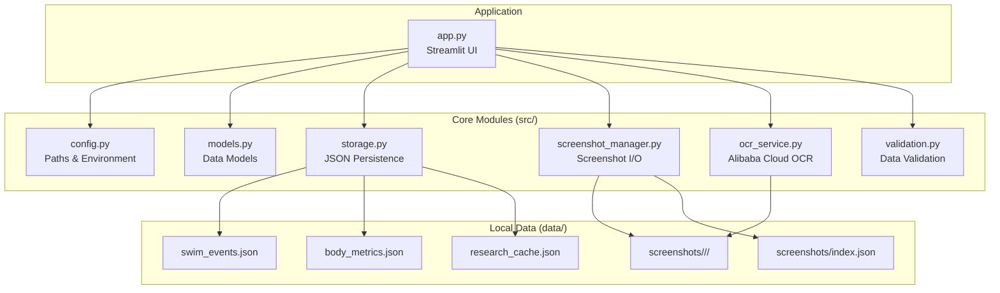
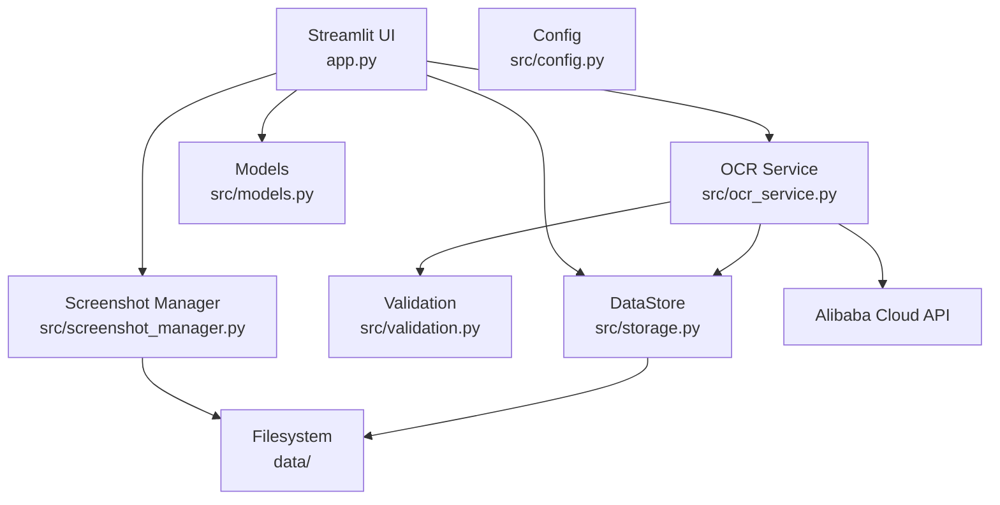
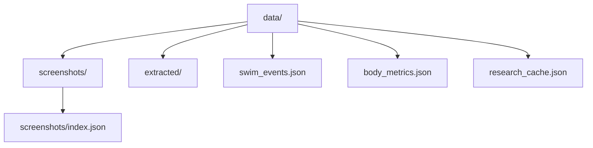
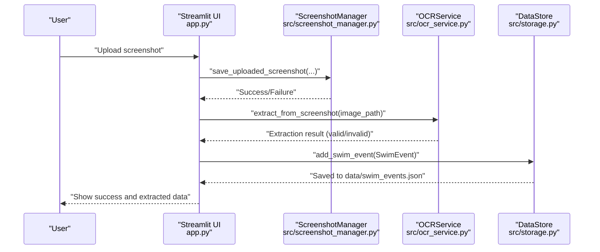
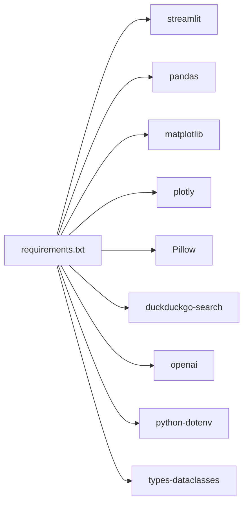

# Getting Started

<cite>
**Referenced Files in This Document**
- [README.md](file://README.md)
- [requirements.txt](file://requirements.txt)
- [app.py](file://app.py)
- [src/config.py](file://src/config.py)
- [src/storage.py](file://src/storage.py)
- [src/models.py](file://src/models.py)
- [src/screenshot_manager.py](file://src/screenshot_manager.py)
- [src/ocr_service.py](file://src/ocr_service.py)
- [src/validation.py](file://src/validation.py)
</cite>

## Table of Contents
1. [Introduction](#introduction)
2. [Project Structure](#project-structure)
3. [Core Components](#core-components)
4. [Architecture Overview](#architecture-overview)
5. [Detailed Component Analysis](#detailed-component-analysis)
6. [Dependency Analysis](#dependency-analysis)
7. [Performance Considerations](#performance-considerations)
8. [Troubleshooting Guide](#troubleshooting-guide)
9. [Conclusion](#conclusion)
10. [Appendices](#appendices)

## Introduction
This guide helps you install and run the Swimming Data Analysis Platform locally. It covers Python prerequisites, dependency installation, environment configuration for Alibaba Cloud APIs, and step-by-step instructions to launch the Streamlit application. You will also learn how the platform stores data locally, how to upload your first screenshot, and how to extract structured race data using AI.

## Project Structure
The platform is organized around a Streamlit front-end that orchestrates data ingestion, OCR extraction, validation, storage, and visualization. Key directories and files:
- app.py: Streamlit application entry point and UI routing
- src/: Core modules for configuration, data models, storage, OCR, validation, and UI components
- data/: Local storage for screenshots, extracted data, and JSON-backed datasets
- requirements.txt: Python dependencies

**Diagram sources**
- [app.py:1-447](file://app.py#L1-L447)
- [src/config.py:1-29](file://src/config.py#L1-L29)
- [src/storage.py:1-107](file://src/storage.py#L1-L107)
- [src/screenshot_manager.py:1-136](file://src/screenshot_manager.py#L1-L136)
- [src/ocr_service.py:1-144](file://src/ocr_service.py#L1-L144)
- [src/models.py:1-55](file://src/models.py#L1-L55)

**Section sources**
- [README.md:15-31](file://README.md#L15-L31)
- [app.py:1-447](file://app.py#L1-L447)
- [src/config.py:1-29](file://src/config.py#L1-L29)

## Core Components
- Streamlit application (app.py) provides the UI and routes between pages (Upload, Gallery, Body Metrics, Analytics, Research, Insights, Q&A).
- Configuration (src/config.py) defines local paths and environment variables for Alibaba Cloud integration.
- Data models (src/models.py) define SwimEvent and BodyMetrics structures.
- Storage (src/storage.py) persists SwimEvent and BodyMetrics to JSON files and maintains a screenshot index.
- Screenshot manager (src/screenshot_manager.py) handles upload, deduplication, thumbnails, and deletion.
- OCR service (src/ocr_service.py) integrates with Alibaba Cloud Model Studio to extract structured race data from screenshots.
- Validation (src/validation.py) validates time formats and required fields.

**Section sources**
- [app.py:1-447](file://app.py#L1-L447)
- [src/config.py:1-29](file://src/config.py#L1-L29)
- [src/models.py:1-55](file://src/models.py#L1-L55)
- [src/storage.py:1-107](file://src/storage.py#L1-L107)
- [src/screenshot_manager.py:1-136](file://src/screenshot_manager.py#L1-L136)
- [src/ocr_service.py:1-144](file://src/ocr_service.py#L1-L144)
- [src/validation.py:1-103](file://src/validation.py#L1-L103)

## Architecture Overview
The platform follows a modular, file-backed architecture:
- UI layer (Streamlit) renders pages and collects user input
- Service layer (OCR, Research, Insights, QA) performs specialized tasks
- Storage layer (JSON files) persists structured data
- File system layer stores raw screenshots and thumbnails

**Diagram sources**
- [app.py:1-447](file://app.py#L1-L447)
- [src/config.py:1-29](file://src/config.py#L1-L29)
- [src/screenshot_manager.py:1-136](file://src/screenshot_manager.py#L1-L136)
- [src/ocr_service.py:1-144](file://src/ocr_service.py#L1-L144)
- [src/validation.py:1-103](file://src/validation.py#L1-L103)
- [src/storage.py:1-107](file://src/storage.py#L1-L107)
- [src/models.py:1-55](file://src/models.py#L1-L55)

## Detailed Component Analysis

### Installation and Environment Setup
Follow these steps to prepare your environment:
1. Install dependencies
   - Use pip to install all required packages.
   - Reference: [requirements.txt:1-10](file://requirements.txt#L1-L10)
2. Configure Alibaba Cloud API key
   - Set the environment variable for Alibaba Cloud Model Studio.
   - Reference: [README.md:22-25](file://README.md#L22-L25)
3. Verify internet connectivity
   - Internet access is required for research search.
   - Reference: [README.md:62](file://README.md#L62)

**Section sources**
- [README.md:17-30](file://README.md#L17-L30)
- [requirements.txt:1-10](file://requirements.txt#L1-L10)

### Running the Streamlit Application
- Launch the app with Streamlit after installing dependencies and setting the API key.
- Reference: [README.md:27-30](file://README.md#L27-L30)
- The app initializes session state, sets page configuration, and loads services on startup.
  - Reference: [app.py:22-42](file://app.py#L22-L42)

**Section sources**
- [README.md:27-30](file://README.md#L27-L30)
- [app.py:22-42](file://app.py#L22-L42)

### Initial Configuration and First-Time User Guidance
- Set environment variables before launching the app.
  - Reference: [README.md:22-25](file://README.md#L22-L25)
- On first launch, the app displays an API status indicator in the footer area.
  - Reference: [app.py:441-447](file://app.py#L441-L447)
- The Upload page allows entering meet details and uploading screenshots.
  - Reference: [app.py:61-127](file://app.py#L61-L127)

**Section sources**
- [README.md:22-25](file://README.md#L22-L25)
- [app.py:61-127](file://app.py#L61-L127)
- [app.py:441-447](file://app.py#L441-L447)

### Local Data Storage Structure
The platform organizes data under the data/ directory:
- data/screenshots/: Stores raw screenshots in a nested folder structure by meet and date.
- data/swim_events.json: Persisted swim event records.
- data/body_metrics.json: Persisted body metrics records.
- data/research_cache.json: Cached research results.
- data/screenshots/index.json: Index of screenshots with metadata (checksums, sizes, timestamps).

**Diagram sources**
- [src/config.py:6-14](file://src/config.py#L6-L14)
- [src/storage.py:10-62](file://src/storage.py#L10-L62)
- [src/screenshot_manager.py:14-87](file://src/screenshot_manager.py#L14-L87)

**Section sources**
- [README.md:32-39](file://README.md#L32-L39)
- [src/config.py:6-14](file://src/config.py#L6-L14)
- [src/storage.py:10-62](file://src/storage.py#L10-L62)
- [src/screenshot_manager.py:14-87](file://src/screenshot_manager.py#L14-L87)

### Practical Example: Uploading Your First Screenshot and Extracting Data
Follow these steps to upload and extract data from your first screenshot:
1. Navigate to the Upload page.
   - Reference: [app.py:61-127](file://app.py#L61-L127)
2. Enter Meet Name and Event Date.
3. Choose a PNG/JPG image file.
4. Click Upload & Extract.
   - The app saves the screenshot to data/screenshots/<meet>/<date>/ and triggers OCR.
   - Reference: [app.py:73-118](file://app.py#L73-L118)
5. Review extraction results.
   - The app shows success or warnings, and optionally displays extracted data.
   - Reference: [app.py:88-118](file://app.py#L88-L118)
6. Save to events.
   - The app constructs a SwimEvent and persists it to data/swim_events.json.
   - Reference: [app.py:97-113](file://app.py#L97-L113)
7. Verify persistence.
   - Check data/swim_events.json for the new record.
   - Reference: [src/storage.py:30-44](file://src/storage.py#L30-L44)

**Diagram sources**
- [app.py:73-118](file://app.py#L73-L118)
- [src/screenshot_manager.py:27-82](file://src/screenshot_manager.py#L27-L82)
- [src/ocr_service.py:49-119](file://src/ocr_service.py#L49-L119)
- [src/storage.py:40-44](file://src/storage.py#L40-L44)

## Dependency Analysis
The application depends on Streamlit and several libraries for data handling, plotting, OCR, and search. Ensure Python 3.9+ is installed and run pip install -r requirements.txt before launching the app.

**Diagram sources**
- [requirements.txt:1-10](file://requirements.txt#L1-L10)

**Section sources**
- [requirements.txt:1-10](file://requirements.txt#L1-L10)
- [README.md:60-62](file://README.md#L60-L62)

## Performance Considerations
- OCR latency: Expect network latency when calling Alibaba Cloud Model Studio; the UI shows a spinner during extraction.
  - Reference: [app.py:83-84](file://app.py#L83-L84)
- Image processing: Thumbnails are generated on demand; large images may take time to render.
  - Reference: [src/screenshot_manager.py:90-100](file://src/screenshot_manager.py#L90-L100)
- Data persistence: JSON reads/writes are lightweight but can grow large over time; consider periodic backups.
  - Reference: [src/storage.py:14-27](file://src/storage.py#L14-L27)

[No sources needed since this section provides general guidance]

## Troubleshooting Guide
Common setup and runtime issues:
- Missing Alibaba Cloud API key
  - Symptom: API status warning in the footer or OCR failure.
  - Action: Set ALIBABA_CLOUD_API_KEY and restart the app.
  - Reference: [app.py:441-447](file://app.py#L441-L447), [src/ocr_service.py:55-56](file://src/ocr_service.py#L55-L56)
- Incorrect time format
  - Symptom: Validation errors for time or splits.
  - Action: Ensure time is in MM:SS.ss or SS.ss format.
  - Reference: [src/validation.py:7-23](file://src/validation.py#L7-L23)
- Duplicate screenshot
  - Symptom: Failure message indicating duplicate by filename or checksum.
  - Action: Rename the file or use a different filename; checksums prevent duplicates.
  - Reference: [src/screenshot_manager.py:52-68](file://src/screenshot_manager.py#L52-L68)
- No data shown
  - Symptom: Empty analytics or missing events.
  - Action: Upload a screenshot and confirm it was saved to data/swim_events.json.
  - Reference: [src/storage.py:30-38](file://src/storage.py#L30-L38)
- Internet connectivity issues
  - Symptom: Research page fails to fetch benchmarks.
  - Action: Verify network connectivity; the platform requires internet for research search.
  - Reference: [README.md:62](file://README.md#L62)

**Section sources**
- [app.py:441-447](file://app.py#L441-L447)
- [src/ocr_service.py:55-56](file://src/ocr_service.py#L55-L56)
- [src/validation.py:7-23](file://src/validation.py#L7-L23)
- [src/screenshot_manager.py:52-68](file://src/screenshot_manager.py#L52-L68)
- [src/storage.py:30-38](file://src/storage.py#L30-L38)
- [README.md:62](file://README.md#L62)

## Conclusion
You now have the essentials to install, configure, and run the Swimming Data Analysis Platform. After setting the Alibaba Cloud API key and installing dependencies, launch the Streamlit app, upload your first screenshot, and review the extracted data. The platform stores everything locally under data/, enabling privacy and portability.

[No sources needed since this section summarizes without analyzing specific files]

## Appendices

### Verification Checklist
- Python 3.9+ installed
  - Reference: [README.md:60](file://README.md#L60)
- Dependencies installed
  - Reference: [requirements.txt:1-10](file://requirements.txt#L1-L10)
- ALIBABA_CLOUD_API_KEY set
  - Reference: [README.md:22-25](file://README.md#L22-L25)
- App runs without errors
  - Reference: [README.md:27-30](file://README.md#L27-L30)
- Screenshot uploaded and indexed
  - Reference: [src/screenshot_manager.py:84-87](file://src/screenshot_manager.py#L84-L87)
- Swim event persisted
  - Reference: [src/storage.py:40-44](file://src/storage.py#L40-L44)