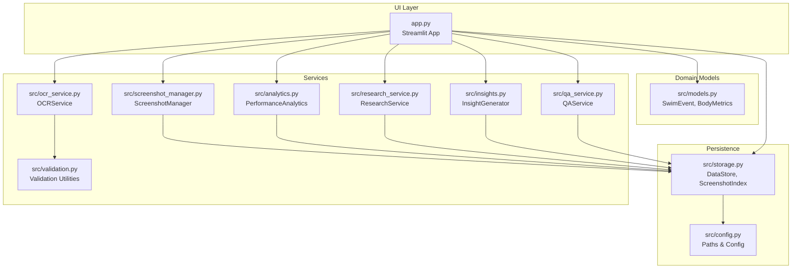
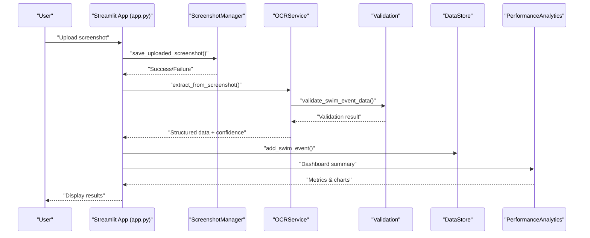
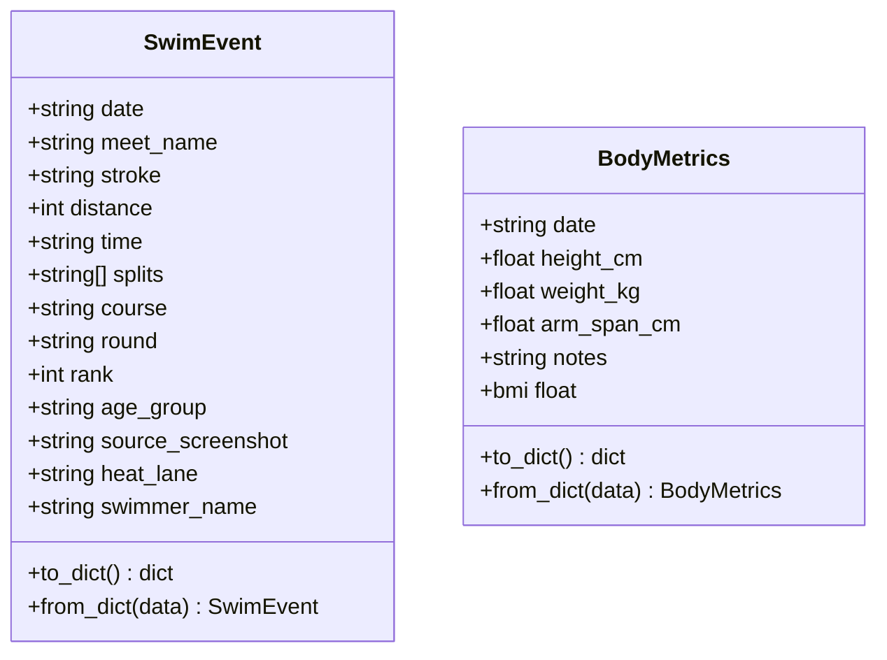
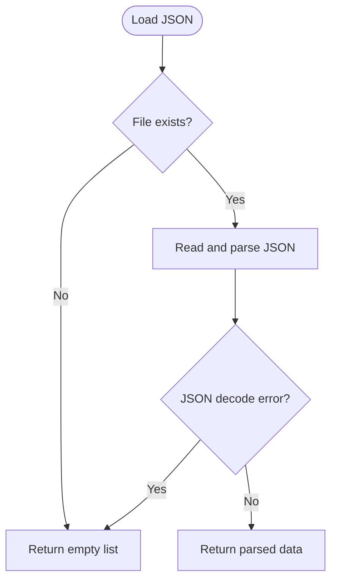
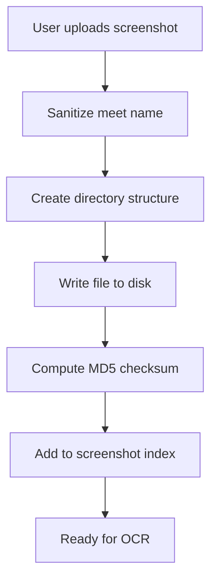
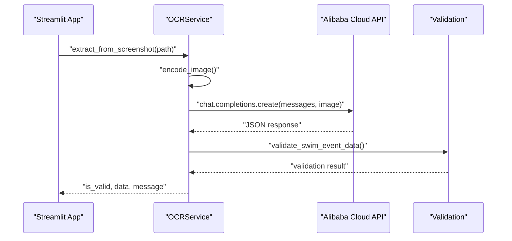
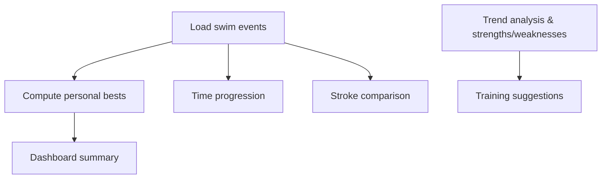
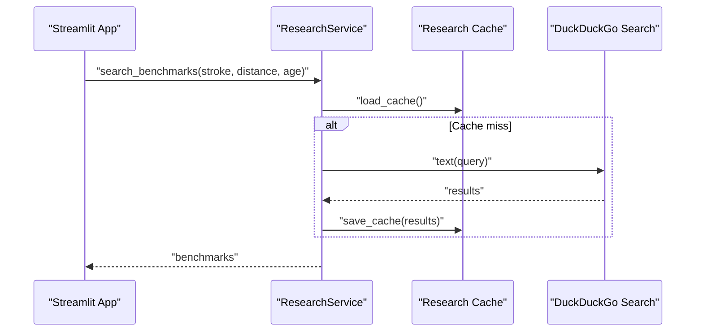
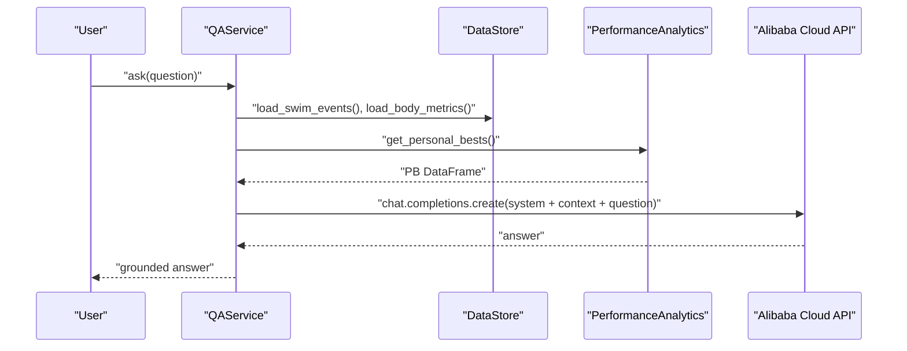
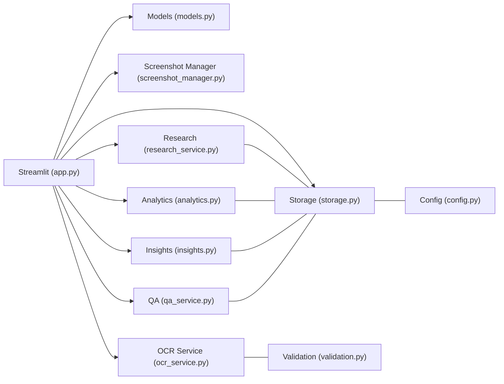

# Project Overview

<cite>
**Referenced Files in This Document**
- [README.md](file://README.md)
- [app.py](file://app.py)
- [requirements.txt](file://requirements.txt)
- [src/config.py](file://src/config.py)
- [src/models.py](file://src/models.py)
- [src/storage.py](file://src/storage.py)
- [src/screenshot_manager.py](file://src/screenshot_manager.py)
- [src/ocr_service.py](file://src/ocr_service.py)
- [src/validation.py](file://src/validation.py)
- [src/analytics.py](file://src/analytics.py)
- [src/research_service.py](file://src/research_service.py)
- [src/insights.py](file://src/insights.py)
- [src/qa_service.py](file://src/qa_service.py)
- [openspec/changes/sunny-swim-analysis-platform/design.md](file://openspec/changes/sunny-swim-analysis-platform/design.md)
</cite>

## Table of Contents
1. [Introduction](#introduction)
2. [Project Structure](#project-structure)
3. [Core Components](#core-components)
4. [Architecture Overview](#architecture-overview)
5. [Detailed Component Analysis](#detailed-component-analysis)
6. [Dependency Analysis](#dependency-analysis)
7. [Performance Considerations](#performance-considerations)
8. [Troubleshooting Guide](#troubleshooting-guide)
9. [Conclusion](#conclusion)

## Introduction
Sunny’s Swimming Data Analysis Platform is a local, AI-powered solution designed to track, analyze, and gain insights from swimming performance data. The platform focuses on transforming unstructured screenshots from swimming meets into structured, actionable insights. Its key value proposition lies in combining screenshot ingestion with AI-powered OCR to automate data extraction, enabling seamless tracking of race results, body metrics, and performance analytics.

Target audience:
- Swimming coaches who want quick access to structured performance data for training planning
- Athletes (young swimmers) and parents who seek transparent, visual progress tracking and benchmark comparisons
- Families managing a growing dataset of meet results and wanting a simple, local-first solution

Common challenges addressed:
- Manual transcription of meet results is time-consuming and error-prone
- Lack of centralized, structured data makes trend analysis difficult
- Difficulty comparing performance against published benchmarks
- Limited visibility into strengths, weaknesses, and training priorities

## Project Structure
The platform is organized as a Streamlit-based desktop application with a clear separation of concerns:
- UI and navigation: handled by the main application entry point
- Data models: typed dataclasses representing swim events and body metrics
- Persistence: file-based JSON storage for swim events, body metrics, and screenshot index
- Services: OCR extraction, analytics, research comparison, insights generation, and Q&A
- Configuration: environment-driven settings for AI providers and file paths

**Diagram sources**
- [app.py:1-447](file://app.py#L1-L447)
- [src/models.py:1-55](file://src/models.py#L1-L55)
- [src/storage.py:1-107](file://src/storage.py#L1-L107)
- [src/config.py:1-29](file://src/config.py#L1-L29)
- [src/screenshot_manager.py:1-136](file://src/screenshot_manager.py#L1-L136)
- [src/ocr_service.py:1-144](file://src/ocr_service.py#L1-L144)
- [src/validation.py:1-103](file://src/validation.py#L1-L103)
- [src/analytics.py:1-184](file://src/analytics.py#L1-L184)
- [src/research_service.py:1-94](file://src/research_service.py#L1-L94)
- [src/insights.py:1-150](file://src/insights.py#L1-L150)
- [src/qa_service.py:1-174](file://src/qa_service.py#L1-L174)

**Section sources**
- [README.md:1-63](file://README.md#L1-L63)
- [app.py:1-447](file://app.py#L1-L447)
- [src/config.py:1-29](file://src/config.py#L1-L29)

## Core Components
- Data models: SwimEvent and BodyMetrics define the core entities for race results and body metrics, respectively. They include conversion helpers and computed fields such as BMI.
- Storage: DataStore persists swim events and body metrics as JSON; ScreenshotIndex tracks screenshot metadata and duplicates.
- Screenshot ingestion: ScreenshotManager organizes uploads, detects duplicates, computes checksums, and provides thumbnails for the gallery.
- OCR extraction: OCRService integrates with Alibaba Cloud Model Studio to extract structured race data from screenshots using a vision-language model.
- Analytics: PerformanceAnalytics computes time progression, stroke comparisons, personal bests, and dashboard summaries.
- Research comparison: ResearchService searches for benchmarks and compares personal bests against published references.
- Insights: InsightGenerator identifies trends, strengths/weaknesses, and generates training suggestions.
- Q&A: QAService answers natural language questions grounded in the stored data and analytics.

**Section sources**
- [src/models.py:1-55](file://src/models.py#L1-L55)
- [src/storage.py:1-107](file://src/storage.py#L1-L107)
- [src/screenshot_manager.py:1-136](file://src/screenshot_manager.py#L1-L136)
- [src/ocr_service.py:1-144](file://src/ocr_service.py#L1-L144)
- [src/analytics.py:1-184](file://src/analytics.py#L1-L184)
- [src/research_service.py:1-94](file://src/research_service.py#L1-L94)
- [src/insights.py:1-150](file://src/insights.py#L1-L150)
- [src/qa_service.py:1-174](file://src/qa_service.py#L1-L174)

## Architecture Overview
The platform follows a modular, file-based architecture:
- UI: Streamlit renders pages for upload, gallery, body metrics, analytics, research, insights, and Q&A.
- Data ingestion: ScreenshotManager saves and indexes screenshots; OCRService extracts structured data.
- Data processing: Validation ensures data integrity; analytics and insights transform data into visualizations and recommendations.
- Data persistence: JSON files store swim events, body metrics, screenshot index, and research cache.
- AI services: Alibaba Cloud Model Studio powers OCR and Q&A via OpenAI-compatible client.

**Diagram sources**
- [app.py:60-127](file://app.py#L60-L127)
- [src/screenshot_manager.py:26-82](file://src/screenshot_manager.py#L26-L82)
- [src/ocr_service.py:49-119](file://src/ocr_service.py#L49-L119)
- [src/validation.py:75-103](file://src/validation.py#L75-L103)
- [src/storage.py:40-44](file://src/storage.py#L40-L44)
- [src/analytics.py:171-184](file://src/analytics.py#L171-L184)

## Detailed Component Analysis

### Data Models
The SwimEvent and BodyMetrics dataclasses encapsulate the primary entities:
- SwimEvent: includes date, meet name, stroke, distance, time, splits, course, round, rank, age group, heat/lane, swimmer name, and a source screenshot reference.
- BodyMetrics: includes date, height, weight, arm span, notes, and a computed BMI property.

**Diagram sources**
- [src/models.py:7-55](file://src/models.py#L7-L55)

**Section sources**
- [src/models.py:1-55](file://src/models.py#L1-L55)

### Storage Layer
DataStore provides JSON-based persistence for swim events and body metrics, with helper methods to load, save, and append records. ScreenshotIndex manages metadata for screenshots, including checksums for duplicate detection.

**Diagram sources**
- [src/storage.py:14-27](file://src/storage.py#L14-L27)

**Section sources**
- [src/storage.py:1-107](file://src/storage.py#L1-L107)

### Screenshot Ingestion
ScreenshotManager handles:
- Organizing screenshots by meet and date
- Duplicate detection via filename and checksum
- Thumbnail generation for gallery display
- Deletion with cleanup of empty directories

**Diagram sources**
- [src/screenshot_manager.py:26-82](file://src/screenshot_manager.py#L26-L82)

**Section sources**
- [src/screenshot_manager.py:1-136](file://src/screenshot_manager.py#L1-L136)

### OCR Data Extraction
OCRService leverages Alibaba Cloud Model Studio to extract structured race data from screenshots:
- Encodes images to base64
- Sends multimodal prompts to the vision-language model
- Parses and validates JSON responses
- Adds extraction confidence and error metadata

**Diagram sources**
- [src/ocr_service.py:49-119](file://src/ocr_service.py#L49-L119)
- [src/validation.py:75-103](file://src/validation.py#L75-L103)

**Section sources**
- [src/ocr_service.py:1-144](file://src/ocr_service.py#L1-L144)
- [src/validation.py:1-103](file://src/validation.py#L1-L103)

### Analytics and Insights
PerformanceAnalytics transforms swim events into visualizations and summaries:
- Time progression charts by stroke and distance
- Stroke comparison radar charts
- Personal bests computation
- Dashboard summaries

InsightGenerator:
- Generates trend insights with improvement/decline detection
- Identifies strengths and weaknesses by stroke
- Provides training suggestions and potential assessments

**Diagram sources**
- [src/analytics.py:171-184](file://src/analytics.py#L171-L184)
- [src/insights.py:14-149](file://src/insights.py#L14-L149)

**Section sources**
- [src/analytics.py:1-184](file://src/analytics.py#L1-L184)
- [src/insights.py:1-150](file://src/insights.py#L1-L150)

### Research Comparison
ResearchService:
- Searches for benchmarks using DuckDuckGo
- Caches results to reduce repeated searches
- Compares personal bests against benchmark references

**Diagram sources**
- [src/research_service.py:31-84](file://src/research_service.py#L31-L84)

**Section sources**
- [src/research_service.py:1-94](file://src/research_service.py#L1-L94)

### Q&A Service
QAService:
- Builds a structured data context from swim events, body metrics, and personal bests
- Classifies question types (personal best, trend, advice, etc.)
- Answers questions using Alibaba Cloud Model Studio with grounded responses and citation

**Diagram sources**
- [src/qa_service.py:76-135](file://src/qa_service.py#L76-L135)

**Section sources**
- [src/qa_service.py:1-174](file://src/qa_service.py#L1-L174)

## Dependency Analysis
Technology stack overview:
- UI: Streamlit for interactive dashboards, file uploads, and chat interface
- AI services: Alibaba Cloud Model Studio for OCR and Q&A via OpenAI-compatible client
- Data visualization: Plotly and Matplotlib for charts and graphs
- Web search: DuckDuckGo for benchmark discovery
- Local persistence: JSON files for swim events, body metrics, screenshot index, and research cache
- Environment configuration: Python dotenv for API keys and base URLs

**Diagram sources**
- [app.py:10-19](file://app.py#L10-L19)
- [requirements.txt:1-10](file://requirements.txt#L1-L10)
- [src/config.py:20-28](file://src/config.py#L20-L28)

**Section sources**
- [requirements.txt:1-10](file://requirements.txt#L1-L10)
- [src/config.py:1-29](file://src/config.py#L1-L29)

## Performance Considerations
- OCR latency: Expect network latency for Alibaba Cloud requests; spinner feedback improves UX during extraction.
- Visualization performance: Analytics charts scale with event count; consider filtering by stroke/distance to reduce rendering overhead.
- Search caching: ResearchService caches benchmark results to minimize repeated searches.
- File I/O: JSON reads/writes are lightweight for typical usage; avoid excessive re-renders by leveraging Streamlit session state.

## Troubleshooting Guide
- Missing API key: Ensure ALIBABA_CLOUD_API_KEY is set; the UI footer indicates API status.
- OCR failures: Verify the screenshot quality and format; check validation errors returned by OCRService.
- No data shown: Confirm that swim events and body metrics are persisted; use the data export/import UI to diagnose issues.
- Benchmark search errors: DuckDuckGo search may occasionally fail; retry or provide manual benchmark URLs via ResearchService.

**Section sources**
- [app.py:441-447](file://app.py#L441-L447)
- [src/ocr_service.py:55-56](file://src/ocr_service.py#L55-L56)
- [src/research_service.py:52-53](file://src/research_service.py#L52-L53)

## Conclusion
Sunny’s Swimming Data Analysis Platform delivers a practical, local-first solution for turning meet screenshots into structured insights. By combining screenshot ingestion with AI-powered OCR, the platform automates data extraction and enables powerful analytics, research comparison, and Q&A. Its modular design, file-based persistence, and intuitive UI make it accessible to coaches, athletes, and parents who want a streamlined way to track and improve swimming performance.