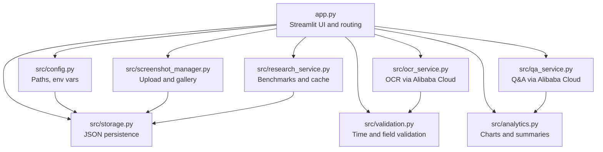
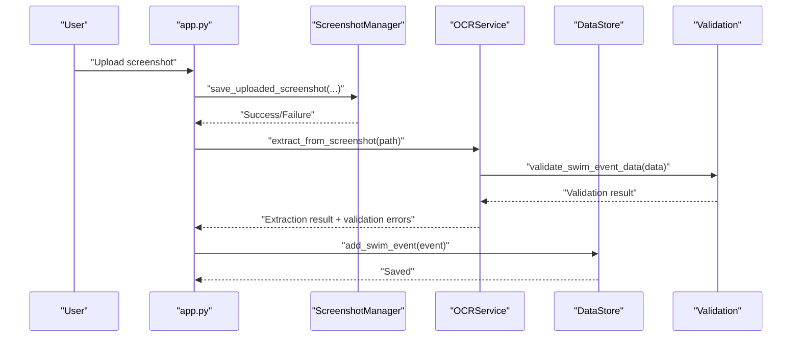

# Troubleshooting

<cite>
**Referenced Files in This Document**
- [README.md](file://README.md)
- [requirements.txt](file://requirements.txt)
- [app.py](file://app.py)
- [src/config.py](file://src/config.py)
- [src/ocr_service.py](file://src/ocr_service.py)
- [src/qa_service.py](file://src/qa_service.py)
- [src/storage.py](file://src/storage.py)
- [src/screenshot_manager.py](file://src/screenshot_manager.py)
- [src/validation.py](file://src/validation.py)
- [src/analytics.py](file://src/analytics.py)
- [src/research_service.py](file://src/research_service.py)
</cite>

## Table of Contents
1. [Introduction](#introduction)
2. [Project Structure](#project-structure)
3. [Core Components](#core-components)
4. [Architecture Overview](#architecture-overview)
5. [Detailed Component Analysis](#detailed-component-analysis)
6. [Dependency Analysis](#dependency-analysis)
7. [Performance Considerations](#performance-considerations)
8. [Troubleshooting Guide](#troubleshooting-guide)
9. [Conclusion](#conclusion)
10. [Appendices](#appendices)

## Introduction
This document provides comprehensive troubleshooting guidance for the Swimming Data Analysis Platform. It focuses on installation and setup issues, OCR processing failures, performance optimization for large datasets, debugging research integration and Q&A response problems, and resolving data corruption, storage permission issues, and file organization concerns. It also includes error message interpretation workflows, logging strategies, diagnostic commands, and escalation procedures.

## Project Structure
The platform is a Streamlit-based application with modular components for configuration, OCR, storage, analytics, research, and Q&A. Key directories and files include:
- Application entry point and UI routing
- Configuration and environment variables
- OCR and Q&A services using Alibaba Cloud APIs
- Local JSON-based storage for swim events, body metrics, and screenshot index
- Analytics and research services for benchmarking and insights
- Validation utilities for time formats and data integrity

**Diagram sources**
- [app.py](file://app.py)
- [src/config.py](file://src/config.py)
- [src/storage.py](file://src/storage.py)
- [src/screenshot_manager.py](file://src/screenshot_manager.py)
- [src/ocr_service.py](file://src/ocr_service.py)
- [src/qa_service.py](file://src/qa_service.py)
- [src/analytics.py](file://src/analytics.py)
- [src/research_service.py](file://src/research_service.py)
- [src/validation.py](file://src/validation.py)

**Section sources**
- [README.md](file://README.md)
- [requirements.txt](file://requirements.txt)
- [app.py](file://app.py)
- [src/config.py](file://src/config.py)

## Core Components
- Configuration and Paths: Environment variables for Alibaba Cloud credentials and base URL; data directories and file paths; time format regex patterns.
- OCR Service: Encodes images, sends requests to Alibaba Cloud Qwen vision-language model, parses JSON, validates data, and attaches confidence and error metadata.
- Q&A Service: Builds structured context from swim events and body metrics, classifies query types, and answers using Alibaba Cloud Qwen text model.
- Storage Layer: Loads and saves swim events and body metrics as JSON; manages screenshot index with checksum deduplication.
- Screenshot Manager: Handles upload, duplicate detection by filename and checksum, thumbnail generation, deletion, and cleanup of empty directories.
- Analytics: Converts times to seconds, computes personal bests, time progression charts, stroke comparisons, and dashboard summaries.
- Research Service: DuckDuckGo search for benchmarks with caching to reduce network overhead.
- Validation Utilities: Validates time formats (MM:SS.ss or SS.ss), required fields, and converts between time formats.

**Section sources**
- [src/config.py](file://src/config.py)
- [src/ocr_service.py](file://src/ocr_service.py)
- [src/qa_service.py](file://src/qa_service.py)
- [src/storage.py](file://src/storage.py)
- [src/screenshot_manager.py](file://src/screenshot_manager.py)
- [src/analytics.py](file://src/analytics.py)
- [src/research_service.py](file://src/research_service.py)
- [src/validation.py](file://src/validation.py)

## Architecture Overview
The application orchestrates UI pages via Streamlit, delegates OCR and Q&A to Alibaba Cloud APIs, persists data locally, and performs analytics and research comparisons.

**Diagram sources**
- [app.py](file://app.py)
- [src/screenshot_manager.py](file://src/screenshot_manager.py)
- [src/ocr_service.py](file://src/ocr_service.py)
- [src/storage.py](file://src/storage.py)
- [src/validation.py](file://src/validation.py)

## Detailed Component Analysis

### OCR Processing Failures
Common failure modes and resolutions:
- API key not configured: The service checks for the presence of the Alibaba Cloud API key and returns a descriptive message if missing.
- Network/API connectivity issues: The client call may raise exceptions; the service catches and returns a failure message.
- JSON parsing errors: The service strips markdown fences and attempts to parse JSON; if invalid, it returns raw content and a parse error message.
- Data validation errors: Even if extraction succeeds, validation may fail for required fields or time formats; the service attaches validation errors to the returned data.

Recommended actions:
- Verify environment variable configuration before uploading.
- Retry after ensuring internet connectivity.
- Inspect the raw response attached to the returned data for debugging.
- Confirm image format compatibility and readability.

**Section sources**
- [src/ocr_service.py](file://src/ocr_service.py)
- [src/validation.py](file://src/validation.py)
- [src/config.py](file://src/config.py)

### Q&A Response Issues
Common issues and resolutions:
- API key not configured: The service checks for the API key and returns a clear message.
- Out-of-scope queries: The classifier rejects non-swimming-related questions and prompts the user to ask about swimming data.
- Conversation history: The service maintains a recent history to improve follow-ups; clearing history can resolve stale context issues.
- API errors: Exceptions during completion generation are caught and surfaced as user-facing messages.

Recommended actions:
- Ensure the API key is set and the base URL is correct.
- Restrict questions to swimming-related terms.
- Clear chat history if answers seem off-topic or stale.

**Section sources**
- [src/qa_service.py](file://src/qa_service.py)
- [src/config.py](file://src/config.py)

### Data Corruption and Storage Permission Problems
Symptoms:
- Empty or malformed JSON files.
- Failure to write or read data files.
- Missing or corrupted cache entries.

Root causes and fixes:
- JSON decode errors: The storage layer catches JSON decode errors and falls back to empty data; check file permissions and disk health.
- IO errors: The storage layer catches IO errors; verify write permissions to the data directory.
- Cache corruption: Research cache is JSON-backed; if corrupted, remove or recreate the cache file.

Diagnostic steps:
- Check file existence and permissions for data files and directories.
- Validate JSON syntax using external tools if necessary.
- Rebuild cache by removing the research cache file.

**Section sources**
- [src/storage.py](file://src/storage.py)
- [src/research_service.py](file://src/research_service.py)
- [src/config.py](file://src/config.py)

### File Organization and Duplicate Detection
Issues:
- Duplicate uploads by filename or content.
- Thumbnail generation failures.
- Inconsistent metadata in the screenshot index.

Resolutions:
- Filename duplicates are prevented before saving; checksum-based deduplication removes redundant files.
- Thumbnail generation handles missing or unreadable files gracefully.
- Index updates are atomic per operation; removal cleans up empty directories.

**Section sources**
- [src/screenshot_manager.py](file://src/screenshot_manager.py)
- [src/storage.py](file://src/storage.py)

### Analytics Calculation Slowness
Causes:
- Large datasets leading to expensive computations (e.g., time progression, stroke comparisons).
- Converting times to seconds and sorting operations on large DataFrames.

Optimization strategies:
- Precompute and cache derived metrics (e.g., time in seconds) to avoid repeated conversions.
- Paginate or filter data for charts to limit rendering workload.
- Use efficient grouping and aggregation patterns; avoid unnecessary copies of DataFrames.
- Persist intermediate results to reduce recomputation.

**Section sources**
- [src/analytics.py](file://src/analytics.py)
- [src/validation.py](file://src/validation.py)

### Research Integration Failures
Symptoms:
- Benchmark search returns an error result.
- Cache misses cause repeated network calls.

Resolutions:
- DuckDuckGo search may fail due to network or rate limits; retry later.
- Use cached results when available to minimize network calls.
- Manually add benchmark URLs to the cache for quick access.

**Section sources**
- [src/research_service.py](file://src/research_service.py)
- [src/config.py](file://src/config.py)

## Dependency Analysis
External dependencies and their roles:
- Streamlit: UI framework and session state management.
- Pandas/Plotly: Data processing and visualization.
- Pillow: Image thumbnail generation.
- DuckDuckGo Search: Web search for benchmarks.
- OpenAI client: Calls to Alibaba Cloud Model Studio endpoints.
- python-dotenv: Optional for loading environment variables from a file.

Potential conflicts:
- Version mismatches in plotting or data libraries can affect chart rendering.
- OpenAI client version differences may impact API compatibility.

Resolution:
- Pin compatible versions as per requirements.
- Isolate environment using virtual environments or containers.

**Section sources**
- [requirements.txt](file://requirements.txt)
- [README.md](file://README.md)

## Performance Considerations
- Limit concurrent heavy operations (e.g., OCR on many images) to avoid timeouts.
- Cache research results to reduce repeated web searches.
- Optimize analytics by precomputing time conversions and filtering early.
- Use smaller thumbnails for gallery rendering.
- Batch operations where possible (e.g., bulk saves).

[No sources needed since this section provides general guidance]

## Troubleshooting Guide

### Installation and Setup Issues
- Missing dependencies:
  - Symptom: Import errors or runtime errors when launching the app.
  - Action: Install dependencies using the provided requirements file and run the app with Streamlit.
  - Reference: [README.md](file://README.md), [requirements.txt](file://requirements.txt)

- Environment variable problems:
  - Symptom: API status shows unconfigured key; OCR/Q&A fails immediately.
  - Action: Set the Alibaba Cloud API key and base URL environment variables before running the app.
  - Reference: [app.py](file://app.py), [src/config.py](file://src/config.py)

- API key configuration errors:
  - Symptom: Explicit warnings about missing API key in the UI footer.
  - Action: Verify the key is exported and accessible to the process; restart the app after setting the variable.
  - Reference: [app.py](file://app.py), [src/ocr_service.py](file://src/ocr_service.py), [src/qa_service.py](file://src/qa_service.py)

### OCR Processing Failures
- Image format issues:
  - Symptom: Extraction fails or returns raw content; thumbnails fail to render.
  - Action: Ensure images are readable PNG/JPG; verify file integrity and permissions.
  - Reference: [src/screenshot_manager.py](file://src/screenshot_manager.py), [src/ocr_service.py](file://src/ocr_service.py)

- API connectivity problems:
  - Symptom: Extraction returns a failure message indicating network/API errors.
  - Action: Retry after verifying network connectivity; check base URL and API key.
  - Reference: [src/ocr_service.py](file://src/ocr_service.py), [src/config.py](file://src/config.py)

- Data extraction errors:
  - Symptom: Extraction succeeds but validation fails; validation errors are attached to the returned data.
  - Action: Review validation errors and correct OCR output fields (e.g., time format).
  - Reference: [src/ocr_service.py](file://src/ocr_service.py), [src/validation.py](file://src/validation.py)

### Q&A Response Issues
- API key not configured:
  - Symptom: Immediate warning that the API key is not configured.
  - Action: Set the API key and restart the app.
  - Reference: [src/qa_service.py](file://src/qa_service.py), [src/config.py](file://src/config.py)

- Out-of-scope questions:
  - Symptom: Generic message stating the assistant only answers swimming-related questions.
  - Action: Reframe the question to include swimming terms.
  - Reference: [src/qa_service.py](file://src/qa_service.py)

- Stale or incorrect answers:
  - Symptom: Answers lack context or contradict recent data.
  - Action: Clear chat history to reset conversation context.
  - Reference: [src/qa_service.py](file://src/qa_service.py)

### Data Corruption, Storage Permissions, and File Organization
- Symptoms: Empty dashboards, missing events/metrics, or cache errors.
- Actions:
  - Check data file existence and permissions under the data directory.
  - Validate JSON syntax; rebuild corrupted files if necessary.
  - Remove research cache file to regenerate cached results.
- References:
  - [src/storage.py](file://src/storage.py)
  - [src/research_service.py](file://src/research_service.py)
  - [src/config.py](file://src/config.py)

### Analytics Calculation Slowness
- Symptoms: Slow chart rendering or dashboard load times.
- Actions:
  - Reduce dataset size for charts or apply filters.
  - Precompute time conversions and reuse computed columns.
  - Cache intermediate results to avoid recomputation.
- Reference: [src/analytics.py](file://src/analytics.py)

### Logging Strategies and Diagnostic Commands
- Enable verbose logs for the OpenAI client if needed to capture request/response details.
- Use shell commands to inspect data files and directories:
  - List data directory contents and permissions.
  - Validate JSON syntax for data files.
  - Check environment variables from the shell.
- References:
  - [src/config.py](file://src/config.py)
  - [src/storage.py](file://src/storage.py)

### Error Message Interpretation and Resolution Workflows
- OCR extraction failed:
  - Interpretation: API key missing or network/API error; JSON parse error; validation errors.
  - Resolution: Set API key, verify connectivity, review raw response, fix time formats.
  - References: [src/ocr_service.py](file://src/ocr_service.py), [src/validation.py](file://src/validation.py)

- Q&A error:
  - Interpretation: API key missing; out-of-scope query; API exception.
  - Resolution: Set API key, rephrase question, clear chat history.
  - References: [src/qa_service.py](file://src/qa_service.py)

- Storage/read error:
  - Interpretation: JSON decode or IO errors; cache corruption.
  - Resolution: Fix permissions, validate JSON, remove corrupted cache.
  - References: [src/storage.py](file://src/storage.py), [src/research_service.py](file://src/research_service.py)

### Support Escalation Procedures
- Capture environment details:
  - Python version, installed packages, and versions.
  - Environment variables related to Alibaba Cloud configuration.
- Collect artifacts:
  - Screenshots causing OCR issues.
  - Raw OCR responses and validation errors.
  - Logs from the app run.
- Provide reproducible steps:
  - Exact sequence of actions leading to failure.
  - Sample data files and cache state if applicable.

[No sources needed since this section provides general guidance]

## Conclusion
This guide consolidates actionable troubleshooting steps for the Swimming Data Analysis Platform, covering installation, OCR/Q&A reliability, performance tuning, and operational resilience. By validating environment configuration, inspecting storage integrity, and applying targeted optimizations, most issues can be resolved quickly. For persistent problems, collect diagnostic artifacts and escalate with reproducible steps and environment details.

[No sources needed since this section summarizes without analyzing specific files]

## Appendices

### Quick Checklist
- Dependencies installed and compatible.
- API key and base URL configured.
- Data directory writable and JSON files valid.
- Images readable and properly formatted.
- Cache cleared if corrupted.
- Analytics filtered for large datasets.

[No sources needed since this section provides general guidance]